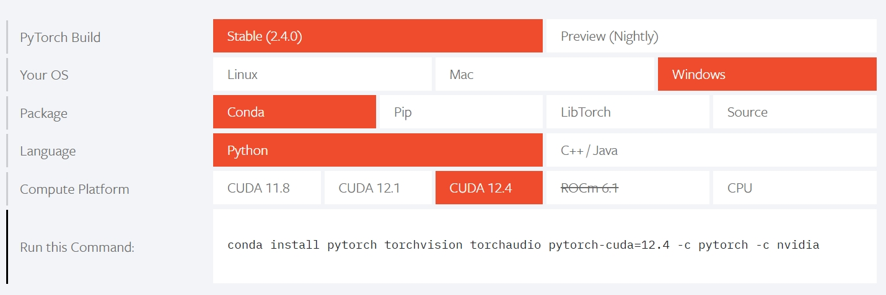
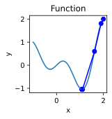
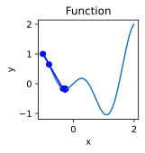
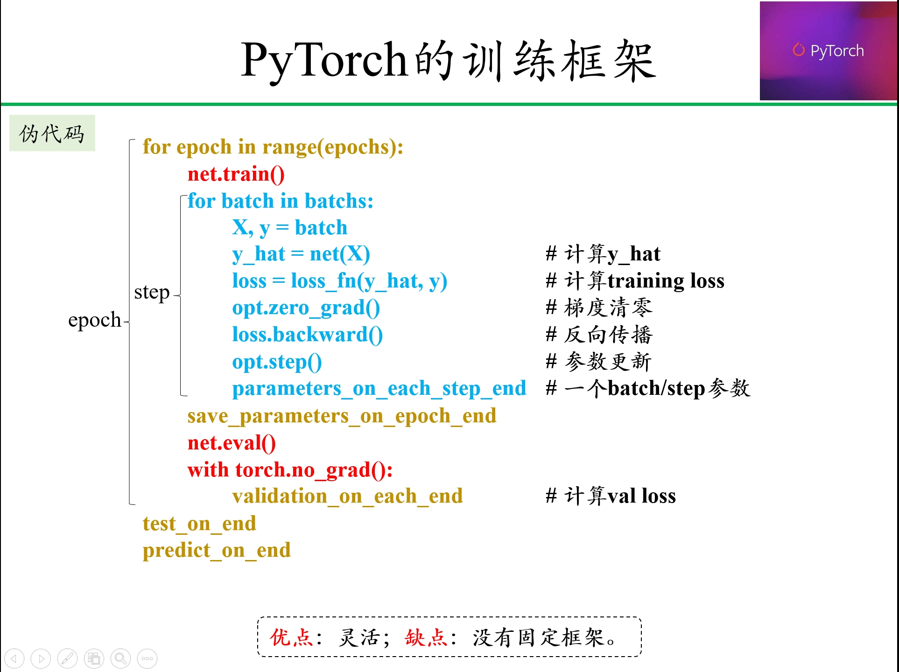
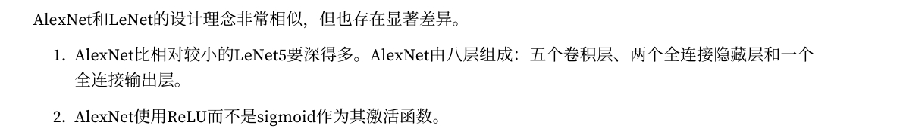
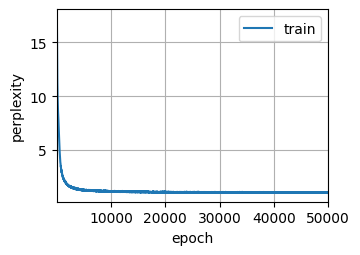
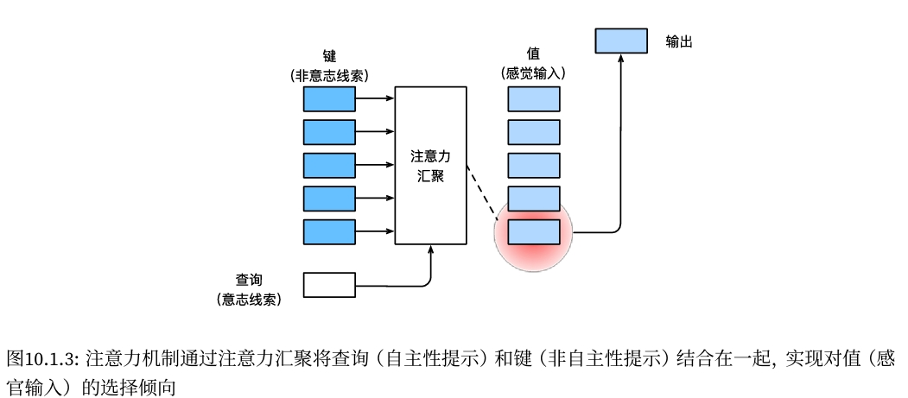
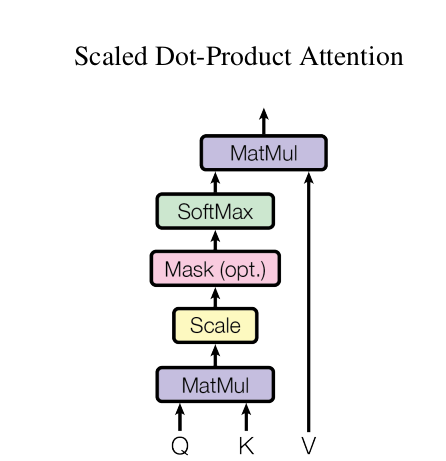
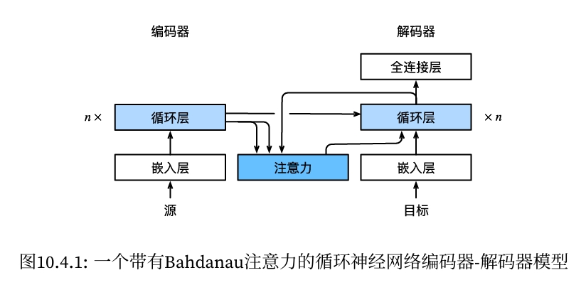
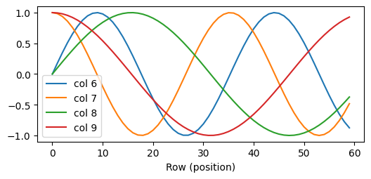

**Table of contents**<a id='toc0_'></a>    
- 1. [概述](#toc1_)    
- 2. [环境配置](#toc2_)    
- 3. [utils](#toc3_)    
  - 3.1. [deepspore](#toc3_1_)    
  - 3.2. [save to utils.py](#toc3_2_)    
  - 3.3. [实验可重复性](#toc3_3_)    
  - 3.4. [Metrics和Visualization](#toc3_4_)    
    - 3.4.1. [Metrics tracker](#toc3_4_1_)    
    - 3.4.2. [可视化](#toc3_4_2_)    
  - 3.5. [GPU](#toc3_5_)    
  - 3.6. [Timer](#toc3_6_)    
    - 3.6.1. [CPU计时器](#toc3_6_1_)    
    - 3.6.2. [gpu计时器](#toc3_6_2_)    
  - 3.7. [Callback](#toc3_7_)    
  - 3.8. [Trainer](#toc3_8_)    
  - 3.9. [ParametersSize](#toc3_9_)    
  - 3.10. [numpy和pytorch计算速度比较](#toc3_10_)    
- 4. [安装GPU驱动](#toc4_)    
  - 4.1. [安装策略](#toc4_1_)    
  - 4.2. [首先确认内核版本和发行版本，再确认显卡型号](#toc4_2_)    
  - 4.3. [安装驱动-CUDA Driver](#toc4_3_)    
    - 4.3.1. [下载CUDA Driver](#toc4_3_1_)    
    - 4.3.2. [禁用nouveau](#toc4_3_2_)    
    - 4.3.3. [安装CUDA Driver](#toc4_3_3_)    
    - 4.3.4. [查看显卡是否安装成功](#toc4_3_4_)    
    - 4.3.5. [查看nvcc](#toc4_3_5_)    
  - 4.4. [全局驱动和全局CUDA Toolkit和CuDNN](#toc4_4_)    
    - 4.4.1. [下载对应的CUDA Toolkit版本](#toc4_4_1_)    
    - 4.4.2. [安装CUDA Toolkit](#toc4_4_2_)    
    - 4.4.3. [下载对应的CuDNN](#toc4_4_3_)    
    - 4.4.4. [安装CuDNN](#toc4_4_4_)    
  - 4.5. [安装对应版本的Pytorch](#toc4_5_)    
  - 4.6. [全局驱动个人CUDA Toolkit](#toc4_6_)    
  - 4.7. [GPU测试程序](#toc4_7_)    
    - 4.7.1. [在GPU上验证Trainer](#toc4_7_1_)    
    - 4.7.2. [GPU burn压力测试](#toc4_7_2_)    
- 5. [Pytorch模块介绍](#toc5_)    
  - 5.1. [导入模块](#toc5_1_)    
- 6. [数据封装和加载](#toc6_)    
  - 6.1. [torchvison.datasets获得Dataset](#toc6_1_)    
  - 6.2. [Dataset](#toc6_2_)    
    - 6.2.1. [TensorDataset()](#toc6_2_1_)    
    - 6.2.2. [重载Dataset类](#toc6_2_2_)    
    - 6.2.3. [Pytoch.utils.data.Dataset类分析和总结](#toc6_2_3_)    
    - 6.2.4. [Subset](#toc6_2_4_)    
    - 6.2.5. [random_split](#toc6_2_5_)    
    - 6.2.6. [ConcateDataset](#toc6_2_6_)    
    - 6.2.7. [IterableDataset](#toc6_2_7_)    
      - 6.2.7.1. [流式数据加载](#toc6_2_7_1_)    
      - 6.2.7.2. [动态生成数据](#toc6_2_7_2_)    
      - 6.2.7.3. [无限数据流](#toc6_2_7_3_)    
      - 6.2.7.4. [多线程数据加载与分布式支持](#toc6_2_7_4_)    
      - 6.2.7.5. [使用注意事项](#toc6_2_7_5_)    
  - 6.3. [DataLoader](#toc6_3_)    
    - 6.3.1. [估计数据加载时间](#toc6_3_1_)    
    - 6.3.2. [collate_fn处理不等长tensor](#toc6_3_2_)    
    - 6.3.3. [重载DataLoader](#toc6_3_3_)    
- 7. [张量(Tensors)](#toc7_)    
  - 7.1. [Tensors定义](#toc7_1_)    
  - 7.2. [Tensors属性](#toc7_2_)    
    - 7.2.1. [数据类型(dtype)](#toc7_2_1_)    
      - 7.2.1.1. [转化格式](#toc7_2_1_1_)    
    - 7.2.2. [设备(device)](#toc7_2_2_)    
    - 7.2.3. [维度(size/shape)](#toc7_2_3_)    
      - 7.2.3.1. [标量](#toc7_2_3_1_)    
      - 7.2.3.2. [一维张量](#toc7_2_3_2_)    
      - 7.2.3.3. [多维张量](#toc7_2_3_3_)    
    - 7.2.4. [特殊的一维张量](#toc7_2_4_)    
      - 7.2.4.1. [一维张量的例子](#toc7_2_4_1_)    
      - 7.2.4.2. [区分行向量和列向量](#toc7_2_4_2_)    
        - 7.2.4.2.1. [示例](#toc7_2_4_2_1_)    
      - 7.2.4.3. [小结](#toc7_2_4_3_)    
  - 7.3. [Tensors操作](#toc7_3_)    
    - 7.3.1. [索引和切片](#toc7_3_1_)    
    - 7.3.2. [修改维度](#toc7_3_2_)    
      - 7.3.2.1. [[: None], [None, :]                           ](#toc7_3_2_1_)    
      - 7.3.2.2. [reshape函数](#toc7_3_2_2_)    
      - 7.3.2.3. [view函数](#toc7_3_2_3_)    
      - 7.3.2.4. [transpose函数](#toc7_3_2_4_)    
        - 7.3.2.4.1. [二维](#toc7_3_2_4_1_)    
        - 7.3.2.4.2. [三维](#toc7_3_2_4_2_)    
      - 7.3.2.5. [permute函数](#toc7_3_2_5_)    
        - 7.3.2.5.1. [二维](#toc7_3_2_5_1_)    
        - 7.3.2.5.2. [三维](#toc7_3_2_5_2_)    
      - 7.3.2.6. [unsqueeze函数增加维度](#toc7_3_2_6_)    
        - 7.3.2.6.1. [1维](#toc7_3_2_6_1_)    
        - 7.3.2.6.2. [多维度](#toc7_3_2_6_2_)    
      - 7.3.2.7. [squeeze函数减少维度](#toc7_3_2_7_)    
      - 7.3.2.8. [拼接 (concat)](#toc7_3_2_8_)    
      - 7.3.2.9. [拆分 (split)](#toc7_3_2_9_)    
      - 7.3.2.10. [分块 (chunk)](#toc7_3_2_10_)    
      - 7.3.2.11. [拼接 (stack)](#toc7_3_2_11_)    
        - 7.3.2.11.1. [cat和stack的比较](#toc7_3_2_11_1_)    
      - 7.3.2.12. [广播 (expand)](#toc7_3_2_12_)    
      - 7.3.2.13. [repeat](#toc7_3_2_13_)    
      - 7.3.2.14. [repeat_interleave](#toc7_3_2_14_)    
        - 7.3.2.14.1. [expand和repeat对比](#toc7_3_2_14_1_)    
      - 7.3.2.15. [填充padding和打包packing](#toc7_3_2_15_)    
  - 7.4. [线性代数运算](#toc7_4_)    
    - 7.4.1. [数值运算](#toc7_4_1_)    
    - 7.4.2. [数值运算-乘法](#toc7_4_2_)    
      - 7.4.2.1. [哈达玛积](#toc7_4_2_1_)    
      - 7.4.2.2. [点积（Dot Product）](#toc7_4_2_2_)    
      - 7.4.2.3. [矩阵-向量积](#toc7_4_2_3_)    
      - 7.4.2.4. [矩阵-矩阵积](#toc7_4_2_4_)    
      - 7.4.2.5. [批量矩阵乘法](#toc7_4_2_5_)    
      - 7.4.2.6. [乘总结](#toc7_4_2_6_)    
    - 7.4.3. [统计运算](#toc7_4_3_)    
  - 7.5. [广播机制 (Broadcasting)](#toc7_5_)    
    - 7.5.1. [广播规则](#toc7_5_1_)    
  - 7.6. [Pytorch的计算图 和 自动微分 (autograd)](#toc7_6_)    
    - 7.6.1. [反向传播 (backward)-批量求梯度，但未进行参数更新](#toc7_6_1_)    
    - 7.6.2. [仅计算梯度 (求导计算)](#toc7_6_2_)    
  - 7.7. [自动微积-autograd](#toc7_7_)    
    - 7.7.1. [自己探索](#toc7_7_1_)    
      - 7.7.1.1. [标量-一阶导数（得标量）](#toc7_7_1_1_)    
      - 7.7.1.2. [标量/向量-一阶导数（得向量）](#toc7_7_1_2_)    
      - 7.7.1.3. [向量/向量-一阶导数（得矩阵）](#toc7_7_1_3_)    
      - 7.7.1.4. [求高阶导数](#toc7_7_1_4_)    
    - 7.7.2. [一个简单的例子](#toc7_7_2_)    
    - 7.7.3. [计算另一个](#toc7_7_3_)    
    - 7.7.4. [非标量变量的反向传播](#toc7_7_4_)    
    - 7.7.5. [分离计算](#toc7_7_5_)    
    - 7.7.6. [Python控制流的梯度计算](#toc7_7_6_)    
  - 7.8. [概率论](#toc7_8_)    
- 8. [神经网络-训练八股](#toc8_)    
  - 8.1. [现线性回归模型于训练过程-从零开始](#toc8_1_)    
    - 8.1.1. [虚拟出数据](#toc8_1_1_)    
    - 8.1.2. [读取数据](#toc8_1_2_)    
    - 8.1.3. [初始化模型参数](#toc8_1_3_)    
    - 8.1.4. [定义模型](#toc8_1_4_)    
    - 8.1.5. [定义损失函数](#toc8_1_5_)    
    - 8.1.6. [定义优化算法](#toc8_1_6_)    
    - 8.1.7. [训练](#toc8_1_7_)    
  - 8.2. [现线性回归模型于训练过程-简洁实现](#toc8_2_)    
    - 8.2.1. [虚拟数据](#toc8_2_1_)    
    - 8.2.2. [读取数据](#toc8_2_2_)    
    - 8.2.3. [定义模型](#toc8_2_3_)    
    - 8.2.4. [初始化模型参数](#toc8_2_4_)    
    - 8.2.5. [定义损失函数](#toc8_2_5_)    
    - 8.2.6. [定义优化算法](#toc8_2_6_)    
    - 8.2.7. [训练](#toc8_2_7_)    
    - 8.2.8. [参数保存](#toc8_2_8_)    
    - 8.2.9. [重载](#toc8_2_9_)    
  - 8.3. [分类-softmax](#toc8_3_)    
    - 8.3.1. [快速实现](#toc8_3_1_)    
    - 8.3.2. [从头实现](#toc8_3_2_)    
    - 8.3.3. [交叉熵损失](#toc8_3_3_)    
  - 8.4. [专题-模型定义（计算预测值y_hat）](#toc8_4_)    
    - 8.4.1. [块：torch.nn模块](#toc8_4_1_)    
      - 8.4.1.1. [Sequential、ModuleList、ModuleDict](#toc8_4_1_1_)    
      - 8.4.1.2. [比较](#toc8_4_1_2_)    
    - 8.4.2. [块：自定义](#toc8_4_2_)    
      - 8.4.2.1. [自定义块](#toc8_4_2_1_)    
      - 8.4.2.2. [顺序块](#toc8_4_2_2_)    
      - 8.4.2.3. [效率](#toc8_4_2_3_)    
    - 8.4.3. [模型结构/组成](#toc8_4_3_)    
      - 8.4.3.1. [.children()](#toc8_4_3_1_)    
      - 8.4.3.2. [.named_children()](#toc8_4_3_2_)    
      - 8.4.3.3. [.modules()](#toc8_4_3_3_)    
      - 8.4.3.4. [.named_modules()](#toc8_4_3_4_)    
      - 8.4.3.5. [删除和添加](#toc8_4_3_5_)    
      - 8.4.3.6. [替换](#toc8_4_3_6_)    
      - 8.4.3.7. [add_module()](#toc8_4_3_7_)    
    - 8.4.4. [模型：参数管理](#toc8_4_4_)    
      - 8.4.4.1. [参数访问](#toc8_4_4_1_)    
        - 8.4.4.1.1. [state_dict](#toc8_4_4_1_1_)    
        - 8.4.4.1.2. [parameters](#toc8_4_4_1_2_)    
        - 8.4.4.1.3. [named_parameters](#toc8_4_4_1_3_)    
      - 8.4.4.2. [参数初始化](#toc8_4_4_2_)    
        - 8.4.4.2.1. [内置初始化](#toc8_4_4_2_1_)    
        - 8.4.4.2.2. [自定义初始化](#toc8_4_4_2_2_)    
        - 8.4.4.2.3. [参数绑定](#toc8_4_4_2_3_)    
    - 8.4.5. [层：自定义](#toc8_4_5_)    
      - 8.4.5.1. [不带参数的层](#toc8_4_5_1_)    
      - 8.4.5.2. [带参数的层](#toc8_4_5_2_)    
  - 8.5. [专题-损失函数 (loss_fn)](#toc8_5_)    
    - 8.5.1. [均方误差](#toc8_5_1_)    
    - 8.5.2. [交叉熵](#toc8_5_2_)    
      - 8.5.2.1. [快速实现](#toc8_5_2_1_)    
      - 8.5.2.2. [从头实现](#toc8_5_2_2_)    
    - 8.5.3. [自定义](#toc8_5_3_)    
  - 8.6. [专题-反向传播（求梯度）](#toc8_6_)    
  - 8.7. [专题-更新权重（优化算法）](#toc8_7_)    
    - 8.7.1. [小批量随机梯度下降（SGD）](#toc8_7_1_)    
    - 8.7.2. [adam](#toc8_7_2_)    
    - 8.7.3. [RMSprop](#toc8_7_3_)    
    - 8.7.4. [学习率调度器](#toc8_7_4_)    
      - 8.7.4.1. [StepLR： 按照固定的步长调整学习率](#toc8_7_4_1_)    
      - 8.7.4.2. [MultiStepLR： 在指定的里程碑（milestones）上调整学习率](#toc8_7_4_2_)    
      - 8.7.4.3. [ExponentialLR： 以指数衰减的方式调整学习率](#toc8_7_4_3_)    
      - 8.7.4.4. [CosineAnnealingLR： 余弦退火调整学习率](#toc8_7_4_4_)    
      - 8.7.4.5. [ReduceLROnPlateau： 当指标停止改善时，降低学习率](#toc8_7_4_5_)    
      - 8.7.4.6. [LambdaLR： 使用自定义的函数来调整学习率](#toc8_7_4_6_)    
      - 8.7.4.7. [自定义](#toc8_7_4_7_)    
  - 8.8. [专题-训练](#toc8_8_)    
    - 8.8.1. [开始训练](#toc8_8_1_)    
    - 8.8.2. [自己探索](#toc8_8_2_)    
      - 8.8.2.1. [lr的影响](#toc8_8_2_1_)    
      - 8.8.2.2. [不同模型的效率](#toc8_8_2_2_)    
    - 8.8.3. [K折交叉验证](#toc8_8_3_)    
  - 8.9. [可视化训练过程](#toc8_9_)    
- 9. [在 GPU 上训练](#toc9_)    
  - 9.1. [查看GPU配置](#toc9_1_)    
  - 9.2. [单机单卡（GPU）](#toc9_2_)    
  - 9.3. [单机多卡（GPU）](#toc9_3_)    
    - 9.3.1. [DP](#toc9_3_1_)    
    - 9.3.2. [DDP](#toc9_3_2_)    
      - 9.3.2.1. [在colab上测试可用](#toc9_3_2_1_)    
  - 9.4. [多机多卡（GPU）- 分布式训练](#toc9_4_)    
- 10. [模型和参数的保存与加载](#toc10_)    
  - 10.1. [加载和保存-张量](#toc10_1_)    
  - 10.2. [加载和保存-模型参数](#toc10_2_)    
  - 10.3. [safetensor](#toc10_3_)    
- 11. [神经网络类型](#toc11_)    
  - 11.1. [CNN](#toc11_1_)    
    - 11.1.1. [概述](#toc11_1_1_)    
    - 11.1.2. [简单CNN](#toc11_1_2_)    
      - 11.1.2.1. [从头实现](#toc11_1_2_1_)    
        - 11.1.2.1.1. [卷积计算过程](#toc11_1_2_1_1_)    
        - 11.1.2.1.2. [从头卷积层](#toc11_1_2_1_2_)    
      - 11.1.2.2. [简洁实现](#toc11_1_2_2_)    
      - 11.1.2.3. [填充和步幅](#toc11_1_2_3_)    
      - 11.1.2.4. [多输入和多输出通道](#toc11_1_2_4_)    
      - 11.1.2.5. [Pooling (汇聚层)](#toc11_1_2_5_)    
        - 11.1.2.5.1. [平均Pooling](#toc11_1_2_5_1_)    
        - 11.1.2.5.2. [最大Pooling](#toc11_1_2_5_2_)    
    - 11.1.3. [LeNet](#toc11_1_3_)    
    - 11.1.4. [AlexNet](#toc11_1_4_)    
    - 11.1.5. [VGG](#toc11_1_5_)    
    - 11.1.6. [NiN](#toc11_1_6_)    
    - 11.1.7. [GoogLeNet](#toc11_1_7_)    
    - 11.1.8. [批量规范化](#toc11_1_8_)    
    - 11.1.9. [ResNet](#toc11_1_9_)    
      - 11.1.9.1. [从头实现](#toc11_1_9_1_)    
  - 11.2. [序列数据](#toc11_2_)    
    - 11.2.1. [什么是序列](#toc11_2_1_)    
    - 11.2.2. [语言模型](#toc11_2_2_)    
    - 11.2.3. [文本预处理](#toc11_2_3_)    
      - 11.2.3.1. [下载《Time machine》并读取数据](#toc11_2_3_1_)    
      - 11.2.3.2. [词元化（Tokenization）](#toc11_2_3_2_)    
      - 11.2.3.3. [词表（Vocabulary）](#toc11_2_3_3_)    
      - 11.2.3.4. [整合所有功能](#toc11_2_3_4_)    
      - 11.2.3.5. [文本编码与向量化](#toc11_2_3_5_)    
        - 11.2.3.5.1. [word2vec](#toc11_2_3_5_1_)    
    - 11.2.4. [语言模型数据集](#toc11_2_4_)    
      - 11.2.4.1. [顺序采样 (Sequential Sampling)](#toc11_2_4_1_)    
      - 11.2.4.2. [随机采样 (Random Sampling)](#toc11_2_4_2_)    
      - 11.2.4.3. [PyTorch分装的顺序或随机采样](#toc11_2_4_3_)    
      - 11.2.4.4. [总结](#toc11_2_4_4_)    
      - 11.2.4.5. [包装](#toc11_2_4_5_)    
  - 11.3. [RNN](#toc11_3_)    
    - 11.3.1. [RNN-循环神经网络原理](#toc11_3_1_)    
      - 11.3.1.1. [从头实现网络](#toc11_3_1_1_)    
      - 11.3.1.2. [简洁实现](#toc11_3_1_2_)    
      - 11.3.1.3. [训练和预测](#toc11_3_1_3_)    
      - 11.3.1.4. [warm-up 预热期](#toc11_3_1_4_)    
      - 11.3.1.5. [深层RNN](#toc11_3_1_5_)    
      - 11.3.1.6. [双向RNN](#toc11_3_1_6_)    
    - 11.3.2. [GRU](#toc11_3_2_)    
      - 11.3.2.1. [从头实现](#toc11_3_2_1_)    
      - 11.3.2.2. [简洁实现](#toc11_3_2_2_)    
    - 11.3.3. [LSTM](#toc11_3_3_)    
      - 11.3.3.1. [从头实现](#toc11_3_3_1_)    
      - 11.3.3.2. [简洁实现](#toc11_3_3_2_)    
    - 11.3.4. [Encoder-Decoder框架](#toc11_3_4_)    
      - 11.3.4.1. [Encoder部分](#toc11_3_4_1_)    
      - 11.3.4.2. [Decoder部分](#toc11_3_4_2_)    
      - 11.3.4.3. [Encoder-Decoder（合并编码器和解码器）](#toc11_3_4_3_)    
  - 11.4. [seq2seq (Sequence to sequence learning)](#toc11_4_)    
    - 11.4.1. [机器翻译与数据集](#toc11_4_1_)    
      - 11.4.1.1. [下载和预处理数据集](#toc11_4_1_1_)    
      - 11.4.1.2. [词元化](#toc11_4_1_2_)    
      - 11.4.1.3. [词表](#toc11_4_1_3_)    
      - 11.4.1.4. [截断和填充](#toc11_4_1_4_)    
      - 11.4.1.5. [集合](#toc11_4_1_5_)    
    - 11.4.2. [编码器-解码器架构](#toc11_4_2_)    
    - 11.4.3. [序列到序列学习](#toc11_4_3_)    
    - 11.4.4. [损失函数](#toc11_4_4_)    
      - 11.4.4.1. [掩码](#toc11_4_4_1_)    
      - 11.4.4.2. [带掩码的softmax交叉熵损失](#toc11_4_4_2_)    
    - 11.4.5. [训练](#toc11_4_5_)    
    - 11.4.6. [预测](#toc11_4_6_)    
  - 11.5. [Attention](#toc11_5_)    
    - 11.5.1. [实例数据](#toc11_5_1_)    
    - 11.5.2. [无注意力的方式-如平均汇聚](#toc11_5_2_)    
    - 11.5.3. [非参数注意力汇聚（Attention Pooling）-计算q和k相似度](#toc11_5_3_)    
    - 11.5.4. [参数注意力汇聚（Attention Pooling）-计算q和k相似度](#toc11_5_4_)    
    - 11.5.5. [注意力分数函数-计算q和k相似度](#toc11_5_5_)    
      - 11.5.5.1. [加性注意力 (Additive Attention)-计算q、k相似度](#toc11_5_5_1_)    
      - 11.5.5.2. [缩放点积注意力 (Scaled Dot-Product Attention)-计算q、k相似度](#toc11_5_5_2_)    
    - 11.5.6. [自注意力机制-q、k和v相同](#toc11_5_6_)    
    - 11.5.7. [多头注意力机制-h个q、k和v对](#toc11_5_7_)    
    - 11.5.8. [attention-seq2seq](#toc11_5_8_)    
  - 11.6. [Transformer](#toc11_6_)    
    - 11.6.1. [简洁实现](#toc11_6_1_)    
    - 11.6.2. [位置编码](#toc11_6_2_)    
      - 11.6.2.1. [绝对位置编码](#toc11_6_2_1_)    
      - 11.6.2.2. [相对位置编码](#toc11_6_2_2_)    
      - 11.6.2.3. [可学习的位置编码](#toc11_6_2_3_)    
    - 11.6.3. [基于位置的前馈网络](#toc11_6_3_)    
    - 11.6.4. [残差连接和层规范化](#toc11_6_4_)    
    - 11.6.5. [编码器](#toc11_6_5_)    
    - 11.6.6. [解码器](#toc11_6_6_)    
    - 11.6.7. [基于Transformer的Seq2Seq网络](#toc11_6_7_)    
  - 11.7. [BERT](#toc11_7_)    
    - 11.7.1. [BERT encode block](#toc11_7_1_)    
    - 11.7.2. [Masked Language Modeling](#toc11_7_2_)    
    - 11.7.3. [Next Sentence Prediction](#toc11_7_3_)    
    - 11.7.4. [BERT模型](#toc11_7_4_)    
    - 11.7.5. [Datasets for Pre-training](#toc11_7_5_)    
      - 11.7.5.1. [生成下一句预测任务的数据](#toc11_7_5_1_)    
      - 11.7.5.2. [生成遮蔽语言模型任务的数据](#toc11_7_5_2_)    
      - 11.7.5.3. [将文本转换为预训练数据集](#toc11_7_5_3_)    
      - 11.7.5.4. [创建数据集](#toc11_7_5_4_)    
    - 11.7.6. [预训练BERT](#toc11_7_6_)    
    - 11.7.7. [用BERT表示文本](#toc11_7_7_)    
  - 11.8. [用BERT做微调](#toc11_8_)    
    - 11.8.1. [情感分析](#toc11_8_1_)    
      - 11.8.1.1. [使用RNN](#toc11_8_1_1_)    
      - 11.8.1.2. [使用CNN](#toc11_8_1_2_)    
    - 11.8.2. [自然语言推断](#toc11_8_2_)    
      - 11.8.2.1. [使用Attention](#toc11_8_2_1_)    
      - 11.8.2.2. [微调BERT](#toc11_8_2_2_)    
  - 11.9. [后BERT](#toc11_9_)    
    - 11.9.1. [BERT的改进模型](#toc11_9_1_)    
  - 11.10. [GPT](#toc11_10_)    
  - 11.11. [T5](#toc11_11_)    
  - 11.12. [BART](#toc11_12_)    
  - 11.13. [mBART](#toc11_13_)    
  - 11.14. [MoE](#toc11_14_)    
    - 11.14.1. [基于Transformer实现MoE](#toc11_14_1_)    
    - 11.14.2. [小项目](#toc11_14_2_)    
  - 11.15. [Mamba](#toc11_15_)    
- 12. [==============](#toc12_)    
- 13. [炼丹心得](#toc13_)    
  - 13.1. [关于调参](#toc13_1_)    
  - 13.2. [模型选择](#toc13_2_)    
  - 13.3. [离散数据](#toc13_3_)    
    - 13.3.1. [one-hot](#toc13_3_1_)    
    - 13.3.2. [embedding](#toc13_3_2_)    
      - 13.3.2.1. [使用 torch.nn.Embedding](#toc13_3_2_1_)    
      - 13.3.2.2. [初始化 Embedding 层](#toc13_3_2_2_)    
  - 13.4. [BN和LN](#toc13_4_)    
  - 13.5. [掩码 (mask)](#toc13_5_)    
    - 13.5.1. [简单演示](#toc13_5_1_)    
      - 13.5.1.1. [忽略填充](#toc13_5_1_1_)    
      - 13.5.1.2. [加权忽略](#toc13_5_1_2_)    
    - 13.5.2. [注意力机制中的掩码](#toc13_5_2_)    
      - 13.5.2.1. [Padding Mask](#toc13_5_2_1_)    
      - 13.5.2.2. [Causal Mask](#toc13_5_2_2_)    
    - 13.5.3. [掩码注意力计算](#toc13_5_3_)    
  - 13.6. [MLP、FC、FNN、CNN、RNN](#toc13_6_)    
  - 13.7. [优化显存使用](#toc13_7_)    
    - 13.7.1. [删除中间暂时不用的变量](#toc13_7_1_)    
    - 13.7.2. [混合精度训练(Mixed Precision Training)](#toc13_7_2_)    
    - 13.7.3. [梯度检查点（Gradient Checkpointing）](#toc13_7_3_)    
    - 13.7.4. [分块计算 (Chunking)](#toc13_7_4_)    
      - 13.7.4.1. [简单演示](#toc13_7_4_1_)    
      - 13.7.4.2. [重要演示](#toc13_7_4_2_)    
  - 13.8. [模型参数量](#toc13_8_)    
  - 13.9. [大模型微调](#toc13_9_)    
  - 13.10. [加速器](#toc13_10_)    
    - 13.10.1. [deepspeed](#toc13_10_1_)    
      - 13.10.1.1. [数据并行](#toc13_10_1_1_)    
      - 13.10.1.2. [模型并行](#toc13_10_1_2_)    
      - 13.10.1.3. [混合并行](#toc13_10_1_3_)    
    - 13.10.2. [huggingface trainer and accelerate](#toc13_10_2_)    
      - 13.10.2.1. [数据并行](#toc13_10_2_1_)    
      - 13.10.2.2. [模型并行](#toc13_10_2_2_)    
      - 13.10.2.3. [混合并行](#toc13_10_2_3_)    
- 14. [PyTorch做迁移学习](#toc14_)    
  - 14.1. [Fine-tuning](#toc14_1_)    
    - 14.1.1. [小的lr](#toc14_1_1_)    
    - 14.1.2. [停止计算梯度](#toc14_1_2_)    
  - 14.2. [torchvision的应用案例](#toc14_2_)    
  - 14.3. [迁移学习案例](#toc14_3_)    
- 15. [Metrics](#toc15_)    
  - 15.1. [TorchMetrics](#toc15_1_)    
    - 15.1.1. [准确率、精确率、召回率和F1分数](#toc15_1_1_)    
    - 15.1.2. [自定义计算指标](#toc15_1_2_)    
    - 15.1.3. [于PyTorch Lightning联合使用](#toc15_1_3_)    
  - 15.2. [分类问题的评估指标](#toc15_2_)    
    - 15.2.1. [混淆矩阵](#toc15_2_1_)    
      - 15.2.1.1. [二分类混淆矩阵](#toc15_2_1_1_)    
      - 15.2.1.2. [多分类混淆矩阵](#toc15_2_1_2_)    
      - 15.2.1.3. [可视化混淆矩阵](#toc15_2_1_3_)    
      - 15.2.1.4. [混淆矩阵的优点与局限性](#toc15_2_1_4_)    
    - 15.2.2. [准确率 (Accuracy)](#toc15_2_2_)    
    - 15.2.3. [精确率 (Precision)](#toc15_2_3_)    
    - 15.2.4. [召回率 (Recall)](#toc15_2_4_)    
    - 15.2.5. [F1-Score](#toc15_2_5_)    
    - 15.2.6. [ROC 曲线和 AUC (Area Under Curve)](#toc15_2_6_)    
    - 15.2.7. [多分类问题指标](#toc15_2_7_)    
  - 15.3. [回归问题的评估指标](#toc15_3_)    
    - 15.3.1. [平均绝对误差 (MAE)](#toc15_3_1_)    
    - 15.3.2. [均方误差 (MSE)](#toc15_3_2_)    
    - 15.3.3. [均方根误差 (RMSE)](#toc15_3_3_)    
    - 15.3.4. [R² (决定系数)](#toc15_3_4_)    
  - 15.4. [Metrics tracker](#toc15_4_)    
- 16. [Benchmark](#toc16_)    
  - 16.1. [确定 Benchmark 目标](#toc16_1_)    
  - 16.2. [Benchmark模板](#toc16_2_)    
- 17. [PyTorch lightning](#toc17_)    
  - 17.1. [训练逻辑](#toc17_1_)    
  - 17.2. [Data.py](#toc17_2_)    
  - 17.3. [Model.py](#toc17_3_)    
  - 17.4. [ModelWrapper.py](#toc17_4_)    
    - 17.4.1. [Training and vlidation](#toc17_4_1_)    
    - 17.4.2. [Validation](#toc17_4_2_)    
    - 17.4.3. [Test](#toc17_4_3_)    
    - 17.4.4. [Prediction](#toc17_4_4_)    
      - 17.4.4.1. [PyTorch lightning自身Trainer直接predict](#toc17_4_4_1_)    
      - 17.4.4.2. [PyTorch lightning加载权重后预测](#toc17_4_4_2_)    
      - 17.4.4.3. [提取权重后加载至纯PyTorch模型](#toc17_4_4_3_)    
- 18. [Torchvision](#toc18_)    
  - 18.1. [Models](#toc18_1_)    
    - 18.1.1. [可用模型](#toc18_1_1_)    
    - 18.1.2. [下载模型和权重](#toc18_1_2_)    
    - 18.1.3. [模型加载权重](#toc18_1_3_)    
    - 18.1.4. [总结](#toc18_1_4_)    
  - 18.2. [Dataset](#toc18_2_)    
- 19. [多模态 (ML, MultiModal Learning)](#toc19_)    
  - 19.1. [特征融合](#toc19_1_)    
    - 19.1.1. [concatenate融合](#toc19_1_1_)    
    - 19.1.2. [加权融合](#toc19_1_2_)    
    - 19.1.3. [元素级融合](#toc19_1_3_)    
    - 19.1.4. [张量融合](#toc19_1_4_)    
    - 19.1.5. [注意力机制融合](#toc19_1_5_)    
    - 19.1.6. [高阶融合](#toc19_1_6_)    
  - 19.2. [简单示例](#toc19_2_)    
- 20. [Few-shot learning](#toc20_)    
  - 20.1. [Siamese Network](#toc20_1_)    
- 21. [matplotlib](#toc21_)    
  - 21.1. [字体](#toc21_1_)    
  - 21.2. [显示中文](#toc21_2_)    
- 22. [argparse](#toc22_)    
- 23. [ml_collections](#toc23_)    
  - 23.1. [概述](#toc23_1_)    
  - 23.2. [详细使用](#toc23_2_)    
- 24. [functools](#toc24_)    
  - 24.1. [partial](#toc24_1_)    
- 25. [copy](#toc25_)    
  - 25.1. [列表类型的拷贝](#toc25_1_)    
  - 25.2. [字典类型的拷贝](#toc25_2_)    
- 26. [tqdm](#toc26_)    
  - 26.1. [基础循环封装](#toc26_1_)    
  - 26.2. [手动控制进度](#toc26_2_)    
  - 26.3. [多进度条嵌套](#toc26_3_)    
  - 26.4. [进阶功能与优化](#toc26_4_)    
    - 26.4.1. [动态调整参数](#toc26_4_1_)    
    - 26.4.2. [与Pandas结合](#toc26_4_2_)    
    - 26.4.3. [Jupyter Notebook适配](#toc26_4_3_)    
    - 26.4.4. [多线程/多进程支持](#toc26_4_4_)    
    - 26.4.5. [自定义进度条格式](#toc26_4_5_)    
- 27. [callback](#toc27_)    
  - 27.1. [基于getattr实现](#toc27_1_)    
- 28. [typing](#toc28_)    
  - 28.1. [基础类型注释](#toc28_1_)    
    - 28.1.1. [变量注解](#toc28_1_1_)    
    - 28.1.2. [函数注解](#toc28_1_2_)    
  - 28.2. [容器类型注解](#toc28_2_)    
    - 28.2.1. [标准容器](#toc28_2_1_)    
    - 28.2.2. [嵌套容器](#toc28_2_2_)    
  - 28.3. [高级类型](#toc28_3_)    
    - 28.3.1. [泛型与类型变量](#toc28_3_1_)    
    - 28.3.2. [回调函数类型](#toc28_3_2_)    
  - 28.4. [结构化类型](#toc28_4_)    
    - 28.4.1. [类型别名](#toc28_4_1_)    
- 29. [collections](#toc29_)    
  - 29.1. [namedtuple（具名元组）](#toc29_1_)    
  - 29.2. [deque（双端队列）](#toc29_2_)    
  - 29.3. [ defaultdict（默认字典）](#toc29_3_)    
  - 29.4. [ OrderedDict（有序字典）](#toc29_4_)    
  - 29.5. [Counter（计数器）](#toc29_5_)    
- 30. [multiprocessing](#toc30_)    
  - 30.1. [map and map_async](#toc30_1_)    
  - 30.2. [starmap and starmap_async](#toc30_2_)    
    - 30.2.1. [starmap（同步阻塞）](#toc30_2_1_)    
    - 30.2.2. [starmap_async（异步非阻塞）](#toc30_2_2_)    
  - 30.3. [apply and apply_aysnc](#toc30_3_)    
    - 30.3.1. [apply](#toc30_3_1_)    
    - 30.3.2. [apply_async](#toc30_3_2_)    
- 31. [itertools](#toc31_)    
- 32. [pip打包](#toc32_)    
  - 32.1. [README.md](#toc32_1_)    
  - 32.2. [setup.py](#toc32_2_)    
  - 32.3. [方式一：本地安装（开发模式）](#toc32_3_)    
  - 32.4. [方式二：打包为分发文件，再安装](#toc32_4_)    
  - 32.5. [上传到 PyPI（可选）](#toc32_5_)    
  - 32.6. [维护与更新](#toc32_6_)    
    - 32.6.1. [依赖更新](#toc32_6_1_)    
    - 32.6.2. [卸载旧版](#toc32_6_2_)    
- 33. [转格式](#toc33_)    

<!-- vscode-jupyter-toc-config
	numbering=true
	anchor=true
	flat=false
	minLevel=1
	maxLevel=6
	/vscode-jupyter-toc-config -->
<!-- THIS CELL WILL BE REPLACED ON TOC UPDATE. DO NOT WRITE YOUR TEXT IN THIS CELL -->

# 1. <a id='toc1_'></a>[概述](#toc0_)
写这个笔记主要为了记录学习过程，包括知识的总结、归纳和反思等。作为一个非科班出生的生物人，仅凭着对人工智能的热爱开始了自学这条路。前路漫漫不敢想，也不曾觉得以后能端这碗饭。只是，羡慕网上像智慧君、李沐这样的人，能够从事如此炫酷的工作，能把自己的热爱开发成一生从事的职业。仔细想想如果自己不做点什么或是不为此努力点什么，就觉得坐立不安、难以入眠。同时深知，这个过程会是无比艰辛，在百无聊赖之际，记录学习的过程或许会是一种苦中作乐的方式。

- d2l EN (及时更新): [https://d2l.ai/index.html](https://d2l.ai/index.html)

- d2l ZH: [https://zh-v2.d2l.ai/](https://zh-v2.d2l.ai/)


机器学习分类：
- 监督学习
- 半监督学习：少量样本
- 自监督学习
- 强化学习
- 生成数据
  - 对抗模型
  - 扩散模型
- 无监督学习

# 2. <a id='toc2_'></a>[环境配置](#toc0_)

- PyTorch官方教程 [https://pytorch.org/](https://pytorch.org/)

- PyTorch lightning官方教程 [https://lightning.ai/docs/pytorch/stable/](https://lightning.ai/docs/pytorch/stable/)

- 尽量用conda配置环境，不要conda和pip混搭。


```python
# set environmental name 
name="pytorch1"

# Create environment and entry the environment
conda create -n $name -y && conda activate $name

# Install ipykernel and related packages via conda
conda install ipykernel matplotlib pandas seaborn -y

# Download and install CUDATOOLkit containing CUDA and nvcc and etc. via conda on NVIDIA channel
## 方法一：
# conda install nvidia::cuda-toolkit -y
## 方法二（推荐）, with ncvv and etc.
conda install nvidia/label/cuda-12.4.0::cuda -y -c nvidia/label/cuda-12.4.0

# Install PyTorch
conda install pytorch torchvision torchaudio pytorch-cuda=12.4 -c pytorch -c nvidia -y

# Instll packages 
conda install esri::torch-geometric lightning deepspeed torchmetrics huggingface_hub -c conda-forge -y  
```


```python
name="pytorch"

conda create -n $name -y && conda activate $name 

conda install -y \
    nvidia/label/cuda-12.4.0::cuda \
    pytorch::pytorch \
    pytorch::torchvision \
    pytorch::torchaudio \
    conda-forge::torchmetrics \
    conda-forge::deepspeed \
    conda-forge::mpi4py \
    conda-forge::pytorch-lightning \
    esri::torch-geometric \
    conda-forge::huggingface_hub \
    anaconda::ipykernel \
    conda-forge::matplotlib \
    anaconda::pandas \
    anaconda::seaborn \
    anaconda::numpy \
    anaconda::scikit-learn \

```


```bash
%%bash 
name="deeplearning"

# create the environment
conda create -n $name -y python=3.12 && conda activate $name

# Install uv tool
pip install uv 

# Install packages via uv
uv pip install \
    ipykernel \
    torch==2.4.0 torchvision==0.19.0 torchaudio==2.4.0 \
    numpy pandas \
    scipy statsmodels pingouin scikit-posthocs \
    matplotlib seaborn statannotations \
    scikit-learn shap \
    scikit-bio \
    d2l==0.17.4  
```

# 3. <a id='toc3_'></a>[utils](#toc0_)


## 3.1. <a id='toc3_1_'></a>[deepspore](#toc0_)


```python
import deepspore 


# Print the information
print(f"Author: {deepspore.__author__}")
print(f"Version: {deepspore.__version__}")
```

    Author: Yu Zhao
    Version: 0.1.2


## 3.2. <a id='toc3_2_'></a>[save to utils.py](#toc0_)

保存代码值utils.py模块中。


```python
#@save 
import json


def ipynb2(ipynb_file:str, label:str, output_file:str) -> None:
    '''
    Collect code blocks started with label, such as "#@save" in ipynb format file to one file named with outputfile.
    Args:
        ipynb_file: str
        label: str, such as %%bash, #@save and etc.
        output_file: str
    
    # Demo
    >>> extract_save_blocks(ipynb_file= 'learn_PyTorch.ipynb', label= '#@save', output_file= 'utils/utils.py')
    '''
    
    with open(ipynb_file, 'r', encoding='utf-8') as f:
        notebook = json.load(f)

    saved_code_blocks = []

    for cell in notebook.get('cells', []):
        if cell.get('cell_type') == 'code':
            source_lines = cell.get('source', [])
            if source_lines and source_lines[0].lstrip().startswith(label):
                code_block = ''.join(source_lines)
                saved_code_blocks.append(code_block)

    if saved_code_blocks:
        with open(output_file, 'w', encoding='utf-8') as f_out:
            f_out.write("# This file is generated from saved notebook code blocks\n\n")
            f_out.write("\n\n\n".join(saved_code_blocks))
        print(f"Saved {len(saved_code_blocks)} block(s) to {output_file}")
    else:
        print(f"No {label} blocks found.")
```


```python
# 用法示例
ipynb2(ipynb_file= 'learn_PyTorch.ipynb', label= '#@save', output_file= 'utils/utils.py')
```

    Saved 14 block(s) to utils/utils.py


```python
from deepspore.ipynb import ipynb2


help(ipynb2)
```

    Help on function ipynb2 in module deepspore.ipynb:
    
    ipynb2(ipynb_file: str, label: str, output_file: str) -> None
        Collect code blocks started with label, such as "#@save" in ipynb format file to one file named with outputfile.
        Args:
            ipynb_file: str
            label: str, such as %%bash, #@save and etc.
            output_file: str
    
        # Demo:
        >>> extract_save_blocks(ipynb_file= 'learn_PyTorch.ipynb', label= '#@save', output_file= 'utils/utils.py')
    


## 3.3. <a id='toc3_3_'></a>[实验可重复性](#toc0_)
整个代码框架中很多地方使用到随机数的，为了实验的可重复性需要固定随机种子；  
另外，有研究表明GPU中的CUDA变成也有很多地方对实验结果的稳定性很重要。


```python
#@save
import random 
import numpy as np 
import torch


# Function for setting the seed
def set_seed(seed: int = 42)-> None:
    # Set the seed for Python's built-in random module
    random.seed(seed)

    # Set the seed for NumPy
    np.random.seed(seed)
    
    # Set the seed for PyTorch
    torch.manual_seed(seed)

    # GPU operation have separate seed
    if torch.cuda.is_available():  
        torch.cuda.manual_seed(seed)
        torch.cuda.manual_seed_all(seed)

    # Additionally, some operations on a GPU are implemented stochastic for efficiency
    # We want to ensure that all operations are deterministic on GPU (if used) for reproducibility
    torch.backends.cudnn.deterministic = True
    torch.backends.cudnn.benchmark = False

    print(f"Set seed {seed} for reproducibility.")
    return None
```


```python
# Call the function to set random seed for reproducibility
set_seed(42)
```

    Set seed 42 for reproducibility.


```python
from deepspore.training import set_seed


help(set_seed)
```

    Help on function set_seed in module deepspore.training:
    
    set_seed(seed: int = 42) -> None
        Function for setting the seed.
        Args:
            seed: int, default is 42.
    
        Demo:
        >>>set_seed(seed= 123)
    


## 3.4. <a id='toc3_4_'></a>[Metrics和Visualization](#toc0_)

### 3.4.1. <a id='toc3_4_1_'></a>[Metrics tracker](#toc0_)


```python
#@save
import torch
from collections import defaultdict


class MetricTracker:
    def __init__(self):
        '''
        # 示例输出结构
        history = {
            'epoch': {
                'train_loss_epoch': [0.5, 0.4, 0.3],          # 每个epoch的指标
                'train_acc_epoch': [0.8, 0.85, 0.9],
                'val_loss_epoch': [0.6, 0.5, 0.4],
                'val_acc_epoch': [0.7, 0.75, 0.8]
            },
            'step': {
                'train_loss_step': [0.55, 0.45, 0.35],        # 每个step的指标
                'train_acc_step': [0.78, 0.83, 0.88],
                'val_loss_step': [0.62, 0.52, 0.34],          # 验证阶段一般只在epoch结束时计算
                'val_acc_step': [0.72, 0.77, 0.77],
            },
        }     
        '''
        self._metrics = {}                          # 存储指标计算函数
        self._epoch_buffer = defaultdict(list)      # Epoch级别累积
        self._step_buffer = defaultdict(list)       # Step级别累积
        self._history = {
            'epoch': defaultdict(list),             # 按阶段和指标名存储epoch指标
            "step": defaultdict(list)               # 按阶段和指标名存储step指标
        }
        self.current_stage = 'train'                # 当前阶段标识

    def add_metric(self, name, metric_fn):
        """注册指标（如损失、准确率）"""
        self._metrics[name] = metric_fn

    def set_stage(self, stage):
        """设置当前阶段（train/val/test）"""
        self.current_stage = stage

    def update(self, **kwargs):
        """更新缓冲区（需传入指标函数所需的参数），紧邻每个batch之后计算。"""
        for name, fn in self._metrics.items():
            value = fn(**kwargs)
            self._epoch_buffer[name].append(value)  # 累积到epoch
            self._step_buffer[name].append(value)   # 累积到step

    def compute_epoch_metrics(self):
        """计算并返回当前阶段的Epoch平均指标"""
        epoch_metrics = {}
        for name, values in self._epoch_buffer.items():
            avg_value = self._compute_avg(values)
            epoch_metrics[name] = avg_value
            self._history['epoch'][f"{self.current_stage}_{name}_epoch"].append(avg_value)
        self._epoch_buffer.clear()  # 清空Epoch缓冲区
        return epoch_metrics

    def compute_step_metrics(self):
        """计算并返回当前阶段的Step平均指标（自动清空Step缓冲区）"""
        step_metrics = {}
        for name, values in self._step_buffer.items():
            avg_value = self._compute_avg(values)
            step_metrics[name] = avg_value
            self._history['step'][f"{self.current_stage}_{name}_step"].append(avg_value)
        self._step_buffer.clear()  # 清空Step缓冲区
        return step_metrics

    def _compute_avg(self, values):
        """通用平均值计算（支持标量和张量）"""
        if not values:
            return 0.0  # 避免空列表
        if isinstance(values[0], (int, float)):
            return sum(values) / len(values)
        elif isinstance(values[0], torch.Tensor):
            return torch.stack(values).mean(dim=0)
        else:
            raise TypeError(f"Unsupported data type: {type(values[0])}")

    def get_history(self):
        """获取所有历史记录（用于可视化）"""
        return self._history    
```


```python
from deepspore.training import MetricTracker


help(MetricTracker)
```

    Help on class MetricTracker in module deepspore.training:
    
    class MetricTracker(builtins.object)
     |  Document metrics of training process.
     |
     |  Demo:
     |  >>>metric_tracker = MetricTracker()
     |  >>>metric_tracker.add_metric(name='acc', metric_fn=metric_fn)
     |  >>>metric_tracker.set_stage(stage='train')
     |  >>>metric_tracker.update()
     |  >>>metric_tracker.step_metrics()
     |  >>>metric_tracker.epoch_metrics()
     |  >>>metric_tracker.get_history()
     |
     |  Methods defined here:
     |
     |  __init__(self)
     |      # 示例输出结构
     |      history = {
     |          'epoch': {
     |              'train_loss_epoch': [0.5, 0.4, 0.3],          # 每个epoch的指标
     |              'train_acc_epoch': [0.8, 0.85, 0.9],
     |              'val_loss_epoch': [0.6, 0.5, 0.4],
     |              'val_acc_epoch': [0.7, 0.75, 0.8]
     |          },
     |          'step': {
     |              'train_loss_step': [0.55, 0.45, 0.35],        # 每个step的指标
     |              'train_acc_step': [0.78, 0.83, 0.88],
     |              'val_loss_step': [0.62, 0.52, 0.34],          # 验证阶段一般只在epoch结束时计算
     |              'val_acc_step': [0.72, 0.77, 0.77],
     |          },
     |      }
     |
     |  add_metric(self, name, metric_fn)
     |      注册指标（如损失、准确率）
     |
     |  compute_epoch_metrics(self)
     |      计算并返回当前阶段的Epoch平均指标
     |
     |  compute_step_metrics(self)
     |      计算并返回当前阶段的Step平均指标（自动清空Step缓冲区）
     |
     |  get_history(self)
     |      获取所有历史记录（用于可视化）
     |
     |  set_stage(self, stage)
     |      设置当前阶段（train/val/test）
     |
     |  update(self, **kwargs)
     |      更新缓冲区（需传入指标函数所需的参数），紧邻每个batch之后计算。
     |
     |  ----------------------------------------------------------------------
     |  Data descriptors defined here:
     |
     |  __dict__
     |      dictionary for instance variables
     |
     |  __weakref__
     |      list of weak references to the object
    


### 3.4.2. <a id='toc3_4_2_'></a>[可视化](#toc0_)


```python
#@save
import matplotlib.pyplot as plt 


def set_plt_default():
    plt.rcdefaults()
    

def set_plt_rcParams(**kswargs):
    # 设置字体栈（优先级从高到低）
    plt.rcParams['font.family'] = 'sans-serif'
    plt.rcParams['font.sans-serif'] = [
        'Times New Roman',   # 英文优先使用
        'SimSun',            # 中文宋体
        # 'SimHei',            # 备用中文字体黑体
        # 'Noto Sans CJK SC'   # 最后回退
    ]
    plt.rcParams['axes.unicode_minus'] = False  # 解决负号显示问题
    plt.rcParams['pdf.fonttype'] = 42           # ai可编辑的字体格式
    plt.rcParams['figure.figsize'] = (3, 3)     # figsize
    plt.rcParams['savefig.format'] = "svg"      # svg格式
    plt.rcParams['savefig.transparent'] = True  # 背景是否透明
```


```python
# set_plt_default()
```


```python
from deepspore.matplotlib_config import set_plt_default, set_plt_rcParams


help(set_plt_default)
```

    Help on function set_plt_default in module deepspore.matplotlib_config:
    
    set_plt_default() -> None
        Set default for plt.
        Demo:
        >>>set_plt_default()
    


```python
help(set_plt_rcParams)
```

    Help on function set_plt_rcParams in module deepspore.matplotlib_config:
    
    set_plt_rcParams(figsize: tuple = (3, 3), format: str = 'svg', **kswargs) -> None
        Set configure for plt.
        Demo:
        >>>set_plt_rcParams()
        >>>set_plt_rcParams()
    


```python
#@save
# %config InlineBackend.figure_format = 'svg'

from IPython import display
import matplotlib.pyplot as plt 
from collections import defaultdict


class Visualization:
    '''接受MetricTracker计算的_history，自动绘图。'''

    def refresh_plot(self, history: defaultdict[list]):
        '''再jupyter中持续刷新展示图片'''
        plt.close()                                 # close figure （推荐）
        fig = self._show(history)
        display.display(fig)                        # 在jupyter中展示 （推荐）
        display.clear_output(wait= True)             # 等待 （必须） 

    def _show(self, history: defaultdict[list]):
        '''根据实验：train、val、test等，指标：loss、acc、f1等自动绘图'''
        experiments, metrics = self._get_config(history)
        fig, axess = plt.subplots(nrows= len(history.keys()), ncols= len(metrics))        
        for i, strategy in enumerate(history.keys()):
            for j, metric in enumerate(metrics):
                for experiment in experiments:
                    axess[i][j].plot(history[strategy][f"{experiment}_{metric}_{strategy}"], label= f"{experiment}_{metric}")
                    axess[i][j].legend()
                    axess[i][j].set_xlabel(strategy)
                    axess[i][j].set_ylabel(metric)
                    axess[i][j].set_title(f"{metric} curve")
        fig.tight_layout()         
        return fig           

    def _get_config(self, history):
        '''获得实验：train、val、test等，指标：loss、acc、f1等'''
        experiments = set()
        metrics = set()
        for i in next(iter(history.values())).keys():           # 只取第一个值
            experiment_name, metrics_name, _ = i.split("_")
            experiments.add(experiment_name)
            metrics.add(metrics_name)
        return experiments, metrics
```


```python
# 示例输出结构
history = {
    'epoch': {
        'train_loss_epoch': [0.5, 0.4, 0.3],          # 每个epoch的指标
        'train_acc_epoch': [0.8, 0.85, 0.9],
        'val_loss_epoch': [0.6, 0.5, 0.4],
        'val_acc_epoch': [0.7, 0.75, 0.8]
    },
    'step': {
        'train_loss_step': [0.55, 0.45, 0.35],        # 每个step的指标
        'train_acc_step': [0.78, 0.83, 0.88],
        'val_loss_step': [0.62, 0.52, 0.34],          # 验证阶段一般只在epoch结束时计算
        'val_acc_step': [0.72, 0.77, 0.77],
    },
}
```


```python
visualization = Visualization()
visualization.refresh_plot(history= history)
```


    

    


```python
from deepspore.training import Visualization 


help(Visualization)
```

    Help on class Visualization in module deepspore.training:
    
    class Visualization(builtins.object)
     |  接受MetricTracker计算的_history，自动绘图。
     |
     |  Demo:
     |  >>>visualization = Visualization()
     |  >>>visualization.refresh_plot(history= history)
     |
     |  Methods defined here:
     |
     |  refresh_plot(self, history: collections.defaultdict[list])
     |      再jupyter中持续刷新展示图片
     |
     |  ----------------------------------------------------------------------
     |  Data descriptors defined here:
     |
     |  __dict__
     |      dictionary for instance variables
     |
     |  __weakref__
     |      list of weak references to the object
    


```python
visualization = Visualization()
visualization.refresh_plot(history= history)
```


    

    


## 3.5. <a id='toc3_5_'></a>[GPU](#toc0_)


```python
# Fetching the device that will be used throughout this notebook
def try_gpu(i=0):
    """如果GPU可用，则返回GPU设备，否则返回CPU设备"""
    if torch.cuda.is_avaliable():
        return torch.device(f'cuda:{i}')
    print('Only CPU.')
    return torch.device('cpu')


def try_all_gpus():
    """返回所有可用的GPU设备"""
    devices = [torch.device(f'cuda:{i}') for i in range(torch.cuda.device_count())]
    return devices if devices else [torch.device('cpu')]

```


```python
from deepspore.training import try_gpu, try_all_gpus 


help(try_gpu), help(try_all_gpus)
```

    Help on function try_gpu in module deepspore.training:
    
    try_gpu(i: int = 0)
        Try get gpu.
        >>>try_gpu(i=0)
    
    Help on function try_all_gpus in module deepspore.training:
    
    try_all_gpus()
        Try all GPUs.
        >>>try_all_gpus()
    


    (None, None)


```python
# from d2l import torch as d2l
import time 
from IPython import display 


def use_svg_display():
    '''设置matplotlib的输出格式为svg'''
    display.set_matplotlib_formats('svg')
    return None


class Accumulator:
    """For accumulating sums over `n` variables."""
    def __init__(self, n):
        self.data = [0.0] * n

    def add(self, *args):
        self.data = [a + float(b) for a, b in zip(self.data, args)]

    def reset(self):
        self.data = [0.0] * len(self.data)

    def __getitem__(self, idx):
        # 如果idx是slice，则返回self.data[idx]
        if isinstance(idx, slice):
            return self.data[idx]
        else: 
            return self.data[idx]  


def set_axes(axes, xlabel, ylabel, xlim, ylim, xscale, yscale, legend):
    """设置 Matplotlib 坐标轴"""
    axes.set_xlabel(xlabel)
    axes.set_ylabel(ylabel)
    axes.set_xscale(xscale)
    axes.set_yscale(yscale)
    axes.set_xlim(xlim)
    axes.set_ylim(ylim)
    if legend:
        axes.legend(legend)
    axes.grid()
       

class Animator:
    """For plotting data in animation."""
    def __init__(self, xlabel=None, ylabel=None, legend=None, xlim=None, ylim=None, xscale='linear', yscale='linear', fmts=('-', 'm--', 'g-.', 'r:'), nrows=1, ncols=1, figsize=(3.5, 2.5)):
        # Incrementally plot multiple lines
        if legend is None:
            legend = []
        # d2l.use_svg_display()
        self.fig, self.axes = plt.subplots(nrows, ncols, figsize=figsize)
        if nrows * ncols == 1:
            self.axes = [self.axes,]
        # Use a lambda function to capture arguments
        self.config_axes = lambda: set_axes(self.axes[0], xlabel, ylabel, xlim, ylim, xscale, yscale, legend)
        self.X, self.Y, self.fmts = None, None, fmts

    def add(self, x, y):
        # Add multiple data points into the figure
        if not hasattr(y, "__len__"):
            y = [y]
        n = len(y)
        if not hasattr(x, "__len__"):
            x = [x] * n
        if not self.X:
            self.X = [[] for _ in range(n)]
        if not self.Y:
            self.Y = [[] for _ in range(n)]
        for i, (a, b) in enumerate(zip(x, y)):
            if a is not None and b is not None:
                self.X[i].append(a)
                self.Y[i].append(b)
        self.axes[0].cla()
        for x, y, fmt in zip(self.X, self.Y, self.fmts):
            self.axes[0].plot(x, y, fmt)
        self.config_axes()
        display.display(self.fig)
        display.clear_output(wait=True)


def accuracy(y_hat, y):
    """
    计算正确预测的数量
    Args:
        y_hat: 预测的标签
        y: 真实的标签
    Returns:
        float: 正确预测的数量
    """
    # 如果 y_hat 的维度大于1（即多分类情况），并且第二维的大小大于1，表示每个样本有多个类别的预测分数。
    if len(y_hat.shape) > 1 and y_hat.shape[1] > 1:
        # 这将 y_hat 转换为形状为 (batch_size,) 的张量，其中每个元素表示预测的类别标签。
        y_hat = d2l.argmax(y_hat, axis=1)
    # 将 y_hat 转换为与 y 相同的数据类型，以确保类型匹配。
    # 使用 == 运算符逐元素比较预测值与真实标签，生成一个布尔张量 cmp，其中每个元素为 True 表示预测正确，False 表示预测错误。
    cmp = d2l.astype(y_hat, y.dtype) == y
    # 将布尔张量 cmp 转换为与 y 相同的数据类型（通常是整数类型），其中 True 转换为 1，False 转换为 0。
    # 使用 d2l.reduce_sum 对转换后的张量进行求和，得到正确预测的总数。
    # 将结果转换为浮点数并返回。
    return float(d2l.reduce_sum(d2l.astype(cmp, y.dtype)))


def evaluate_accuracy(net, data_iter):
    """
    计算模型在数据集上的准确率
    Args:
        net: 模型
        data_iter: 数据集
    Returns:
        float: 准确率
    """
    if isinstance(net, torch.nn.Module):
        net.eval()  # Set the model to evaluation mode
    metric = Accumulator(2)  # No. of correct predictions, no. of predictions
    with torch.no_grad():
        for X, y in data_iter:
            metric.add(accuracy(net(X), y), d2l.size(y))
    return metric[0] / metric[1]
```

## 3.6. <a id='toc3_6_'></a>[Timer](#toc0_)


```python
#@save
import time 


class Timer:
    """Record multiple running times."""
    def __init__(self):
        self.times = []
        self.start()

    def start(self):
        """Start the timer."""
        self.tik = time.time()

    def stop(self):
        """Stop the timer and record the time in a list."""
        self.times.append(time.time() - self.tik)
        return self.times[-1]

    def avg(self):
        """Return the average time."""
        return sum(self.times) / len(self.times)

    def sum(self):
        """Return the sum of time."""
        return sum(self.times)

    def cumsum(self):
        """Return the accumulated time."""
        return np.array(self.times).cumsum().tolist()
```


```python
from deepspore.training import Timer 


help(Timer)
```

    Help on class Timer in module deepspore.training:
    
    class Timer(builtins.object)
     |  Record multiple running times.
     |
     |  Demo:
     |  >>>timer = Timer()
     |  >>>timer.start()
     |  >>>timer.stop()
     |  >>>timer.sum()
     |  >>>timer.avg()
     |  >>>timer.cumsum()
     |  >>>timer.to_date(seconds= timer.sum())
     |
     |  Methods defined here:
     |
     |  __init__(self)
     |      Initialize self.  See help(type(self)) for accurate signature.
     |
     |  avg(self) -> float
     |      Return the average time.
     |
     |  cumsum(self) -> list
     |      Return the accumulated time.
     |
     |  start(self)
     |      Start the timer.
     |
     |  stop(self)
     |      Stop the timer and record the time in a list.
     |
     |  sum(self) -> float
     |      Return the sum of time.
     |
     |  to_date(self, seconds) -> None
     |      Translate seconds to date format.
     |
     |  ----------------------------------------------------------------------
     |  Data descriptors defined here:
     |
     |  __dict__
     |      dictionary for instance variables
     |
     |  __weakref__
     |      list of weak references to the object
    


### 3.6.1. <a id='toc3_6_1_'></a>[CPU计时器](#toc0_)


```python
#@save
import time


class Timer:
    """
    Record multiple running times.
    
    Demo:
    >>>timer = Timer()
    >>>timer.start()
    >>>timer.stop()
    >>>timer.sum()
    >>>timer.avg()
    >>>timer.cumsum()
    """

    def __init__(self):
        self.times = []
        self.start()

    def start(self):
        """Start the timer."""
        self.tik = time.time()

    def stop(self):
        """Stop the timer and record the time in a list."""
        self.times.append(time.time() - self.tik)
        return self.times[-1]

    def avg(self) -> float:
        """Return the average time."""
        return sum(self.times) / len(self.times)

    def sum(self) -> float:
        """Return the sum of time."""
        return sum(self.times)

    def cumsum(self) -> list:
        """Return the accumulated time."""
        return np.array(self.times).cumsum().tolist()
    
    def to_date(self, seconds) -> None:
        days = seconds // (24 * 3600)
        hours = (seconds % (24 * 3600)) // 3600
        minutes = (seconds % 3600) // 60
        remaining_seconds = seconds % 60
        print('='*20, '\n', f"Total：\n {days} d \n {hours} h \n {minutes} m \n {remaining_seconds} s")
        return None
        
```


```python
from deepspore.training import Timer 


help(Timer)
```

    Help on class Timer in module deepspore.training:
    
    class Timer(builtins.object)
     |  Record multiple running times.
     |
     |  Demo:
     |  >>>timer = Timer()
     |  >>>timer.start()
     |  >>>timer.stop()
     |  >>>timer.sum()
     |  >>>timer.avg()
     |  >>>timer.cumsum()
     |  >>>timer.to_date(seconds= timer.sum())
     |
     |  Methods defined here:
     |
     |  __init__(self)
     |      Initialize self.  See help(type(self)) for accurate signature.
     |
     |  avg(self) -> float
     |      Return the average time.
     |
     |  cumsum(self) -> list
     |      Return the accumulated time.
     |
     |  start(self)
     |      Start the timer.
     |
     |  stop(self)
     |      Stop the timer and record the time in a list.
     |
     |  sum(self) -> float
     |      Return the sum of time.
     |
     |  to_date(self, seconds) -> None
     |      Translate seconds to date format.
     |
     |  ----------------------------------------------------------------------
     |  Data descriptors defined here:
     |
     |  __dict__
     |      dictionary for instance variables
     |
     |  __weakref__
     |      list of weak references to the object
    


```python
import time


timer = Timer()
time.sleep(1)
timer.stop()
time.sleep(2)
timer.stop()
# timer.sum()
timer.to_date(seconds= timer.sum())
```

    ==================== 
     Total：
     0.0 d 
     0.0 h 
     0.0 m 
     4.00042724609375 s


### 3.6.2. <a id='toc3_6_2_'></a>[gpu计时器](#toc0_)


```python
'''
计算GPU的时间是不同于计算CPU的的时间的
'''

import torch 


class gpuTimer():
    def __init__(self):
        # CUDA is asynchronous, so we need to use different timing functions
        self.start = torch.cuda.Event(enable_timing=True)
        self.end = torch.cuda.Event(enable_timing=True)
        self.start.record()

    def __call__(self):
        self.end.record()
        torch.cuda.synchronize()  # Waits for everything to finish running on the GPU
        print("⚡"*20, f"\nGPU time: {0.001 * self.start.elapsed_time(self.end):6.5f}s")  # Milliseconds to seconds


# Demo for Timer on GPU devices
timer_on_gpu = gpuTimer()
a = torch.arange(45).reshape(3, 3, 5)
b = torch.arange(45).reshape(3, 5, 3)
c = torch.bmm(a, b)
timer_on_gpu()

```

    ⚡⚡⚡⚡⚡⚡⚡⚡⚡⚡⚡⚡⚡⚡⚡⚡⚡⚡⚡⚡ 
    GPU time: 0.00240s


## 3.7. <a id='toc3_7_'></a>[Callback](#toc0_)


```python
#@save
from abc import ABC 


class Callback(ABC):
    '''callback template'''

    def on_train_begin(self, **kwargs):
        pass
    
    def on_train_end(self, **kwargs):
        pass
    
    def on_epoch_begin(self, **kwargs):
        pass
    
    def on_epoch_end(self, **kwargs):
        pass
    
    def on_step_begin(self, **kwargs):
        pass
    
    def on_step_end(self, **kwargs):
        pass
```


```python
class DemoCallback(Callback):
    '''Call function'''
    def on_train_begin(self, **kwargs):
        print("Runing on_train_begin ...")
```


```python
from deepspore.training import Callback 


help(Callback)
```

    Help on class Callback in module deepspore.training:
    
    class Callback(builtins.object)
     |  callback template
     |
     |  Methods defined here:
     |
     |  on_epoch_begin(self, **kwargs)
     |
     |  on_epoch_end(self, **kwargs)
     |
     |  on_step_begin(self, **kwargs)
     |
     |  on_step_end(self, **kwargs)
     |
     |  on_train_begin(self, **kwargs)
     |
     |  on_train_end(self, **kwargs)
     |
     |  ----------------------------------------------------------------------
     |  Data descriptors defined here:
     |
     |  __dict__
     |      dictionary for instance variables
     |
     |  __weakref__
     |      list of weak references to the object
    


## 3.8. <a id='toc3_8_'></a>[Trainer](#toc0_)


```python
#@save
import torch 
from tqdm import tqdm 
import pickle 


class Trainer:
    def __init__(
            self, 
            device: str = "auto",
            train_dataloader: torch.utils.data.DataLoader = None, 
            val_dataloader: torch.utils.data.DataLoader = None, 
            model: torch.nn.Module = None, 
            loss_fn:torch.nn.modules.loss = None, 
            optimizer: torch.optim.Optimizer = None, 
            is_tqdm: bool = True, 
            callbacks: list = [],
    ):
        # basic sets
        self.device = self._get_device(device)
        self.train_dataloader = train_dataloader
        self.val_dataloader = val_dataloader
        self.model = self._get_model(model)
        self.loss_fn = loss_fn 
        self.optimizer = optimizer
        self.is_tqdm = is_tqdm
        self.callbacks = callbacks

        # set metrics_tracker 
        self.metrics_tracker = MetricTracker()
        self.metrics_tracker.add_metric('loss', lambda **kw: kw['loss'])  # 直接从kwargs获取loss
        self.metrics_tracker.add_metric('acc', lambda **kw: (kw['y_hat'].argmax(1) == kw['y']).float().mean().item())

        # visualization
        self.visualization = Visualization()

    def _get_device(self, device: str) -> torch.device:
        '''CPU or GPUs.'''
        if device == "auto":
            device = "cuda" if torch.cuda.is_available() else "cpu"
        else:
            device = torch.device(device)
        print("=" * 100)
        print(f"Runing on {device} ...")
        print("=" * 100)
        return device
    
    def _get_model(self, model) -> torch.nn.Module:
        '''Move the mode to device.'''
        model = torch.nn.DataParallel(model).to(self.device)
        return model
    
    def _disable_visualization(self) -> bool:
        '''Weather show tqdm.'''
        if self.is_tqdm:
            return False 
        else:
            return True
        
    def _call_callbacks(self, method_name: str, **kwargs):
        '''Run the method of callback from callback dict with default order.'''
        for callback in self.callbacks:
            if hasattr(callback, method_name):
                method = getattr(callback, method_name, f"{method_name} is not exist!")
                return method(**kwargs)
        
    def train(self, epochs: int, **kwargs):
        '''Main loop.'''
        self._call_callbacks(method_name= "on_train_begin", **kwargs)

        with tqdm(range(epochs), desc= "Training epoch", unit= "epoch", disable= self._disable_visualization()) as pbar:
            for epoch in pbar:
                # train
                self._call_callbacks(method_name= "on_epoch_begin", **kwargs)
                train_logs = self._train_step()
                train_logs = {"train_"+name: value for name, value in train_logs.items()}
                self._call_callbacks(method_name= "on_epoch_end", **kwargs)

                # val
                val_logs = self._validate_step()
                val_logs = {"val_"+name: value for name, value in val_logs.items()}    

                # update show progress bar or visualization
                pbar.set_postfix({**train_logs, **val_logs})
                if self._disable_visualization():
                    self.visualization.refresh_plot(history= self.metrics_tracker.get_history())

        self._call_callbacks(method_name= "on_train_end", **kwargs)

    def _train_step(self, **kwargs) -> dict:
        '''On train step.'''
        self.model.train() 
        self.metrics_tracker.set_stage("train") ## for train

        for X, y in self.train_dataloader:
            self._call_callbacks(method_name= "on_step_begin", **kwargs)

            X, y = X.to(self.device), y.to(self.device)
            self.optimizer.zero_grad()
            y_hat = self.model(X)
            loss = self.loss_fn(y_hat, y)
            loss.backward()
            self.optimizer.step()

            self.metrics_tracker.update(y_hat= y_hat, y= y, loss= loss.item()) ## update for train
            self.metrics_tracker.compute_step_metrics() ## on step level with train
            self._call_callbacks(method_name= "on_step_end", **kwargs)

        train_metrics = self.metrics_tracker.compute_epoch_metrics() ## on epoch level with train
        return train_metrics

    def _validate_step(self) -> dict:
        '''On validate step.'''
        self.model.eval()
        self.metrics_tracker.set_stage("val") ## for val

        with torch.no_grad():
            for X, y in self.val_dataloader:
                X, y = X.to(self.device), y.to(self.device)
                y_hat = self.model(X)
                loss = self.loss_fn(y_hat, y)

                self.metrics_tracker.update(y_hat= y_hat, y= y, loss= loss.item()) ## update for val
                self.metrics_tracker.compute_step_metrics() ## on step level with val

            val_metrics = self.metrics_tracker.compute_epoch_metrics() ## on epoch level with val
        return val_metrics
    
    def save_metrics(self, file_path: str):
        '''Save the history with pickle format.'''
        history = self.metrics_tracker.get_history()
        with open(file_path, 'wb') as f:
            pickle.dump(history, f)

    def save_checkpoint(self, file_path: str):
        '''Save checkpoint.'''
        checkpoint = {
            'model_state_dict': self.model.state_dict(),
            'optimizer_state_dict': self.optimizer.state_dict(),
        }
        torch.save(checkpoint, file_path)

    def load_checkpoint(self, file_path):
        '''Load checkpoint.'''
        checkpoint = torch.load(file_path)
        self.model.load_state_dict(state_dict= checkpoint['model_state_dict'])
        self.optimizer.load_state_dict(checkpoint['optimizer_state_dict'])
```


```python
# trainer.metrics_tracker._history
# trainer.metrics_tracker.get_history()
# trainer.save_metrics(file_path= "./cache/metrics_tracker_history.pickle")
# trainer.save_checkpoint(file_path= './cache/checkpoint.pt')
# trainer.load_checkpoint(file_path= './cache/checkpoint.pt')
```


```python
from deepspore.training import Trainer 


help(Trainer)
```

    Help on class Trainer in module deepspore.training:
    
    class Trainer(builtins.object)
     |  Trainer(device='auto', train_dataloader=None, val_dataloader=None, model=None, loss_fn=None, optimizer=None, is_tqdm=True, callbacks: list = [])
     |
     |  Trainer.
     |
     |  Demo:
     |  >>>trainer = Trainer()
     |  >>>
     |
     |  Methods defined here:
     |
     |  __init__(self, device='auto', train_dataloader=None, val_dataloader=None, model=None, loss_fn=None, optimizer=None, is_tqdm=True, callbacks: list = [])
     |      Initialize self.  See help(type(self)) for accurate signature.
     |
     |  load_checkpoint(self, file_path)
     |      Load checkpoint.
     |
     |  save_checkpoint(self, file_path)
     |      Save checkpoint.
     |
     |  save_metrics(self, file_path)
     |      Save the history with pickle format.
     |
     |  train(self, epochs: int = 2, **kwargs)
     |      Main loop.
     |      >>>train(epochs= 30)
     |
     |  ----------------------------------------------------------------------
     |  Data descriptors defined here:
     |
     |  __dict__
     |      dictionary for instance variables
     |
     |  __weakref__
     |      list of weak references to the object
    


## 3.9. <a id='toc3_9_'></a>[ParametersSize](#toc0_)
PyTorch 在进行深度学习训练的时候，有 4 大部分的显存开销：
  - `模型参数(parameters)` ；
  - `模型参数的梯度(gradients)` ；
  - `中间激活值(intermediate activations) 或者叫中间结果(intermediate results)`；
  - `优化器状态(optimizer states)`。


```python
#@save
import torch 
from torch import nn


class Model(nn.Module):
    def __init__(self, d_model, nhead, dim_feedforward, dropout, batch_first, num_layers):
        super().__init__()
        self.encoder = nn.TransformerEncoder(
            nn.TransformerEncoderLayer(d_model=d_model, nhead=nhead, dim_feedforward=dim_feedforward, dropout=dropout, batch_first=batch_first), 
            num_layers=num_layers
        )
        self.decoder = nn.TransformerDecoder(
            nn.TransformerDecoderLayer(d_model=d_model, nhead=nhead, dim_feedforward=dim_feedforward, dropout=dropout, batch_first=batch_first), 
            num_layers=num_layers
        )

    def forward(self, x):
        x = self.encoder(x) # 编码
        x = self.decoder(x) # 解码
        return x
```


```python
value = 32
model = Model(d_model=value*64, nhead=value, dim_feedforward=1024, dropout=0.1, batch_first=True, num_layers=value)
```


```python

# 计算模型的总参数数量
total_params = sum(p.numel() for p in model.parameters())
# 计算可训练的参数数量
trainable_params = sum(p.numel() for p in model.parameters() if p.requires_grad)

print(f"总参数数量: {total_params / 1000000}M")
print(f"可训练参数数量: {trainable_params / 1000000}M")

# 计算模型大小（以MB为单位）
param_size = sum(p.numel() * p.element_size() for p in model.parameters())
buffer_size = sum(b.numel() * b.element_size() for b in model.buffers())
size_all_mb = (param_size + buffer_size) / 1024**2

print(f"模型大小: {size_all_mb:.2f} MB")
```

    总参数数量: 1880.686592M
    可训练参数数量: 1880.686592M
    模型大小: 7174.25 MB


```python
#@save 
import torch 


class GetModelSize:
    '''
    Calculate the parameter numbers and sizes of model.

    Demo:
    >>>get_model_size = GetModelSize()
    >>>get_model_size.parameter_numbers(model= model)
    >>>get_model_size.parameter_sizes(model= model)
    '''

    def parameter_numbers(self, model):
        return sum(p.numel() for p in model.parameters() if p.requires_grad)

    def parameter_sizes(self, model, dtype=torch.float32):
        bytes_per_param = torch.tensor([], dtype=dtype).element_size()
        total_params = self.parameter_numbers(model)
        total_size = total_params * bytes_per_param
        print(f'{total_params/1000000} M parameters')
        print(f'{total_size/(1024*1024):.2f} MB')
        # return total_params, total_size
```


```python
from deepspore.training import GetModelSize


get_model_size = GetModelSize()
get_model_size.parameter_numbers(model= model)
get_model_size.parameter_sizes(model= model)
```

    1880.686592 M parameters
    7174.25 MB


## 3.10. <a id='toc3_10_'></a>[numpy和pytorch计算速度比较](#toc0_)


```python
import numpy as np
import torch


# Datas on cpu with arrary
a = np.random.rand(1000, 1000)
b = np.random.rand(1000, 1000)

# Datas on cpu with tensor
at = torch.Tensor(a).to('cpu')
bt = torch.Tensor(b).to('cpu')

# Datas on gpu with tensor
at_gpu = torch.Tensor(a).to('cuda:0')
bt_gpu = torch.Tensor(b).to('cuda:0')
```


```python
%timeit a + b   # On cpu via numpy
```

    1.34 ms ± 49.5 μs per loop (mean ± std. dev. of 7 runs, 1,000 loops each)


```python
%timeit at + bt # On cpu via PyTorch
```

    31.1 μs ± 737 ns per loop (mean ± std. dev. of 7 runs, 10,000 loops each)


```python
start = torch.cuda.Event(enable_timing=True)
stop = torch.cuda.Event(enable_timing=True)

start.record()
at_gpu + bt_gpu
stop.record()

# Waits for everything to finish running
torch.cuda.synchronize()
print(f'Time: {0.001 * start.elapsed_time(stop)} s')
```

    Time: 0.010480832099914551 s


# 4. <a id='toc4_'></a>[安装GPU驱动](#toc0_)


以CentOS8安装NVIDIA Tesla A100为例，下载CUDA Toolkit和CuDNN，需要注意cudnn的版本必须与cuda的版本相匹配：

  1. NVIDIA Driver：NVIDIA驱动是NVIDIA显卡的`驱动程序`，它是CUDA和CuDNN的前提条件。显卡驱动下载地址：https://www.nvidia.com/Download/index.aspx。

  2. CUDA Toolkit：CUDA Toolkit是一个`开发工具包`，其中包含了CUDA编译器、IDE、调试器等工具，以及CUDA程序所需的各种库文件和头文件，每个版本的CUDA Toolkit 都对应一个最低版本的显卡驱动版本（CUDA Driver）。

  3. NVCC：其实就是`CUDA的编译器`,可以从CUDA Toolkit的/bin目录中获取,类似于gcc就是c语言的编译器。

  4. CUDA Deep Neural Network (cuDNN)：CuDNN是NVIDIA提供的一个`深度神经网络加速库`，它包含了一系列高性能的基本函数和算法，用于加速深度学习任务的计算；CuDNN需要与CUDA Toolkit一起使用，以优化深度学习任务。

## 4.1. <a id='toc4_1_'></a>[安装策略](#toc0_)


- 方式一 `全局驱动，各自cuda`：`只安装NVIDIA Tesla A100的driver，每个用户自己利用conda安装CUDA Toolkit、cuDNN和对应的Pytorch版本（推荐），但是得注意选择兼容型号。（推荐）`

- 方式二 `全局驱动，全局cuda`：`安装Driver、CUDA Toolkit (全局安装)`
    
- 方式三 `docker`：`安装Driver、NVIDIA docker (docker虚拟容器)`

## 4.2. <a id='toc4_2_'></a>[首先确认内核版本和发行版本，再确认显卡型号](#toc0_)


```bash
%%bash 
echo 查看linux内核版本、架构
uname -a
# Linux 135.91.205.202.cau.edu.cn 4.18.0-147.el8.x86_64 #1 SMP Wed Dec 4 21:51:45 UTC 2019 x86_64 x86_64 x86_64 GNU/Linux
# x86_64

echo 发行版本
cat /etc/redhat-release
# CentOS Linux release 8.1.1911 (Core)
# CentOS

echo 显卡型号 （硬件层面）
lspci | grep -i nvidia
# 04:00.0 3D controller: NVIDIA Corporation GK208M [GeForce GT 730M] (rev a1)

echo 验证系统是否安装gcc编译器
gcc --version

# sudo yum install kernel-devel-$(uname -r) kernel-headers-$(uname -r)
```

    查看linux内核版本、架构
    Linux 135.91.205.202.cau.edu.cn 4.18.0-348.7.1.el8_5.x86_64 #1 SMP Wed Dec 22 13:25:12 UTC 2021 x86_64 x86_64 x86_64 GNU/Linux
    发行版本
    CentOS Linux release 8.1.1911 (Core) 
    显卡型号 （硬件层面）
    2f:00.0 3D controller: NVIDIA Corporation Device 20b0 (rev a1)
    86:00.0 3D controller: NVIDIA Corporation Device 20b0 (rev a1)
    验证系统是否安装gcc编译器
    gcc (GCC) 8.5.0 20210514 (Red Hat 8.5.0-4)
    Copyright (C) 2018 Free Software Foundation, Inc.
    This is free software; see the source for copying conditions.  There is NO
    warranty; not even for MERCHANTABILITY or FITNESS FOR A PARTICULAR PURPOSE.
    


## 4.3. <a id='toc4_3_'></a>[安装驱动-CUDA Driver](#toc0_)

### 4.3.1. <a id='toc4_3_1_'></a>[下载CUDA Driver](#toc0_)


```python
# 1. 从NVIDIA官网下辖
# https://www.nvidia.cn/Download/index.aspx?lang=cn

# 2. 通过dnf search nvidia*
```

### 4.3.2. <a id='toc4_3_2_'></a>[禁用nouveau](#toc0_)


```python
# 貌似在centos8上默认就禁用了，我没改，直接查看了lsmod | grep nouveau命令，发现没有输出。
```

### 4.3.3. <a id='toc4_3_3_'></a>[安装CUDA Driver](#toc0_)


```python
# !chmod a+x *.run
# !sudo ./*.run
```

    'chmod' �����ڲ����ⲿ���Ҳ���ǿ����еij���
    ���������ļ���
    'sudo' �����ڲ����ⲿ���Ҳ���ǿ����еij���
    ���������ļ���


### 4.3.4. <a id='toc4_3_4_'></a>[查看显卡是否安装成功](#toc0_)


```python
!nvidia-smi
```

    Wed Jun 18 13:05:45 2025       
    +-----------------------------------------------------------------------------------------+
    | NVIDIA-SMI 550.54.15              Driver Version: 550.54.15      CUDA Version: 12.4     |
    |-----------------------------------------+------------------------+----------------------+
    | GPU  Name                 Persistence-M | Bus-Id          Disp.A | Volatile Uncorr. ECC |
    | Fan  Temp   Perf          Pwr:Usage/Cap |           Memory-Usage | GPU-Util  Compute M. |
    |                                         |                        |               MIG M. |
    |=========================================+========================+======================|
    |   0  NVIDIA A100-SXM4-40GB          Off |   00000000:2F:00.0 Off |                    0 |
    | N/A   32C    P0             35W /  400W |   37523MiB /  40960MiB |      0%      Default |
    |                                         |                        |             Disabled |
    +-----------------------------------------+------------------------+----------------------+
    |   1  NVIDIA A100-SXM4-40GB          Off |   00000000:86:00.0 Off |                    0 |
    | N/A   30C    P0             36W /  400W |   37523MiB /  40960MiB |      0%      Default |
    |                                         |                        |             Disabled |
    +-----------------------------------------+------------------------+----------------------+
                                                                                             
    +-----------------------------------------------------------------------------------------+
    | Processes:                                                                              |
    |  GPU   GI   CI        PID   Type   Process name                              GPU Memory |
    |        ID   ID                                                               Usage      |
    |=========================================================================================|
    |    0   N/A  N/A    953178      C   ...osy/miniconda3/envs/vllm/bin/python      37514MiB |
    |    1   N/A  N/A    953179      C   ...osy/miniconda3/envs/vllm/bin/python      37514MiB |
    +-----------------------------------------------------------------------------------------+


### 4.3.5. <a id='toc4_3_5_'></a>[查看nvcc](#toc0_)
```shell
nvcc只是CUDA Toolkit中的一个软件。此时，只是安装了驱动程序，没有安装CUDA Toolkit，所以无法查看nvcc。
```


```bash
%%bash 
# source /bmp/backup/zhaosy/miniconda3/etc/profile.d/conda.sh
# conda activate pytorch 
nvcc --version
```

    nvcc: NVIDIA (R) Cuda compiler driver
    Copyright (c) 2005-2024 NVIDIA Corporation
    Built on Tue_Feb_27_16:19:38_PST_2024
    Cuda compilation tools, release 12.4, V12.4.99
    Build cuda_12.4.r12.4/compiler.33961263_0


## 4.4. <a id='toc4_4_'></a>[全局驱动和全局CUDA Toolkit和CuDNN](#toc0_)
```shell
不推荐一开始作为root为Linux全局配置CUDA Toolkit，每个用户和软件使用的CUDA Toolkit版本可能不一样。
```

### 4.4.1. <a id='toc4_4_1_'></a>[下载对应的CUDA Toolkit版本](#toc0_)


```bash
%%bash
nvcc -V # 查看是否安装好CUDA Toolkit

wget https://us.download.nvidia.cn/tesla/535.129.03/NVIDIA-Linux-x86_64-535.129.03.run
```

### 4.4.2. <a id='toc4_4_2_'></a>[安装CUDA Toolkit](#toc0_)


```bash
%%bash
# 卸载之前安装的cuda
sudo dnf remove nvidia*
```

    Couldn't find program: 'bash'


```bash
%%bash 
chmod +x NVIDIA-Linux-x86_64-535.129.03.run
sudo sh NVIDIA-Linux-x86_64-535.129.03.run
```

    Couldn't find program: 'bash'


### 4.4.3. <a id='toc4_4_3_'></a>[下载对应的CuDNN](#toc0_)


```python
# https://link.zhihu.com/?target=https%3A//developer.nvidia.com/rdp/cudnn-download
```

### 4.4.4. <a id='toc4_4_4_'></a>[安装CuDNN](#toc0_)


```python
# %%bash 

```

## 4.5. <a id='toc4_5_'></a>[安装对应版本的Pytorch](#toc0_)

在Pytorch的官网进行查询，按照条件检索符合要求的软件版本，最主要的是对应的cuda版本号。

[https://pytorch.org/](https://pytorch.org/)




```python
# %%bash
# https://pytorch.org/
# CUDA 12.1
conda create -n pytorch-gpu -y && conda activate pytorch-gpu 
conda install pytorch torchvision torchaudio pytorch-cuda=12.1 -c pytorch -c nvidia # CUDA 12.1
```

## 4.6. <a id='toc4_6_'></a>[全局驱动个人CUDA Toolkit](#toc0_)

- 全局A100驱动

- conda下cuda toolkit、pytorch


```python
# enviroment and actiate environment
conda create -n pytorch-gpu && conda activate pytorch-gpu 

# Install cudatoolkit via conda containing nvcc etc.
# Instead of :
# conda install cudatoolkit
# or 
# conda install cuda-nvcc
conda install cuda -y  -c nvidia/label/cuda-12.4.0
```

Or:

```bash
chmod +x cuda_12.4.0_550.54.14_linux.run

# Install CudaToolkit as  Non-root user (the toolkitpath is not /usr/...)
./cuda_12.4.0_550.54.14_linux.run  --toolkit --toolkitpath=$HOME/ProgramFiles/cuda-12.4 --defaultroot=$HOME/ProgramFiles/cuda-12.4


# 方便切换版本
ln -s $HOME/ProgramFiles/cuda-12.4 $HOME/ProgramFiles/cuda

# 设置 CUDA_HOME
export CUDA_HOME=$HOME/ProgramFiles/cuda

# 添加到 PATH
export PATH=$CUDA_HOME/bin:$PATH

# 添加库路径
export LD_LIBRARY_PATH=$CUDA_HOME/lib64:$LD_LIBRARY_PATH
```

## 4.7. <a id='toc4_7_'></a>[GPU测试程序](#toc0_)


### 4.7.1. <a id='toc4_7_1_'></a>[在GPU上验证Trainer](#toc0_)


```python
import torch 
import torch.nn as nn 
import torch.utils.data as data
import torchvision
from deepspore.training import Trainer, Callback, MetricTracker, Visualization

from deepspore.training import set_seed
set_seed(42)  # 设置随机种子以确保结果可复现

# 设置matplotlib的默认配置
from deepspore.matplotlib_config import set_plt_rcParams
set_plt_rcParams(figsize=(6, 6))


# 数据准备
dbs = './data/'
transforms = torchvision.transforms.Compose([torchvision.transforms.ToTensor(), ])

train_dataset = torchvision.datasets.MNIST(root= dbs, train= True, download= True, transform= transforms)
test_dataset = torchvision.datasets.MNIST(root= dbs, train= False, download= True, transform= transforms)
## 迭代型数据方式
train_iter = data.DataLoader(dataset= train_dataset, batch_size= 128, shuffle= True)    # train需要shuffle
test_iter = data.DataLoader(dataset= test_dataset, batch_size= 128)                     # test不需要shuffle训练


# 网络结构
class Net(nn.Module):
    def __init__(self):
        super().__init__()
        self.network = nn.Sequential(
            nn.Flatten(),
            nn.Linear(28*28, 1024), nn.ReLU(),
            nn.Linear(1024, 10), nn.Softmax()
        )

    def forward(self, X):
        return self.network(X)


# Trainer
## callback
class PrintCallback(Callback):
    def on_train_begin(self, **kwargs):
        print("Runing on train begin ...")


# lr 0.01 -> 0.5
net = Net()  
loss_fn = nn.CrossEntropyLoss()
opt = torch.optim.SGD(params= net.parameters(), lr=0.5)   

trainer = Trainer(
    device= 'auto', 
    train_dataloader= train_iter, 
    val_dataloader= test_iter, 
    model= net, 
    loss_fn= loss_fn, 
    optimizer= opt, 
    is_tqdm= False, 
    callbacks= [PrintCallback(), ]
)

trainer.train(epochs= 30)

# trainer.metrics_tracker._history
# trainer.metrics_tracker.get_history()
# trainer.save_metrics(file_path= "./cache/metrics_tracker_history.pickle")
# trainer.save_checkpoint(file_path= './cache/checkpoint.pt')
# trainer.load_checkpoint(file_path= './cache/checkpoint.pt')
```


    

    


### 4.7.2. <a id='toc4_7_2_'></a>[GPU burn压力测试](#toc0_)
```shell
李沐在装机配置后，进行GPU压力测试所用的程序为GPU_burn（可从github上下载）
```

- gpu_burn: 
  - github地址：`git clone https://github.com/wilicc/gpu-burn.git`


```bash
%%bash 
# git clone
# git clone https://github.com/wilicc/gpu-burn.git

cd gpu-burn

# make 
make

# 或
# make CUDAPATH=~/minicnoda3/pytorch-gpu/

# help
gpu_burn --help
```


```bash
%%bash 
# 2h * 60min * 60s = 7200s with tensor core (avaliable)
gpu_burn -tc $(( 3 * 24 * 60 * 60))
```

# 5. <a id='toc5_'></a>[Pytorch模块介绍](#toc0_)
## 5.1. <a id='toc5_1_'></a>[导入模块](#toc0_)
```python
torchvision
  models
  datasets
  transforms
  utils

  
torch
  utils
    data            # 数据加载相关
      TensorDataset
      Dataset
      DataLoader
  nn
    functional
    Sequential
    DataParallel
    Linear
    Softmax
  optim
    SGD
    Adam
```


```python
# 现成的数据库
import torchvision
from torchvision import transforms

import torch

# 数据加载
from torch.utils import data                                             # from torch.utils import data
from torch.utils.data import Dataset, TensorDataset, DataLoader          # data.Dataset, data.TensorDataset, data.DataLoader

# 神经网络结构
from torch import nn 
from torch.nn import functional as F

# import torch.nn.DataParallel
from torch.nn import DataParallel
from torch import distributed as dist

# 优化器
from torch import optim 

print('pytorch version: ', torch.__version__)
print(f"torchvision version: {torchvision.__version__}")
```

    pytorch version:  2.6.0+cu124
    torchvision version: 0.21.0+cu124


# 6. <a id='toc6_'></a>[数据封装和加载](#toc0_)

PyTorch为我们提供的`Dataset`和`DataLoader`类分别负责可被Pytorhc使用的数据集的`创建`以及向训练`传递数据`的任务。  

## 6.1. <a id='toc6_1_'></a>[torchvison.datasets获得Dataset](#toc0_)

* `tochvision`主要处理图像数据，包含一些常用的数据集、模型、转换函数等。  torchvision独立于PyTorch，需要专门安装。

  * torchvision.`models`: 提供深度学习中各种经典的网络结构、预训练好的模型，如：Alex-Net、VGG、ResNet、Inception等。

  * torchvision.`datasets`：提供常用的数据集，设计上继承 torch.utils.data.Dataset，主要包括：MNIST、CIFAR10/100、ImageNet、COCO等。

  * torchvision.`transforms`：提供常用的数据预处理操作，主要包括对Tensor及PIL Image对象的操作。
  
  * torchvision.`utils`：工具类，如保存张量作为图像到磁盘，给一个小批量创建一个图像网格。


```python
import torchvision


# 数据集下载路径
dbs = './data/'

trans = torchvision.transforms.Compose([
    torchvision.transforms.ToTensor(),                  # PIL转换为tensor格式
    torchvision.transforms.Normalize((0.5,), (1.0,))    # 标准化
    ]
)

train_dataset = torchvision.datasets.FashionMNIST(
    root=dbs, 
    train=True, 
    download=True,
    transform=trans, 
#   target_transform=False
)

test_dataset = torchvision.datasets.FashionMNIST(
    root=dbs, 
    train=False, 
    download=True, 
    transform=trans, 
#   target_transform=False
)

type(train_dataset), type(test_dataset)
```

    100%|██████████| 26.4M/26.4M [00:04<00:00, 6.19MB/s]
    100%|██████████| 29.5k/29.5k [00:00<00:00, 1.14MB/s]
    100%|██████████| 4.42M/4.42M [00:05<00:00, 790kB/s]
    100%|██████████| 5.15k/5.15k [00:00<00:00, 19.8MB/s]


    (torchvision.datasets.mnist.FashionMNIST,
     torchvision.datasets.mnist.FashionMNIST)


```python
# 封装成torch使用的dataset格式数据
train_dataset, test_dataset
```


    (Dataset FashionMNIST
         Number of datapoints: 60000
         Root location: ./data/
         Split: Train
         StandardTransform
     Transform: Compose(
                    ToTensor()
                    Normalize(mean=(0.5,), std=(1.0,))
                ),
     Dataset FashionMNIST
         Number of datapoints: 10000
         Root location: ./data/
         Split: Test
         StandardTransform
     Transform: Compose(
                    ToTensor()
                    Normalize(mean=(0.5,), std=(1.0,))
                ))


## 6.2. <a id='toc6_2_'></a>[Dataset](#toc0_)
### 6.2.1. <a id='toc6_2_1_'></a>[TensorDataset()](#toc0_)

- `TensorDataset`是一个现成的类，用于将数据表示为`张量列表`。

- 如果你只是想创建一个包含输入特征和标签的数据集，可以直接使用 TensorDataset：

  - `dataset = torch.utils.data.TensorDataset( input_features, labels )` # 按照下标顺序将input_features和labels值对应起来


```python
from torch.utils.data import TensorDataset


# 1. 自建数据集 (Tensor格式的数据)
features = torch.tensor([i for i in range(1000)])   # 必须是tensor格式的额数据
labels = features * 2                               # labels = torch.mul(features, 2)

# 2. 构建dataset数据集
datasets = TensorDataset(features, labels) 
type(datasets), datasets
```


    (torch.utils.data.dataset.TensorDataset,
     <torch.utils.data.dataset.TensorDataset at 0x7f1795401e50>)


```python
features0, labels0 = datasets[0] # 取第一个数据对

features0, labels0, datasets.__getitem__(0)
```


    (tensor(0), tensor(0), (tensor(0), tensor(0)))


```python
datasets[1], datasets.__getitem__(1) # 取第二个数据对
```


    ((tensor(1), tensor(2)), (tensor(1), tensor(2)))


```python
datasets.__len__()  # 数据对的个数
```


    1000


### 6.2.2. <a id='toc6_2_2_'></a>[重载Dataset类](#toc0_)

- `torch.utils.data.Dataset`是一个抽象类，用于定义新类型的自定义数据集：

  - 重载`__init__(self, *args, **kwargs)`: 初始化方法，可以在其中加载你的数据；

  - 重载`__len(self)__`: 返回数据集的长度；

  - 重载`__getitem__(self, index)`: 根据索引返回数据集中的一个样本。


```python
import torch
from torch.utils.data import Dataset


# 1. 重载Dataset类
class MyData(Dataset):
    def __init__(self, nums:int= 15):
        '''初始化参数，耗时的操作初始化时候就完成。'''
        self.nums = nums
        self.features = torch.arange(self.nums)
        self.labels = torch.arange(self.nums)

    def __len__(self):
        '''返回数据集的总数目。'''
        return self.nums
    
    def __getitem__(self, index):
        '''耗时的工作初始化时就一步完成，此处依据index或idx查找并返回对应的数据即可。'''        
        return self.features[index], self.labels[index]
    

# 2. 利用重载的Dataset创建数据集
datasets = MyData()
datasets, datasets[0], datasets[1], datasets.__getitem__(1), datasets[2], datasets.__getitem__(2), datasets.__len__()
```


    (<__main__.MyData at 0x7f17953fb610>,
     (tensor(0), tensor(0)),
     (tensor(1), tensor(1)),
     (tensor(1), tensor(1)),
     (tensor(2), tensor(2)),
     (tensor(2), tensor(2)),
     15)


### 6.2.3. <a id='toc6_2_3_'></a>[Pytoch.utils.data.Dataset类分析和总结](#toc0_)

- 在PyTorch中数据的封装格式为torch.utils.data.Dataset类；

- 第一种方式：直接加载`torchvision.datasets`中对应的数据库生成Dataset格式

- 第二种方式：自定义
  - 利用`Tensordataset(features, labels)`函数将features和labels配对并生成Dataset格式 (推荐，我觉得更加方便)
  
  - 重载`Dataset`类

### 6.2.4. <a id='toc6_2_4_'></a>[Subset](#toc0_)

用于从数据集中`抽取`子集。


```python
from torch.utils.data import Subset 


subset = Subset(dataset= datasets, indices= [1, 2, 3])     # 从datasets中抽取indices=[1, 2, 3]的子集

print("子集大小:", len(subset))                             # 输出: 3
print("子集中的第一个样本:", subset[0])                      # 输出: 1
```

    子集大小: 3
    子集中的第一个样本: (tensor(1), tensor(1))


### 6.2.5. <a id='toc6_2_5_'></a>[random_split](#toc0_)
按比例随机划分数据集，常用于划分训练集、验证集和测试集。

为什么固定 random_split：
- 可重复实验：固定随机数种子后，实验结果可复现。
- 调试方便：划分后的数据集一致性便于调试和对比结果。

固定 random_split 的方法：
- 方法 1：使用 torch.manual_seed，设置全局随机数种子，让分割结果可复现。
- 方法 2：使用 Generator 显式指定种子，通过 torch.Generator 显式控制随机数生成器的种子。


```python
from torch.utils.data import random_split


# 使用 Generator 设置随机数种子
train_dataset, validation_dataset, test_dataset = random_split(
    dataset= datasets, 
    lengths= [10, 3, 2], 
    generator= torch.Generator().manual_seed(42)
)


print(f"训练集大小: {len(train_dataset)}")
print(f"验证集大小: {len(validation_dataset)}")
print(f"测试集大小: {len(test_dataset)}")
```

    训练集大小: 10
    验证集大小: 3
    测试集大小: 2


### 6.2.6. <a id='toc6_2_6_'></a>[ConcateDataset](#toc0_)

将多个数据集拼接成一个数据集。

使用场景：多个数据源时方便整合。


```python
from torch.utils.data import ConcatDataset


combined_dataset = ConcatDataset([train_dataset, test_dataset])

combined_dataset
```


    <torch.utils.data.dataset.ConcatDataset at 0x7f8026f614f0>


### 6.2.7. <a id='toc6_2_7_'></a>[IterableDataset](#toc0_)
对于特别大的数据集（不能一次性加载到内存中），可以使用 IterableDataset 实现流式加载。

- 流式数据：当数据无法一次性加载到内存中时，例如从文件、网络或数据库流式读取的数据。
- 动态数据生成：当数据是实时生成的，而不是固定的，比如从传感器读取数据或模拟生成数据。
- 超大数据集：处理非常大的数据集，避免内存爆炸。
- 与普通的 Dataset 不同，IterableDataset 不需要实现 `__len__` 和 `__getitem__` 方法，而是通过实现 `__iter__` 方法来定义数据生成逻辑。

IterableDataset 的设计与传统的 Dataset 有所不同：

- 不需要实现 `__getitem__` 方法，因为数据是通过迭代生成的。
- 必须实现 `__iter__` 方法，返回一个迭代器，用于逐条生成数据。
- 无需实现 `__len__` 方法，但可以实现 `__len__` 来支持数据集大小统计。

与普通 Dataset 的对比
|特性|Dataset|IterableDataset|
|:-|:-|:-|
|访问方式|随机访问（通过索引 `__getitem__`）|顺序访问（通过 `__iter__` 迭代）|
|适用场景|静态、小型数据集|流式、动态生成或超大数据集|
|内存管理|可加载到内存中|流式加载，减少内存占用|
|是否支持索引|支持|不支持|

#### 6.2.7.1. <a id='toc6_2_7_1_'></a>[流式数据加载](#toc0_)
如果数据存储在一个非常大的文件中，可以使用 `IterableDataset` 来流式读取数据，而不是一次性将数据加载到内存中。

关键点：

- 数据是按行流式读取的，每次只加载一部分到内存。
- 使用 DataLoader 对数据按批次进行处理。


```python
from torch.utils.data import IterableDataset, DataLoader


class FileDataset(IterableDataset):
    def __init__(self, file_path):
        self.file_path = file_path

    def __iter__(self):
        with open(self.file_path, 'r') as file:
            for line in file:
                yield line.strip()  # 每次返回一行数据


# 创建数据集和 DataLoader
file_path = 'example.txt'  # 假设文件内容非常大
dataset = FileDataset(file_path)
dataloader = DataLoader(dataset, batch_size=4)

for batch in dataloader:
    print("批次数据:", batch)

```

    批次数据: tensor([0, 1, 2])
    批次数据: tensor([3, 4, 5])
    批次数据: tensor([6, 7, 8])
    批次数据: tensor([9])


#### 6.2.7.2. <a id='toc6_2_7_2_'></a>[动态生成数据](#toc0_)
如果数据是动态生成的，比如需要实时生成斐波那契数列或伪随机数序列，可以使用 `IterableDataset`。


```python
from torch.utils.data import IterableDataset, DataLoader


class FibonacciDataset(IterableDataset):
    def __init__(self, max_length):
        self.max_length = max_length

    def __iter__(self):
        a, b = 0, 1
        for _ in range(self.max_length):
            yield a
            a, b = b, a + b


# 创建数据集和 DataLoader
dataset = FibonacciDataset(max_length=10)
dataloader = DataLoader(dataset, batch_size=3)

for batch in dataloader:
    print("斐波那契批次:", batch)
```

    斐波那契批次: tensor([0, 1, 1])
    斐波那契批次: tensor([2, 3, 5])
    斐波那契批次: tensor([ 8, 13, 21])
    斐波那契批次: tensor([34])


#### 6.2.7.3. <a id='toc6_2_7_3_'></a>[无限数据流](#toc0_)
有时我们需要一个无限的数据流，例如训练生成器模型时使用的随机数据流。

关键点：

- 数据集是无限的，可以动态生成。
- 控制数据生成的批次或次数由外部逻辑实现。


```python
import random
from torch.utils.data import IterableDataset, DataLoader


class RandomDataset(IterableDataset):
    def __iter__(self):
        while True:
            yield random.random()  # 无限生成随机数


# 创建数据集和 DataLoader
dataset = RandomDataset()
dataloader = DataLoader(dataset, batch_size= 5)


# 仅读取两批数据
for i, batch in enumerate(dataloader):
    print("随机数批次:", batch)
    if i == 1:  # 控制只读取两批
        break

```

    随机数批次: tensor([0.6394, 0.0250, 0.2750, 0.2232, 0.7365], dtype=torch.float64)
    随机数批次: tensor([0.6767, 0.8922, 0.0869, 0.4219, 0.0298], dtype=torch.float64)


#### 6.2.7.4. <a id='toc6_2_7_4_'></a>[多线程数据加载与分布式支持](#toc0_)
如果需要在分布式或多线程环境中使用 IterableDataset，可以通过 torch.utils.data.get_worker_info 获取工作线程的信息，并实现分片逻辑。

1. 顺序保障：如果数据需要特定顺序（如时序数据），要在 `__iter__` 方法中维护顺序。
2. 分布式支持：
    - 对于多进程或分布式训练，需要实现 `__iter__` 方法中的分片逻辑。
    - 可以使用 `torch.utils.data.get_worker_info` 获取当前进程的 ID 和数量。


```python
from torch.utils.data import get_worker_info, IterableDataset, DataLoader


class DistributedDataset(IterableDataset):
    def __init__(self, data):
        self.data = data

    def __iter__(self):
        worker_info = get_worker_info()
        
        if worker_info is None:
            # 单线程，返回全部数据
            return iter(self.data)
        else:
            # 多线程，按线程数分片
            worker_id = worker_info.id
            num_workers = worker_info.num_workers
            return iter(self.data[worker_id::num_workers])


dataset = DistributedDataset(range(100))
dataloader = DataLoader(dataset, num_workers=4, batch_size=5)

for batch in dataloader:
    print("批次数据:", batch)

```

    批次数据: tensor([ 0,  4,  8, 12, 16])
    批次数据: tensor([ 1,  5,  9, 13, 17])
    批次数据: tensor([ 2,  6, 10, 14, 18])
    批次数据: tensor([ 3,  7, 11, 15, 19])
    批次数据: tensor([20, 24, 28, 32, 36])
    批次数据: tensor([21, 25, 29, 33, 37])
    批次数据: tensor([22, 26, 30, 34, 38])
    批次数据: tensor([23, 27, 31, 35, 39])
    批次数据: tensor([40, 44, 48, 52, 56])
    批次数据: tensor([41, 45, 49, 53, 57])
    批次数据: tensor([42, 46, 50, 54, 58])
    批次数据: tensor([43, 47, 51, 55, 59])
    批次数据: tensor([60, 64, 68, 72, 76])
    批次数据: tensor([61, 65, 69, 73, 77])
    批次数据: tensor([62, 66, 70, 74, 78])
    批次数据: tensor([63, 67, 71, 75, 79])
    批次数据: tensor([80, 84, 88, 92, 96])
    批次数据: tensor([81, 85, 89, 93, 97])
    批次数据: tensor([82, 86, 90, 94, 98])
    批次数据: tensor([83, 87, 91, 95, 99])


#### 6.2.7.5. <a id='toc6_2_7_5_'></a>[使用注意事项](#toc0_)
1. 不可随机访问：

   - IterableDataset 不支持通过索引访问数据（没有 `__getitem__` 方法）。
   - 只能顺序生成数据。

2. 分布式与多线程支持：

   - 如果需要并行加载数据，需在 `__iter__` 方法中处理数据分片。

3. 效率问题：

   - 适合处理内存不足的场景，但如果数据可以一次性加载到内存中，Dataset 会更高效。

4. 批次大小：
   - 使用 DataLoader 的 batch_size 参数，IterableDataset 的数据流可以按批次返回。

  

## 6.3. <a id='toc6_3_'></a>[DataLoader](#toc0_)

1. 先将自制的数据集利用data.TensorDataset生成`dataset`；

2. 再用data.DataLoader加载到dataset成最终可用的带有batch_size的格式`DataLoader`，方便后续的训练

3. 先测试以下数据加载的速度，必须比训练计算所耗的时间小，否则将降低训练效率；

4. 当数据加载时间很长时可以预加载，缩短时间


```python
from torch.utils.data import DataLoader


# 加载torchvison数据集（格式化好的torch.utils.data.Dataset）
train_iter = DataLoader(
    dataset = datasets,             # Dataset
    batch_size = 5,                 # batch size
    shuffle = True,                 # 打乱顺序
    num_workers = 3,                # 线程数
    drop_last = False,              # 是否删除最后一个不是整数的batch
    # collate_fn=collate_function     # 处理函数，可以处理不等长数据等等
)
```


```python
type(train_iter), train_iter        # 直接打印看不到内容
```


    (torch.utils.data.dataloader.DataLoader,
     <torch.utils.data.dataloader.DataLoader at 0x7f18f0620810>)


```python
for batch_idx, batch in enumerate(train_iter):  # 小批量的batch_size数据
    if batch_idx == 10:
        break
    print('随机抽取:', batch_idx+1, batch)
```

    随机抽取: 1 [tensor([ 4, 10,  9, 14,  5]), tensor([ 4, 10,  9, 14,  5])]
    随机抽取: 2 [tensor([ 1, 13,  3,  7,  6]), tensor([ 1, 13,  3,  7,  6])]
    随机抽取: 3 [tensor([ 8, 11,  2,  0, 12]), tensor([ 8, 11,  2,  0, 12])]


### 6.3.1. <a id='toc6_3_1_'></a>[估计数据加载时间](#toc0_)

估计加载数据所需时间


```python
# 读完一个epoch的一个batch，耗时
timer = cpuTimer()
for X, y in train_iter:
    break 
timer()
```

    ==================== 
     Total：
     0.0 d 
     0.0 h 
     0.0 m 
     0.16623139381408691 s


```python
# 读完一个epoch的所有batch，耗时
timer = cpuTimer()
for X, y in train_iter:
    continue 
timer()
```

    ==================== 
     Total：
     0.0 d 
     0.0 h 
     0.0 m 
     0.16842293739318848 s


### 6.3.2. <a id='toc6_3_2_'></a>[collate_fn处理不等长tensor](#toc0_)

1. 样本的来源
DataLoader 会调用 `Dataset.__getitem__` 获取 `batch_size` 个样本。这些样本是 collate_fn 的输入，形式是一个 Python `列表`，其中每个元素是` __getitem__ `方法返回的结果。

2. 默认行为  
如果不指定 collate_fn，DataLoader 会尝试自动将样本堆叠成张量：
  - 如果样本是 torch.Tensor，会沿第 0 维堆叠（使用 torch.stack）。
  - 如果样本是其他可组合的类型（如 dict 或 list），会递归地组合它们的内容。
  - 如果样本形状不一致，默认行为会失败。

  ```python
  # Dataset 提供样本： DataLoader 根据 batch_size 从 Dataset 调用 __getitem__，返回一个列表 batch。
  batch = [dataset[i] for i in range(batch_size)]

  # 调用 collate_fn： 将这个 batch 传入 collate_fn，进行处理：
  processed_batch = collate_fn(batch)
  ```

3. 自定义 collate_fn 的作用   
自定义 collate_fn 可以覆盖默认行为，定义自己的逻辑来处理复杂的数据结构或变长数据。例如：  
    - 对变长序列进行填充。
    - 按需调整数据的结构或类型。
    - 返回额外的辅助信息（如序列长度）。


```python
# 自定义 collate_fn 来处理字典和标签
def collate_function(batch):
    # 分别提取 batch 中的 msa, pair 和 labels
    msa_batch = [item[0]['msa'] for item in batch]
    pair_batch = [item[0]['pair'] for item in batch]
    labels_batch = [item[1] for item in batch]

    # 找到 batch 中最长的 num_residues
    max_residues = max([msa.shape[1] for msa in msa_batch])

    # 对 MSA 特征填充 num_residues 维度，使其维度一致
    padded_msa_batch = []
    for msa in msa_batch:
        pad_size = max_residues - msa.shape[1]
        padded_msa = torch.nn.functional.pad(msa, (0, 0, 0, pad_size))  # 填充第二维度
        padded_msa_batch.append(padded_msa)

    # 对 Pair 特征填充 num_residues 维度，使其维度一致
    padded_pair_batch = []
    for pair in pair_batch:
        pad_size = max_residues - pair.shape[0]
        padded_pair = torch.nn.functional.pad(pair, (0, 0, 0, pad_size, 0, pad_size))  # 填充第一和第二维度
        padded_pair_batch.append(padded_pair)

    # 将 MSA 和 Pair 特征堆叠为批量数据
    padded_msa_batch = torch.stack(padded_msa_batch)
    padded_pair_batch = torch.stack(padded_pair_batch)

    # 将标签堆叠为批量数据
    labels_batch = torch.stack(labels_batch)

    # 返回批量化后的字典和标签
    return {'msa': padded_msa_batch, 'pair': padded_pair_batch}, labels_batch

train_iter = data.DataLoader(
    dataset=train_datasets, 
    batch_size=16, 
    shuffle=True, 
    num_workers=20, 
    collate_fn=collate_function
)
```

### 6.3.3. <a id='toc6_3_3_'></a>[重载DataLoader](#toc0_)


```python
from torch.utils import data 


class RebuildDataLoader(data.DataLoader):
    def __init__(self):
        super().__init__()
        return 
    
    # 重载 __iter__ 方法来控制数据加载方式
    def __iter__(self):
        # 你可以在这里实现自定义的加载逻辑，比如控制每个批次的顺序
        iterator = super().__iter__()
        for batch in iterator:
            # 可以在这里处理或过滤批次数据
            yield batch
```

# 7. <a id='toc7_'></a>[张量(Tensors)](#toc0_)
## 7.1. <a id='toc7_1_'></a>[Tensors定义](#toc0_)

PyTorch 的一大作用就是可以代替 Numpy 库，所以首先介绍 Tensors ，也就是张量，它相当于 Numpy 的多维数组(ndarrays)。

* 两者的区别就是：
    * `数学或物理`概念：张量 (`Tensors`)
    
    * `编程`概念：数组 (`Array`)
    
* 总结

|函数名称|注释|
|:-|:-|
|torch.tensor()|tensor|
|torch.asarray()||
|torch.from_numpy()|numpy2tensor|
|torch.empty(size)|垃圾数|
|torch.zeros(size)|0|
|torch.ones(size)|1|
|`torch.full(size,fill_value)`|fill_value|
|torch.rand(size)|随机数|
|torch.randn(size)|标准正态分布|
|torch.normal(mean,std,size)|正态分布|
|torch.arange(start,end,step,size)|数组|
|.reshape(size)|重塑|
|.numpy()|转为numpy的ndarray|


- torch.tensor()


```python
# tensor()

x = torch.tensor([1.0, 2.0, 3.0], dtype= torch.float32)

x
```


    tensor([1., 2., 3.])


- torch.asarray()


```python
# asarray()

x = torch.asarray([1.0, 2.0, 3.0], dtype= torch.float32)

x
```


    tensor([1., 2., 3.])


- torch.from_numpy()


```python
# numpy转tensor, from_numpy()

import numpy as np

x = np.arange(0, 15).reshape(5, 3)

x, torch.from_numpy(x)
```


    (array([[ 0,  1,  2],
            [ 3,  4,  5],
            [ 6,  7,  8],
            [ 9, 10, 11],
            [12, 13, 14]]),
     tensor([[ 0,  1,  2],
             [ 3,  4,  5],
             [ 6,  7,  8],
             [ 9, 10, 11],
             [12, 13, 14]]))


- torch.empty()


```python
# empty()

torch.empty(size= (5, 3), dtype= torch.float32)
```


    tensor([[ 1.4684e-32,  3.0845e-41, -3.9247e+29],
            [ 4.5593e-41,  1.4013e-45,  0.0000e+00],
            [ 4.2039e-45,  0.0000e+00,  0.0000e+00],
            [ 0.0000e+00,  0.0000e+00,  0.0000e+00],
            [ 0.0000e+00,  0.0000e+00,  0.0000e+00]])


- torch.zeros()


```python
# zeros()

torch.zeros(size= (5, 3)) # 0
```


    tensor([[0., 0., 0.],
            [0., 0., 0.],
            [0., 0., 0.],
            [0., 0., 0.],
            [0., 0., 0.]])


- torch.ones()


```python
# ones()

torch.ones(size= (5, 3), dtype= torch.float32) # 1
```


    tensor([[1., 1., 1.],
            [1., 1., 1.],
            [1., 1., 1.],
            [1., 1., 1.],
            [1., 1., 1.]])


- torch.full(size, fill_value)

可以用来做mask的`填充`，填充任意数值fill_value，而不只是0或1。


```python
import torch 


torch.full(size= (2, 3), fill_value= torch.pi)
```


    tensor([[3.1416, 3.1416, 3.1416],
            [3.1416, 3.1416, 3.1416]])


- torch.rand()，产生随机数


```python
# rand()

torch.rand(size= (5, 3), dtype= torch.float32) # 随机数
```


    tensor([[0.8854, 0.5739, 0.2666],
            [0.6274, 0.2696, 0.4414],
            [0.2969, 0.8317, 0.1053],
            [0.2695, 0.3588, 0.1994],
            [0.5472, 0.0062, 0.9516]])


- torch.randn()，标准正态分布随机数，产生正态分布随机数


```python
# randn()

torch.randn(size= (3, 5), dtype= torch.float32) # 标准正态分布随机数
```


    tensor([[-1.1859, -0.8860, -0.7150,  0.1280, -0.1603],
            [-2.2161, -0.6858, -0.3295, -0.2747, -1.2552],
            [-0.7813,  0.2293, -1.2754, -1.9245,  0.4336]])


- torch.normal()，正态分布随机数，产生mean和std的size个数


```python
torch.normal(mean= 0, std= 1, size= (3, 5))
```


    tensor([[ 0.6641, -0.4337, -0.4201, -0.9500, -1.0014],
            [-0.7719,  1.3434,  0.9560, -1.0110, -0.3568],
            [ 0.7147, -0.2398,  0.2163,  0.5484, -0.4415]])


- torch.arange()


```python
# arange()

torch.arange(3) # 0, 1, 2
```


    tensor([0, 1, 2])


- .reshape()


```python
# reshape()

torch.arange(start= 0, end= 15, step= 1).reshape(5, 3) # reshape
```


    tensor([[ 0,  1,  2],
            [ 3,  4,  5],
            [ 6,  7,  8],
            [ 9, 10, 11],
            [12, 13, 14]])


- .numpy()，将tensor转化为numpy的ndarray格式


```python
# tensor转化为numpy

x = torch.arange(start= 0, end= 15, step= 1).reshape(5, 3)

x, x.numpy()
```


    (tensor([[ 0,  1,  2],
             [ 3,  4,  5],
             [ 6,  7,  8],
             [ 9, 10, 11],
             [12, 13, 14]]),
     array([[ 0,  1,  2],
            [ 3,  4,  5],
            [ 6,  7,  8],
            [ 9, 10, 11],
            [12, 13, 14]]))


## 7.2. <a id='toc7_2_'></a>[Tensors属性](#toc0_)

### 7.2.1. <a id='toc7_2_1_'></a>[数据类型(dtype)](#toc0_)

```python
torch.int8
torch.int16         # 
torch.int32         # torch.IntTensor()
torch.int64         # torch.LongTensor()
torch.float16       # 
torch.float32       # torch.FloatTensor()
torch.float64       # torch.DoubleTensor()
```


```python
import torch


x = torch.normal(
    mean= 0, 
    std= 1, 
    size= (128, 12, 5), 
    dtype= torch.float32, 
    device= 'cpu'
)

x.shape, x.device, x.dtype
```


    (torch.Size([128, 12, 5]), device(type='cpu'), torch.float32)


#### 7.2.1.1. <a id='toc7_2_1_1_'></a>[转化格式](#toc0_)

方法一：

|函数|备注|
|-|-|
|tensor.double()：|把一个张量tensor转为torch.float64 数据类型|
|tensor.float()：|把一个张量tensor转为torch.float32 数据类型|
|tensor.int()：|把一个张量tensor转为torch.int32 数据类型|
|tensor.long(): |把一个张量tensor转为torch.int64 数据类型|

方法二： 

|类型|函数|备注|
|-|-|-|
|float to int|||
||x.int()|float to int32|
||x.long()|float to int64|
|int to float|||
||x.float()|int32 to float|
||x.double()|int64 to float|

方法三：a.to(torch.float)


```python
x.dtype, x.float().dtype, x.double().dtype, x.int().dtype, x.long().dtype
```


    (torch.float32, torch.float32, torch.float64, torch.int32, torch.int64)


```python
x.dtype, x.to(torch.float).dtype
```


    (torch.float32, torch.float32)


### 7.2.2. <a id='toc7_2_2_'></a>[设备(device)](#toc0_)
PyTorch识别的设备类型: cpu, cuda:0, cuda:1, ...


```python
import torch 


def try_gpu(i=0):
    '''列出cpu或所有的gpu [cuda:0, cuda:1]'''
    if torch.cuda.is_available():
        return torch.device(f"cuda:{i}")
    else:
        return torch.device('cpu')


x = torch.normal(
    mean=0, 
    std=1, 
    size=(128, 12, 5), 
    dtype=torch.float32, 
    device=try_gpu()
)

x.shape, x.device
```


    (torch.Size([128, 12, 5]), device(type='cuda', index=0))


### 7.2.3. <a id='toc7_2_3_'></a>[维度(size/shape)](#toc0_)

- 查看张量维度：

    |函数名称|注释|
    |:-|:-|
    |x.size()||
    |x.shape||

- tensor([[[]]]) `直接`表示:
  - 几个`[[[`，表示几个维度
  - 没有`[]`，表示0维，即标量

- Size[] `属性`：
  - `[2, 3]`: 几个数字即几个维度
  - `[2, 3]`: 每个数字表示对应维度的元素数量
  - `[]`: 0维表示标量
  - `[2]`: 一维

#### 7.2.3.1. <a id='toc7_2_3_1_'></a>[标量](#toc0_)
dim=0 表示 `标量`


```python
x = torch.tensor(1)

x, x.shape
```


    (tensor(1), torch.Size([]))


#### 7.2.3.2. <a id='toc7_2_3_2_'></a>[一维张量](#toc0_)
dim=1


```python
x = torch.tensor([1])   # 相比较标量，只是多了一个[]

x, x.shape
```


    (tensor([1]), torch.Size([1]))


```python
x = torch.tensor([1, 2, 3, 4, 5])

x, x.shape
```


    (tensor([1, 2, 3, 4, 5]), torch.Size([5]))


#### 7.2.3.3. <a id='toc7_2_3_3_'></a>[多维张量](#toc0_)
dim 大于等于 2


```python
x = torch.tensor([[ 0,  1,  2,  3,  4,  5],
                  [ 6,  7,  8,  9, 10, 11]], dtype= torch.float32)

x, x.shape
```


    (tensor([[ 0.,  1.,  2.,  3.,  4.,  5.],
             [ 6.,  7.,  8.,  9., 10., 11.]]),
     torch.Size([2, 6]))


```python
x = torch.tensor([[[ 0,  1],
                   [ 2,  3],
                   [ 4,  5]],
                  [[ 6,  7],
                   [ 8,  9],
                   [10, 11]]])

x, x.shape
```


    (tensor([[[ 0,  1],
              [ 2,  3],
              [ 4,  5]],
     
             [[ 6,  7],
              [ 8,  9],
              [10, 11]]]),
     torch.Size([2, 3, 2]))


```python
x = torch.arange(12).reshape(2, 1, 3, 2)

x, x.shape
```


    (tensor([[[[ 0,  1],
               [ 2,  3],
               [ 4,  5]]],
     
     
             [[[ 6,  7],
               [ 8,  9],
               [10, 11]]]]),
     torch.Size([2, 1, 3, 2]))


```python
x = torch.arange(24).reshape(2, 2, 3, 2)

x, x.shape
```


    (tensor([[[[ 0,  1],
               [ 2,  3],
               [ 4,  5]],
     
              [[ 6,  7],
               [ 8,  9],
               [10, 11]]],
     
     
             [[[12, 13],
               [14, 15],
               [16, 17]],
     
              [[18, 19],
               [20, 21],
               [22, 23]]]]),
     torch.Size([2, 2, 3, 2]))


### 7.2.4. <a id='toc7_2_4_'></a>[特殊的一维张量](#toc0_)
`在PyTorch中，一维张量（Tensor）通常表示一个向量，它可以被视为一行或一列的数值。然而，在大多数情况下，一维张量并不明确区分是行向量还是列向量。这是因为一维张量在数学运算中通常是按照向量的规则来处理的，而不是像矩阵那样区分行和列。`

#### 7.2.4.1. <a id='toc7_2_4_1_'></a>[一维张量的例子](#toc0_)

假设我们有一个一维张量 `tensor`，它的形状为 `(n,)`，其中 `n` 表示张量中的元素数量。这样的张量可以表示为：


```python
import torch


# 创建一个一维张量
tensor = torch.tensor([1, 2, 3, 4, 5])

print(tensor)  # 输出: tensor([1, 2, 3, 4, 5])
```

    tensor([1, 2, 3, 4, 5])


#### 7.2.4.2. <a id='toc7_2_4_2_'></a>[区分行向量和列向量](#toc0_)

尽管一维张量本身没有明确的行向量或列向量的概念，但在某些情况下，我们可能需要将其视为行向量或列向量来进行`矩阵运算`。这可以通过增加一个额外的维度来实现：

- **行向量**：可以通过 `.unsqueeze(-1)` 方法增加一个维度来表示行向量，形状变为 `(n, 1)`。
- **列向量**：可以通过 `.unsqueeze(0)` 方法增加一个维度来表示列向量，形状变为 `(1, n)`。

##### 7.2.4.2.1. <a id='toc7_2_4_2_1_'></a>[示例](#toc0_)


```python
# 创建一个一维张量
vector = torch.tensor([1, 2, 3, 4, 5])

vector, vector.shape
```


    (tensor([1, 2, 3, 4, 5]), torch.Size([5]))


```python
# 转换为行向量
row_vector = vector.unsqueeze(-1)

print("Row Vector:", row_vector, row_vector.shape, sep='\n')  # 输出: tensor([[1], [2], [3], [4], [5]])
```

    Row Vector:
    tensor([[1],
            [2],
            [3],
            [4],
            [5]])
    torch.Size([5, 1])


```python
# 转换为列向量
column_vector = vector.unsqueeze(0)

print("Column Vector:", column_vector, column_vector.shape, sep='\n')  # 输出: tensor([[1, 2, 3, 4, 5]])
```

    Column Vector:
    tensor([[1, 2, 3, 4, 5]])
    torch.Size([1, 5])


#### 7.2.4.3. <a id='toc7_2_4_3_'></a>[小结](#toc0_)

在PyTorch中，一维张量通常表示向量，没有明确的行向量或列向量之分。如果需要明确表示行向量或列向量，可以通过增加维度的方式来进行转换。

## 7.3. <a id='toc7_3_'></a>[Tensors操作](#toc0_)
### 7.3.1. <a id='toc7_3_1_'></a>[索引和切片](#toc0_)


```python
x = torch.arange(15).reshape(5, 3)

x, x.shape
```


    (tensor([[ 0,  1,  2],
             [ 3,  4,  5],
             [ 6,  7,  8],
             [ 9, 10, 11],
             [12, 13, 14]]),
     torch.Size([5, 3]))


```python
x[0] # 1行
```


    tensor([0, 1, 2])


```python
x[1] # 2行
```


    tensor([3, 4, 5])


```python
x[0:3] # 1-3行
```


    tensor([[0, 1, 2],
            [3, 4, 5],
            [6, 7, 8]])


```python
x[:, 0] # 1列
```


    tensor([ 0,  3,  6,  9, 12])


```python
x[:, 1] # 2列
```


    tensor([ 1,  4,  7, 10, 13])


```python
x[0:3, 0] # 1-3行，1列
```


    tensor([0, 3, 6])


### 7.3.2. <a id='toc7_3_2_'></a>[修改维度](#toc0_)

* 形状/维度：其实整个张量运算就是线性代数中的矩阵运算，所以最重要是明白`矩阵运算前后`的`形状/维度`。  

* 高阶张量由若干低阶张量构成，如
    * 结构为 (n, c, h, w)的 4 阶张量由 n 个结构为 (c, h, w) 的 3 阶张量构成，
    * 结构为 (c, h, w)的 3 阶张量由 c 个结构为 (h, w) 的 2 阶张量构成，
    * 结构为 (h, w)的 2 阶张量又由 h 个长度为 w 的 1 阶张量构成，h 为行数，w 为列数。

* 修改形状/维度：reshape和view都是用来重塑tensor的shape的。view只适合对满足连续性条件（contiguous）的tensor进行操作，而reshape同时还可以对不满足连续性条件的tensor进行操作，具有更好的鲁棒性。view能干的reshape都能干，如果view不能干就可以用reshape来处理。

- 维度`依次重排`：

    - `.reshape()`

    - `.view()`

- 维度重组或转换或`挪动`：

    - `permute()`

    - `transpose()`

- 参考：[https://blog.csdn.net/weixin_44115575/article/details/140742574](https://blog.csdn.net/weixin_44115575/article/details/140742574)

  - 技术层面上的实现：一个张量是由`头部信息`部分和`数据存储`部分组成，头部信息部分存储了张量的`形状 (shape)`、`步长 (stride)`、`数据类型 (dtype)`等信息，数据存储部分存储了张量的实际数据。reshape、view、transpose和permute操作都是基于头部信息部分进行操作的，不会改变数据存储部分的数据。只是view处理前可能需要contiguous()一下；transpose和permute操作在交换维度的时候，需要考虑步长stride的重新计算；交换维度后，对对应长stride进行对应的交换，只是视图变了，数据存储部分的数据没有变。

  - 应用层面上的理解：

    - 图像数据处理：经常需要将图像的维度进行重排，如将 (H, W, C) 转换为 (C, H, W)，或者将 (H, W, C) 转换为 (C, H, W)。
        ```python 
        # 假设图像数据为 (Batch, Channels, Height, Width)
        image_tensor = torch.randn(32, 3, 64, 64)

        # 转换为 (Batch, Height, Width, Channels)
        image_tensor_permuted = image_tensor.permute(0, 2, 3, 1)
        ```

    - 自然语言处理:在自然语言处理任务中，RNN 或 Transformer 模型可能需要特定的输入维度顺序。例如，输入数据可能需要以 (sequence_length, batch_size, features) 的格式提供。
        ```python
        # 假设输入数据为 (Batch, Sequence Length, Features)
        input_tensor = torch.randn(32, 10, 128)

        # 转换为 (Sequence Length, Batch, Features)
        input_tensor_permuted = input_tensor.permute(1, 0, 2)
        ``` 

    - 多维数据分析:在处理多维数据时，某些操作可能需要特定的维度顺序。例如，计算某个维度上的均值或标准差时，可能需要先调整维度顺序。
        ```python
        # 假设有一个 4D 张量
        data_tensor = torch.randn(5, 10, 15, 20)

        # 需要在第一个维度上进行某种操作，可以先调整维度顺序
        data_tensor_permuted = data_tensor.permute(1, 0, 2, 3)
        ```
    

#### 7.3.2.1. <a id='toc7_3_2_1_'></a>[[: None], [None, :]](#toc0_)                            [&#8593;](#toc0_)
含义：[None, :] 是利用 Python 的`切片语法`为张量增加一个新维度。
- None：相当于在第 0 维增加一个新维度。
- :：表示保留张量原本的所有元素。

特点:
- 只能增加维度（例如将 1D 张量变为 2D 张量）。
- 增加的维度的大小为 1，方便用于广播操作。


含义：reshape(-1, 1) 是用于调整张量形状的通用操作
 - -1：表示自动推导该维度的大小（根据张量总元素个数计算）。
 - 1：将张量变形为具有 1 列的 2D 张量。

特点：
- 更灵活，可以同时调整多个维度的大小。
- 可以改变张量的形状，不局限于增加维度。


```python
import torch 


x = torch.arange(12)

x1 = x[None, :]
x2 = x.reshape(1, -1)

x3 = x[:, None]
x4 = x.reshape(-1, 1)

x.shape, x1.shape, x2.shape, x3.shape, x4.shape
```


    (torch.Size([12]),
     torch.Size([1, 12]),
     torch.Size([1, 12]),
     torch.Size([12, 1]),
     torch.Size([12, 1]))


#### 7.3.2.2. <a id='toc7_3_2_2_'></a>[reshape函数](#toc0_)
从左往右拉直，然后依次排序。


```python
X = torch.arange(15)

X, X.shape
```


    (tensor([ 0,  1,  2,  3,  4,  5,  6,  7,  8,  9, 10, 11, 12, 13, 14]),
     torch.Size([15]))


```python
# reshape

X.reshape(3, 5), X.reshape(3, 5).shape
```


    (tensor([[ 0,  1,  2,  3,  4],
             [ 5,  6,  7,  8,  9],
             [10, 11, 12, 13, 14]]),
     torch.Size([3, 5]))


#### 7.3.2.3. <a id='toc7_3_2_3_'></a>[view函数](#toc0_)
从左往右拉直，然后依次排序。


```python
# view

X.view(3, 5), X.view(3, 5).shape
```


    (tensor([[ 0,  1,  2,  3,  4],
             [ 5,  6,  7,  8,  9],
             [10, 11, 12, 13, 14]]),
     torch.Size([3, 5]))


#### 7.3.2.4. <a id='toc7_3_2_4_'></a>[transpose函数](#toc0_)

`transpose()`函数`一次进行两个维度`的交换，参数是 0, 1, 2, 3, … ，随着待转换张量的阶数上升参数越来越多。

##### 7.3.2.4.1. <a id='toc7_3_2_4_1_'></a>[二维](#toc0_)
二维下transpose和T效果相同。


```python
# 2 阶张量，结构为 (h, w)，
# 对应 transpose() 函数中的参数是 (0, 1) 两个索引，
# 进行 transpose(0, 1) 操作就是在交换 h, w 两个维度，
# 得到的结果与常见的矩阵转置相同。

X = torch.arange(15).reshape(3, 5)

X
```


    tensor([[ 0,  1,  2,  3,  4],
            [ 5,  6,  7,  8,  9],
            [10, 11, 12, 13, 14]])


```python
X.T
```


    tensor([[ 0,  5, 10],
            [ 1,  6, 11],
            [ 2,  7, 12],
            [ 3,  8, 13],
            [ 4,  9, 14]])


```python
X.transpose(0, 1)
```


    tensor([[ 0,  5, 10],
            [ 1,  6, 11],
            [ 2,  7, 12],
            [ 3,  8, 13],
            [ 4,  9, 14]])


##### 7.3.2.4.2. <a id='toc7_3_2_4_2_'></a>[三维](#toc0_)


```python
X = torch.arange(24).reshape(2, 3, 4)

X.shape, X
```


    (torch.Size([2, 3, 4]),
     tensor([[[ 0,  1,  2,  3],
              [ 4,  5,  6,  7],
              [ 8,  9, 10, 11]],
     
             [[12, 13, 14, 15],
              [16, 17, 18, 19],
              [20, 21, 22, 23]]]))


```python
X.transpose(0, 1).shape, X.transpose(0, 1)
```


    (torch.Size([3, 2, 4]),
     tensor([[[ 0,  1,  2,  3],
              [12, 13, 14, 15]],
     
             [[ 4,  5,  6,  7],
              [16, 17, 18, 19]],
     
             [[ 8,  9, 10, 11],
              [20, 21, 22, 23]]]))


```python
X.transpose(0, 2).shape, X.transpose(0, 2)
```


    (torch.Size([4, 3, 2]),
     tensor([[[ 0, 12],
              [ 4, 16],
              [ 8, 20]],
     
             [[ 1, 13],
              [ 5, 17],
              [ 9, 21]],
     
             [[ 2, 14],
              [ 6, 18],
              [10, 22]],
     
             [[ 3, 15],
              [ 7, 19],
              [11, 23]]]))


```python
X.transpose(1, 2).shape, X.transpose(1, 2)
```


    (torch.Size([2, 4, 3]),
     tensor([[[ 0,  4,  8],
              [ 1,  5,  9],
              [ 2,  6, 10],
              [ 3,  7, 11]],
     
             [[12, 16, 20],
              [13, 17, 21],
              [14, 18, 22],
              [15, 19, 23]]]))


```python
X.T.shape, X.T
```


    (torch.Size([4, 3, 2]),
     tensor([[[ 0, 12],
              [ 4, 16],
              [ 8, 20]],
     
             [[ 1, 13],
              [ 5, 17],
              [ 9, 21]],
     
             [[ 2, 14],
              [ 6, 18],
              [10, 22]],
     
             [[ 3, 15],
              [ 7, 19],
              [11, 23]]]))


#### 7.3.2.5. <a id='toc7_3_2_5_'></a>[permute函数](#toc0_)

`permute()`函数`一次可以进行多个维度`的交换或者可以成为维度重新排列，参数是 0, 1, 2, 3, … ，随着待转换张量的阶数上升参数越来越多，本质上可以理解为多个 transpose() 操作的叠加，因此理解 permute() 函数的关键在于理解 transpose() 函数

##### 7.3.2.5.1. <a id='toc7_3_2_5_1_'></a>[二维](#toc0_)


```python
X = torch.arange(15).reshape(3, 5)

X.shape, X
```


    (torch.Size([3, 5]),
     tensor([[ 0,  1,  2,  3,  4],
             [ 5,  6,  7,  8,  9],
             [10, 11, 12, 13, 14]]))


```python
X.permute(1, 0).shape, X.permute(1, 0)
```


    (torch.Size([5, 3]),
     tensor([[ 0,  5, 10],
             [ 1,  6, 11],
             [ 2,  7, 12],
             [ 3,  8, 13],
             [ 4,  9, 14]]))


##### 7.3.2.5.2. <a id='toc7_3_2_5_2_'></a>[三维](#toc0_)


```python
X = torch.arange(24).reshape(2, 3, 4)

X.shape, X
```


    (torch.Size([2, 3, 4]),
     tensor([[[ 0,  1,  2,  3],
              [ 4,  5,  6,  7],
              [ 8,  9, 10, 11]],
     
             [[12, 13, 14, 15],
              [16, 17, 18, 19],
              [20, 21, 22, 23]]]))


```python
X.permute(1, 0, 2).shape, X.permute(1, 0, 2)
```


    (torch.Size([3, 2, 4]),
     tensor([[[ 0,  1,  2,  3],
              [12, 13, 14, 15]],
     
             [[ 4,  5,  6,  7],
              [16, 17, 18, 19]],
     
             [[ 8,  9, 10, 11],
              [20, 21, 22, 23]]]))


```python
X.permute(0, 2, 1).shape, X.permute(0, 2, 1)
```


    (torch.Size([2, 4, 3]),
     tensor([[[ 0,  4,  8],
              [ 1,  5,  9],
              [ 2,  6, 10],
              [ 3,  7, 11]],
     
             [[12, 16, 20],
              [13, 17, 21],
              [14, 18, 22],
              [15, 19, 23]]]))


```python
X.permute(2, 1, 0).shape, X.permute(2, 1, 0)
```


    (torch.Size([4, 3, 2]),
     tensor([[[ 0, 12],
              [ 4, 16],
              [ 8, 20]],
     
             [[ 1, 13],
              [ 5, 17],
              [ 9, 21]],
     
             [[ 2, 14],
              [ 6, 18],
              [10, 22]],
     
             [[ 3, 15],
              [ 7, 19],
              [11, 23]]]))


#### 7.3.2.6. <a id='toc7_3_2_6_'></a>[unsqueeze函数增加维度](#toc0_)
unsqueeze 用于在`指定位置插入`一个大小为 `1` 的新维度。它不会改变数据本身，只是改变张量的形状。  
增加/插入大小为`1`的维度。

##### 7.3.2.6.1. <a id='toc7_3_2_6_1_'></a>[1维](#toc0_)


```python
import torch


x = torch.tensor([1, 2, 3, 4])
print(f'x size: {x.shape}', x, sep='\n')

x1 = torch.unsqueeze(input=x, dim=0)
print(f'x1 size: {x.shape}', x1, sep='\n')          # 1 x 4

x1 = torch.unsqueeze(input=x, dim=1)
print(f'x1 size: {x.shape}', x1, sep='\n')          # 4 x 1
```

    x size: torch.Size([4])
    tensor([1, 2, 3, 4])
    x1 size: torch.Size([4])
    tensor([[1, 2, 3, 4]])
    x1 size: torch.Size([4])
    tensor([[1],
            [2],
            [3],
            [4]])


##### 7.3.2.6.2. <a id='toc7_3_2_6_2_'></a>[多维度](#toc0_)


```python
x = torch.arange(9).reshape(3, 3)

x.shape, x
```


    (torch.Size([3, 3]),
     tensor([[0, 1, 2],
             [3, 4, 5],
             [6, 7, 8]]))


```python
x1 = torch.unsqueeze(input=x, dim=0)

x1.shape, x1
```


    (torch.Size([1, 3, 3]),
     tensor([[[0, 1, 2],
              [3, 4, 5],
              [6, 7, 8]]]))


```python
x2 = torch.unsqueeze(input=x, dim=1)

x2.shape, x2
```


    (torch.Size([3, 1, 3]),
     tensor([[[0, 1, 2]],
     
             [[3, 4, 5]],
     
             [[6, 7, 8]]]))


```python
x3 = torch.unsqueeze(input=x, dim=2)

x3.shape, x3
```


    (torch.Size([3, 3, 1]),
     tensor([[[0],
              [1],
              [2]],
     
             [[3],
              [4],
              [5]],
     
             [[6],
              [7],
              [8]]]))


#### 7.3.2.7. <a id='toc7_3_2_7_'></a>[squeeze函数减少维度](#toc0_)
squeeze 用于`移除大小为 1` 的维度。它不会改变数据本身，只是改变张量的形状。  
移除大小为`1`的维度。


```python
x = torch.arange(9).reshape(3, 1, 3)

x.shape, torch.squeeze(x, 1).shape, torch.squeeze(x, 2).shape
```


    (torch.Size([3, 1, 3]), torch.Size([3, 3]), torch.Size([3, 1, 3]))


#### 7.3.2.8. <a id='toc7_3_2_8_'></a>[拼接 (concat)](#toc0_)
- 作用：torch.cat 用于将一组张量在`已有的维度`上拼接，而`不会创建新的维度`。
- 拼接维度：你可以指定沿哪个维度进行拼接。
- 输入要求：输入的张量在被拼接的维度以外的维度上`形状必须相同`。
- 不增加新维度：拼接后张量的总维度与输入张量`相同`。


```python
import torch


# 两个形状相同的张量
a = torch.tensor([[1, 2], 
                  [3, 4]])

b = torch.tensor([[5, 6], 
                  [7, 8]])

# 沿dim=0拼接 (纵向)
cat_result_0 = torch.cat((a, b), dim=0)
print(cat_result_0)
# 输出:
# tensor([[1, 2],
#         [3, 4],
#         [5, 6],
#         [7, 8]])

# 沿dim=1拼接 (横向)
cat_result_1 = torch.cat((a, b), dim=1)
print(cat_result_1)
# 输出:
# tensor([[1, 2, 5, 6],
#         [3, 4, 7, 8]])
```

    tensor([[1, 2],
            [3, 4],
            [5, 6],
            [7, 8]])
    tensor([[1, 2, 5, 6],
            [3, 4, 7, 8]])


```python
x = torch.arange(12).reshape(shape=(2, 2, 3))

dim1 = torch.cat([x, x], dim=0)
dim2 = torch.cat([x, x], dim=1)
dim3 = torch.cat([x, x], dim=2)

dim1.shape, dim2.shape, dim3.shape
```


    (torch.Size([4, 2, 3]), torch.Size([2, 4, 3]), torch.Size([2, 2, 6]))


#### 7.3.2.9. <a id='toc7_3_2_9_'></a>[拆分 (split)](#toc0_)
- 功能: 将张量分成指定大小的块。
- 参数:
    - input: 要分割的张量。 
    - split_size_or_sections: 每个块的大小，或者一个列表，指定每个块的大小。
    - dim: 沿着哪个维度进行分割。
- 特点: 可以指定每个块的大小，或者通过列表指定每个块的具体大小。


```python
import torch


tensor = torch.arange(10)
splits = torch.split(tensor, 3)  # 每个块大小为3
for i, split in enumerate(splits):
    print(f"块 {i}: {split}")
```

    块 0: tensor([0, 1, 2])
    块 1: tensor([3, 4, 5])
    块 2: tensor([6, 7, 8])
    块 3: tensor([9])


#### 7.3.2.10. <a id='toc7_3_2_10_'></a>[分块 (chunk)](#toc0_)
- 作用：torch.chunk 将张量沿着指定维度分割成多个较小的张量。
- 分割维度：指定沿着哪个维度进行分割。
- 分割大小：指定每个小张量的大小。
- 输入要求：除了分割维度外，其他维度的大小必须相同。
x = torch.arange(12).reshape(2, 6)

x, torch.chunk(x, chunks=2, dim=0)


```python
import torch


tensor = torch.arange(10)
chunks = torch.chunk(tensor, 3)  # 分成3块

for i, chunk in enumerate(chunks):
    print(f"块 {i}: {chunk}")
```

    块 0: tensor([0, 1, 2, 3])
    块 1: tensor([4, 5, 6, 7])
    块 2: tensor([8, 9])


#### 7.3.2.11. <a id='toc7_3_2_11_'></a>[拼接 (stack)](#toc0_)
- 作用：torch.stack 将一组张量沿一个`新维度`拼接，这个新维度是会在指定的位置创建出来的。
- 增加新维度：输出的张量的总维度会比输入张量`多一维`。
- 输入要求：所有输入张量必须形状`完全相同`。


```python
# 使用相同的张量a和b
# 两个形状相同的张量
a = torch.tensor([[1, 2], 
                  [3, 4]])

b = torch.tensor([[5, 6], 
                  [7, 8]])

stack_result = torch.stack((a, b), dim=0)
print(stack_result)
# 输出:
# tensor([[[1, 2],
#          [3, 4]],
# 
#         [[5, 6],
#          [7, 8]]])

# 增加了新的第0维度，结果形状为 (2, 2, 2)
```

    tensor([[[1, 2],
             [3, 4]],
    
            [[5, 6],
             [7, 8]]])


##### 7.3.2.11.1. <a id='toc7_3_2_11_1_'></a>[cat和stack的比较](#toc0_)
|操作	|torch.cat	|torch.stack|
|-|-|-|
|作用	|沿`现有`维度拼接张量	|在`新`维度上拼接张量|
|维度	|`不增加新维度`，输出张量与输入张量维度相同	|`增加新维度`，输出张量比输入张量多一维|
|输入要求	|`除了拼接维度外，其他维度大小必须相同`	|`所有输入张量的形状必须完全相同`|
|用例	|沿着现有维度连接多组数据	|将多组相同形状的数据堆叠为一个`新张量`|

torch.cat 更适合在相同维度上拼接数据，而 torch.stack 则用于将数据沿新维度进行组织。

#### 7.3.2.12. <a id='toc7_3_2_12_'></a>[广播 (expand)](#toc0_)

- 功能：通过改变张量的视图（view）来扩展张量的维度。
- 特点：
    - 不会复制数据。
    - 只改变张量的视图，使其在需要的维度上 "看起来" 是扩展的。
    - 扩展的维度必须是` 1` 或者是`可以广播`的。
- 用途：适用于需要广播操作的情况，可以减少内存开销。

- 广播机制：在进行广播操作时，expand 可以用于将一个较小的张量扩展为与另一个张量相同的形状。
- 不会复制数据，只改变张量的视图，使其在需要的维度上 "看起来" 是扩展的，扩展的维度必须是 1 或者是可以广播的。


```python
import torch


# 假设有一个形状为 (5, 1) 的张量
a = torch.tensor([[1], 
                  [2], 
                  [3], 
                  [4], 
                  [5]])

a
```


    tensor([[1],
            [2],
            [3],
            [4],
            [5]])


```python
# 扩展为形状 (5, 3)，以便与形状为 (5, 3) 的张量进行运算
a_expanded = a.expand(5, 3)

a_expanded
```


    tensor([[1, 1, 1],
            [2, 2, 2],
            [3, 3, 3],
            [4, 4, 4],
            [5, 5, 5]])


- 总结：
    - 不复制数据：expand 不会实际复制数据，而是通过调整步长来实现扩展。这意味着扩展后的张量与原始张量共享相同的数据。
    - 只能扩展大小为 1 的维度：expand 只能扩展那些原始大小为 1 的维度。如果尝试扩展其他维度，会引发错误。
    - expand 是一个高效的操作，用于在不复制数据的情况下扩展张量的维度。它在需要进行广播操作或匹配特定形状要求时非常有用。通过理解 expand 的工作原理和应用场景，可以更好地利用它来优化张量操作。

#### 7.3.2.13. <a id='toc7_3_2_13_'></a>[repeat](#toc0_)

- 功能：通过真正复制数据来重复张量的内容。
- 特点：
    - 会实际分配新的内存来存储重复的数据。
    - 数据被实际复制，因此内存占用会增加。
- 用途：适用于需要明确复制张量内容的情况。
- 注意：repeat 会创建一个新的张量，与原始张量无关。


```python
import torch


# 假设有一个形状为 (5, 1) 的张量
a = torch.tensor([[1], 
                  [2], 
                  [3], 
                  [4], 
                  [5]])

a
```


    tensor([[1],
            [2],
            [3],
            [4],
            [5]])


```python
# 表示每个维度的重复次数。可以是多个整型参数，也可以是一个整型元组
# 每个维度指定一个整数，表示在该维度上重复多少次。
# 重复后的维度大小为原始大小乘以该维度的重复次数。
## dim0重复2次，dim1重复1次
y = a.repeat((2, 1))
## dim0重复1次，dim1重复2次
y1 = a.repeat(1, 2)

y, y1
```


    (tensor([[1],
             [2],
             [3],
             [4],
             [5],
             [1],
             [2],
             [3],
             [4],
             [5]]),
     tensor([[1, 1],
             [2, 2],
             [3, 3],
             [4, 4],
             [5, 5]]))


#### 7.3.2.14. <a id='toc7_3_2_14_'></a>[repeat_interleave](#toc0_)
- 功能：将张量的元素重复指定次数，并返回一个新的张量。
- 参数：
    - input: 要重复的张量。
    - repeats: 每个元素重复的次数。
    - dim: 沿着哪个维度进行重复。
- 返回：一个新的张量，形状与输入张量相同，但元素被重复。


```python
import torch 


x = torch.arange(12).reshape(3, 4)

x, torch.repeat_interleave(x, repeats=2), torch.repeat_interleave(x, repeats=2, dim=0), torch.repeat_interleave(x, repeats=2, dim=1)

```


    (tensor([[ 0,  1,  2,  3],
             [ 4,  5,  6,  7],
             [ 8,  9, 10, 11]]),
     tensor([ 0,  0,  1,  1,  2,  2,  3,  3,  4,  4,  5,  5,  6,  6,  7,  7,  8,  8,
              9,  9, 10, 10, 11, 11]),
     tensor([[ 0,  1,  2,  3],
             [ 0,  1,  2,  3],
             [ 4,  5,  6,  7],
             [ 4,  5,  6,  7],
             [ 8,  9, 10, 11],
             [ 8,  9, 10, 11]]),
     tensor([[ 0,  0,  1,  1,  2,  2,  3,  3],
             [ 4,  4,  5,  5,  6,  6,  7,  7],
             [ 8,  8,  9,  9, 10, 10, 11, 11]]))


##### 7.3.2.14.1. <a id='toc7_3_2_14_1_'></a>[expand和repeat对比](#toc0_)
- 总结
  - 如果只是为了广播操作，建议使用 expand，效率更高。
  - 如果需要实际的数据重复，使用 repeat。

- 比较

  |特性|expand|repeat|
  |-|-|-|
  |内存占用|低，只是改变视图|高，数据实际复制|
  |数据共享|是，返回共享内存的视图|否，返回一个新的张量|
  |使用场景|适用于广播操作，不需要实际复制数据|适用于需要显式复制数据的情况|

#### 7.3.2.15. <a id='toc7_3_2_15_'></a>[填充padding和打包packing](#toc0_)

在 PyTorch 中，处理变长序列时，常用以下函数来进行填充（padding）和打包（packing）操作:
  - pad_sequence 用于将序列填充到相同长度，
  - pack_padded_sequence 将填充后的序列压紧以去除填充部分，经过 RNN 处理后，使用 pad_packed_sequence 将压紧的序列解包恢复，
  - torch.nn.functional.pad 则用于对张量进行一般性的填充操作。


```python
torch.nn.functional.pad(input, pad, mode='constant', value=0)   # 用于在张量的指定维度前后(上下左右)添加数值(padding几个单位距离)，以改变其形状。
# input：需要填充的 N 维张量。
# pad：一个包含偶数个元素的元组，表示各维度的填充长度。
# mode：填充模式，可选 'constant'（常数填充）、'reflect'（反射填充）等。
# value：仅在 mode='constant' 时有效，表示填充值。
```


```python
import torch 
from torch.nn import functional as F 


x = torch.tensor([[1, 2], 
                  [3, 4]])

F.pad(input=x, pad=(1, 1, 1, 1), mode='constant', value=0), F.pad(input=x, pad=(2, 2, 2, 2), mode='constant', value=0)
```


    (tensor([[0, 0, 0, 0],
             [0, 1, 2, 0],
             [0, 3, 4, 0],
             [0, 0, 0, 0]]),
     tensor([[0, 0, 0, 0, 0, 0],
             [0, 0, 0, 0, 0, 0],
             [0, 0, 1, 2, 0, 0],
             [0, 0, 3, 4, 0, 0],
             [0, 0, 0, 0, 0, 0],
             [0, 0, 0, 0, 0, 0]]))


```python
torch.nn.utils.rnn.pad_sequence(sequences, batch_first=True, padding_value=0)     # 用于将一系列可变长度的张量填充为相同长度，以便进行批处理。
# sequences：变长序列的列表。
# batch_first：如果为 True，输出形状为 (batch_size, max_length, *)，否则为 (max_length, batch_size, *)。
# padding_value：填充值，默认值为 0。
```


```python
import torch 
from torch.nn.utils import rnn 


a = torch.tensor([1, 2, 3])
b = torch.tensor([4, 5])
c = torch.tensor([6])

padded = rnn.pad_sequence(sequences=[a, b, c], batch_first=True, padding_value=0)

padded
```


    tensor([[1, 2, 3],
            [4, 5, 0],
            [6, 0, 0]])


```python
torch.nn.utils.rnn.pack_padded_sequence(input, lengths, batch_first=True, enforce_sorted=False)   # 用于将填充后的序列压紧，去除填充部分，以提高 RNN 的计算效率。
# input：填充后的序列张量。
# lengths：每个序列的实际长度列表。
# batch_first：如果为 True，输入形状应为 (batch_size, max_length, *)。
# enforce_sorted：如果为 True，序列应按长度递减排序。
```


```python
import torch 
from torch.nn.utils import rnn 


lengths = torch.tensor([3, 2, 1])

padded_packed = rnn.pack_padded_sequence(input=padded, lengths=lengths, batch_first=True, enforce_sorted=False)

padded, padded_packed
```


    (tensor([[1, 2, 3],
             [4, 5, 0],
             [6, 0, 0]]),
     PackedSequence(data=tensor([1, 4, 6, 2, 5, 3]), batch_sizes=tensor([3, 2, 1]), sorted_indices=tensor([0, 1, 2]), unsorted_indices=tensor([0, 1, 2])))


```python
torch.nn.utils.rnn.pad_packed_sequence(sequence, batch_first=True, padding_value=0, total_length=None)    # 用于将压紧的序列解包，恢复为填充后的形式，便于后续处理。
# sequence：PackedSequence 对象。
# batch_first：如果为 True，输出形状为 (batch_size, max_length, *)。
# padding_value：填充值，默认值为 0。
# total_length：如果不是 None，输出将被填充到该长度。
```


```python
import torch 
from torch.nn.utils import rnn  

unpacked, unpacked_lengths = rnn.pad_packed_sequence(sequence=padded_packed, batch_first=True, padding_value=0, total_length=None)
padded_packed, unpacked, unpacked_lengths
```


    (PackedSequence(data=tensor([1, 4, 6, 2, 5, 3]), batch_sizes=tensor([3, 2, 1]), sorted_indices=tensor([0, 1, 2]), unsorted_indices=tensor([0, 1, 2])),
     tensor([[1, 2, 3],
             [4, 5, 0],
             [6, 0, 0]]),
     tensor([3, 2, 1]))


## 7.4. <a id='toc7_4_'></a>[线性代数运算](#toc0_)
PyTorch的运算很大一块是`线性代数运算-矩阵运算`，所以需要搞清楚每一步计算前后矩阵的`形状/维度`。

### 7.4.1. <a id='toc7_4_1_'></a>[数值运算](#toc0_)

- 自动做广播：
    - x, y的size维度对应的维度数值必须为`无 (不是0)`或`1`，才能被广播。


|操作|函数|
|:-|:-|
|+|torch.add(X, Y)|
|-|torch.sub(X, Y)|
|*|torch.mul(X, Y|


```python
x = torch.ones(5, 3, dtype=torch.float32)
y = torch.arange(0, 15, 1, dtype=torch.float32).reshape(5, 3)
z = torch.arange(0, 15, 1, dtype=torch.float32).reshape(3, 5)

x, y, z
```


    (tensor([[1., 1., 1.],
             [1., 1., 1.],
             [1., 1., 1.],
             [1., 1., 1.],
             [1., 1., 1.]]),
     tensor([[ 0.,  1.,  2.],
             [ 3.,  4.,  5.],
             [ 6.,  7.,  8.],
             [ 9., 10., 11.],
             [12., 13., 14.]]),
     tensor([[ 0.,  1.,  2.,  3.,  4.],
             [ 5.,  6.,  7.,  8.,  9.],
             [10., 11., 12., 13., 14.]]))


```python
x + y, torch.add(x, y)
```


    (tensor([[ 1.,  2.,  3.],
             [ 4.,  5.,  6.],
             [ 7.,  8.,  9.],
             [10., 11., 12.],
             [13., 14., 15.]]),
     tensor([[ 1.,  2.,  3.],
             [ 4.,  5.,  6.],
             [ 7.,  8.,  9.],
             [10., 11., 12.],
             [13., 14., 15.]]))


```python
# 自动做广播 (很重要)
# 两个tensor的维度数完全相同，但对应为维度数值不同时：
# x或y中的一个必须是1，才能被自动做广播。

x = torch.randn(size=(10, 2, 1, 1, 9, 9))   # 被自动广播成 (10, 2, 9, 9, 9, 9)
y = torch.randn(size=(10, 1, 9, 9, 1, 1))   # 被自动广播成 (10, 2, 9, 9, 9, 9)

x.size(), y.size(), (x+y).size()
```


    (torch.Size([10, 2, 1, 1, 9, 9]),
     torch.Size([10, 1, 9, 9, 1, 1]),
     torch.Size([10, 2, 9, 9, 9, 9]))


```python
# 自动做广播 (很重要)
# 两个tensor的维度数不同，且对应为维度数值不同时：
# x或y中的一个必须是1，才能被自动做广播，且
# 短的维度会被自动广播成长的一样。

x = torch.randn(size=(10, 2, 1, 1, 9, 9))   # 被自动广播成 (10, 2, 1, 9, 9, 9)
y = torch.randn(size=(9, 1, 1))             # 被自动广播成 (10, 2, 1, 9, 9, 9)

x.size(), y.size(), (x+y).size()
```


    (torch.Size([10, 2, 1, 1, 9, 9]),
     torch.Size([9, 1, 1]),
     torch.Size([10, 2, 1, 9, 9, 9]))


```python
x - y, torch.sub(x, y)
```


    (tensor([[  1.,   0.,  -1.],
             [ -2.,  -3.,  -4.],
             [ -5.,  -6.,  -7.],
             [ -8.,  -9., -10.],
             [-11., -12., -13.]]),
     tensor([[  1.,   0.,  -1.],
             [ -2.,  -3.,  -4.],
             [ -5.,  -6.,  -7.],
             [ -8.,  -9., -10.],
             [-11., -12., -13.]]))


```python
x * 3 # 数乘
```


    tensor([[3., 3., 3.],
            [3., 3., 3.],
            [3., 3., 3.],
            [3., 3., 3.],
            [3., 3., 3.]])


```python
torch.mul(x, 3) # 同上
```


    tensor([[3., 3., 3.],
            [3., 3., 3.],
            [3., 3., 3.],
            [3., 3., 3.],
            [3., 3., 3.]])


```python
torch.matmul(x, z) # 矩阵相乘
```


    tensor([[15., 18., 21., 24., 27.],
            [15., 18., 21., 24., 27.],
            [15., 18., 21., 24., 27.],
            [15., 18., 21., 24., 27.],
            [15., 18., 21., 24., 27.]])


### 7.4.2. <a id='toc7_4_2_'></a>[数值运算-乘法](#toc0_)

#### 7.4.2.1. <a id='toc7_4_2_1_'></a>[哈达玛积](#toc0_)
* 按照`元素`进行乘法
* 乘前形状必须相同，乘后不改变形状
* x * x


```python
import torch 


x = torch.arange(6).reshape(2, 3)

x, x * x
```


    (tensor([[0, 1, 2],
             [3, 4, 5]]),
     tensor([[ 0,  1,  4],
             [ 9, 16, 25]]))


#### 7.4.2.2. <a id='toc7_4_2_2_'></a>[点积（Dot Product）](#toc0_)
* 按照元素进行乘法后相加
* 乘前形状一样，乘后`标量`
* `torch.dot(x, x)` # dot


```python
import torch


x = torch.arange(3)

x, x * x, torch.dot(x, x) # 打印， 哈德玛积， 点积
```


    (tensor([0, 1, 2]), tensor([0, 1, 4]), tensor(5))


#### 7.4.2.3. <a id='toc7_4_2_3_'></a>[矩阵-向量积](#toc0_)
* 矩阵乘法的特殊
* 乘后`向量`
* `torch.mv(A, x)` # matrix-vector


```python
A = torch.arange(12, dtype= torch.float32).reshape(3, 4)
x = torch.ones(4, dtype= torch.float32)

A.shape, x.shape, torch.mv(A, x).shape
```


    (torch.Size([3, 4]), torch.Size([4]), torch.Size([3]))


```python
(A * x).shape,
```


    (torch.Size([3, 4]),)


#### 7.4.2.4. <a id='toc7_4_2_4_'></a>[矩阵-矩阵积](#toc0_)
* 乘后**矩阵**
* `torch.matmul(X, Y)`  # 矩阵乘法，`支持广播`
* `X @ Y`               # 同上
* `torch.mm(X, Y)`      # 矩阵乘法，`不支持广播`


```python
X = torch.arange(15).reshape(3, 5)
Y = torch.arange(15).reshape(5, 3)

X.shape, Y.shape, (X @ Y).shape, torch.mm(X, Y).shape, torch.matmul(X, Y).shape
```


    (torch.Size([3, 5]),
     torch.Size([5, 3]),
     torch.Size([3, 3]),
     torch.Size([3, 3]),
     torch.Size([3, 3]))


#### 7.4.2.5. <a id='toc7_4_2_5_'></a>[批量矩阵乘法](#toc0_)

* A: (b x n x m) 
* B: (b x m x p)
* `torch.bmm(A, B)`   # b x n x p


```python
X = torch.arange(45).reshape(3, 3, 5)
Y = torch.arange(45).reshape(3, 5, 3)

X.shape, Y.shape, torch.bmm(X, Y).shape
```


    (torch.Size([3, 3, 5]), torch.Size([3, 5, 3]), torch.Size([3, 3, 3]))


#### 7.4.2.6. <a id='toc7_4_2_6_'></a>[乘总结](#toc0_)

参考PyTorch lightning 总结：[https://lightning.ai/docs/pytorch/stable/notebooks/course_UvA-DL/01-introduction-to-pytorch.html](https://lightning.ai/docs/pytorch/stable/notebooks/course_UvA-DL/01-introduction-to-pytorch.html)

|乘法|函数|
|:-|:-|
|哈德玛积|A * B|
|点积|dot(A, B)|
|矩阵-向量|mv(A, x)|
|矩阵-矩阵|matmul(A, B) 或  A @ B，同时mm(A, B)不支持广播|
|批量矩阵乘法|`bmm(A, B)`|

### 7.4.3. <a id='toc7_4_3_'></a>[统计运算](#toc0_)

|操作|注释|
|:-|:-|
|torch.mean()|取平均|
|torch.median()||
|torch.mode()||
|torch.min()||
|torch.max()||
|torch.std()||
|torch.var()||
|torch.squar()||
|torch.`argmax()`||
|torch.`argmin()`||


```python
x = torch.arange(15, dtype= torch.float32)

x
```


    tensor([ 0.,  1.,  2.,  3.,  4.,  5.,  6.,  7.,  8.,  9., 10., 11., 12., 13.,
            14.])


```python
torch.mean(x), x.mean() # 平均数
```


    (tensor(7.), tensor(7.))


```python
torch.median(x), x.median() # 中位数
```


    (tensor(7.), tensor(7.))


```python
torch.min(x), x.min()   # 最小值
```


    (tensor(0.), tensor(0.))


```python
torch.max(x), x.max()   # 最大值
```


    (tensor(14.), tensor(14.))


```python
torch.mode(x), x.mode() # 众数
```


    (torch.return_types.mode(
     values=tensor(0.),
     indices=tensor(0)),
     torch.return_types.mode(
     values=tensor(0.),
     indices=tensor(0)))


```python
torch.std(x), x.std()   # 标准差
```


    (tensor(4.4721), tensor(4.4721))


```python
torch.var(x), x.var()   # 方差
```


    (tensor(20.), tensor(20.))


```python
x = torch.arange(15).reshape(3, 5)

# dim = 0, 表示从上往下
# dim = 1, 表示从左往右
# keepdim = True, 表示保持原始维度信息

x, torch.argmax(x, dim=0, keepdim=True), torch.argmax(x, dim=1, keepdim=True)
```


    (tensor([[ 0,  1,  2,  3,  4],
             [ 5,  6,  7,  8,  9],
             [10, 11, 12, 13, 14]]),
     tensor([[2, 2, 2, 2, 2]]),
     tensor([[4],
             [4],
             [4]]))


```python
# keepdim = False， 表示丢弃原始维度信息

torch.argmax(x, dim=0, keepdim=False), torch.argmax(x, dim=1, keepdim=False)
```


    (tensor([2, 2, 2, 2, 2]), tensor([4, 4, 4]))


```python
x == torch.argmax(x, dim=0, keepdim=True)
```


    tensor([[False, False,  True, False, False],
            [False, False, False, False, False],
            [False, False, False, False, False]])


```python
x[torch.argmax(x, dim=0)]
```


    tensor([[10, 11, 12, 13, 14],
            [10, 11, 12, 13, 14],
            [10, 11, 12, 13, 14],
            [10, 11, 12, 13, 14],
            [10, 11, 12, 13, 14]])


```python
x[torch.argmax(x, dim=0)][0]
```


    tensor([10, 11, 12, 13, 14])


## 7.5. <a id='toc7_5_'></a>[广播机制 (Broadcasting)](#toc0_)

PyTorch中的广播机制是指在进行张量运算时，如果两个张量的形状不完全相同但可以通过扩展其中一个张量的尺寸来使它们能够兼容地进行操作，则这个过程就被称为广播（Broadcasting）。这种机制使得不同形状的张量可以一起进行数学运算，而不需要显式地调整张量的形状。

### 7.5.1. <a id='toc7_5_1_'></a>[广播规则](#toc0_)

1. `从右向左`比较两个张量的维度大小。
2. 如果两个维度大小`相等`，或者某一方的维度大小为`1`，则可以进行广播。
3. 如果遇到维度大小不一致的情况，并且不符合上述条件，则无法进行广播。

1. **标量与张量的运算**

   如果一个标量与一个张量进行运算，那么该标量会被广播到张量的各个元素上。


```python
import torch


scalar = 2
tensor = torch.tensor([1., 2., 3.])
print(f'tensor size: {tensor.shape}')

result = scalar * tensor

print(result, result.shape)  # 输出 tensor([2., 4., 6.])
```

    tensor size: torch.Size([3])
    tensor([2., 4., 6.]) torch.Size([3])


2. **维度大小为1的张量**

   如果一个张量的一个维度大小为1，那么这个维度可以被扩展到匹配另一个张量的相应维度大小。


```python
tensor1 = torch.tensor([[1.], [2.], [3.]])  # 形状为 (3, 1) 表示： 3 x 1
print(f'tensor1 size: {tensor1.shape}')
tensor2 = torch.tensor([1., 2., 3.])        # 形状为 (3,)   表示： 1 x 3
print(f'tensor2 size: {tensor2.shape}')
result = tensor1 + tensor2

print(result)  # 输出 tensor([[2., 3., 4.],
#                     [3., 4., 5.],
#                     [4., 5., 6.]])
```

    tensor1 size: torch.Size([3, 1])
    tensor2 size: torch.Size([3])
    tensor([[2., 3., 4.],
            [3., 4., 5.],
            [4., 5., 6.]])


3. **不同维度的张量**

   当两个张量的维度不同时，较小的张量会在前面添加维度大小为1的维度，然后进行广播。


```python
tensor1 = torch.randn(size=(128, 10, 20, 100))    # 形状为 (128, 10, 20, 100)        
print(f'tensor1 size: {tensor1.shape}')

# tensor2 = torch.randn(size=(100,))                # 形状为 (1, 100)  表示: 1 x 100，广播为：(128, 10, 20, 100) 
tensor2 = torch.randn(size=(1,100))                # 形状为 (1, 100)  表示: 1 x 100，广播为：(128, 10, 20, 100) 
print(f'tensor2 size: {tensor2.shape}')

result = tensor1 + tensor2

print(result.shape)  
```

    tensor1 size: torch.Size([128, 10, 20, 100])
    tensor2 size: torch.Size([1, 100])
    torch.Size([128, 10, 20, 100])


4. **不兼容的维度**

   如果两个张量的对应维度大小不一致，并且不能通过扩展为1来解决，那么就不能进行广播。


```python
tensor1 = torch.tensor([[1., 2.], [3., 4.]])  # 形状为 (2, 2), 2 x 2
tensor2 = torch.tensor([1., 2., 3.])          # 形状为 (3,),   1 x 3
# 下面的代码会抛出错误
try:
    result = tensor1 + tensor2
except RuntimeError as e:
    print(e)  # 张量形状不匹配
```

    The size of tensor a (2) must match the size of tensor b (3) at non-singleton dimension 1


5. 小结

PyTorch中的广播机制允许开发人员使用更简洁的代码来处理不同形状的张量之间的运算。这种机制在实现复杂的神经网络架构时非常有用，因为它减少了手动调整张量形状的需求。

## 7.6. <a id='toc7_6_'></a>[Pytorch的计算图 和 自动微分 (autograd)](#toc0_)

- PyTorch是动态图，即`计算图 (有向无环图（DAG），每个节点表示一个张量或运算)`的搭建和运算是同时的，随时可以输出结果；而TensorFlow是静态图。

- 在pytorch的计算图里只有两种元素：`数据（tensor）`和 `运算（operation）`

  - 运算包括了：加减乘除、开方、幂指对、三角函数等可求导运算

  - 数据可分为：`叶子节点（leaf node`）和`非叶子节点`；
    - 叶子节点：计算图的起点，是直接由用户创建的张量，通常具有 requires_grad=True 属性，用于存储梯度信息；可以通过 `is_leaf` 属性判断某个张量是否为叶子节点
    - 非叶子节点：由叶子节点`通过运算生成的中间张量`，不直接存储梯度，这些张量的 grad 属性默认是 None，但可以通过 retain_grad() 方法显式保存它们的梯度。
    - 叶子节点是用户创建的节点，不依赖其它节点；它们表现出来的区别在于`用y.backward()进行反向传播`结束之后，`非叶子节点的梯度会被释放掉`，只保留叶子节点的梯度，这样就节省了内存。如果想要保留非叶子节点的梯度，可以使用`retain_grad()`方法。

- torch.tensor节点 具有如下属性：
  - 查看 是否为叶子节点 `is_leaf`
  - 查看 是否可以求导 `requires_grad`
  - 查看 运算名称 `grad_fn`
  - 查看 导数值 `grad`

- 针对requires_grad属性，自己定义的叶子节点默认为False，而非叶子节点默认为True，神经网络中的权重默认为True。判断哪些节点是True/False的一个原则就是从你需要求导的叶子节点到loss节点之间是一条可求导的通路。

---

- PyTorch提供两种求梯度的方法：`backward()` 和 `torch.autograd.grad()` ，他们的区别在于前者是给叶子节点填充.grad字段，而后者是直接返回梯度给你，我会在后面举例说明。还需要知道y.backward()其实等同于`torch.autograd.backward(y)`。


### 7.6.1. <a id='toc7_6_1_'></a>[反向传播 (backward)-批量求梯度，但未进行参数更新](#toc0_)

计算`所有节点 (Tensor)` 的梯度并存储在节点的`grad属性中`，但未进行节点参数更新 (是优化函数干的事)。

- `y.backward()` 或 `torch.autograd.backward(y)`


```python
x1 = torch.ones(size= (3, 5), dtype= torch.float32, requires_grad= True)       # 自定义需要存储梯度
x2 = torch.randn(size= (3, 5), dtype= torch.float32, requires_grad= True)      # 默认是不存储梯度

y = torch.add(x1**2, x2**3).sum()   # 应变量必须是标量

x1, x2, y   
```


    (tensor([[1., 1., 1., 1., 1.],
             [1., 1., 1., 1., 1.],
             [1., 1., 1., 1., 1.]], requires_grad=True),
     tensor([[-0.7109,  0.6400,  0.1948, -0.3200,  1.3037],
             [-1.3823,  1.3554,  0.3006,  1.3434,  1.2845],
             [-0.1937, -0.7454, -1.6233, -0.3062, -0.8822]], requires_grad=True),
     tensor(16.0991, grad_fn=<SumBackward0>))


```python
# 1. 查看is_leaf属性
x1.is_leaf, x2.is_leaf, y.is_leaf   
# x1, x2是叶子节点，y不是叶子节点
```


    (True, True, False)


```python
# 2. 查看requires_grad属性
x1.requires_grad, x2.requires_grad, y.requires_grad 
```


    (True, True, True)


```python
# 3. 查看grad_fn属性
x1.grad_fn, x2.grad_fn, y.grad_fn   
```


    (None, None, <SumBackward0 at 0x7fce06bff0d0>)


```python
# 4. 查看grad属性
x1.grad, x2.grad, y.grad
```

    /tmp/ipykernel_32820/1085795512.py:2: UserWarning: The .grad attribute of a Tensor that is not a leaf Tensor is being accessed. Its .grad attribute won't be populated during autograd.backward(). If you indeed want the .grad field to be populated for a non-leaf Tensor, use .retain_grad() on the non-leaf Tensor. If you access the non-leaf Tensor by mistake, make sure you access the leaf Tensor instead. See github.com/pytorch/pytorch/pull/30531 for more informations. (Triggered internally at /opt/conda/conda-bld/pytorch_1720538439675/work/build/aten/src/ATen/core/TensorBody.h:489.)
      x1.grad, x2.grad, y.grad


    (None, None, None)


```python
y.backward()
# torch.autograd.backward(y)  # 同上
```


```python
# 4. 查看grad属性
x1.grad, x2.grad, y.grad
```

    /tmp/ipykernel_32820/1085795512.py:2: UserWarning: The .grad attribute of a Tensor that is not a leaf Tensor is being accessed. Its .grad attribute won't be populated during autograd.backward(). If you indeed want the .grad field to be populated for a non-leaf Tensor, use .retain_grad() on the non-leaf Tensor. If you access the non-leaf Tensor by mistake, make sure you access the leaf Tensor instead. See github.com/pytorch/pytorch/pull/30531 for more informations. (Triggered internally at /opt/conda/conda-bld/pytorch_1720538439675/work/build/aten/src/ATen/core/TensorBody.h:489.)
      x1.grad, x2.grad, y.grad


    (tensor([[2., 2., 2., 2., 2.],
             [2., 2., 2., 2., 2.],
             [2., 2., 2., 2., 2.]]),
     tensor([[4.0998e+00, 3.6832e+00, 5.1059e+00, 5.9216e-05, 6.2451e+00],
             [2.4456e+00, 3.4693e+00, 9.5398e-02, 7.5255e-01, 9.7835e-03],
             [7.6321e+00, 7.4899e-01, 8.9373e-01, 2.3219e+00, 2.8837e+00]]),
     None)


### 7.6.2. <a id='toc7_6_2_'></a>[仅计算梯度 (求导计算)](#toc0_)

和backward不同，torch.autograd.grad只是计算`应变量 (output)` 对`自变量 (input)`的`导数 (梯度)`；`应变量必须是标量`。

- `torch.autograd.grad(output=y, input=x, retain_grad=False/True)`


```python
x = torch.ones(size= (3, 3, 5), dtype= torch.float32, requires_grad= True) # 必须是float类型
y = (x**3).sum()

torch.autograd.grad(outputs= y, inputs= x)
```


    (tensor([[[3., 3., 3., 3., 3.],
              [3., 3., 3., 3., 3.],
              [3., 3., 3., 3., 3.]],
     
             [[3., 3., 3., 3., 3.],
              [3., 3., 3., 3., 3.],
              [3., 3., 3., 3., 3.]],
     
             [[3., 3., 3., 3., 3.],
              [3., 3., 3., 3., 3.],
              [3., 3., 3., 3., 3.]]]),)


## 7.7. <a id='toc7_7_'></a>[自动微积-autograd](#toc0_)
```shell
深度学习框架可以自动计算导数：
```
|操作|函数|
|:-|:-|
|1. 我们首先将梯度附加到想要对其计算偏导数的变量上，|x.requires_grad_(True)|
|2. 然后记录目标值的计算，|y = x * x (grad_fn)|
|3. 执行它的反向传播函数(求梯度)，|y.backward()|
|4. 并访得到的梯度。|x.grad|

### 7.7.1. <a id='toc7_7_1_'></a>[自己探索](#toc0_)

#### 7.7.1.1. <a id='toc7_7_1_1_'></a>[标量-一阶导数（得标量）](#toc0_)


```python
x = torch.tensor(2.0, dtype=torch.float32, requires_grad=True)  # 标量
y = x**2    
                                                    # 标量
x, y
```


    (tensor(2., requires_grad=True), tensor(4., grad_fn=<PowBackward0>))


```python
# 此时x的导数为None
x.grad, x.grad == None
```


    (None, True)


```python
# y对x进行求导
y.backward()
```


```python
# 此时x的导数为2 * 2 = 4
x.grad                                                          # 标量
```


    tensor(4.)


```python
x.grad == 2*x # y关于x的一阶导函数就是2*x
```


    tensor(True)


```python
# 构造新的关于x的函数：z = x**3
z = x**2
z
```


    tensor(4., grad_fn=<PowBackward0>)


```python
# 此时x的导数为：
x.grad.zero_()
x.grad # 应该为0才对，需要手动清零# x.grad.zero_()
```


    tensor(0.)


```python
# z关于x求导
z.backward()
```


```python
# 此时x的导数为：
x.grad # 应该为4，但是残留的4 + 本次的4 = 8
```


    tensor(4.)


#### 7.7.1.2. <a id='toc7_7_1_2_'></a>[标量/向量-一阶导数（得向量）](#toc0_)


```python
x = torch.arange(4.0, dtype=torch.float32, requires_grad=True)  # 向量

x
```


    tensor([0., 1., 2., 3.], requires_grad=True)


```python
y = torch.dot(x, x)                                              # 标量

y
```


    tensor(14., grad_fn=<DotBackward0>)


```python
y.backward()

x.grad                                                          # 向量
```


    tensor([0., 2., 4., 6.])


```python
x.grad == 2*x
```


    tensor([True, True, True, True])


#### 7.7.1.3. <a id='toc7_7_1_3_'></a>[向量/向量-一阶导数（得矩阵）](#toc0_)

- pytorch只能对标量/标量，标量/向量求导，`即x可以为标量也可以为向量，但是y必须为标量`

- `只需要先将y转变为标量，对分别求导没影响的就是求和`。


```python
i = torch.arange(4, dtype=torch.float32, requires_grad=True)    # 向量

i
```


    tensor([0., 1., 2., 3.], requires_grad=True)


```python
h = i ** 2                                                      # 向量

h
```


    tensor([0., 1., 4., 9.], grad_fn=<PowBackward0>)


```python
# h.backward()      # 报错
h.sum().backward()  # 正常

x.grad
```


    tensor([0., 2., 4., 6.])


#### 7.7.1.4. <a id='toc7_7_1_4_'></a>[求高阶导数](#toc0_)

- 利用`torch.autograd.grad(outputs=y, inputs=x, create_grad=True)`

- 保留计算图 (链表指针), `create_grad=True `


```python
x = torch.tensor(2, dtype=torch.float32, requires_grad=True)
y = x**3
grad1 = torch.autograd.grad(outputs=y, inputs=x, create_graph=True) # create_graph=True, 必须保留计算图才能进行后续的高阶导数计算

grad1 # 3 * x**2
```


    (tensor(12., grad_fn=<MulBackward0>),)


```python
grad2 = torch.autograd.grad(outputs=grad1, inputs=x, create_graph=True)

grad2 # 6 * x
```


    (tensor(12., grad_fn=<MulBackward0>),)


```python
grad3 = torch.autograd.grad(outputs=grad2, inputs=x)

grad3 # 6
```


    (tensor(6.),)


### 7.7.2. <a id='toc7_7_2_'></a>[一个简单的例子](#toc0_)


```python
import torch

# 1. 定义变量
x = torch.arange(4.0)

x
```


    tensor([0., 1., 2., 3.])


```python
# 在我们计算关于的梯度之前，需要一个地方来存储梯度。
x.requires_grad_(True)  # 等价于x=torch.arange(4.0,requires_grad=True)

x.grad                  # 默认值是None
```


```python
# 现在计算。
y = 2 * torch.dot(x, x)

y                       # x是一个长度为4的向量，计算x和x的点积，得到了我们赋值给y的标量输出。
```


    tensor(28., grad_fn=<MulBackward0>)


```python
# 接下来，通过调用反向传播函数来自动计算y关于x每个分量的梯度，并打印这些梯度。
y.backward()            # [4x, 4x, 4x, 4x] 导函数

x.grad                  # [4*0, 4*1, 4*2, 4*3] 导数
```


    tensor([ 0.,  4.,  8., 12.])


```python
x.grad == 4 * x         # [4x, 4x, 4x, 4x] 导函数
```


    tensor([True, True, True, True])


### 7.7.3. <a id='toc7_7_3_'></a>[计算另一个](#toc0_)


```python
# 在默认情况下，PyTorch会累积梯度，我们需要清除之前的值
x.grad.zero_()
```


    tensor([0., 0., 0., 0.])


```python
y = x.sum()

x, y
```


    (tensor([0., 1., 2., 3.], requires_grad=True),
     tensor(6., grad_fn=<SumBackward0>))


```python
y.backward()

x.grad
```


    tensor([1., 1., 1., 1.])


### 7.7.4. <a id='toc7_7_4_'></a>[非标量变量的反向传播](#toc0_)

- 当y不是标量时，向量y关于向量x的导数的最自然解释是一个矩阵。 

- 对于高阶和高维的y和x，求导的结果可以是一个高阶张量。

- 然而，虽然这些更奇特的对象确实出现在高级机器学习中（包括深度学习中）， 但当调用向量的反向计算时，我们通常会试图计算一批训练样本中每个组成部分的损失函数的导数。 这里，我们的目的不是计算微分矩阵，而是单独计算批量中每个样本的**偏导数之和**。


```python
# 对非标量调用backward需要传入一个gradient参数，该参数指定微分函数关于self的梯度。
# 本例只想求偏导数的和，所以传递一个1的梯度是合适的
x.grad.zero_()
y = x * x
# 等价于y.backward(torch.ones(len(x)))
y.sum().backward()

x.grad
```


    tensor([0., 2., 4., 6.])


```python
y = x * x 

x, y
```


    (tensor([0., 1., 2., 3.], requires_grad=True),
     tensor([0., 1., 4., 9.], grad_fn=<MulBackward0>))


```python
x.grad, x.grad.zero_()
```


    (tensor([0., 0., 0., 0.]), tensor([0., 0., 0., 0.]))


```python
y.sum().backward(), x.grad
```


    (None, tensor([0., 2., 4., 6.]))


### 7.7.5. <a id='toc7_7_5_'></a>[分离计算](#toc0_)

- 有时，我们希望将某些计算移动到记录的计算图之外。 例如，假设y是作为x的函数计算的，而z则是作为y和x的函数计算的。 想象一下，我们想计算z关于x的梯度，但由于某种原因，希望将y视为一个常数， 并且只考虑到x在y被计算后发挥的作用。

- 这里可以分离y来返回一个新变量u，该变量与y具有相同的值， 但丢弃计算图中如何计算y的任何信息。 换句话说，梯度不会向后流经u到x。 因此，下面的反向传播函数计算z=u*x关于x的偏导数，同时将u作为常数处理， 而不是z=x*x*x关于x的偏导数。


```python
x.grad.zero_()
y = x * x
u = y.detach()
z = u * x

z.sum().backward()
x.grad == u
```


    tensor([True, True, True, True])


```python
# 由于记录了y的计算结果，我们可以随后在y上调用反向传播， 得到y=x*x关于的x的导数，即2*x。
x.grad.zero_()
y.sum().backward()
x.grad == 2 * x
```


    tensor([True, True, True, True])


### 7.7.6. <a id='toc7_7_6_'></a>[Python控制流的梯度计算](#toc0_)

- 使用自动微分的一个好处是： 即使构建函数的计算图需要通过Python控制流（例如，条件、循环或任意函数调用），我们仍然可以计算得到的变量的梯度。 在下面的代码中，while循环的迭代次数和if语句的结果都取决于输入a的值。


```python
def f(a):
    b = a * 2
    while b.norm() < 1000:
        b = b * 2
    if b.sum() > 0:
        c = b
    else:
        c = 100 * b
    return c
```


```python
# 让我们计算梯度。
a = torch.randn(size=(), requires_grad=True)
d = f(a)
d.backward()
```


```python
# 我们现在可以分析上面定义的f函数。 请注意，它在其输入a中是分段线性的。 换言之，对于任何a，存在某个常量标量k，使得f(a)=k*a，其中k的值取决于输入a，因此可以用d/a验证梯度是否正确。
a.grad == d / a
```


    tensor(True)


## 7.8. <a id='toc7_8_'></a>[概率论](#toc0_)

- 正太函数分布


```python
import torch 
import matplotlib.pyplot as plt


device = 'cpu'
data = torch.normal(mean= 0, std= 1, size= (100,), dtype= torch.float32, device= device)
print(data)
plt.figure()
plt.plot(data)
```

    tensor([-0.7607, -0.3525, -0.6538,  0.3404, -1.0323, -0.4394,  0.0676,  0.7667,
             1.7211, -0.0475, -1.1181,  0.7353, -1.7605,  1.4901, -0.9803,  0.8902,
            -0.0931, -1.7484,  2.3997,  0.6524,  0.6782, -1.1440, -1.3923,  0.1212,
            -1.0076, -1.7668, -1.4322, -0.6901,  0.2830,  0.5470,  1.4634,  0.6256,
             1.2161, -1.3545, -1.2281, -0.6693,  0.2557,  0.2750, -0.1981,  0.4620,
             0.5137, -0.3635,  0.7580,  0.6187, -2.0609, -1.9659, -0.0752,  0.7554,
            -0.6792, -1.2573, -0.1298, -0.4564,  0.3095,  1.2856, -0.7012,  0.5607,
            -1.0115,  1.1368,  1.0839,  1.5874, -1.1725,  0.8335, -1.8986,  1.1627,
             1.5963, -1.7788,  1.4887,  2.6236,  0.0521, -0.5584, -1.2956, -1.0912,
             1.0101,  0.6228,  0.3619,  1.4112,  0.1833,  0.4523, -0.5056,  0.2020,
             1.4686,  1.8315, -0.8283,  0.6796, -0.1077,  0.0794, -0.2321,  1.2689,
            -0.5188,  0.6315,  1.2953, -0.0427,  0.0622, -0.6244, -0.6351, -1.3894,
             0.1629, -0.7895, -0.0437,  1.6747])


    [<matplotlib.lines.Line2D at 0x7f350d9c5df0>]


    

    


# 8. <a id='toc8_'></a>[神经网络-训练八股](#toc0_)

|步骤|计算|操作|
|:-|:-|:-|
|1|定义网络模型|->计算出`y_hat`|
|2|选择损失函数|->计算`loss值`、求梯度|
|3|选择优化器|->`更新`网络权重参数|
|4|训练|->实施1、2、3|

## 8.1. <a id='toc8_1_'></a>[现线性回归模型于训练过程-从零开始](#toc0_)

### 8.1.1. <a id='toc8_1_1_'></a>[虚拟出数据](#toc0_)


```python
import torch 
import random


def synthetic_data(w, b, num_examples):  
    """生成y=Xw+b+噪声"""
    X = torch.normal(mean= 0, std= 1, size= (num_examples, len(w)))
    y = torch.matmul(X, w) + b
    y += torch.normal(mean= 0, std= 0.01, size= y.shape)
    return X, y.reshape((-1, 1))


true_w = torch.tensor([2, -3.4])
true_b = 4.2


features, labels = synthetic_data(true_w, true_b, 1000)

print('features:', features[0])
print('label:', labels[0])
```

    features: tensor([1.6710, 0.3170])
    label: tensor([6.4774])


```python
# 绘图，查看分布
d2l.set_figsize()
d2l.plt.scatter(features[:, (1)].detach().numpy(), 
                labels.detach().numpy(), 1);
```


    

    


```python
# 绘图，查看分布
d2l.set_figsize()
d2l.plt.scatter(features[:, (0)].detach().numpy(), 
                labels.detach().numpy(), 1);
```


    

    


### 8.1.2. <a id='toc8_1_2_'></a>[读取数据](#toc0_)


```python
def data_iter(batch_size, features, labels):
    num_examples = len(features)
    indices = list(range(num_examples))
    # 这些样本是随机读取的，没有特定的顺序
    random.shuffle(indices)                                 # 把原来的indices顺序给打乱了
    for i in range(0, num_examples, batch_size):
        batch_indices = torch.tensor(
            indices[i: min(i + batch_size, num_examples)])
        yield features[batch_indices], labels[batch_indices]


batch_size = 10
for X, y in data_iter(batch_size, features, labels):
    print(X, '\n', y)
    break
```

    tensor([[ 0.7269, -0.1631],
            [ 2.0933, -0.5410],
            [ 0.7562, -0.6686],
            [-0.4302,  0.3302],
            [-0.1591,  1.4465],
            [ 0.7235, -0.8781],
            [ 0.0123,  0.3597],
            [ 1.0409, -2.0936],
            [ 0.6744, -0.2588],
            [-0.2561, -0.4138]]) 
     tensor([[ 6.2141],
            [10.2228],
            [ 7.9691],
            [ 2.2033],
            [-1.0338],
            [ 8.6305],
            [ 2.9873],
            [13.3875],
            [ 6.4233],
            [ 5.0989]])


### 8.1.3. <a id='toc8_1_3_'></a>[初始化模型参数](#toc0_)


```python
w = torch.normal(mean= 0, std= 0.01, size= (2,1), requires_grad= True)
b = torch.zeros(size= (1,), requires_grad= True)
```

### 8.1.4. <a id='toc8_1_4_'></a>[定义模型](#toc0_)


```python
def linreg(X, w, b): 
    """线性回归模型"""
    return torch.matmul(X, w) + b
```

### 8.1.5. <a id='toc8_1_5_'></a>[定义损失函数](#toc0_)


```python
def squared_loss(y_hat, y):  
    """均方损失"""
    return (y_hat - y.reshape(y_hat.shape)) ** 2 / 2
```

### 8.1.6. <a id='toc8_1_6_'></a>[定义优化算法](#toc0_)


```python
def sgd(params, lr, batch_size):  
    """小批量随机梯度下降"""
    with torch.no_grad():
        for param in params:
            param -= lr * param.grad / batch_size
            param.grad.zero_()
```

### 8.1.7. <a id='toc8_1_7_'></a>[训练](#toc0_)


```python
lr = 0.5
num_epochs = 10
net = linreg
loss = squared_loss


for epoch in range(num_epochs):
    for X, y in data_iter(batch_size, features, labels):
        l = loss(net(X, w, b), y)  # X和y的小批量损失
        # 因为l形状是(batch_size,1)，而不是一个标量。l中的所有元素被加到一起，
        # 并以此计算关于[w,b]的梯度
        l.sum().backward()
        sgd([w, b], lr, batch_size)  # 使用参数的梯度更新参数
        
    with torch.no_grad():
        train_l = loss(net(features, w, b), labels)
        print(f'epoch {epoch + 1}, loss {float(train_l.mean()):f}')

print(f'w的估计误差: {true_w - w.reshape(true_w.shape)}')
print(f'b的估计误差: {true_b - b}')
```

    epoch 1, loss 0.000051
    epoch 2, loss 0.000056
    epoch 3, loss 0.000051
    epoch 4, loss 0.000050
    epoch 5, loss 0.000048
    epoch 6, loss 0.000052
    epoch 7, loss 0.000052
    epoch 8, loss 0.000049
    epoch 9, loss 0.000049
    epoch 10, loss 0.000049
    w的估计误差: tensor([-0.0010,  0.0004], grad_fn=<SubBackward0>)
    b的估计误差: tensor([-0.0013], grad_fn=<RsubBackward1>)


## 8.2. <a id='toc8_2_'></a>[现线性回归模型于训练过程-简洁实现](#toc0_)
### 8.2.1. <a id='toc8_2_1_'></a>[虚拟数据](#toc0_)


```python
import numpy as np
import torch
from torch.utils import data


true_w = torch.tensor([2, -3.4])
true_b = 4.2
features, labels = synthetic_data(true_w, true_b, 1000)
```

### 8.2.2. <a id='toc8_2_2_'></a>[读取数据](#toc0_)


```python
def load_array(data_arrays, batch_size, is_train=True):  #@save
    """构造一个PyTorch数据迭代器"""
    dataset = data.TensorDataset(*data_arrays)
    return data.DataLoader(dataset, batch_size, shuffle=is_train)


batch_size = 10
data_iter = load_array((features, labels), batch_size)
```

### 8.2.3. <a id='toc8_2_3_'></a>[定义模型](#toc0_)


```python
# nn是神经网络的缩写
from torch import nn


net = nn.Sequential(nn.Linear(2, 1))
```

### 8.2.4. <a id='toc8_2_4_'></a>[初始化模型参数](#toc0_)


```python
net[0].weight.data.normal_(0, 0.01)
net[0].bias.data.fill_(0)
```


    tensor([0.])


### 8.2.5. <a id='toc8_2_5_'></a>[定义损失函数](#toc0_)


```python
import torch.nn as nn


loss_fn = nn.MSELoss()
```

### 8.2.6. <a id='toc8_2_6_'></a>[定义优化算法](#toc0_)


```python
import torch.optim as optim


trainer = optim.SGD(net.parameters(), lr=0.03)
```

### 8.2.7. <a id='toc8_2_7_'></a>[训练](#toc0_)


```python
num_epochs = 10
for epoch in range(num_epochs):
    for X, y in data_iter:
        y_hat = net(X)                  # 1. 计算y_hat
        loss = loss_fn(y_hat ,y)        # 2. 计算loss值
        trainer.zero_grad()
        loss.backward()                 # 2. 求梯度           
        trainer.step()                  # 3. 更新网络权重参数
    train_loss = loss_fn(net(features), labels)
    print(f'epoch {epoch + 1}, loss {train_loss:f}')


w = net[0].weight.data
print('w的估计误差：', true_w - w.reshape(true_w.shape))
b = net[0].bias.data
print('b的估计误差：', true_b - b)
```

    epoch 1, loss 0.000298
    epoch 2, loss 0.000098
    epoch 3, loss 0.000099
    epoch 4, loss 0.000098
    epoch 5, loss 0.000100
    epoch 6, loss 0.000099
    epoch 7, loss 0.000099
    epoch 8, loss 0.000099
    epoch 9, loss 0.000100
    epoch 10, loss 0.000098
    w的估计误差： tensor([-0.0003,  0.0004])
    b的估计误差： tensor([-0.0004])


### 8.2.8. <a id='toc8_2_8_'></a>[参数保存](#toc0_)


```python
torch.save(
    {
        "epoch": num_epochs, 
        'mode_state_dict': net.state_dict(), 
        'opt_state_dict': trainer.state_dict(), 
        'loss': 'loss'
    }, 
    'Pytorch_params/line_params.pt'
)
```

### 8.2.9. <a id='toc8_2_9_'></a>[重载](#toc0_)


```python
check_point = torch.load('./Pytorch_params/line_params.pt')

new_net = net = nn.Sequential(nn.Linear(2, 1))
new_net.load_state_dict(check_point['mode_state_dict'])

new_opt = optim.SGD(new_net.parameters(), lr=0.03)
new_opt.load_state_dict(check_point['opt_state_dict'])

# Stop BN、Dropout ...
new_net.eval()

# 停止计算梯度，节省运算和内存
with torch.no_grad():
    pre = new_net(torch.Tensor([3.0, 2.1]))
    print(pre)
```

    tensor([3.0603])


    /tmp/ipykernel_32820/1977999358.py:1: FutureWarning: You are using `torch.load` with `weights_only=False` (the current default value), which uses the default pickle module implicitly. It is possible to construct malicious pickle data which will execute arbitrary code during unpickling (See https://github.com/pytorch/pytorch/blob/main/SECURITY.md#untrusted-models for more details). In a future release, the default value for `weights_only` will be flipped to `True`. This limits the functions that could be executed during unpickling. Arbitrary objects will no longer be allowed to be loaded via this mode unless they are explicitly allowlisted by the user via `torch.serialization.add_safe_globals`. We recommend you start setting `weights_only=True` for any use case where you don't have full control of the loaded file. Please open an issue on GitHub for any issues related to this experimental feature.
      check_point = torch.load('./Pytorch_params/line_params.pt')


## 8.3. <a id='toc8_3_'></a>[分类-softmax](#toc0_)

### 8.3.1. <a id='toc8_3_1_'></a>[快速实现](#toc0_)


```python
import torch 


x = torch.arange(3, dtype= torch.float32)
x_softmax = torch.nn.functional.softmax(x, dim= 0)

x, x_softmax, x_softmax.sum()
```


    (tensor([0., 1., 2.]), tensor([0.0900, 0.2447, 0.6652]), tensor(1.))


### 8.3.2. <a id='toc8_3_2_'></a>[从头实现](#toc0_)


```python
import torch 


def softmax(x):
    x_exp = torch.exp(x)
    partition = x_exp.sum()
    return x_exp / partition 


x = torch.arange(3, dtype=torch.float32)
x_sf = softmax(x)

x, x_sf, x_sf.sum()
```


    (tensor([0., 1., 2.]), tensor([0.0900, 0.2447, 0.6652]), tensor(1.))


### 8.3.3. <a id='toc8_3_3_'></a>[交叉熵损失](#toc0_)


```python
# x = torch.arange(3, dtype=torch.float32)
y = torch.tensor([0, 2, 1], dtype= torch.float32)

y_hat = torch.tensor([0.1, 0.3, 0.6])

loss_fn = torch.nn.CrossEntropyLoss()

loss = loss_fn(y_hat, y)

loss

```


    tensor(3.1599)


## 8.4. <a id='toc8_4_'></a>[专题-模型定义（计算预测值y_hat）](#toc0_)
PyTorch的`nn`模块，提供了`nn.Module`类，用于定义神经网络模型。`nn.Module`是所有神经网络模型的基类，提供了构建、初始化、前向传播等功能。有很多`nn.Module`的子类，如`nn.Sequential`、`nn.ModuleList`、`nn.ModuleDict`等，用于构建和组织神经网络模型。`nn`中有很多现成的模块可以直接调用，比如`nn.Linear`、`nn.Conv2d`、`nn.LSTM`等。当然，也可以自定义神经网络模型，如通过继承`nn.Module`类，并重写`__init__`和`forward`方法。

### 8.4.1. <a id='toc8_4_1_'></a>[块：torch.nn模块](#toc0_)
#### 8.4.1.1. <a id='toc8_4_1_1_'></a>[Sequential、ModuleList、ModuleDict](#toc0_)
1. nn.`Sequential`(module1, module2, module3, ...)
    1. .append()
    2. .extend()
    3. .insert()
    4. .pop()
    5. `.add_module()`

2. nn.`ModuleList`([module1, module2, modeul3, ...])
    1. .append()    # 追加
    2. .extend()    # 拼接两个ModuleList
    3. .insert()    # 指定位置插入
    4. `.add_module()`

3. nn.`ModuleDict`({'m1': module1, 'm2': module2, 'm3': module3, ...})
    1. clear()  # 清空ModuleDict
    2. items()  # 返回可迭代key: value
    3. keys()   # 返回keys
    4. values() # 返回values
    5. pop()    # 返回一对key: value，并从字典中删除
    6. `add_module()`


```python
# help(nn.ModuleDict), help(nn.ModuleList), help(nn.Sequential)
```


```python
from torch import nn


net = nn.Sequential(
    nn.Flatten(),
    nn.Linear(786, 256), 
    nn.ReLU(), 
    nn.Linear(256, 256), 
    nn.Tanh(),
    nn.Linear(256, 10), 
    nn.Softmax()
)

net
```


    Sequential(
      (0): Flatten(start_dim=1, end_dim=-1)
      (1): Linear(in_features=786, out_features=256, bias=True)
      (2): ReLU()
      (3): Linear(in_features=256, out_features=256, bias=True)
      (4): Tanh()
      (5): Linear(in_features=256, out_features=10, bias=True)
      (6): Softmax(dim=None)
    )


```python
net1 = nn.ModuleList([net, net, net])

net1
```


    ModuleList(
      (0-2): 3 x Sequential(
        (0): Flatten(start_dim=1, end_dim=-1)
        (1): Linear(in_features=786, out_features=256, bias=True)
        (2): ReLU()
        (3): Linear(in_features=256, out_features=256, bias=True)
        (4): Tanh()
        (5): Linear(in_features=256, out_features=10, bias=True)
        (6): Softmax(dim=None)
      )
    )


```python
net2 = nn.ModuleDict(
    {
        'm1': net,
        'm2': net, 
        'm3': net
    }
)

net2
```


    ModuleDict(
      (m1): Sequential(
        (0): Flatten(start_dim=1, end_dim=-1)
        (1): Linear(in_features=786, out_features=256, bias=True)
        (2): ReLU()
        (3): Linear(in_features=256, out_features=256, bias=True)
        (4): Tanh()
        (5): Linear(in_features=256, out_features=10, bias=True)
        (6): Softmax(dim=None)
      )
      (m2): Sequential(
        (0): Flatten(start_dim=1, end_dim=-1)
        (1): Linear(in_features=786, out_features=256, bias=True)
        (2): ReLU()
        (3): Linear(in_features=256, out_features=256, bias=True)
        (4): Tanh()
        (5): Linear(in_features=256, out_features=10, bias=True)
        (6): Softmax(dim=None)
      )
      (m3): Sequential(
        (0): Flatten(start_dim=1, end_dim=-1)
        (1): Linear(in_features=786, out_features=256, bias=True)
        (2): ReLU()
        (3): Linear(in_features=256, out_features=256, bias=True)
        (4): Tanh()
        (5): Linear(in_features=256, out_features=10, bias=True)
        (6): Softmax(dim=None)
      )
    )


```python
from torch import nn 


# Sequential 实现
model1 = nn.Sequential(
    nn.Linear(10, 20),
    nn.ReLU(),
    nn.Linear(20, 1)
)


# ModuleList 实现
class ModelWithModuleList(nn.Module):
    def __init__(self):
        super(ModelWithModuleList, self).__init__()
        self.layers = nn.ModuleList([
            nn.Linear(10, 20),
            nn.ReLU(),
            nn.Linear(20, 1)
        ])
    
    def forward(self, x):
        for layer in self.layers:
            x = layer(x)
        return x

model2 = ModelWithModuleList()


# ModuleDict 实现
class ModelWithModuleDict(nn.Module):
    def __init__(self):
        super(ModelWithModuleDict, self).__init__()
        self.layers = nn.ModuleDict({
            'fc1': nn.Linear(10, 20),
            'activation': nn.ReLU(),
            'fc2': nn.Linear(20, 1)
        })
    
    def forward(self, x):
        x = self.layers['fc1'](x)
        x = self.layers['activation'](x)
        x = self.layers['fc2'](x)
        return x

model3 = ModelWithModuleDict()


print('model1:', model1, sep='\n')
print('model2:', model2, sep='\n')
print('model3:', model3, sep='\n')
```

    model1:
    Sequential(
      (0): Linear(in_features=10, out_features=20, bias=True)
      (1): ReLU()
      (2): Linear(in_features=20, out_features=1, bias=True)
    )
    model2:
    ModelWithModuleList(
      (layers): ModuleList(
        (0): Linear(in_features=10, out_features=20, bias=True)
        (1): ReLU()
        (2): Linear(in_features=20, out_features=1, bias=True)
      )
    )
    model3:
    ModelWithModuleDict(
      (layers): ModuleDict(
        (fc1): Linear(in_features=10, out_features=20, bias=True)
        (activation): ReLU()
        (fc2): Linear(in_features=20, out_features=1, bias=True)
      )
    )


#### 8.4.1.2. <a id='toc8_4_1_2_'></a>[比较](#toc0_)

|特性|Sequential|ModuleList|ModuleDict|
|:---:|:---:|:---:|:---:|
|子模块组织方式|按顺序组织|按列表形式组织|按键值对形式组织|
|前向传播|自动实现，按顺序调用|需要手动实现，灵活|需要手动实现，可按键值灵活调用|
|灵活性|低|中|高|
|适用场景|简单顺序模型|动态模型、循环模型|非顺序复杂模型|
|动态添加子模块|不支持|支持|支持|
|子模块调用方式|固定顺序调用|按索引调用|按键名调用|


### 8.4.2. <a id='toc8_4_2_'></a>[块：自定义](#toc0_)
通过继承`nn.Module`类，并重写`__init__`和`forward`方法，可以自定义神经网络模型。

#### 8.4.2.1. <a id='toc8_4_2_1_'></a>[自定义块](#toc0_)

* 从编程的角度看：块就是Class

* `nn.Module`会自动调用`forward()`方法，我们也可以重写该方法，从而实现更加灵活的计算


```python
import torch.nn.functional as F 
from torch import nn


class Net(nn.Module):
    def __init__(self):
        '''定义每个块或层'''
        super().__init__()
        self.hidden = nn.Linear(20, 256)
        self.out = nn.Linear(256, 10)

    def forward(self, X):
        '''正向传播'''
        return self.out(F.relu(self.hidden(X)))


net = Net()
```

#### 8.4.2.2. <a id='toc8_4_2_2_'></a>[顺序块](#toc0_)
```
Sequential就是顺序块，这里我们自己从头实现一边Sequential这个方法
```


```python
from torch import nn


class MySequential(nn.Module):
    def __init__(self, *args):
        super().__init__()
        for idx, module in enumerate(args):
            self._modules[str(idx)] = module

    def forward(self, X):
        for block in self._modules.values():
            X = block(X)
        return X


net = MySequential(nn.Linear(20, 256), nn.ReLU(), nn.Linear(256, 10))
```

#### 8.4.2.3. <a id='toc8_4_2_3_'></a>[效率](#toc0_)

1. 一个块可以由许多层组成；一个块可以由许多块组成。
2. 块可以包含代码。
3. 块负责大量的内部处理，包括参数初始化和反向传播。
4. 层和块的顺序连接由Sequential块处理。

读者可能会开始担心操作效率的问题。 毕竟，我们在一个高性能的深度学习库中进行了大量的字典查找、 代码执行和许多其他的Python代码。 Python的问题全局解释器锁 是众所周知的。 在深度学习环境中，我们担心速度极快的GPU可能要等到CPU运行Python代码后才能运行另一个作业。

### 8.4.3. <a id='toc8_4_3_'></a>[模型结构/组成](#toc0_)


```python
from torch import nn 


class Net(nn.Module):
    def __init__(self):
        super().__init__()
        self.linear = nn.Linear(2, 3)
        self.block = nn.Sequential(nn.Linear(3, 128))
        self.decode = nn.Linear(128, 2)

    def forward(self, X):
        y = self.linear(X)
        y = self.bloack(y)
        y = self.decode(y)
        return y


# Init the Net()
net = Net()
```

#### 8.4.3.1. <a id='toc8_4_3_1_'></a>[.children()](#toc0_)
列出`第一级别`的module权重。


```python
# net
list(net.children())
```


    [Linear(in_features=2, out_features=3, bias=True),
     Sequential(
       (0): Linear(in_features=3, out_features=128, bias=True)
     ),
     Linear(in_features=128, out_features=2, bias=True)]


#### 8.4.3.2. <a id='toc8_4_3_2_'></a>[.named_children()](#toc0_)
列出`第一级别`的module权重名称和权重。


```python
for name, children in net.named_children():
    print(name, '\t', children)
```

    linear 	 Linear(in_features=2, out_features=3, bias=True)
    block 	 Sequential(
      (0): Linear(in_features=3, out_features=128, bias=True)
    )
    decode 	 Linear(in_features=128, out_features=2, bias=True)


#### 8.4.3.3. <a id='toc8_4_3_3_'></a>[.modules()](#toc0_)
依次列出`所有`的module权重。


```python
for module in net.modules():
    print( module)
    print('='*10)
```

    Net(
      (linear): Linear(in_features=2, out_features=3, bias=True)
      (block): Sequential(
        (0): Linear(in_features=3, out_features=128, bias=True)
      )
      (decode): Linear(in_features=128, out_features=2, bias=True)
    )
    ==========
    Linear(in_features=2, out_features=3, bias=True)
    ==========
    Sequential(
      (0): Linear(in_features=3, out_features=128, bias=True)
    )
    ==========
    Linear(in_features=3, out_features=128, bias=True)
    ==========
    Linear(in_features=128, out_features=2, bias=True)
    ==========


#### 8.4.3.4. <a id='toc8_4_3_4_'></a>[.named_modules()](#toc0_)
依次列出`所有`的module权重名和权重。


```python
for name, module in net.named_modules():
    print(name, '>>>', module)
    print('='*10)
```

     >>> Net(
      (linear): Linear(in_features=2, out_features=3, bias=True)
      (block): Sequential(
        (0): Linear(in_features=3, out_features=128, bias=True)
      )
      (decode): Linear(in_features=128, out_features=2, bias=True)
    )
    ==========
    linear >>> Linear(in_features=2, out_features=3, bias=True)
    ==========
    block >>> Sequential(
      (0): Linear(in_features=3, out_features=128, bias=True)
    )
    ==========
    block.0 >>> Linear(in_features=3, out_features=128, bias=True)
    ==========
    decode >>> Linear(in_features=128, out_features=2, bias=True)
    ==========


#### 8.4.3.5. <a id='toc8_4_3_5_'></a>[删除和添加](#toc0_)
先利用 net`.children()`迭代话模型第一层级，再`列表化 (list())` 并进行`索引提取`，最终实现删除或添加的操作。


```python
from torch import nn


class Net(nn.Module):
    def __init__(self):
        super().__init__()
        self.linear = nn.Linear(2, 3)
        self.block = nn.Sequential(nn.Linear(3, 128))
        self.decode = nn.Linear(128, 2)

    def forward(self, X):
        y = self.linear(X)
        y = self.bloack(y)
        y = self.decode(y)
        return y

class NetDel(nn.Module):
    def __init__(self):
        super().__init__()
        # self.net = Net()                                              ## 会报错
        self.netdel_list = list(Net().children())[0:-1]                 # 删除最后一个结构
        self.netdel_list += [nn.Linear(128, 256), nn.Linear(256, 2)]    # 添加两个新的结构
        self.netdel = nn.Sequential(*self.netdel_list)

    def forward(self, X):
        return self.netdel(X)


netdel = NetDel()
# netdel
list(netdel.children())
```


    [Sequential(
       (0): Linear(in_features=2, out_features=3, bias=True)
       (1): Sequential(
         (0): Linear(in_features=3, out_features=128, bias=True)
       )
       (2): Linear(in_features=128, out_features=256, bias=True)
       (3): Linear(in_features=256, out_features=2, bias=True)
     )]


#### 8.4.3.6. <a id='toc8_4_3_6_'></a>[替换](#toc0_)
直接访`问模型的具体层级`，`替换`即可。

* 当通过 `Sequential类` 定义模型时，我们可以通过 `索引 (下标)` 来访问模型的任意层；

* `自定义的重载nn.Module` 的layer1、layer2等等，需要net`.`layer1或net`.`layer2方式进行调用；


```python
from torch import nn


class Net(nn.Module):
    def __init__(self):
        super().__init__()
        self.linear = nn.Linear(2, 3)
        self.block = nn.Sequential(nn.Linear(3, 128))
        self.decode = nn.Linear(128, 2)

    def forward(self, X):
        y = self.linear(X)
        y = self.bloack(y)
        y = self.decode(y)
        return y

class NetMod(nn.Module):
    def __init__(self):
        super().__init__()
        self.model = Net()
        in_features = self.model.decode.in_features
        self.model.decode = nn.Linear(in_features=in_features, out_features=10)

    def forward(self, X):
        return self.model(X)


netmod = NetMod()
netmod
```


    NetMod(
      (model): Net(
        (linear): Linear(in_features=2, out_features=3, bias=True)
        (block): Sequential(
          (0): Linear(in_features=3, out_features=128, bias=True)
        )
        (decode): Linear(in_features=128, out_features=10, bias=True)
      )
    )


#### 8.4.3.7. <a id='toc8_4_3_7_'></a>[add_module()](#toc0_)
`add_module()` 方法用于将子模块添加到当前模块中，并为其指定一个名称。


```python
from torch import nn


class Net(nn.Module):
    def __init__(self):
        super().__init__()
        self.linear = nn.Linear(2, 3)
        self.block = nn.Sequential(nn.Linear(3, 128))
        self.decode = nn.Linear(128, 2)

    def forward(self, X):
        y = self.linear(X)
        y = self.bloack(y)
        y = self.decode(y)
        return y


net = Net()
net.add_module(name='add_demo', module=nn.Linear(2, 256))
net.add_module(name='final_demo', module=nn.Sequential(nn.Linear(256, 128), nn.Linear(128, 2)))
net
```


    Net(
      (linear): Linear(in_features=2, out_features=3, bias=True)
      (block): Sequential(
        (0): Linear(in_features=3, out_features=128, bias=True)
      )
      (decode): Linear(in_features=128, out_features=2, bias=True)
      (add_demo): Linear(in_features=2, out_features=256, bias=True)
      (final_demo): Sequential(
        (0): Linear(in_features=256, out_features=128, bias=True)
        (1): Linear(in_features=128, out_features=2, bias=True)
      )
    )


### 8.4.4. <a id='toc8_4_4_'></a>[模型：参数管理](#toc0_)

* 其实可以将`nn.Sequential`视为Python的`list数据结构`，`按顺序`储存神经网络层


```python
import torch
from torch import nn


net = nn.Sequential(
    nn.Linear(4, 8), 
    nn.ReLU(), 
    nn.Linear(8, 1)
)


X = torch.rand(size=(2, 4))

net(X)
```


    tensor([[-0.0865],
            [-0.0746]], grad_fn=<AddmmBackward0>)


#### 8.4.4.1. <a id='toc8_4_4_1_'></a>[参数访问](#toc0_)

* 我们从已有模型中访问参数；

* 当通过 `Sequential类` 定义模型时，我们可以通过 `索引 (下标)` 来访问模型的任意层；

* `自定义的重载nn.Module` 的layer1、layer2等等，需要net`.`layer1或net`.`layer2方式进行调用；

* 这就像模型是一个列表一样，每层的参数都在其属性中。

##### 8.4.4.1.1. <a id='toc8_4_4_1_1_'></a>[state_dict](#toc0_)


```python
net # nn.Sequential类，可以直接用下标进行索引
```


    Sequential(
      (0): Linear(in_features=4, out_features=8, bias=True)
      (1): ReLU()
      (2): Linear(in_features=8, out_features=1, bias=True)
    )


```python
net[0], net[1], net[2] # nn.Sequential类，可以直接用下标进行索引
```


    (Linear(in_features=4, out_features=8, bias=True),
     ReLU(),
     Linear(in_features=8, out_features=1, bias=True))


```python
net[0].state_dict()
```


    OrderedDict([('weight',
                  tensor([[ 0.4129, -0.2663,  0.0648, -0.3372],
                          [-0.1280, -0.2531, -0.0131, -0.2696],
                          [ 0.0538,  0.1759, -0.1103, -0.3805],
                          [-0.2477, -0.0914,  0.1431,  0.2419],
                          [ 0.1345, -0.0516, -0.0536, -0.4364],
                          [ 0.1144, -0.3585, -0.2615,  0.1957],
                          [ 0.2924,  0.0015,  0.4087,  0.3759],
                          [ 0.4440, -0.2937, -0.0911, -0.4929]])),
                 ('bias',
                  tensor([-0.4462,  0.1640,  0.4165, -0.2921, -0.0450, -0.2606, -0.1634,  0.2880]))])


```python
net[0].weight
```


    Parameter containing:
    tensor([[ 0.4129, -0.2663,  0.0648, -0.3372],
            [-0.1280, -0.2531, -0.0131, -0.2696],
            [ 0.0538,  0.1759, -0.1103, -0.3805],
            [-0.2477, -0.0914,  0.1431,  0.2419],
            [ 0.1345, -0.0516, -0.0536, -0.4364],
            [ 0.1144, -0.3585, -0.2615,  0.1957],
            [ 0.2924,  0.0015,  0.4087,  0.3759],
            [ 0.4440, -0.2937, -0.0911, -0.4929]], requires_grad=True)


```python
net[0].weight.data # 访问目标参数
```


    tensor([[ 0.4129, -0.2663,  0.0648, -0.3372],
            [-0.1280, -0.2531, -0.0131, -0.2696],
            [ 0.0538,  0.1759, -0.1103, -0.3805],
            [-0.2477, -0.0914,  0.1431,  0.2419],
            [ 0.1345, -0.0516, -0.0536, -0.4364],
            [ 0.1144, -0.3585, -0.2615,  0.1957],
            [ 0.2924,  0.0015,  0.4087,  0.3759],
            [ 0.4440, -0.2937, -0.0911, -0.4929]])


```python
net[0].bias
```


    Parameter containing:
    tensor([-0.4462,  0.1640,  0.4165, -0.2921, -0.0450, -0.2606, -0.1634,  0.2880],
           requires_grad=True)


```python
net[0].bias.data # 访问目标参数
```


    tensor([-0.4462,  0.1640,  0.4165, -0.2921, -0.0450, -0.2606, -0.1634,  0.2880])


```python
# 也可以直接输出神经网络的所有层参数信息，net[1]是relu激活函数，没有参数，所以就显示无
# 后续，torch.save(net.state_dict(), 'Pytorch_datasets/net_params)

net.state_dict() 
```


    OrderedDict([('0.weight',
                  tensor([[ 0.4129, -0.2663,  0.0648, -0.3372],
                          [-0.1280, -0.2531, -0.0131, -0.2696],
                          [ 0.0538,  0.1759, -0.1103, -0.3805],
                          [-0.2477, -0.0914,  0.1431,  0.2419],
                          [ 0.1345, -0.0516, -0.0536, -0.4364],
                          [ 0.1144, -0.3585, -0.2615,  0.1957],
                          [ 0.2924,  0.0015,  0.4087,  0.3759],
                          [ 0.4440, -0.2937, -0.0911, -0.4929]])),
                 ('0.bias',
                  tensor([-0.4462,  0.1640,  0.4165, -0.2921, -0.0450, -0.2606, -0.1634,  0.2880])),
                 ('2.weight',
                  tensor([[-0.0894, -0.1603, -0.1185,  0.0858, -0.0592, -0.1632,  0.1876, -0.0784]])),
                 ('2.bias', tensor([-0.1285]))])


##### 8.4.4.1.2. <a id='toc8_4_4_1_2_'></a>[parameters](#toc0_)


```python
net.parameters(), net.parameters
```


    (<generator object Module.parameters at 0x7f0dc565da80>,
     <bound method Module.parameters of Sequential(
       (0): Linear(in_features=4, out_features=8, bias=True)
       (1): ReLU()
       (2): Linear(in_features=8, out_features=1, bias=True)
     )>)


```python
for param in net.parameters():
    print(type(param))
    print(param)
    print(param.requires_grad)
    print(param.grad)
    print(param.is_leaf)
    # break
```

    <class 'torch.nn.parameter.Parameter'>
    Parameter containing:
    tensor([[ 0.4129, -0.2663,  0.0648, -0.3372],
            [-0.1280, -0.2531, -0.0131, -0.2696],
            [ 0.0538,  0.1759, -0.1103, -0.3805],
            [-0.2477, -0.0914,  0.1431,  0.2419],
            [ 0.1345, -0.0516, -0.0536, -0.4364],
            [ 0.1144, -0.3585, -0.2615,  0.1957],
            [ 0.2924,  0.0015,  0.4087,  0.3759],
            [ 0.4440, -0.2937, -0.0911, -0.4929]], requires_grad=True)
    True
    None
    True
    <class 'torch.nn.parameter.Parameter'>
    Parameter containing:
    tensor([-0.4462,  0.1640,  0.4165, -0.2921, -0.0450, -0.2606, -0.1634,  0.2880],
           requires_grad=True)
    True
    None
    True
    <class 'torch.nn.parameter.Parameter'>
    Parameter containing:
    tensor([[-0.0894, -0.1603, -0.1185,  0.0858, -0.0592, -0.1632,  0.1876, -0.0784]],
           requires_grad=True)
    True
    None
    True
    <class 'torch.nn.parameter.Parameter'>
    Parameter containing:
    tensor([-0.1285], requires_grad=True)
    True
    None
    True


```python
for param  in net[0].parameters():
    print(param)
    print(param.requires_grad)
    print(param.grad)
    print(param.is_leaf)
    # break
```

    Parameter containing:
    tensor([[ 0.4129, -0.2663,  0.0648, -0.3372],
            [-0.1280, -0.2531, -0.0131, -0.2696],
            [ 0.0538,  0.1759, -0.1103, -0.3805],
            [-0.2477, -0.0914,  0.1431,  0.2419],
            [ 0.1345, -0.0516, -0.0536, -0.4364],
            [ 0.1144, -0.3585, -0.2615,  0.1957],
            [ 0.2924,  0.0015,  0.4087,  0.3759],
            [ 0.4440, -0.2937, -0.0911, -0.4929]], requires_grad=True)
    True
    None
    True
    Parameter containing:
    tensor([-0.4462,  0.1640,  0.4165, -0.2921, -0.0450, -0.2606, -0.1634,  0.2880],
           requires_grad=True)
    True
    None
    True


##### 8.4.4.1.3. <a id='toc8_4_4_1_3_'></a>[named_parameters](#toc0_)


```python
# list(net.named_parameters())
for name, param in net.named_parameters():
    print(name, '\t', param)
```

    0.weight 	 Parameter containing:
    tensor([[ 0.4129, -0.2663,  0.0648, -0.3372],
            [-0.1280, -0.2531, -0.0131, -0.2696],
            [ 0.0538,  0.1759, -0.1103, -0.3805],
            [-0.2477, -0.0914,  0.1431,  0.2419],
            [ 0.1345, -0.0516, -0.0536, -0.4364],
            [ 0.1144, -0.3585, -0.2615,  0.1957],
            [ 0.2924,  0.0015,  0.4087,  0.3759],
            [ 0.4440, -0.2937, -0.0911, -0.4929]], requires_grad=True)
    0.bias 	 Parameter containing:
    tensor([-0.4462,  0.1640,  0.4165, -0.2921, -0.0450, -0.2606, -0.1634,  0.2880],
           requires_grad=True)
    2.weight 	 Parameter containing:
    tensor([[-0.0894, -0.1603, -0.1185,  0.0858, -0.0592, -0.1632,  0.1876, -0.0784]],
           requires_grad=True)
    2.bias 	 Parameter containing:
    tensor([-0.1285], requires_grad=True)


#### 8.4.4.2. <a id='toc8_4_4_2_'></a>[参数初始化](#toc0_)

* 初始化，主要是为了不要再一开始训练就炸掉了，其实不用太迷信了。

* 默认情况下，PyTorch会根据一个范围均匀地初始化权重和偏置矩阵， 这个范围是根据输入和输出维度计算出的。 

* PyTorch的nn.init模块提供了多种预置初始化方法。

##### 8.4.4.2.1. <a id='toc8_4_4_2_1_'></a>[内置初始化](#toc0_)


```python
m = net[0]
nn.init.normal_(m.weight, mean=0, std=0.01)
nn.init.zeros_(m.bias)
```


    Parameter containing:
    tensor([0., 0., 0., 0., 0., 0., 0., 0.], requires_grad=True)


##### 8.4.4.2.2. <a id='toc8_4_4_2_2_'></a>[自定义初始化](#toc0_)


```python

```

##### 8.4.4.2.3. <a id='toc8_4_4_2_3_'></a>[参数绑定](#toc0_)
```
有时我们希望在多个层间共享参数： 我们可以定义一个稠密层，然后使用它的参数来设置另一个层的参数。
```


```python
from torch import nn


# 我们需要给共享层一个名称，以便可以引用它的参数
shared = nn.Linear(8, 8)

net = nn.Sequential(
    nn.Linear(4, 8), 
    nn.ReLU(),
    shared, 
    nn.ReLU(),
    shared, 
    nn.ReLU(),
    nn.Linear(8, 1)
)


net(X)


# 检查参数是否相同
print(net[2].weight.data[0] == net[4].weight.data[0])

net[2].weight.data[0, 0] = 100

# 确保它们实际上是同一个对象，而不只是有相同的值
print(net[2].weight.data[0] == net[4].weight.data[0])
```

### 8.4.5. <a id='toc8_4_5_'></a>[层：自定义](#toc0_)
深度学习成功背后的一个因素是神经网络的灵活性：我们可以用创造性的方式组合不同的层，从而设计出适用于各种任务的架构。例如，研究人员发明了专门用于处理图像、文本、序列数据和执行动态规划的层。
有时我们会遇到或要自己发明一个现在在深度学习框架中还不存在的层。在这些情况下，必须构建自定义层。本节将展示如何构建自定义层。

```python
块和层其实并无本质的区别，因为都是torch.nn.Module的子类
e.g. 
    全连接层（FC）
    池化层（Pooling）
    BN层
    Dropout层
    ...
```

#### 8.4.5.1. <a id='toc8_4_5_1_'></a>[不带参数的层](#toc0_)


```python
import torch
import torch.nn.functional as F
from torch import nn


class CenteredLayer(nn.Module):
    def __init__(self):
        super().__init__()

    def forward(self, X):
        return X - X.mean()
    
    
layer = CenteredLayer()
layer(torch.FloatTensor([1, 2, 3]))
```


    tensor([-1.,  0.,  1.])


```python
# 现在，我们可以将层作为组件合并到更复杂的模型中。
net = nn.Sequential(
    nn.Linear(8, 128), 
    CenteredLayer()
)


Y = net(torch.rand(4, 8))
Y.mean()
```


    tensor(-9.3132e-09, grad_fn=<MeanBackward0>)


#### 8.4.5.2. <a id='toc8_4_5_2_'></a>[带参数的层](#toc0_)

用到`nn.Parameter()`可以将参数加入神经网络中，便于自动管理


```python
class MyLinear(nn.Module):
    def __init__(self, in_units, units):
        super().__init__()
        self.weight = nn.Parameter(torch.randn(in_units, units)) 
        self.bias = nn.Parameter(torch.randn(units,))
        
    def forward(self, X):
        linear = torch.matmul(X, self.weight.data) + self.bias.data
        return F.relu(linear)
  
    
linear = MyLinear(5, 3)
# linear.weight

linear(torch.rand(2, 5))
```


    tensor([[0.0000, 0.0000, 0.0000],
            [0.1466, 0.0000, 0.0000]])


```python
# 我们还可以使用自定义层构建模型，就像使用内置的全连接层一样使用自定义层。
net = nn.Sequential(
    MyLinear(64, 8), 
    MyLinear(8, 1)
)


net(torch.rand(2, 64))
```

## 8.5. <a id='toc8_5_'></a>[专题-损失函数 (loss_fn)](#toc0_)
损失函数的输入是 loss_fn(y_hat, y) ，即网络输出和真实标签对的数据，然后返回一个数值表示网络输出和真实标签的差距。

  1. 均方误差

  2. 交叉熵
  
  3. 自定义

### 8.5.1. <a id='toc8_5_1_'></a>[均方误差](#toc0_)
回归。


```python
import torch


loss_fn = torch.nn.MSELoss()
```

### 8.5.2. <a id='toc8_5_2_'></a>[交叉熵](#toc0_)
分类。

#### 8.5.2.1. <a id='toc8_5_2_1_'></a>[快速实现](#toc0_)


```python
import torch


loss_fn = torch.nn.CrossEntropyLoss()

# 3个样本，3个类别的索引
y = torch.tensor([0, 2, 1])

# 3个样本，3个类别，每个样本的概率
y_hat = torch.tensor([[0.1, 0.3, 0.6], 
                      [0.3, 0.2, 0.5], 
                      [0.0, 0.1, 0.9]])

y, y_hat, loss_fn(y_hat, y)
```


    (tensor([0, 2, 1]),
     tensor([[0.1000, 0.3000, 0.6000],
             [0.3000, 0.2000, 0.5000],
             [0.0000, 0.1000, 0.9000]]),
     tensor(1.2372))


#### 8.5.2.2. <a id='toc8_5_2_2_'></a>[从头实现](#toc0_)


```python
import torch 


def cross_entropy(y_hat, y):
    return -torch.log(y_hat[range(len(y_hat)), y])


# 3个样本，3个类别的索引
y = torch.tensor([0, 2, 1])

# 3个样本，3个类别，每个样本的概率
y_hat = torch.tensor([[0.1, 0.3, 0.6], 
                      [0.3, 0.2, 0.5], 
                      [0.0, 0.1, 0.9]])

y, y_hat, cross_entropy(y_hat, y)
```


    (tensor([0, 2, 1]),
     tensor([[0.1000, 0.3000, 0.6000],
             [0.3000, 0.2000, 0.5000],
             [0.0000, 0.1000, 0.9000]]),
     tensor([2.3026, 0.6931, 2.3026]))


### 8.5.3. <a id='toc8_5_3_'></a>[自定义](#toc0_)
自己定义赏罚分。


```python
def loss_fn(y, y_hat):
    '''例如真实值于预测值之差'''
    error_values = y - y_hat
    return error_values
```

## 8.6. <a id='toc8_6_'></a>[专题-反向传播（求梯度）](#toc0_)
```
求梯度（求偏导数）
```


```python
# 见autograd
```

## 8.7. <a id='toc8_7_'></a>[专题-更新权重（优化算法）](#toc0_)
- 优化算法，在深度学习中是非常重要的一环。在对损失函数进行优化的时候，比较关注损失函数的凹凸性的问题。  
- 可惜的是，在现有损失函数中，只有线性函数网络结构和softmax结构是凸函数，其它例如MLP、CNN、RNN、注意力等都是非凸函数。  
- 并且，在优化过程中通常只是得到了局部最小值，而不是全局最小值；
- 小批量随机梯度下降算法是最常用的优化算法；
- 冲量对梯度做平滑；
- Adam对梯度做平滑，且对梯度各纬度值重新做调整。

- 原函数图像


```python
import torch 
import matplotlib.pyplot as plt 


x = torch.arange(-1, 2, 0.01, dtype= torch.float32, requires_grad= True)
y = x * torch.cos(torch.pi * x)


plt.figure(figsize=(2,2))
plt.plot(x.detach().cpu().numpy(), y.detach().cpu().numpy())
plt.xlabel('x')
plt.ylabel('y')
plt.title('Function')
```


    Text(0.5, 1.0, 'Function')


    

    


- 导函数图像


```python
def y(x):
    y_hat = x * torch.cos(torch.pi * x)
    x_grad = torch.autograd.grad(outputs= y_hat, inputs= x)
    return x_grad[0].detach().cpu().numpy()


x_grads = [y(i) for i in x]


plt.figure(figsize= (2,2))
plt.plot(x.detach().cpu().numpy(), x_grads)
plt.xlabel('x')
plt.ylabel('y`')
plt.title('grad')
```


    Text(0.5, 1.0, 'grad')


    

    


- 梯度下降


```python
from IPython import display
from matplotlib import pyplot as plt


def refresh_plot(fig):
    '''再jupyter中持续刷新展示图片'''
    plt.close()                                 # close figure （推荐）
    # plt.show()                                # 普通展示
    display.display(fig)                        # 在jupyter中展示 （推荐）
    display.clear_output(wait= True)             # 等待 （必须）
```


```python
import torch
import matplotlib.pyplot as plt
from IPython import display 
import time


def f(x):
    return x * torch.cos(torch.pi * x)

def gd(x, y=f, eta=0.01, iter:int=5):
    x_list = [x]    # 先存第一个数
    i = 1
    for _ in range(iter):
        x_tensor = torch.tensor(x, dtype= torch.float32, requires_grad= True)
        x_grad = torch.autograd.grad(outputs= f(x_tensor), inputs= x_tensor)
        x -= (eta * x_grad[0].item())
        x_list.append(x)
        i += 1
    return x_list

# 从x开始，迭代iter次
def demo(x, y, eta, iter, c):
    xx = gd(x= x, y= f, eta= eta, iter= iter )
    yy = f(torch.tensor(xx))
    return xx, yy.detach().cpu().numpy(), c


x = torch.arange(-1, 2, 0.01, dtype= torch.float32, requires_grad= True)
y = f(x)

eta = 0.01
iter = 20
c = 'red'
xx, yy, c = demo(x= 2, y= f, eta= eta, iter= iter, c= c)    # lr很小就接近收敛

for i in range(1, iter):
    plt.close()

    fig = plt.figure(figsize=(2, 2))
    plt.plot(x.detach().cpu().numpy(), y.detach().cpu().numpy())
    plt.xlabel('x')
    plt.ylabel('y')
    plt.title('Function')

    plt.scatter(x= xx[0:i], y= yy[0:i], c= c)
    plt.plot(xx[:i], yy[:i], c= c)
    display.display(fig)
    display.clear_output(wait= True)
    time.sleep(0.5)
```


    

    


```python
eta = 0.1
iter = 20
c = 'blue'
xx, yy, c = demo(x= 2, y= f, eta= eta, iter= iter, c= c)    # lr很大就很快收敛

for i in range(1, iter):
    plt.close()

    fig = plt.figure(figsize=(2, 2))
    plt.plot(x.detach().cpu().numpy(), y.detach().cpu().numpy())
    plt.xlabel('x')
    plt.ylabel('y')
    plt.title('Function')

    plt.scatter(x= xx[0:i], y= yy[0:i], c= c)
    plt.plot(xx[:i], yy[:i], c= c)
    display.display(fig)
    display.clear_output(wait= True)
    time.sleep(0.5)
```


    

    


```python
eta = 0.2
iter = 20
c = 'blue'
xx, yy, c = demo(x= -1, y= f, eta= eta, iter= iter, c= c)    # lr很大就很快收敛

for i in range(1, iter):
    plt.close()

    fig = plt.figure(figsize=(2, 2))
    plt.plot(x.detach().cpu().numpy(), y.detach().cpu().numpy())
    plt.xlabel('x')
    plt.ylabel('y')
    plt.title('Function')

    plt.scatter(x= xx[0:i], y= yy[0:i], c= c)
    plt.plot(xx[:i], yy[:i], c= c)
    display.display(fig)
    display.clear_output(wait= True)
    time.sleep(0.5)
```


    

    


```python
eta = 0.5
iter = 5
c = 'blue'
xx, yy, c = demo(x= 0, y= f, eta= eta, iter= iter, c= c)    # lr很大就很快收敛

for i in range(1, iter):
    plt.close()

    fig = plt.figure(figsize=(2, 2))
    plt.plot(x.detach().cpu().numpy(), y.detach().cpu().numpy())
    plt.xlabel('x')
    plt.ylabel('y')
    plt.title('Function')

    plt.scatter(x= xx[0:i], y= yy[0:i], c= c)
    plt.plot(xx[:i], yy[:i], c= c)
    display.display(fig)
    display.clear_output(wait= True)
    time.sleep(0.5)
```


    

    


```python
eta = 0.25
iter = 15
c = 'blue'
xx, yy, c = demo(x= 2, y= f, eta= eta, iter= iter, c= c)    # lr很大就很快收敛

for i in range(1, iter):
    plt.close()

    fig = plt.figure(figsize=(2, 2))
    plt.plot(x.detach().cpu().numpy(), y.detach().cpu().numpy())
    plt.xlabel('x')
    plt.ylabel('y')
    plt.title('Function')

    plt.scatter(x= xx[0:i], y= yy[0:i], c= c)
    plt.plot(xx[:i], yy[:i], c= c)
    display.display(fig)
    display.clear_output(wait= True)
    time.sleep(0.5)
```


    

    


### 8.7.1. <a id='toc8_7_1_'></a>[小批量随机梯度下降（SGD）](#toc0_)
- 随机梯度下降法，利用单个样本进行估算所有样本的梯度，然后进行后续的优化。这是计算效率很低的方式，所有改成小批量的随机梯度下降，可以提高计算效率。  
- `小批量随机梯度下降法`是最常用的优化算法；
- batch_size是所有样本，就是`梯度下降`。
- `动量 (momentum)` 可以起到缓冲的作用，使得优化方向不会不停跳动，而是考虑之前几步的方向，具体考虑前多少步依赖于值的大小，一般取值为：0.5, 0.90, 0.99 等。


```python
import torch


torch.optim.SGD(
    params= net.parameters(), 
    lr= 0.01, 
    momentum= 0.99, 
    # weight_decay=
)
```


    SGD (
    Parameter Group 0
        dampening: 0
        differentiable: False
        foreach: None
        fused: None
        lr: 0.01
        maximize: False
        momentum: 0.99
        nesterov: False
        weight_decay: 0
    )


### 8.7.2. <a id='toc8_7_2_'></a>[adam](#toc0_)
- Adam其实就是非常平滑的SGD，只是其对lr不敏感；  
- Adam未必比SGD效果更好。


```python
import torch


torch.optim.Adam(
    params= net.parameters(), 
    lr= 0.01
)
```


    Adam (
    Parameter Group 0
        amsgrad: False
        betas: (0.9, 0.999)
        capturable: False
        differentiable: False
        eps: 1e-08
        foreach: None
        fused: None
        lr: 0.01
        maximize: False
        weight_decay: 0
    )


### 8.7.3. <a id='toc8_7_3_'></a>[RMSprop](#toc0_)


```python
import torch


torch.optim.RMSprop(
    params= net.parameters(), 
    lr= 0.01
)
```


    RMSprop (
    Parameter Group 0
        alpha: 0.99
        centered: False
        differentiable: False
        eps: 1e-08
        foreach: None
        lr: 0.01
        maximize: False
        momentum: 0
        weight_decay: 0
    )


### 8.7.4. <a id='toc8_7_4_'></a>[学习率调度器](#toc0_)

#### 8.7.4.1. <a id='toc8_7_4_1_'></a>[StepLR： 按照固定的步长调整学习率](#toc0_)


```python
import torch
from torch.optim.lr_scheduler import StepLR


optimizer = torch.optim.SGD(model.parameters(), lr=0.1)
scheduler = StepLR(optimizer, step_size=30, gamma=0.1)

for epoch in range(100):
    train(...)
    validate(...)
    scheduler.step()
```

#### 8.7.4.2. <a id='toc8_7_4_2_'></a>[MultiStepLR： 在指定的里程碑（milestones）上调整学习率](#toc0_)


```python
from torch.optim.lr_scheduler import MultiStepLR


scheduler = MultiStepLR(optimizer, milestones=[30, 80], gamma=0.1)
```

#### 8.7.4.3. <a id='toc8_7_4_3_'></a>[ExponentialLR： 以指数衰减的方式调整学习率](#toc0_)


```python
from torch.optim.lr_scheduler import ExponentialLR


scheduler = ExponentialLR(optimizer, gamma=0.9)
```

#### 8.7.4.4. <a id='toc8_7_4_4_'></a>[CosineAnnealingLR： 余弦退火调整学习率](#toc0_)


```python
from torch.optim.lr_scheduler import CosineAnnealingLR


scheduler = CosineAnnealingLR(optimizer, T_max=50)
```

#### 8.7.4.5. <a id='toc8_7_4_5_'></a>[ReduceLROnPlateau： 当指标停止改善时，降低学习率](#toc0_)


```python
from torch.optim.lr_scheduler import ReduceLROnPlateau


scheduler = ReduceLROnPlateau(optimizer, mode='min', factor=0.1, patience=10)

for epoch in range(100):
    train(...)
    val_loss = validate(...)
    scheduler.step(val_loss)
```

#### 8.7.4.6. <a id='toc8_7_4_6_'></a>[LambdaLR： 使用自定义的函数来调整学习率](#toc0_)


```python
from torch.optim.lr_scheduler import LambdaLR


lambda1 = lambda epoch: 0.65 ** epoch
scheduler = LambdaLR(optimizer, lr_lambda=lambda1)
```

#### 8.7.4.7. <a id='toc8_7_4_7_'></a>[自定义](#toc0_)


```python
import torch


# torch.optim.lr_scheduler._LRScheduler
```


```python
help(torch.optim.lr_scheduler._LRScheduler)
```

## 8.8. <a id='toc8_8_'></a>[专题-训练](#toc0_)



```python
训练的模板代码
```
```python
net.train():
    启用 Batch Normalization 和 Dropout。
    如果模型中有BN层(Batch Normalization）和Dropout，需要在训练时添加model.train()
    model.train()作用： 
                        对BN层，保证BN层能够用到每一批数据的均值和方差，并进行计算更新；
                        对于Dropout，model.train()是随机取一部分网络连接来训练更新参数。

net.eval()
    不启用 Batch Normalization 和 Dropout。
    如果模型中有BN层(Batch Normalization）和Dropout，在测试时添加model.eval()。
    model.eval()是保证BN层直接利用之前训练阶段得到的均值和方差，即测试过程中要保证BN层的均值和方差不变；
                        对于Dropout，model.eval()是利用到了所有网络连接，即不进行随机舍弃神经元。
                        
with torch.no_grad():
    pass

    无论是train() 还是eval() 模式，各层的gradient计算和存储都在进行且完全一致，在forward的时候会保存中间结果和创建计算图以为后续的
    反向传播做准备。而with torch.no_grad()则主要是用于停止autograd模块的工作，在内存中不储存的forward计算结果和不构建计算图，以起到加速和节省显存的作用。它的作用是将该with语句包裹起来的部分停止梯度的更新，从而节省了GPU算力和显存，但是并不会影响dropout和BN层的行为。
    若想节约算力，可在test阶段带上torch.no_grad()，示例代码：
```


```python
# 数据准备
import torch 
from torch import nn  
# import torch.nn.functional as F 
from torch.utils import data

import torchvision


dbs = './data/'

train_dataset = torchvision.datasets.MNIST(
    root= dbs, 
    train= True, 
    download= True, 
    transform= torchvision.transforms.Compose(
        [
            torchvision.transforms.ToTensor(), 
            #  torchvision.transforms.Normalize((0.1307,), (0.3081,))
        ]
    )
)

test_dataset = torchvision.datasets.MNIST(
    root= dbs, 
    train= False, 
    download= True, 
    transform= torchvision.transforms.Compose(
        [
            torchvision.transforms.ToTensor(), 
            #  torchvision.transforms.Normalize((0.1307,), (0.3081,))
        ]
    )
)

# 迭代型数据方式
train_iter = data.DataLoader(
    dataset= train_dataset, 
    batch_size= 128, 
    shuffle= True
)

# test_iter = data.DataLoader(dataset=test_dataset) # test不需要batch训练
```


```python
# 网络结构
class Net(nn.Module):
    def __init__(self):
        super().__init__()
        self.network = nn.Sequential(
            nn.Flatten(),
            nn.Linear(28*28, 256), 
            nn.ReLU(),
            nn.Linear(256, 10), 
            nn.Softmax()
        )
        
    def forward(self, X):
        return self.network(X)
```


```python
# 训练过程封装
import time
import matplotlib.pyplot as plt 
import IPython.display as display
import os


def train_steps(
        epochs, 
        train_dataset, 
        train_iter, 
        test_dataset, 
        net, 
        loss_fn, 
        opt, 
        device, 
        train_figure = False, 
        resume = False, 
        PATH = 'Pytorch_params/weights'
    ):
    '''
    参数记录:
            epochs = epochs                         # epoch
            train_dataset = train_dataset           # 全部train数据集
            train_iter = train_iter                 # batch之后的train数据集
            test_dataset = test_dataset             # 全部test数据集
            net = net                               # 网络模型
            loss_fn = loss_fn                       # 损失函数
            opt = opt                               # 优化器
            device = device                         # device GPU/CPU
            train_figure = False                    # 可视化训练过程
            resume = False                          # 断点续训
    '''
    # 拷贝数据和模型到device上
    print('='*100)
    print(f"Runing on {device}")
    print('='*100)
    ## 数据
    train_all_data_gpu = train_dataset.data.to(device)                                      # .to(device)
    train_all_targets_gpu = train_dataset.targets.to(device)                                # .to(device)
    test_all_data_gpu = test_dataset.data.to(device)                                        # .to(device)
    test_all_targets_gpu = test_dataset.targets.to(device)                                  # .to(device)
    ## 模型
    net.to(device)                                                                          # .to(device)

    def dl_plot(epochs:int, epoch_list:list, train_loss_list:list, train_acc_list:list, test_acc_list:list):
        '''绘图'''
        plt.rcParams['font.sans-serif']=['Times new roman', 'Arial', 'KaiTi']
        plt.style.context(['ggplot', 'seaborn'])
        
        plt.close()
        fig = plt.figure(figsize=(3.0, 3.0))

        # for y, label in zip([train_loss_list, train_acc_list, test_acc_list], ['train_loss', 'train_acc', 'test_acc']):
        for y, label in zip([train_acc_list, test_acc_list], ['train_acc', 'test_acc']):
            plt.plot(epoch_list, y, label=label)
        plt.grid()
        plt.legend()
        plt.xlabel('Epoch')
        plt.xlim((1, epochs))
        plt.ylabel('Values')
        plt.ylim((0, 1))
        plt.yticks(torch.arange(0, 1, 0.05).numpy())
        # plt.tight_layout()

        display.display(fig)
        display.clear_output(wait=True)

    # 开始迭代
    start = time.time()
    epoch_list = []
    train_loss_list = []
    train_acc_list = []
    test_acc_list = []
    best_test_acc = 0

    # 断点续训
    start_epoch = 0
    if resume:
        if os.path.isfile(PATH+'/last.pt'):
            check_point = torch.load(PATH+'/last.pt')
            start_epoch = check_point['epoch']
            net.load_state_dict(check_point['model_state_dict'])
            opt.load_state_dict(check_point['opt_state_dict'])
        else:
            print(f'没有训练记录。')
        
    print('start_epoch: ', start_epoch)
    for epoch in range(start_epoch, epochs, 1):
        net.train()                             # 训练模式
        epoch_list.append(epoch+1)
        for batch_record in train_iter:
            X, y = batch_record                 # 分配X, y
            X, y = X.to(device), y.to(device)   ## 复制到device（GPU/CPU）上                    # .to(device)
            # print(X[0])
            # print(X[0].dtype)
            # break
            y_hat = net(X)                      # 计算y_hat
            loss = loss_fn(y_hat, y)            # 计算loss
            opt.zero_grad()                     # 默认是累加，此处从新求导
            loss.backward()                     # 计算梯度
            opt.step()                          # 更新网络参数

        net.eval()                              # 切换至评估模式
                                                # 模型默认是net.train()
                                                # 但是net中含有BN、Dropout等，在test时必须固定train时学好的参数，不能被test又改变了
                                                # 但net中没有BN、Dropout等时，加不加net.eval()都无所谓

        with torch.no_grad():                   # with下内容不进行grad计算，可以节省运算和内存
            train_loss = loss_fn(net(train_all_data_gpu/256), train_all_targets_gpu)
            train_loss_list.append(train_loss.item())
            # print(train_loss)

            train_acc_cmp = net(train_all_data_gpu/256).argmax(axis=1) == train_all_targets_gpu
            train_acc = (train_acc_cmp.sum() / len(train_acc_cmp)) 
            train_acc_list.append(train_acc.item())
            # print(train_acc)

            test_acc_cmp = net(test_all_data_gpu/256).argmax(axis=1) == test_all_targets_gpu
            test_acc = (test_acc_cmp.sum() / len(test_acc_cmp))
            test_acc_list.append(test_acc.item())
            # print(test_acc)

            if train_figure:
                if epoch % 1 == 0:
                    dl_plot(epochs, epoch_list, train_loss_list, train_acc_list, test_acc_list)
            else:
                print(f"epoch {epoch+1}/{epochs}: train_loss={train_loss}, train_acc={train_acc}, test_acc={test_acc}")

        # 保存权重参数：last.pt和best.pt
        torch.save({'epoch':epoch, 'model_state_dict':net.state_dict(), 'opt_state_dict':opt.state_dict(), 'loss':test_acc}, PATH+'/last.pt') 
        if test_acc > best_test_acc:
            best_test_acc = test_acc
            torch.save({'epoch':epoch, 'model_state_dict':net.state_dict(), 'opt_state_dict':opt.state_dict(), 'loss':test_acc}, PATH+'/best.pt') 

    stop = time.time()
    print('='*100)
    print(f"耗时： {stop - start} seconds.")
    return (train_loss, train_acc, test_acc)
    # return (epoch_list, train_loss_list, train_acc_list, test_acc_list)
```


```python
# 训练过程封装
import time
import matplotlib.pyplot as plt 
import IPython.display as display
import os


def training_step(
        epochs, 
        train_dataset, 
        train_iter, 
        test_dataset, 
        net, 
        loss_fn, 
        opt, 
        device, 
        train_figure = False, 
        resume = False, 
        PATH = 'Pytorch_params/weights'):
    '''
    训练过程
    params:
            epochs = epochs                         # epoch
            train_dataset = train_dataset           # 全部train数据集
            train_iter = train_iter                 # batch之后的train数据集
            test_dataset = test_dataset             # 全部test数据集
            net = net                               # 网络模型
            loss_fn = loss_fn                       # 损失函数
            opt = opt                               # 优化器
            device = device                         # device GPU/CPU
            train_figure = False                    # 可视化训练过程
            resume = False                          # 断点续训
    return:
            tra_loss, val_loss, val_acc, test_loss, test_acc
    '''
    # 拷贝数据和模型到device上
    print('='*100)
    print(f"Runing on {device}")
    print('='*100)
    ## 数据
    train_all_data_gpu = train_dataset.data.to(device)                                      # .to(device)
    train_all_targets_gpu = train_dataset.targets.to(device)                                # .to(device)
    test_all_data_gpu = test_dataset.data.to(device)                                        # .to(device)
    test_all_targets_gpu = test_dataset.targets.to(device)                                  # .to(device)
    ## 模型
    net.to(device)                                                                          # .to(device)

    def dl_plot(epochs:int, epoch_list:list, train_loss_list:list, train_acc_list:list, test_acc_list:list):
        '''绘图'''
        plt.rcParams['font.sans-serif']=['Times new roman', 'Arial', 'KaiTi']
        plt.style.context(['ggplot', 'seaborn'])
        
        plt.close()
        fig = plt.figure(figsize=(3.0, 3.0))

        # for y, label in zip([train_loss_list, train_acc_list, test_acc_list], ['train_loss', 'train_acc', 'test_acc']):
        for y, label in zip([train_acc_list, test_acc_list], ['train_acc', 'test_acc']):
            plt.plot(epoch_list, y, label=label)
        plt.grid()
        plt.legend()
        plt.xlabel('Epoch')
        plt.xlim((1, epochs))
        plt.ylabel('Values')
        plt.ylim((0, 1))
        plt.yticks(torch.arange(0, 1, 0.05).numpy())
        # plt.tight_layout()

        display.display(fig)
        display.clear_output(wait=True)

    # 开始迭代
    start = time.time()
    epoch_list = []
    train_loss_list = []
    train_acc_list = []
    test_acc_list = []
    best_test_acc = 0

    # 断点续训
    start_epoch = 0
    if resume:
        if os.path.isfile(PATH+'/last.pt'):
            check_point = torch.load(PATH+'/last.pt')
            start_epoch = check_point['epoch']
            net.load_state_dict(check_point['model_state_dict'])
            opt.load_state_dict(check_point['opt_state_dict'])
        else:
            print(f'没有训练记录。')
        
    print('start_epoch: ', start_epoch)
    for epoch in range(start_epoch, epochs, 1):
        net.train()                             # 训练模式
        epoch_list.append(epoch+1)
        for batch_record in train_iter:
            X, y = batch_record                 # 分配X, y
            X, y = X.to(device), y.to(device)   ## 复制到device（GPU/CPU）上                    # .to(device)
            # print(X[0])
            # print(X[0].dtype)
            # break
            y_hat = net(X)                      # 计算y_hat
            loss = loss_fn(y_hat, y)            # 计算loss
            opt.zero_grad()                     # 默认是累加，此处从新求导
            loss.backward()                     # 计算梯度
            opt.step()                          # 更新网络参数

        net.eval()                              # 切换至评估模式
                                                # 模型默认是net.train()
                                                # 但是net中含有BN、Dropout等，在test时必须固定train时学好的参数，不能被test又改变了
                                                # 但net中没有BN、Dropout等时，加不加net.eval()都无所谓

        with torch.no_grad():                   # with下内容不进行grad计算，可以节省运算和内存
            train_loss = loss_fn(net(train_all_data_gpu/256), train_all_targets_gpu)
            train_loss_list.append(train_loss.item())
            # print(train_loss)

            train_acc_cmp = net(train_all_data_gpu/256).argmax(axis=1) == train_all_targets_gpu
            train_acc = (train_acc_cmp.sum() / len(train_acc_cmp)) 
            train_acc_list.append(train_acc.item())
            # print(train_acc)

            test_acc_cmp = net(test_all_data_gpu/256).argmax(axis=1) == test_all_targets_gpu
            test_acc = (test_acc_cmp.sum() / len(test_acc_cmp))
            test_acc_list.append(test_acc.item())
            # print(test_acc)

            if train_figure:
                if epoch % 1 == 0:
                    dl_plot(epochs, epoch_list, train_loss_list, train_acc_list, test_acc_list)
            else:
                print(f"epoch {epoch+1}/{epochs}: train_loss={train_loss}, train_acc={train_acc}, test_acc={test_acc}")

        # 保存权重参数：last.pt和best.pt
        torch.save({'epoch':epoch, 'model_state_dict':net.state_dict(), 'opt_state_dict':opt.state_dict(), 'loss':test_acc}, PATH+'/last.pt') 
        if test_acc > best_test_acc:
            best_test_acc = test_acc
            torch.save({'epoch':epoch, 'model_state_dict':net.state_dict(), 'opt_state_dict':opt.state_dict(), 'loss':test_acc}, PATH+'/best.pt') 

    stop = time.time()
    print('='*100)
    print(f"耗时： {stop - start} seconds.")
    return (train_loss, train_acc, test_acc)
    # return (epoch_list, train_loss_list, train_acc_list, test_acc_list)
```

### 8.8.1. <a id='toc8_8_1_'></a>[开始训练](#toc0_)


```python
from torch.utils import data 


callbacks = [
    DemoCallback(), 
]


net = Net()
loss_fn = nn.CrossEntropyLoss()
opt = torch.optim.SGD(params= net.parameters(), lr= 0.01)

trainer= Trainer(
    device= 'auto', 
    train_dataloader= data.DataLoader(train_dataset, batch_size= 128, shuffle= True),
    val_dataloader= data.DataLoader(test_dataset, batch_size= 128, shuffle= False), 
    model= net, 
    loss_fn= loss_fn, 
    optimizer= opt, 
    is_tqdm= False, 
    callbacks= callbacks,
)

trainer.train(epochs= 5)

```


    

    


### 8.8.2. <a id='toc8_8_2_'></a>[自己探索](#toc0_)
#### 8.8.2.1. <a id='toc8_8_2_1_'></a>[lr的影响](#toc0_)


```python
# lr 0.01 -> 0.5
# 结果表明还是会快一点收敛
net = Net()      
loss_fn = nn.CrossEntropyLoss()
opt = torch.optim.SGD(params= net.parameters(), lr= 0.5)   
   
trainer= Trainer(
    device= 'auto', 
    train_dataloader= data.DataLoader(train_dataset, batch_size= 128, shuffle= True),
    val_dataloader= data.DataLoader(test_dataset, batch_size= 128), 
    model= net, 
    loss_fn= loss_fn, 
    optimizer= opt, 
    is_tqdm= False
)

trainer.train(epochs= 5)

```


    

    


#### 8.8.2.2. <a id='toc8_8_2_2_'></a>[不同模型的效率](#toc0_)


```python
# test_acc一直在92%左右，如何才能提高？
# 使用CNN会好一点吗？
# 我们来试一试：

class Net1(nn.Module):
    def __init__(self):
        super().__init__()
        self.network = nn.Sequential(
            nn.Flatten(),
            nn.Linear(28*28, 1024), nn.ReLU(),
            nn.Linear(1024, 10), nn.Softmax()
        )

    def forward(self, X):
        return self.network(X)
    

net = Net1()  
loss_fn = nn.CrossEntropyLoss()
opt = torch.optim.SGD(params= net.parameters(), lr= 0.5)   
   
trainer= Trainer(
    device= 'auto', 
    train_dataloader= data.DataLoader(train_dataset, batch_size= 128, shuffle= True),
    val_dataloader= data.DataLoader(test_dataset, batch_size= 128), 
    model= net, 
    loss_fn= loss_fn, 
    optimizer= opt, 
    is_tqdm= False
)

trainer.train(epochs= 5)

```


    

    


```python
import torch 
import torch.nn as nn 
import torch.nn.functional as F 


# 网络结构
class Net(nn.Module):
    def __init__(self):
        super().__init__()
        # self.network = nn.Sequential(nn.Flatten(),
        #                              nn.Linear(28*28, 2**5), nn.ReLU(),
        #                              nn.Linear(2**5, 10), nn.Softmax())
        self.num_hidden = 2**5
        self.layer1 = nn.Flatten()
        self.layer2 = nn.Linear(28*28, self.num_hidden)
        self.layer3 = nn.Linear(self.num_hidden, self.num_hidden)
        self.ac = nn.ReLU()
        # self.ac = nn.Tanh()
        self.dp = nn.Dropout()
        self.bn = nn.BatchNorm1d(self.num_hidden)
        self.layer4 = nn.Linear(self.num_hidden, 10)
        self.layer5 = nn.Softmax()

    def forward(self, X):
        y = self.layer1(X)
        y = self.layer2(y)
        
        for i in range(2):
            y = y + self.dp(self.ac(self.bn(self.layer3(y))))
                   
        y = self.layer4(y)
        y = self.layer5(y)
        return y


net = Net()
loss_fn = nn.CrossEntropyLoss()
opt = torch.optim.SGD(params=net.parameters(), lr=0.5)

trainer= Trainer(
    device= 'auto', 
    train_dataloader= data.DataLoader(train_dataset, batch_size= 128, shuffle= True),
    val_dataloader= data.DataLoader(test_dataset, batch_size= 128), 
    model= net, 
    loss_fn= loss_fn, 
    optimizer= opt, 
    is_tqdm= False
)

trainer.train(epochs= 5)

```


    

    


### 8.8.3. <a id='toc8_8_3_'></a>[K折交叉验证](#toc0_)

简述：把数据分成K份，分别只取1份做Test_data，（K-1）做Train_data，做K次，计算Test_acc的平均值


```python
def get_k_fold_data(k, i, X, y):
    assert k > 1 # k必须大于1
    fold_size = X.shape[0] // k # 窗口大小：X一维数据长度除以k向下取整数
    print('fold_size: ', fold_size)
    X_train, y_train = None, None
    for j in range(k):
        idx = slice(j * fold_size, (j + 1) * fold_size) # 切片范围 (窗口大小)
        print(idx)
        X_part, y_part = X[idx, :], y[idx]
        if j == i:
            X_valid, y_valid = X_part, y_part
        elif X_train is None:
            X_train, y_train = X_part, y_part
        else:
            X_train = torch.cat([X_train, X_part], 0)
            y_train = torch.cat([y_train, y_part], 0)
    return X_train, y_train, X_valid, y_valid

```


```python
X = torch.arange(15).reshape(5, 3)
y = torch.negative(torch.arange(15).reshape(5, 3))

X, y
```


    (tensor([[ 0,  1,  2],
             [ 3,  4,  5],
             [ 6,  7,  8],
             [ 9, 10, 11],
             [12, 13, 14]]),
     tensor([[  0,  -1,  -2],
             [ -3,  -4,  -5],
             [ -6,  -7,  -8],
             [ -9, -10, -11],
             [-12, -13, -14]]))


```python
get_k_fold_data(2, 1, X, y)
```

    fold_size:  2
    slice(0, 2, None)
    slice(2, 4, None)


    (tensor([[0, 1, 2],
             [3, 4, 5]]),
     tensor([[ 0, -1, -2],
             [-3, -4, -5]]),
     tensor([[ 6,  7,  8],
             [ 9, 10, 11]]),
     tensor([[ -6,  -7,  -8],
             [ -9, -10, -11]]))


## 8.9. <a id='toc8_9_'></a>[可视化训练过程](#toc0_)
* 清理上一次
    * figure plt.clf() # 只是清理figure内容
    * figure `plt.colse()` # 关闭（释放）figure
    * axes plt.cla() # 只是清理axes内容
* 绘图plot
* 用jupyter的display来显示
* 保持yupyter上的display直至下一次展示再清理


```python
from IPython import display

from matplotlib import pyplot as plt

import torch

import time


def dl_plot(x, y):
    '''再jupyter中持续刷新展示图片'''
    plt.close()                                 # close figure （推荐）
    fig = plt.figure(figsize=(3.5, 2.5))

    plt.plot(x, y)
    plt.xlabel('epoch')
    plt.ylabel('loss')

    # plt.show()                                # 普通展示
    display.display(fig)                        # 在jupyter中展示 （推荐）
    display.clear_output(wait=True)             # 等待 （必须）

    
start = time.time()
for epoch in range(50):
    x = torch.arange(0, epoch+1, 0.1)
    y = torch.sin(x)
    if epoch % 2 == 0:
        dl_plot(x, y)
stop = time.time()
print(f"打印图片耗时： {stop - start} seconds")

```

    打印图片耗时： 3.3102283477783203 seconds


    

    


```python
start = time.time()
for epoch in range(10):
    x = torch.arange(0, epoch+1, 0.1)
    y = torch.sin(x)
    # dl_plot(x, y)
    print(f"{epoch+1}/{10}: \t train_loss={x[-1]} \t train_acc={y[-1]}")
    
stop = time.time()
print(f"打印数值耗时： {stop - start} seconds")

```

    1/10: 	 train_loss=0.8999999761581421 	 train_acc=0.7833268642425537
    2/10: 	 train_loss=1.899999976158142 	 train_acc=0.9463000893592834
    3/10: 	 train_loss=2.9000000953674316 	 train_acc=0.23924924433231354
    4/10: 	 train_loss=3.9000000953674316 	 train_acc=-0.6877662539482117
    5/10: 	 train_loss=4.900000095367432 	 train_acc=-0.9824525713920593
    6/10: 	 train_loss=5.900000095367432 	 train_acc=-0.37387657165527344
    7/10: 	 train_loss=6.900000095367432 	 train_acc=0.5784398317337036
    8/10: 	 train_loss=7.899999618530273 	 train_acc=0.9989413619041443
    9/10: 	 train_loss=8.899999618530273 	 train_acc=0.5010212063789368
    10/10: 	 train_loss=9.899999618530273 	 train_acc=-0.4575355648994446
    打印数值耗时： 0.001786947250366211 seconds


# 9. <a id='toc9_'></a>[在 GPU 上训练](#toc0_)
- 要实行运算的Tensor`必须`在同一张GPU卡上：

|操作|函数|
|:-|:-|
|1. 张量传到GPU上 |x_gpu = x`.to`('cuda:0')|
|2. 神经网络传到GPU上|net = net`.to`('cuda:0')|

- CPU和GPU之间数据传输总结：

|对象|方法一|方法二|
|:-|:-|:-|
|模型上GPU：|model.cuda()|model.`to(device)`|
|数据上GPU：|data.cuda()|data.`to(device)`|
|输出下GPU：|output=model(data)|output`.detach().cpu().numpy()`|
||解释：||
||output`.detach()`|将变量output从计算图中分离，使其不具有梯度，不进行反向传播|
||`.cpu()`|将GPU数据转CPU|
||.numpy()|将Tensor转numpy|
||`.item()`|将只有`一个元素`的Tensor转为python数值|

## 9.1. <a id='toc9_1_'></a>[查看GPU配置](#toc0_)
都在`torch.cuda`模块中.


```python
device = torch.device("cuda" if torch.cuda.is_available() else "cpu")

device
```


    device(type='cuda')


```python
# 是否有可用的GPU
torch.cuda.is_available()      
     
# True, False
```


    True


```python
# 可用的GPU数量
torch.cuda.device_count()  
   
# 1
```


    2


```python
# 返回gpu名字，设备索引默认从0开始；
torch.cuda.get_device_name(0)

# "Tesla T4"
```


    'NVIDIA A100-SXM4-40GB'


```python
# 返回当前设备索引；
torch.cuda.current_device()

# 0, 1, 2
```


    0


```python
def check_device():
    '''判断是否有GPU，并列出GPU的代号/名称'''
    if torch.cuda.is_available(): # 判断是否支持cuda/GPU
        gpu_num = torch.cuda.device_count() # cuda/GPU计数
        if gpu_num == 1:
            print(f"单机单卡: {[torch.cuda.get_device_name(gpu_name) for gpu_name in range(gpu_num)]}")
        else:
            print(f"单机{gpu_num}卡: {[torch.cuda.get_device_name(gpu_name) for gpu_name in range(gpu_num)]}")
    else:
        print(f"只有CPU")
    return None 

check_device()
```

    单机2卡: ['NVIDIA A100-SXM4-40GB', 'NVIDIA A100-SXM4-40GB']


```python
# device = [ 'cpu' if not torch.cuda.is_available() else ]
device = [f'cuda:{i}' for i in range(torch.cuda.device_count())] if torch.cuda.is_available() else ['cpu']

device
```


    ['cuda:0', 'cuda:1']


```python
# cuda() -> 1
torch.cuda.set_device(device= 1)
x = torch.tensor([1]).cuda()
print(f"current device id: {torch.cuda.current_device()}")

# cuda() -> 0
torch.cuda.set_device(device= 0)
y = torch.tensor([1]).cuda()
print(f"current device id: {torch.cuda.current_device()}")

x.device, y.device
```

    current device id: 1
    current device id: 0


    (device(type='cuda', index=1), device(type='cuda', index=0))


## 9.2. <a id='toc9_2_'></a>[单机单卡（GPU）](#toc0_)
所有的张量必须存在于同一个设备上（同一个CPU或同一个GPU），才能正确计算，否则可能会出现异常错误。  
1. 模型上GPU：model.cuda() 或 model.to(device)   
2. 数据上GPU：data_gpu = data.cuda() 或 data_gpu = data.to(device)   
3. 输出下GPU：output = model(data)  output.detach().cpu().numpy()，


```python
device = torch.device('cuda' if torch.cuda.is_available() else 'cpu')

device
```


    device(type='cuda')


```python
x = torch.ones((2, 1))
y = torch.ones((2, 1))

x, y, x.device, y.device
```


    (tensor([[1.],
             [1.]]),
     tensor([[1.],
             [1.]]),
     device(type='cpu'),
     device(type='cpu'))


```python
x1 = x.to(device)
y1 = y.to(device)

x1, y1, x1.device, y1.device
```


    (tensor([[1.],
             [1.]], device='cuda:0'),
     tensor([[1.],
             [1.]], device='cuda:0'),
     device(type='cuda', index=0),
     device(type='cuda', index=0))


## 9.3. <a id='toc9_3_'></a>[单机多卡（GPU）](#toc0_)

目前PyTorch的单机多卡训练，主要有两种方式：

|方法|函数|注释|
|:-|:-|:-|
|第一种：|torch.nn.`DataParallel`(module=net, device_ids=[0, 1], output_device=[0])|# 单机两卡|
|第二种：|torch.nn.parallel.`DistributedDataParallel`()|# 单机多卡、多机多卡|


DataParallel (DP) 和 DistributedDataParallel (DDP) 都是用于在多GPU上进行训练的工具，但它们有一些关键的区别：

1. **目标环境：**
   - `DataParallel` 适用于单机多卡的情况，通过将模型复制到每个GPU上，每个GPU计算不同的批次，最后通过梯度累积或平均来更新模型参数。
   - `DistributedDataParallel` 适用于分布式环境，可以在单机或多台机器上的多个GPU上运行，每个GPU计算不同的批次，并通过分布式通信来同步梯度和更新模型参数。

2. **通信方式：**
   - `DataParallel` 使用单个进程内的多个GPU，通信相对较简单，仅涉及到进程内的数据传输。
   - `DistributedDataParallel` 通过分布式通信协议，如NCCL或Gloo，实现跨进程和可能跨机器的通信，因此需要更复杂的设置。

3. **启动方式：**
   - `DataParallel` 只需在模型实例上调用 `nn.DataParallel(model)` 即可。
   - `DistributedDataParallel` 需要在训练脚本中设置分布式环境变量，如`torch.distributed.launch` 或手动设置`os.environ`。

4. **维护性：**
   - `DataParallel` 更容易使用，因为它不涉及复杂的分布式设置。
   - `DistributedDataParallel` 适用于更复杂的分布式场景，但需要更多的设置和管理。

在单机多卡的情况下，如果简单性和易用性是首要考虑的因素，可以使用 DataParallel。在需要更高级的分布式设置时，或者在多机多卡的环境中，DistributedDataParallel 提供了更大的灵活性。

### 9.3.1. <a id='toc9_3_1_'></a>[DP](#toc0_)
- 单机多线程

- 参数详情
```python
torch.nn.DataParallel(module, device_ids, output_device)  

Parameters
    module (Module) – module to be parallelized                                                 # 神经网络
    device_ids (list of int or torch.device) – CUDA devices (default: all devices)              # 默认使用所用GPU
    output_device (int or torch.device) – device location of output (default: device_ids[0])    # 在cuda:0上进行参数分配、计算、汇总、更新
Variables
    module (Module) – the module to be parallelized
```

- 前提
 
    1. 有一个前提: net模型被复制到cuda:[0, 1, 2等等]上，但是X, y必须提前在cuda:0上，而不能在cuda:1、cuda:2等等上；

    2. 那如果cuda:0有其他人占满了，怎么办？那就需要手动指定其他GPU为cuda:0了：

        - os.environ["CUDA_DEVICE_ORDER"] = "PCI_BUS_ID"      # 一定一定要放在所有访问显卡的代码之前，否则则无效，给我困扰了好一段时间才发现了。我之前看到有一个说法是放到import os之后并且在import torch之前。

        - os.environ["CUDA_VISIBLE_DEVICES"] = "2, 3"         # 只识别2、3而抛弃了其他GPU，把2当成pytorch逻辑上的cuda:0


```python
import torch 
import torch.nn as nn 
import torch.utils.data as data
import torchvision
import time 


device = torch.device("cuda" if torch.cuda.is_available() else "cpu")


# 数据准备
dbs = './data/'
transforms = torchvision.transforms.Compose([torchvision.transforms.ToTensor(), ])

train_dataset = torchvision.datasets.MNIST(root= dbs, train= True, download= True, transform= transforms)
test_dataset = torchvision.datasets.MNIST(root= dbs, train= False, download= True, transform= transforms )

# 迭代型数据方式
train_iter = data.DataLoader(dataset= train_dataset, batch_size= 128,  shuffle= True)
test_iter = data.DataLoader(dataset= test_dataset, batch_size= 128, shuffle= False) # test不需要batch训练


# 网络结构
class Net(nn.Module):
    def __init__(self):
        super().__init__()
        self.network = nn.Sequential(
            nn.Flatten(), 
            nn.Linear(28*28, 1024), nn.ReLU(),
            nn.Linear(1024, 10), nn.Softmax()
        )

    def forward(self, X):
        return self.network(X)
    

# 训练过程封装
def train_steps(epochs, train_dataset, train_iter, test_dataset, net, loss_fn, opt, device):
    '''
    参数记录
    epochs = epochs                         # epoch
    train_dataset = train_dataset           # 全部train数据集
    train_iter = train_iter                 # batch之后的train数据集
    test_dataset = test_dataset             # 全部test数据集
    net = net                               # 网络模型
    loss_fn = loss_fn                       # 损失函数
    opt = opt                               # 优化器
    device = device                         # device GPU/CPU
    '''
    print('='*100, '\n', f"Runing on {device}", '\n','='*100)
    train_all_data_gpu = train_dataset.data.to(device)
    train_all_targets_gpu = train_dataset.targets.to(device)
    test_all_data_gpu = test_dataset.data.to(device)
    test_all_targets_gpu = test_dataset.targets.to(device)

    net.to(device)
    net = nn.DataParallel(module= net)
    # net = nn.DataParallel(module=net, device_ids=[0, 1], output_device=[0]) # 多GPU并行计算，等价于net = nn.DataParallel(module=net)

    # 开始迭代
    start = time.time()
    for epoch in range(epochs):
        for batch_record in train_iter:
            X, y = batch_record                 # 分配X, y
            X, y = X.to(device), y.to(device)   # 复制到device（GPU/CPU）上
            # print(X[0])
            # print(X[0].dtype)
            # break
            opt.zero_grad()                     # 默认是累加，此处从新求导
            y_hat = net(X)          # 计算y_hat
            loss = loss_fn(y_hat, y)# 计算loss
            loss.backward()         # 计算梯度
            opt.step()              # 更新网络参数

        net.eval()  # 切换至评估模式
                    # 模型默认是net.train()
                    # 但是net中含有BN、Dropout等，在test时必须固定train时学好的参数，不能被test又改变了
                    # 但net中没有BN、Dropout等时，加不加net.eval()都无所谓

        with torch.no_grad(): # with下内容不进行grad计算，可以节省运算和内存
            train_loss = loss_fn(net(train_all_data_gpu/256), train_all_targets_gpu)
            # print(train_loss)
            train_acc_cmp = net(train_all_data_gpu/256).argmax(axis=1) == train_all_targets_gpu
            train_acc = (train_acc_cmp.sum() / len(train_acc_cmp)) * 100
            # print(train_acc)
            test_acc_cmp = net(test_all_data_gpu/256).argmax(axis=1) == test_all_targets_gpu
            test_acc = (test_acc_cmp.sum() / len(test_acc_cmp)) * 100
            # print(test_acc)
            print(f"epoch {epoch+1}/{epochs}: train_loss={train_loss}, train_acc={train_acc}, test_acc={test_acc}")

    stop = time.time()
    seconds = stop - start
    def convert_seconds(seconds):
        days = seconds // (24 * 3600)
        hours = (seconds % (24 * 3600)) // 3600
        minutes = (seconds % 3600) // 60
        remaining_seconds = seconds % 60
        return days, hours, minutes, remaining_seconds
    
    days, hours, minutes, remaining_seconds = convert_seconds(seconds)
    print('='*100, '\n', f"Total：{days} d/ {hours} h/ {minutes} m/ {remaining_seconds} s")
    # return (train_loss, train_acc, test_acc)
    return None


# lr 0.01 -> 0.5
# 结果表明还是会快一点收敛
net = Net()  
loss_fn = nn.CrossEntropyLoss()
opt = torch.optim.SGD(params= net.parameters(), lr= 0.5)   

train_steps(
    epochs= 10, 
    train_dataset= train_dataset, 
    train_iter= train_iter, 
    test_dataset= test_dataset, 
    net= net,                        
    loss_fn= loss_fn, 
    opt= opt, 
    device= device 
) 
```

    ==================================================================================================== 
     Runing on cuda 
     ====================================================================================================
    epoch 1/10: train_loss=1.6309014558792114, train_acc=84.05500030517578, test_acc=84.62999725341797
    epoch 2/10: train_loss=1.5620430707931519, train_acc=91.41999816894531, test_acc=91.5199966430664
    epoch 3/10: train_loss=1.5354968309402466, train_acc=93.49500274658203, test_acc=93.54999542236328
    epoch 4/10: train_loss=1.5278639793395996, train_acc=94.12833404541016, test_acc=93.93000030517578
    epoch 5/10: train_loss=1.518404245376587, train_acc=95.00666809082031, test_acc=94.61000061035156
    epoch 6/10: train_loss=1.5110242366790771, train_acc=95.67833709716797, test_acc=95.20999908447266
    epoch 7/10: train_loss=1.507236361503601, train_acc=96.06000518798828, test_acc=95.68000030517578
    epoch 8/10: train_loss=1.5020065307617188, train_acc=96.47666931152344, test_acc=95.98999786376953
    epoch 9/10: train_loss=1.4993703365325928, train_acc=96.80000305175781, test_acc=96.15999603271484
    epoch 10/10: train_loss=1.4964629411697388, train_acc=97.03666687011719, test_acc=96.44999694824219
    ==================================================================================================== 
     Total：0.0 d/ 0.0 h/ 1.0 m/ 6.5389158725738525 s


### 9.3.2. <a id='toc9_3_2_'></a>[DDP](#toc0_)

[中文官方教程：https://pytorch.ac.cn/docs/stable/notes/ddp.html](https://pytorch.ac.cn/docs/stable/notes/ddp.html)

[https://pytorch.ac.cn/tutorials/beginner/ddp_series_multigpu.html](https://pytorch.ac.cn/tutorials/beginner/ddp_series_multigpu.html)

1. 与 DataParallel 的单进程控制多 GPU 不同，在 distributed 的帮助下，我们只需要编写一份代码，torch 就会自动将其分配给 
 个进程，分别在 n 个 GPU 上运行。
2. 单机多进程


详解: `torch.nn.parallel.DistributedDataParallel(module, device_ids, output_device)`
    

#### 9.3.2.1. <a id='toc9_3_2_1_'></a>[在colab上测试可用](#toc0_)

前提：一般是一个进程对应一个GPU。

```python
- 假设有二台机器（节点, node），该节点上有两个GPUs：
  - world_size: int   # node_nums * GPU_nums    -> 2 * 2 = 4
  - rank: int         # [0, ... , world_size-1] -> [0, 1, 2, 3]
  - loacal_rank: int  # node1 -> [0, 1] , node2 -> [0, 1]
```


```python
import torch
import torch.nn as nn
import torch.nn.functional as F
import torch.optim as optim
import torchvision
import torchvision.transforms as transforms
import torch.distributed as dist
import torch.multiprocessing as mp
from torch.multiprocessing import Process
import os


# 定义卷积神经网络模型
class CNN(nn.Module):
    def __init__(self):
        super(CNN, self).__init__()
        self.conv1 = nn.Conv2d(1, 32, kernel_size=3, stride=1, padding=1)
        self.conv2 = nn.Conv2d(32, 64, kernel_size=3, stride=1, padding=1)
        self.pool = nn.MaxPool2d(kernel_size=2, stride=2, padding=0)
        self.fc1 = nn.Linear(64 * 7 * 7, 128)
        self.fc2 = nn.Linear(128, 10)

    def forward(self, x):
        x = self.pool(F.relu(self.conv1(x)))
        x = self.pool(F.relu(self.conv2(x)))
        x = x.view(-1, 64 * 7 * 7)
        x = F.relu(self.fc1(x))
        x = self.fc2(x)
        return x


def train(local_rank, world_size):  
    os.environ["MASTER_PORT"] = "12357"
    os.environ["MASTER_ADDR"] = "localhost"

    # 设置每个进程的GPU
    torch.cuda.set_device(local_rank) # 后续.cuda()，都会到local_rank序号的GPU上
    device = torch.device("cuda", local_rank)

    # 初始化进程组
    dist.init_process_group(backend= 'nccl', world_size= world_size, rank= local_rank)

    # 数据预处理和加载
    transform = transforms.Compose([transforms.ToTensor(), transforms.Normalize((0.5,), (0.5,))])
    trainset = torchvision.datasets.MNIST(root= './data', train= True, download= True, transform=transform)

    # 使用DistributedSampler来对数据进行分布式采样
    train_sampler = torch.utils.data.distributed.DistributedSampler(trainset)
    trainloader = torch.utils.data.DataLoader(trainset, batch_size= 32, shuffle= False, sampler= train_sampler)

    # 创建CNN模型实例，并放入多个GPU上
    model = CNN().to(device)
    ddp_model = nn.parallel.DistributedDataParallel(model, device_ids= [local_rank])

    # 定义损失函数和优化器
    criterion = nn.CrossEntropyLoss()
    optimizer = optim.Adam(ddp_model.parameters(), lr= 0.001)

    # 训练模型
    num_epochs = 5

    for epoch in range(num_epochs):
        train_sampler.set_epoch(epoch) 
        ddp_model.train()
        running_loss = 0.0

        for i, data in enumerate(trainloader, 0):
            inputs, labels = data
            inputs, labels = inputs.to(device), labels.to(device)
            optimizer.zero_grad()

            outputs = ddp_model(inputs)
            loss = criterion(outputs, labels)
            loss.backward()
            optimizer.step()

            running_loss += loss.item()

        print(f"Local Rank {local_rank}, Epoch {epoch + 1}/{num_epochs}, Training Loss: {running_loss / len(trainloader):.4f}")

    dist.destroy_process_group()


if __name__ == "__main__":
    world_size: int = torch.cuda.device_count()                         # 2
    local_ranks: list = [i for i in range(torch.cuda.device_count())]   # [0, 1]

    # Process格式：
    # processes = []
    # for local_rank in local_ranks:
    #     p = Process(target= train, args= (local_rank, world_size))
    #     p.start()
    #     processes.append(p)

    # for p in processes:
    #     p.join()

    mp.spawn(
        train,
        args= (0, world_size),
        nprocs= world_size,
        join= True
    )

```

## 9.4. <a id='toc9_4_'></a>[多机多卡（GPU）- 分布式训练](#toc0_)
```shell
目前PyTorch的多机多卡训练，主要有两种方式：   
    1. torch.nn.parallel.DistributedDataParallel()
```


```python
torchrun --nproc_per_node=4 --master_port= 29500 train.py
        # --nproc_per_node= N	指定当前节点（机器）使用的 GPU 数量
        # --nnodes= M	        总节点数（默认 1，单机训练）
        # --node_rank= K        当前节点序号（多机训练时使用）
        # --master_addr= IP	    主节点 IP 地址（默认 127.0.0.1）
        # --master_port= PORT	主节点端口（默认 29500）
```


```python
import torch.multiprocessing as mp
from torch.utils.data.distributed import DistributedSampler
from torch.nn.parallel import DistributedDataParallel as DDP
from torch.distributed import init_process_group, destroy_process_group
import os
```

构建进程组：
- 在初始化组进程之前，调用 set_device，它为每个进程设置默认 GPU。这对于防止 GPU:0 上的挂起或过度内存使用非常重要。
- init_process_group 初始化分布式进程组。


```python
def ddp_setup(rank: int, world_size: int):
   """
   Args:
       rank: Unique identifier of each process
      world_size: Total number of processes
   """
   os.environ["MASTER_ADDR"] = "localhost"
   os.environ["MASTER_PORT"] = "12355"
   torch.cuda.set_device(rank)
   init_process_group(backend="nccl", rank=rank, world_size=world_size)
```

数据分发:
- DistributedSampler 将输入数据分块到所有分布式进程中。
- DataLoader 结合了数据集和采样器，并提供给定数据集上的可迭代对象。
- `在每个 epoch 开始时在 DistributedSampler 上调用 set_epoch() 方法是必要的，以使混洗在多个 epoch 中正常工作。否则，每个 epoch 中将使用相同的顺序。`
    ```python
    for epoch in range(epochs):
        sampler.set_epoch(epoch)
    ```


```python
from torch.utils.data import Dataset, DataLoader, DistributedSampler


# 使用 DistributedSampler 确保数据分片
sampler = DistributedSampler(
    dataset,
    num_replicas= dist.get_world_size(),  # 总进程数
    rank= dist.get_rank(),                # 当前进程的全局 rank
    shuffle= True
)

dataloader = DataLoader(
    dataset,
    batch_size= 64,
    sampler= sampler,
    shuffle= False                        # Sampler 已处理 shuffle
)


for epoch in range(epochs):
    sampler.set_epoch(epoch)
```

模型并行化:


```python
from torch.nn.parallel import DistributedDataParallel as DDP


model = SimpleCNN().to(device)
ddp_model = DDP(model, device_ids= [local_rank])  # 关键包装操作
```

保存模型检查点:
- 个进程都将保存其相同的模型副本,我们只需要从一个进程保存模型检查点。


```python
if rank == 0:
    self._save_checkpoint(epoch)
```

运行分布式训练任务：
- 包括新参数 rank（替换 device）和 world_size。
- rank 在调用 mp.spawn 时由 DDP 自动分配。
- world_size 是整个训练作业中的进程数。


```python
import torch 


torch.cuda.set_device(1)
x = torch.tensor([1]).cuda()
x.device
```


    device(type='cuda', index=1)


# 10. <a id='toc10_'></a>[模型和参数的保存与加载](#toc0_)

* torch.save( 张量名, 位置 )

* 张量名称 = torch.load( 位置 )

* torch.save会保存数据的`很多关系`，会有条件限制。

## 10.1. <a id='toc10_1_'></a>[加载和保存-张量](#toc0_)


```python
import torch 


x = torch.ones((3, 5))

x
```


    tensor([[1., 1., 1., 1., 1.],
            [1., 1., 1., 1., 1.],
            [1., 1., 1., 1., 1.]])


```python
# torch.save()
torch.save(x, './cache/tensor.pt')
```


```python
# torch.load()
x1 = torch.load('./cache/tensor.pt', weights_only=True)

x1
```


    tensor([[1., 1., 1., 1., 1.],
            [1., 1., 1., 1., 1.],
            [1., 1., 1., 1., 1.]])


## 10.2. <a id='toc10_2_'></a>[加载和保存-模型参数](#toc0_)
保存单个权重向量（或其他张量）确实有用， 但是如果我们想保存整个模型，并在以后加载它们， 单独保存每个向量则会变得很麻烦。 毕竟，我们可能有数百个参数散布在各处。 因此，深度学习框架提供了内置函数来保存和加载整个网络。 需要注意的一个重要细节是，这将保存模型的参数而不是保存整个模型。 例如，如果我们有一个3层多层感知机，我们需要单独指定架构。 因为模型本身可以包含任意代码，所以模型本身难以序列化。 因此，为了恢复模型，我们需要用代码生成架构， 然后从磁盘加载参数。

1. save和load函数可用于张量对象的文件读写。
2. 我们可以通过参数字典保存和加载网络的全部参数。
3. 保存架构必须在代码中完成，而不是在参数中完成。


```python
import torch 
import torch.nn.functional as F
from torch import nn


class MLP(nn.Module):
    def __init__(self):
        super().__init__()
        self.hidden = nn.Linear(20, 256)
        self.output = nn.Linear(256, 10)

    def forward(self, x):
        return self.output(F.relu(self.hidden(x)))


net = MLP()
X = torch.randn(size= (2, 20))
Y = net(X)
```


```python
# torch.save()
# 接下来，我们将模型的参数存储在一个叫做“mlp.params”的文件中。
torch.save(net.state_dict(), './cache/mlp.params')
```


```python
# torch.load()
# 为了恢复模型，我们实例化了原始多层感知机模型的一个备份。 
# 这里我们不需要随机初始化模型参数，而是直接读取文件中存储的参数。
net_params = torch.load('./cache/mlp.params', weights_only= True)
clone = MLP()

clone.load_state_dict(net_params)
clone.eval()
```


    MLP(
      (hidden): Linear(in_features=20, out_features=256, bias=True)
      (output): Linear(in_features=256, out_features=10, bias=True)
    )


- 完整的代码


```python
# 保存
torch.save(
    {
        'epoch': '10', 
        'model_state_dict': net.state_dict(), 
        # 'opt_state_dict': opt.state_dict(), 
        'loss': 'loss'
    }, 
    './cache/ckpt.pt'
)

# 重载
check_point = torch.load('./cache/ckpt.pt')

check_point['model_state_dict']
check_point['loss']
check_point['epoch']
```


    '10'


## 10.3. <a id='toc10_3_'></a>[safetensor](#toc0_)
是有huggingface推出的格式。


```python
import safetensors
from torch import nn 


class DemoModel(nn.Module):
    def __init__(self):
        super().__init__()
        net = nn.Sequential(nn.Linear(12, 128), nn.ReLU(), nn.Linear(128, 2))

    def forward(self, X):
        return net(X)
    

net = DemoModel()

state_dicts1 = net.state_dict()

safetensors.torch.save_file(state_dicts1, './cache/demo.safetensors')
```


```python
import safetensors 


state_dicts2 = safetensors.torch.load_file('./cache/demo.safetensors')

state_dicts2
```


    {}


# 11. <a id='toc11_'></a>[神经网络类型](#toc0_)

## 11.1. <a id='toc11_1_'></a>[CNN](#toc0_)


### 11.1.1. <a id='toc11_1_1_'></a>[概述](#toc0_)


CBAPD: 卷积，批量归一化，激活，池化，丢弃

卷积层就是特征提取，随后将特征传入FC（全连接层）；

卷积本身是线性的，但是经过激活函数后可以编程非线性的。

- 为什么要用CNN？
  - 利用MLP处理图片像素矩阵，太占内存
  - 解决办法，顶层设计一个新的算法具备如下特点：
    - 局部性
    - 平移不变性
  - 刚好来自“信号处理中的卷积”符合此类特征：
    - 局部性 （固定/通用的卷积核）
    - 平移不变性 （特征图在整个图片的位置不固定，可以平移）

### 11.1.2. <a id='toc11_1_2_'></a>[简单CNN](#toc0_)

#### 11.1.2.1. <a id='toc11_1_2_1_'></a>[从头实现](#toc0_)

##### 11.1.2.1.1. <a id='toc11_1_2_1_1_'></a>[卷积计算过程](#toc0_)

 

- 内积后求和

- 输出大小：(Xh - Kh + 1, Xw - Kw + 1)


```python
import torch 


def cov2d(X, kernel)-> torch.Tensor:
    '''
    手写二维convolution计算过程 (二维互关运算)
    
    Args: 
        X (2d): 输入图片像素矩阵
        kernel (int): 卷积核

    Return: 
        Y: 卷积计算结果
    '''
    h, w = kernel.shape
    Y = torch.zeros(size=(X.shape[0] - h + 1, X.shape[1] - w + 1))   # 输出形状，暂时用0填充
    # print(Y)
    for i in range(Y.shape[0]):
        for j in range(Y.shape[1]):
            Y[i, j] = (X[i:i + h, j:j + w] * kernel).sum()      # X取子集 * kernel 最后在求和
    return Y
```


```python
X = torch.arange(9, dtype=torch.float32).reshape(3, 3)

X
```


    tensor([[0., 1., 2.],
            [3., 4., 5.],
            [6., 7., 8.]])


```python
kernel = torch.arange(4, dtype=torch.float32).reshape(2, 2)

kernel
```


    tensor([[0., 1.],
            [2., 3.]])


```python
cov2d(X=X, kernel=kernel)
```


    tensor([[19., 25.],
            [37., 43.]])


##### 11.1.2.1.2. <a id='toc11_1_2_1_2_'></a>[从头卷积层](#toc0_)
- 卷积层对输入和卷积核进行互关运算，并添加偏置；
- 所以卷积层中两个被训练的参数是卷积核与偏置。


```python
import torch.nn as nn


class Cov2d(nn.Module):
    def __init__(self, kernel_size):
        super().__init__()
        self.kernel = nn.Parameter(torch.rand(kernel_size))
        self.bias = nn.Parameter(torch.zeros(1))
        # self.bias = nn.Parameter(torch.ones(1))

    def forward(self, X):
        return cov2d(X, kernel=self.kernel) + self.bias                   # 将conv2d计算添加进来
```


```python
cov2d1 = Cov2d(kernel_size=(2, 2))

X, cov2d1(X=X), cov2d1.kernel, cov2d1.bias
```


    (tensor([[0., 1., 2.],
             [3., 4., 5.],
             [6., 7., 8.]]),
     tensor([[ 4.2942,  6.8109],
             [11.8445, 14.3613]], grad_fn=<AddBackward0>),
     Parameter containing:
     tensor([[0.7042, 0.7619],
             [0.6707, 0.3800]], requires_grad=True),
     Parameter containing:
     tensor([0.], requires_grad=True))


#### 11.1.2.2. <a id='toc11_1_2_2_'></a>[简洁实现](#toc0_)


```python
import torch 
import torch.nn as nn 


conv2d = nn.Conv2d(
    in_channels = 1, 
    out_channels = 1, 
    kernel_size = (2, 2), 
    bias = True
)


# nn.Conv2d的输入和输出都是：批量大小、通道数、高度和宽度
conv2d(X.reshape(shape=(1,1,3,3)))
```


    tensor([[[[-0.5187, -0.3951],
              [-0.1480, -0.0244]]]], grad_fn=<ConvolutionBackward0>)


#### 11.1.2.3. <a id='toc11_1_2_3_'></a>[填充和步幅](#toc0_)

- 填充 (padding)

  - 输出大小：(Xh - Kh + Ph + 1, Xw - Kw + Pw + 1)

  - 一般情况下Kh和Kw为奇数(1,3,5,7) 可得 (输入和输出形状一致)：

    - Ph设置为：Kh - 1

    - Pw设置为：Kw - 1

  - padding填写时写一半 (输入和输出形状一致)：
    - padding = (Ph/2, Pw/2)


```python
import torch 
from torch import nn  


conv2d1 = nn.Conv2d(
    in_channels = 1, 
    out_channels = 1, 
    kernel_size = (3, 3), 
    bias = True, 
    padding = (1, 1),           # ((3 - 1)/2, (3 - 1)/2)
    stride = 1
)


# nn.Conv2d的输入和输出都是：批量大小、通道数、高度和宽度
X = torch.arange(9, dtype=torch.float32).reshape(3, 3)
Y = conv2d1(X.reshape(shape=(1,1,3,3)))

X, X.reshape(shape=(1,1,3,3)).shape, Y, Y.shape
```


    (tensor([[0., 1., 2.],
             [3., 4., 5.],
             [6., 7., 8.]]),
     torch.Size([1, 1, 3, 3]),
     tensor([[[[-0.8907, -0.1869,  0.2284],
               [-0.5685,  0.4497,  0.2547],
               [ 4.9647,  3.9560,  0.3975]]]], grad_fn=<ConvolutionBackward0>),
     torch.Size([1, 1, 3, 3]))


- 步幅 (stride)

  - 输出大小为：( (Xh - Kh + Ph + Sh)/Sh, (Xw - Kw + Pw + Sw)/Sw)


```python
import torch 
from torch import nn


conv2d1 = nn.Conv2d(
    in_channels = 1, 
    out_channels = 1, 
    kernel_size = (3, 3), 
    bias = True, 
    padding = (1, 1),           # ((3 - 1)/2, (3 - 1)/2)
    stride = 2                  # (8 - 3 + 1 + 2 )/2 = 4
)

# nn.Conv2d的输入和输出都是：批量大小、通道数、高度和宽度
X = torch.arange(64, dtype=torch.float32).reshape(8, 8)
Y = conv2d1(X.reshape((1,1,8,8)))

X, X.reshape((1,1,8,8)).shape, Y, Y.shape
```


    (tensor([[ 0.,  1.,  2.,  3.,  4.,  5.,  6.,  7.],
             [ 8.,  9., 10., 11., 12., 13., 14., 15.],
             [16., 17., 18., 19., 20., 21., 22., 23.],
             [24., 25., 26., 27., 28., 29., 30., 31.],
             [32., 33., 34., 35., 36., 37., 38., 39.],
             [40., 41., 42., 43., 44., 45., 46., 47.],
             [48., 49., 50., 51., 52., 53., 54., 55.],
             [56., 57., 58., 59., 60., 61., 62., 63.]]),
     torch.Size([1, 1, 8, 8]),
     tensor([[[[ -2.2047,  -5.6431,  -6.8988,  -8.1545],
               [-13.6358, -17.9951, -19.6276, -21.2601],
               [-28.1641, -31.0550, -32.6875, -34.3200],
               [-42.6923, -44.1149, -45.7474, -47.3799]]]],
            grad_fn=<ConvolutionBackward0>),
     torch.Size([1, 1, 4, 4]))


#### 11.1.2.4. <a id='toc11_1_2_4_'></a>[多输入和多输出通道](#toc0_)


```python
import torch 
from torch import nn


conv2d1 = nn.Conv2d(
    in_channels = 1, 
    out_channels = 3, 
    kernel_size = (3, 3), 
    bias = True, 
    padding = (1, 1),           # ((3 - 1)/2, (3 - 1)/2)
    stride = 2                  # (8 - 3 + 1 + 2 )/2 = 4
)

# nn.Conv2d的输入和输出都是：批量大小、通道数、高度和宽度
X = torch.arange(64, dtype=torch.float32).reshape(8, 8)
Y = conv2d1(X.reshape((1,1,8,8)))

X, X.reshape((1,1,8,8)).shape, Y, Y.shape
```


    (tensor([[ 0.,  1.,  2.,  3.,  4.,  5.,  6.,  7.],
             [ 8.,  9., 10., 11., 12., 13., 14., 15.],
             [16., 17., 18., 19., 20., 21., 22., 23.],
             [24., 25., 26., 27., 28., 29., 30., 31.],
             [32., 33., 34., 35., 36., 37., 38., 39.],
             [40., 41., 42., 43., 44., 45., 46., 47.],
             [48., 49., 50., 51., 52., 53., 54., 55.],
             [56., 57., 58., 59., 60., 61., 62., 63.]]),
     torch.Size([1, 1, 8, 8]),
     tensor([[[[ -2.3830,  -4.8751,  -5.6074,  -6.3396],
               [ -4.1800,  -7.9979,  -8.1388,  -8.2797],
               [ -4.5518,  -9.1252,  -9.2662,  -9.4071],
               [ -4.9237, -10.2526, -10.3935, -10.5344]],
     
              [[ -0.6794,  -3.0746,  -3.6831,  -4.2917],
               [  2.9294,  -2.9314,  -2.5534,  -2.1754],
               [  8.4542,   0.0925,   0.4705,   0.8484],
               [ 13.9789,   3.1163,   3.4943,   3.8723]],
     
              [[ -1.6030,  -2.0202,  -2.3736,  -2.7271],
               [ -5.1094,  -4.1152,  -4.3205,  -4.5257],
               [ -8.3311,  -5.7571,  -5.9623,  -6.1675],
               [-11.5528,  -7.3989,  -7.6042,  -7.8094]]]],
            grad_fn=<ConvolutionBackward0>),
     torch.Size([1, 3, 4, 4]))


#### 11.1.2.5. <a id='toc11_1_2_5_'></a>[Pooling (汇聚层)](#toc0_)
pooling层不包含参数


##### 11.1.2.5.1. <a id='toc11_1_2_5_1_'></a>[平均Pooling](#toc0_)


```python
import torch 
from torch import nn


nn.AvgPool2d(
    kernel_size = (2, 2), 
    padding = 0, 
    stride = 1
)
```


    AvgPool2d(kernel_size=(2, 2), stride=1, padding=0)


##### 11.1.2.5.2. <a id='toc11_1_2_5_2_'></a>[最大Pooling](#toc0_)


```python
import torch 
from torch import nn


nn.MaxPool2d(
    kernel_size = (2, 2), 
    padding = 0, 
    stride = 1
)
```


    MaxPool2d(kernel_size=(2, 2), stride=1, padding=0, dilation=1, ceil_mode=False)


### 11.1.3. <a id='toc11_1_3_'></a>[LeNet](#toc0_)

- 最早被Yann LeCun用来识别手写数字的算法


```python
import torch 
from torch import nn


class LeNet(nn.Module):
    def __init__(self):
        super().__init__()
        self.net = nn.Sequential(
            nn.Conv2d(in_channels=1, out_channels=6, kernel_size=5, padding=2),
            nn.Sigmoid(),
            nn.AvgPool2d(kernel_size=2, stride=2), 
            nn.Conv2d(in_channels=6, out_channels=16, kernel_size=5), 
            nn.Sigmoid(), 
            nn.AvgPool2d(kernel_size=2, stride=2), 
            nn.Flatten(), 
            nn.Linear(16 * 5 * 5, 120), 
            nn.Sigmoid(), 
            nn.Linear(120, 84), 
            nn.Sigmoid(), 
            nn.Linear(84, 10)
        )
    
    def forward(self, X):
        return self.net(X)


# 测试
lenet = LeNet()

X = torch.arange(28*28, dtype=torch.float32).reshape((1, 1, 28, 28))
# X = torch.rand(size=(1,1,28,28), dtype=torch.float32)
# X.shape

lenet(X)
```


    tensor([[ 0.4869, -0.4271, -0.2250,  0.0145, -0.0824, -0.5031, -0.2721,  0.5979,
             -0.1851, -0.4968]], grad_fn=<AddmmBackward0>)


### 11.1.4. <a id='toc11_1_4_'></a>[AlexNet](#toc0_)

- 第一个在大规模视觉比赛 (ImageNet) 中战胜传统给算法 (如支持向量机 supportvectormachines) 的**大型神经网络**

- 证明算法学习的特征可以超越手动设计的特征

  

- LeNet VS AlexNet：




```python
from torchvision.models import AlexNet


alexnet = AlexNet()

alexnet
```


    AlexNet(
      (features): Sequential(
        (0): Conv2d(3, 64, kernel_size=(11, 11), stride=(4, 4), padding=(2, 2))
        (1): ReLU(inplace=True)
        (2): MaxPool2d(kernel_size=3, stride=2, padding=0, dilation=1, ceil_mode=False)
        (3): Conv2d(64, 192, kernel_size=(5, 5), stride=(1, 1), padding=(2, 2))
        (4): ReLU(inplace=True)
        (5): MaxPool2d(kernel_size=3, stride=2, padding=0, dilation=1, ceil_mode=False)
        (6): Conv2d(192, 384, kernel_size=(3, 3), stride=(1, 1), padding=(1, 1))
        (7): ReLU(inplace=True)
        (8): Conv2d(384, 256, kernel_size=(3, 3), stride=(1, 1), padding=(1, 1))
        (9): ReLU(inplace=True)
        (10): Conv2d(256, 256, kernel_size=(3, 3), stride=(1, 1), padding=(1, 1))
        (11): ReLU(inplace=True)
        (12): MaxPool2d(kernel_size=3, stride=2, padding=0, dilation=1, ceil_mode=False)
      )
      (avgpool): AdaptiveAvgPool2d(output_size=(6, 6))
      (classifier): Sequential(
        (0): Dropout(p=0.5, inplace=False)
        (1): Linear(in_features=9216, out_features=4096, bias=True)
        (2): ReLU(inplace=True)
        (3): Dropout(p=0.5, inplace=False)
        (4): Linear(in_features=4096, out_features=4096, bias=True)
        (5): ReLU(inplace=True)
        (6): Linear(in_features=4096, out_features=1000, bias=True)
      )
    )


### 11.1.5. <a id='toc11_1_5_'></a>[VGG](#toc0_)

- 利用重复的神经网络块

  - 卷积层，如Conv2d()
  - 非线性激活，如nn.Relu()
  - 汇聚层，如nn.MaxPooling()

  

- 模块设计


```python
def vgg_block(num_convs, in_channels, out_channels):
    layers = []
    for _ in range(num_convs):
        layers.append(nn.Conv2d(in_channels=in_channels, out_channels=out_channels, kernel_size=3, padding=1))
        layers.append(nn.ReLU())
        in_channels = out_channels
    layers.append(nn.MaxPool2d(kernel_size=2, stride=2))
    return nn.Sequential(*layers)


conv_arch = (
    (1, 64), 
    (1, 128), 
    (2, 256), 
    (2, 512), 
    (2, 512)
)

def vgg(conv_arch):
    conv_blks = []
    in_channels = 1
    # 卷积部分
    for (num_convs, out_channels) in conv_arch:
        conv_blks.append(vgg_block(num_convs, in_channels, out_channels))
        in_channels = out_channels
        
    return nn.Sequential(
        *conv_blks, 
        nn.Flatten(), 
        # 全连接部分
        nn.Linear(out_channels*7*7, 4096), 
        nn.ReLU(), 
        nn.Dropout(p=0.5), 
        nn.Linear(4096, 4096), 
        nn.ReLU(), 
        nn.Dropout(p=0.5), 
        nn.Linear(4096, 10)
    )


net = vgg(conv_arch)

net
```


    Sequential(
      (0): Sequential(
        (0): Conv2d(1, 64, kernel_size=(3, 3), stride=(1, 1), padding=(1, 1))
        (1): ReLU()
        (2): MaxPool2d(kernel_size=2, stride=2, padding=0, dilation=1, ceil_mode=False)
      )
      (1): Sequential(
        (0): Conv2d(64, 128, kernel_size=(3, 3), stride=(1, 1), padding=(1, 1))
        (1): ReLU()
        (2): MaxPool2d(kernel_size=2, stride=2, padding=0, dilation=1, ceil_mode=False)
      )
      (2): Sequential(
        (0): Conv2d(128, 256, kernel_size=(3, 3), stride=(1, 1), padding=(1, 1))
        (1): ReLU()
        (2): Conv2d(256, 256, kernel_size=(3, 3), stride=(1, 1), padding=(1, 1))
        (3): ReLU()
        (4): MaxPool2d(kernel_size=2, stride=2, padding=0, dilation=1, ceil_mode=False)
      )
      (3): Sequential(
        (0): Conv2d(256, 512, kernel_size=(3, 3), stride=(1, 1), padding=(1, 1))
        (1): ReLU()
        (2): Conv2d(512, 512, kernel_size=(3, 3), stride=(1, 1), padding=(1, 1))
        (3): ReLU()
        (4): MaxPool2d(kernel_size=2, stride=2, padding=0, dilation=1, ceil_mode=False)
      )
      (4): Sequential(
        (0): Conv2d(512, 512, kernel_size=(3, 3), stride=(1, 1), padding=(1, 1))
        (1): ReLU()
        (2): Conv2d(512, 512, kernel_size=(3, 3), stride=(1, 1), padding=(1, 1))
        (3): ReLU()
        (4): MaxPool2d(kernel_size=2, stride=2, padding=0, dilation=1, ceil_mode=False)
      )
      (5): Flatten(start_dim=1, end_dim=-1)
      (6): Linear(in_features=25088, out_features=4096, bias=True)
      (7): ReLU()
      (8): Dropout(p=0.5, inplace=False)
      (9): Linear(in_features=4096, out_features=4096, bias=True)
      (10): ReLU()
      (11): Dropout(p=0.5, inplace=False)
      (12): Linear(in_features=4096, out_features=10, bias=True)
    )


- vgg11


```python
from torchvision.models import vgg11


vgg = vgg11()

vgg
```


    VGG(
      (features): Sequential(
        (0): Conv2d(3, 64, kernel_size=(3, 3), stride=(1, 1), padding=(1, 1))
        (1): ReLU(inplace=True)
        (2): MaxPool2d(kernel_size=2, stride=2, padding=0, dilation=1, ceil_mode=False)
        (3): Conv2d(64, 128, kernel_size=(3, 3), stride=(1, 1), padding=(1, 1))
        (4): ReLU(inplace=True)
        (5): MaxPool2d(kernel_size=2, stride=2, padding=0, dilation=1, ceil_mode=False)
        (6): Conv2d(128, 256, kernel_size=(3, 3), stride=(1, 1), padding=(1, 1))
        (7): ReLU(inplace=True)
        (8): Conv2d(256, 256, kernel_size=(3, 3), stride=(1, 1), padding=(1, 1))
        (9): ReLU(inplace=True)
        (10): MaxPool2d(kernel_size=2, stride=2, padding=0, dilation=1, ceil_mode=False)
        (11): Conv2d(256, 512, kernel_size=(3, 3), stride=(1, 1), padding=(1, 1))
        (12): ReLU(inplace=True)
        (13): Conv2d(512, 512, kernel_size=(3, 3), stride=(1, 1), padding=(1, 1))
        (14): ReLU(inplace=True)
        (15): MaxPool2d(kernel_size=2, stride=2, padding=0, dilation=1, ceil_mode=False)
        (16): Conv2d(512, 512, kernel_size=(3, 3), stride=(1, 1), padding=(1, 1))
        (17): ReLU(inplace=True)
        (18): Conv2d(512, 512, kernel_size=(3, 3), stride=(1, 1), padding=(1, 1))
        (19): ReLU(inplace=True)
        (20): MaxPool2d(kernel_size=2, stride=2, padding=0, dilation=1, ceil_mode=False)
      )
      (avgpool): AdaptiveAvgPool2d(output_size=(7, 7))
      (classifier): Sequential(
        (0): Linear(in_features=25088, out_features=4096, bias=True)
        (1): ReLU(inplace=True)
        (2): Dropout(p=0.5, inplace=False)
        (3): Linear(in_features=4096, out_features=4096, bias=True)
        (4): ReLU(inplace=True)
        (5): Dropout(p=0.5, inplace=False)
        (6): Linear(in_features=4096, out_features=1000, bias=True)
      )
    )


### 11.1.6. <a id='toc11_1_6_'></a>[NiN](#toc0_)

- 使用1 x 1卷积层来替代全连接层

### 11.1.7. <a id='toc11_1_7_'></a>[GoogLeNet](#toc0_)

- 2014年的ImageNet挑战赛中，GoogLeNet大放异彩；

- 解决了到底选多大的卷积核的问题？结论是：使用不同大小的卷积核组合更加有利。

### 11.1.8. <a id='toc11_1_8_'></a>[批量规范化](#toc0_)

- batch normalization


```python
nn.BatchNorm2d()
```

### 11.1.9. <a id='toc11_1_9_'></a>[ResNet](#toc0_)
```shell
如果，CNN只需要弄懂一个神经网络模型的话，那就是ResNet。
```

#### 11.1.9.1. <a id='toc11_1_9_1_'></a>[从头实现](#toc0_)


```python
import torch 
from torch import nn
import torch.nn.functional as F 


class MyResNet(nn.Module):
    def __init__(self):
        super().__init__()
        self.net = nn.Sequential(
            nn.Flatten(), 
            nn.LSTM(), 
            nn.ReLU()
        )

    def forward(self, X):
        return self.net(X)
```


```python
from torchvision.models import resnet34 


resnet = resnet34()

resnet
```


    ResNet(
      (conv1): Conv2d(3, 64, kernel_size=(7, 7), stride=(2, 2), padding=(3, 3), bias=False)
      (bn1): BatchNorm2d(64, eps=1e-05, momentum=0.1, affine=True, track_running_stats=True)
      (relu): ReLU(inplace=True)
      (maxpool): MaxPool2d(kernel_size=3, stride=2, padding=1, dilation=1, ceil_mode=False)
      (layer1): Sequential(
        (0): BasicBlock(
          (conv1): Conv2d(64, 64, kernel_size=(3, 3), stride=(1, 1), padding=(1, 1), bias=False)
          (bn1): BatchNorm2d(64, eps=1e-05, momentum=0.1, affine=True, track_running_stats=True)
          (relu): ReLU(inplace=True)
          (conv2): Conv2d(64, 64, kernel_size=(3, 3), stride=(1, 1), padding=(1, 1), bias=False)
          (bn2): BatchNorm2d(64, eps=1e-05, momentum=0.1, affine=True, track_running_stats=True)
        )
        (1): BasicBlock(
          (conv1): Conv2d(64, 64, kernel_size=(3, 3), stride=(1, 1), padding=(1, 1), bias=False)
          (bn1): BatchNorm2d(64, eps=1e-05, momentum=0.1, affine=True, track_running_stats=True)
          (relu): ReLU(inplace=True)
          (conv2): Conv2d(64, 64, kernel_size=(3, 3), stride=(1, 1), padding=(1, 1), bias=False)
          (bn2): BatchNorm2d(64, eps=1e-05, momentum=0.1, affine=True, track_running_stats=True)
        )
        (2): BasicBlock(
          (conv1): Conv2d(64, 64, kernel_size=(3, 3), stride=(1, 1), padding=(1, 1), bias=False)
          (bn1): BatchNorm2d(64, eps=1e-05, momentum=0.1, affine=True, track_running_stats=True)
          (relu): ReLU(inplace=True)
          (conv2): Conv2d(64, 64, kernel_size=(3, 3), stride=(1, 1), padding=(1, 1), bias=False)
          (bn2): BatchNorm2d(64, eps=1e-05, momentum=0.1, affine=True, track_running_stats=True)
        )
      )
      (layer2): Sequential(
        (0): BasicBlock(
          (conv1): Conv2d(64, 128, kernel_size=(3, 3), stride=(2, 2), padding=(1, 1), bias=False)
          (bn1): BatchNorm2d(128, eps=1e-05, momentum=0.1, affine=True, track_running_stats=True)
          (relu): ReLU(inplace=True)
          (conv2): Conv2d(128, 128, kernel_size=(3, 3), stride=(1, 1), padding=(1, 1), bias=False)
          (bn2): BatchNorm2d(128, eps=1e-05, momentum=0.1, affine=True, track_running_stats=True)
          (downsample): Sequential(
            (0): Conv2d(64, 128, kernel_size=(1, 1), stride=(2, 2), bias=False)
            (1): BatchNorm2d(128, eps=1e-05, momentum=0.1, affine=True, track_running_stats=True)
          )
        )
        (1): BasicBlock(
          (conv1): Conv2d(128, 128, kernel_size=(3, 3), stride=(1, 1), padding=(1, 1), bias=False)
          (bn1): BatchNorm2d(128, eps=1e-05, momentum=0.1, affine=True, track_running_stats=True)
          (relu): ReLU(inplace=True)
          (conv2): Conv2d(128, 128, kernel_size=(3, 3), stride=(1, 1), padding=(1, 1), bias=False)
          (bn2): BatchNorm2d(128, eps=1e-05, momentum=0.1, affine=True, track_running_stats=True)
        )
        (2): BasicBlock(
          (conv1): Conv2d(128, 128, kernel_size=(3, 3), stride=(1, 1), padding=(1, 1), bias=False)
          (bn1): BatchNorm2d(128, eps=1e-05, momentum=0.1, affine=True, track_running_stats=True)
          (relu): ReLU(inplace=True)
          (conv2): Conv2d(128, 128, kernel_size=(3, 3), stride=(1, 1), padding=(1, 1), bias=False)
          (bn2): BatchNorm2d(128, eps=1e-05, momentum=0.1, affine=True, track_running_stats=True)
        )
        (3): BasicBlock(
          (conv1): Conv2d(128, 128, kernel_size=(3, 3), stride=(1, 1), padding=(1, 1), bias=False)
          (bn1): BatchNorm2d(128, eps=1e-05, momentum=0.1, affine=True, track_running_stats=True)
          (relu): ReLU(inplace=True)
          (conv2): Conv2d(128, 128, kernel_size=(3, 3), stride=(1, 1), padding=(1, 1), bias=False)
          (bn2): BatchNorm2d(128, eps=1e-05, momentum=0.1, affine=True, track_running_stats=True)
        )
      )
      (layer3): Sequential(
        (0): BasicBlock(
          (conv1): Conv2d(128, 256, kernel_size=(3, 3), stride=(2, 2), padding=(1, 1), bias=False)
          (bn1): BatchNorm2d(256, eps=1e-05, momentum=0.1, affine=True, track_running_stats=True)
          (relu): ReLU(inplace=True)
          (conv2): Conv2d(256, 256, kernel_size=(3, 3), stride=(1, 1), padding=(1, 1), bias=False)
          (bn2): BatchNorm2d(256, eps=1e-05, momentum=0.1, affine=True, track_running_stats=True)
          (downsample): Sequential(
            (0): Conv2d(128, 256, kernel_size=(1, 1), stride=(2, 2), bias=False)
            (1): BatchNorm2d(256, eps=1e-05, momentum=0.1, affine=True, track_running_stats=True)
          )
        )
        (1): BasicBlock(
          (conv1): Conv2d(256, 256, kernel_size=(3, 3), stride=(1, 1), padding=(1, 1), bias=False)
          (bn1): BatchNorm2d(256, eps=1e-05, momentum=0.1, affine=True, track_running_stats=True)
          (relu): ReLU(inplace=True)
          (conv2): Conv2d(256, 256, kernel_size=(3, 3), stride=(1, 1), padding=(1, 1), bias=False)
          (bn2): BatchNorm2d(256, eps=1e-05, momentum=0.1, affine=True, track_running_stats=True)
        )
        (2): BasicBlock(
          (conv1): Conv2d(256, 256, kernel_size=(3, 3), stride=(1, 1), padding=(1, 1), bias=False)
          (bn1): BatchNorm2d(256, eps=1e-05, momentum=0.1, affine=True, track_running_stats=True)
          (relu): ReLU(inplace=True)
          (conv2): Conv2d(256, 256, kernel_size=(3, 3), stride=(1, 1), padding=(1, 1), bias=False)
          (bn2): BatchNorm2d(256, eps=1e-05, momentum=0.1, affine=True, track_running_stats=True)
        )
        (3): BasicBlock(
          (conv1): Conv2d(256, 256, kernel_size=(3, 3), stride=(1, 1), padding=(1, 1), bias=False)
          (bn1): BatchNorm2d(256, eps=1e-05, momentum=0.1, affine=True, track_running_stats=True)
          (relu): ReLU(inplace=True)
          (conv2): Conv2d(256, 256, kernel_size=(3, 3), stride=(1, 1), padding=(1, 1), bias=False)
          (bn2): BatchNorm2d(256, eps=1e-05, momentum=0.1, affine=True, track_running_stats=True)
        )
        (4): BasicBlock(
          (conv1): Conv2d(256, 256, kernel_size=(3, 3), stride=(1, 1), padding=(1, 1), bias=False)
          (bn1): BatchNorm2d(256, eps=1e-05, momentum=0.1, affine=True, track_running_stats=True)
          (relu): ReLU(inplace=True)
          (conv2): Conv2d(256, 256, kernel_size=(3, 3), stride=(1, 1), padding=(1, 1), bias=False)
          (bn2): BatchNorm2d(256, eps=1e-05, momentum=0.1, affine=True, track_running_stats=True)
        )
        (5): BasicBlock(
          (conv1): Conv2d(256, 256, kernel_size=(3, 3), stride=(1, 1), padding=(1, 1), bias=False)
          (bn1): BatchNorm2d(256, eps=1e-05, momentum=0.1, affine=True, track_running_stats=True)
          (relu): ReLU(inplace=True)
          (conv2): Conv2d(256, 256, kernel_size=(3, 3), stride=(1, 1), padding=(1, 1), bias=False)
          (bn2): BatchNorm2d(256, eps=1e-05, momentum=0.1, affine=True, track_running_stats=True)
        )
      )
      (layer4): Sequential(
        (0): BasicBlock(
          (conv1): Conv2d(256, 512, kernel_size=(3, 3), stride=(2, 2), padding=(1, 1), bias=False)
          (bn1): BatchNorm2d(512, eps=1e-05, momentum=0.1, affine=True, track_running_stats=True)
          (relu): ReLU(inplace=True)
          (conv2): Conv2d(512, 512, kernel_size=(3, 3), stride=(1, 1), padding=(1, 1), bias=False)
          (bn2): BatchNorm2d(512, eps=1e-05, momentum=0.1, affine=True, track_running_stats=True)
          (downsample): Sequential(
            (0): Conv2d(256, 512, kernel_size=(1, 1), stride=(2, 2), bias=False)
            (1): BatchNorm2d(512, eps=1e-05, momentum=0.1, affine=True, track_running_stats=True)
          )
        )
        (1): BasicBlock(
          (conv1): Conv2d(512, 512, kernel_size=(3, 3), stride=(1, 1), padding=(1, 1), bias=False)
          (bn1): BatchNorm2d(512, eps=1e-05, momentum=0.1, affine=True, track_running_stats=True)
          (relu): ReLU(inplace=True)
          (conv2): Conv2d(512, 512, kernel_size=(3, 3), stride=(1, 1), padding=(1, 1), bias=False)
          (bn2): BatchNorm2d(512, eps=1e-05, momentum=0.1, affine=True, track_running_stats=True)
        )
        (2): BasicBlock(
          (conv1): Conv2d(512, 512, kernel_size=(3, 3), stride=(1, 1), padding=(1, 1), bias=False)
          (bn1): BatchNorm2d(512, eps=1e-05, momentum=0.1, affine=True, track_running_stats=True)
          (relu): ReLU(inplace=True)
          (conv2): Conv2d(512, 512, kernel_size=(3, 3), stride=(1, 1), padding=(1, 1), bias=False)
          (bn2): BatchNorm2d(512, eps=1e-05, momentum=0.1, affine=True, track_running_stats=True)
        )
      )
      (avgpool): AdaptiveAvgPool2d(output_size=(1, 1))
      (fc): Linear(in_features=512, out_features=1000, bias=True)
    )


## 11.2. <a id='toc11_2_'></a>[序列数据](#toc0_)
### 11.2.1. <a id='toc11_2_1_'></a>[什么是序列](#toc0_)

在深度学习中，**序列**是一段具有连续关系的数据，通常带有时间先后顺序。例如，文本、语音、股票价格、气温、DNA序列等都可以被视为序列数据。为了处理不定长的数据，我们常常使用循环神经网络（RNN）来处理序列信息。总之，序列数据在许多领域中都有广泛的应用，包括自然语言处理、时间序列分析、音频处理和图像处理等。

### 11.2.2. <a id='toc11_2_2_'></a>[语言模型](#toc0_)

语言模型 (language model) 是定义在单词序列上的概率模型，可以用来计算一个句子或一段文字的概率。

常见的语言模型包括：
  - `n-gram模型`：基于统计的方法，通过计算n个连续词出现的概率来预测下一个词。
  - `神经网络语言模型`：使用神经网络（如RNN、LSTM、Transformer等）来捕捉语言的复杂模式和长距离依赖关系。
  - `预训练语言模型`：如GPT（生成式预训练变换器）和BERT（双向编码器表示）等，这些模型在大量文本上进行预训练，然后可以通过微调应用于特定任务。

### 11.2.3. <a id='toc11_2_3_'></a>[文本预处理](#toc0_)
* token：最小单位（字符/单词/词组）
* vocab：（token：indice）对照（查询）列表
* cropus：token转化为indice后的文本，也称之为语料库

#### 11.2.3.1. <a id='toc11_2_3_1_'></a>[下载《Time machine》并读取数据](#toc0_)
首先，我们从H.G.Well的[时光机器](https://www.gutenberg.org/ebooks/35)中加载文本。
这是一个相当小的语料库，只有30000多个单词，但足够我们小试牛刀，
而现实中的文档集合可能会包含数十亿个单词。
下面的函数 (**将数据集读取到由多条文本行组成的列表中**)，其中每条文本行都是一个字符串。
为简单起见，我们在这里忽略了标点符号和字母大写。


```python
import collections
import re
# from d2l import torch as d2l


#@save
# 下载到../data/timemachine.txt
# d2l.DATA_HUB['time_machine'] = (d2l.DATA_URL + 'timemachine.txt', '090b5e7e70c295757f55df93cb0a180b9691891a')

def read_time_machine():  #@save
    """将时间机器数据集加载到文本行的列表中"""
    # with open(d2l.download('time_machine'), 'r') as f:
    with open('data/timemachine.txt', 'r') as f:
        lines = f.readlines()
    return [re.sub('[^A-Za-z]+', ' ', line).strip().lower() for line in lines]


# ['The machine is haha', '', '', ...]
lines = read_time_machine()


print('lines:', lines)
print(f'# 文本总行数: {len(lines)}')
for i, line in enumerate(lines):
    print(f'{i}: {line}')
    if i == 25:
        break
```

    lines: ['the time machine by h g wells', '', '', '', '', 'i', '', '', 'the time traveller for so it will be convenient to speak of him', 'was expounding a recondite matter to us his grey eyes shone and', 'twinkled and his usually pale face was flushed and animated the', 'fire burned brightly and the soft radiance of the incandescent', 'lights in the lilies of silver caught the bubbles that flashed and', 'passed in our glasses our chairs being his patents embraced and', 'caressed us rather than submitted to be sat upon and there was that', 'luxurious after dinner atmosphere when thought roams gracefully', 'free of the trammels of precision and he put it to us in this', 'way marking the points with a lean forefinger as we sat and lazily', 'admired his earnestness over this new paradox as we thought it', 'and his fecundity', '', 'you must follow me carefully i shall have to controvert one or two', 'ideas that are almost universally accepted the geometry for', 'instance they taught you at school is founded on a misconception', '', 'is not that rather a large thing to expect us to begin upon', 'said filby an argumentative person with red hair', '', 'i do not mean to ask you to accept anything without reasonable', 'ground for it you will soon admit as much as i need from you you', 'know of course that a mathematical line a line of thickness nil', 'has no real existence they taught you that neither has a', 'mathematical plane these things are mere abstractions', '', 'that is all right said the psychologist', '', 'nor having only length breadth and thickness can a cube have a', 'real existence', '', 'there i object said filby of course a solid body may exist all', 'real things', '', 'so most people think but wait a moment can an instantaneous', 'cube exist', '', 'don t follow you said filby', '', 'can a cube that does not last for any time at all have a real', 'existence', '', 'filby became pensive clearly the time traveller proceeded any', 'real body must have extension in four directions it must have', 'length breadth thickness and duration but through a natural', 'infirmity of the flesh which i will explain to you in a moment we', 'incline to overlook this fact there are really four dimensions', 'three which we call the three planes of space and a fourth time', 'there is however a tendency to draw an unreal distinction between', 'the former three dimensions and the latter because it happens that', 'our consciousness moves intermittently in one direction along the', 'latter from the beginning to the end of our lives', '', 'that said a very young man making spasmodic efforts to relight', 'his cigar over the lamp that very clear indeed', '', 'now it is very remarkable that this is so extensively overlooked', 'continued the time traveller with a slight accession of', 'cheerfulness really this is what is meant by the fourth dimension', 'though some people who talk about the fourth dimension do not know', 'they mean it it is only another way of looking at time there is', 'no difference between time and any of the three dimensions of space', 'except that our consciousness moves along it but some foolish', 'people have got hold of the wrong side of that idea you have all', 'heard what they have to say about this fourth dimension', '', 'i have not said the provincial mayor', '', 'it is simply this that space as our mathematicians have it is', 'spoken of as having three dimensions which one may call length', 'breadth and thickness and is always definable by reference to', 'three planes each at right angles to the others but some', 'philosophical people have been asking why three dimensions', 'particularly why not another direction at right angles to the other', 'three and have even tried to construct a four dimension geometry', 'professor simon newcomb was expounding this to the new york', 'mathematical society only a month or so ago you know how on a flat', 'surface which has only two dimensions we can represent a figure of', 'a three dimensional solid and similarly they think that by models', 'of three dimensions they could represent one of four if they could', 'master the perspective of the thing see', '', 'i think so murmured the provincial mayor and knitting his', 'brows he lapsed into an introspective state his lips moving as one', 'who repeats mystic words yes i think i see it now he said after', 'some time brightening in a quite transitory manner', '', 'well i do not mind telling you i have been at work upon this', 'geometry of four dimensions for some time some of my results', 'are curious for instance here is a portrait of a man at eight', 'years old another at fifteen another at seventeen another at', 'twenty three and so on all these are evidently sections as it', 'were three dimensional representations of his four dimensioned', 'being which is a fixed and unalterable thing', '', 'scientific people proceeded the time traveller after the pause', 'required for the proper assimilation of this know very well that', 'time is only a kind of space here is a popular scientific diagram', 'a weather record this line i trace with my finger shows the', 'movement of the barometer yesterday it was so high yesterday night', 'it fell then this morning it rose again and so gently upward to', 'here surely the mercury did not trace this line in any of the', 'dimensions of space generally recognized but certainly it traced', 'such a line and that line therefore we must conclude was along', 'the time dimension', '', 'but said the medical man staring hard at a coal in the fire if', 'time is really only a fourth dimension of space why is it and why', 'has it always been regarded as something different and why cannot', 'we move in time as we move about in the other dimensions of space', '', 'the time traveller smiled are you sure we can move freely in', 'space right and left we can go backward and forward freely enough', 'and men always have done so i admit we move freely in two', 'dimensions but how about up and down gravitation limits us there', '', 'not exactly said the medical man there are balloons', '', 'but before the balloons save for spasmodic jumping and the', 'inequalities of the surface man had no freedom of vertical', 'movement', '', 'still they could move a little up and down said the medical man', '', 'easier far easier down than up', '', 'and you cannot move at all in time you cannot get away from the', 'present moment', '', 'my dear sir that is just where you are wrong that is just where', 'the whole world has gone wrong we are always getting away from the', 'present moment our mental existences which are immaterial and have', 'no dimensions are passing along the time dimension with a uniform', 'velocity from the cradle to the grave just as we should travel down', 'if we began our existence fifty miles above the earth s surface', '', 'but the great difficulty is this interrupted the psychologist', 'you can move about in all directions of space but you cannot', 'move about in time', '', 'that is the germ of my great discovery but you are wrong to say', 'that we cannot move about in time for instance if i am recalling', 'an incident very vividly i go back to the instant of its occurrence', 'i become absent minded as you say i jump back for a moment of', 'course we have no means of staying back for any length of time any', 'more than a savage or an animal has of staying six feet above the', 'ground but a civilized man is better off than the savage in this', 'respect he can go up against gravitation in a balloon and why', 'should he not hope that ultimately he may be able to stop or', 'accelerate his drift along the time dimension or even turn about', 'and travel the other way', '', 'oh this began filby is all', '', 'why not said the time traveller', '', 'it s against reason said filby', '', 'what reason said the time traveller', '', 'you can show black is white by argument said filby but you will', 'never convince me', '', 'possibly not said the time traveller but now you begin to see', 'the object of my investigations into the geometry of four', 'dimensions long ago i had a vague inkling of a machine', '', 'to travel through time exclaimed the very young man', '', 'that shall travel indifferently in any direction of space and time', 'as the driver determines', '', 'filby contented himself with laughter', '', 'but i have experimental verification said the time traveller', '', 'it would be remarkably convenient for the historian the', 'psychologist suggested one might travel back and verify the', 'accepted account of the battle of hastings for instance', '', 'don t you think you would attract attention said the medical man', 'our ancestors had no great tolerance for anachronisms', '', 'one might get one s greek from the very lips of homer and plato', 'the very young man thought', '', 'in which case they would certainly plough you for the little go', 'the german scholars have improved greek so much', '', 'then there is the future said the very young man just think', 'one might invest all one s money leave it to accumulate at', 'interest and hurry on ahead', '', 'to discover a society said i erected on a strictly communistic', 'basis', '', 'of all the wild extravagant theories began the psychologist', '', 'yes so it seemed to me and so i never talked of it until', '', 'experimental verification cried i you are going to verify', 'that', '', 'the experiment cried filby who was getting brain weary', '', 'let s see your experiment anyhow said the psychologist though', 'it s all humbug you know', '', 'the time traveller smiled round at us then still smiling faintly', 'and with his hands deep in his trousers pockets he walked slowly', 'out of the room and we heard his slippers shuffling down the long', 'passage to his laboratory', '', 'the psychologist looked at us i wonder what he s got', '', 'some sleight of hand trick or other said the medical man and', 'filby tried to tell us about a conjurer he had seen at burslem but', 'before he had finished his preface the time traveller came back and', 'filby s anecdote collapsed', '', 'the thing the time traveller held in his hand was a glittering', 'metallic framework scarcely larger than a small clock and very', 'delicately made there was ivory in it and some transparent', 'crystalline substance and now i must be explicit for this that', 'follows unless his explanation is to be accepted is an absolutely', 'unaccountable thing he took one of the small octagonal tables that', 'were scattered about the room and set it in front of the fire with', 'two legs on the hearthrug on this table he placed the mechanism', 'then he drew up a chair and sat down the only other object on the', 'table was a small shaded lamp the bright light of which fell upon', 'the model there were also perhaps a dozen candles about two in', 'brass candlesticks upon the mantel and several in sconces so that', 'the room was brilliantly illuminated i sat in a low arm chair', 'nearest the fire and i drew this forward so as to be almost between', 'the time traveller and the fireplace filby sat behind him looking', 'over his shoulder the medical man and the provincial mayor watched', 'him in profile from the right the psychologist from the left the', 'very young man stood behind the psychologist we were all on the', 'alert it appears incredible to me that any kind of trick however', 'subtly conceived and however adroitly done could have been played', 'upon us under these conditions', '', 'the time traveller looked at us and then at the mechanism well', 'said the psychologist', '', 'this little affair said the time traveller resting his elbows', 'upon the table and pressing his hands together above the apparatus', 'is only a model it is my plan for a machine to travel through', 'time you will notice that it looks singularly askew and that there', 'is an odd twinkling appearance about this bar as though it was in', 'some way unreal he pointed to the part with his finger also', 'here is one little white lever and here is another', '', 'the medical man got up out of his chair and peered into the thing', 'it s beautifully made he said', '', 'it took two years to make retorted the time traveller then when', 'we had all imitated the action of the medical man he said now i', 'want you clearly to understand that this lever being pressed over', 'sends the machine gliding into the future and this other reverses', 'the motion this saddle represents the seat of a time traveller', 'presently i am going to press the lever and off the machine will', 'go it will vanish pass into future time and disappear have a', 'good look at the thing look at the table too and satisfy', 'yourselves there is no trickery i don t want to waste this model', 'and then be told i m a quack', '', 'there was a minute s pause perhaps the psychologist seemed about to', 'speak to me but changed his mind then the time traveller put forth', 'his finger towards the lever no he said suddenly lend me your', 'hand and turning to the psychologist he took that individual s', 'hand in his own and told him to put out his forefinger so that it', 'was the psychologist himself who sent forth the model time machine', 'on its interminable voyage we all saw the lever turn i am', 'absolutely certain there was no trickery there was a breath of', 'wind and the lamp flame jumped one of the candles on the mantel', 'was blown out and the little machine suddenly swung round became', 'indistinct was seen as a ghost for a second perhaps as an eddy of', 'faintly glittering brass and ivory and it was gone vanished save', 'for the lamp the table was bare', '', 'everyone was silent for a minute then filby said he was damned', '', 'the psychologist recovered from his stupor and suddenly looked', 'under the table at that the time traveller laughed cheerfully', 'well he said with a reminiscence of the psychologist then', 'getting up he went to the tobacco jar on the mantel and with his', 'back to us began to fill his pipe', '', 'we stared at each other look here said the medical man are you', 'in earnest about this do you seriously believe that that machine', 'has travelled into time', '', 'certainly said the time traveller stooping to light a spill at', 'the fire then he turned lighting his pipe to look at the', 'psychologist s face the psychologist to show that he was not', 'unhinged helped himself to a cigar and tried to light it uncut', 'what is more i have a big machine nearly finished in there he', 'indicated the laboratory and when that is put together i mean to', 'have a journey on my own account', '', 'you mean to say that that machine has travelled into the future', 'said filby', '', 'into the future or the past i don t for certain know which', '', 'after an interval the psychologist had an inspiration it must have', 'gone into the past if it has gone anywhere he said', '', 'why said the time traveller', '', 'because i presume that it has not moved in space and if it', 'travelled into the future it would still be here all this time', 'since it must have travelled through this time', '', 'but i said if it travelled into the past it would have been', 'visible when we came first into this room and last thursday when we', 'were here and the thursday before that and so forth', '', 'serious objections remarked the provincial mayor with an air of', 'impartiality turning towards the time traveller', '', 'not a bit said the time traveller and to the psychologist you', 'think you can explain that it s presentation below the threshold', 'you know diluted presentation', '', 'of course said the psychologist and reassured us that s a', 'simple point of psychology i should have thought of it it s plain', 'enough and helps the paradox delightfully we cannot see it nor', 'can we appreciate this machine any more than we can the spoke of', 'a wheel spinning or a bullet flying through the air if it is', 'travelling through time fifty times or a hundred times faster than', 'we are if it gets through a minute while we get through a second', 'the impression it creates will of course be only one fiftieth or', 'one hundredth of what it would make if it were not travelling in', 'time that s plain enough he passed his hand through the space in', 'which the machine had been you see he said laughing', '', 'we sat and stared at the vacant table for a minute or so then the', 'time traveller asked us what we thought of it all', '', 'it sounds plausible enough to night said the medical man but', 'wait until to morrow wait for the common sense of the morning', '', 'would you like to see the time machine itself asked the time', 'traveller and therewith taking the lamp in his hand he led the', 'way down the long draughty corridor to his laboratory i remember', 'vividly the flickering light his queer broad head in silhouette', 'the dance of the shadows how we all followed him puzzled but', 'incredulous and how there in the laboratory we beheld a larger', 'edition of the little mechanism which we had seen vanish from before', 'our eyes parts were of nickel parts of ivory parts had certainly', 'been filed or sawn out of rock crystal the thing was generally', 'complete but the twisted crystalline bars lay unfinished upon the', 'bench beside some sheets of drawings and i took one up for a better', 'look at it quartz it seemed to be', '', 'look here said the medical man are you perfectly serious', 'or is this a trick like that ghost you showed us last christmas', '', 'upon that machine said the time traveller holding the lamp', 'aloft i intend to explore time is that plain i was never more', 'serious in my life', '', 'none of us quite knew how to take it', '', 'i caught filby s eye over the shoulder of the medical man and he', 'winked at me solemnly', '', '', '', '', 'ii', '', '', 'i think that at that time none of us quite believed in the time', 'machine the fact is the time traveller was one of those men who', 'are too clever to be believed you never felt that you saw all round', 'him you always suspected some subtle reserve some ingenuity in', 'ambush behind his lucid frankness had filby shown the model and', 'explained the matter in the time traveller s words we should have', 'shown him far less scepticism for we should have perceived his', 'motives a pork butcher could understand filby but the time', 'traveller had more than a touch of whim among his elements and we', 'distrusted him things that would have made the frame of a less', 'clever man seemed tricks in his hands it is a mistake to do things', 'too easily the serious people who took him seriously never felt', 'quite sure of his deportment they were somehow aware that trusting', 'their reputations for judgment with him was like furnishing a', 'nursery with egg shell china so i don t think any of us said very', 'much about time travelling in the interval between that thursday and', 'the next though its odd potentialities ran no doubt in most of', 'our minds its plausibility that is its practical incredibleness', 'the curious possibilities of anachronism and of utter confusion it', 'suggested for my own part i was particularly preoccupied with the', 'trick of the model that i remember discussing with the medical man', 'whom i met on friday at the linnaean he said he had seen a similar', 'thing at tubingen and laid considerable stress on the blowing out', 'of the candle but how the trick was done he could not explain', '', 'the next thursday i went again to richmond i suppose i was one of', 'the time traveller s most constant guests and arriving late found', 'four or five men already assembled in his drawing room the medical', 'man was standing before the fire with a sheet of paper in one hand', 'and his watch in the other i looked round for the time traveller', 'and it s half past seven now said the medical man i suppose', 'we d better have dinner', '', 'where s said i naming our host', '', 'you ve just come it s rather odd he s unavoidably detained he', 'asks me in this note to lead off with dinner at seven if he s not', 'back says he ll explain when he comes', '', 'it seems a pity to let the dinner spoil said the editor of a', 'well known daily paper and thereupon the doctor rang the bell', '', 'the psychologist was the only person besides the doctor and myself', 'who had attended the previous dinner the other men were blank the', 'editor aforementioned a certain journalist and another a quiet', 'shy man with a beard whom i didn t know and who as far as my', 'observation went never opened his mouth all the evening there was', 'some speculation at the dinner table about the time traveller s', 'absence and i suggested time travelling in a half jocular spirit', 'the editor wanted that explained to him and the psychologist', 'volunteered a wooden account of the ingenious paradox and trick we', 'had witnessed that day week he was in the midst of his exposition', 'when the door from the corridor opened slowly and without noise i', 'was facing the door and saw it first hallo i said at last', 'and the door opened wider and the time traveller stood before us', 'i gave a cry of surprise good heavens man what s the matter', 'cried the medical man who saw him next and the whole tableful', 'turned towards the door', '', 'he was in an amazing plight his coat was dusty and dirty and', 'smeared with green down the sleeves his hair disordered and as it', 'seemed to me greyer either with dust and dirt or because its colour', 'had actually faded his face was ghastly pale his chin had a brown', 'cut on it a cut half healed his expression was haggard and drawn', 'as by intense suffering for a moment he hesitated in the doorway', 'as if he had been dazzled by the light then he came into the room', 'he walked with just such a limp as i have seen in footsore tramps', 'we stared at him in silence expecting him to speak', '', 'he said not a word but came painfully to the table and made a', 'motion towards the wine the editor filled a glass of champagne and', 'pushed it towards him he drained it and it seemed to do him good', 'for he looked round the table and the ghost of his old smile', 'flickered across his face what on earth have you been up to man', 'said the doctor the time traveller did not seem to hear don t let', 'me disturb you he said with a certain faltering articulation', 'i m all right he stopped held out his glass for more and took', 'it off at a draught that s good he said his eyes grew brighter', 'and a faint colour came into his cheeks his glance flickered over', 'our faces with a certain dull approval and then went round the warm', 'and comfortable room then he spoke again still as it were feeling', 'his way among his words i m going to wash and dress and then i ll', 'come down and explain things save me some of that mutton i m', 'starving for a bit of meat', '', 'he looked across at the editor who was a rare visitor and hoped he', 'was all right the editor began a question tell you presently', 'said the time traveller i m funny be all right in a minute', '', 'he put down his glass and walked towards the staircase door again', 'i remarked his lameness and the soft padding sound of his footfall', 'and standing up in my place i saw his feet as he went out he had', 'nothing on them but a pair of tattered blood stained socks then the', 'door closed upon him i had half a mind to follow till i remembered', 'how he detested any fuss about himself for a minute perhaps my', 'mind was wool gathering then remarkable behaviour of an eminent', 'scientist i heard the editor say thinking after his wont in', 'headlines and this brought my attention back to the bright', 'dinner table', '', 'what s the game said the journalist has he been doing the', 'amateur cadger i don t follow i met the eye of the psychologist', 'and read my own interpretation in his face i thought of the time', 'traveller limping painfully upstairs i don t think any one else had', 'noticed his lameness', '', 'the first to recover completely from this surprise was the medical', 'man who rang the bell the time traveller hated to have servants', 'waiting at dinner for a hot plate at that the editor turned to his', 'knife and fork with a grunt and the silent man followed suit the', 'dinner was resumed conversation was exclamatory for a little while', 'with gaps of wonderment and then the editor got fervent in his', 'curiosity does our friend eke out his modest income with a', 'crossing or has he his nebuchadnezzar phases he inquired i feel', 'assured it s this business of the time machine i said and took up', 'the psychologist s account of our previous meeting the new guests', 'were frankly incredulous the editor raised objections what was', 'this time travelling a man couldn t cover himself with dust by', 'rolling in a paradox could he and then as the idea came home to', 'him he resorted to caricature hadn t they any clothes brushes in', 'the future the journalist too would not believe at any price and', 'joined the editor in the easy work of heaping ridicule on the whole', 'thing they were both the new kind of journalist very joyous', 'irreverent young men our special correspondent in the day', 'after to morrow reports the journalist was saying or rather', 'shouting when the time traveller came back he was dressed in', 'ordinary evening clothes and nothing save his haggard look remained', 'of the change that had startled me', '', 'i say said the editor hilariously these chaps here say you have', 'been travelling into the middle of next week tell us all about', 'little rosebery will you what will you take for the lot', '', 'the time traveller came to the place reserved for him without a', 'word he smiled quietly in his old way where s my mutton he', 'said what a treat it is to stick a fork into meat again', '', 'story cried the editor', '', 'story be damned said the time traveller i want something to', 'eat i won t say a word until i get some peptone into my arteries', 'thanks and the salt', '', 'one word said i have you been time travelling', '', 'yes said the time traveller with his mouth full nodding his', 'head', '', 'i d give a shilling a line for a verbatim note said the editor', 'the time traveller pushed his glass towards the silent man and rang', 'it with his fingernail at which the silent man who had been', 'staring at his face started convulsively and poured him wine', 'the rest of the dinner was uncomfortable for my own part sudden', 'questions kept on rising to my lips and i dare say it was the same', 'with the others the journalist tried to relieve the tension by', 'telling anecdotes of hettie potter the time traveller devoted his', 'attention to his dinner and displayed the appetite of a tramp', 'the medical man smoked a cigarette and watched the time traveller', 'through his eyelashes the silent man seemed even more clumsy than', 'usual and drank champagne with regularity and determination out of', 'sheer nervousness at last the time traveller pushed his plate away', 'and looked round us i suppose i must apologize he said i was', 'simply starving i ve had a most amazing time he reached out his', 'hand for a cigar and cut the end but come into the smoking room', 'it s too long a story to tell over greasy plates and ringing the', 'bell in passing he led the way into the adjoining room', '', 'you have told blank and dash and chose about the machine he', 'said to me leaning back in his easy chair and naming the three new', 'guests', '', 'but the thing s a mere paradox said the editor', '', 'i can t argue to night i don t mind telling you the story but', 'i can t argue i will he went on tell you the story of what', 'has happened to me if you like but you must refrain from', 'interruptions i want to tell it badly most of it will sound like', 'lying so be it it s true every word of it all the same i was in', 'my laboratory at four o clock and since then i ve lived eight', 'days such days as no human being ever lived before i m nearly', 'worn out but i shan t sleep till i ve told this thing over to you', 'then i shall go to bed but no interruptions is it agreed', '', 'agreed said the editor and the rest of us echoed agreed and', 'with that the time traveller began his story as i have set it forth', 'he sat back in his chair at first and spoke like a weary man', 'afterwards he got more animated in writing it down i feel with only', 'too much keenness the inadequacy of pen and ink and above all my', 'own inadequacy to express its quality you read i will suppose', 'attentively enough but you cannot see the speaker s white', 'sincere face in the bright circle of the little lamp nor hear the', 'intonation of his voice you cannot know how his expression followed', 'the turns of his story most of us hearers were in shadow for the', 'candles in the smoking room had not been lighted and only the face', 'of the journalist and the legs of the silent man from the knees', 'downward were illuminated at first we glanced now and again at each', 'other after a time we ceased to do that and looked only at the', 'time traveller s face', '', '', '', '', 'iii', '', '', 'i told some of you last thursday of the principles of the time', 'machine and showed you the actual thing itself incomplete in the', 'workshop there it is now a little travel worn truly and one of', 'the ivory bars is cracked and a brass rail bent but the rest of', 'it s sound enough i expected to finish it on friday but on friday', 'when the putting together was nearly done i found that one of the', 'nickel bars was exactly one inch too short and this i had to get', 'remade so that the thing was not complete until this morning it', 'was at ten o clock to day that the first of all time machines began', 'its career i gave it a last tap tried all the screws again put', 'one more drop of oil on the quartz rod and sat myself in the', 'saddle i suppose a suicide who holds a pistol to his skull feels', 'much the same wonder at what will come next as i felt then i took', 'the starting lever in one hand and the stopping one in the other', 'pressed the first and almost immediately the second i seemed to', 'reel i felt a nightmare sensation of falling and looking round', 'i saw the laboratory exactly as before had anything happened for', 'a moment i suspected that my intellect had tricked me then i noted', 'the clock a moment before as it seemed it had stood at a minute', 'or so past ten now it was nearly half past three', '', 'i drew a breath set my teeth gripped the starting lever with both', 'hands and went off with a thud the laboratory got hazy and went', 'dark mrs watchett came in and walked apparently without seeing', 'me towards the garden door i suppose it took her a minute or so to', 'traverse the place but to me she seemed to shoot across the room', 'like a rocket i pressed the lever over to its extreme position the', 'night came like the turning out of a lamp and in another moment', 'came to morrow the laboratory grew faint and hazy then fainter', 'and ever fainter to morrow night came black then day again night', 'again day again faster and faster still an eddying murmur filled', 'my ears and a strange dumb confusedness descended on my mind', '', 'i am afraid i cannot convey the peculiar sensations of time', 'travelling they are excessively unpleasant there is a feeling', 'exactly like that one has upon a switchback of a helpless headlong', 'motion i felt the same horrible anticipation too of an imminent', 'smash as i put on pace night followed day like the flapping of a', 'black wing the dim suggestion of the laboratory seemed presently to', 'fall away from me and i saw the sun hopping swiftly across the sky', 'leaping it every minute and every minute marking a day i supposed', 'the laboratory had been destroyed and i had come into the open air', 'i had a dim impression of scaffolding but i was already going too', 'fast to be conscious of any moving things the slowest snail that', 'ever crawled dashed by too fast for me the twinkling succession of', 'darkness and light was excessively painful to the eye then in the', 'intermittent darknesses i saw the moon spinning swiftly through her', 'quarters from new to full and had a faint glimpse of the circling', 'stars presently as i went on still gaining velocity the', 'palpitation of night and day merged into one continuous greyness', 'the sky took on a wonderful deepness of blue a splendid luminous', 'color like that of early twilight the jerking sun became a streak', 'of fire a brilliant arch in space the moon a fainter fluctuating', 'band and i could see nothing of the stars save now and then a', 'brighter circle flickering in the blue', '', 'the landscape was misty and vague i was still on the hill side', 'upon which this house now stands and the shoulder rose above me', 'grey and dim i saw trees growing and changing like puffs of vapour', 'now brown now green they grew spread shivered and passed away', 'i saw huge buildings rise up faint and fair and pass like dreams', 'the whole surface of the earth seemed changed melting and flowing', 'under my eyes the little hands upon the dials that registered my', 'speed raced round faster and faster presently i noted that the sun', 'belt swayed up and down from solstice to solstice in a minute or', 'less and that consequently my pace was over a year a minute and', 'minute by minute the white snow flashed across the world and', 'vanished and was followed by the bright brief green of spring', '', 'the unpleasant sensations of the start were less poignant now they', 'merged at last into a kind of hysterical exhilaration i remarked', 'indeed a clumsy swaying of the machine for which i was unable to', 'account but my mind was too confused to attend to it so with a', 'kind of madness growing upon me i flung myself into futurity at', 'first i scarce thought of stopping scarce thought of anything but', 'these new sensations but presently a fresh series of impressions', 'grew up in my mind a certain curiosity and therewith a certain', 'dread until at last they took complete possession of me what', 'strange developments of humanity what wonderful advances upon our', 'rudimentary civilization i thought might not appear when i came to', 'look nearly into the dim elusive world that raced and fluctuated', 'before my eyes i saw great and splendid architecture rising about', 'me more massive than any buildings of our own time and yet as it', 'seemed built of glimmer and mist i saw a richer green flow up the', 'hill side and remain there without any wintry intermission even', 'through the veil of my confusion the earth seemed very fair and so', 'my mind came round to the business of stopping', '', 'the peculiar risk lay in the possibility of my finding some', 'substance in the space which i or the machine occupied so long', 'as i travelled at a high velocity through time this scarcely', 'mattered i was so to speak attenuated was slipping like a vapour', 'through the interstices of intervening substances but to come to', 'a stop involved the jamming of myself molecule by molecule into', 'whatever lay in my way meant bringing my atoms into such intimate', 'contact with those of the obstacle that a profound chemical', 'reaction possibly a far reaching explosion would result and blow', 'myself and my apparatus out of all possible dimensions into the', 'unknown this possibility had occurred to me again and again while i', 'was making the machine but then i had cheerfully accepted it as an', 'unavoidable risk one of the risks a man has got to take now the', 'risk was inevitable i no longer saw it in the same cheerful light', 'the fact is that insensibly the absolute strangeness of everything', 'the sickly jarring and swaying of the machine above all the', 'feeling of prolonged falling had absolutely upset my nerve i told', 'myself that i could never stop and with a gust of petulance i', 'resolved to stop forthwith like an impatient fool i lugged over', 'the lever and incontinently the thing went reeling over and i was', 'flung headlong through the air', '', 'there was the sound of a clap of thunder in my ears i may have', 'been stunned for a moment a pitiless hail was hissing round me', 'and i was sitting on soft turf in front of the overset machine', 'everything still seemed grey but presently i remarked that the', 'confusion in my ears was gone i looked round me i was on what', 'seemed to be a little lawn in a garden surrounded by rhododendron', 'bushes and i noticed that their mauve and purple blossoms were', 'dropping in a shower under the beating of the hail stones the', 'rebounding dancing hail hung in a cloud over the machine and drove', 'along the ground like smoke in a moment i was wet to the skin', 'fine hospitality said i to a man who has travelled innumerable', 'years to see you', '', 'presently i thought what a fool i was to get wet i stood up and', 'looked round me a colossal figure carved apparently in some white', 'stone loomed indistinctly beyond the rhododendrons through the hazy', 'downpour but all else of the world was invisible', '', 'my sensations would be hard to describe as the columns of hail', 'grew thinner i saw the white figure more distinctly it was very', 'large for a silver birch tree touched its shoulder it was of white', 'marble in shape something like a winged sphinx but the wings', 'instead of being carried vertically at the sides were spread so', 'that it seemed to hover the pedestal it appeared to me was of', 'bronze and was thick with verdigris it chanced that the face was', 'towards me the sightless eyes seemed to watch me there was the', 'faint shadow of a smile on the lips it was greatly weather worn', 'and that imparted an unpleasant suggestion of disease i stood', 'looking at it for a little space half a minute perhaps or half an', 'hour it seemed to advance and to recede as the hail drove before it', 'denser or thinner at last i tore my eyes from it for a moment and', 'saw that the hail curtain had worn threadbare and that the sky was', 'lightening with the promise of the sun', '', 'i looked up again at the crouching white shape and the full', 'temerity of my voyage came suddenly upon me what might appear when', 'that hazy curtain was altogether withdrawn what might not have', 'happened to men what if cruelty had grown into a common passion', 'what if in this interval the race had lost its manliness and had', 'developed into something inhuman unsympathetic and overwhelmingly', 'powerful i might seem some old world savage animal only the more', 'dreadful and disgusting for our common likeness a foul creature to', 'be incontinently slain', '', 'already i saw other vast shapes huge buildings with intricate', 'parapets and tall columns with a wooded hill side dimly creeping', 'in upon me through the lessening storm i was seized with a panic', 'fear i turned frantically to the time machine and strove hard to', 'readjust it as i did so the shafts of the sun smote through the', 'thunderstorm the grey downpour was swept aside and vanished like', 'the trailing garments of a ghost above me in the intense blue', 'of the summer sky some faint brown shreds of cloud whirled into', 'nothingness the great buildings about me stood out clear and', 'distinct shining with the wet of the thunderstorm and picked out', 'in white by the unmelted hailstones piled along their courses i', 'felt naked in a strange world i felt as perhaps a bird may feel in', 'the clear air knowing the hawk wings above and will swoop my fear', 'grew to frenzy i took a breathing space set my teeth and again', 'grappled fiercely wrist and knee with the machine it gave under', 'my desperate onset and turned over it struck my chin violently one', 'hand on the saddle the other on the lever i stood panting heavily', 'in attitude to mount again', '', 'but with this recovery of a prompt retreat my courage recovered i', 'looked more curiously and less fearfully at this world of the remote', 'future in a circular opening high up in the wall of the nearer', 'house i saw a group of figures clad in rich soft robes they had', 'seen me and their faces were directed towards me', '', 'then i heard voices approaching me coming through the bushes by', 'the white sphinx were the heads and shoulders of men running one of', 'these emerged in a pathway leading straight to the little lawn upon', 'which i stood with my machine he was a slight creature perhaps', 'four feet high clad in a purple tunic girdled at the waist with a', 'leather belt sandals or buskins i could not clearly distinguish', 'which were on his feet his legs were bare to the knees and his', 'head was bare noticing that i noticed for the first time how warm', 'the air was', '', 'he struck me as being a very beautiful and graceful creature but', 'indescribably frail his flushed face reminded me of the more', 'beautiful kind of consumptive that hectic beauty of which we used', 'to hear so much at the sight of him i suddenly regained confidence', 'i took my hands from the machine', '', '', '', '', 'iv', '', '', 'in another moment we were standing face to face i and this fragile', 'thing out of futurity he came straight up to me and laughed into my', 'eyes the absence from his bearing of any sign of fear struck me at', 'once then he turned to the two others who were following him and', 'spoke to them in a strange and very sweet and liquid tongue', '', 'there were others coming and presently a little group of perhaps', 'eight or ten of these exquisite creatures were about me one of them', 'addressed me it came into my head oddly enough that my voice was', 'too harsh and deep for them so i shook my head and pointing to my', 'ears shook it again he came a step forward hesitated and then', 'touched my hand then i felt other soft little tentacles upon my', 'back and shoulders they wanted to make sure i was real there was', 'nothing in this at all alarming indeed there was something in', 'these pretty little people that inspired confidence a graceful', 'gentleness a certain childlike ease and besides they looked so', 'frail that i could fancy myself flinging the whole dozen of them', 'about like nine pins but i made a sudden motion to warn them when i', 'saw their little pink hands feeling at the time machine happily', 'then when it was not too late i thought of a danger i had hitherto', 'forgotten and reaching over the bars of the machine i unscrewed the', 'little levers that would set it in motion and put these in my', 'pocket then i turned again to see what i could do in the way of', 'communication', '', 'and then looking more nearly into their features i saw some', 'further peculiarities in their dresden china type of prettiness', 'their hair which was uniformly curly came to a sharp end at the', 'neck and cheek there was not the faintest suggestion of it on the', 'face and their ears were singularly minute the mouths were small', 'with bright red rather thin lips and the little chins ran to a', 'point the eyes were large and mild and this may seem egotism on', 'my part i fancied even that there was a certain lack of the', 'interest i might have expected in them', '', 'as they made no effort to communicate with me but simply stood', 'round me smiling and speaking in soft cooing notes to each other i', 'began the conversation i pointed to the time machine and to myself', 'then hesitating for a moment how to express time i pointed to the', 'sun at once a quaintly pretty little figure in chequered purple and', 'white followed my gesture and then astonished me by imitating the', 'sound of thunder', '', 'for a moment i was staggered though the import of his gesture was', 'plain enough the question had come into my mind abruptly were', 'these creatures fools you may hardly understand how it took me', 'you see i had always anticipated that the people of the year eight', 'hundred and two thousand odd would be incredibly in front of us in', 'knowledge art everything then one of them suddenly asked me a', 'question that showed him to be on the intellectual level of one of', 'our five year old children asked me in fact if i had come from', 'the sun in a thunderstorm it let loose the judgment i had suspended', 'upon their clothes their frail light limbs and fragile features', 'a flow of disappointment rushed across my mind for a moment i felt', 'that i had built the time machine in vain', '', 'i nodded pointed to the sun and gave them such a vivid rendering', 'of a thunderclap as startled them they all withdrew a pace or so', 'and bowed then came one laughing towards me carrying a chain of', 'beautiful flowers altogether new to me and put it about my neck', 'the idea was received with melodious applause and presently they', 'were all running to and fro for flowers and laughingly flinging', 'them upon me until i was almost smothered with blossom you who', 'have never seen the like can scarcely imagine what delicate and', 'wonderful flowers countless years of culture had created then', 'someone suggested that their plaything should be exhibited in the', 'nearest building and so i was led past the sphinx of white marble', 'which had seemed to watch me all the while with a smile at my', 'astonishment towards a vast grey edifice of fretted stone as i', 'went with them the memory of my confident anticipations of a', 'profoundly grave and intellectual posterity came with irresistible', 'merriment to my mind', '', 'the building had a huge entry and was altogether of colossal', 'dimensions i was naturally most occupied with the growing crowd of', 'little people and with the big open portals that yawned before me', 'shadowy and mysterious my general impression of the world i saw', 'over their heads was a tangled waste of beautiful bushes and', 'flowers a long neglected and yet weedless garden i saw a number', 'of tall spikes of strange white flowers measuring a foot perhaps', 'across the spread of the waxen petals they grew scattered as if', 'wild among the variegated shrubs but as i say i did not examine', 'them closely at this time the time machine was left deserted on the', 'turf among the rhododendrons', '', 'the arch of the doorway was richly carved but naturally i did', 'not observe the carving very narrowly though i fancied i saw', 'suggestions of old phoenician decorations as i passed through and', 'it struck me that they were very badly broken and weather worn', 'several more brightly clad people met me in the doorway and so we', 'entered i dressed in dingy nineteenth century garments looking', 'grotesque enough garlanded with flowers and surrounded by an', 'eddying mass of bright soft colored robes and shining white limbs', 'in a melodious whirl of laughter and laughing speech', '', 'the big doorway opened into a proportionately great hall hung with', 'brown the roof was in shadow and the windows partially glazed', 'with coloured glass and partially unglazed admitted a tempered', 'light the floor was made up of huge blocks of some very hard white', 'metal not plates nor slabs blocks and it was so much worn as i', 'judged by the going to and fro of past generations as to be deeply', 'channelled along the more frequented ways transverse to the length', 'were innumerable tables made of slabs of polished stone raised', 'perhaps a foot from the floor and upon these were heaps of fruits', 'some i recognized as a kind of hypertrophied raspberry and orange', 'but for the most part they were strange', '', 'between the tables was scattered a great number of cushions', 'upon these my conductors seated themselves signing for me to do', 'likewise with a pretty absence of ceremony they began to eat the', 'fruit with their hands flinging peel and stalks and so forth into', 'the round openings in the sides of the tables i was not loath to', 'follow their example for i felt thirsty and hungry as i did so i', 'surveyed the hall at my leisure', '', 'and perhaps the thing that struck me most was its dilapidated look', 'the stained glass windows which displayed only a geometrical', 'pattern were broken in many places and the curtains that hung', 'across the lower end were thick with dust and it caught my eye that', 'the corner of the marble table near me was fractured nevertheless', 'the general effect was extremely rich and picturesque there were', 'perhaps a couple of hundred people dining in the hall and most of', 'them seated as near to me as they could come were watching me with', 'interest their little eyes shining over the fruit they were eating', 'all were clad in the same soft and yet strong silky material', '', 'fruit by the by was all their diet these people of the remote', 'future were strict vegetarians and while i was with them in spite', 'of some carnal cravings i had to be frugivorous also indeed i', 'found afterwards that horses cattle sheep dogs had followed the', 'ichthyosaurus into extinction but the fruits were very delightful', 'one in particular that seemed to be in season all the time i was', 'there a floury thing in a three sided husk was especially good', 'and i made it my staple at first i was puzzled by all these strange', 'fruits and by the strange flowers i saw but later i began to', 'perceive their import', '', 'however i am telling you of my fruit dinner in the distant future', 'now so soon as my appetite was a little checked i determined to', 'make a resolute attempt to learn the speech of these new men of', 'mine clearly that was the next thing to do the fruits seemed a', 'convenient thing to begin upon and holding one of these up i began', 'a series of interrogative sounds and gestures i had some', 'considerable difficulty in conveying my meaning at first my efforts', 'met with a stare of surprise or inextinguishable laughter but', 'presently a fair haired little creature seemed to grasp my intention', 'and repeated a name they had to chatter and explain the business', 'at great length to each other and my first attempts to make the', 'exquisite little sounds of their language caused an immense amount', 'of amusement however i felt like a schoolmaster amidst children', 'and persisted and presently i had a score of noun substantives at', 'least at my command and then i got to demonstrative pronouns and', 'even the verb to eat but it was slow work and the little people', 'soon tired and wanted to get away from my interrogations so i', 'determined rather of necessity to let them give their lessons in', 'little doses when they felt inclined and very little doses i found', 'they were before long for i never met people more indolent or more', 'easily fatigued', '', 'a queer thing i soon discovered about my little hosts and that was', 'their lack of interest they would come to me with eager cries of', 'astonishment like children but like children they would soon stop', 'examining me and wander away after some other toy the dinner and my', 'conversational beginnings ended i noted for the first time that', 'almost all those who had surrounded me at first were gone it is', 'odd too how speedily i came to disregard these little people i', 'went out through the portal into the sunlit world again as soon as', 'my hunger was satisfied i was continually meeting more of these men', 'of the future who would follow me a little distance chatter and', 'laugh about me and having smiled and gesticulated in a friendly', 'way leave me again to my own devices', '', 'the calm of evening was upon the world as i emerged from the great', 'hall and the scene was lit by the warm glow of the setting sun', 'at first things were very confusing everything was so entirely', 'different from the world i had known even the flowers the big', 'building i had left was situated on the slope of a broad river', 'valley but the thames had shifted perhaps a mile from its present', 'position i resolved to mount to the summit of a crest perhaps a', 'mile and a half away from which i could get a wider view of this', 'our planet in the year eight hundred and two thousand seven hundred', 'and one a d for that i should explain was the date the little', 'dials of my machine recorded', '', 'as i walked i was watching for every impression that could possibly', 'help to explain the condition of ruinous splendour in which i', 'found the world for ruinous it was a little way up the hill for', 'instance was a great heap of granite bound together by masses of', 'aluminium a vast labyrinth of precipitous walls and crumpled', 'heaps amidst which were thick heaps of very beautiful pagoda like', 'plants nettles possibly but wonderfully tinted with brown about', 'the leaves and incapable of stinging it was evidently the derelict', 'remains of some vast structure to what end built i could not', 'determine it was here that i was destined at a later date to have', 'a very strange experience the first intimation of a still stranger', 'discovery but of that i will speak in its proper place', '', 'looking round with a sudden thought from a terrace on which i', 'rested for a while i realized that there were no small houses to be', 'seen apparently the single house and possibly even the household', 'had vanished here and there among the greenery were palace like', 'buildings but the house and the cottage which form such', 'characteristic features of our own english landscape had', 'disappeared', '', 'communism said i to myself', '', 'and on the heels of that came another thought i looked at the', 'half dozen little figures that were following me then in a flash', 'i perceived that all had the same form of costume the same soft', 'hairless visage and the same girlish rotundity of limb it may seem', 'strange perhaps that i had not noticed this before but everything', 'was so strange now i saw the fact plainly enough in costume and', 'in all the differences of texture and bearing that now mark off the', 'sexes from each other these people of the future were alike and', 'the children seemed to my eyes to be but the miniatures of their', 'parents i judged then that the children of that time were', 'extremely precocious physically at least and i found afterwards', 'abundant verification of my opinion', '', 'seeing the ease and security in which these people were living i', 'felt that this close resemblance of the sexes was after all what', 'one would expect for the strength of a man and the softness of a', 'woman the institution of the family and the differentiation of', 'occupations are mere militant necessities of an age of physical', 'force where population is balanced and abundant much childbearing', 'becomes an evil rather than a blessing to the state where', 'violence comes but rarely and off spring are secure there is less', 'necessity indeed there is no necessity for an efficient family', 'and the specialization of the sexes with reference to their', 'children s needs disappears we see some beginnings of this even', 'in our own time and in this future age it was complete this i', 'must remind you was my speculation at the time later i was to', 'appreciate how far it fell short of the reality', '', 'while i was musing upon these things my attention was attracted by', 'a pretty little structure like a well under a cupola i thought in', 'a transitory way of the oddness of wells still existing and then', 'resumed the thread of my speculations there were no large buildings', 'towards the top of the hill and as my walking powers were evidently', 'miraculous i was presently left alone for the first time with a', 'strange sense of freedom and adventure i pushed on up to the crest', '', 'there i found a seat of some yellow metal that i did not recognize', 'corroded in places with a kind of pinkish rust and half smothered', 'in soft moss the arm rests cast and filed into the resemblance of', 'griffins heads i sat down on it and i surveyed the broad view of', 'our old world under the sunset of that long day it was as sweet and', 'fair a view as i have ever seen the sun had already gone below the', 'horizon and the west was flaming gold touched with some horizontal', 'bars of purple and crimson below was the valley of the thames in', 'which the river lay like a band of burnished steel i have already', 'spoken of the great palaces dotted about among the variegated', 'greenery some in ruins and some still occupied here and there rose', 'a white or silvery figure in the waste garden of the earth here and', 'there came the sharp vertical line of some cupola or obelisk there', 'were no hedges no signs of proprietary rights no evidences of', 'agriculture the whole earth had become a garden', '', 'so watching i began to put my interpretation upon the things i had', 'seen and as it shaped itself to me that evening my interpretation', 'was something in this way afterwards i found i had got only a', 'half truth or only a glimpse of one facet of the truth', '', 'it seemed to me that i had happened upon humanity upon the wane', 'the ruddy sunset set me thinking of the sunset of mankind for the', 'first time i began to realize an odd consequence of the social', 'effort in which we are at present engaged and yet come to think', 'it is a logical consequence enough strength is the outcome of need', 'security sets a premium on feebleness the work of ameliorating the', 'conditions of life the true civilizing process that makes life more', 'and more secure had gone steadily on to a climax one triumph of a', 'united humanity over nature had followed another things that are', 'now mere dreams had become projects deliberately put in hand and', 'carried forward and the harvest was what i saw', '', 'after all the sanitation and the agriculture of to day are still', 'in the rudimentary stage the science of our time has attacked but', 'a little department of the field of human disease but even so', 'it spreads its operations very steadily and persistently our', 'agriculture and horticulture destroy a weed just here and there and', 'cultivate perhaps a score or so of wholesome plants leaving the', 'greater number to fight out a balance as they can we improve our', 'favourite plants and animals and how few they are gradually by', 'selective breeding now a new and better peach now a seedless', 'grape now a sweeter and larger flower now a more convenient breed', 'of cattle we improve them gradually because our ideals are vague', 'and tentative and our knowledge is very limited because nature', 'too is shy and slow in our clumsy hands some day all this will', 'be better organized and still better that is the drift of the', 'current in spite of the eddies the whole world will be intelligent', 'educated and co operating things will move faster and faster', 'towards the subjugation of nature in the end wisely and carefully', 'we shall readjust the balance of animal and vegetable life to suit', 'our human needs', '', 'this adjustment i say must have been done and done well done', 'indeed for all time in the space of time across which my machine', 'had leaped the air was free from gnats the earth from weeds or', 'fungi everywhere were fruits and sweet and delightful flowers', 'brilliant butterflies flew hither and thither the ideal of', 'preventive medicine was attained diseases had been stamped out i', 'saw no evidence of any contagious diseases during all my stay and i', 'shall have to tell you later that even the processes of putrefaction', 'and decay had been profoundly affected by these changes', '', 'social triumphs too had been effected i saw mankind housed in', 'splendid shelters gloriously clothed and as yet i had found them', 'engaged in no toil there were no signs of struggle neither social', 'nor economical struggle the shop the advertisement traffic all', 'that commerce which constitutes the body of our world was gone it', 'was natural on that golden evening that i should jump at the idea of', 'a social paradise the difficulty of increasing population had been', 'met i guessed and population had ceased to increase', '', 'but with this change in condition comes inevitably adaptations to', 'the change what unless biological science is a mass of errors is', 'the cause of human intelligence and vigour hardship and freedom', 'conditions under which the active strong and subtle survive and', 'the weaker go to the wall conditions that put a premium upon the', 'loyal alliance of capable men upon self restraint patience and', 'decision and the institution of the family and the emotions that', 'arise therein the fierce jealousy the tenderness for offspring', 'parental self devotion all found their justification and support in', 'the imminent dangers of the young now where are these imminent', 'dangers there is a sentiment arising and it will grow against', 'connubial jealousy against fierce maternity against passion', 'of all sorts unnecessary things now and things that make us', 'uncomfortable savage survivals discords in a refined and pleasant', 'life', '', 'i thought of the physical slightness of the people their lack of', 'intelligence and those big abundant ruins and it strengthened my', 'belief in a perfect conquest of nature for after the battle comes', 'quiet humanity had been strong energetic and intelligent and had', 'used all its abundant vitality to alter the conditions under which', 'it lived and now came the reaction of the altered conditions', '', 'under the new conditions of perfect comfort and security that', 'restless energy that with us is strength would become weakness', 'even in our own time certain tendencies and desires once necessary', 'to survival are a constant source of failure physical courage and', 'the love of battle for instance are no great help may even be', 'hindrances to a civilized man and in a state of physical balance', 'and security power intellectual as well as physical would be out', 'of place for countless years i judged there had been no danger of', 'war or solitary violence no danger from wild beasts no wasting', 'disease to require strength of constitution no need of toil for', 'such a life what we should call the weak are as well equipped as', 'the strong are indeed no longer weak better equipped indeed they', 'are for the strong would be fretted by an energy for which there', 'was no outlet no doubt the exquisite beauty of the buildings i saw', 'was the outcome of the last surgings of the now purposeless energy', 'of mankind before it settled down into perfect harmony with the', 'conditions under which it lived the flourish of that triumph which', 'began the last great peace this has ever been the fate of energy in', 'security it takes to art and to eroticism and then come languor', 'and decay', '', 'even this artistic impetus would at last die away had almost died', 'in the time i saw to adorn themselves with flowers to dance to', 'sing in the sunlight so much was left of the artistic spirit and', 'no more even that would fade in the end into a contented', 'inactivity we are kept keen on the grindstone of pain and', 'necessity and it seemed to me that here was that hateful', 'grindstone broken at last', '', 'as i stood there in the gathering dark i thought that in this', 'simple explanation i had mastered the problem of the world mastered', 'the whole secret of these delicious people possibly the checks they', 'had devised for the increase of population had succeeded too well', 'and their numbers had rather diminished than kept stationary', 'that would account for the abandoned ruins very simple was my', 'explanation and plausible enough as most wrong theories are', '', '', '', '', 'v', '', '', 'as i stood there musing over this too perfect triumph of man the', 'full moon yellow and gibbous came up out of an overflow of silver', 'light in the north east the bright little figures ceased to move', 'about below a noiseless owl flitted by and i shivered with the', 'chill of the night i determined to descend and find where i could', 'sleep', '', 'i looked for the building i knew then my eye travelled along to', 'the figure of the white sphinx upon the pedestal of bronze growing', 'distinct as the light of the rising moon grew brighter i could see', 'the silver birch against it there was the tangle of rhododendron', 'bushes black in the pale light and there was the little lawn', 'i looked at the lawn again a queer doubt chilled my complacency', 'no said i stoutly to myself that was not the lawn', '', 'but it was the lawn for the white leprous face of the sphinx was', 'towards it can you imagine what i felt as this conviction came', 'home to me but you cannot the time machine was gone', '', 'at once like a lash across the face came the possibility of', 'losing my own age of being left helpless in this strange new world', 'the bare thought of it was an actual physical sensation i could', 'feel it grip me at the throat and stop my breathing in another', 'moment i was in a passion of fear and running with great leaping', 'strides down the slope once i fell headlong and cut my face i lost', 'no time in stanching the blood but jumped up and ran on with a', 'warm trickle down my cheek and chin all the time i ran i was saying', 'to myself they have moved it a little pushed it under the bushes', 'out of the way nevertheless i ran with all my might all the', 'time with the certainty that sometimes comes with excessive dread', 'i knew that such assurance was folly knew instinctively that the', 'machine was removed out of my reach my breath came with pain i', 'suppose i covered the whole distance from the hill crest to the', 'little lawn two miles perhaps in ten minutes and i am not a young', 'man i cursed aloud as i ran at my confident folly in leaving the', 'machine wasting good breath thereby i cried aloud and none', 'answered not a creature seemed to be stirring in that moonlit', 'world', '', 'when i reached the lawn my worst fears were realized not a trace', 'of the thing was to be seen i felt faint and cold when i faced the', 'empty space among the black tangle of bushes i ran round it', 'furiously as if the thing might be hidden in a corner and then', 'stopped abruptly with my hands clutching my hair above me towered', 'the sphinx upon the bronze pedestal white shining leprous in', 'the light of the rising moon it seemed to smile in mockery of my', 'dismay', '', 'i might have consoled myself by imagining the little people had put', 'the mechanism in some shelter for me had i not felt assured of', 'their physical and intellectual inadequacy that is what dismayed', 'me the sense of some hitherto unsuspected power through whose', 'intervention my invention had vanished yet for one thing i felt', 'assured unless some other age had produced its exact duplicate', 'the machine could not have moved in time the attachment of the', 'levers i will show you the method later prevented any one from', 'tampering with it in that way when they were removed it had moved', 'and was hid only in space but then where could it be', '', 'i think i must have had a kind of frenzy i remember running', 'violently in and out among the moonlit bushes all round the sphinx', 'and startling some white animal that in the dim light i took for a', 'small deer i remember too late that night beating the bushes', 'with my clenched fist until my knuckles were gashed and bleeding', 'from the broken twigs then sobbing and raving in my anguish of', 'mind i went down to the great building of stone the big hall was', 'dark silent and deserted i slipped on the uneven floor and fell', 'over one of the malachite tables almost breaking my shin i lit a', 'match and went on past the dusty curtains of which i have told you', '', 'there i found a second great hall covered with cushions upon', 'which perhaps a score or so of the little people were sleeping i', 'have no doubt they found my second appearance strange enough coming', 'suddenly out of the quiet darkness with inarticulate noises and the', 'splutter and flare of a match for they had forgotten about matches', 'where is my time machine i began bawling like an angry child', 'laying hands upon them and shaking them up together it must have', 'been very queer to them some laughed most of them looked sorely', 'frightened when i saw them standing round me it came into my head', 'that i was doing as foolish a thing as it was possible for me to do', 'under the circumstances in trying to revive the sensation of fear', 'for reasoning from their daylight behaviour i thought that fear', 'must be forgotten', '', 'abruptly i dashed down the match and knocking one of the people', 'over in my course went blundering across the big dining hall again', 'out under the moonlight i heard cries of terror and their little', 'feet running and stumbling this way and that i do not remember all', 'i did as the moon crept up the sky i suppose it was the unexpected', 'nature of my loss that maddened me i felt hopelessly cut off from', 'my own kind a strange animal in an unknown world i must have raved', 'to and fro screaming and crying upon god and fate i have a memory', 'of horrible fatigue as the long night of despair wore away of', 'looking in this impossible place and that of groping among moon lit', 'ruins and touching strange creatures in the black shadows at last', 'of lying on the ground near the sphinx and weeping with absolute', 'wretchedness i had nothing left but misery then i slept and when', 'i woke again it was full day and a couple of sparrows were hopping', 'round me on the turf within reach of my arm', '', 'i sat up in the freshness of the morning trying to remember how', 'i had got there and why i had such a profound sense of desertion', 'and despair then things came clear in my mind with the plain', 'reasonable daylight i could look my circumstances fairly in the', 'face i saw the wild folly of my frenzy overnight and i could', 'reason with myself suppose the worst i said suppose the', 'machine altogether lost perhaps destroyed it behoves me to be', 'calm and patient to learn the way of the people to get a clear', 'idea of the method of my loss and the means of getting materials', 'and tools so that in the end perhaps i may make another that', 'would be my only hope perhaps but better than despair and after', 'all it was a beautiful and curious world', '', 'but probably the machine had only been taken away still i must', 'be calm and patient find its hiding place and recover it by force', 'or cunning and with that i scrambled to my feet and looked about', 'me wondering where i could bathe i felt weary stiff and', 'travel soiled the freshness of the morning made me desire an equal', 'freshness i had exhausted my emotion indeed as i went about', 'my business i found myself wondering at my intense excitement', 'overnight i made a careful examination of the ground about the', 'little lawn i wasted some time in futile questionings conveyed as', 'well as i was able to such of the little people as came by they', 'all failed to understand my gestures some were simply stolid some', 'thought it was a jest and laughed at me i had the hardest task in', 'the world to keep my hands off their pretty laughing faces it was', 'a foolish impulse but the devil begotten of fear and blind anger', 'was ill curbed and still eager to take advantage of my perplexity', 'the turf gave better counsel i found a groove ripped in it about', 'midway between the pedestal of the sphinx and the marks of my feet', 'where on arrival i had struggled with the overturned machine', 'there were other signs of removal about with queer narrow', 'footprints like those i could imagine made by a sloth this directed', 'my closer attention to the pedestal it was as i think i have said', 'of bronze it was not a mere block but highly decorated with deep', 'framed panels on either side i went and rapped at these the', 'pedestal was hollow examining the panels with care i found them', 'discontinuous with the frames there were no handles or keyholes', 'but possibly the panels if they were doors as i supposed opened', 'from within one thing was clear enough to my mind it took no very', 'great mental effort to infer that my time machine was inside that', 'pedestal but how it got there was a different problem', '', 'i saw the heads of two orange clad people coming through the bushes', 'and under some blossom covered apple trees towards me i turned', 'smiling to them and beckoned them to me they came and then', 'pointing to the bronze pedestal i tried to intimate my wish to open', 'it but at my first gesture towards this they behaved very oddly i', 'don t know how to convey their expression to you suppose you were', 'to use a grossly improper gesture to a delicate minded woman it is', 'how she would look they went off as if they had received the last', 'possible insult i tried a sweet looking little chap in white next', 'with exactly the same result somehow his manner made me feel', 'ashamed of myself but as you know i wanted the time machine and', 'i tried him once more as he turned off like the others my temper', 'got the better of me in three strides i was after him had him by', 'the loose part of his robe round the neck and began dragging him', 'towards the sphinx then i saw the horror and repugnance of his', 'face and all of a sudden i let him go', '', 'but i was not beaten yet i banged with my fist at the bronze', 'panels i thought i heard something stir inside to be explicit', 'i thought i heard a sound like a chuckle but i must have been', 'mistaken then i got a big pebble from the river and came and', 'hammered till i had flattened a coil in the decorations and the', 'verdigris came off in powdery flakes the delicate little people', 'must have heard me hammering in gusty outbreaks a mile away on', 'either hand but nothing came of it i saw a crowd of them upon the', 'slopes looking furtively at me at last hot and tired i sat down', 'to watch the place but i was too restless to watch long i am too', 'occidental for a long vigil i could work at a problem for years', 'but to wait inactive for twenty four hours that is another matter', '', 'i got up after a time and began walking aimlessly through the', 'bushes towards the hill again patience said i to myself if you', 'want your machine again you must leave that sphinx alone if they', 'mean to take your machine away it s little good your wrecking their', 'bronze panels and if they don t you will get it back as soon as', 'you can ask for it to sit among all those unknown things before a', 'puzzle like that is hopeless that way lies monomania face this', 'world learn its ways watch it be careful of too hasty guesses', 'at its meaning in the end you will find clues to it all then', 'suddenly the humour of the situation came into my mind the thought', 'of the years i had spent in study and toil to get into the future', 'age and now my passion of anxiety to get out of it i had made', 'myself the most complicated and the most hopeless trap that ever a', 'man devised although it was at my own expense i could not help', 'myself i laughed aloud', '', 'going through the big palace it seemed to me that the little', 'people avoided me it may have been my fancy or it may have had', 'something to do with my hammering at the gates of bronze yet i felt', 'tolerably sure of the avoidance i was careful however to show no', 'concern and to abstain from any pursuit of them and in the course', 'of a day or two things got back to the old footing i made what', 'progress i could in the language and in addition i pushed my', 'explorations here and there either i missed some subtle point or', 'their language was excessively simple almost exclusively composed', 'of concrete substantives and verbs there seemed to be few if any', 'abstract terms or little use of figurative language their', 'sentences were usually simple and of two words and i failed to', 'convey or understand any but the simplest propositions i determined', 'to put the thought of my time machine and the mystery of the bronze', 'doors under the sphinx as much as possible in a corner of memory', 'until my growing knowledge would lead me back to them in a natural', 'way yet a certain feeling you may understand tethered me in a', 'circle of a few miles round the point of my arrival', '', 'so far as i could see all the world displayed the same exuberant', 'richness as the thames valley from every hill i climbed i saw the', 'same abundance of splendid buildings endlessly varied in material', 'and style the same clustering thickets of evergreens the same', 'blossom laden trees and tree ferns here and there water shone like', 'silver and beyond the land rose into blue undulating hills and', 'so faded into the serenity of the sky a peculiar feature which', 'presently attracted my attention was the presence of certain', 'circular wells several as it seemed to me of a very great depth', 'one lay by the path up the hill which i had followed during my', 'first walk like the others it was rimmed with bronze curiously', 'wrought and protected by a little cupola from the rain sitting by', 'the side of these wells and peering down into the shafted darkness', 'i could see no gleam of water nor could i start any reflection', 'with a lighted match but in all of them i heard a certain sound', 'a thud thud thud like the beating of some big engine and i', 'discovered from the flaring of my matches that a steady current of', 'air set down the shafts further i threw a scrap of paper into the', 'throat of one and instead of fluttering slowly down it was at', 'once sucked swiftly out of sight', '', 'after a time too i came to connect these wells with tall towers', 'standing here and there upon the slopes for above them there was', 'often just such a flicker in the air as one sees on a hot day above', 'a sun scorched beach putting things together i reached a strong', 'suggestion of an extensive system of subterranean ventilation whose', 'true import it was difficult to imagine i was at first inclined to', 'associate it with the sanitary apparatus of these people it was an', 'obvious conclusion but it was absolutely wrong', '', 'and here i must admit that i learned very little of drains and', 'bells and modes of conveyance and the like conveniences during my', 'time in this real future in some of these visions of utopias and', 'coming times which i have read there is a vast amount of detail', 'about building and social arrangements and so forth but while', 'such details are easy enough to obtain when the whole world is', 'contained in one s imagination they are altogether inaccessible to', 'a real traveller amid such realities as i found here conceive the', 'tale of london which a negro fresh from central africa would take', 'back to his tribe what would he know of railway companies of', 'social movements of telephone and telegraph wires of the parcels', 'delivery company and postal orders and the like yet we at least', 'should be willing enough to explain these things to him and even of', 'what he knew how much could he make his untravelled friend either', 'apprehend or believe then think how narrow the gap between a negro', 'and a white man of our own times and how wide the interval between', 'myself and these of the golden age i was sensible of much which was', 'unseen and which contributed to my comfort but save for a general', 'impression of automatic organization i fear i can convey very', 'little of the difference to your mind', '', 'in the matter of sepulture for instance i could see no signs of', 'crematoria nor anything suggestive of tombs but it occurred to me', 'that possibly there might be cemeteries or crematoria somewhere', 'beyond the range of my explorings this again was a question i', 'deliberately put to myself and my curiosity was at first entirely', 'defeated upon the point the thing puzzled me and i was led to make', 'a further remark which puzzled me still more that aged and infirm', 'among this people there were none', '', 'i must confess that my satisfaction with my first theories of an', 'automatic civilization and a decadent humanity did not long endure', 'yet i could think of no other let me put my difficulties the', 'several big palaces i had explored were mere living places great', 'dining halls and sleeping apartments i could find no machinery no', 'appliances of any kind yet these people were clothed in pleasant', 'fabrics that must at times need renewal and their sandals though', 'undecorated were fairly complex specimens of metalwork somehow', 'such things must be made and the little people displayed no vestige', 'of a creative tendency there were no shops no workshops no sign', 'of importations among them they spent all their time in playing', 'gently in bathing in the river in making love in a half playful', 'fashion in eating fruit and sleeping i could not see how things', 'were kept going', '', 'then again about the time machine something i knew not what', 'had taken it into the hollow pedestal of the white sphinx why for', 'the life of me i could not imagine those waterless wells too', 'those flickering pillars i felt i lacked a clue i felt how shall', 'i put it suppose you found an inscription with sentences here and', 'there in excellent plain english and interpolated therewith others', 'made up of words of letters even absolutely unknown to you well', 'on the third day of my visit that was how the world of eight', 'hundred and two thousand seven hundred and one presented itself to', 'me', '', 'that day too i made a friend of a sort it happened that as i', 'was watching some of the little people bathing in a shallow one of', 'them was seized with cramp and began drifting downstream the main', 'current ran rather swiftly but not too strongly for even a moderate', 'swimmer it will give you an idea therefore of the strange', 'deficiency in these creatures when i tell you that none made the', 'slightest attempt to rescue the weakly crying little thing which', 'was drowning before their eyes when i realized this i hurriedly', 'slipped off my clothes and wading in at a point lower down i', 'caught the poor mite and drew her safe to land a little rubbing of', 'the limbs soon brought her round and i had the satisfaction of', 'seeing she was all right before i left her i had got to such a low', 'estimate of her kind that i did not expect any gratitude from her', 'in that however i was wrong', '', 'this happened in the morning in the afternoon i met my little', 'woman as i believe it was as i was returning towards my centre', 'from an exploration and she received me with cries of delight and', 'presented me with a big garland of flowers evidently made for me', 'and me alone the thing took my imagination very possibly i had', 'been feeling desolate at any rate i did my best to display my', 'appreciation of the gift we were soon seated together in a little', 'stone arbour engaged in conversation chiefly of smiles the', 'creature s friendliness affected me exactly as a child s might have', 'done we passed each other flowers and she kissed my hands i did', 'the same to hers then i tried talk and found that her name was', 'weena which though i don t know what it meant somehow seemed', 'appropriate enough that was the beginning of a queer friendship', 'which lasted a week and ended as i will tell you', '', 'she was exactly like a child she wanted to be with me always she', 'tried to follow me everywhere and on my next journey out and about', 'it went to my heart to tire her down and leave her at last', 'exhausted and calling after me rather plaintively but the problems', 'of the world had to be mastered i had not i said to myself come', 'into the future to carry on a miniature flirtation yet her distress', 'when i left her was very great her expostulations at the parting', 'were sometimes frantic and i think altogether i had as much', 'trouble as comfort from her devotion nevertheless she was somehow', 'a very great comfort i thought it was mere childish affection that', 'made her cling to me until it was too late i did not clearly know', 'what i had inflicted upon her when i left her nor until it was too', 'late did i clearly understand what she was to me for by merely', 'seeming fond of me and showing in her weak futile way that she', 'cared for me the little doll of a creature presently gave my return', 'to the neighbourhood of the white sphinx almost the feeling of', 'coming home and i would watch for her tiny figure of white and gold', 'so soon as i came over the hill', '', 'it was from her too that i learned that fear had not yet left the', 'world she was fearless enough in the daylight and she had the', 'oddest confidence in me for once in a foolish moment i made', 'threatening grimaces at her and she simply laughed at them but she', 'dreaded the dark dreaded shadows dreaded black things darkness', 'to her was the one thing dreadful it was a singularly passionate', 'emotion and it set me thinking and observing i discovered then', 'among other things that these little people gathered into the great', 'houses after dark and slept in droves to enter upon them without a', 'light was to put them into a tumult of apprehension i never found', 'one out of doors or one sleeping alone within doors after dark', 'yet i was still such a blockhead that i missed the lesson of that', 'fear and in spite of weena s distress i insisted upon sleeping away', 'from these slumbering multitudes', '', 'it troubled her greatly but in the end her odd affection for me', 'triumphed and for five of the nights of our acquaintance including', 'the last night of all she slept with her head pillowed on my arm', 'but my story slips away from me as i speak of her it must have been', 'the night before her rescue that i was awakened about dawn i had', 'been restless dreaming most disagreeably that i was drowned and', 'that sea anemones were feeling over my face with their soft palps', 'i woke with a start and with an odd fancy that some greyish animal', 'had just rushed out of the chamber i tried to get to sleep again', 'but i felt restless and uncomfortable it was that dim grey hour', 'when things are just creeping out of darkness when everything is', 'colourless and clear cut and yet unreal i got up and went down', 'into the great hall and so out upon the flagstones in front of the', 'palace i thought i would make a virtue of necessity and see the', 'sunrise', '', 'the moon was setting and the dying moonlight and the first pallor', 'of dawn were mingled in a ghastly half light the bushes were inky', 'black the ground a sombre grey the sky colourless and cheerless', 'and up the hill i thought i could see ghosts there several times', 'as i scanned the slope i saw white figures twice i fancied i saw', 'a solitary white ape like creature running rather quickly up the', 'hill and once near the ruins i saw a leash of them carrying some', 'dark body they moved hastily i did not see what became of them', 'it seemed that they vanished among the bushes the dawn was still', 'indistinct you must understand i was feeling that chill', 'uncertain early morning feeling you may have known i doubted', 'my eyes', '', 'as the eastern sky grew brighter and the light of the day came on', 'and its vivid colouring returned upon the world once more i scanned', 'the view keenly but i saw no vestige of my white figures they were', 'mere creatures of the half light they must have been ghosts i', 'said i wonder whence they dated for a queer notion of grant', 'allen s came into my head and amused me if each generation die and', 'leave ghosts he argued the world at last will get overcrowded with', 'them on that theory they would have grown innumerable some eight', 'hundred thousand years hence and it was no great wonder to see four', 'at once but the jest was unsatisfying and i was thinking of these', 'figures all the morning until weena s rescue drove them out of my', 'head i associated them in some indefinite way with the white animal', 'i had startled in my first passionate search for the time machine', 'but weena was a pleasant substitute yet all the same they were', 'soon destined to take far deadlier possession of my mind', '', 'i think i have said how much hotter than our own was the weather', 'of this golden age i cannot account for it it may be that the sun', 'was hotter or the earth nearer the sun it is usual to assume that', 'the sun will go on cooling steadily in the future but people', 'unfamiliar with such speculations as those of the younger darwin', 'forget that the planets must ultimately fall back one by one into', 'the parent body as these catastrophes occur the sun will blaze', 'with renewed energy and it may be that some inner planet had', 'suffered this fate whatever the reason the fact remains that the', 'sun was very much hotter than we know it', '', 'well one very hot morning my fourth i think as i was seeking', 'shelter from the heat and glare in a colossal ruin near the great', 'house where i slept and fed there happened this strange thing', 'clambering among these heaps of masonry i found a narrow gallery', 'whose end and side windows were blocked by fallen masses of stone', 'by contrast with the brilliancy outside it seemed at first', 'impenetrably dark to me i entered it groping for the change from', 'light to blackness made spots of colour swim before me suddenly i', 'halted spellbound a pair of eyes luminous by reflection against', 'the daylight without was watching me out of the darkness', '', 'the old instinctive dread of wild beasts came upon me i clenched', 'my hands and steadfastly looked into the glaring eyeballs i was', 'afraid to turn then the thought of the absolute security in which', 'humanity appeared to be living came to my mind and then i', 'remembered that strange terror of the dark overcoming my fear to', 'some extent i advanced a step and spoke i will admit that my', 'voice was harsh and ill controlled i put out my hand and touched', 'something soft at once the eyes darted sideways and something', 'white ran past me i turned with my heart in my mouth and saw a', 'queer little ape like figure its head held down in a peculiar', 'manner running across the sunlit space behind me it blundered', 'against a block of granite staggered aside and in a moment was', 'hidden in a black shadow beneath another pile of ruined masonry', '', 'my impression of it is of course imperfect but i know it was a', 'dull white and had strange large greyish red eyes also that there', 'was flaxen hair on its head and down its back but as i say it', 'went too fast for me to see distinctly i cannot even say whether it', 'ran on all fours or only with its forearms held very low after an', 'instant s pause i followed it into the second heap of ruins i could', 'not find it at first but after a time in the profound obscurity i', 'came upon one of those round well like openings of which i have told', 'you half closed by a fallen pillar a sudden thought came to me', 'could this thing have vanished down the shaft i lit a match and', 'looking down i saw a small white moving creature with large', 'bright eyes which regarded me steadfastly as it retreated it made', 'me shudder it was so like a human spider it was clambering down', 'the wall and now i saw for the first time a number of metal foot', 'and hand rests forming a kind of ladder down the shaft then the', 'light burned my fingers and fell out of my hand going out as it', 'dropped and when i had lit another the little monster had', 'disappeared', '', 'i do not know how long i sat peering down that well it was not for', 'some time that i could succeed in persuading myself that the thing i', 'had seen was human but gradually the truth dawned on me that', 'man had not remained one species but had differentiated into two', 'distinct animals that my graceful children of the upper world were', 'not the sole descendants of our generation but that this bleached', 'obscene nocturnal thing which had flashed before me was also heir', 'to all the ages', '', 'i thought of the flickering pillars and of my theory of an', 'underground ventilation i began to suspect their true import and', 'what i wondered was this lemur doing in my scheme of a perfectly', 'balanced organization how was it related to the indolent serenity', 'of the beautiful upper worlders and what was hidden down there', 'at the foot of that shaft i sat upon the edge of the well telling', 'myself that at any rate there was nothing to fear and that there', 'i must descend for the solution of my difficulties and withal i', 'was absolutely afraid to go as i hesitated two of the beautiful', 'upper world people came running in their amorous sport across the', 'daylight in the shadow the male pursued the female flinging', 'flowers at her as he ran', '', 'they seemed distressed to find me my arm against the overturned', 'pillar peering down the well apparently it was considered bad form', 'to remark these apertures for when i pointed to this one and tried', 'to frame a question about it in their tongue they were still more', 'visibly distressed and turned away but they were interested by my', 'matches and i struck some to amuse them i tried them again about', 'the well and again i failed so presently i left them meaning to', 'go back to weena and see what i could get from her but my mind was', 'already in revolution my guesses and impressions were slipping and', 'sliding to a new adjustment i had now a clue to the import of these', 'wells to the ventilating towers to the mystery of the ghosts to', 'say nothing of a hint at the meaning of the bronze gates and the', 'fate of the time machine and very vaguely there came a suggestion', 'towards the solution of the economic problem that had puzzled me', '', 'here was the new view plainly this second species of man was', 'subterranean there were three circumstances in particular which', 'made me think that its rare emergence above ground was the outcome', 'of a long continued underground habit in the first place there was', 'the bleached look common in most animals that live largely in the', 'dark the white fish of the kentucky caves for instance then', 'those large eyes with that capacity for reflecting light are', 'common features of nocturnal things witness the owl and the cat', 'and last of all that evident confusion in the sunshine that hasty', 'yet fumbling awkward flight towards dark shadow and that peculiar', 'carriage of the head while in the light all reinforced the theory', 'of an extreme sensitiveness of the retina', '', 'beneath my feet then the earth must be tunnelled enormously and', 'these tunnellings were the habitat of the new race the presence of', 'ventilating shafts and wells along the hill slopes everywhere in', 'fact except along the river valley showed how universal were its', 'ramifications what so natural then as to assume that it was in', 'this artificial underworld that such work as was necessary to the', 'comfort of the daylight race was done the notion was so plausible', 'that i at once accepted it and went on to assume the how of this', 'splitting of the human species i dare say you will anticipate the', 'shape of my theory though for myself i very soon felt that it', 'fell far short of the truth', '', 'at first proceeding from the problems of our own age it seemed', 'clear as daylight to me that the gradual widening of the present', 'merely temporary and social difference between the capitalist and', 'the labourer was the key to the whole position no doubt it will', 'seem grotesque enough to you and wildly incredible and yet even', 'now there are existing circumstances to point that way there is', 'a tendency to utilize underground space for the less ornamental', 'purposes of civilization there is the metropolitan railway in', 'london for instance there are new electric railways there are', 'subways there are underground workrooms and restaurants and they', 'increase and multiply evidently i thought this tendency had', 'increased till industry had gradually lost its birthright in the', 'sky i mean that it had gone deeper and deeper into larger and ever', 'larger underground factories spending a still increasing amount of', 'its time therein till in the end even now does not an east end', 'worker live in such artificial conditions as practically to be cut', 'off from the natural surface of the earth', '', 'again the exclusive tendency of richer people due no doubt to', 'the increasing refinement of their education and the widening gulf', 'between them and the rude violence of the poor is already leading', 'to the closing in their interest of considerable portions of the', 'surface of the land about london for instance perhaps half the', 'prettier country is shut in against intrusion and this same', 'widening gulf which is due to the length and expense of the higher', 'educational process and the increased facilities for and temptations', 'towards refined habits on the part of the rich will make that', 'exchange between class and class that promotion by intermarriage', 'which at present retards the splitting of our species along lines', 'of social stratification less and less frequent so in the end', 'above ground you must have the haves pursuing pleasure and comfort', 'and beauty and below ground the have nots the workers getting', 'continually adapted to the conditions of their labour once they', 'were there they would no doubt have to pay rent and not a little', 'of it for the ventilation of their caverns and if they refused', 'they would starve or be suffocated for arrears such of them as were', 'so constituted as to be miserable and rebellious would die and in', 'the end the balance being permanent the survivors would become as', 'well adapted to the conditions of underground life and as happy in', 'their way as the upper world people were to theirs as it seemed to', 'me the refined beauty and the etiolated pallor followed naturally', 'enough', '', 'the great triumph of humanity i had dreamed of took a different', 'shape in my mind it had been no such triumph of moral education and', 'general co operation as i had imagined instead i saw a real', 'aristocracy armed with a perfected science and working to a logical', 'conclusion the industrial system of to day its triumph had not been', 'simply a triumph over nature but a triumph over nature and the', 'fellow man this i must warn you was my theory at the time i had', 'no convenient cicerone in the pattern of the utopian books my', 'explanation may be absolutely wrong i still think it is the', 'most plausible one but even on this supposition the balanced', 'civilization that was at last attained must have long since passed', 'its zenith and was now far fallen into decay the too perfect', 'security of the upper worlders had led them to a slow movement of', 'degeneration to a general dwindling in size strength and', 'intelligence that i could see clearly enough already what had', 'happened to the under grounders i did not yet suspect but from what', 'i had seen of the morlocks that by the by was the name by which', 'these creatures were called i could imagine that the modification', 'of the human type was even far more profound than among the eloi', 'the beautiful race that i already knew', '', 'then came troublesome doubts why had the morlocks taken my time', 'machine for i felt sure it was they who had taken it why too if', 'the eloi were masters could they not restore the machine to me and', 'why were they so terribly afraid of the dark i proceeded as i have', 'said to question weena about this under world but here again i was', 'disappointed at first she would not understand my questions and', 'presently she refused to answer them she shivered as though the', 'topic was unendurable and when i pressed her perhaps a little', 'harshly she burst into tears they were the only tears except my', 'own i ever saw in that golden age when i saw them i ceased', 'abruptly to trouble about the morlocks and was only concerned in', 'banishing these signs of the human inheritance from weena s eyes', 'and very soon she was smiling and clapping her hands while i', 'solemnly burned a match', '', '', '', '', 'vi', '', '', 'it may seem odd to you but it was two days before i could follow', 'up the new found clue in what was manifestly the proper way i felt', 'a peculiar shrinking from those pallid bodies they were just the', 'half bleached colour of the worms and things one sees preserved in', 'spirit in a zoological museum and they were filthily cold to the', 'touch probably my shrinking was largely due to the sympathetic', 'influence of the eloi whose disgust of the morlocks i now began', 'to appreciate', '', 'the next night i did not sleep well probably my health was a', 'little disordered i was oppressed with perplexity and doubt once', 'or twice i had a feeling of intense fear for which i could perceive', 'no definite reason i remember creeping noiselessly into the great', 'hall where the little people were sleeping in the moonlight that', 'night weena was among them and feeling reassured by their presence', 'it occurred to me even then that in the course of a few days the', 'moon must pass through its last quarter and the nights grow dark', 'when the appearances of these unpleasant creatures from below these', 'whitened lemurs this new vermin that had replaced the old might be', 'more abundant and on both these days i had the restless feeling of', 'one who shirks an inevitable duty i felt assured that the time', 'machine was only to be recovered by boldly penetrating these', 'underground mysteries yet i could not face the mystery if only i', 'had had a companion it would have been different but i was so', 'horribly alone and even to clamber down into the darkness of the', 'well appalled me i don t know if you will understand my feeling', 'but i never felt quite safe at my back', '', 'it was this restlessness this insecurity perhaps that drove me', 'further and further afield in my exploring expeditions going to the', 'south westward towards the rising country that is now called combe', 'wood i observed far off in the direction of nineteenth century', 'banstead a vast green structure different in character from any', 'i had hitherto seen it was larger than the largest of the palaces', 'or ruins i knew and the facade had an oriental look the face', 'of it having the lustre as well as the pale green tint a kind', 'of bluish green of a certain type of chinese porcelain this', 'difference in aspect suggested a difference in use and i was minded', 'to push on and explore but the day was growing late and i had come', 'upon the sight of the place after a long and tiring circuit so i', 'resolved to hold over the adventure for the following day and i', 'returned to the welcome and the caresses of little weena but next', 'morning i perceived clearly enough that my curiosity regarding the', 'palace of green porcelain was a piece of self deception to enable', 'me to shirk by another day an experience i dreaded i resolved i', 'would make the descent without further waste of time and started', 'out in the early morning towards a well near the ruins of granite', 'and aluminium', '', 'little weena ran with me she danced beside me to the well but', 'when she saw me lean over the mouth and look downward she seemed', 'strangely disconcerted good bye little weena i said kissing', 'her and then putting her down i began to feel over the parapet', 'for the climbing hooks rather hastily i may as well confess for', 'i feared my courage might leak away at first she watched me in', 'amazement then she gave a most piteous cry and running to me she', 'began to pull at me with her little hands i think her opposition', 'nerved me rather to proceed i shook her off perhaps a little', 'roughly and in another moment i was in the throat of the well i', 'saw her agonized face over the parapet and smiled to reassure her', 'then i had to look down at the unstable hooks to which i clung', '', 'i had to clamber down a shaft of perhaps two hundred yards the', 'descent was effected by means of metallic bars projecting from', 'the sides of the well and these being adapted to the needs of', 'a creature much smaller and lighter than myself i was speedily', 'cramped and fatigued by the descent and not simply fatigued one of', 'the bars bent suddenly under my weight and almost swung me off into', 'the blackness beneath for a moment i hung by one hand and after', 'that experience i did not dare to rest again though my arms and', 'back were presently acutely painful i went on clambering down the', 'sheer descent with as quick a motion as possible glancing upward', 'i saw the aperture a small blue disk in which a star was visible', 'while little weena s head showed as a round black projection the', 'thudding sound of a machine below grew louder and more oppressive', 'everything save that little disk above was profoundly dark and when', 'i looked up again weena had disappeared', '', 'i was in an agony of discomfort i had some thought of trying to go', 'up the shaft again and leave the under world alone but even while', 'i turned this over in my mind i continued to descend at last with', 'intense relief i saw dimly coming up a foot to the right of me a', 'slender loophole in the wall swinging myself in i found it was the', 'aperture of a narrow horizontal tunnel in which i could lie down and', 'rest it was not too soon my arms ached my back was cramped and i', 'was trembling with the prolonged terror of a fall besides this the', 'unbroken darkness had had a distressing effect upon my eyes the air', 'was full of the throb and hum of machinery pumping air down the', 'shaft', '', 'i do not know how long i lay i was roused by a soft hand touching', 'my face starting up in the darkness i snatched at my matches and', 'hastily striking one i saw three stooping white creatures similar', 'to the one i had seen above ground in the ruin hastily retreating', 'before the light living as they did in what appeared to me', 'impenetrable darkness their eyes were abnormally large and', 'sensitive just as are the pupils of the abysmal fishes and they', 'reflected the light in the same way i have no doubt they could see', 'me in that rayless obscurity and they did not seem to have any fear', 'of me apart from the light but so soon as i struck a match in', 'order to see them they fled incontinently vanishing into dark', 'gutters and tunnels from which their eyes glared at me in the', 'strangest fashion', '', 'i tried to call to them but the language they had was apparently', 'different from that of the over world people so that i was needs', 'left to my own unaided efforts and the thought of flight before', 'exploration was even then in my mind but i said to myself you are', 'in for it now and feeling my way along the tunnel i found the', 'noise of machinery grow louder presently the walls fell away from', 'me and i came to a large open space and striking another match', 'saw that i had entered a vast arched cavern which stretched into', 'utter darkness beyond the range of my light the view i had of it', 'was as much as one could see in the burning of a match', '', 'necessarily my memory is vague great shapes like big machines rose', 'out of the dimness and cast grotesque black shadows in which dim', 'spectral morlocks sheltered from the glare the place by the by', 'was very stuffy and oppressive and the faint halitus of freshly', 'shed blood was in the air some way down the central vista was a', 'little table of white metal laid with what seemed a meal the', 'morlocks at any rate were carnivorous even at the time i remember', 'wondering what large animal could have survived to furnish the red', 'joint i saw it was all very indistinct the heavy smell the big', 'unmeaning shapes the obscene figures lurking in the shadows and', 'only waiting for the darkness to come at me again then the match', 'burned down and stung my fingers and fell a wriggling red spot', 'in the blackness', '', 'i have thought since how particularly ill equipped i was for such', 'an experience when i had started with the time machine i had', 'started with the absurd assumption that the men of the future would', 'certainly be infinitely ahead of ourselves in all their appliances', 'i had come without arms without medicine without anything to', 'smoke at times i missed tobacco frightfully even without enough', 'matches if only i had thought of a kodak i could have flashed that', 'glimpse of the underworld in a second and examined it at leisure', 'but as it was i stood there with only the weapons and the powers', 'that nature had endowed me with hands feet and teeth these and', 'four safety matches that still remained to me', '', 'i was afraid to push my way in among all this machinery in the', 'dark and it was only with my last glimpse of light i discovered', 'that my store of matches had run low it had never occurred to me', 'until that moment that there was any need to economize them and i', 'had wasted almost half the box in astonishing the upper worlders to', 'whom fire was a novelty now as i say i had four left and while i', 'stood in the dark a hand touched mine lank fingers came feeling', 'over my face and i was sensible of a peculiar unpleasant odour i', 'fancied i heard the breathing of a crowd of those dreadful little', 'beings about me i felt the box of matches in my hand being gently', 'disengaged and other hands behind me plucking at my clothing the', 'sense of these unseen creatures examining me was indescribably', 'unpleasant the sudden realization of my ignorance of their ways of', 'thinking and doing came home to me very vividly in the darkness i', 'shouted at them as loudly as i could they started away and then', 'i could feel them approaching me again they clutched at me more', 'boldly whispering odd sounds to each other i shivered violently', 'and shouted again rather discordantly this time they were not so', 'seriously alarmed and they made a queer laughing noise as they came', 'back at me i will confess i was horribly frightened i determined', 'to strike another match and escape under the protection of its', 'glare i did so and eking out the flicker with a scrap of paper', 'from my pocket i made good my retreat to the narrow tunnel but i', 'had scarce entered this when my light was blown out and in the', 'blackness i could hear the morlocks rustling like wind among leaves', 'and pattering like the rain as they hurried after me', '', 'in a moment i was clutched by several hands and there was no', 'mistaking that they were trying to haul me back i struck another', 'light and waved it in their dazzled faces you can scarce imagine', 'how nauseatingly inhuman they looked those pale chinless faces', 'and great lidless pinkish grey eyes as they stared in their', 'blindness and bewilderment but i did not stay to look i promise', 'you i retreated again and when my second match had ended i struck', 'my third it had almost burned through when i reached the opening', 'into the shaft i lay down on the edge for the throb of the great', 'pump below made me giddy then i felt sideways for the projecting', 'hooks and as i did so my feet were grasped from behind and i', 'was violently tugged backward i lit my last match and it', 'incontinently went out but i had my hand on the climbing bars now', 'and kicking violently i disengaged myself from the clutches of the', 'morlocks and was speedily clambering up the shaft while they stayed', 'peering and blinking up at me all but one little wretch who', 'followed me for some way and well nigh secured my boot as a trophy', '', 'that climb seemed interminable to me with the last twenty or', 'thirty feet of it a deadly nausea came upon me i had the greatest', 'difficulty in keeping my hold the last few yards was a frightful', 'struggle against this faintness several times my head swam and i', 'felt all the sensations of falling at last however i got over the', 'well mouth somehow and staggered out of the ruin into the blinding', 'sunlight i fell upon my face even the soil smelt sweet and clean', 'then i remember weena kissing my hands and ears and the voices of', 'others among the eloi then for a time i was insensible', '', '', '', '', 'vii', '', '', 'now indeed i seemed in a worse case than before hitherto', 'except during my night s anguish at the loss of the time machine', 'i had felt a sustaining hope of ultimate escape but that hope was', 'staggered by these new discoveries hitherto i had merely thought', 'myself impeded by the childish simplicity of the little people and', 'by some unknown forces which i had only to understand to overcome', 'but there was an altogether new element in the sickening quality of', 'the morlocks a something inhuman and malign instinctively i', 'loathed them before i had felt as a man might feel who had fallen', 'into a pit my concern was with the pit and how to get out of it', 'now i felt like a beast in a trap whose enemy would come upon him', 'soon', '', 'the enemy i dreaded may surprise you it was the darkness of the', 'new moon weena had put this into my head by some at first', 'incomprehensible remarks about the dark nights it was not now', 'such a very difficult problem to guess what the coming dark nights', 'might mean the moon was on the wane each night there was a longer', 'interval of darkness and i now understood to some slight degree at', 'least the reason of the fear of the little upper world people for', 'the dark i wondered vaguely what foul villainy it might be that', 'the morlocks did under the new moon i felt pretty sure now that', 'my second hypothesis was all wrong the upper world people might', 'once have been the favoured aristocracy and the morlocks their', 'mechanical servants but that had long since passed away the two', 'species that had resulted from the evolution of man were sliding', 'down towards or had already arrived at an altogether new', 'relationship the eloi like the carolingian kings had decayed', 'to a mere beautiful futility they still possessed the earth on', 'sufferance since the morlocks subterranean for innumerable', 'generations had come at last to find the daylit surface', 'intolerable and the morlocks made their garments i inferred and', 'maintained them in their habitual needs perhaps through the', 'survival of an old habit of service they did it as a standing horse', 'paws with his foot or as a man enjoys killing animals in sport', 'because ancient and departed necessities had impressed it on the', 'organism but clearly the old order was already in part reversed', 'the nemesis of the delicate ones was creeping on apace ages ago', 'thousands of generations ago man had thrust his brother man out of', 'the ease and the sunshine and now that brother was coming back', 'changed already the eloi had begun to learn one old lesson anew', 'they were becoming reacquainted with fear and suddenly there came', 'into my head the memory of the meat i had seen in the under world', 'it seemed odd how it floated into my mind not stirred up as it', 'were by the current of my meditations but coming in almost like a', 'question from outside i tried to recall the form of it i had a', 'vague sense of something familiar but i could not tell what it was', 'at the time', '', 'still however helpless the little people in the presence of their', 'mysterious fear i was differently constituted i came out of this', 'age of ours this ripe prime of the human race when fear does not', 'paralyse and mystery has lost its terrors i at least would defend', 'myself without further delay i determined to make myself arms and a', 'fastness where i might sleep with that refuge as a base i could', 'face this strange world with some of that confidence i had lost in', 'realizing to what creatures night by night i lay exposed i felt', 'i could never sleep again until my bed was secure from them i', 'shuddered with horror to think how they must already have examined', 'me', '', 'i wandered during the afternoon along the valley of the thames but', 'found nothing that commended itself to my mind as inaccessible all', 'the buildings and trees seemed easily practicable to such dexterous', 'climbers as the morlocks to judge by their wells must be then the', 'tall pinnacles of the palace of green porcelain and the polished', 'gleam of its walls came back to my memory and in the evening', 'taking weena like a child upon my shoulder i went up the hills', 'towards the south west the distance i had reckoned was seven or', 'eight miles but it must have been nearer eighteen i had first seen', 'the place on a moist afternoon when distances are deceptively', 'diminished in addition the heel of one of my shoes was loose and', 'a nail was working through the sole they were comfortable old shoes', 'i wore about indoors so that i was lame and it was already long', 'past sunset when i came in sight of the palace silhouetted black', 'against the pale yellow of the sky', '', 'weena had been hugely delighted when i began to carry her but', 'after a while she desired me to let her down and ran along by the', 'side of me occasionally darting off on either hand to pick flowers', 'to stick in my pockets my pockets had always puzzled weena but at', 'the last she had concluded that they were an eccentric kind of vase', 'for floral decoration at least she utilized them for that purpose', 'and that reminds me in changing my jacket i found', '', 'the time traveller paused put his hand into his pocket and', 'silently placed two withered flowers not unlike very large white', 'mallows upon the little table then he resumed his narrative', '', 'as the hush of evening crept over the world and we proceeded over', 'the hill crest towards wimbledon weena grew tired and wanted to', 'return to the house of grey stone but i pointed out the distant', 'pinnacles of the palace of green porcelain to her and contrived to', 'make her understand that we were seeking a refuge there from her', 'fear you know that great pause that comes upon things before the', 'dusk even the breeze stops in the trees to me there is always an', 'air of expectation about that evening stillness the sky was clear', 'remote and empty save for a few horizontal bars far down in the', 'sunset well that night the expectation took the colour of my', 'fears in that darkling calm my senses seemed preternaturally', 'sharpened i fancied i could even feel the hollowness of the ground', 'beneath my feet could indeed almost see through it the morlocks', 'on their ant hill going hither and thither and waiting for the dark', 'in my excitement i fancied that they would receive my invasion of', 'their burrows as a declaration of war and why had they taken my', 'time machine', '', 'so we went on in the quiet and the twilight deepened into night', 'the clear blue of the distance faded and one star after another', 'came out the ground grew dim and the trees black weena s fears and', 'her fatigue grew upon her i took her in my arms and talked to her', 'and caressed her then as the darkness grew deeper she put her', 'arms round my neck and closing her eyes tightly pressed her face', 'against my shoulder so we went down a long slope into a valley and', 'there in the dimness i almost walked into a little river this i', 'waded and went up the opposite side of the valley past a number', 'of sleeping houses and by a statue a faun or some such figure', 'minus the head here too were acacias so far i had seen nothing of', 'the morlocks but it was yet early in the night and the darker hours', 'before the old moon rose were still to come', '', 'from the brow of the next hill i saw a thick wood spreading wide', 'and black before me i hesitated at this i could see no end to', 'it either to the right or the left feeling tired my feet in', 'particular were very sore i carefully lowered weena from my', 'shoulder as i halted and sat down upon the turf i could no', 'longer see the palace of green porcelain and i was in doubt of my', 'direction i looked into the thickness of the wood and thought of', 'what it might hide under that dense tangle of branches one would', 'be out of sight of the stars even were there no other lurking', 'danger a danger i did not care to let my imagination loose', 'upon there would still be all the roots to stumble over and the', 'tree boles to strike against', '', 'i was very tired too after the excitements of the day so i', 'decided that i would not face it but would pass the night upon the', 'open hill', '', 'weena i was glad to find was fast asleep i carefully wrapped her', 'in my jacket and sat down beside her to wait for the moonrise the', 'hill side was quiet and deserted but from the black of the wood', 'there came now and then a stir of living things above me shone the', 'stars for the night was very clear i felt a certain sense of', 'friendly comfort in their twinkling all the old constellations', 'had gone from the sky however that slow movement which is', 'imperceptible in a hundred human lifetimes had long since', 'rearranged them in unfamiliar groupings but the milky way it', 'seemed to me was still the same tattered streamer of star dust as', 'of yore southward as i judged it was a very bright red star that', 'was new to me it was even more splendid than our own green sirius', 'and amid all these scintillating points of light one bright planet', 'shone kindly and steadily like the face of an old friend', '', 'looking at these stars suddenly dwarfed my own troubles and all', 'the gravities of terrestrial life i thought of their unfathomable', 'distance and the slow inevitable drift of their movements out of', 'the unknown past into the unknown future i thought of the great', 'precessional cycle that the pole of the earth describes only forty', 'times had that silent revolution occurred during all the years that', 'i had traversed and during these few revolutions all the activity', 'all the traditions the complex organizations the nations', 'languages literatures aspirations even the mere memory of man as', 'i knew him had been swept out of existence instead were these', 'frail creatures who had forgotten their high ancestry and the white', 'things of which i went in terror then i thought of the great fear', 'that was between the two species and for the first time with a', 'sudden shiver came the clear knowledge of what the meat i had seen', 'might be yet it was too horrible i looked at little weena sleeping', 'beside me her face white and starlike under the stars and', 'forthwith dismissed the thought', '', 'through that long night i held my mind off the morlocks as well as', 'i could and whiled away the time by trying to fancy i could find', 'signs of the old constellations in the new confusion the sky kept', 'very clear except for a hazy cloud or so no doubt i dozed at', 'times then as my vigil wore on came a faintness in the eastward', 'sky like the reflection of some colourless fire and the old moon', 'rose thin and peaked and white and close behind and overtaking', 'it and overflowing it the dawn came pale at first and then', 'growing pink and warm no morlocks had approached us indeed i had', 'seen none upon the hill that night and in the confidence of renewed', 'day it almost seemed to me that my fear had been unreasonable i', 'stood up and found my foot with the loose heel swollen at the ankle', 'and painful under the heel so i sat down again took off my shoes', 'and flung them away', '', 'i awakened weena and we went down into the wood now green and', 'pleasant instead of black and forbidding we found some fruit', 'wherewith to break our fast we soon met others of the dainty ones', 'laughing and dancing in the sunlight as though there was no such', 'thing in nature as the night and then i thought once more of the', 'meat that i had seen i felt assured now of what it was and from', 'the bottom of my heart i pitied this last feeble rill from the great', 'flood of humanity clearly at some time in the long ago of human', 'decay the morlocks food had run short possibly they had lived on', 'rats and such like vermin even now man is far less discriminating', 'and exclusive in his food than he was far less than any monkey his', 'prejudice against human flesh is no deep seated instinct and so', 'these inhuman sons of men i tried to look at the thing in a', 'scientific spirit after all they were less human and more remote', 'than our cannibal ancestors of three or four thousand years ago', 'and the intelligence that would have made this state of things a', 'torment had gone why should i trouble myself these eloi were mere', 'fatted cattle which the ant like morlocks preserved and preyed', 'upon probably saw to the breeding of and there was weena dancing', 'at my side', '', 'then i tried to preserve myself from the horror that was coming', 'upon me by regarding it as a rigorous punishment of human', 'selfishness man had been content to live in ease and delight upon', 'the labours of his fellow man had taken necessity as his watchword', 'and excuse and in the fullness of time necessity had come home to', 'him i even tried a carlyle like scorn of this wretched aristocracy', 'in decay but this attitude of mind was impossible however great', 'their intellectual degradation the eloi had kept too much of the', 'human form not to claim my sympathy and to make me perforce a', 'sharer in their degradation and their fear', '', 'i had at that time very vague ideas as to the course i should', 'pursue my first was to secure some safe place of refuge and to', 'make myself such arms of metal or stone as i could contrive that', 'necessity was immediate in the next place i hoped to procure some', 'means of fire so that i should have the weapon of a torch at hand', 'for nothing i knew would be more efficient against these morlocks', 'then i wanted to arrange some contrivance to break open the doors of', 'bronze under the white sphinx i had in mind a battering ram i had', 'a persuasion that if i could enter those doors and carry a blaze of', 'light before me i should discover the time machine and escape i', 'could not imagine the morlocks were strong enough to move it far', 'away weena i had resolved to bring with me to our own time and', 'turning such schemes over in my mind i pursued our way towards the', 'building which my fancy had chosen as our dwelling', '', '', '', '', 'viii', '', '', 'i found the palace of green porcelain when we approached it about', 'noon deserted and falling into ruin only ragged vestiges of glass', 'remained in its windows and great sheets of the green facing had', 'fallen away from the corroded metallic framework it lay very high', 'upon a turfy down and looking north eastward before i entered it i', 'was surprised to see a large estuary or even creek where i judged', 'wandsworth and battersea must once have been i thought then though', 'i never followed up the thought of what might have happened or', 'might be happening to the living things in the sea', '', 'the material of the palace proved on examination to be indeed', 'porcelain and along the face of it i saw an inscription in some', 'unknown character i thought rather foolishly that weena might', 'help me to interpret this but i only learned that the bare idea of', 'writing had never entered her head she always seemed to me i', 'fancy more human than she was perhaps because her affection was so', 'human', '', 'within the big valves of the door which were open and broken we', 'found instead of the customary hall a long gallery lit by many', 'side windows at the first glance i was reminded of a museum', 'the tiled floor was thick with dust and a remarkable array of', 'miscellaneous objects was shrouded in the same grey covering then', 'i perceived standing strange and gaunt in the centre of the hall', 'what was clearly the lower part of a huge skeleton i recognized', 'by the oblique feet that it was some extinct creature after the', 'fashion of the megatherium the skull and the upper bones lay', 'beside it in the thick dust and in one place where rain water had', 'dropped through a leak in the roof the thing itself had been worn', 'away further in the gallery was the huge skeleton barrel of a', 'brontosaurus my museum hypothesis was confirmed going towards the', 'side i found what appeared to be sloping shelves and clearing away', 'the thick dust i found the old familiar glass cases of our own', 'time but they must have been air tight to judge from the fair', 'preservation of some of their contents', '', 'clearly we stood among the ruins of some latter day south', 'kensington here apparently was the palaeontological section', 'and a very splendid array of fossils it must have been though the', 'inevitable process of decay that had been staved off for a time and', 'had through the extinction of bacteria and fungi lost ninety nine', 'hundredths of its force was nevertheless with extreme sureness if', 'with extreme slowness at work again upon all its treasures here and', 'there i found traces of the little people in the shape of rare', 'fossils broken to pieces or threaded in strings upon reeds and the', 'cases had in some instances been bodily removed by the morlocks as', 'i judged the place was very silent the thick dust deadened our', 'footsteps weena who had been rolling a sea urchin down the sloping', 'glass of a case presently came as i stared about me and very', 'quietly took my hand and stood beside me', '', 'and at first i was so much surprised by this ancient monument of an', 'intellectual age that i gave no thought to the possibilities it', 'presented even my preoccupation about the time machine receded a', 'little from my mind', '', 'to judge from the size of the place this palace of green porcelain', 'had a great deal more in it than a gallery of palaeontology', 'possibly historical galleries it might be even a library to me', 'at least in my present circumstances these would be vastly more', 'interesting than this spectacle of oldtime geology in decay', 'exploring i found another short gallery running transversely to the', 'first this appeared to be devoted to minerals and the sight of a', 'block of sulphur set my mind running on gunpowder but i could find', 'no saltpeter indeed no nitrates of any kind doubtless they had', 'deliquesced ages ago yet the sulphur hung in my mind and set up a', 'train of thinking as for the rest of the contents of that gallery', 'though on the whole they were the best preserved of all i saw i had', 'little interest i am no specialist in mineralogy and i went on', 'down a very ruinous aisle running parallel to the first hall i had', 'entered apparently this section had been devoted to natural', 'history but everything had long since passed out of recognition a', 'few shrivelled and blackened vestiges of what had once been stuffed', 'animals desiccated mummies in jars that had once held spirit a', 'brown dust of departed plants that was all i was sorry for that', 'because i should have been glad to trace the patent readjustments by', 'which the conquest of animated nature had been attained then we', 'came to a gallery of simply colossal proportions but singularly', 'ill lit the floor of it running downward at a slight angle from the', 'end at which i entered at intervals white globes hung from the', 'ceiling many of them cracked and smashed which suggested that', 'originally the place had been artificially lit here i was more in', 'my element for rising on either side of me were the huge bulks of', 'big machines all greatly corroded and many broken down but some', 'still fairly complete you know i have a certain weakness for', 'mechanism and i was inclined to linger among these the more so as', 'for the most part they had the interest of puzzles and i could make', 'only the vaguest guesses at what they were for i fancied that if', 'i could solve their puzzles i should find myself in possession of', 'powers that might be of use against the morlocks', '', 'suddenly weena came very close to my side so suddenly that she', 'startled me had it not been for her i do not think i should have', 'noticed that the floor of the gallery sloped at all footnote it', 'may be of course that the floor did not slope but that the museum', 'was built into the side of a hill ed the end i had come in at', 'was quite above ground and was lit by rare slit like windows as', 'you went down the length the ground came up against these windows', 'until at last there was a pit like the area of a london house', 'before each and only a narrow line of daylight at the top i went', 'slowly along puzzling about the machines and had been too intent', 'upon them to notice the gradual diminution of the light until', 'weena s increasing apprehensions drew my attention then i saw that', 'the gallery ran down at last into a thick darkness i hesitated and', 'then as i looked round me i saw that the dust was less abundant', 'and its surface less even further away towards the dimness it', 'appeared to be broken by a number of small narrow footprints my', 'sense of the immediate presence of the morlocks revived at that', 'i felt that i was wasting my time in the academic examination of', 'machinery i called to mind that it was already far advanced in the', 'afternoon and that i had still no weapon no refuge and no means', 'of making a fire and then down in the remote blackness of the', 'gallery i heard a peculiar pattering and the same odd noises i had', 'heard down the well', '', 'i took weena s hand then struck with a sudden idea i left her', 'and turned to a machine from which projected a lever not unlike', 'those in a signal box clambering upon the stand and grasping this', 'lever in my hands i put all my weight upon it sideways suddenly', 'weena deserted in the central aisle began to whimper i had judged', 'the strength of the lever pretty correctly for it snapped after a', 'minute s strain and i rejoined her with a mace in my hand more than', 'sufficient i judged for any morlock skull i might encounter and i', 'longed very much to kill a morlock or so very inhuman you may', 'think to want to go killing one s own descendants but it was', 'impossible somehow to feel any humanity in the things only my', 'disinclination to leave weena and a persuasion that if i began to', 'slake my thirst for murder my time machine might suffer restrained', 'me from going straight down the gallery and killing the brutes i', 'heard', '', 'well mace in one hand and weena in the other i went out of that', 'gallery and into another and still larger one which at the first', 'glance reminded me of a military chapel hung with tattered flags', 'the brown and charred rags that hung from the sides of it i', 'presently recognized as the decaying vestiges of books they had', 'long since dropped to pieces and every semblance of print had left', 'them but here and there were warped boards and cracked metallic', 'clasps that told the tale well enough had i been a literary man i', 'might perhaps have moralized upon the futility of all ambition', 'but as it was the thing that struck me with keenest force was the', 'enormous waste of labour to which this sombre wilderness of rotting', 'paper testified at the time i will confess that i thought chiefly', 'of the philosophical transactions and my own seventeen papers upon', 'physical optics', '', 'then going up a broad staircase we came to what may once have', 'been a gallery of technical chemistry and here i had not a little', 'hope of useful discoveries except at one end where the roof had', 'collapsed this gallery was well preserved i went eagerly to every', 'unbroken case and at last in one of the really air tight cases', 'i found a box of matches very eagerly i tried them they were', 'perfectly good they were not even damp i turned to weena dance', 'i cried to her in her own tongue for now i had a weapon indeed', 'against the horrible creatures we feared and so in that derelict', 'museum upon the thick soft carpeting of dust to weena s huge', 'delight i solemnly performed a kind of composite dance whistling', 'the land of the leal as cheerfully as i could in part it was a', 'modest cancan in part a step dance in part a skirt dance so far', 'as my tail coat permitted and in part original for i am naturally', 'inventive as you know', '', 'now i still think that for this box of matches to have escaped', 'the wear of time for immemorial years was a most strange as for', 'me it was a most fortunate thing yet oddly enough i found a far', 'unlikelier substance and that was camphor i found it in a sealed', 'jar that by chance i suppose had been really hermetically sealed', 'i fancied at first that it was paraffin wax and smashed the glass', 'accordingly but the odour of camphor was unmistakable in the', 'universal decay this volatile substance had chanced to survive', 'perhaps through many thousands of centuries it reminded me of a', 'sepia painting i had once seen done from the ink of a fossil', 'belemnite that must have perished and become fossilized millions', 'of years ago i was about to throw it away but i remembered that', 'it was inflammable and burned with a good bright flame was in', 'fact an excellent candle and i put it in my pocket i found no', 'explosives however nor any means of breaking down the bronze', 'doors as yet my iron crowbar was the most helpful thing i had', 'chanced upon nevertheless i left that gallery greatly elated', '', 'i cannot tell you all the story of that long afternoon it would', 'require a great effort of memory to recall my explorations in at all', 'the proper order i remember a long gallery of rusting stands of', 'arms and how i hesitated between my crowbar and a hatchet or a', 'sword i could not carry both however and my bar of iron promised', 'best against the bronze gates there were numbers of guns pistols', 'and rifles the most were masses of rust but many were of some', 'new metal and still fairly sound but any cartridges or powder', 'there may once have been had rotted into dust one corner i saw was', 'charred and shattered perhaps i thought by an explosion among the', 'specimens in another place was a vast array of idols polynesian', 'mexican grecian phoenician every country on earth i should think', 'and here yielding to an irresistible impulse i wrote my name upon', 'the nose of a steatite monster from south america that particularly', 'took my fancy', '', 'as the evening drew on my interest waned i went through gallery', 'after gallery dusty silent often ruinous the exhibits sometimes', 'mere heaps of rust and lignite sometimes fresher in one place i', 'suddenly found myself near the model of a tin mine and then by the', 'merest accident i discovered in an air tight case two dynamite', 'cartridges i shouted eureka and smashed the case with joy then', 'came a doubt i hesitated then selecting a little side gallery', 'i made my essay i never felt such a disappointment as i did in', 'waiting five ten fifteen minutes for an explosion that never came', 'of course the things were dummies as i might have guessed from', 'their presence i really believe that had they not been so i should', 'have rushed off incontinently and blown sphinx bronze doors and', 'as it proved my chances of finding the time machine all together', 'into non existence', '', 'it was after that i think that we came to a little open court', 'within the palace it was turfed and had three fruit trees so we', 'rested and refreshed ourselves towards sunset i began to consider', 'our position night was creeping upon us and my inaccessible', 'hiding place had still to be found but that troubled me very little', 'now i had in my possession a thing that was perhaps the best of', 'all defences against the morlocks i had matches i had the camphor', 'in my pocket too if a blaze were needed it seemed to me that', 'the best thing we could do would be to pass the night in the open', 'protected by a fire in the morning there was the getting of the', 'time machine towards that as yet i had only my iron mace but', 'now with my growing knowledge i felt very differently towards', 'those bronze doors up to this i had refrained from forcing them', 'largely because of the mystery on the other side they had never', 'impressed me as being very strong and i hoped to find my bar of', 'iron not altogether inadequate for the work', '', '', '', '', 'ix', '', '', 'we emerged from the palace while the sun was still in part above', 'the horizon i was determined to reach the white sphinx early the', 'next morning and ere the dusk i purposed pushing through the woods', 'that had stopped me on the previous journey my plan was to go as', 'far as possible that night and then building a fire to sleep', 'in the protection of its glare accordingly as we went along i', 'gathered any sticks or dried grass i saw and presently had my arms', 'full of such litter thus loaded our progress was slower than i had', 'anticipated and besides weena was tired and i began to suffer from', 'sleepiness too so that it was full night before we reached the', 'wood upon the shrubby hill of its edge weena would have stopped', 'fearing the darkness before us but a singular sense of impending', 'calamity that should indeed have served me as a warning drove me', 'onward i had been without sleep for a night and two days and i was', 'feverish and irritable i felt sleep coming upon me and the', 'morlocks with it', '', 'while we hesitated among the black bushes behind us and dim', 'against their blackness i saw three crouching figures there was', 'scrub and long grass all about us and i did not feel safe from', 'their insidious approach the forest i calculated was rather', 'less than a mile across if we could get through it to the bare', 'hill side there as it seemed to me was an altogether safer', 'resting place i thought that with my matches and my camphor i could', 'contrive to keep my path illuminated through the woods yet it was', 'evident that if i was to flourish matches with my hands i should', 'have to abandon my firewood so rather reluctantly i put it down', 'and then it came into my head that i would amaze our friends behind', 'by lighting it i was to discover the atrocious folly of this', 'proceeding but it came to my mind as an ingenious move for covering', 'our retreat', '', 'i don t know if you have ever thought what a rare thing flame must', 'be in the absence of man and in a temperate climate the sun s', 'heat is rarely strong enough to burn even when it is focused by', 'dewdrops as is sometimes the case in more tropical districts', 'lightning may blast and blacken but it rarely gives rise to', 'widespread fire decaying vegetation may occasionally smoulder with', 'the heat of its fermentation but this rarely results in flame in', 'this decadence too the art of fire making had been forgotten on', 'the earth the red tongues that went licking up my heap of wood were', 'an altogether new and strange thing to weena', '', 'she wanted to run to it and play with it i believe she would have', 'cast herself into it had i not restrained her but i caught her up', 'and in spite of her struggles plunged boldly before me into the', 'wood for a little way the glare of my fire lit the path looking', 'back presently i could see through the crowded stems that from my', 'heap of sticks the blaze had spread to some bushes adjacent and a', 'curved line of fire was creeping up the grass of the hill i laughed', 'at that and turned again to the dark trees before me it was very', 'black and weena clung to me convulsively but there was still as', 'my eyes grew accustomed to the darkness sufficient light for me to', 'avoid the stems overhead it was simply black except where a gap of', 'remote blue sky shone down upon us here and there i struck none of', 'my matches because i had no hand free upon my left arm i carried my', 'little one in my right hand i had my iron bar', '', 'for some way i heard nothing but the crackling twigs under my feet', 'the faint rustle of the breeze above and my own breathing and the', 'throb of the blood vessels in my ears then i seemed to know of a', 'pattering about me i pushed on grimly the pattering grew more', 'distinct and then i caught the same queer sound and voices i had', 'heard in the under world there were evidently several of the', 'morlocks and they were closing in upon me indeed in another', 'minute i felt a tug at my coat then something at my arm and weena', 'shivered violently and became quite still', '', 'it was time for a match but to get one i must put her down i did', 'so and as i fumbled with my pocket a struggle began in the', 'darkness about my knees perfectly silent on her part and with the', 'same peculiar cooing sounds from the morlocks soft little hands', 'too were creeping over my coat and back touching even my neck', 'then the match scratched and fizzed i held it flaring and saw the', 'white backs of the morlocks in flight amid the trees i hastily took', 'a lump of camphor from my pocket and prepared to light it as soon', 'as the match should wane then i looked at weena she was lying', 'clutching my feet and quite motionless with her face to the ground', 'with a sudden fright i stooped to her she seemed scarcely to', 'breathe i lit the block of camphor and flung it to the ground', 'and as it split and flared up and drove back the morlocks and the', 'shadows i knelt down and lifted her the wood behind seemed full of', 'the stir and murmur of a great company', '', 'she seemed to have fainted i put her carefully upon my shoulder', 'and rose to push on and then there came a horrible realization in', 'manoeuvring with my matches and weena i had turned myself about', 'several times and now i had not the faintest idea in what direction', 'lay my path for all i knew i might be facing back towards the', 'palace of green porcelain i found myself in a cold sweat i had to', 'think rapidly what to do i determined to build a fire and encamp', 'where we were i put weena still motionless down upon a turfy', 'bole and very hastily as my first lump of camphor waned i began', 'collecting sticks and leaves here and there out of the darkness', 'round me the morlocks eyes shone like carbuncles', '', 'the camphor flickered and went out i lit a match and as i did so', 'two white forms that had been approaching weena dashed hastily away', 'one was so blinded by the light that he came straight for me and i', 'felt his bones grind under the blow of my fist he gave a whoop of', 'dismay staggered a little way and fell down i lit another piece', 'of camphor and went on gathering my bonfire presently i noticed', 'how dry was some of the foliage above me for since my arrival', 'on the time machine a matter of a week no rain had fallen so', 'instead of casting about among the trees for fallen twigs i began', 'leaping up and dragging down branches very soon i had a choking', 'smoky fire of green wood and dry sticks and could economize my', 'camphor then i turned to where weena lay beside my iron mace i', 'tried what i could to revive her but she lay like one dead i could', 'not even satisfy myself whether or not she breathed', '', 'now the smoke of the fire beat over towards me and it must have', 'made me heavy of a sudden moreover the vapour of camphor was in', 'the air my fire would not need replenishing for an hour or so i', 'felt very weary after my exertion and sat down the wood too was', 'full of a slumbrous murmur that i did not understand i seemed just', 'to nod and open my eyes but all was dark and the morlocks had', 'their hands upon me flinging off their clinging fingers i hastily', 'felt in my pocket for the match box and it had gone then they', 'gripped and closed with me again in a moment i knew what had', 'happened i had slept and my fire had gone out and the bitterness', 'of death came over my soul the forest seemed full of the smell of', 'burning wood i was caught by the neck by the hair by the arms', 'and pulled down it was indescribably horrible in the darkness to', 'feel all these soft creatures heaped upon me i felt as if i was in', 'a monstrous spider s web i was overpowered and went down i felt', 'little teeth nipping at my neck i rolled over and as i did so my', 'hand came against my iron lever it gave me strength i struggled', 'up shaking the human rats from me and holding the bar short', 'i thrust where i judged their faces might be i could feel the', 'succulent giving of flesh and bone under my blows and for a moment', 'i was free', '', 'the strange exultation that so often seems to accompany hard', 'fighting came upon me i knew that both i and weena were lost but i', 'determined to make the morlocks pay for their meat i stood with my', 'back to a tree swinging the iron bar before me the whole wood was', 'full of the stir and cries of them a minute passed their voices', 'seemed to rise to a higher pitch of excitement and their movements', 'grew faster yet none came within reach i stood glaring at the', 'blackness then suddenly came hope what if the morlocks were', 'afraid and close on the heels of that came a strange thing the', 'darkness seemed to grow luminous very dimly i began to see the', 'morlocks about me three battered at my feet and then i recognized', 'with incredulous surprise that the others were running in an', 'incessant stream as it seemed from behind me and away through the', 'wood in front and their backs seemed no longer white but reddish', 'as i stood agape i saw a little red spark go drifting across a gap', 'of starlight between the branches and vanish and at that i', 'understood the smell of burning wood the slumbrous murmur that was', 'growing now into a gusty roar the red glow and the morlocks', 'flight', '', 'stepping out from behind my tree and looking back i saw through', 'the black pillars of the nearer trees the flames of the burning', 'forest it was my first fire coming after me with that i looked for', 'weena but she was gone the hissing and crackling behind me the', 'explosive thud as each fresh tree burst into flame left little', 'time for reflection my iron bar still gripped i followed in the', 'morlocks path it was a close race once the flames crept forward', 'so swiftly on my right as i ran that i was outflanked and had to', 'strike off to the left but at last i emerged upon a small open', 'space and as i did so a morlock came blundering towards me and', 'past me and went on straight into the fire', '', 'and now i was to see the most weird and horrible thing i think of', 'all that i beheld in that future age this whole space was as bright', 'as day with the reflection of the fire in the centre was a hillock', 'or tumulus surmounted by a scorched hawthorn beyond this was', 'another arm of the burning forest with yellow tongues already', 'writhing from it completely encircling the space with a fence of', 'fire upon the hill side were some thirty or forty morlocks dazzled', 'by the light and heat and blundering hither and thither against', 'each other in their bewilderment at first i did not realize their', 'blindness and struck furiously at them with my bar in a frenzy of', 'fear as they approached me killing one and crippling several more', 'but when i had watched the gestures of one of them groping under the', 'hawthorn against the red sky and heard their moans i was assured', 'of their absolute helplessness and misery in the glare and i struck', 'no more of them', '', 'yet every now and then one would come straight towards me setting', 'loose a quivering horror that made me quick to elude him at one', 'time the flames died down somewhat and i feared the foul creatures', 'would presently be able to see me i was thinking of beginning the', 'fight by killing some of them before this should happen but the', 'fire burst out again brightly and i stayed my hand i walked about', 'the hill among them and avoided them looking for some trace of', 'weena but weena was gone', '', 'at last i sat down on the summit of the hillock and watched this', 'strange incredible company of blind things groping to and fro and', 'making uncanny noises to each other as the glare of the fire beat', 'on them the coiling uprush of smoke streamed across the sky and', 'through the rare tatters of that red canopy remote as though they', 'belonged to another universe shone the little stars two or three', 'morlocks came blundering into me and i drove them off with blows', 'of my fists trembling as i did so', '', 'for the most part of that night i was persuaded it was a nightmare', 'i bit myself and screamed in a passionate desire to awake i beat', 'the ground with my hands and got up and sat down again and', 'wandered here and there and again sat down then i would fall to', 'rubbing my eyes and calling upon god to let me awake thrice i saw', 'morlocks put their heads down in a kind of agony and rush into the', 'flames but at last above the subsiding red of the fire above the', 'streaming masses of black smoke and the whitening and blackening', 'tree stumps and the diminishing numbers of these dim creatures', 'came the white light of the day', '', 'i searched again for traces of weena but there were none it was', 'plain that they had left her poor little body in the forest i', 'cannot describe how it relieved me to think that it had escaped the', 'awful fate to which it seemed destined as i thought of that i was', 'almost moved to begin a massacre of the helpless abominations about', 'me but i contained myself the hillock as i have said was a kind', 'of island in the forest from its summit i could now make out', 'through a haze of smoke the palace of green porcelain and from that', 'i could get my bearings for the white sphinx and so leaving the', 'remnant of these damned souls still going hither and thither and', 'moaning as the day grew clearer i tied some grass about my feet', 'and limped on across smoking ashes and among black stems that still', 'pulsated internally with fire towards the hiding place of the time', 'machine i walked slowly for i was almost exhausted as well as', 'lame and i felt the intensest wretchedness for the horrible death', 'of little weena it seemed an overwhelming calamity now in this', 'old familiar room it is more like the sorrow of a dream than an', 'actual loss but that morning it left me absolutely lonely', 'again terribly alone i began to think of this house of mine of', 'this fireside of some of you and with such thoughts came a longing', 'that was pain', '', 'but as i walked over the smoking ashes under the bright morning', 'sky i made a discovery in my trouser pocket were still some loose', 'matches the box must have leaked before it was lost', '', '', '', '', 'x', '', '', 'about eight or nine in the morning i came to the same seat of', 'yellow metal from which i had viewed the world upon the evening of', 'my arrival i thought of my hasty conclusions upon that evening and', 'could not refrain from laughing bitterly at my confidence here', 'was the same beautiful scene the same abundant foliage the same', 'splendid palaces and magnificent ruins the same silver river', 'running between its fertile banks the gay robes of the beautiful', 'people moved hither and thither among the trees some were bathing', 'in exactly the place where i had saved weena and that suddenly gave', 'me a keen stab of pain and like blots upon the landscape rose the', 'cupolas above the ways to the under world i understood now what all', 'the beauty of the over world people covered very pleasant was their', 'day as pleasant as the day of the cattle in the field like the', 'cattle they knew of no enemies and provided against no needs and', 'their end was the same', '', 'i grieved to think how brief the dream of the human intellect had', 'been it had committed suicide it had set itself steadfastly', 'towards comfort and ease a balanced society with security and', 'permanency as its watchword it had attained its hopes to come', 'to this at last once life and property must have reached almost', 'absolute safety the rich had been assured of his wealth and', 'comfort the toiler assured of his life and work no doubt in that', 'perfect world there had been no unemployed problem no social', 'question left unsolved and a great quiet had followed', '', 'it is a law of nature we overlook that intellectual versatility', 'is the compensation for change danger and trouble an animal', 'perfectly in harmony with its environment is a perfect mechanism', 'nature never appeals to intelligence until habit and instinct are', 'useless there is no intelligence where there is no change and no', 'need of change only those animals partake of intelligence that have', 'to meet a huge variety of needs and dangers', '', 'so as i see it the upper world man had drifted towards his', 'feeble prettiness and the under world to mere mechanical industry', 'but that perfect state had lacked one thing even for mechanical', 'perfection absolute permanency apparently as time went on the', 'feeding of the under world however it was effected had become', 'disjointed mother necessity who had been staved off for a', 'few thousand years came back again and she began below the', 'under world being in contact with machinery which however perfect', 'still needs some little thought outside habit had probably retained', 'perforce rather more initiative if less of every other human', 'character than the upper and when other meat failed them they', 'turned to what old habit had hitherto forbidden so i say i saw it', 'in my last view of the world of eight hundred and two thousand seven', 'hundred and one it may be as wrong an explanation as mortal wit', 'could invent it is how the thing shaped itself to me and as that i', 'give it to you', '', 'after the fatigues excitements and terrors of the past days and', 'in spite of my grief this seat and the tranquil view and the warm', 'sunlight were very pleasant i was very tired and sleepy and soon', 'my theorizing passed into dozing catching myself at that i took my', 'own hint and spreading myself out upon the turf i had a long and', 'refreshing sleep', '', 'i awoke a little before sunsetting i now felt safe against being', 'caught napping by the morlocks and stretching myself i came on', 'down the hill towards the white sphinx i had my crowbar in one', 'hand and the other hand played with the matches in my pocket', '', 'and now came a most unexpected thing as i approached the pedestal', 'of the sphinx i found the bronze valves were open they had slid', 'down into grooves', '', 'at that i stopped short before them hesitating to enter', '', 'within was a small apartment and on a raised place in the corner', 'of this was the time machine i had the small levers in my pocket', 'so here after all my elaborate preparations for the siege of the', 'white sphinx was a meek surrender i threw my iron bar away almost', 'sorry not to use it', '', 'a sudden thought came into my head as i stooped towards the portal', 'for once at least i grasped the mental operations of the morlocks', 'suppressing a strong inclination to laugh i stepped through the', 'bronze frame and up to the time machine i was surprised to find it', 'had been carefully oiled and cleaned i have suspected since that', 'the morlocks had even partially taken it to pieces while trying in', 'their dim way to grasp its purpose', '', 'now as i stood and examined it finding a pleasure in the mere', 'touch of the contrivance the thing i had expected happened the', 'bronze panels suddenly slid up and struck the frame with a clang', 'i was in the dark trapped so the morlocks thought at that i', 'chuckled gleefully', '', 'i could already hear their murmuring laughter as they came towards', 'me very calmly i tried to strike the match i had only to fix on', 'the levers and depart then like a ghost but i had overlooked one', 'little thing the matches were of that abominable kind that light', 'only on the box', '', 'you may imagine how all my calm vanished the little brutes were', 'close upon me one touched me i made a sweeping blow in the dark at', 'them with the levers and began to scramble into the saddle of the', 'machine then came one hand upon me and then another then i had', 'simply to fight against their persistent fingers for my levers and', 'at the same time feel for the studs over which these fitted one', 'indeed they almost got away from me as it slipped from my hand', 'i had to butt in the dark with my head i could hear the morlock s', 'skull ring to recover it it was a nearer thing than the fight in', 'the forest i think this last scramble', '', 'but at last the lever was fitted and pulled over the clinging', 'hands slipped from me the darkness presently fell from my eyes', 'i found myself in the same grey light and tumult i have already', 'described', '', '', '', '', 'xi', '', '', 'i have already told you of the sickness and confusion that comes', 'with time travelling and this time i was not seated properly in the', 'saddle but sideways and in an unstable fashion for an indefinite', 'time i clung to the machine as it swayed and vibrated quite', 'unheeding how i went and when i brought myself to look at the dials', 'again i was amazed to find where i had arrived one dial records', 'days and another thousands of days another millions of days and', 'another thousands of millions now instead of reversing the levers', 'i had pulled them over so as to go forward with them and when i', 'came to look at these indicators i found that the thousands hand was', 'sweeping round as fast as the seconds hand of a watch into', 'futurity', '', 'as i drove on a peculiar change crept over the appearance of', 'things the palpitating greyness grew darker then though i was', 'still travelling with prodigious velocity the blinking succession', 'of day and night which was usually indicative of a slower pace', 'returned and grew more and more marked this puzzled me very much', 'at first the alternations of night and day grew slower and slower', 'and so did the passage of the sun across the sky until they seemed', 'to stretch through centuries at last a steady twilight brooded over', 'the earth a twilight only broken now and then when a comet glared', 'across the darkling sky the band of light that had indicated the', 'sun had long since disappeared for the sun had ceased to set it', 'simply rose and fell in the west and grew ever broader and more', 'red all trace of the moon had vanished the circling of the stars', 'growing slower and slower had given place to creeping points of', 'light at last some time before i stopped the sun red and very', 'large halted motionless upon the horizon a vast dome glowing with', 'a dull heat and now and then suffering a momentary extinction at', 'one time it had for a little while glowed more brilliantly again', 'but it speedily reverted to its sullen red heat i perceived by this', 'slowing down of its rising and setting that the work of the tidal', 'drag was done the earth had come to rest with one face to the sun', 'even as in our own time the moon faces the earth very cautiously', 'for i remembered my former headlong fall i began to reverse', 'my motion slower and slower went the circling hands until the', 'thousands one seemed motionless and the daily one was no longer a', 'mere mist upon its scale still slower until the dim outlines of a', 'desolate beach grew visible', '', 'i stopped very gently and sat upon the time machine looking round', 'the sky was no longer blue north eastward it was inky black', 'and out of the blackness shone brightly and steadily the pale', 'white stars overhead it was a deep indian red and starless and', 'south eastward it grew brighter to a glowing scarlet where cut by', 'the horizon lay the huge hull of the sun red and motionless the', 'rocks about me were of a harsh reddish colour and all the trace of', 'life that i could see at first was the intensely green vegetation', 'that covered every projecting point on their south eastern face it', 'was the same rich green that one sees on forest moss or on the', 'lichen in caves plants which like these grow in a perpetual', 'twilight', '', 'the machine was standing on a sloping beach the sea stretched away', 'to the south west to rise into a sharp bright horizon against the', 'wan sky there were no breakers and no waves for not a breath of', 'wind was stirring only a slight oily swell rose and fell like a', 'gentle breathing and showed that the eternal sea was still moving', 'and living and along the margin where the water sometimes broke was', 'a thick incrustation of salt pink under the lurid sky there was a', 'sense of oppression in my head and i noticed that i was breathing', 'very fast the sensation reminded me of my only experience of', 'mountaineering and from that i judged the air to be more rarefied', 'than it is now', '', 'far away up the desolate slope i heard a harsh scream and saw a', 'thing like a huge white butterfly go slanting and fluttering up into', 'the sky and circling disappear over some low hillocks beyond the', 'sound of its voice was so dismal that i shivered and seated myself', 'more firmly upon the machine looking round me again i saw that', 'quite near what i had taken to be a reddish mass of rock was moving', 'slowly towards me then i saw the thing was really a monstrous', 'crab like creature can you imagine a crab as large as yonder table', 'with its many legs moving slowly and uncertainly its big claws', 'swaying its long antennae like carters whips waving and feeling', 'and its stalked eyes gleaming at you on either side of its metallic', 'front its back was corrugated and ornamented with ungainly bosses', 'and a greenish incrustation blotched it here and there i could see', 'the many palps of its complicated mouth flickering and feeling as it', 'moved', '', 'as i stared at this sinister apparition crawling towards me i felt', 'a tickling on my cheek as though a fly had lighted there i tried to', 'brush it away with my hand but in a moment it returned and almost', 'immediately came another by my ear i struck at this and caught', 'something threadlike it was drawn swiftly out of my hand with a', 'frightful qualm i turned and i saw that i had grasped the antenna', 'of another monster crab that stood just behind me its evil eyes', 'were wriggling on their stalks its mouth was all alive with', 'appetite and its vast ungainly claws smeared with an algal slime', 'were descending upon me in a moment my hand was on the lever and', 'i had placed a month between myself and these monsters but i was', 'still on the same beach and i saw them distinctly now as soon as i', 'stopped dozens of them seemed to be crawling here and there in the', 'sombre light among the foliated sheets of intense green', '', 'i cannot convey the sense of abominable desolation that hung over', 'the world the red eastern sky the northward blackness the salt', 'dead sea the stony beach crawling with these foul slow stirring', 'monsters the uniform poisonous looking green of the lichenous', 'plants the thin air that hurts one s lungs all contributed to an', 'appalling effect i moved on a hundred years and there was the same', 'red sun a little larger a little duller the same dying sea the', 'same chill air and the same crowd of earthy crustacea creeping in', 'and out among the green weed and the red rocks and in the westward', 'sky i saw a curved pale line like a vast new moon', '', 'so i travelled stopping ever and again in great strides of a', 'thousand years or more drawn on by the mystery of the earth s fate', 'watching with a strange fascination the sun grow larger and duller', 'in the westward sky and the life of the old earth ebb away at', 'last more than thirty million years hence the huge red hot dome of', 'the sun had come to obscure nearly a tenth part of the darkling', 'heavens then i stopped once more for the crawling multitude of', 'crabs had disappeared and the red beach save for its livid green', 'liverworts and lichens seemed lifeless and now it was flecked with', 'white a bitter cold assailed me rare white flakes ever and again', 'came eddying down to the north eastward the glare of snow lay', 'under the starlight of the sable sky and i could see an undulating', 'crest of hillocks pinkish white there were fringes of ice along the', 'sea margin with drifting masses further out but the main expanse', 'of that salt ocean all bloody under the eternal sunset was still', 'unfrozen', '', 'i looked about me to see if any traces of animal life remained a', 'certain indefinable apprehension still kept me in the saddle of the', 'machine but i saw nothing moving in earth or sky or sea the green', 'slime on the rocks alone testified that life was not extinct a', 'shallow sandbank had appeared in the sea and the water had receded', 'from the beach i fancied i saw some black object flopping about', 'upon this bank but it became motionless as i looked at it and i', 'judged that my eye had been deceived and that the black object was', 'merely a rock the stars in the sky were intensely bright and seemed', 'to me to twinkle very little', '', 'suddenly i noticed that the circular westward outline of the sun', 'had changed that a concavity a bay had appeared in the curve i', 'saw this grow larger for a minute perhaps i stared aghast at this', 'blackness that was creeping over the day and then i realized that', 'an eclipse was beginning either the moon or the planet mercury was', 'passing across the sun s disk naturally at first i took it to be', 'the moon but there is much to incline me to believe that what i', 'really saw was the transit of an inner planet passing very near to', 'the earth', '', 'the darkness grew apace a cold wind began to blow in freshening', 'gusts from the east and the showering white flakes in the air', 'increased in number from the edge of the sea came a ripple and', 'whisper beyond these lifeless sounds the world was silent silent', 'it would be hard to convey the stillness of it all the sounds of', 'man the bleating of sheep the cries of birds the hum of insects', 'the stir that makes the background of our lives all that was over', 'as the darkness thickened the eddying flakes grew more abundant', 'dancing before my eyes and the cold of the air more intense at', 'last one by one swiftly one after the other the white peaks of', 'the distant hills vanished into blackness the breeze rose to a', 'moaning wind i saw the black central shadow of the eclipse sweeping', 'towards me in another moment the pale stars alone were visible all', 'else was rayless obscurity the sky was absolutely black', '', 'a horror of this great darkness came on me the cold that smote', 'to my marrow and the pain i felt in breathing overcame me i', 'shivered and a deadly nausea seized me then like a red hot bow', 'in the sky appeared the edge of the sun i got off the machine to', 'recover myself i felt giddy and incapable of facing the return', 'journey as i stood sick and confused i saw again the moving thing', 'upon the shoal there was no mistake now that it was a moving', 'thing against the red water of the sea it was a round thing the', 'size of a football perhaps or it may be bigger and tentacles', 'trailed down from it it seemed black against the weltering', 'blood red water and it was hopping fitfully about then i felt i', 'was fainting but a terrible dread of lying helpless in that remote', 'and awful twilight sustained me while i clambered upon the saddle', '', '', '', '', 'xii', '', '', 'so i came back for a long time i must have been insensible upon', 'the machine the blinking succession of the days and nights was', 'resumed the sun got golden again the sky blue i breathed with', 'greater freedom the fluctuating contours of the land ebbed and', 'flowed the hands spun backward upon the dials at last i saw again', 'the dim shadows of houses the evidences of decadent humanity', 'these too changed and passed and others came presently when the', 'million dial was at zero i slackened speed i began to recognize', 'our own pretty and familiar architecture the thousands hand ran back', 'to the starting point the night and day flapped slower and slower', 'then the old walls of the laboratory came round me very gently', 'now i slowed the mechanism down', '', 'i saw one little thing that seemed odd to me i think i have told', 'you that when i set out before my velocity became very high mrs', 'watchett had walked across the room travelling as it seemed to me', 'like a rocket as i returned i passed again across that minute when', 'she traversed the laboratory but now her every motion appeared to', 'be the exact inversion of her previous ones the door at the lower', 'end opened and she glided quietly up the laboratory back foremost', 'and disappeared behind the door by which she had previously entered', 'just before that i seemed to see hillyer for a moment but he passed', 'like a flash', '', 'then i stopped the machine and saw about me again the old familiar', 'laboratory my tools my appliances just as i had left them i got', 'off the thing very shakily and sat down upon my bench for several', 'minutes i trembled violently then i became calmer around me was', 'my old workshop again exactly as it had been i might have slept', 'there and the whole thing have been a dream', '', 'and yet not exactly the thing had started from the south east', 'corner of the laboratory it had come to rest again in the', 'north west against the wall where you saw it that gives you the', 'exact distance from my little lawn to the pedestal of the white', 'sphinx into which the morlocks had carried my machine', '', 'for a time my brain went stagnant presently i got up and came', 'through the passage here limping because my heel was still', 'painful and feeling sorely begrimed i saw the pall mall gazette', 'on the table by the door i found the date was indeed to day and', 'looking at the timepiece saw the hour was almost eight o clock i', 'heard your voices and the clatter of plates i hesitated i felt so', 'sick and weak then i sniffed good wholesome meat and opened the', 'door on you you know the rest i washed and dined and now i am', 'telling you the story', '', 'i know he said after a pause that all this will be absolutely', 'incredible to you to me the one incredible thing is that i am here', 'to night in this old familiar room looking into your friendly faces', 'and telling you these strange adventures', '', 'he looked at the medical man no i cannot expect you to believe', 'it take it as a lie or a prophecy say i dreamed it in the', 'workshop consider i have been speculating upon the destinies of our', 'race until i have hatched this fiction treat my assertion of its', 'truth as a mere stroke of art to enhance its interest and taking', 'it as a story what do you think of it', '', 'he took up his pipe and began in his old accustomed manner to tap', 'with it nervously upon the bars of the grate there was a momentary', 'stillness then chairs began to creak and shoes to scrape upon the', 'carpet i took my eyes off the time traveller s face and looked', 'round at his audience they were in the dark and little spots of', 'colour swam before them the medical man seemed absorbed in the', 'contemplation of our host the editor was looking hard at the end', 'of his cigar the sixth the journalist fumbled for his watch the', 'others as far as i remember were motionless', '', 'the editor stood up with a sigh what a pity it is you re not', 'a writer of stories he said putting his hand on the time', 'traveller s shoulder', '', 'you don t believe it', '', 'well', '', 'i thought not', '', 'the time traveller turned to us where are the matches he said', 'he lit one and spoke over his pipe puffing to tell you the truth', 'i hardly believe it myself and yet', '', 'his eye fell with a mute inquiry upon the withered white flowers', 'upon the little table then he turned over the hand holding his', 'pipe and i saw he was looking at some half healed scars on his', 'knuckles', '', 'the medical man rose came to the lamp and examined the flowers', 'the gynaeceum s odd he said the psychologist leant forward to', 'see holding out his hand for a specimen', '', 'i m hanged if it isn t a quarter to one said the journalist', 'how shall we get home', '', 'plenty of cabs at the station said the psychologist', '', 'it s a curious thing said the medical man but i certainly don t', 'know the natural order of these flowers may i have them', '', 'the time traveller hesitated then suddenly certainly not', '', 'where did you really get them said the medical man', '', 'the time traveller put his hand to his head he spoke like one who', 'was trying to keep hold of an idea that eluded him they were put', 'into my pocket by weena when i travelled into time he stared', 'round the room i m damned if it isn t all going this room and you', 'and the atmosphere of every day is too much for my memory did i', 'ever make a time machine or a model of a time machine or is it all', 'only a dream they say life is a dream a precious poor dream at', 'times but i can t stand another that won t fit it s madness and', 'where did the dream come from i must look at that machine if', 'there is one', '', 'he caught up the lamp swiftly and carried it flaring red through', 'the door into the corridor we followed him there in the flickering', 'light of the lamp was the machine sure enough squat ugly and', 'askew a thing of brass ebony ivory and translucent glimmering', 'quartz solid to the touch for i put out my hand and felt the rail', 'of it and with brown spots and smears upon the ivory and bits of', 'grass and moss upon the lower parts and one rail bent awry', '', 'the time traveller put the lamp down on the bench and ran his hand', 'along the damaged rail it s all right now he said the story i', 'told you was true i m sorry to have brought you out here in the', 'cold he took up the lamp and in an absolute silence we', 'returned to the smoking room', '', 'he came into the hall with us and helped the editor on with his', 'coat the medical man looked into his face and with a certain', 'hesitation told him he was suffering from overwork at which he', 'laughed hugely i remember him standing in the open doorway bawling', 'good night', '', 'i shared a cab with the editor he thought the tale a gaudy lie', 'for my own part i was unable to come to a conclusion the story was', 'so fantastic and incredible the telling so credible and sober i', 'lay awake most of the night thinking about it i determined to go', 'next day and see the time traveller again i was told he was in the', 'laboratory and being on easy terms in the house i went up to him', 'the laboratory however was empty i stared for a minute at the', 'time machine and put out my hand and touched the lever at that the', 'squat substantial looking mass swayed like a bough shaken by the', 'wind its instability startled me extremely and i had a queer', 'reminiscence of the childish days when i used to be forbidden to', 'meddle i came back through the corridor the time traveller met me', 'in the smoking room he was coming from the house he had a small', 'camera under one arm and a knapsack under the other he laughed when', 'he saw me and gave me an elbow to shake i m frightfully busy', 'said he with that thing in there', '', 'but is it not some hoax i said do you really travel through', 'time', '', 'really and truly i do and he looked frankly into my eyes he', 'hesitated his eye wandered about the room i only want half an', 'hour he said i know why you came and it s awfully good of you', 'there s some magazines here if you ll stop to lunch i ll prove you', 'this time travelling up to the hilt specimen and all if you ll', 'forgive my leaving you now', '', 'i consented hardly comprehending then the full import of his words', 'and he nodded and went on down the corridor i heard the door of', 'the laboratory slam seated myself in a chair and took up a daily', 'paper what was he going to do before lunch time then suddenly', 'i was reminded by an advertisement that i had promised to meet', 'richardson the publisher at two i looked at my watch and saw', 'that i could barely save that engagement i got up and went down the', 'passage to tell the time traveller', '', 'as i took hold of the handle of the door i heard an exclamation', 'oddly truncated at the end and a click and a thud a gust of air', 'whirled round me as i opened the door and from within came the', 'sound of broken glass falling on the floor the time traveller was', 'not there i seemed to see a ghostly indistinct figure sitting in', 'a whirling mass of black and brass for a moment a figure so', 'transparent that the bench behind with its sheets of drawings was', 'absolutely distinct but this phantasm vanished as i rubbed my eyes', 'the time machine had gone save for a subsiding stir of dust the', 'further end of the laboratory was empty a pane of the skylight had', 'apparently just been blown in', '', 'i felt an unreasonable amazement i knew that something strange had', 'happened and for the moment could not distinguish what the strange', 'thing might be as i stood staring the door into the garden opened', 'and the man servant appeared', '', 'we looked at each other then ideas began to come has mr', 'gone out that way said i', '', 'no sir no one has come out this way i was expecting to find him', 'here', '', 'at that i understood at the risk of disappointing richardson i', 'stayed on waiting for the time traveller waiting for the second', 'perhaps still stranger story and the specimens and photographs he', 'would bring with him but i am beginning now to fear that i must', 'wait a lifetime the time traveller vanished three years ago and', 'as everybody knows now he has never returned', '', '', '', '', 'epilogue', '', '', 'one cannot choose but wonder will he ever return it may be that he', 'swept back into the past and fell among the blood drinking hairy', 'savages of the age of unpolished stone into the abysses of the', 'cretaceous sea or among the grotesque saurians the huge reptilian', 'brutes of the jurassic times he may even now if i may use the', 'phrase be wandering on some plesiosaurus haunted oolitic coral', 'reef or beside the lonely saline lakes of the triassic age or did', 'he go forward into one of the nearer ages in which men are still', 'men but with the riddles of our own time answered and its wearisome', 'problems solved into the manhood of the race for i for my own', 'part cannot think that these latter days of weak experiment', 'fragmentary theory and mutual discord are indeed man s culminating', 'time i say for my own part he i know for the question had been', 'discussed among us long before the time machine was made thought', 'but cheerlessly of the advancement of mankind and saw in the', 'growing pile of civilization only a foolish heaping that must', 'inevitably fall back upon and destroy its makers in the end if that', 'is so it remains for us to live as though it were not so but to me', 'the future is still black and blank is a vast ignorance lit at a', 'few casual places by the memory of his story and i have by me for', 'my comfort two strange white flowers shrivelled now and brown and', 'flat and brittle to witness that even when mind and strength had', 'gone gratitude and a mutual tenderness still lived on in the heart', 'of man']
    # 文本总行数: 3221
    0: the time machine by h g wells
    1: 
    2: 
    3: 
    4: 
    5: i
    6: 
    7: 
    8: the time traveller for so it will be convenient to speak of him
    9: was expounding a recondite matter to us his grey eyes shone and
    10: twinkled and his usually pale face was flushed and animated the
    11: fire burned brightly and the soft radiance of the incandescent
    12: lights in the lilies of silver caught the bubbles that flashed and
    13: passed in our glasses our chairs being his patents embraced and
    14: caressed us rather than submitted to be sat upon and there was that
    15: luxurious after dinner atmosphere when thought roams gracefully
    16: free of the trammels of precision and he put it to us in this
    17: way marking the points with a lean forefinger as we sat and lazily
    18: admired his earnestness over this new paradox as we thought it
    19: and his fecundity
    20: 
    21: you must follow me carefully i shall have to controvert one or two
    22: ideas that are almost universally accepted the geometry for
    23: instance they taught you at school is founded on a misconception
    24: 
    25: is not that rather a large thing to expect us to begin upon


#### 11.2.3.2. <a id='toc11_2_3_2_'></a>[词元化（Tokenization）](#toc0_)
分词的方法
  - 基于`规则`的分词：使用预定义的规则或词典进行分割，适用于规则明确的语言（如英语）。  
  - `统计学`分词：基于词频和共现统计进行分割，适用于无明显分词标志的语言（如中文）。
  - `机器学习`分词：利用监督学习模型进行分割，能够学习上下文信息进行更准确的分词。

词元化的类型
  * 基于`词`的分词（Word-Based Tokenization）：按照word拆分成列表格式
  * `子词`分词（Subword Tokenization）：词根表示。
    - BPE（Byte Pair Encoding）
    - WordPiece，主要用于Google的模型，如BERT。
    - Unigram，主要用于BERT。
  * 基于`字符`的分词（Character-Based Tokenization）：按照char拆分成列表格式。
  * `语素`分词（Morpheme-Based Tokenization）


```python
# 按照word
def tokenize(lines, token='word'):  #@save
    """将文本行拆分为单词或字符词元"""
    if token == 'word':
        return [line.split() for line in lines]
    elif token == 'char':
        return [list(line) for line in lines]
    else:
        print('错误：未知词元类型：' + token)


# [['The', 'machine', 'is', 'haha'], [], [], ...]
tokens = tokenize(lines, token='word')
# tokens = tokenize(lines, token='char')


print('tokens:', tokens)
for i, token in enumerate(tokens):
    print(f'{i}: {token}')
    if i == 25:
        break
```

    tokens: [['the', 'time', 'machine', 'by', 'h', 'g', 'wells'], [], [], [], [], ['i'], [], [], ['the', 'time', 'traveller', 'for', 'so', 'it', 'will', 'be', 'convenient', 'to', 'speak', 'of', 'him'], ['was', 'expounding', 'a', 'recondite', 'matter', 'to', 'us', 'his', 'grey', 'eyes', 'shone', 'and'], ['twinkled', 'and', 'his', 'usually', 'pale', 'face', 'was', 'flushed', 'and', 'animated', 'the'], ['fire', 'burned', 'brightly', 'and', 'the', 'soft', 'radiance', 'of', 'the', 'incandescent'], ['lights', 'in', 'the', 'lilies', 'of', 'silver', 'caught', 'the', 'bubbles', 'that', 'flashed', 'and'], ['passed', 'in', 'our', 'glasses', 'our', 'chairs', 'being', 'his', 'patents', 'embraced', 'and'], ['caressed', 'us', 'rather', 'than', 'submitted', 'to', 'be', 'sat', 'upon', 'and', 'there', 'was', 'that'], ['luxurious', 'after', 'dinner', 'atmosphere', 'when', 'thought', 'roams', 'gracefully'], ['free', 'of', 'the', 'trammels', 'of', 'precision', 'and', 'he', 'put', 'it', 'to', 'us', 'in', 'this'], ['way', 'marking', 'the', 'points', 'with', 'a', 'lean', 'forefinger', 'as', 'we', 'sat', 'and', 'lazily'], ['admired', 'his', 'earnestness', 'over', 'this', 'new', 'paradox', 'as', 'we', 'thought', 'it'], ['and', 'his', 'fecundity'], [], ['you', 'must', 'follow', 'me', 'carefully', 'i', 'shall', 'have', 'to', 'controvert', 'one', 'or', 'two'], ['ideas', 'that', 'are', 'almost', 'universally', 'accepted', 'the', 'geometry', 'for'], ['instance', 'they', 'taught', 'you', 'at', 'school', 'is', 'founded', 'on', 'a', 'misconception'], [], ['is', 'not', 'that', 'rather', 'a', 'large', 'thing', 'to', 'expect', 'us', 'to', 'begin', 'upon'], ['said', 'filby', 'an', 'argumentative', 'person', 'with', 'red', 'hair'], [], ['i', 'do', 'not', 'mean', 'to', 'ask', 'you', 'to', 'accept', 'anything', 'without', 'reasonable'], ['ground', 'for', 'it', 'you', 'will', 'soon', 'admit', 'as', 'much', 'as', 'i', 'need', 'from', 'you', 'you'], ['know', 'of', 'course', 'that', 'a', 'mathematical', 'line', 'a', 'line', 'of', 'thickness', 'nil'], ['has', 'no', 'real', 'existence', 'they', 'taught', 'you', 'that', 'neither', 'has', 'a'], ['mathematical', 'plane', 'these', 'things', 'are', 'mere', 'abstractions'], [], ['that', 'is', 'all', 'right', 'said', 'the', 'psychologist'], [], ['nor', 'having', 'only', 'length', 'breadth', 'and', 'thickness', 'can', 'a', 'cube', 'have', 'a'], ['real', 'existence'], [], ['there', 'i', 'object', 'said', 'filby', 'of', 'course', 'a', 'solid', 'body', 'may', 'exist', 'all'], ['real', 'things'], [], ['so', 'most', 'people', 'think', 'but', 'wait', 'a', 'moment', 'can', 'an', 'instantaneous'], ['cube', 'exist'], [], ['don', 't', 'follow', 'you', 'said', 'filby'], [], ['can', 'a', 'cube', 'that', 'does', 'not', 'last', 'for', 'any', 'time', 'at', 'all', 'have', 'a', 'real'], ['existence'], [], ['filby', 'became', 'pensive', 'clearly', 'the', 'time', 'traveller', 'proceeded', 'any'], ['real', 'body', 'must', 'have', 'extension', 'in', 'four', 'directions', 'it', 'must', 'have'], ['length', 'breadth', 'thickness', 'and', 'duration', 'but', 'through', 'a', 'natural'], ['infirmity', 'of', 'the', 'flesh', 'which', 'i', 'will', 'explain', 'to', 'you', 'in', 'a', 'moment', 'we'], ['incline', 'to', 'overlook', 'this', 'fact', 'there', 'are', 'really', 'four', 'dimensions'], ['three', 'which', 'we', 'call', 'the', 'three', 'planes', 'of', 'space', 'and', 'a', 'fourth', 'time'], ['there', 'is', 'however', 'a', 'tendency', 'to', 'draw', 'an', 'unreal', 'distinction', 'between'], ['the', 'former', 'three', 'dimensions', 'and', 'the', 'latter', 'because', 'it', 'happens', 'that'], ['our', 'consciousness', 'moves', 'intermittently', 'in', 'one', 'direction', 'along', 'the'], ['latter', 'from', 'the', 'beginning', 'to', 'the', 'end', 'of', 'our', 'lives'], [], ['that', 'said', 'a', 'very', 'young', 'man', 'making', 'spasmodic', 'efforts', 'to', 'relight'], ['his', 'cigar', 'over', 'the', 'lamp', 'that', 'very', 'clear', 'indeed'], [], ['now', 'it', 'is', 'very', 'remarkable', 'that', 'this', 'is', 'so', 'extensively', 'overlooked'], ['continued', 'the', 'time', 'traveller', 'with', 'a', 'slight', 'accession', 'of'], ['cheerfulness', 'really', 'this', 'is', 'what', 'is', 'meant', 'by', 'the', 'fourth', 'dimension'], ['though', 'some', 'people', 'who', 'talk', 'about', 'the', 'fourth', 'dimension', 'do', 'not', 'know'], ['they', 'mean', 'it', 'it', 'is', 'only', 'another', 'way', 'of', 'looking', 'at', 'time', 'there', 'is'], ['no', 'difference', 'between', 'time', 'and', 'any', 'of', 'the', 'three', 'dimensions', 'of', 'space'], ['except', 'that', 'our', 'consciousness', 'moves', 'along', 'it', 'but', 'some', 'foolish'], ['people', 'have', 'got', 'hold', 'of', 'the', 'wrong', 'side', 'of', 'that', 'idea', 'you', 'have', 'all'], ['heard', 'what', 'they', 'have', 'to', 'say', 'about', 'this', 'fourth', 'dimension'], [], ['i', 'have', 'not', 'said', 'the', 'provincial', 'mayor'], [], ['it', 'is', 'simply', 'this', 'that', 'space', 'as', 'our', 'mathematicians', 'have', 'it', 'is'], ['spoken', 'of', 'as', 'having', 'three', 'dimensions', 'which', 'one', 'may', 'call', 'length'], ['breadth', 'and', 'thickness', 'and', 'is', 'always', 'definable', 'by', 'reference', 'to'], ['three', 'planes', 'each', 'at', 'right', 'angles', 'to', 'the', 'others', 'but', 'some'], ['philosophical', 'people', 'have', 'been', 'asking', 'why', 'three', 'dimensions'], ['particularly', 'why', 'not', 'another', 'direction', 'at', 'right', 'angles', 'to', 'the', 'other'], ['three', 'and', 'have', 'even', 'tried', 'to', 'construct', 'a', 'four', 'dimension', 'geometry'], ['professor', 'simon', 'newcomb', 'was', 'expounding', 'this', 'to', 'the', 'new', 'york'], ['mathematical', 'society', 'only', 'a', 'month', 'or', 'so', 'ago', 'you', 'know', 'how', 'on', 'a', 'flat'], ['surface', 'which', 'has', 'only', 'two', 'dimensions', 'we', 'can', 'represent', 'a', 'figure', 'of'], ['a', 'three', 'dimensional', 'solid', 'and', 'similarly', 'they', 'think', 'that', 'by', 'models'], ['of', 'three', 'dimensions', 'they', 'could', 'represent', 'one', 'of', 'four', 'if', 'they', 'could'], ['master', 'the', 'perspective', 'of', 'the', 'thing', 'see'], [], ['i', 'think', 'so', 'murmured', 'the', 'provincial', 'mayor', 'and', 'knitting', 'his'], ['brows', 'he', 'lapsed', 'into', 'an', 'introspective', 'state', 'his', 'lips', 'moving', 'as', 'one'], ['who', 'repeats', 'mystic', 'words', 'yes', 'i', 'think', 'i', 'see', 'it', 'now', 'he', 'said', 'after'], ['some', 'time', 'brightening', 'in', 'a', 'quite', 'transitory', 'manner'], [], ['well', 'i', 'do', 'not', 'mind', 'telling', 'you', 'i', 'have', 'been', 'at', 'work', 'upon', 'this'], ['geometry', 'of', 'four', 'dimensions', 'for', 'some', 'time', 'some', 'of', 'my', 'results'], ['are', 'curious', 'for', 'instance', 'here', 'is', 'a', 'portrait', 'of', 'a', 'man', 'at', 'eight'], ['years', 'old', 'another', 'at', 'fifteen', 'another', 'at', 'seventeen', 'another', 'at'], ['twenty', 'three', 'and', 'so', 'on', 'all', 'these', 'are', 'evidently', 'sections', 'as', 'it'], ['were', 'three', 'dimensional', 'representations', 'of', 'his', 'four', 'dimensioned'], ['being', 'which', 'is', 'a', 'fixed', 'and', 'unalterable', 'thing'], [], ['scientific', 'people', 'proceeded', 'the', 'time', 'traveller', 'after', 'the', 'pause'], ['required', 'for', 'the', 'proper', 'assimilation', 'of', 'this', 'know', 'very', 'well', 'that'], ['time', 'is', 'only', 'a', 'kind', 'of', 'space', 'here', 'is', 'a', 'popular', 'scientific', 'diagram'], ['a', 'weather', 'record', 'this', 'line', 'i', 'trace', 'with', 'my', 'finger', 'shows', 'the'], ['movement', 'of', 'the', 'barometer', 'yesterday', 'it', 'was', 'so', 'high', 'yesterday', 'night'], ['it', 'fell', 'then', 'this', 'morning', 'it', 'rose', 'again', 'and', 'so', 'gently', 'upward', 'to'], ['here', 'surely', 'the', 'mercury', 'did', 'not', 'trace', 'this', 'line', 'in', 'any', 'of', 'the'], ['dimensions', 'of', 'space', 'generally', 'recognized', 'but', 'certainly', 'it', 'traced'], ['such', 'a', 'line', 'and', 'that', 'line', 'therefore', 'we', 'must', 'conclude', 'was', 'along'], ['the', 'time', 'dimension'], [], ['but', 'said', 'the', 'medical', 'man', 'staring', 'hard', 'at', 'a', 'coal', 'in', 'the', 'fire', 'if'], ['time', 'is', 'really', 'only', 'a', 'fourth', 'dimension', 'of', 'space', 'why', 'is', 'it', 'and', 'why'], ['has', 'it', 'always', 'been', 'regarded', 'as', 'something', 'different', 'and', 'why', 'cannot'], ['we', 'move', 'in', 'time', 'as', 'we', 'move', 'about', 'in', 'the', 'other', 'dimensions', 'of', 'space'], [], ['the', 'time', 'traveller', 'smiled', 'are', 'you', 'sure', 'we', 'can', 'move', 'freely', 'in'], ['space', 'right', 'and', 'left', 'we', 'can', 'go', 'backward', 'and', 'forward', 'freely', 'enough'], ['and', 'men', 'always', 'have', 'done', 'so', 'i', 'admit', 'we', 'move', 'freely', 'in', 'two'], ['dimensions', 'but', 'how', 'about', 'up', 'and', 'down', 'gravitation', 'limits', 'us', 'there'], [], ['not', 'exactly', 'said', 'the', 'medical', 'man', 'there', 'are', 'balloons'], [], ['but', 'before', 'the', 'balloons', 'save', 'for', 'spasmodic', 'jumping', 'and', 'the'], ['inequalities', 'of', 'the', 'surface', 'man', 'had', 'no', 'freedom', 'of', 'vertical'], ['movement'], [], ['still', 'they', 'could', 'move', 'a', 'little', 'up', 'and', 'down', 'said', 'the', 'medical', 'man'], [], ['easier', 'far', 'easier', 'down', 'than', 'up'], [], ['and', 'you', 'cannot', 'move', 'at', 'all', 'in', 'time', 'you', 'cannot', 'get', 'away', 'from', 'the'], ['present', 'moment'], [], ['my', 'dear', 'sir', 'that', 'is', 'just', 'where', 'you', 'are', 'wrong', 'that', 'is', 'just', 'where'], ['the', 'whole', 'world', 'has', 'gone', 'wrong', 'we', 'are', 'always', 'getting', 'away', 'from', 'the'], ['present', 'moment', 'our', 'mental', 'existences', 'which', 'are', 'immaterial', 'and', 'have'], ['no', 'dimensions', 'are', 'passing', 'along', 'the', 'time', 'dimension', 'with', 'a', 'uniform'], ['velocity', 'from', 'the', 'cradle', 'to', 'the', 'grave', 'just', 'as', 'we', 'should', 'travel', 'down'], ['if', 'we', 'began', 'our', 'existence', 'fifty', 'miles', 'above', 'the', 'earth', 's', 'surface'], [], ['but', 'the', 'great', 'difficulty', 'is', 'this', 'interrupted', 'the', 'psychologist'], ['you', 'can', 'move', 'about', 'in', 'all', 'directions', 'of', 'space', 'but', 'you', 'cannot'], ['move', 'about', 'in', 'time'], [], ['that', 'is', 'the', 'germ', 'of', 'my', 'great', 'discovery', 'but', 'you', 'are', 'wrong', 'to', 'say'], ['that', 'we', 'cannot', 'move', 'about', 'in', 'time', 'for', 'instance', 'if', 'i', 'am', 'recalling'], ['an', 'incident', 'very', 'vividly', 'i', 'go', 'back', 'to', 'the', 'instant', 'of', 'its', 'occurrence'], ['i', 'become', 'absent', 'minded', 'as', 'you', 'say', 'i', 'jump', 'back', 'for', 'a', 'moment', 'of'], ['course', 'we', 'have', 'no', 'means', 'of', 'staying', 'back', 'for', 'any', 'length', 'of', 'time', 'any'], ['more', 'than', 'a', 'savage', 'or', 'an', 'animal', 'has', 'of', 'staying', 'six', 'feet', 'above', 'the'], ['ground', 'but', 'a', 'civilized', 'man', 'is', 'better', 'off', 'than', 'the', 'savage', 'in', 'this'], ['respect', 'he', 'can', 'go', 'up', 'against', 'gravitation', 'in', 'a', 'balloon', 'and', 'why'], ['should', 'he', 'not', 'hope', 'that', 'ultimately', 'he', 'may', 'be', 'able', 'to', 'stop', 'or'], ['accelerate', 'his', 'drift', 'along', 'the', 'time', 'dimension', 'or', 'even', 'turn', 'about'], ['and', 'travel', 'the', 'other', 'way'], [], ['oh', 'this', 'began', 'filby', 'is', 'all'], [], ['why', 'not', 'said', 'the', 'time', 'traveller'], [], ['it', 's', 'against', 'reason', 'said', 'filby'], [], ['what', 'reason', 'said', 'the', 'time', 'traveller'], [], ['you', 'can', 'show', 'black', 'is', 'white', 'by', 'argument', 'said', 'filby', 'but', 'you', 'will'], ['never', 'convince', 'me'], [], ['possibly', 'not', 'said', 'the', 'time', 'traveller', 'but', 'now', 'you', 'begin', 'to', 'see'], ['the', 'object', 'of', 'my', 'investigations', 'into', 'the', 'geometry', 'of', 'four'], ['dimensions', 'long', 'ago', 'i', 'had', 'a', 'vague', 'inkling', 'of', 'a', 'machine'], [], ['to', 'travel', 'through', 'time', 'exclaimed', 'the', 'very', 'young', 'man'], [], ['that', 'shall', 'travel', 'indifferently', 'in', 'any', 'direction', 'of', 'space', 'and', 'time'], ['as', 'the', 'driver', 'determines'], [], ['filby', 'contented', 'himself', 'with', 'laughter'], [], ['but', 'i', 'have', 'experimental', 'verification', 'said', 'the', 'time', 'traveller'], [], ['it', 'would', 'be', 'remarkably', 'convenient', 'for', 'the', 'historian', 'the'], ['psychologist', 'suggested', 'one', 'might', 'travel', 'back', 'and', 'verify', 'the'], ['accepted', 'account', 'of', 'the', 'battle', 'of', 'hastings', 'for', 'instance'], [], ['don', 't', 'you', 'think', 'you', 'would', 'attract', 'attention', 'said', 'the', 'medical', 'man'], ['our', 'ancestors', 'had', 'no', 'great', 'tolerance', 'for', 'anachronisms'], [], ['one', 'might', 'get', 'one', 's', 'greek', 'from', 'the', 'very', 'lips', 'of', 'homer', 'and', 'plato'], ['the', 'very', 'young', 'man', 'thought'], [], ['in', 'which', 'case', 'they', 'would', 'certainly', 'plough', 'you', 'for', 'the', 'little', 'go'], ['the', 'german', 'scholars', 'have', 'improved', 'greek', 'so', 'much'], [], ['then', 'there', 'is', 'the', 'future', 'said', 'the', 'very', 'young', 'man', 'just', 'think'], ['one', 'might', 'invest', 'all', 'one', 's', 'money', 'leave', 'it', 'to', 'accumulate', 'at'], ['interest', 'and', 'hurry', 'on', 'ahead'], [], ['to', 'discover', 'a', 'society', 'said', 'i', 'erected', 'on', 'a', 'strictly', 'communistic'], ['basis'], [], ['of', 'all', 'the', 'wild', 'extravagant', 'theories', 'began', 'the', 'psychologist'], [], ['yes', 'so', 'it', 'seemed', 'to', 'me', 'and', 'so', 'i', 'never', 'talked', 'of', 'it', 'until'], [], ['experimental', 'verification', 'cried', 'i', 'you', 'are', 'going', 'to', 'verify'], ['that'], [], ['the', 'experiment', 'cried', 'filby', 'who', 'was', 'getting', 'brain', 'weary'], [], ['let', 's', 'see', 'your', 'experiment', 'anyhow', 'said', 'the', 'psychologist', 'though'], ['it', 's', 'all', 'humbug', 'you', 'know'], [], ['the', 'time', 'traveller', 'smiled', 'round', 'at', 'us', 'then', 'still', 'smiling', 'faintly'], ['and', 'with', 'his', 'hands', 'deep', 'in', 'his', 'trousers', 'pockets', 'he', 'walked', 'slowly'], ['out', 'of', 'the', 'room', 'and', 'we', 'heard', 'his', 'slippers', 'shuffling', 'down', 'the', 'long'], ['passage', 'to', 'his', 'laboratory'], [], ['the', 'psychologist', 'looked', 'at', 'us', 'i', 'wonder', 'what', 'he', 's', 'got'], [], ['some', 'sleight', 'of', 'hand', 'trick', 'or', 'other', 'said', 'the', 'medical', 'man', 'and'], ['filby', 'tried', 'to', 'tell', 'us', 'about', 'a', 'conjurer', 'he', 'had', 'seen', 'at', 'burslem', 'but'], ['before', 'he', 'had', 'finished', 'his', 'preface', 'the', 'time', 'traveller', 'came', 'back', 'and'], ['filby', 's', 'anecdote', 'collapsed'], [], ['the', 'thing', 'the', 'time', 'traveller', 'held', 'in', 'his', 'hand', 'was', 'a', 'glittering'], ['metallic', 'framework', 'scarcely', 'larger', 'than', 'a', 'small', 'clock', 'and', 'very'], ['delicately', 'made', 'there', 'was', 'ivory', 'in', 'it', 'and', 'some', 'transparent'], ['crystalline', 'substance', 'and', 'now', 'i', 'must', 'be', 'explicit', 'for', 'this', 'that'], ['follows', 'unless', 'his', 'explanation', 'is', 'to', 'be', 'accepted', 'is', 'an', 'absolutely'], ['unaccountable', 'thing', 'he', 'took', 'one', 'of', 'the', 'small', 'octagonal', 'tables', 'that'], ['were', 'scattered', 'about', 'the', 'room', 'and', 'set', 'it', 'in', 'front', 'of', 'the', 'fire', 'with'], ['two', 'legs', 'on', 'the', 'hearthrug', 'on', 'this', 'table', 'he', 'placed', 'the', 'mechanism'], ['then', 'he', 'drew', 'up', 'a', 'chair', 'and', 'sat', 'down', 'the', 'only', 'other', 'object', 'on', 'the'], ['table', 'was', 'a', 'small', 'shaded', 'lamp', 'the', 'bright', 'light', 'of', 'which', 'fell', 'upon'], ['the', 'model', 'there', 'were', 'also', 'perhaps', 'a', 'dozen', 'candles', 'about', 'two', 'in'], ['brass', 'candlesticks', 'upon', 'the', 'mantel', 'and', 'several', 'in', 'sconces', 'so', 'that'], ['the', 'room', 'was', 'brilliantly', 'illuminated', 'i', 'sat', 'in', 'a', 'low', 'arm', 'chair'], ['nearest', 'the', 'fire', 'and', 'i', 'drew', 'this', 'forward', 'so', 'as', 'to', 'be', 'almost', 'between'], ['the', 'time', 'traveller', 'and', 'the', 'fireplace', 'filby', 'sat', 'behind', 'him', 'looking'], ['over', 'his', 'shoulder', 'the', 'medical', 'man', 'and', 'the', 'provincial', 'mayor', 'watched'], ['him', 'in', 'profile', 'from', 'the', 'right', 'the', 'psychologist', 'from', 'the', 'left', 'the'], ['very', 'young', 'man', 'stood', 'behind', 'the', 'psychologist', 'we', 'were', 'all', 'on', 'the'], ['alert', 'it', 'appears', 'incredible', 'to', 'me', 'that', 'any', 'kind', 'of', 'trick', 'however'], ['subtly', 'conceived', 'and', 'however', 'adroitly', 'done', 'could', 'have', 'been', 'played'], ['upon', 'us', 'under', 'these', 'conditions'], [], ['the', 'time', 'traveller', 'looked', 'at', 'us', 'and', 'then', 'at', 'the', 'mechanism', 'well'], ['said', 'the', 'psychologist'], [], ['this', 'little', 'affair', 'said', 'the', 'time', 'traveller', 'resting', 'his', 'elbows'], ['upon', 'the', 'table', 'and', 'pressing', 'his', 'hands', 'together', 'above', 'the', 'apparatus'], ['is', 'only', 'a', 'model', 'it', 'is', 'my', 'plan', 'for', 'a', 'machine', 'to', 'travel', 'through'], ['time', 'you', 'will', 'notice', 'that', 'it', 'looks', 'singularly', 'askew', 'and', 'that', 'there'], ['is', 'an', 'odd', 'twinkling', 'appearance', 'about', 'this', 'bar', 'as', 'though', 'it', 'was', 'in'], ['some', 'way', 'unreal', 'he', 'pointed', 'to', 'the', 'part', 'with', 'his', 'finger', 'also'], ['here', 'is', 'one', 'little', 'white', 'lever', 'and', 'here', 'is', 'another'], [], ['the', 'medical', 'man', 'got', 'up', 'out', 'of', 'his', 'chair', 'and', 'peered', 'into', 'the', 'thing'], ['it', 's', 'beautifully', 'made', 'he', 'said'], [], ['it', 'took', 'two', 'years', 'to', 'make', 'retorted', 'the', 'time', 'traveller', 'then', 'when'], ['we', 'had', 'all', 'imitated', 'the', 'action', 'of', 'the', 'medical', 'man', 'he', 'said', 'now', 'i'], ['want', 'you', 'clearly', 'to', 'understand', 'that', 'this', 'lever', 'being', 'pressed', 'over'], ['sends', 'the', 'machine', 'gliding', 'into', 'the', 'future', 'and', 'this', 'other', 'reverses'], ['the', 'motion', 'this', 'saddle', 'represents', 'the', 'seat', 'of', 'a', 'time', 'traveller'], ['presently', 'i', 'am', 'going', 'to', 'press', 'the', 'lever', 'and', 'off', 'the', 'machine', 'will'], ['go', 'it', 'will', 'vanish', 'pass', 'into', 'future', 'time', 'and', 'disappear', 'have', 'a'], ['good', 'look', 'at', 'the', 'thing', 'look', 'at', 'the', 'table', 'too', 'and', 'satisfy'], ['yourselves', 'there', 'is', 'no', 'trickery', 'i', 'don', 't', 'want', 'to', 'waste', 'this', 'model'], ['and', 'then', 'be', 'told', 'i', 'm', 'a', 'quack'], [], ['there', 'was', 'a', 'minute', 's', 'pause', 'perhaps', 'the', 'psychologist', 'seemed', 'about', 'to'], ['speak', 'to', 'me', 'but', 'changed', 'his', 'mind', 'then', 'the', 'time', 'traveller', 'put', 'forth'], ['his', 'finger', 'towards', 'the', 'lever', 'no', 'he', 'said', 'suddenly', 'lend', 'me', 'your'], ['hand', 'and', 'turning', 'to', 'the', 'psychologist', 'he', 'took', 'that', 'individual', 's'], ['hand', 'in', 'his', 'own', 'and', 'told', 'him', 'to', 'put', 'out', 'his', 'forefinger', 'so', 'that', 'it'], ['was', 'the', 'psychologist', 'himself', 'who', 'sent', 'forth', 'the', 'model', 'time', 'machine'], ['on', 'its', 'interminable', 'voyage', 'we', 'all', 'saw', 'the', 'lever', 'turn', 'i', 'am'], ['absolutely', 'certain', 'there', 'was', 'no', 'trickery', 'there', 'was', 'a', 'breath', 'of'], ['wind', 'and', 'the', 'lamp', 'flame', 'jumped', 'one', 'of', 'the', 'candles', 'on', 'the', 'mantel'], ['was', 'blown', 'out', 'and', 'the', 'little', 'machine', 'suddenly', 'swung', 'round', 'became'], ['indistinct', 'was', 'seen', 'as', 'a', 'ghost', 'for', 'a', 'second', 'perhaps', 'as', 'an', 'eddy', 'of'], ['faintly', 'glittering', 'brass', 'and', 'ivory', 'and', 'it', 'was', 'gone', 'vanished', 'save'], ['for', 'the', 'lamp', 'the', 'table', 'was', 'bare'], [], ['everyone', 'was', 'silent', 'for', 'a', 'minute', 'then', 'filby', 'said', 'he', 'was', 'damned'], [], ['the', 'psychologist', 'recovered', 'from', 'his', 'stupor', 'and', 'suddenly', 'looked'], ['under', 'the', 'table', 'at', 'that', 'the', 'time', 'traveller', 'laughed', 'cheerfully'], ['well', 'he', 'said', 'with', 'a', 'reminiscence', 'of', 'the', 'psychologist', 'then'], ['getting', 'up', 'he', 'went', 'to', 'the', 'tobacco', 'jar', 'on', 'the', 'mantel', 'and', 'with', 'his'], ['back', 'to', 'us', 'began', 'to', 'fill', 'his', 'pipe'], [], ['we', 'stared', 'at', 'each', 'other', 'look', 'here', 'said', 'the', 'medical', 'man', 'are', 'you'], ['in', 'earnest', 'about', 'this', 'do', 'you', 'seriously', 'believe', 'that', 'that', 'machine'], ['has', 'travelled', 'into', 'time'], [], ['certainly', 'said', 'the', 'time', 'traveller', 'stooping', 'to', 'light', 'a', 'spill', 'at'], ['the', 'fire', 'then', 'he', 'turned', 'lighting', 'his', 'pipe', 'to', 'look', 'at', 'the'], ['psychologist', 's', 'face', 'the', 'psychologist', 'to', 'show', 'that', 'he', 'was', 'not'], ['unhinged', 'helped', 'himself', 'to', 'a', 'cigar', 'and', 'tried', 'to', 'light', 'it', 'uncut'], ['what', 'is', 'more', 'i', 'have', 'a', 'big', 'machine', 'nearly', 'finished', 'in', 'there', 'he'], ['indicated', 'the', 'laboratory', 'and', 'when', 'that', 'is', 'put', 'together', 'i', 'mean', 'to'], ['have', 'a', 'journey', 'on', 'my', 'own', 'account'], [], ['you', 'mean', 'to', 'say', 'that', 'that', 'machine', 'has', 'travelled', 'into', 'the', 'future'], ['said', 'filby'], [], ['into', 'the', 'future', 'or', 'the', 'past', 'i', 'don', 't', 'for', 'certain', 'know', 'which'], [], ['after', 'an', 'interval', 'the', 'psychologist', 'had', 'an', 'inspiration', 'it', 'must', 'have'], ['gone', 'into', 'the', 'past', 'if', 'it', 'has', 'gone', 'anywhere', 'he', 'said'], [], ['why', 'said', 'the', 'time', 'traveller'], [], ['because', 'i', 'presume', 'that', 'it', 'has', 'not', 'moved', 'in', 'space', 'and', 'if', 'it'], ['travelled', 'into', 'the', 'future', 'it', 'would', 'still', 'be', 'here', 'all', 'this', 'time'], ['since', 'it', 'must', 'have', 'travelled', 'through', 'this', 'time'], [], ['but', 'i', 'said', 'if', 'it', 'travelled', 'into', 'the', 'past', 'it', 'would', 'have', 'been'], ['visible', 'when', 'we', 'came', 'first', 'into', 'this', 'room', 'and', 'last', 'thursday', 'when', 'we'], ['were', 'here', 'and', 'the', 'thursday', 'before', 'that', 'and', 'so', 'forth'], [], ['serious', 'objections', 'remarked', 'the', 'provincial', 'mayor', 'with', 'an', 'air', 'of'], ['impartiality', 'turning', 'towards', 'the', 'time', 'traveller'], [], ['not', 'a', 'bit', 'said', 'the', 'time', 'traveller', 'and', 'to', 'the', 'psychologist', 'you'], ['think', 'you', 'can', 'explain', 'that', 'it', 's', 'presentation', 'below', 'the', 'threshold'], ['you', 'know', 'diluted', 'presentation'], [], ['of', 'course', 'said', 'the', 'psychologist', 'and', 'reassured', 'us', 'that', 's', 'a'], ['simple', 'point', 'of', 'psychology', 'i', 'should', 'have', 'thought', 'of', 'it', 'it', 's', 'plain'], ['enough', 'and', 'helps', 'the', 'paradox', 'delightfully', 'we', 'cannot', 'see', 'it', 'nor'], ['can', 'we', 'appreciate', 'this', 'machine', 'any', 'more', 'than', 'we', 'can', 'the', 'spoke', 'of'], ['a', 'wheel', 'spinning', 'or', 'a', 'bullet', 'flying', 'through', 'the', 'air', 'if', 'it', 'is'], ['travelling', 'through', 'time', 'fifty', 'times', 'or', 'a', 'hundred', 'times', 'faster', 'than'], ['we', 'are', 'if', 'it', 'gets', 'through', 'a', 'minute', 'while', 'we', 'get', 'through', 'a', 'second'], ['the', 'impression', 'it', 'creates', 'will', 'of', 'course', 'be', 'only', 'one', 'fiftieth', 'or'], ['one', 'hundredth', 'of', 'what', 'it', 'would', 'make', 'if', 'it', 'were', 'not', 'travelling', 'in'], ['time', 'that', 's', 'plain', 'enough', 'he', 'passed', 'his', 'hand', 'through', 'the', 'space', 'in'], ['which', 'the', 'machine', 'had', 'been', 'you', 'see', 'he', 'said', 'laughing'], [], ['we', 'sat', 'and', 'stared', 'at', 'the', 'vacant', 'table', 'for', 'a', 'minute', 'or', 'so', 'then', 'the'], ['time', 'traveller', 'asked', 'us', 'what', 'we', 'thought', 'of', 'it', 'all'], [], ['it', 'sounds', 'plausible', 'enough', 'to', 'night', 'said', 'the', 'medical', 'man', 'but'], ['wait', 'until', 'to', 'morrow', 'wait', 'for', 'the', 'common', 'sense', 'of', 'the', 'morning'], [], ['would', 'you', 'like', 'to', 'see', 'the', 'time', 'machine', 'itself', 'asked', 'the', 'time'], ['traveller', 'and', 'therewith', 'taking', 'the', 'lamp', 'in', 'his', 'hand', 'he', 'led', 'the'], ['way', 'down', 'the', 'long', 'draughty', 'corridor', 'to', 'his', 'laboratory', 'i', 'remember'], ['vividly', 'the', 'flickering', 'light', 'his', 'queer', 'broad', 'head', 'in', 'silhouette'], ['the', 'dance', 'of', 'the', 'shadows', 'how', 'we', 'all', 'followed', 'him', 'puzzled', 'but'], ['incredulous', 'and', 'how', 'there', 'in', 'the', 'laboratory', 'we', 'beheld', 'a', 'larger'], ['edition', 'of', 'the', 'little', 'mechanism', 'which', 'we', 'had', 'seen', 'vanish', 'from', 'before'], ['our', 'eyes', 'parts', 'were', 'of', 'nickel', 'parts', 'of', 'ivory', 'parts', 'had', 'certainly'], ['been', 'filed', 'or', 'sawn', 'out', 'of', 'rock', 'crystal', 'the', 'thing', 'was', 'generally'], ['complete', 'but', 'the', 'twisted', 'crystalline', 'bars', 'lay', 'unfinished', 'upon', 'the'], ['bench', 'beside', 'some', 'sheets', 'of', 'drawings', 'and', 'i', 'took', 'one', 'up', 'for', 'a', 'better'], ['look', 'at', 'it', 'quartz', 'it', 'seemed', 'to', 'be'], [], ['look', 'here', 'said', 'the', 'medical', 'man', 'are', 'you', 'perfectly', 'serious'], ['or', 'is', 'this', 'a', 'trick', 'like', 'that', 'ghost', 'you', 'showed', 'us', 'last', 'christmas'], [], ['upon', 'that', 'machine', 'said', 'the', 'time', 'traveller', 'holding', 'the', 'lamp'], ['aloft', 'i', 'intend', 'to', 'explore', 'time', 'is', 'that', 'plain', 'i', 'was', 'never', 'more'], ['serious', 'in', 'my', 'life'], [], ['none', 'of', 'us', 'quite', 'knew', 'how', 'to', 'take', 'it'], [], ['i', 'caught', 'filby', 's', 'eye', 'over', 'the', 'shoulder', 'of', 'the', 'medical', 'man', 'and', 'he'], ['winked', 'at', 'me', 'solemnly'], [], [], [], [], ['ii'], [], [], ['i', 'think', 'that', 'at', 'that', 'time', 'none', 'of', 'us', 'quite', 'believed', 'in', 'the', 'time'], ['machine', 'the', 'fact', 'is', 'the', 'time', 'traveller', 'was', 'one', 'of', 'those', 'men', 'who'], ['are', 'too', 'clever', 'to', 'be', 'believed', 'you', 'never', 'felt', 'that', 'you', 'saw', 'all', 'round'], ['him', 'you', 'always', 'suspected', 'some', 'subtle', 'reserve', 'some', 'ingenuity', 'in'], ['ambush', 'behind', 'his', 'lucid', 'frankness', 'had', 'filby', 'shown', 'the', 'model', 'and'], ['explained', 'the', 'matter', 'in', 'the', 'time', 'traveller', 's', 'words', 'we', 'should', 'have'], ['shown', 'him', 'far', 'less', 'scepticism', 'for', 'we', 'should', 'have', 'perceived', 'his'], ['motives', 'a', 'pork', 'butcher', 'could', 'understand', 'filby', 'but', 'the', 'time'], ['traveller', 'had', 'more', 'than', 'a', 'touch', 'of', 'whim', 'among', 'his', 'elements', 'and', 'we'], ['distrusted', 'him', 'things', 'that', 'would', 'have', 'made', 'the', 'frame', 'of', 'a', 'less'], ['clever', 'man', 'seemed', 'tricks', 'in', 'his', 'hands', 'it', 'is', 'a', 'mistake', 'to', 'do', 'things'], ['too', 'easily', 'the', 'serious', 'people', 'who', 'took', 'him', 'seriously', 'never', 'felt'], ['quite', 'sure', 'of', 'his', 'deportment', 'they', 'were', 'somehow', 'aware', 'that', 'trusting'], ['their', 'reputations', 'for', 'judgment', 'with', 'him', 'was', 'like', 'furnishing', 'a'], ['nursery', 'with', 'egg', 'shell', 'china', 'so', 'i', 'don', 't', 'think', 'any', 'of', 'us', 'said', 'very'], ['much', 'about', 'time', 'travelling', 'in', 'the', 'interval', 'between', 'that', 'thursday', 'and'], ['the', 'next', 'though', 'its', 'odd', 'potentialities', 'ran', 'no', 'doubt', 'in', 'most', 'of'], ['our', 'minds', 'its', 'plausibility', 'that', 'is', 'its', 'practical', 'incredibleness'], ['the', 'curious', 'possibilities', 'of', 'anachronism', 'and', 'of', 'utter', 'confusion', 'it'], ['suggested', 'for', 'my', 'own', 'part', 'i', 'was', 'particularly', 'preoccupied', 'with', 'the'], ['trick', 'of', 'the', 'model', 'that', 'i', 'remember', 'discussing', 'with', 'the', 'medical', 'man'], ['whom', 'i', 'met', 'on', 'friday', 'at', 'the', 'linnaean', 'he', 'said', 'he', 'had', 'seen', 'a', 'similar'], ['thing', 'at', 'tubingen', 'and', 'laid', 'considerable', 'stress', 'on', 'the', 'blowing', 'out'], ['of', 'the', 'candle', 'but', 'how', 'the', 'trick', 'was', 'done', 'he', 'could', 'not', 'explain'], [], ['the', 'next', 'thursday', 'i', 'went', 'again', 'to', 'richmond', 'i', 'suppose', 'i', 'was', 'one', 'of'], ['the', 'time', 'traveller', 's', 'most', 'constant', 'guests', 'and', 'arriving', 'late', 'found'], ['four', 'or', 'five', 'men', 'already', 'assembled', 'in', 'his', 'drawing', 'room', 'the', 'medical'], ['man', 'was', 'standing', 'before', 'the', 'fire', 'with', 'a', 'sheet', 'of', 'paper', 'in', 'one', 'hand'], ['and', 'his', 'watch', 'in', 'the', 'other', 'i', 'looked', 'round', 'for', 'the', 'time', 'traveller'], ['and', 'it', 's', 'half', 'past', 'seven', 'now', 'said', 'the', 'medical', 'man', 'i', 'suppose'], ['we', 'd', 'better', 'have', 'dinner'], [], ['where', 's', 'said', 'i', 'naming', 'our', 'host'], [], ['you', 've', 'just', 'come', 'it', 's', 'rather', 'odd', 'he', 's', 'unavoidably', 'detained', 'he'], ['asks', 'me', 'in', 'this', 'note', 'to', 'lead', 'off', 'with', 'dinner', 'at', 'seven', 'if', 'he', 's', 'not'], ['back', 'says', 'he', 'll', 'explain', 'when', 'he', 'comes'], [], ['it', 'seems', 'a', 'pity', 'to', 'let', 'the', 'dinner', 'spoil', 'said', 'the', 'editor', 'of', 'a'], ['well', 'known', 'daily', 'paper', 'and', 'thereupon', 'the', 'doctor', 'rang', 'the', 'bell'], [], ['the', 'psychologist', 'was', 'the', 'only', 'person', 'besides', 'the', 'doctor', 'and', 'myself'], ['who', 'had', 'attended', 'the', 'previous', 'dinner', 'the', 'other', 'men', 'were', 'blank', 'the'], ['editor', 'aforementioned', 'a', 'certain', 'journalist', 'and', 'another', 'a', 'quiet'], ['shy', 'man', 'with', 'a', 'beard', 'whom', 'i', 'didn', 't', 'know', 'and', 'who', 'as', 'far', 'as', 'my'], ['observation', 'went', 'never', 'opened', 'his', 'mouth', 'all', 'the', 'evening', 'there', 'was'], ['some', 'speculation', 'at', 'the', 'dinner', 'table', 'about', 'the', 'time', 'traveller', 's'], ['absence', 'and', 'i', 'suggested', 'time', 'travelling', 'in', 'a', 'half', 'jocular', 'spirit'], ['the', 'editor', 'wanted', 'that', 'explained', 'to', 'him', 'and', 'the', 'psychologist'], ['volunteered', 'a', 'wooden', 'account', 'of', 'the', 'ingenious', 'paradox', 'and', 'trick', 'we'], ['had', 'witnessed', 'that', 'day', 'week', 'he', 'was', 'in', 'the', 'midst', 'of', 'his', 'exposition'], ['when', 'the', 'door', 'from', 'the', 'corridor', 'opened', 'slowly', 'and', 'without', 'noise', 'i'], ['was', 'facing', 'the', 'door', 'and', 'saw', 'it', 'first', 'hallo', 'i', 'said', 'at', 'last'], ['and', 'the', 'door', 'opened', 'wider', 'and', 'the', 'time', 'traveller', 'stood', 'before', 'us'], ['i', 'gave', 'a', 'cry', 'of', 'surprise', 'good', 'heavens', 'man', 'what', 's', 'the', 'matter'], ['cried', 'the', 'medical', 'man', 'who', 'saw', 'him', 'next', 'and', 'the', 'whole', 'tableful'], ['turned', 'towards', 'the', 'door'], [], ['he', 'was', 'in', 'an', 'amazing', 'plight', 'his', 'coat', 'was', 'dusty', 'and', 'dirty', 'and'], ['smeared', 'with', 'green', 'down', 'the', 'sleeves', 'his', 'hair', 'disordered', 'and', 'as', 'it'], ['seemed', 'to', 'me', 'greyer', 'either', 'with', 'dust', 'and', 'dirt', 'or', 'because', 'its', 'colour'], ['had', 'actually', 'faded', 'his', 'face', 'was', 'ghastly', 'pale', 'his', 'chin', 'had', 'a', 'brown'], ['cut', 'on', 'it', 'a', 'cut', 'half', 'healed', 'his', 'expression', 'was', 'haggard', 'and', 'drawn'], ['as', 'by', 'intense', 'suffering', 'for', 'a', 'moment', 'he', 'hesitated', 'in', 'the', 'doorway'], ['as', 'if', 'he', 'had', 'been', 'dazzled', 'by', 'the', 'light', 'then', 'he', 'came', 'into', 'the', 'room'], ['he', 'walked', 'with', 'just', 'such', 'a', 'limp', 'as', 'i', 'have', 'seen', 'in', 'footsore', 'tramps'], ['we', 'stared', 'at', 'him', 'in', 'silence', 'expecting', 'him', 'to', 'speak'], [], ['he', 'said', 'not', 'a', 'word', 'but', 'came', 'painfully', 'to', 'the', 'table', 'and', 'made', 'a'], ['motion', 'towards', 'the', 'wine', 'the', 'editor', 'filled', 'a', 'glass', 'of', 'champagne', 'and'], ['pushed', 'it', 'towards', 'him', 'he', 'drained', 'it', 'and', 'it', 'seemed', 'to', 'do', 'him', 'good'], ['for', 'he', 'looked', 'round', 'the', 'table', 'and', 'the', 'ghost', 'of', 'his', 'old', 'smile'], ['flickered', 'across', 'his', 'face', 'what', 'on', 'earth', 'have', 'you', 'been', 'up', 'to', 'man'], ['said', 'the', 'doctor', 'the', 'time', 'traveller', 'did', 'not', 'seem', 'to', 'hear', 'don', 't', 'let'], ['me', 'disturb', 'you', 'he', 'said', 'with', 'a', 'certain', 'faltering', 'articulation'], ['i', 'm', 'all', 'right', 'he', 'stopped', 'held', 'out', 'his', 'glass', 'for', 'more', 'and', 'took'], ['it', 'off', 'at', 'a', 'draught', 'that', 's', 'good', 'he', 'said', 'his', 'eyes', 'grew', 'brighter'], ['and', 'a', 'faint', 'colour', 'came', 'into', 'his', 'cheeks', 'his', 'glance', 'flickered', 'over'], ['our', 'faces', 'with', 'a', 'certain', 'dull', 'approval', 'and', 'then', 'went', 'round', 'the', 'warm'], ['and', 'comfortable', 'room', 'then', 'he', 'spoke', 'again', 'still', 'as', 'it', 'were', 'feeling'], ['his', 'way', 'among', 'his', 'words', 'i', 'm', 'going', 'to', 'wash', 'and', 'dress', 'and', 'then', 'i', 'll'], ['come', 'down', 'and', 'explain', 'things', 'save', 'me', 'some', 'of', 'that', 'mutton', 'i', 'm'], ['starving', 'for', 'a', 'bit', 'of', 'meat'], [], ['he', 'looked', 'across', 'at', 'the', 'editor', 'who', 'was', 'a', 'rare', 'visitor', 'and', 'hoped', 'he'], ['was', 'all', 'right', 'the', 'editor', 'began', 'a', 'question', 'tell', 'you', 'presently'], ['said', 'the', 'time', 'traveller', 'i', 'm', 'funny', 'be', 'all', 'right', 'in', 'a', 'minute'], [], ['he', 'put', 'down', 'his', 'glass', 'and', 'walked', 'towards', 'the', 'staircase', 'door', 'again'], ['i', 'remarked', 'his', 'lameness', 'and', 'the', 'soft', 'padding', 'sound', 'of', 'his', 'footfall'], ['and', 'standing', 'up', 'in', 'my', 'place', 'i', 'saw', 'his', 'feet', 'as', 'he', 'went', 'out', 'he', 'had'], ['nothing', 'on', 'them', 'but', 'a', 'pair', 'of', 'tattered', 'blood', 'stained', 'socks', 'then', 'the'], ['door', 'closed', 'upon', 'him', 'i', 'had', 'half', 'a', 'mind', 'to', 'follow', 'till', 'i', 'remembered'], ['how', 'he', 'detested', 'any', 'fuss', 'about', 'himself', 'for', 'a', 'minute', 'perhaps', 'my'], ['mind', 'was', 'wool', 'gathering', 'then', 'remarkable', 'behaviour', 'of', 'an', 'eminent'], ['scientist', 'i', 'heard', 'the', 'editor', 'say', 'thinking', 'after', 'his', 'wont', 'in'], ['headlines', 'and', 'this', 'brought', 'my', 'attention', 'back', 'to', 'the', 'bright'], ['dinner', 'table'], [], ['what', 's', 'the', 'game', 'said', 'the', 'journalist', 'has', 'he', 'been', 'doing', 'the'], ['amateur', 'cadger', 'i', 'don', 't', 'follow', 'i', 'met', 'the', 'eye', 'of', 'the', 'psychologist'], ['and', 'read', 'my', 'own', 'interpretation', 'in', 'his', 'face', 'i', 'thought', 'of', 'the', 'time'], ['traveller', 'limping', 'painfully', 'upstairs', 'i', 'don', 't', 'think', 'any', 'one', 'else', 'had'], ['noticed', 'his', 'lameness'], [], ['the', 'first', 'to', 'recover', 'completely', 'from', 'this', 'surprise', 'was', 'the', 'medical'], ['man', 'who', 'rang', 'the', 'bell', 'the', 'time', 'traveller', 'hated', 'to', 'have', 'servants'], ['waiting', 'at', 'dinner', 'for', 'a', 'hot', 'plate', 'at', 'that', 'the', 'editor', 'turned', 'to', 'his'], ['knife', 'and', 'fork', 'with', 'a', 'grunt', 'and', 'the', 'silent', 'man', 'followed', 'suit', 'the'], ['dinner', 'was', 'resumed', 'conversation', 'was', 'exclamatory', 'for', 'a', 'little', 'while'], ['with', 'gaps', 'of', 'wonderment', 'and', 'then', 'the', 'editor', 'got', 'fervent', 'in', 'his'], ['curiosity', 'does', 'our', 'friend', 'eke', 'out', 'his', 'modest', 'income', 'with', 'a'], ['crossing', 'or', 'has', 'he', 'his', 'nebuchadnezzar', 'phases', 'he', 'inquired', 'i', 'feel'], ['assured', 'it', 's', 'this', 'business', 'of', 'the', 'time', 'machine', 'i', 'said', 'and', 'took', 'up'], ['the', 'psychologist', 's', 'account', 'of', 'our', 'previous', 'meeting', 'the', 'new', 'guests'], ['were', 'frankly', 'incredulous', 'the', 'editor', 'raised', 'objections', 'what', 'was'], ['this', 'time', 'travelling', 'a', 'man', 'couldn', 't', 'cover', 'himself', 'with', 'dust', 'by'], ['rolling', 'in', 'a', 'paradox', 'could', 'he', 'and', 'then', 'as', 'the', 'idea', 'came', 'home', 'to'], ['him', 'he', 'resorted', 'to', 'caricature', 'hadn', 't', 'they', 'any', 'clothes', 'brushes', 'in'], ['the', 'future', 'the', 'journalist', 'too', 'would', 'not', 'believe', 'at', 'any', 'price', 'and'], ['joined', 'the', 'editor', 'in', 'the', 'easy', 'work', 'of', 'heaping', 'ridicule', 'on', 'the', 'whole'], ['thing', 'they', 'were', 'both', 'the', 'new', 'kind', 'of', 'journalist', 'very', 'joyous'], ['irreverent', 'young', 'men', 'our', 'special', 'correspondent', 'in', 'the', 'day'], ['after', 'to', 'morrow', 'reports', 'the', 'journalist', 'was', 'saying', 'or', 'rather'], ['shouting', 'when', 'the', 'time', 'traveller', 'came', 'back', 'he', 'was', 'dressed', 'in'], ['ordinary', 'evening', 'clothes', 'and', 'nothing', 'save', 'his', 'haggard', 'look', 'remained'], ['of', 'the', 'change', 'that', 'had', 'startled', 'me'], [], ['i', 'say', 'said', 'the', 'editor', 'hilariously', 'these', 'chaps', 'here', 'say', 'you', 'have'], ['been', 'travelling', 'into', 'the', 'middle', 'of', 'next', 'week', 'tell', 'us', 'all', 'about'], ['little', 'rosebery', 'will', 'you', 'what', 'will', 'you', 'take', 'for', 'the', 'lot'], [], ['the', 'time', 'traveller', 'came', 'to', 'the', 'place', 'reserved', 'for', 'him', 'without', 'a'], ['word', 'he', 'smiled', 'quietly', 'in', 'his', 'old', 'way', 'where', 's', 'my', 'mutton', 'he'], ['said', 'what', 'a', 'treat', 'it', 'is', 'to', 'stick', 'a', 'fork', 'into', 'meat', 'again'], [], ['story', 'cried', 'the', 'editor'], [], ['story', 'be', 'damned', 'said', 'the', 'time', 'traveller', 'i', 'want', 'something', 'to'], ['eat', 'i', 'won', 't', 'say', 'a', 'word', 'until', 'i', 'get', 'some', 'peptone', 'into', 'my', 'arteries'], ['thanks', 'and', 'the', 'salt'], [], ['one', 'word', 'said', 'i', 'have', 'you', 'been', 'time', 'travelling'], [], ['yes', 'said', 'the', 'time', 'traveller', 'with', 'his', 'mouth', 'full', 'nodding', 'his'], ['head'], [], ['i', 'd', 'give', 'a', 'shilling', 'a', 'line', 'for', 'a', 'verbatim', 'note', 'said', 'the', 'editor'], ['the', 'time', 'traveller', 'pushed', 'his', 'glass', 'towards', 'the', 'silent', 'man', 'and', 'rang'], ['it', 'with', 'his', 'fingernail', 'at', 'which', 'the', 'silent', 'man', 'who', 'had', 'been'], ['staring', 'at', 'his', 'face', 'started', 'convulsively', 'and', 'poured', 'him', 'wine'], ['the', 'rest', 'of', 'the', 'dinner', 'was', 'uncomfortable', 'for', 'my', 'own', 'part', 'sudden'], ['questions', 'kept', 'on', 'rising', 'to', 'my', 'lips', 'and', 'i', 'dare', 'say', 'it', 'was', 'the', 'same'], ['with', 'the', 'others', 'the', 'journalist', 'tried', 'to', 'relieve', 'the', 'tension', 'by'], ['telling', 'anecdotes', 'of', 'hettie', 'potter', 'the', 'time', 'traveller', 'devoted', 'his'], ['attention', 'to', 'his', 'dinner', 'and', 'displayed', 'the', 'appetite', 'of', 'a', 'tramp'], ['the', 'medical', 'man', 'smoked', 'a', 'cigarette', 'and', 'watched', 'the', 'time', 'traveller'], ['through', 'his', 'eyelashes', 'the', 'silent', 'man', 'seemed', 'even', 'more', 'clumsy', 'than'], ['usual', 'and', 'drank', 'champagne', 'with', 'regularity', 'and', 'determination', 'out', 'of'], ['sheer', 'nervousness', 'at', 'last', 'the', 'time', 'traveller', 'pushed', 'his', 'plate', 'away'], ['and', 'looked', 'round', 'us', 'i', 'suppose', 'i', 'must', 'apologize', 'he', 'said', 'i', 'was'], ['simply', 'starving', 'i', 've', 'had', 'a', 'most', 'amazing', 'time', 'he', 'reached', 'out', 'his'], ['hand', 'for', 'a', 'cigar', 'and', 'cut', 'the', 'end', 'but', 'come', 'into', 'the', 'smoking', 'room'], ['it', 's', 'too', 'long', 'a', 'story', 'to', 'tell', 'over', 'greasy', 'plates', 'and', 'ringing', 'the'], ['bell', 'in', 'passing', 'he', 'led', 'the', 'way', 'into', 'the', 'adjoining', 'room'], [], ['you', 'have', 'told', 'blank', 'and', 'dash', 'and', 'chose', 'about', 'the', 'machine', 'he'], ['said', 'to', 'me', 'leaning', 'back', 'in', 'his', 'easy', 'chair', 'and', 'naming', 'the', 'three', 'new'], ['guests'], [], ['but', 'the', 'thing', 's', 'a', 'mere', 'paradox', 'said', 'the', 'editor'], [], ['i', 'can', 't', 'argue', 'to', 'night', 'i', 'don', 't', 'mind', 'telling', 'you', 'the', 'story', 'but'], ['i', 'can', 't', 'argue', 'i', 'will', 'he', 'went', 'on', 'tell', 'you', 'the', 'story', 'of', 'what'], ['has', 'happened', 'to', 'me', 'if', 'you', 'like', 'but', 'you', 'must', 'refrain', 'from'], ['interruptions', 'i', 'want', 'to', 'tell', 'it', 'badly', 'most', 'of', 'it', 'will', 'sound', 'like'], ['lying', 'so', 'be', 'it', 'it', 's', 'true', 'every', 'word', 'of', 'it', 'all', 'the', 'same', 'i', 'was', 'in'], ['my', 'laboratory', 'at', 'four', 'o', 'clock', 'and', 'since', 'then', 'i', 've', 'lived', 'eight'], ['days', 'such', 'days', 'as', 'no', 'human', 'being', 'ever', 'lived', 'before', 'i', 'm', 'nearly'], ['worn', 'out', 'but', 'i', 'shan', 't', 'sleep', 'till', 'i', 've', 'told', 'this', 'thing', 'over', 'to', 'you'], ['then', 'i', 'shall', 'go', 'to', 'bed', 'but', 'no', 'interruptions', 'is', 'it', 'agreed'], [], ['agreed', 'said', 'the', 'editor', 'and', 'the', 'rest', 'of', 'us', 'echoed', 'agreed', 'and'], ['with', 'that', 'the', 'time', 'traveller', 'began', 'his', 'story', 'as', 'i', 'have', 'set', 'it', 'forth'], ['he', 'sat', 'back', 'in', 'his', 'chair', 'at', 'first', 'and', 'spoke', 'like', 'a', 'weary', 'man'], ['afterwards', 'he', 'got', 'more', 'animated', 'in', 'writing', 'it', 'down', 'i', 'feel', 'with', 'only'], ['too', 'much', 'keenness', 'the', 'inadequacy', 'of', 'pen', 'and', 'ink', 'and', 'above', 'all', 'my'], ['own', 'inadequacy', 'to', 'express', 'its', 'quality', 'you', 'read', 'i', 'will', 'suppose'], ['attentively', 'enough', 'but', 'you', 'cannot', 'see', 'the', 'speaker', 's', 'white'], ['sincere', 'face', 'in', 'the', 'bright', 'circle', 'of', 'the', 'little', 'lamp', 'nor', 'hear', 'the'], ['intonation', 'of', 'his', 'voice', 'you', 'cannot', 'know', 'how', 'his', 'expression', 'followed'], ['the', 'turns', 'of', 'his', 'story', 'most', 'of', 'us', 'hearers', 'were', 'in', 'shadow', 'for', 'the'], ['candles', 'in', 'the', 'smoking', 'room', 'had', 'not', 'been', 'lighted', 'and', 'only', 'the', 'face'], ['of', 'the', 'journalist', 'and', 'the', 'legs', 'of', 'the', 'silent', 'man', 'from', 'the', 'knees'], ['downward', 'were', 'illuminated', 'at', 'first', 'we', 'glanced', 'now', 'and', 'again', 'at', 'each'], ['other', 'after', 'a', 'time', 'we', 'ceased', 'to', 'do', 'that', 'and', 'looked', 'only', 'at', 'the'], ['time', 'traveller', 's', 'face'], [], [], [], [], ['iii'], [], [], ['i', 'told', 'some', 'of', 'you', 'last', 'thursday', 'of', 'the', 'principles', 'of', 'the', 'time'], ['machine', 'and', 'showed', 'you', 'the', 'actual', 'thing', 'itself', 'incomplete', 'in', 'the'], ['workshop', 'there', 'it', 'is', 'now', 'a', 'little', 'travel', 'worn', 'truly', 'and', 'one', 'of'], ['the', 'ivory', 'bars', 'is', 'cracked', 'and', 'a', 'brass', 'rail', 'bent', 'but', 'the', 'rest', 'of'], ['it', 's', 'sound', 'enough', 'i', 'expected', 'to', 'finish', 'it', 'on', 'friday', 'but', 'on', 'friday'], ['when', 'the', 'putting', 'together', 'was', 'nearly', 'done', 'i', 'found', 'that', 'one', 'of', 'the'], ['nickel', 'bars', 'was', 'exactly', 'one', 'inch', 'too', 'short', 'and', 'this', 'i', 'had', 'to', 'get'], ['remade', 'so', 'that', 'the', 'thing', 'was', 'not', 'complete', 'until', 'this', 'morning', 'it'], ['was', 'at', 'ten', 'o', 'clock', 'to', 'day', 'that', 'the', 'first', 'of', 'all', 'time', 'machines', 'began'], ['its', 'career', 'i', 'gave', 'it', 'a', 'last', 'tap', 'tried', 'all', 'the', 'screws', 'again', 'put'], ['one', 'more', 'drop', 'of', 'oil', 'on', 'the', 'quartz', 'rod', 'and', 'sat', 'myself', 'in', 'the'], ['saddle', 'i', 'suppose', 'a', 'suicide', 'who', 'holds', 'a', 'pistol', 'to', 'his', 'skull', 'feels'], ['much', 'the', 'same', 'wonder', 'at', 'what', 'will', 'come', 'next', 'as', 'i', 'felt', 'then', 'i', 'took'], ['the', 'starting', 'lever', 'in', 'one', 'hand', 'and', 'the', 'stopping', 'one', 'in', 'the', 'other'], ['pressed', 'the', 'first', 'and', 'almost', 'immediately', 'the', 'second', 'i', 'seemed', 'to'], ['reel', 'i', 'felt', 'a', 'nightmare', 'sensation', 'of', 'falling', 'and', 'looking', 'round'], ['i', 'saw', 'the', 'laboratory', 'exactly', 'as', 'before', 'had', 'anything', 'happened', 'for'], ['a', 'moment', 'i', 'suspected', 'that', 'my', 'intellect', 'had', 'tricked', 'me', 'then', 'i', 'noted'], ['the', 'clock', 'a', 'moment', 'before', 'as', 'it', 'seemed', 'it', 'had', 'stood', 'at', 'a', 'minute'], ['or', 'so', 'past', 'ten', 'now', 'it', 'was', 'nearly', 'half', 'past', 'three'], [], ['i', 'drew', 'a', 'breath', 'set', 'my', 'teeth', 'gripped', 'the', 'starting', 'lever', 'with', 'both'], ['hands', 'and', 'went', 'off', 'with', 'a', 'thud', 'the', 'laboratory', 'got', 'hazy', 'and', 'went'], ['dark', 'mrs', 'watchett', 'came', 'in', 'and', 'walked', 'apparently', 'without', 'seeing'], ['me', 'towards', 'the', 'garden', 'door', 'i', 'suppose', 'it', 'took', 'her', 'a', 'minute', 'or', 'so', 'to'], ['traverse', 'the', 'place', 'but', 'to', 'me', 'she', 'seemed', 'to', 'shoot', 'across', 'the', 'room'], ['like', 'a', 'rocket', 'i', 'pressed', 'the', 'lever', 'over', 'to', 'its', 'extreme', 'position', 'the'], ['night', 'came', 'like', 'the', 'turning', 'out', 'of', 'a', 'lamp', 'and', 'in', 'another', 'moment'], ['came', 'to', 'morrow', 'the', 'laboratory', 'grew', 'faint', 'and', 'hazy', 'then', 'fainter'], ['and', 'ever', 'fainter', 'to', 'morrow', 'night', 'came', 'black', 'then', 'day', 'again', 'night'], ['again', 'day', 'again', 'faster', 'and', 'faster', 'still', 'an', 'eddying', 'murmur', 'filled'], ['my', 'ears', 'and', 'a', 'strange', 'dumb', 'confusedness', 'descended', 'on', 'my', 'mind'], [], ['i', 'am', 'afraid', 'i', 'cannot', 'convey', 'the', 'peculiar', 'sensations', 'of', 'time'], ['travelling', 'they', 'are', 'excessively', 'unpleasant', 'there', 'is', 'a', 'feeling'], ['exactly', 'like', 'that', 'one', 'has', 'upon', 'a', 'switchback', 'of', 'a', 'helpless', 'headlong'], ['motion', 'i', 'felt', 'the', 'same', 'horrible', 'anticipation', 'too', 'of', 'an', 'imminent'], ['smash', 'as', 'i', 'put', 'on', 'pace', 'night', 'followed', 'day', 'like', 'the', 'flapping', 'of', 'a'], ['black', 'wing', 'the', 'dim', 'suggestion', 'of', 'the', 'laboratory', 'seemed', 'presently', 'to'], ['fall', 'away', 'from', 'me', 'and', 'i', 'saw', 'the', 'sun', 'hopping', 'swiftly', 'across', 'the', 'sky'], ['leaping', 'it', 'every', 'minute', 'and', 'every', 'minute', 'marking', 'a', 'day', 'i', 'supposed'], ['the', 'laboratory', 'had', 'been', 'destroyed', 'and', 'i', 'had', 'come', 'into', 'the', 'open', 'air'], ['i', 'had', 'a', 'dim', 'impression', 'of', 'scaffolding', 'but', 'i', 'was', 'already', 'going', 'too'], ['fast', 'to', 'be', 'conscious', 'of', 'any', 'moving', 'things', 'the', 'slowest', 'snail', 'that'], ['ever', 'crawled', 'dashed', 'by', 'too', 'fast', 'for', 'me', 'the', 'twinkling', 'succession', 'of'], ['darkness', 'and', 'light', 'was', 'excessively', 'painful', 'to', 'the', 'eye', 'then', 'in', 'the'], ['intermittent', 'darknesses', 'i', 'saw', 'the', 'moon', 'spinning', 'swiftly', 'through', 'her'], ['quarters', 'from', 'new', 'to', 'full', 'and', 'had', 'a', 'faint', 'glimpse', 'of', 'the', 'circling'], ['stars', 'presently', 'as', 'i', 'went', 'on', 'still', 'gaining', 'velocity', 'the'], ['palpitation', 'of', 'night', 'and', 'day', 'merged', 'into', 'one', 'continuous', 'greyness'], ['the', 'sky', 'took', 'on', 'a', 'wonderful', 'deepness', 'of', 'blue', 'a', 'splendid', 'luminous'], ['color', 'like', 'that', 'of', 'early', 'twilight', 'the', 'jerking', 'sun', 'became', 'a', 'streak'], ['of', 'fire', 'a', 'brilliant', 'arch', 'in', 'space', 'the', 'moon', 'a', 'fainter', 'fluctuating'], ['band', 'and', 'i', 'could', 'see', 'nothing', 'of', 'the', 'stars', 'save', 'now', 'and', 'then', 'a'], ['brighter', 'circle', 'flickering', 'in', 'the', 'blue'], [], ['the', 'landscape', 'was', 'misty', 'and', 'vague', 'i', 'was', 'still', 'on', 'the', 'hill', 'side'], ['upon', 'which', 'this', 'house', 'now', 'stands', 'and', 'the', 'shoulder', 'rose', 'above', 'me'], ['grey', 'and', 'dim', 'i', 'saw', 'trees', 'growing', 'and', 'changing', 'like', 'puffs', 'of', 'vapour'], ['now', 'brown', 'now', 'green', 'they', 'grew', 'spread', 'shivered', 'and', 'passed', 'away'], ['i', 'saw', 'huge', 'buildings', 'rise', 'up', 'faint', 'and', 'fair', 'and', 'pass', 'like', 'dreams'], ['the', 'whole', 'surface', 'of', 'the', 'earth', 'seemed', 'changed', 'melting', 'and', 'flowing'], ['under', 'my', 'eyes', 'the', 'little', 'hands', 'upon', 'the', 'dials', 'that', 'registered', 'my'], ['speed', 'raced', 'round', 'faster', 'and', 'faster', 'presently', 'i', 'noted', 'that', 'the', 'sun'], ['belt', 'swayed', 'up', 'and', 'down', 'from', 'solstice', 'to', 'solstice', 'in', 'a', 'minute', 'or'], ['less', 'and', 'that', 'consequently', 'my', 'pace', 'was', 'over', 'a', 'year', 'a', 'minute', 'and'], ['minute', 'by', 'minute', 'the', 'white', 'snow', 'flashed', 'across', 'the', 'world', 'and'], ['vanished', 'and', 'was', 'followed', 'by', 'the', 'bright', 'brief', 'green', 'of', 'spring'], [], ['the', 'unpleasant', 'sensations', 'of', 'the', 'start', 'were', 'less', 'poignant', 'now', 'they'], ['merged', 'at', 'last', 'into', 'a', 'kind', 'of', 'hysterical', 'exhilaration', 'i', 'remarked'], ['indeed', 'a', 'clumsy', 'swaying', 'of', 'the', 'machine', 'for', 'which', 'i', 'was', 'unable', 'to'], ['account', 'but', 'my', 'mind', 'was', 'too', 'confused', 'to', 'attend', 'to', 'it', 'so', 'with', 'a'], ['kind', 'of', 'madness', 'growing', 'upon', 'me', 'i', 'flung', 'myself', 'into', 'futurity', 'at'], ['first', 'i', 'scarce', 'thought', 'of', 'stopping', 'scarce', 'thought', 'of', 'anything', 'but'], ['these', 'new', 'sensations', 'but', 'presently', 'a', 'fresh', 'series', 'of', 'impressions'], ['grew', 'up', 'in', 'my', 'mind', 'a', 'certain', 'curiosity', 'and', 'therewith', 'a', 'certain'], ['dread', 'until', 'at', 'last', 'they', 'took', 'complete', 'possession', 'of', 'me', 'what'], ['strange', 'developments', 'of', 'humanity', 'what', 'wonderful', 'advances', 'upon', 'our'], ['rudimentary', 'civilization', 'i', 'thought', 'might', 'not', 'appear', 'when', 'i', 'came', 'to'], ['look', 'nearly', 'into', 'the', 'dim', 'elusive', 'world', 'that', 'raced', 'and', 'fluctuated'], ['before', 'my', 'eyes', 'i', 'saw', 'great', 'and', 'splendid', 'architecture', 'rising', 'about'], ['me', 'more', 'massive', 'than', 'any', 'buildings', 'of', 'our', 'own', 'time', 'and', 'yet', 'as', 'it'], ['seemed', 'built', 'of', 'glimmer', 'and', 'mist', 'i', 'saw', 'a', 'richer', 'green', 'flow', 'up', 'the'], ['hill', 'side', 'and', 'remain', 'there', 'without', 'any', 'wintry', 'intermission', 'even'], ['through', 'the', 'veil', 'of', 'my', 'confusion', 'the', 'earth', 'seemed', 'very', 'fair', 'and', 'so'], ['my', 'mind', 'came', 'round', 'to', 'the', 'business', 'of', 'stopping'], [], ['the', 'peculiar', 'risk', 'lay', 'in', 'the', 'possibility', 'of', 'my', 'finding', 'some'], ['substance', 'in', 'the', 'space', 'which', 'i', 'or', 'the', 'machine', 'occupied', 'so', 'long'], ['as', 'i', 'travelled', 'at', 'a', 'high', 'velocity', 'through', 'time', 'this', 'scarcely'], ['mattered', 'i', 'was', 'so', 'to', 'speak', 'attenuated', 'was', 'slipping', 'like', 'a', 'vapour'], ['through', 'the', 'interstices', 'of', 'intervening', 'substances', 'but', 'to', 'come', 'to'], ['a', 'stop', 'involved', 'the', 'jamming', 'of', 'myself', 'molecule', 'by', 'molecule', 'into'], ['whatever', 'lay', 'in', 'my', 'way', 'meant', 'bringing', 'my', 'atoms', 'into', 'such', 'intimate'], ['contact', 'with', 'those', 'of', 'the', 'obstacle', 'that', 'a', 'profound', 'chemical'], ['reaction', 'possibly', 'a', 'far', 'reaching', 'explosion', 'would', 'result', 'and', 'blow'], ['myself', 'and', 'my', 'apparatus', 'out', 'of', 'all', 'possible', 'dimensions', 'into', 'the'], ['unknown', 'this', 'possibility', 'had', 'occurred', 'to', 'me', 'again', 'and', 'again', 'while', 'i'], ['was', 'making', 'the', 'machine', 'but', 'then', 'i', 'had', 'cheerfully', 'accepted', 'it', 'as', 'an'], ['unavoidable', 'risk', 'one', 'of', 'the', 'risks', 'a', 'man', 'has', 'got', 'to', 'take', 'now', 'the'], ['risk', 'was', 'inevitable', 'i', 'no', 'longer', 'saw', 'it', 'in', 'the', 'same', 'cheerful', 'light'], ['the', 'fact', 'is', 'that', 'insensibly', 'the', 'absolute', 'strangeness', 'of', 'everything'], ['the', 'sickly', 'jarring', 'and', 'swaying', 'of', 'the', 'machine', 'above', 'all', 'the'], ['feeling', 'of', 'prolonged', 'falling', 'had', 'absolutely', 'upset', 'my', 'nerve', 'i', 'told'], ['myself', 'that', 'i', 'could', 'never', 'stop', 'and', 'with', 'a', 'gust', 'of', 'petulance', 'i'], ['resolved', 'to', 'stop', 'forthwith', 'like', 'an', 'impatient', 'fool', 'i', 'lugged', 'over'], ['the', 'lever', 'and', 'incontinently', 'the', 'thing', 'went', 'reeling', 'over', 'and', 'i', 'was'], ['flung', 'headlong', 'through', 'the', 'air'], [], ['there', 'was', 'the', 'sound', 'of', 'a', 'clap', 'of', 'thunder', 'in', 'my', 'ears', 'i', 'may', 'have'], ['been', 'stunned', 'for', 'a', 'moment', 'a', 'pitiless', 'hail', 'was', 'hissing', 'round', 'me'], ['and', 'i', 'was', 'sitting', 'on', 'soft', 'turf', 'in', 'front', 'of', 'the', 'overset', 'machine'], ['everything', 'still', 'seemed', 'grey', 'but', 'presently', 'i', 'remarked', 'that', 'the'], ['confusion', 'in', 'my', 'ears', 'was', 'gone', 'i', 'looked', 'round', 'me', 'i', 'was', 'on', 'what'], ['seemed', 'to', 'be', 'a', 'little', 'lawn', 'in', 'a', 'garden', 'surrounded', 'by', 'rhododendron'], ['bushes', 'and', 'i', 'noticed', 'that', 'their', 'mauve', 'and', 'purple', 'blossoms', 'were'], ['dropping', 'in', 'a', 'shower', 'under', 'the', 'beating', 'of', 'the', 'hail', 'stones', 'the'], ['rebounding', 'dancing', 'hail', 'hung', 'in', 'a', 'cloud', 'over', 'the', 'machine', 'and', 'drove'], ['along', 'the', 'ground', 'like', 'smoke', 'in', 'a', 'moment', 'i', 'was', 'wet', 'to', 'the', 'skin'], ['fine', 'hospitality', 'said', 'i', 'to', 'a', 'man', 'who', 'has', 'travelled', 'innumerable'], ['years', 'to', 'see', 'you'], [], ['presently', 'i', 'thought', 'what', 'a', 'fool', 'i', 'was', 'to', 'get', 'wet', 'i', 'stood', 'up', 'and'], ['looked', 'round', 'me', 'a', 'colossal', 'figure', 'carved', 'apparently', 'in', 'some', 'white'], ['stone', 'loomed', 'indistinctly', 'beyond', 'the', 'rhododendrons', 'through', 'the', 'hazy'], ['downpour', 'but', 'all', 'else', 'of', 'the', 'world', 'was', 'invisible'], [], ['my', 'sensations', 'would', 'be', 'hard', 'to', 'describe', 'as', 'the', 'columns', 'of', 'hail'], ['grew', 'thinner', 'i', 'saw', 'the', 'white', 'figure', 'more', 'distinctly', 'it', 'was', 'very'], ['large', 'for', 'a', 'silver', 'birch', 'tree', 'touched', 'its', 'shoulder', 'it', 'was', 'of', 'white'], ['marble', 'in', 'shape', 'something', 'like', 'a', 'winged', 'sphinx', 'but', 'the', 'wings'], ['instead', 'of', 'being', 'carried', 'vertically', 'at', 'the', 'sides', 'were', 'spread', 'so'], ['that', 'it', 'seemed', 'to', 'hover', 'the', 'pedestal', 'it', 'appeared', 'to', 'me', 'was', 'of'], ['bronze', 'and', 'was', 'thick', 'with', 'verdigris', 'it', 'chanced', 'that', 'the', 'face', 'was'], ['towards', 'me', 'the', 'sightless', 'eyes', 'seemed', 'to', 'watch', 'me', 'there', 'was', 'the'], ['faint', 'shadow', 'of', 'a', 'smile', 'on', 'the', 'lips', 'it', 'was', 'greatly', 'weather', 'worn'], ['and', 'that', 'imparted', 'an', 'unpleasant', 'suggestion', 'of', 'disease', 'i', 'stood'], ['looking', 'at', 'it', 'for', 'a', 'little', 'space', 'half', 'a', 'minute', 'perhaps', 'or', 'half', 'an'], ['hour', 'it', 'seemed', 'to', 'advance', 'and', 'to', 'recede', 'as', 'the', 'hail', 'drove', 'before', 'it'], ['denser', 'or', 'thinner', 'at', 'last', 'i', 'tore', 'my', 'eyes', 'from', 'it', 'for', 'a', 'moment', 'and'], ['saw', 'that', 'the', 'hail', 'curtain', 'had', 'worn', 'threadbare', 'and', 'that', 'the', 'sky', 'was'], ['lightening', 'with', 'the', 'promise', 'of', 'the', 'sun'], [], ['i', 'looked', 'up', 'again', 'at', 'the', 'crouching', 'white', 'shape', 'and', 'the', 'full'], ['temerity', 'of', 'my', 'voyage', 'came', 'suddenly', 'upon', 'me', 'what', 'might', 'appear', 'when'], ['that', 'hazy', 'curtain', 'was', 'altogether', 'withdrawn', 'what', 'might', 'not', 'have'], ['happened', 'to', 'men', 'what', 'if', 'cruelty', 'had', 'grown', 'into', 'a', 'common', 'passion'], ['what', 'if', 'in', 'this', 'interval', 'the', 'race', 'had', 'lost', 'its', 'manliness', 'and', 'had'], ['developed', 'into', 'something', 'inhuman', 'unsympathetic', 'and', 'overwhelmingly'], ['powerful', 'i', 'might', 'seem', 'some', 'old', 'world', 'savage', 'animal', 'only', 'the', 'more'], ['dreadful', 'and', 'disgusting', 'for', 'our', 'common', 'likeness', 'a', 'foul', 'creature', 'to'], ['be', 'incontinently', 'slain'], [], ['already', 'i', 'saw', 'other', 'vast', 'shapes', 'huge', 'buildings', 'with', 'intricate'], ['parapets', 'and', 'tall', 'columns', 'with', 'a', 'wooded', 'hill', 'side', 'dimly', 'creeping'], ['in', 'upon', 'me', 'through', 'the', 'lessening', 'storm', 'i', 'was', 'seized', 'with', 'a', 'panic'], ['fear', 'i', 'turned', 'frantically', 'to', 'the', 'time', 'machine', 'and', 'strove', 'hard', 'to'], ['readjust', 'it', 'as', 'i', 'did', 'so', 'the', 'shafts', 'of', 'the', 'sun', 'smote', 'through', 'the'], ['thunderstorm', 'the', 'grey', 'downpour', 'was', 'swept', 'aside', 'and', 'vanished', 'like'], ['the', 'trailing', 'garments', 'of', 'a', 'ghost', 'above', 'me', 'in', 'the', 'intense', 'blue'], ['of', 'the', 'summer', 'sky', 'some', 'faint', 'brown', 'shreds', 'of', 'cloud', 'whirled', 'into'], ['nothingness', 'the', 'great', 'buildings', 'about', 'me', 'stood', 'out', 'clear', 'and'], ['distinct', 'shining', 'with', 'the', 'wet', 'of', 'the', 'thunderstorm', 'and', 'picked', 'out'], ['in', 'white', 'by', 'the', 'unmelted', 'hailstones', 'piled', 'along', 'their', 'courses', 'i'], ['felt', 'naked', 'in', 'a', 'strange', 'world', 'i', 'felt', 'as', 'perhaps', 'a', 'bird', 'may', 'feel', 'in'], ['the', 'clear', 'air', 'knowing', 'the', 'hawk', 'wings', 'above', 'and', 'will', 'swoop', 'my', 'fear'], ['grew', 'to', 'frenzy', 'i', 'took', 'a', 'breathing', 'space', 'set', 'my', 'teeth', 'and', 'again'], ['grappled', 'fiercely', 'wrist', 'and', 'knee', 'with', 'the', 'machine', 'it', 'gave', 'under'], ['my', 'desperate', 'onset', 'and', 'turned', 'over', 'it', 'struck', 'my', 'chin', 'violently', 'one'], ['hand', 'on', 'the', 'saddle', 'the', 'other', 'on', 'the', 'lever', 'i', 'stood', 'panting', 'heavily'], ['in', 'attitude', 'to', 'mount', 'again'], [], ['but', 'with', 'this', 'recovery', 'of', 'a', 'prompt', 'retreat', 'my', 'courage', 'recovered', 'i'], ['looked', 'more', 'curiously', 'and', 'less', 'fearfully', 'at', 'this', 'world', 'of', 'the', 'remote'], ['future', 'in', 'a', 'circular', 'opening', 'high', 'up', 'in', 'the', 'wall', 'of', 'the', 'nearer'], ['house', 'i', 'saw', 'a', 'group', 'of', 'figures', 'clad', 'in', 'rich', 'soft', 'robes', 'they', 'had'], ['seen', 'me', 'and', 'their', 'faces', 'were', 'directed', 'towards', 'me'], [], ['then', 'i', 'heard', 'voices', 'approaching', 'me', 'coming', 'through', 'the', 'bushes', 'by'], ['the', 'white', 'sphinx', 'were', 'the', 'heads', 'and', 'shoulders', 'of', 'men', 'running', 'one', 'of'], ['these', 'emerged', 'in', 'a', 'pathway', 'leading', 'straight', 'to', 'the', 'little', 'lawn', 'upon'], ['which', 'i', 'stood', 'with', 'my', 'machine', 'he', 'was', 'a', 'slight', 'creature', 'perhaps'], ['four', 'feet', 'high', 'clad', 'in', 'a', 'purple', 'tunic', 'girdled', 'at', 'the', 'waist', 'with', 'a'], ['leather', 'belt', 'sandals', 'or', 'buskins', 'i', 'could', 'not', 'clearly', 'distinguish'], ['which', 'were', 'on', 'his', 'feet', 'his', 'legs', 'were', 'bare', 'to', 'the', 'knees', 'and', 'his'], ['head', 'was', 'bare', 'noticing', 'that', 'i', 'noticed', 'for', 'the', 'first', 'time', 'how', 'warm'], ['the', 'air', 'was'], [], ['he', 'struck', 'me', 'as', 'being', 'a', 'very', 'beautiful', 'and', 'graceful', 'creature', 'but'], ['indescribably', 'frail', 'his', 'flushed', 'face', 'reminded', 'me', 'of', 'the', 'more'], ['beautiful', 'kind', 'of', 'consumptive', 'that', 'hectic', 'beauty', 'of', 'which', 'we', 'used'], ['to', 'hear', 'so', 'much', 'at', 'the', 'sight', 'of', 'him', 'i', 'suddenly', 'regained', 'confidence'], ['i', 'took', 'my', 'hands', 'from', 'the', 'machine'], [], [], [], [], ['iv'], [], [], ['in', 'another', 'moment', 'we', 'were', 'standing', 'face', 'to', 'face', 'i', 'and', 'this', 'fragile'], ['thing', 'out', 'of', 'futurity', 'he', 'came', 'straight', 'up', 'to', 'me', 'and', 'laughed', 'into', 'my'], ['eyes', 'the', 'absence', 'from', 'his', 'bearing', 'of', 'any', 'sign', 'of', 'fear', 'struck', 'me', 'at'], ['once', 'then', 'he', 'turned', 'to', 'the', 'two', 'others', 'who', 'were', 'following', 'him', 'and'], ['spoke', 'to', 'them', 'in', 'a', 'strange', 'and', 'very', 'sweet', 'and', 'liquid', 'tongue'], [], ['there', 'were', 'others', 'coming', 'and', 'presently', 'a', 'little', 'group', 'of', 'perhaps'], ['eight', 'or', 'ten', 'of', 'these', 'exquisite', 'creatures', 'were', 'about', 'me', 'one', 'of', 'them'], ['addressed', 'me', 'it', 'came', 'into', 'my', 'head', 'oddly', 'enough', 'that', 'my', 'voice', 'was'], ['too', 'harsh', 'and', 'deep', 'for', 'them', 'so', 'i', 'shook', 'my', 'head', 'and', 'pointing', 'to', 'my'], ['ears', 'shook', 'it', 'again', 'he', 'came', 'a', 'step', 'forward', 'hesitated', 'and', 'then'], ['touched', 'my', 'hand', 'then', 'i', 'felt', 'other', 'soft', 'little', 'tentacles', 'upon', 'my'], ['back', 'and', 'shoulders', 'they', 'wanted', 'to', 'make', 'sure', 'i', 'was', 'real', 'there', 'was'], ['nothing', 'in', 'this', 'at', 'all', 'alarming', 'indeed', 'there', 'was', 'something', 'in'], ['these', 'pretty', 'little', 'people', 'that', 'inspired', 'confidence', 'a', 'graceful'], ['gentleness', 'a', 'certain', 'childlike', 'ease', 'and', 'besides', 'they', 'looked', 'so'], ['frail', 'that', 'i', 'could', 'fancy', 'myself', 'flinging', 'the', 'whole', 'dozen', 'of', 'them'], ['about', 'like', 'nine', 'pins', 'but', 'i', 'made', 'a', 'sudden', 'motion', 'to', 'warn', 'them', 'when', 'i'], ['saw', 'their', 'little', 'pink', 'hands', 'feeling', 'at', 'the', 'time', 'machine', 'happily'], ['then', 'when', 'it', 'was', 'not', 'too', 'late', 'i', 'thought', 'of', 'a', 'danger', 'i', 'had', 'hitherto'], ['forgotten', 'and', 'reaching', 'over', 'the', 'bars', 'of', 'the', 'machine', 'i', 'unscrewed', 'the'], ['little', 'levers', 'that', 'would', 'set', 'it', 'in', 'motion', 'and', 'put', 'these', 'in', 'my'], ['pocket', 'then', 'i', 'turned', 'again', 'to', 'see', 'what', 'i', 'could', 'do', 'in', 'the', 'way', 'of'], ['communication'], [], ['and', 'then', 'looking', 'more', 'nearly', 'into', 'their', 'features', 'i', 'saw', 'some'], ['further', 'peculiarities', 'in', 'their', 'dresden', 'china', 'type', 'of', 'prettiness'], ['their', 'hair', 'which', 'was', 'uniformly', 'curly', 'came', 'to', 'a', 'sharp', 'end', 'at', 'the'], ['neck', 'and', 'cheek', 'there', 'was', 'not', 'the', 'faintest', 'suggestion', 'of', 'it', 'on', 'the'], ['face', 'and', 'their', 'ears', 'were', 'singularly', 'minute', 'the', 'mouths', 'were', 'small'], ['with', 'bright', 'red', 'rather', 'thin', 'lips', 'and', 'the', 'little', 'chins', 'ran', 'to', 'a'], ['point', 'the', 'eyes', 'were', 'large', 'and', 'mild', 'and', 'this', 'may', 'seem', 'egotism', 'on'], ['my', 'part', 'i', 'fancied', 'even', 'that', 'there', 'was', 'a', 'certain', 'lack', 'of', 'the'], ['interest', 'i', 'might', 'have', 'expected', 'in', 'them'], [], ['as', 'they', 'made', 'no', 'effort', 'to', 'communicate', 'with', 'me', 'but', 'simply', 'stood'], ['round', 'me', 'smiling', 'and', 'speaking', 'in', 'soft', 'cooing', 'notes', 'to', 'each', 'other', 'i'], ['began', 'the', 'conversation', 'i', 'pointed', 'to', 'the', 'time', 'machine', 'and', 'to', 'myself'], ['then', 'hesitating', 'for', 'a', 'moment', 'how', 'to', 'express', 'time', 'i', 'pointed', 'to', 'the'], ['sun', 'at', 'once', 'a', 'quaintly', 'pretty', 'little', 'figure', 'in', 'chequered', 'purple', 'and'], ['white', 'followed', 'my', 'gesture', 'and', 'then', 'astonished', 'me', 'by', 'imitating', 'the'], ['sound', 'of', 'thunder'], [], ['for', 'a', 'moment', 'i', 'was', 'staggered', 'though', 'the', 'import', 'of', 'his', 'gesture', 'was'], ['plain', 'enough', 'the', 'question', 'had', 'come', 'into', 'my', 'mind', 'abruptly', 'were'], ['these', 'creatures', 'fools', 'you', 'may', 'hardly', 'understand', 'how', 'it', 'took', 'me'], ['you', 'see', 'i', 'had', 'always', 'anticipated', 'that', 'the', 'people', 'of', 'the', 'year', 'eight'], ['hundred', 'and', 'two', 'thousand', 'odd', 'would', 'be', 'incredibly', 'in', 'front', 'of', 'us', 'in'], ['knowledge', 'art', 'everything', 'then', 'one', 'of', 'them', 'suddenly', 'asked', 'me', 'a'], ['question', 'that', 'showed', 'him', 'to', 'be', 'on', 'the', 'intellectual', 'level', 'of', 'one', 'of'], ['our', 'five', 'year', 'old', 'children', 'asked', 'me', 'in', 'fact', 'if', 'i', 'had', 'come', 'from'], ['the', 'sun', 'in', 'a', 'thunderstorm', 'it', 'let', 'loose', 'the', 'judgment', 'i', 'had', 'suspended'], ['upon', 'their', 'clothes', 'their', 'frail', 'light', 'limbs', 'and', 'fragile', 'features'], ['a', 'flow', 'of', 'disappointment', 'rushed', 'across', 'my', 'mind', 'for', 'a', 'moment', 'i', 'felt'], ['that', 'i', 'had', 'built', 'the', 'time', 'machine', 'in', 'vain'], [], ['i', 'nodded', 'pointed', 'to', 'the', 'sun', 'and', 'gave', 'them', 'such', 'a', 'vivid', 'rendering'], ['of', 'a', 'thunderclap', 'as', 'startled', 'them', 'they', 'all', 'withdrew', 'a', 'pace', 'or', 'so'], ['and', 'bowed', 'then', 'came', 'one', 'laughing', 'towards', 'me', 'carrying', 'a', 'chain', 'of'], ['beautiful', 'flowers', 'altogether', 'new', 'to', 'me', 'and', 'put', 'it', 'about', 'my', 'neck'], ['the', 'idea', 'was', 'received', 'with', 'melodious', 'applause', 'and', 'presently', 'they'], ['were', 'all', 'running', 'to', 'and', 'fro', 'for', 'flowers', 'and', 'laughingly', 'flinging'], ['them', 'upon', 'me', 'until', 'i', 'was', 'almost', 'smothered', 'with', 'blossom', 'you', 'who'], ['have', 'never', 'seen', 'the', 'like', 'can', 'scarcely', 'imagine', 'what', 'delicate', 'and'], ['wonderful', 'flowers', 'countless', 'years', 'of', 'culture', 'had', 'created', 'then'], ['someone', 'suggested', 'that', 'their', 'plaything', 'should', 'be', 'exhibited', 'in', 'the'], ['nearest', 'building', 'and', 'so', 'i', 'was', 'led', 'past', 'the', 'sphinx', 'of', 'white', 'marble'], ['which', 'had', 'seemed', 'to', 'watch', 'me', 'all', 'the', 'while', 'with', 'a', 'smile', 'at', 'my'], ['astonishment', 'towards', 'a', 'vast', 'grey', 'edifice', 'of', 'fretted', 'stone', 'as', 'i'], ['went', 'with', 'them', 'the', 'memory', 'of', 'my', 'confident', 'anticipations', 'of', 'a'], ['profoundly', 'grave', 'and', 'intellectual', 'posterity', 'came', 'with', 'irresistible'], ['merriment', 'to', 'my', 'mind'], [], ['the', 'building', 'had', 'a', 'huge', 'entry', 'and', 'was', 'altogether', 'of', 'colossal'], ['dimensions', 'i', 'was', 'naturally', 'most', 'occupied', 'with', 'the', 'growing', 'crowd', 'of'], ['little', 'people', 'and', 'with', 'the', 'big', 'open', 'portals', 'that', 'yawned', 'before', 'me'], ['shadowy', 'and', 'mysterious', 'my', 'general', 'impression', 'of', 'the', 'world', 'i', 'saw'], ['over', 'their', 'heads', 'was', 'a', 'tangled', 'waste', 'of', 'beautiful', 'bushes', 'and'], ['flowers', 'a', 'long', 'neglected', 'and', 'yet', 'weedless', 'garden', 'i', 'saw', 'a', 'number'], ['of', 'tall', 'spikes', 'of', 'strange', 'white', 'flowers', 'measuring', 'a', 'foot', 'perhaps'], ['across', 'the', 'spread', 'of', 'the', 'waxen', 'petals', 'they', 'grew', 'scattered', 'as', 'if'], ['wild', 'among', 'the', 'variegated', 'shrubs', 'but', 'as', 'i', 'say', 'i', 'did', 'not', 'examine'], ['them', 'closely', 'at', 'this', 'time', 'the', 'time', 'machine', 'was', 'left', 'deserted', 'on', 'the'], ['turf', 'among', 'the', 'rhododendrons'], [], ['the', 'arch', 'of', 'the', 'doorway', 'was', 'richly', 'carved', 'but', 'naturally', 'i', 'did'], ['not', 'observe', 'the', 'carving', 'very', 'narrowly', 'though', 'i', 'fancied', 'i', 'saw'], ['suggestions', 'of', 'old', 'phoenician', 'decorations', 'as', 'i', 'passed', 'through', 'and'], ['it', 'struck', 'me', 'that', 'they', 'were', 'very', 'badly', 'broken', 'and', 'weather', 'worn'], ['several', 'more', 'brightly', 'clad', 'people', 'met', 'me', 'in', 'the', 'doorway', 'and', 'so', 'we'], ['entered', 'i', 'dressed', 'in', 'dingy', 'nineteenth', 'century', 'garments', 'looking'], ['grotesque', 'enough', 'garlanded', 'with', 'flowers', 'and', 'surrounded', 'by', 'an'], ['eddying', 'mass', 'of', 'bright', 'soft', 'colored', 'robes', 'and', 'shining', 'white', 'limbs'], ['in', 'a', 'melodious', 'whirl', 'of', 'laughter', 'and', 'laughing', 'speech'], [], ['the', 'big', 'doorway', 'opened', 'into', 'a', 'proportionately', 'great', 'hall', 'hung', 'with'], ['brown', 'the', 'roof', 'was', 'in', 'shadow', 'and', 'the', 'windows', 'partially', 'glazed'], ['with', 'coloured', 'glass', 'and', 'partially', 'unglazed', 'admitted', 'a', 'tempered'], ['light', 'the', 'floor', 'was', 'made', 'up', 'of', 'huge', 'blocks', 'of', 'some', 'very', 'hard', 'white'], ['metal', 'not', 'plates', 'nor', 'slabs', 'blocks', 'and', 'it', 'was', 'so', 'much', 'worn', 'as', 'i'], ['judged', 'by', 'the', 'going', 'to', 'and', 'fro', 'of', 'past', 'generations', 'as', 'to', 'be', 'deeply'], ['channelled', 'along', 'the', 'more', 'frequented', 'ways', 'transverse', 'to', 'the', 'length'], ['were', 'innumerable', 'tables', 'made', 'of', 'slabs', 'of', 'polished', 'stone', 'raised'], ['perhaps', 'a', 'foot', 'from', 'the', 'floor', 'and', 'upon', 'these', 'were', 'heaps', 'of', 'fruits'], ['some', 'i', 'recognized', 'as', 'a', 'kind', 'of', 'hypertrophied', 'raspberry', 'and', 'orange'], ['but', 'for', 'the', 'most', 'part', 'they', 'were', 'strange'], [], ['between', 'the', 'tables', 'was', 'scattered', 'a', 'great', 'number', 'of', 'cushions'], ['upon', 'these', 'my', 'conductors', 'seated', 'themselves', 'signing', 'for', 'me', 'to', 'do'], ['likewise', 'with', 'a', 'pretty', 'absence', 'of', 'ceremony', 'they', 'began', 'to', 'eat', 'the'], ['fruit', 'with', 'their', 'hands', 'flinging', 'peel', 'and', 'stalks', 'and', 'so', 'forth', 'into'], ['the', 'round', 'openings', 'in', 'the', 'sides', 'of', 'the', 'tables', 'i', 'was', 'not', 'loath', 'to'], ['follow', 'their', 'example', 'for', 'i', 'felt', 'thirsty', 'and', 'hungry', 'as', 'i', 'did', 'so', 'i'], ['surveyed', 'the', 'hall', 'at', 'my', 'leisure'], [], ['and', 'perhaps', 'the', 'thing', 'that', 'struck', 'me', 'most', 'was', 'its', 'dilapidated', 'look'], ['the', 'stained', 'glass', 'windows', 'which', 'displayed', 'only', 'a', 'geometrical'], ['pattern', 'were', 'broken', 'in', 'many', 'places', 'and', 'the', 'curtains', 'that', 'hung'], ['across', 'the', 'lower', 'end', 'were', 'thick', 'with', 'dust', 'and', 'it', 'caught', 'my', 'eye', 'that'], ['the', 'corner', 'of', 'the', 'marble', 'table', 'near', 'me', 'was', 'fractured', 'nevertheless'], ['the', 'general', 'effect', 'was', 'extremely', 'rich', 'and', 'picturesque', 'there', 'were'], ['perhaps', 'a', 'couple', 'of', 'hundred', 'people', 'dining', 'in', 'the', 'hall', 'and', 'most', 'of'], ['them', 'seated', 'as', 'near', 'to', 'me', 'as', 'they', 'could', 'come', 'were', 'watching', 'me', 'with'], ['interest', 'their', 'little', 'eyes', 'shining', 'over', 'the', 'fruit', 'they', 'were', 'eating'], ['all', 'were', 'clad', 'in', 'the', 'same', 'soft', 'and', 'yet', 'strong', 'silky', 'material'], [], ['fruit', 'by', 'the', 'by', 'was', 'all', 'their', 'diet', 'these', 'people', 'of', 'the', 'remote'], ['future', 'were', 'strict', 'vegetarians', 'and', 'while', 'i', 'was', 'with', 'them', 'in', 'spite'], ['of', 'some', 'carnal', 'cravings', 'i', 'had', 'to', 'be', 'frugivorous', 'also', 'indeed', 'i'], ['found', 'afterwards', 'that', 'horses', 'cattle', 'sheep', 'dogs', 'had', 'followed', 'the'], ['ichthyosaurus', 'into', 'extinction', 'but', 'the', 'fruits', 'were', 'very', 'delightful'], ['one', 'in', 'particular', 'that', 'seemed', 'to', 'be', 'in', 'season', 'all', 'the', 'time', 'i', 'was'], ['there', 'a', 'floury', 'thing', 'in', 'a', 'three', 'sided', 'husk', 'was', 'especially', 'good'], ['and', 'i', 'made', 'it', 'my', 'staple', 'at', 'first', 'i', 'was', 'puzzled', 'by', 'all', 'these', 'strange'], ['fruits', 'and', 'by', 'the', 'strange', 'flowers', 'i', 'saw', 'but', 'later', 'i', 'began', 'to'], ['perceive', 'their', 'import'], [], ['however', 'i', 'am', 'telling', 'you', 'of', 'my', 'fruit', 'dinner', 'in', 'the', 'distant', 'future'], ['now', 'so', 'soon', 'as', 'my', 'appetite', 'was', 'a', 'little', 'checked', 'i', 'determined', 'to'], ['make', 'a', 'resolute', 'attempt', 'to', 'learn', 'the', 'speech', 'of', 'these', 'new', 'men', 'of'], ['mine', 'clearly', 'that', 'was', 'the', 'next', 'thing', 'to', 'do', 'the', 'fruits', 'seemed', 'a'], ['convenient', 'thing', 'to', 'begin', 'upon', 'and', 'holding', 'one', 'of', 'these', 'up', 'i', 'began'], ['a', 'series', 'of', 'interrogative', 'sounds', 'and', 'gestures', 'i', 'had', 'some'], ['considerable', 'difficulty', 'in', 'conveying', 'my', 'meaning', 'at', 'first', 'my', 'efforts'], ['met', 'with', 'a', 'stare', 'of', 'surprise', 'or', 'inextinguishable', 'laughter', 'but'], ['presently', 'a', 'fair', 'haired', 'little', 'creature', 'seemed', 'to', 'grasp', 'my', 'intention'], ['and', 'repeated', 'a', 'name', 'they', 'had', 'to', 'chatter', 'and', 'explain', 'the', 'business'], ['at', 'great', 'length', 'to', 'each', 'other', 'and', 'my', 'first', 'attempts', 'to', 'make', 'the'], ['exquisite', 'little', 'sounds', 'of', 'their', 'language', 'caused', 'an', 'immense', 'amount'], ['of', 'amusement', 'however', 'i', 'felt', 'like', 'a', 'schoolmaster', 'amidst', 'children'], ['and', 'persisted', 'and', 'presently', 'i', 'had', 'a', 'score', 'of', 'noun', 'substantives', 'at'], ['least', 'at', 'my', 'command', 'and', 'then', 'i', 'got', 'to', 'demonstrative', 'pronouns', 'and'], ['even', 'the', 'verb', 'to', 'eat', 'but', 'it', 'was', 'slow', 'work', 'and', 'the', 'little', 'people'], ['soon', 'tired', 'and', 'wanted', 'to', 'get', 'away', 'from', 'my', 'interrogations', 'so', 'i'], ['determined', 'rather', 'of', 'necessity', 'to', 'let', 'them', 'give', 'their', 'lessons', 'in'], ['little', 'doses', 'when', 'they', 'felt', 'inclined', 'and', 'very', 'little', 'doses', 'i', 'found'], ['they', 'were', 'before', 'long', 'for', 'i', 'never', 'met', 'people', 'more', 'indolent', 'or', 'more'], ['easily', 'fatigued'], [], ['a', 'queer', 'thing', 'i', 'soon', 'discovered', 'about', 'my', 'little', 'hosts', 'and', 'that', 'was'], ['their', 'lack', 'of', 'interest', 'they', 'would', 'come', 'to', 'me', 'with', 'eager', 'cries', 'of'], ['astonishment', 'like', 'children', 'but', 'like', 'children', 'they', 'would', 'soon', 'stop'], ['examining', 'me', 'and', 'wander', 'away', 'after', 'some', 'other', 'toy', 'the', 'dinner', 'and', 'my'], ['conversational', 'beginnings', 'ended', 'i', 'noted', 'for', 'the', 'first', 'time', 'that'], ['almost', 'all', 'those', 'who', 'had', 'surrounded', 'me', 'at', 'first', 'were', 'gone', 'it', 'is'], ['odd', 'too', 'how', 'speedily', 'i', 'came', 'to', 'disregard', 'these', 'little', 'people', 'i'], ['went', 'out', 'through', 'the', 'portal', 'into', 'the', 'sunlit', 'world', 'again', 'as', 'soon', 'as'], ['my', 'hunger', 'was', 'satisfied', 'i', 'was', 'continually', 'meeting', 'more', 'of', 'these', 'men'], ['of', 'the', 'future', 'who', 'would', 'follow', 'me', 'a', 'little', 'distance', 'chatter', 'and'], ['laugh', 'about', 'me', 'and', 'having', 'smiled', 'and', 'gesticulated', 'in', 'a', 'friendly'], ['way', 'leave', 'me', 'again', 'to', 'my', 'own', 'devices'], [], ['the', 'calm', 'of', 'evening', 'was', 'upon', 'the', 'world', 'as', 'i', 'emerged', 'from', 'the', 'great'], ['hall', 'and', 'the', 'scene', 'was', 'lit', 'by', 'the', 'warm', 'glow', 'of', 'the', 'setting', 'sun'], ['at', 'first', 'things', 'were', 'very', 'confusing', 'everything', 'was', 'so', 'entirely'], ['different', 'from', 'the', 'world', 'i', 'had', 'known', 'even', 'the', 'flowers', 'the', 'big'], ['building', 'i', 'had', 'left', 'was', 'situated', 'on', 'the', 'slope', 'of', 'a', 'broad', 'river'], ['valley', 'but', 'the', 'thames', 'had', 'shifted', 'perhaps', 'a', 'mile', 'from', 'its', 'present'], ['position', 'i', 'resolved', 'to', 'mount', 'to', 'the', 'summit', 'of', 'a', 'crest', 'perhaps', 'a'], ['mile', 'and', 'a', 'half', 'away', 'from', 'which', 'i', 'could', 'get', 'a', 'wider', 'view', 'of', 'this'], ['our', 'planet', 'in', 'the', 'year', 'eight', 'hundred', 'and', 'two', 'thousand', 'seven', 'hundred'], ['and', 'one', 'a', 'd', 'for', 'that', 'i', 'should', 'explain', 'was', 'the', 'date', 'the', 'little'], ['dials', 'of', 'my', 'machine', 'recorded'], [], ['as', 'i', 'walked', 'i', 'was', 'watching', 'for', 'every', 'impression', 'that', 'could', 'possibly'], ['help', 'to', 'explain', 'the', 'condition', 'of', 'ruinous', 'splendour', 'in', 'which', 'i'], ['found', 'the', 'world', 'for', 'ruinous', 'it', 'was', 'a', 'little', 'way', 'up', 'the', 'hill', 'for'], ['instance', 'was', 'a', 'great', 'heap', 'of', 'granite', 'bound', 'together', 'by', 'masses', 'of'], ['aluminium', 'a', 'vast', 'labyrinth', 'of', 'precipitous', 'walls', 'and', 'crumpled'], ['heaps', 'amidst', 'which', 'were', 'thick', 'heaps', 'of', 'very', 'beautiful', 'pagoda', 'like'], ['plants', 'nettles', 'possibly', 'but', 'wonderfully', 'tinted', 'with', 'brown', 'about'], ['the', 'leaves', 'and', 'incapable', 'of', 'stinging', 'it', 'was', 'evidently', 'the', 'derelict'], ['remains', 'of', 'some', 'vast', 'structure', 'to', 'what', 'end', 'built', 'i', 'could', 'not'], ['determine', 'it', 'was', 'here', 'that', 'i', 'was', 'destined', 'at', 'a', 'later', 'date', 'to', 'have'], ['a', 'very', 'strange', 'experience', 'the', 'first', 'intimation', 'of', 'a', 'still', 'stranger'], ['discovery', 'but', 'of', 'that', 'i', 'will', 'speak', 'in', 'its', 'proper', 'place'], [], ['looking', 'round', 'with', 'a', 'sudden', 'thought', 'from', 'a', 'terrace', 'on', 'which', 'i'], ['rested', 'for', 'a', 'while', 'i', 'realized', 'that', 'there', 'were', 'no', 'small', 'houses', 'to', 'be'], ['seen', 'apparently', 'the', 'single', 'house', 'and', 'possibly', 'even', 'the', 'household'], ['had', 'vanished', 'here', 'and', 'there', 'among', 'the', 'greenery', 'were', 'palace', 'like'], ['buildings', 'but', 'the', 'house', 'and', 'the', 'cottage', 'which', 'form', 'such'], ['characteristic', 'features', 'of', 'our', 'own', 'english', 'landscape', 'had'], ['disappeared'], [], ['communism', 'said', 'i', 'to', 'myself'], [], ['and', 'on', 'the', 'heels', 'of', 'that', 'came', 'another', 'thought', 'i', 'looked', 'at', 'the'], ['half', 'dozen', 'little', 'figures', 'that', 'were', 'following', 'me', 'then', 'in', 'a', 'flash'], ['i', 'perceived', 'that', 'all', 'had', 'the', 'same', 'form', 'of', 'costume', 'the', 'same', 'soft'], ['hairless', 'visage', 'and', 'the', 'same', 'girlish', 'rotundity', 'of', 'limb', 'it', 'may', 'seem'], ['strange', 'perhaps', 'that', 'i', 'had', 'not', 'noticed', 'this', 'before', 'but', 'everything'], ['was', 'so', 'strange', 'now', 'i', 'saw', 'the', 'fact', 'plainly', 'enough', 'in', 'costume', 'and'], ['in', 'all', 'the', 'differences', 'of', 'texture', 'and', 'bearing', 'that', 'now', 'mark', 'off', 'the'], ['sexes', 'from', 'each', 'other', 'these', 'people', 'of', 'the', 'future', 'were', 'alike', 'and'], ['the', 'children', 'seemed', 'to', 'my', 'eyes', 'to', 'be', 'but', 'the', 'miniatures', 'of', 'their'], ['parents', 'i', 'judged', 'then', 'that', 'the', 'children', 'of', 'that', 'time', 'were'], ['extremely', 'precocious', 'physically', 'at', 'least', 'and', 'i', 'found', 'afterwards'], ['abundant', 'verification', 'of', 'my', 'opinion'], [], ['seeing', 'the', 'ease', 'and', 'security', 'in', 'which', 'these', 'people', 'were', 'living', 'i'], ['felt', 'that', 'this', 'close', 'resemblance', 'of', 'the', 'sexes', 'was', 'after', 'all', 'what'], ['one', 'would', 'expect', 'for', 'the', 'strength', 'of', 'a', 'man', 'and', 'the', 'softness', 'of', 'a'], ['woman', 'the', 'institution', 'of', 'the', 'family', 'and', 'the', 'differentiation', 'of'], ['occupations', 'are', 'mere', 'militant', 'necessities', 'of', 'an', 'age', 'of', 'physical'], ['force', 'where', 'population', 'is', 'balanced', 'and', 'abundant', 'much', 'childbearing'], ['becomes', 'an', 'evil', 'rather', 'than', 'a', 'blessing', 'to', 'the', 'state', 'where'], ['violence', 'comes', 'but', 'rarely', 'and', 'off', 'spring', 'are', 'secure', 'there', 'is', 'less'], ['necessity', 'indeed', 'there', 'is', 'no', 'necessity', 'for', 'an', 'efficient', 'family'], ['and', 'the', 'specialization', 'of', 'the', 'sexes', 'with', 'reference', 'to', 'their'], ['children', 's', 'needs', 'disappears', 'we', 'see', 'some', 'beginnings', 'of', 'this', 'even'], ['in', 'our', 'own', 'time', 'and', 'in', 'this', 'future', 'age', 'it', 'was', 'complete', 'this', 'i'], ['must', 'remind', 'you', 'was', 'my', 'speculation', 'at', 'the', 'time', 'later', 'i', 'was', 'to'], ['appreciate', 'how', 'far', 'it', 'fell', 'short', 'of', 'the', 'reality'], [], ['while', 'i', 'was', 'musing', 'upon', 'these', 'things', 'my', 'attention', 'was', 'attracted', 'by'], ['a', 'pretty', 'little', 'structure', 'like', 'a', 'well', 'under', 'a', 'cupola', 'i', 'thought', 'in'], ['a', 'transitory', 'way', 'of', 'the', 'oddness', 'of', 'wells', 'still', 'existing', 'and', 'then'], ['resumed', 'the', 'thread', 'of', 'my', 'speculations', 'there', 'were', 'no', 'large', 'buildings'], ['towards', 'the', 'top', 'of', 'the', 'hill', 'and', 'as', 'my', 'walking', 'powers', 'were', 'evidently'], ['miraculous', 'i', 'was', 'presently', 'left', 'alone', 'for', 'the', 'first', 'time', 'with', 'a'], ['strange', 'sense', 'of', 'freedom', 'and', 'adventure', 'i', 'pushed', 'on', 'up', 'to', 'the', 'crest'], [], ['there', 'i', 'found', 'a', 'seat', 'of', 'some', 'yellow', 'metal', 'that', 'i', 'did', 'not', 'recognize'], ['corroded', 'in', 'places', 'with', 'a', 'kind', 'of', 'pinkish', 'rust', 'and', 'half', 'smothered'], ['in', 'soft', 'moss', 'the', 'arm', 'rests', 'cast', 'and', 'filed', 'into', 'the', 'resemblance', 'of'], ['griffins', 'heads', 'i', 'sat', 'down', 'on', 'it', 'and', 'i', 'surveyed', 'the', 'broad', 'view', 'of'], ['our', 'old', 'world', 'under', 'the', 'sunset', 'of', 'that', 'long', 'day', 'it', 'was', 'as', 'sweet', 'and'], ['fair', 'a', 'view', 'as', 'i', 'have', 'ever', 'seen', 'the', 'sun', 'had', 'already', 'gone', 'below', 'the'], ['horizon', 'and', 'the', 'west', 'was', 'flaming', 'gold', 'touched', 'with', 'some', 'horizontal'], ['bars', 'of', 'purple', 'and', 'crimson', 'below', 'was', 'the', 'valley', 'of', 'the', 'thames', 'in'], ['which', 'the', 'river', 'lay', 'like', 'a', 'band', 'of', 'burnished', 'steel', 'i', 'have', 'already'], ['spoken', 'of', 'the', 'great', 'palaces', 'dotted', 'about', 'among', 'the', 'variegated'], ['greenery', 'some', 'in', 'ruins', 'and', 'some', 'still', 'occupied', 'here', 'and', 'there', 'rose'], ['a', 'white', 'or', 'silvery', 'figure', 'in', 'the', 'waste', 'garden', 'of', 'the', 'earth', 'here', 'and'], ['there', 'came', 'the', 'sharp', 'vertical', 'line', 'of', 'some', 'cupola', 'or', 'obelisk', 'there'], ['were', 'no', 'hedges', 'no', 'signs', 'of', 'proprietary', 'rights', 'no', 'evidences', 'of'], ['agriculture', 'the', 'whole', 'earth', 'had', 'become', 'a', 'garden'], [], ['so', 'watching', 'i', 'began', 'to', 'put', 'my', 'interpretation', 'upon', 'the', 'things', 'i', 'had'], ['seen', 'and', 'as', 'it', 'shaped', 'itself', 'to', 'me', 'that', 'evening', 'my', 'interpretation'], ['was', 'something', 'in', 'this', 'way', 'afterwards', 'i', 'found', 'i', 'had', 'got', 'only', 'a'], ['half', 'truth', 'or', 'only', 'a', 'glimpse', 'of', 'one', 'facet', 'of', 'the', 'truth'], [], ['it', 'seemed', 'to', 'me', 'that', 'i', 'had', 'happened', 'upon', 'humanity', 'upon', 'the', 'wane'], ['the', 'ruddy', 'sunset', 'set', 'me', 'thinking', 'of', 'the', 'sunset', 'of', 'mankind', 'for', 'the'], ['first', 'time', 'i', 'began', 'to', 'realize', 'an', 'odd', 'consequence', 'of', 'the', 'social'], ['effort', 'in', 'which', 'we', 'are', 'at', 'present', 'engaged', 'and', 'yet', 'come', 'to', 'think'], ['it', 'is', 'a', 'logical', 'consequence', 'enough', 'strength', 'is', 'the', 'outcome', 'of', 'need'], ['security', 'sets', 'a', 'premium', 'on', 'feebleness', 'the', 'work', 'of', 'ameliorating', 'the'], ['conditions', 'of', 'life', 'the', 'true', 'civilizing', 'process', 'that', 'makes', 'life', 'more'], ['and', 'more', 'secure', 'had', 'gone', 'steadily', 'on', 'to', 'a', 'climax', 'one', 'triumph', 'of', 'a'], ['united', 'humanity', 'over', 'nature', 'had', 'followed', 'another', 'things', 'that', 'are'], ['now', 'mere', 'dreams', 'had', 'become', 'projects', 'deliberately', 'put', 'in', 'hand', 'and'], ['carried', 'forward', 'and', 'the', 'harvest', 'was', 'what', 'i', 'saw'], [], ['after', 'all', 'the', 'sanitation', 'and', 'the', 'agriculture', 'of', 'to', 'day', 'are', 'still'], ['in', 'the', 'rudimentary', 'stage', 'the', 'science', 'of', 'our', 'time', 'has', 'attacked', 'but'], ['a', 'little', 'department', 'of', 'the', 'field', 'of', 'human', 'disease', 'but', 'even', 'so'], ['it', 'spreads', 'its', 'operations', 'very', 'steadily', 'and', 'persistently', 'our'], ['agriculture', 'and', 'horticulture', 'destroy', 'a', 'weed', 'just', 'here', 'and', 'there', 'and'], ['cultivate', 'perhaps', 'a', 'score', 'or', 'so', 'of', 'wholesome', 'plants', 'leaving', 'the'], ['greater', 'number', 'to', 'fight', 'out', 'a', 'balance', 'as', 'they', 'can', 'we', 'improve', 'our'], ['favourite', 'plants', 'and', 'animals', 'and', 'how', 'few', 'they', 'are', 'gradually', 'by'], ['selective', 'breeding', 'now', 'a', 'new', 'and', 'better', 'peach', 'now', 'a', 'seedless'], ['grape', 'now', 'a', 'sweeter', 'and', 'larger', 'flower', 'now', 'a', 'more', 'convenient', 'breed'], ['of', 'cattle', 'we', 'improve', 'them', 'gradually', 'because', 'our', 'ideals', 'are', 'vague'], ['and', 'tentative', 'and', 'our', 'knowledge', 'is', 'very', 'limited', 'because', 'nature'], ['too', 'is', 'shy', 'and', 'slow', 'in', 'our', 'clumsy', 'hands', 'some', 'day', 'all', 'this', 'will'], ['be', 'better', 'organized', 'and', 'still', 'better', 'that', 'is', 'the', 'drift', 'of', 'the'], ['current', 'in', 'spite', 'of', 'the', 'eddies', 'the', 'whole', 'world', 'will', 'be', 'intelligent'], ['educated', 'and', 'co', 'operating', 'things', 'will', 'move', 'faster', 'and', 'faster'], ['towards', 'the', 'subjugation', 'of', 'nature', 'in', 'the', 'end', 'wisely', 'and', 'carefully'], ['we', 'shall', 'readjust', 'the', 'balance', 'of', 'animal', 'and', 'vegetable', 'life', 'to', 'suit'], ['our', 'human', 'needs'], [], ['this', 'adjustment', 'i', 'say', 'must', 'have', 'been', 'done', 'and', 'done', 'well', 'done'], ['indeed', 'for', 'all', 'time', 'in', 'the', 'space', 'of', 'time', 'across', 'which', 'my', 'machine'], ['had', 'leaped', 'the', 'air', 'was', 'free', 'from', 'gnats', 'the', 'earth', 'from', 'weeds', 'or'], ['fungi', 'everywhere', 'were', 'fruits', 'and', 'sweet', 'and', 'delightful', 'flowers'], ['brilliant', 'butterflies', 'flew', 'hither', 'and', 'thither', 'the', 'ideal', 'of'], ['preventive', 'medicine', 'was', 'attained', 'diseases', 'had', 'been', 'stamped', 'out', 'i'], ['saw', 'no', 'evidence', 'of', 'any', 'contagious', 'diseases', 'during', 'all', 'my', 'stay', 'and', 'i'], ['shall', 'have', 'to', 'tell', 'you', 'later', 'that', 'even', 'the', 'processes', 'of', 'putrefaction'], ['and', 'decay', 'had', 'been', 'profoundly', 'affected', 'by', 'these', 'changes'], [], ['social', 'triumphs', 'too', 'had', 'been', 'effected', 'i', 'saw', 'mankind', 'housed', 'in'], ['splendid', 'shelters', 'gloriously', 'clothed', 'and', 'as', 'yet', 'i', 'had', 'found', 'them'], ['engaged', 'in', 'no', 'toil', 'there', 'were', 'no', 'signs', 'of', 'struggle', 'neither', 'social'], ['nor', 'economical', 'struggle', 'the', 'shop', 'the', 'advertisement', 'traffic', 'all'], ['that', 'commerce', 'which', 'constitutes', 'the', 'body', 'of', 'our', 'world', 'was', 'gone', 'it'], ['was', 'natural', 'on', 'that', 'golden', 'evening', 'that', 'i', 'should', 'jump', 'at', 'the', 'idea', 'of'], ['a', 'social', 'paradise', 'the', 'difficulty', 'of', 'increasing', 'population', 'had', 'been'], ['met', 'i', 'guessed', 'and', 'population', 'had', 'ceased', 'to', 'increase'], [], ['but', 'with', 'this', 'change', 'in', 'condition', 'comes', 'inevitably', 'adaptations', 'to'], ['the', 'change', 'what', 'unless', 'biological', 'science', 'is', 'a', 'mass', 'of', 'errors', 'is'], ['the', 'cause', 'of', 'human', 'intelligence', 'and', 'vigour', 'hardship', 'and', 'freedom'], ['conditions', 'under', 'which', 'the', 'active', 'strong', 'and', 'subtle', 'survive', 'and'], ['the', 'weaker', 'go', 'to', 'the', 'wall', 'conditions', 'that', 'put', 'a', 'premium', 'upon', 'the'], ['loyal', 'alliance', 'of', 'capable', 'men', 'upon', 'self', 'restraint', 'patience', 'and'], ['decision', 'and', 'the', 'institution', 'of', 'the', 'family', 'and', 'the', 'emotions', 'that'], ['arise', 'therein', 'the', 'fierce', 'jealousy', 'the', 'tenderness', 'for', 'offspring'], ['parental', 'self', 'devotion', 'all', 'found', 'their', 'justification', 'and', 'support', 'in'], ['the', 'imminent', 'dangers', 'of', 'the', 'young', 'now', 'where', 'are', 'these', 'imminent'], ['dangers', 'there', 'is', 'a', 'sentiment', 'arising', 'and', 'it', 'will', 'grow', 'against'], ['connubial', 'jealousy', 'against', 'fierce', 'maternity', 'against', 'passion'], ['of', 'all', 'sorts', 'unnecessary', 'things', 'now', 'and', 'things', 'that', 'make', 'us'], ['uncomfortable', 'savage', 'survivals', 'discords', 'in', 'a', 'refined', 'and', 'pleasant'], ['life'], [], ['i', 'thought', 'of', 'the', 'physical', 'slightness', 'of', 'the', 'people', 'their', 'lack', 'of'], ['intelligence', 'and', 'those', 'big', 'abundant', 'ruins', 'and', 'it', 'strengthened', 'my'], ['belief', 'in', 'a', 'perfect', 'conquest', 'of', 'nature', 'for', 'after', 'the', 'battle', 'comes'], ['quiet', 'humanity', 'had', 'been', 'strong', 'energetic', 'and', 'intelligent', 'and', 'had'], ['used', 'all', 'its', 'abundant', 'vitality', 'to', 'alter', 'the', 'conditions', 'under', 'which'], ['it', 'lived', 'and', 'now', 'came', 'the', 'reaction', 'of', 'the', 'altered', 'conditions'], [], ['under', 'the', 'new', 'conditions', 'of', 'perfect', 'comfort', 'and', 'security', 'that'], ['restless', 'energy', 'that', 'with', 'us', 'is', 'strength', 'would', 'become', 'weakness'], ['even', 'in', 'our', 'own', 'time', 'certain', 'tendencies', 'and', 'desires', 'once', 'necessary'], ['to', 'survival', 'are', 'a', 'constant', 'source', 'of', 'failure', 'physical', 'courage', 'and'], ['the', 'love', 'of', 'battle', 'for', 'instance', 'are', 'no', 'great', 'help', 'may', 'even', 'be'], ['hindrances', 'to', 'a', 'civilized', 'man', 'and', 'in', 'a', 'state', 'of', 'physical', 'balance'], ['and', 'security', 'power', 'intellectual', 'as', 'well', 'as', 'physical', 'would', 'be', 'out'], ['of', 'place', 'for', 'countless', 'years', 'i', 'judged', 'there', 'had', 'been', 'no', 'danger', 'of'], ['war', 'or', 'solitary', 'violence', 'no', 'danger', 'from', 'wild', 'beasts', 'no', 'wasting'], ['disease', 'to', 'require', 'strength', 'of', 'constitution', 'no', 'need', 'of', 'toil', 'for'], ['such', 'a', 'life', 'what', 'we', 'should', 'call', 'the', 'weak', 'are', 'as', 'well', 'equipped', 'as'], ['the', 'strong', 'are', 'indeed', 'no', 'longer', 'weak', 'better', 'equipped', 'indeed', 'they'], ['are', 'for', 'the', 'strong', 'would', 'be', 'fretted', 'by', 'an', 'energy', 'for', 'which', 'there'], ['was', 'no', 'outlet', 'no', 'doubt', 'the', 'exquisite', 'beauty', 'of', 'the', 'buildings', 'i', 'saw'], ['was', 'the', 'outcome', 'of', 'the', 'last', 'surgings', 'of', 'the', 'now', 'purposeless', 'energy'], ['of', 'mankind', 'before', 'it', 'settled', 'down', 'into', 'perfect', 'harmony', 'with', 'the'], ['conditions', 'under', 'which', 'it', 'lived', 'the', 'flourish', 'of', 'that', 'triumph', 'which'], ['began', 'the', 'last', 'great', 'peace', 'this', 'has', 'ever', 'been', 'the', 'fate', 'of', 'energy', 'in'], ['security', 'it', 'takes', 'to', 'art', 'and', 'to', 'eroticism', 'and', 'then', 'come', 'languor'], ['and', 'decay'], [], ['even', 'this', 'artistic', 'impetus', 'would', 'at', 'last', 'die', 'away', 'had', 'almost', 'died'], ['in', 'the', 'time', 'i', 'saw', 'to', 'adorn', 'themselves', 'with', 'flowers', 'to', 'dance', 'to'], ['sing', 'in', 'the', 'sunlight', 'so', 'much', 'was', 'left', 'of', 'the', 'artistic', 'spirit', 'and'], ['no', 'more', 'even', 'that', 'would', 'fade', 'in', 'the', 'end', 'into', 'a', 'contented'], ['inactivity', 'we', 'are', 'kept', 'keen', 'on', 'the', 'grindstone', 'of', 'pain', 'and'], ['necessity', 'and', 'it', 'seemed', 'to', 'me', 'that', 'here', 'was', 'that', 'hateful'], ['grindstone', 'broken', 'at', 'last'], [], ['as', 'i', 'stood', 'there', 'in', 'the', 'gathering', 'dark', 'i', 'thought', 'that', 'in', 'this'], ['simple', 'explanation', 'i', 'had', 'mastered', 'the', 'problem', 'of', 'the', 'world', 'mastered'], ['the', 'whole', 'secret', 'of', 'these', 'delicious', 'people', 'possibly', 'the', 'checks', 'they'], ['had', 'devised', 'for', 'the', 'increase', 'of', 'population', 'had', 'succeeded', 'too', 'well'], ['and', 'their', 'numbers', 'had', 'rather', 'diminished', 'than', 'kept', 'stationary'], ['that', 'would', 'account', 'for', 'the', 'abandoned', 'ruins', 'very', 'simple', 'was', 'my'], ['explanation', 'and', 'plausible', 'enough', 'as', 'most', 'wrong', 'theories', 'are'], [], [], [], [], ['v'], [], [], ['as', 'i', 'stood', 'there', 'musing', 'over', 'this', 'too', 'perfect', 'triumph', 'of', 'man', 'the'], ['full', 'moon', 'yellow', 'and', 'gibbous', 'came', 'up', 'out', 'of', 'an', 'overflow', 'of', 'silver'], ['light', 'in', 'the', 'north', 'east', 'the', 'bright', 'little', 'figures', 'ceased', 'to', 'move'], ['about', 'below', 'a', 'noiseless', 'owl', 'flitted', 'by', 'and', 'i', 'shivered', 'with', 'the'], ['chill', 'of', 'the', 'night', 'i', 'determined', 'to', 'descend', 'and', 'find', 'where', 'i', 'could'], ['sleep'], [], ['i', 'looked', 'for', 'the', 'building', 'i', 'knew', 'then', 'my', 'eye', 'travelled', 'along', 'to'], ['the', 'figure', 'of', 'the', 'white', 'sphinx', 'upon', 'the', 'pedestal', 'of', 'bronze', 'growing'], ['distinct', 'as', 'the', 'light', 'of', 'the', 'rising', 'moon', 'grew', 'brighter', 'i', 'could', 'see'], ['the', 'silver', 'birch', 'against', 'it', 'there', 'was', 'the', 'tangle', 'of', 'rhododendron'], ['bushes', 'black', 'in', 'the', 'pale', 'light', 'and', 'there', 'was', 'the', 'little', 'lawn'], ['i', 'looked', 'at', 'the', 'lawn', 'again', 'a', 'queer', 'doubt', 'chilled', 'my', 'complacency'], ['no', 'said', 'i', 'stoutly', 'to', 'myself', 'that', 'was', 'not', 'the', 'lawn'], [], ['but', 'it', 'was', 'the', 'lawn', 'for', 'the', 'white', 'leprous', 'face', 'of', 'the', 'sphinx', 'was'], ['towards', 'it', 'can', 'you', 'imagine', 'what', 'i', 'felt', 'as', 'this', 'conviction', 'came'], ['home', 'to', 'me', 'but', 'you', 'cannot', 'the', 'time', 'machine', 'was', 'gone'], [], ['at', 'once', 'like', 'a', 'lash', 'across', 'the', 'face', 'came', 'the', 'possibility', 'of'], ['losing', 'my', 'own', 'age', 'of', 'being', 'left', 'helpless', 'in', 'this', 'strange', 'new', 'world'], ['the', 'bare', 'thought', 'of', 'it', 'was', 'an', 'actual', 'physical', 'sensation', 'i', 'could'], ['feel', 'it', 'grip', 'me', 'at', 'the', 'throat', 'and', 'stop', 'my', 'breathing', 'in', 'another'], ['moment', 'i', 'was', 'in', 'a', 'passion', 'of', 'fear', 'and', 'running', 'with', 'great', 'leaping'], ['strides', 'down', 'the', 'slope', 'once', 'i', 'fell', 'headlong', 'and', 'cut', 'my', 'face', 'i', 'lost'], ['no', 'time', 'in', 'stanching', 'the', 'blood', 'but', 'jumped', 'up', 'and', 'ran', 'on', 'with', 'a'], ['warm', 'trickle', 'down', 'my', 'cheek', 'and', 'chin', 'all', 'the', 'time', 'i', 'ran', 'i', 'was', 'saying'], ['to', 'myself', 'they', 'have', 'moved', 'it', 'a', 'little', 'pushed', 'it', 'under', 'the', 'bushes'], ['out', 'of', 'the', 'way', 'nevertheless', 'i', 'ran', 'with', 'all', 'my', 'might', 'all', 'the'], ['time', 'with', 'the', 'certainty', 'that', 'sometimes', 'comes', 'with', 'excessive', 'dread'], ['i', 'knew', 'that', 'such', 'assurance', 'was', 'folly', 'knew', 'instinctively', 'that', 'the'], ['machine', 'was', 'removed', 'out', 'of', 'my', 'reach', 'my', 'breath', 'came', 'with', 'pain', 'i'], ['suppose', 'i', 'covered', 'the', 'whole', 'distance', 'from', 'the', 'hill', 'crest', 'to', 'the'], ['little', 'lawn', 'two', 'miles', 'perhaps', 'in', 'ten', 'minutes', 'and', 'i', 'am', 'not', 'a', 'young'], ['man', 'i', 'cursed', 'aloud', 'as', 'i', 'ran', 'at', 'my', 'confident', 'folly', 'in', 'leaving', 'the'], ['machine', 'wasting', 'good', 'breath', 'thereby', 'i', 'cried', 'aloud', 'and', 'none'], ['answered', 'not', 'a', 'creature', 'seemed', 'to', 'be', 'stirring', 'in', 'that', 'moonlit'], ['world'], [], ['when', 'i', 'reached', 'the', 'lawn', 'my', 'worst', 'fears', 'were', 'realized', 'not', 'a', 'trace'], ['of', 'the', 'thing', 'was', 'to', 'be', 'seen', 'i', 'felt', 'faint', 'and', 'cold', 'when', 'i', 'faced', 'the'], ['empty', 'space', 'among', 'the', 'black', 'tangle', 'of', 'bushes', 'i', 'ran', 'round', 'it'], ['furiously', 'as', 'if', 'the', 'thing', 'might', 'be', 'hidden', 'in', 'a', 'corner', 'and', 'then'], ['stopped', 'abruptly', 'with', 'my', 'hands', 'clutching', 'my', 'hair', 'above', 'me', 'towered'], ['the', 'sphinx', 'upon', 'the', 'bronze', 'pedestal', 'white', 'shining', 'leprous', 'in'], ['the', 'light', 'of', 'the', 'rising', 'moon', 'it', 'seemed', 'to', 'smile', 'in', 'mockery', 'of', 'my'], ['dismay'], [], ['i', 'might', 'have', 'consoled', 'myself', 'by', 'imagining', 'the', 'little', 'people', 'had', 'put'], ['the', 'mechanism', 'in', 'some', 'shelter', 'for', 'me', 'had', 'i', 'not', 'felt', 'assured', 'of'], ['their', 'physical', 'and', 'intellectual', 'inadequacy', 'that', 'is', 'what', 'dismayed'], ['me', 'the', 'sense', 'of', 'some', 'hitherto', 'unsuspected', 'power', 'through', 'whose'], ['intervention', 'my', 'invention', 'had', 'vanished', 'yet', 'for', 'one', 'thing', 'i', 'felt'], ['assured', 'unless', 'some', 'other', 'age', 'had', 'produced', 'its', 'exact', 'duplicate'], ['the', 'machine', 'could', 'not', 'have', 'moved', 'in', 'time', 'the', 'attachment', 'of', 'the'], ['levers', 'i', 'will', 'show', 'you', 'the', 'method', 'later', 'prevented', 'any', 'one', 'from'], ['tampering', 'with', 'it', 'in', 'that', 'way', 'when', 'they', 'were', 'removed', 'it', 'had', 'moved'], ['and', 'was', 'hid', 'only', 'in', 'space', 'but', 'then', 'where', 'could', 'it', 'be'], [], ['i', 'think', 'i', 'must', 'have', 'had', 'a', 'kind', 'of', 'frenzy', 'i', 'remember', 'running'], ['violently', 'in', 'and', 'out', 'among', 'the', 'moonlit', 'bushes', 'all', 'round', 'the', 'sphinx'], ['and', 'startling', 'some', 'white', 'animal', 'that', 'in', 'the', 'dim', 'light', 'i', 'took', 'for', 'a'], ['small', 'deer', 'i', 'remember', 'too', 'late', 'that', 'night', 'beating', 'the', 'bushes'], ['with', 'my', 'clenched', 'fist', 'until', 'my', 'knuckles', 'were', 'gashed', 'and', 'bleeding'], ['from', 'the', 'broken', 'twigs', 'then', 'sobbing', 'and', 'raving', 'in', 'my', 'anguish', 'of'], ['mind', 'i', 'went', 'down', 'to', 'the', 'great', 'building', 'of', 'stone', 'the', 'big', 'hall', 'was'], ['dark', 'silent', 'and', 'deserted', 'i', 'slipped', 'on', 'the', 'uneven', 'floor', 'and', 'fell'], ['over', 'one', 'of', 'the', 'malachite', 'tables', 'almost', 'breaking', 'my', 'shin', 'i', 'lit', 'a'], ['match', 'and', 'went', 'on', 'past', 'the', 'dusty', 'curtains', 'of', 'which', 'i', 'have', 'told', 'you'], [], ['there', 'i', 'found', 'a', 'second', 'great', 'hall', 'covered', 'with', 'cushions', 'upon'], ['which', 'perhaps', 'a', 'score', 'or', 'so', 'of', 'the', 'little', 'people', 'were', 'sleeping', 'i'], ['have', 'no', 'doubt', 'they', 'found', 'my', 'second', 'appearance', 'strange', 'enough', 'coming'], ['suddenly', 'out', 'of', 'the', 'quiet', 'darkness', 'with', 'inarticulate', 'noises', 'and', 'the'], ['splutter', 'and', 'flare', 'of', 'a', 'match', 'for', 'they', 'had', 'forgotten', 'about', 'matches'], ['where', 'is', 'my', 'time', 'machine', 'i', 'began', 'bawling', 'like', 'an', 'angry', 'child'], ['laying', 'hands', 'upon', 'them', 'and', 'shaking', 'them', 'up', 'together', 'it', 'must', 'have'], ['been', 'very', 'queer', 'to', 'them', 'some', 'laughed', 'most', 'of', 'them', 'looked', 'sorely'], ['frightened', 'when', 'i', 'saw', 'them', 'standing', 'round', 'me', 'it', 'came', 'into', 'my', 'head'], ['that', 'i', 'was', 'doing', 'as', 'foolish', 'a', 'thing', 'as', 'it', 'was', 'possible', 'for', 'me', 'to', 'do'], ['under', 'the', 'circumstances', 'in', 'trying', 'to', 'revive', 'the', 'sensation', 'of', 'fear'], ['for', 'reasoning', 'from', 'their', 'daylight', 'behaviour', 'i', 'thought', 'that', 'fear'], ['must', 'be', 'forgotten'], [], ['abruptly', 'i', 'dashed', 'down', 'the', 'match', 'and', 'knocking', 'one', 'of', 'the', 'people'], ['over', 'in', 'my', 'course', 'went', 'blundering', 'across', 'the', 'big', 'dining', 'hall', 'again'], ['out', 'under', 'the', 'moonlight', 'i', 'heard', 'cries', 'of', 'terror', 'and', 'their', 'little'], ['feet', 'running', 'and', 'stumbling', 'this', 'way', 'and', 'that', 'i', 'do', 'not', 'remember', 'all'], ['i', 'did', 'as', 'the', 'moon', 'crept', 'up', 'the', 'sky', 'i', 'suppose', 'it', 'was', 'the', 'unexpected'], ['nature', 'of', 'my', 'loss', 'that', 'maddened', 'me', 'i', 'felt', 'hopelessly', 'cut', 'off', 'from'], ['my', 'own', 'kind', 'a', 'strange', 'animal', 'in', 'an', 'unknown', 'world', 'i', 'must', 'have', 'raved'], ['to', 'and', 'fro', 'screaming', 'and', 'crying', 'upon', 'god', 'and', 'fate', 'i', 'have', 'a', 'memory'], ['of', 'horrible', 'fatigue', 'as', 'the', 'long', 'night', 'of', 'despair', 'wore', 'away', 'of'], ['looking', 'in', 'this', 'impossible', 'place', 'and', 'that', 'of', 'groping', 'among', 'moon', 'lit'], ['ruins', 'and', 'touching', 'strange', 'creatures', 'in', 'the', 'black', 'shadows', 'at', 'last'], ['of', 'lying', 'on', 'the', 'ground', 'near', 'the', 'sphinx', 'and', 'weeping', 'with', 'absolute'], ['wretchedness', 'i', 'had', 'nothing', 'left', 'but', 'misery', 'then', 'i', 'slept', 'and', 'when'], ['i', 'woke', 'again', 'it', 'was', 'full', 'day', 'and', 'a', 'couple', 'of', 'sparrows', 'were', 'hopping'], ['round', 'me', 'on', 'the', 'turf', 'within', 'reach', 'of', 'my', 'arm'], [], ['i', 'sat', 'up', 'in', 'the', 'freshness', 'of', 'the', 'morning', 'trying', 'to', 'remember', 'how'], ['i', 'had', 'got', 'there', 'and', 'why', 'i', 'had', 'such', 'a', 'profound', 'sense', 'of', 'desertion'], ['and', 'despair', 'then', 'things', 'came', 'clear', 'in', 'my', 'mind', 'with', 'the', 'plain'], ['reasonable', 'daylight', 'i', 'could', 'look', 'my', 'circumstances', 'fairly', 'in', 'the'], ['face', 'i', 'saw', 'the', 'wild', 'folly', 'of', 'my', 'frenzy', 'overnight', 'and', 'i', 'could'], ['reason', 'with', 'myself', 'suppose', 'the', 'worst', 'i', 'said', 'suppose', 'the'], ['machine', 'altogether', 'lost', 'perhaps', 'destroyed', 'it', 'behoves', 'me', 'to', 'be'], ['calm', 'and', 'patient', 'to', 'learn', 'the', 'way', 'of', 'the', 'people', 'to', 'get', 'a', 'clear'], ['idea', 'of', 'the', 'method', 'of', 'my', 'loss', 'and', 'the', 'means', 'of', 'getting', 'materials'], ['and', 'tools', 'so', 'that', 'in', 'the', 'end', 'perhaps', 'i', 'may', 'make', 'another', 'that'], ['would', 'be', 'my', 'only', 'hope', 'perhaps', 'but', 'better', 'than', 'despair', 'and', 'after'], ['all', 'it', 'was', 'a', 'beautiful', 'and', 'curious', 'world'], [], ['but', 'probably', 'the', 'machine', 'had', 'only', 'been', 'taken', 'away', 'still', 'i', 'must'], ['be', 'calm', 'and', 'patient', 'find', 'its', 'hiding', 'place', 'and', 'recover', 'it', 'by', 'force'], ['or', 'cunning', 'and', 'with', 'that', 'i', 'scrambled', 'to', 'my', 'feet', 'and', 'looked', 'about'], ['me', 'wondering', 'where', 'i', 'could', 'bathe', 'i', 'felt', 'weary', 'stiff', 'and'], ['travel', 'soiled', 'the', 'freshness', 'of', 'the', 'morning', 'made', 'me', 'desire', 'an', 'equal'], ['freshness', 'i', 'had', 'exhausted', 'my', 'emotion', 'indeed', 'as', 'i', 'went', 'about'], ['my', 'business', 'i', 'found', 'myself', 'wondering', 'at', 'my', 'intense', 'excitement'], ['overnight', 'i', 'made', 'a', 'careful', 'examination', 'of', 'the', 'ground', 'about', 'the'], ['little', 'lawn', 'i', 'wasted', 'some', 'time', 'in', 'futile', 'questionings', 'conveyed', 'as'], ['well', 'as', 'i', 'was', 'able', 'to', 'such', 'of', 'the', 'little', 'people', 'as', 'came', 'by', 'they'], ['all', 'failed', 'to', 'understand', 'my', 'gestures', 'some', 'were', 'simply', 'stolid', 'some'], ['thought', 'it', 'was', 'a', 'jest', 'and', 'laughed', 'at', 'me', 'i', 'had', 'the', 'hardest', 'task', 'in'], ['the', 'world', 'to', 'keep', 'my', 'hands', 'off', 'their', 'pretty', 'laughing', 'faces', 'it', 'was'], ['a', 'foolish', 'impulse', 'but', 'the', 'devil', 'begotten', 'of', 'fear', 'and', 'blind', 'anger'], ['was', 'ill', 'curbed', 'and', 'still', 'eager', 'to', 'take', 'advantage', 'of', 'my', 'perplexity'], ['the', 'turf', 'gave', 'better', 'counsel', 'i', 'found', 'a', 'groove', 'ripped', 'in', 'it', 'about'], ['midway', 'between', 'the', 'pedestal', 'of', 'the', 'sphinx', 'and', 'the', 'marks', 'of', 'my', 'feet'], ['where', 'on', 'arrival', 'i', 'had', 'struggled', 'with', 'the', 'overturned', 'machine'], ['there', 'were', 'other', 'signs', 'of', 'removal', 'about', 'with', 'queer', 'narrow'], ['footprints', 'like', 'those', 'i', 'could', 'imagine', 'made', 'by', 'a', 'sloth', 'this', 'directed'], ['my', 'closer', 'attention', 'to', 'the', 'pedestal', 'it', 'was', 'as', 'i', 'think', 'i', 'have', 'said'], ['of', 'bronze', 'it', 'was', 'not', 'a', 'mere', 'block', 'but', 'highly', 'decorated', 'with', 'deep'], ['framed', 'panels', 'on', 'either', 'side', 'i', 'went', 'and', 'rapped', 'at', 'these', 'the'], ['pedestal', 'was', 'hollow', 'examining', 'the', 'panels', 'with', 'care', 'i', 'found', 'them'], ['discontinuous', 'with', 'the', 'frames', 'there', 'were', 'no', 'handles', 'or', 'keyholes'], ['but', 'possibly', 'the', 'panels', 'if', 'they', 'were', 'doors', 'as', 'i', 'supposed', 'opened'], ['from', 'within', 'one', 'thing', 'was', 'clear', 'enough', 'to', 'my', 'mind', 'it', 'took', 'no', 'very'], ['great', 'mental', 'effort', 'to', 'infer', 'that', 'my', 'time', 'machine', 'was', 'inside', 'that'], ['pedestal', 'but', 'how', 'it', 'got', 'there', 'was', 'a', 'different', 'problem'], [], ['i', 'saw', 'the', 'heads', 'of', 'two', 'orange', 'clad', 'people', 'coming', 'through', 'the', 'bushes'], ['and', 'under', 'some', 'blossom', 'covered', 'apple', 'trees', 'towards', 'me', 'i', 'turned'], ['smiling', 'to', 'them', 'and', 'beckoned', 'them', 'to', 'me', 'they', 'came', 'and', 'then'], ['pointing', 'to', 'the', 'bronze', 'pedestal', 'i', 'tried', 'to', 'intimate', 'my', 'wish', 'to', 'open'], ['it', 'but', 'at', 'my', 'first', 'gesture', 'towards', 'this', 'they', 'behaved', 'very', 'oddly', 'i'], ['don', 't', 'know', 'how', 'to', 'convey', 'their', 'expression', 'to', 'you', 'suppose', 'you', 'were'], ['to', 'use', 'a', 'grossly', 'improper', 'gesture', 'to', 'a', 'delicate', 'minded', 'woman', 'it', 'is'], ['how', 'she', 'would', 'look', 'they', 'went', 'off', 'as', 'if', 'they', 'had', 'received', 'the', 'last'], ['possible', 'insult', 'i', 'tried', 'a', 'sweet', 'looking', 'little', 'chap', 'in', 'white', 'next'], ['with', 'exactly', 'the', 'same', 'result', 'somehow', 'his', 'manner', 'made', 'me', 'feel'], ['ashamed', 'of', 'myself', 'but', 'as', 'you', 'know', 'i', 'wanted', 'the', 'time', 'machine', 'and'], ['i', 'tried', 'him', 'once', 'more', 'as', 'he', 'turned', 'off', 'like', 'the', 'others', 'my', 'temper'], ['got', 'the', 'better', 'of', 'me', 'in', 'three', 'strides', 'i', 'was', 'after', 'him', 'had', 'him', 'by'], ['the', 'loose', 'part', 'of', 'his', 'robe', 'round', 'the', 'neck', 'and', 'began', 'dragging', 'him'], ['towards', 'the', 'sphinx', 'then', 'i', 'saw', 'the', 'horror', 'and', 'repugnance', 'of', 'his'], ['face', 'and', 'all', 'of', 'a', 'sudden', 'i', 'let', 'him', 'go'], [], ['but', 'i', 'was', 'not', 'beaten', 'yet', 'i', 'banged', 'with', 'my', 'fist', 'at', 'the', 'bronze'], ['panels', 'i', 'thought', 'i', 'heard', 'something', 'stir', 'inside', 'to', 'be', 'explicit'], ['i', 'thought', 'i', 'heard', 'a', 'sound', 'like', 'a', 'chuckle', 'but', 'i', 'must', 'have', 'been'], ['mistaken', 'then', 'i', 'got', 'a', 'big', 'pebble', 'from', 'the', 'river', 'and', 'came', 'and'], ['hammered', 'till', 'i', 'had', 'flattened', 'a', 'coil', 'in', 'the', 'decorations', 'and', 'the'], ['verdigris', 'came', 'off', 'in', 'powdery', 'flakes', 'the', 'delicate', 'little', 'people'], ['must', 'have', 'heard', 'me', 'hammering', 'in', 'gusty', 'outbreaks', 'a', 'mile', 'away', 'on'], ['either', 'hand', 'but', 'nothing', 'came', 'of', 'it', 'i', 'saw', 'a', 'crowd', 'of', 'them', 'upon', 'the'], ['slopes', 'looking', 'furtively', 'at', 'me', 'at', 'last', 'hot', 'and', 'tired', 'i', 'sat', 'down'], ['to', 'watch', 'the', 'place', 'but', 'i', 'was', 'too', 'restless', 'to', 'watch', 'long', 'i', 'am', 'too'], ['occidental', 'for', 'a', 'long', 'vigil', 'i', 'could', 'work', 'at', 'a', 'problem', 'for', 'years'], ['but', 'to', 'wait', 'inactive', 'for', 'twenty', 'four', 'hours', 'that', 'is', 'another', 'matter'], [], ['i', 'got', 'up', 'after', 'a', 'time', 'and', 'began', 'walking', 'aimlessly', 'through', 'the'], ['bushes', 'towards', 'the', 'hill', 'again', 'patience', 'said', 'i', 'to', 'myself', 'if', 'you'], ['want', 'your', 'machine', 'again', 'you', 'must', 'leave', 'that', 'sphinx', 'alone', 'if', 'they'], ['mean', 'to', 'take', 'your', 'machine', 'away', 'it', 's', 'little', 'good', 'your', 'wrecking', 'their'], ['bronze', 'panels', 'and', 'if', 'they', 'don', 't', 'you', 'will', 'get', 'it', 'back', 'as', 'soon', 'as'], ['you', 'can', 'ask', 'for', 'it', 'to', 'sit', 'among', 'all', 'those', 'unknown', 'things', 'before', 'a'], ['puzzle', 'like', 'that', 'is', 'hopeless', 'that', 'way', 'lies', 'monomania', 'face', 'this'], ['world', 'learn', 'its', 'ways', 'watch', 'it', 'be', 'careful', 'of', 'too', 'hasty', 'guesses'], ['at', 'its', 'meaning', 'in', 'the', 'end', 'you', 'will', 'find', 'clues', 'to', 'it', 'all', 'then'], ['suddenly', 'the', 'humour', 'of', 'the', 'situation', 'came', 'into', 'my', 'mind', 'the', 'thought'], ['of', 'the', 'years', 'i', 'had', 'spent', 'in', 'study', 'and', 'toil', 'to', 'get', 'into', 'the', 'future'], ['age', 'and', 'now', 'my', 'passion', 'of', 'anxiety', 'to', 'get', 'out', 'of', 'it', 'i', 'had', 'made'], ['myself', 'the', 'most', 'complicated', 'and', 'the', 'most', 'hopeless', 'trap', 'that', 'ever', 'a'], ['man', 'devised', 'although', 'it', 'was', 'at', 'my', 'own', 'expense', 'i', 'could', 'not', 'help'], ['myself', 'i', 'laughed', 'aloud'], [], ['going', 'through', 'the', 'big', 'palace', 'it', 'seemed', 'to', 'me', 'that', 'the', 'little'], ['people', 'avoided', 'me', 'it', 'may', 'have', 'been', 'my', 'fancy', 'or', 'it', 'may', 'have', 'had'], ['something', 'to', 'do', 'with', 'my', 'hammering', 'at', 'the', 'gates', 'of', 'bronze', 'yet', 'i', 'felt'], ['tolerably', 'sure', 'of', 'the', 'avoidance', 'i', 'was', 'careful', 'however', 'to', 'show', 'no'], ['concern', 'and', 'to', 'abstain', 'from', 'any', 'pursuit', 'of', 'them', 'and', 'in', 'the', 'course'], ['of', 'a', 'day', 'or', 'two', 'things', 'got', 'back', 'to', 'the', 'old', 'footing', 'i', 'made', 'what'], ['progress', 'i', 'could', 'in', 'the', 'language', 'and', 'in', 'addition', 'i', 'pushed', 'my'], ['explorations', 'here', 'and', 'there', 'either', 'i', 'missed', 'some', 'subtle', 'point', 'or'], ['their', 'language', 'was', 'excessively', 'simple', 'almost', 'exclusively', 'composed'], ['of', 'concrete', 'substantives', 'and', 'verbs', 'there', 'seemed', 'to', 'be', 'few', 'if', 'any'], ['abstract', 'terms', 'or', 'little', 'use', 'of', 'figurative', 'language', 'their'], ['sentences', 'were', 'usually', 'simple', 'and', 'of', 'two', 'words', 'and', 'i', 'failed', 'to'], ['convey', 'or', 'understand', 'any', 'but', 'the', 'simplest', 'propositions', 'i', 'determined'], ['to', 'put', 'the', 'thought', 'of', 'my', 'time', 'machine', 'and', 'the', 'mystery', 'of', 'the', 'bronze'], ['doors', 'under', 'the', 'sphinx', 'as', 'much', 'as', 'possible', 'in', 'a', 'corner', 'of', 'memory'], ['until', 'my', 'growing', 'knowledge', 'would', 'lead', 'me', 'back', 'to', 'them', 'in', 'a', 'natural'], ['way', 'yet', 'a', 'certain', 'feeling', 'you', 'may', 'understand', 'tethered', 'me', 'in', 'a'], ['circle', 'of', 'a', 'few', 'miles', 'round', 'the', 'point', 'of', 'my', 'arrival'], [], ['so', 'far', 'as', 'i', 'could', 'see', 'all', 'the', 'world', 'displayed', 'the', 'same', 'exuberant'], ['richness', 'as', 'the', 'thames', 'valley', 'from', 'every', 'hill', 'i', 'climbed', 'i', 'saw', 'the'], ['same', 'abundance', 'of', 'splendid', 'buildings', 'endlessly', 'varied', 'in', 'material'], ['and', 'style', 'the', 'same', 'clustering', 'thickets', 'of', 'evergreens', 'the', 'same'], ['blossom', 'laden', 'trees', 'and', 'tree', 'ferns', 'here', 'and', 'there', 'water', 'shone', 'like'], ['silver', 'and', 'beyond', 'the', 'land', 'rose', 'into', 'blue', 'undulating', 'hills', 'and'], ['so', 'faded', 'into', 'the', 'serenity', 'of', 'the', 'sky', 'a', 'peculiar', 'feature', 'which'], ['presently', 'attracted', 'my', 'attention', 'was', 'the', 'presence', 'of', 'certain'], ['circular', 'wells', 'several', 'as', 'it', 'seemed', 'to', 'me', 'of', 'a', 'very', 'great', 'depth'], ['one', 'lay', 'by', 'the', 'path', 'up', 'the', 'hill', 'which', 'i', 'had', 'followed', 'during', 'my'], ['first', 'walk', 'like', 'the', 'others', 'it', 'was', 'rimmed', 'with', 'bronze', 'curiously'], ['wrought', 'and', 'protected', 'by', 'a', 'little', 'cupola', 'from', 'the', 'rain', 'sitting', 'by'], ['the', 'side', 'of', 'these', 'wells', 'and', 'peering', 'down', 'into', 'the', 'shafted', 'darkness'], ['i', 'could', 'see', 'no', 'gleam', 'of', 'water', 'nor', 'could', 'i', 'start', 'any', 'reflection'], ['with', 'a', 'lighted', 'match', 'but', 'in', 'all', 'of', 'them', 'i', 'heard', 'a', 'certain', 'sound'], ['a', 'thud', 'thud', 'thud', 'like', 'the', 'beating', 'of', 'some', 'big', 'engine', 'and', 'i'], ['discovered', 'from', 'the', 'flaring', 'of', 'my', 'matches', 'that', 'a', 'steady', 'current', 'of'], ['air', 'set', 'down', 'the', 'shafts', 'further', 'i', 'threw', 'a', 'scrap', 'of', 'paper', 'into', 'the'], ['throat', 'of', 'one', 'and', 'instead', 'of', 'fluttering', 'slowly', 'down', 'it', 'was', 'at'], ['once', 'sucked', 'swiftly', 'out', 'of', 'sight'], [], ['after', 'a', 'time', 'too', 'i', 'came', 'to', 'connect', 'these', 'wells', 'with', 'tall', 'towers'], ['standing', 'here', 'and', 'there', 'upon', 'the', 'slopes', 'for', 'above', 'them', 'there', 'was'], ['often', 'just', 'such', 'a', 'flicker', 'in', 'the', 'air', 'as', 'one', 'sees', 'on', 'a', 'hot', 'day', 'above'], ['a', 'sun', 'scorched', 'beach', 'putting', 'things', 'together', 'i', 'reached', 'a', 'strong'], ['suggestion', 'of', 'an', 'extensive', 'system', 'of', 'subterranean', 'ventilation', 'whose'], ['true', 'import', 'it', 'was', 'difficult', 'to', 'imagine', 'i', 'was', 'at', 'first', 'inclined', 'to'], ['associate', 'it', 'with', 'the', 'sanitary', 'apparatus', 'of', 'these', 'people', 'it', 'was', 'an'], ['obvious', 'conclusion', 'but', 'it', 'was', 'absolutely', 'wrong'], [], ['and', 'here', 'i', 'must', 'admit', 'that', 'i', 'learned', 'very', 'little', 'of', 'drains', 'and'], ['bells', 'and', 'modes', 'of', 'conveyance', 'and', 'the', 'like', 'conveniences', 'during', 'my'], ['time', 'in', 'this', 'real', 'future', 'in', 'some', 'of', 'these', 'visions', 'of', 'utopias', 'and'], ['coming', 'times', 'which', 'i', 'have', 'read', 'there', 'is', 'a', 'vast', 'amount', 'of', 'detail'], ['about', 'building', 'and', 'social', 'arrangements', 'and', 'so', 'forth', 'but', 'while'], ['such', 'details', 'are', 'easy', 'enough', 'to', 'obtain', 'when', 'the', 'whole', 'world', 'is'], ['contained', 'in', 'one', 's', 'imagination', 'they', 'are', 'altogether', 'inaccessible', 'to'], ['a', 'real', 'traveller', 'amid', 'such', 'realities', 'as', 'i', 'found', 'here', 'conceive', 'the'], ['tale', 'of', 'london', 'which', 'a', 'negro', 'fresh', 'from', 'central', 'africa', 'would', 'take'], ['back', 'to', 'his', 'tribe', 'what', 'would', 'he', 'know', 'of', 'railway', 'companies', 'of'], ['social', 'movements', 'of', 'telephone', 'and', 'telegraph', 'wires', 'of', 'the', 'parcels'], ['delivery', 'company', 'and', 'postal', 'orders', 'and', 'the', 'like', 'yet', 'we', 'at', 'least'], ['should', 'be', 'willing', 'enough', 'to', 'explain', 'these', 'things', 'to', 'him', 'and', 'even', 'of'], ['what', 'he', 'knew', 'how', 'much', 'could', 'he', 'make', 'his', 'untravelled', 'friend', 'either'], ['apprehend', 'or', 'believe', 'then', 'think', 'how', 'narrow', 'the', 'gap', 'between', 'a', 'negro'], ['and', 'a', 'white', 'man', 'of', 'our', 'own', 'times', 'and', 'how', 'wide', 'the', 'interval', 'between'], ['myself', 'and', 'these', 'of', 'the', 'golden', 'age', 'i', 'was', 'sensible', 'of', 'much', 'which', 'was'], ['unseen', 'and', 'which', 'contributed', 'to', 'my', 'comfort', 'but', 'save', 'for', 'a', 'general'], ['impression', 'of', 'automatic', 'organization', 'i', 'fear', 'i', 'can', 'convey', 'very'], ['little', 'of', 'the', 'difference', 'to', 'your', 'mind'], [], ['in', 'the', 'matter', 'of', 'sepulture', 'for', 'instance', 'i', 'could', 'see', 'no', 'signs', 'of'], ['crematoria', 'nor', 'anything', 'suggestive', 'of', 'tombs', 'but', 'it', 'occurred', 'to', 'me'], ['that', 'possibly', 'there', 'might', 'be', 'cemeteries', 'or', 'crematoria', 'somewhere'], ['beyond', 'the', 'range', 'of', 'my', 'explorings', 'this', 'again', 'was', 'a', 'question', 'i'], ['deliberately', 'put', 'to', 'myself', 'and', 'my', 'curiosity', 'was', 'at', 'first', 'entirely'], ['defeated', 'upon', 'the', 'point', 'the', 'thing', 'puzzled', 'me', 'and', 'i', 'was', 'led', 'to', 'make'], ['a', 'further', 'remark', 'which', 'puzzled', 'me', 'still', 'more', 'that', 'aged', 'and', 'infirm'], ['among', 'this', 'people', 'there', 'were', 'none'], [], ['i', 'must', 'confess', 'that', 'my', 'satisfaction', 'with', 'my', 'first', 'theories', 'of', 'an'], ['automatic', 'civilization', 'and', 'a', 'decadent', 'humanity', 'did', 'not', 'long', 'endure'], ['yet', 'i', 'could', 'think', 'of', 'no', 'other', 'let', 'me', 'put', 'my', 'difficulties', 'the'], ['several', 'big', 'palaces', 'i', 'had', 'explored', 'were', 'mere', 'living', 'places', 'great'], ['dining', 'halls', 'and', 'sleeping', 'apartments', 'i', 'could', 'find', 'no', 'machinery', 'no'], ['appliances', 'of', 'any', 'kind', 'yet', 'these', 'people', 'were', 'clothed', 'in', 'pleasant'], ['fabrics', 'that', 'must', 'at', 'times', 'need', 'renewal', 'and', 'their', 'sandals', 'though'], ['undecorated', 'were', 'fairly', 'complex', 'specimens', 'of', 'metalwork', 'somehow'], ['such', 'things', 'must', 'be', 'made', 'and', 'the', 'little', 'people', 'displayed', 'no', 'vestige'], ['of', 'a', 'creative', 'tendency', 'there', 'were', 'no', 'shops', 'no', 'workshops', 'no', 'sign'], ['of', 'importations', 'among', 'them', 'they', 'spent', 'all', 'their', 'time', 'in', 'playing'], ['gently', 'in', 'bathing', 'in', 'the', 'river', 'in', 'making', 'love', 'in', 'a', 'half', 'playful'], ['fashion', 'in', 'eating', 'fruit', 'and', 'sleeping', 'i', 'could', 'not', 'see', 'how', 'things'], ['were', 'kept', 'going'], [], ['then', 'again', 'about', 'the', 'time', 'machine', 'something', 'i', 'knew', 'not', 'what'], ['had', 'taken', 'it', 'into', 'the', 'hollow', 'pedestal', 'of', 'the', 'white', 'sphinx', 'why', 'for'], ['the', 'life', 'of', 'me', 'i', 'could', 'not', 'imagine', 'those', 'waterless', 'wells', 'too'], ['those', 'flickering', 'pillars', 'i', 'felt', 'i', 'lacked', 'a', 'clue', 'i', 'felt', 'how', 'shall'], ['i', 'put', 'it', 'suppose', 'you', 'found', 'an', 'inscription', 'with', 'sentences', 'here', 'and'], ['there', 'in', 'excellent', 'plain', 'english', 'and', 'interpolated', 'therewith', 'others'], ['made', 'up', 'of', 'words', 'of', 'letters', 'even', 'absolutely', 'unknown', 'to', 'you', 'well'], ['on', 'the', 'third', 'day', 'of', 'my', 'visit', 'that', 'was', 'how', 'the', 'world', 'of', 'eight'], ['hundred', 'and', 'two', 'thousand', 'seven', 'hundred', 'and', 'one', 'presented', 'itself', 'to'], ['me'], [], ['that', 'day', 'too', 'i', 'made', 'a', 'friend', 'of', 'a', 'sort', 'it', 'happened', 'that', 'as', 'i'], ['was', 'watching', 'some', 'of', 'the', 'little', 'people', 'bathing', 'in', 'a', 'shallow', 'one', 'of'], ['them', 'was', 'seized', 'with', 'cramp', 'and', 'began', 'drifting', 'downstream', 'the', 'main'], ['current', 'ran', 'rather', 'swiftly', 'but', 'not', 'too', 'strongly', 'for', 'even', 'a', 'moderate'], ['swimmer', 'it', 'will', 'give', 'you', 'an', 'idea', 'therefore', 'of', 'the', 'strange'], ['deficiency', 'in', 'these', 'creatures', 'when', 'i', 'tell', 'you', 'that', 'none', 'made', 'the'], ['slightest', 'attempt', 'to', 'rescue', 'the', 'weakly', 'crying', 'little', 'thing', 'which'], ['was', 'drowning', 'before', 'their', 'eyes', 'when', 'i', 'realized', 'this', 'i', 'hurriedly'], ['slipped', 'off', 'my', 'clothes', 'and', 'wading', 'in', 'at', 'a', 'point', 'lower', 'down', 'i'], ['caught', 'the', 'poor', 'mite', 'and', 'drew', 'her', 'safe', 'to', 'land', 'a', 'little', 'rubbing', 'of'], ['the', 'limbs', 'soon', 'brought', 'her', 'round', 'and', 'i', 'had', 'the', 'satisfaction', 'of'], ['seeing', 'she', 'was', 'all', 'right', 'before', 'i', 'left', 'her', 'i', 'had', 'got', 'to', 'such', 'a', 'low'], ['estimate', 'of', 'her', 'kind', 'that', 'i', 'did', 'not', 'expect', 'any', 'gratitude', 'from', 'her'], ['in', 'that', 'however', 'i', 'was', 'wrong'], [], ['this', 'happened', 'in', 'the', 'morning', 'in', 'the', 'afternoon', 'i', 'met', 'my', 'little'], ['woman', 'as', 'i', 'believe', 'it', 'was', 'as', 'i', 'was', 'returning', 'towards', 'my', 'centre'], ['from', 'an', 'exploration', 'and', 'she', 'received', 'me', 'with', 'cries', 'of', 'delight', 'and'], ['presented', 'me', 'with', 'a', 'big', 'garland', 'of', 'flowers', 'evidently', 'made', 'for', 'me'], ['and', 'me', 'alone', 'the', 'thing', 'took', 'my', 'imagination', 'very', 'possibly', 'i', 'had'], ['been', 'feeling', 'desolate', 'at', 'any', 'rate', 'i', 'did', 'my', 'best', 'to', 'display', 'my'], ['appreciation', 'of', 'the', 'gift', 'we', 'were', 'soon', 'seated', 'together', 'in', 'a', 'little'], ['stone', 'arbour', 'engaged', 'in', 'conversation', 'chiefly', 'of', 'smiles', 'the'], ['creature', 's', 'friendliness', 'affected', 'me', 'exactly', 'as', 'a', 'child', 's', 'might', 'have'], ['done', 'we', 'passed', 'each', 'other', 'flowers', 'and', 'she', 'kissed', 'my', 'hands', 'i', 'did'], ['the', 'same', 'to', 'hers', 'then', 'i', 'tried', 'talk', 'and', 'found', 'that', 'her', 'name', 'was'], ['weena', 'which', 'though', 'i', 'don', 't', 'know', 'what', 'it', 'meant', 'somehow', 'seemed'], ['appropriate', 'enough', 'that', 'was', 'the', 'beginning', 'of', 'a', 'queer', 'friendship'], ['which', 'lasted', 'a', 'week', 'and', 'ended', 'as', 'i', 'will', 'tell', 'you'], [], ['she', 'was', 'exactly', 'like', 'a', 'child', 'she', 'wanted', 'to', 'be', 'with', 'me', 'always', 'she'], ['tried', 'to', 'follow', 'me', 'everywhere', 'and', 'on', 'my', 'next', 'journey', 'out', 'and', 'about'], ['it', 'went', 'to', 'my', 'heart', 'to', 'tire', 'her', 'down', 'and', 'leave', 'her', 'at', 'last'], ['exhausted', 'and', 'calling', 'after', 'me', 'rather', 'plaintively', 'but', 'the', 'problems'], ['of', 'the', 'world', 'had', 'to', 'be', 'mastered', 'i', 'had', 'not', 'i', 'said', 'to', 'myself', 'come'], ['into', 'the', 'future', 'to', 'carry', 'on', 'a', 'miniature', 'flirtation', 'yet', 'her', 'distress'], ['when', 'i', 'left', 'her', 'was', 'very', 'great', 'her', 'expostulations', 'at', 'the', 'parting'], ['were', 'sometimes', 'frantic', 'and', 'i', 'think', 'altogether', 'i', 'had', 'as', 'much'], ['trouble', 'as', 'comfort', 'from', 'her', 'devotion', 'nevertheless', 'she', 'was', 'somehow'], ['a', 'very', 'great', 'comfort', 'i', 'thought', 'it', 'was', 'mere', 'childish', 'affection', 'that'], ['made', 'her', 'cling', 'to', 'me', 'until', 'it', 'was', 'too', 'late', 'i', 'did', 'not', 'clearly', 'know'], ['what', 'i', 'had', 'inflicted', 'upon', 'her', 'when', 'i', 'left', 'her', 'nor', 'until', 'it', 'was', 'too'], ['late', 'did', 'i', 'clearly', 'understand', 'what', 'she', 'was', 'to', 'me', 'for', 'by', 'merely'], ['seeming', 'fond', 'of', 'me', 'and', 'showing', 'in', 'her', 'weak', 'futile', 'way', 'that', 'she'], ['cared', 'for', 'me', 'the', 'little', 'doll', 'of', 'a', 'creature', 'presently', 'gave', 'my', 'return'], ['to', 'the', 'neighbourhood', 'of', 'the', 'white', 'sphinx', 'almost', 'the', 'feeling', 'of'], ['coming', 'home', 'and', 'i', 'would', 'watch', 'for', 'her', 'tiny', 'figure', 'of', 'white', 'and', 'gold'], ['so', 'soon', 'as', 'i', 'came', 'over', 'the', 'hill'], [], ['it', 'was', 'from', 'her', 'too', 'that', 'i', 'learned', 'that', 'fear', 'had', 'not', 'yet', 'left', 'the'], ['world', 'she', 'was', 'fearless', 'enough', 'in', 'the', 'daylight', 'and', 'she', 'had', 'the'], ['oddest', 'confidence', 'in', 'me', 'for', 'once', 'in', 'a', 'foolish', 'moment', 'i', 'made'], ['threatening', 'grimaces', 'at', 'her', 'and', 'she', 'simply', 'laughed', 'at', 'them', 'but', 'she'], ['dreaded', 'the', 'dark', 'dreaded', 'shadows', 'dreaded', 'black', 'things', 'darkness'], ['to', 'her', 'was', 'the', 'one', 'thing', 'dreadful', 'it', 'was', 'a', 'singularly', 'passionate'], ['emotion', 'and', 'it', 'set', 'me', 'thinking', 'and', 'observing', 'i', 'discovered', 'then'], ['among', 'other', 'things', 'that', 'these', 'little', 'people', 'gathered', 'into', 'the', 'great'], ['houses', 'after', 'dark', 'and', 'slept', 'in', 'droves', 'to', 'enter', 'upon', 'them', 'without', 'a'], ['light', 'was', 'to', 'put', 'them', 'into', 'a', 'tumult', 'of', 'apprehension', 'i', 'never', 'found'], ['one', 'out', 'of', 'doors', 'or', 'one', 'sleeping', 'alone', 'within', 'doors', 'after', 'dark'], ['yet', 'i', 'was', 'still', 'such', 'a', 'blockhead', 'that', 'i', 'missed', 'the', 'lesson', 'of', 'that'], ['fear', 'and', 'in', 'spite', 'of', 'weena', 's', 'distress', 'i', 'insisted', 'upon', 'sleeping', 'away'], ['from', 'these', 'slumbering', 'multitudes'], [], ['it', 'troubled', 'her', 'greatly', 'but', 'in', 'the', 'end', 'her', 'odd', 'affection', 'for', 'me'], ['triumphed', 'and', 'for', 'five', 'of', 'the', 'nights', 'of', 'our', 'acquaintance', 'including'], ['the', 'last', 'night', 'of', 'all', 'she', 'slept', 'with', 'her', 'head', 'pillowed', 'on', 'my', 'arm'], ['but', 'my', 'story', 'slips', 'away', 'from', 'me', 'as', 'i', 'speak', 'of', 'her', 'it', 'must', 'have', 'been'], ['the', 'night', 'before', 'her', 'rescue', 'that', 'i', 'was', 'awakened', 'about', 'dawn', 'i', 'had'], ['been', 'restless', 'dreaming', 'most', 'disagreeably', 'that', 'i', 'was', 'drowned', 'and'], ['that', 'sea', 'anemones', 'were', 'feeling', 'over', 'my', 'face', 'with', 'their', 'soft', 'palps'], ['i', 'woke', 'with', 'a', 'start', 'and', 'with', 'an', 'odd', 'fancy', 'that', 'some', 'greyish', 'animal'], ['had', 'just', 'rushed', 'out', 'of', 'the', 'chamber', 'i', 'tried', 'to', 'get', 'to', 'sleep', 'again'], ['but', 'i', 'felt', 'restless', 'and', 'uncomfortable', 'it', 'was', 'that', 'dim', 'grey', 'hour'], ['when', 'things', 'are', 'just', 'creeping', 'out', 'of', 'darkness', 'when', 'everything', 'is'], ['colourless', 'and', 'clear', 'cut', 'and', 'yet', 'unreal', 'i', 'got', 'up', 'and', 'went', 'down'], ['into', 'the', 'great', 'hall', 'and', 'so', 'out', 'upon', 'the', 'flagstones', 'in', 'front', 'of', 'the'], ['palace', 'i', 'thought', 'i', 'would', 'make', 'a', 'virtue', 'of', 'necessity', 'and', 'see', 'the'], ['sunrise'], [], ['the', 'moon', 'was', 'setting', 'and', 'the', 'dying', 'moonlight', 'and', 'the', 'first', 'pallor'], ['of', 'dawn', 'were', 'mingled', 'in', 'a', 'ghastly', 'half', 'light', 'the', 'bushes', 'were', 'inky'], ['black', 'the', 'ground', 'a', 'sombre', 'grey', 'the', 'sky', 'colourless', 'and', 'cheerless'], ['and', 'up', 'the', 'hill', 'i', 'thought', 'i', 'could', 'see', 'ghosts', 'there', 'several', 'times'], ['as', 'i', 'scanned', 'the', 'slope', 'i', 'saw', 'white', 'figures', 'twice', 'i', 'fancied', 'i', 'saw'], ['a', 'solitary', 'white', 'ape', 'like', 'creature', 'running', 'rather', 'quickly', 'up', 'the'], ['hill', 'and', 'once', 'near', 'the', 'ruins', 'i', 'saw', 'a', 'leash', 'of', 'them', 'carrying', 'some'], ['dark', 'body', 'they', 'moved', 'hastily', 'i', 'did', 'not', 'see', 'what', 'became', 'of', 'them'], ['it', 'seemed', 'that', 'they', 'vanished', 'among', 'the', 'bushes', 'the', 'dawn', 'was', 'still'], ['indistinct', 'you', 'must', 'understand', 'i', 'was', 'feeling', 'that', 'chill'], ['uncertain', 'early', 'morning', 'feeling', 'you', 'may', 'have', 'known', 'i', 'doubted'], ['my', 'eyes'], [], ['as', 'the', 'eastern', 'sky', 'grew', 'brighter', 'and', 'the', 'light', 'of', 'the', 'day', 'came', 'on'], ['and', 'its', 'vivid', 'colouring', 'returned', 'upon', 'the', 'world', 'once', 'more', 'i', 'scanned'], ['the', 'view', 'keenly', 'but', 'i', 'saw', 'no', 'vestige', 'of', 'my', 'white', 'figures', 'they', 'were'], ['mere', 'creatures', 'of', 'the', 'half', 'light', 'they', 'must', 'have', 'been', 'ghosts', 'i'], ['said', 'i', 'wonder', 'whence', 'they', 'dated', 'for', 'a', 'queer', 'notion', 'of', 'grant'], ['allen', 's', 'came', 'into', 'my', 'head', 'and', 'amused', 'me', 'if', 'each', 'generation', 'die', 'and'], ['leave', 'ghosts', 'he', 'argued', 'the', 'world', 'at', 'last', 'will', 'get', 'overcrowded', 'with'], ['them', 'on', 'that', 'theory', 'they', 'would', 'have', 'grown', 'innumerable', 'some', 'eight'], ['hundred', 'thousand', 'years', 'hence', 'and', 'it', 'was', 'no', 'great', 'wonder', 'to', 'see', 'four'], ['at', 'once', 'but', 'the', 'jest', 'was', 'unsatisfying', 'and', 'i', 'was', 'thinking', 'of', 'these'], ['figures', 'all', 'the', 'morning', 'until', 'weena', 's', 'rescue', 'drove', 'them', 'out', 'of', 'my'], ['head', 'i', 'associated', 'them', 'in', 'some', 'indefinite', 'way', 'with', 'the', 'white', 'animal'], ['i', 'had', 'startled', 'in', 'my', 'first', 'passionate', 'search', 'for', 'the', 'time', 'machine'], ['but', 'weena', 'was', 'a', 'pleasant', 'substitute', 'yet', 'all', 'the', 'same', 'they', 'were'], ['soon', 'destined', 'to', 'take', 'far', 'deadlier', 'possession', 'of', 'my', 'mind'], [], ['i', 'think', 'i', 'have', 'said', 'how', 'much', 'hotter', 'than', 'our', 'own', 'was', 'the', 'weather'], ['of', 'this', 'golden', 'age', 'i', 'cannot', 'account', 'for', 'it', 'it', 'may', 'be', 'that', 'the', 'sun'], ['was', 'hotter', 'or', 'the', 'earth', 'nearer', 'the', 'sun', 'it', 'is', 'usual', 'to', 'assume', 'that'], ['the', 'sun', 'will', 'go', 'on', 'cooling', 'steadily', 'in', 'the', 'future', 'but', 'people'], ['unfamiliar', 'with', 'such', 'speculations', 'as', 'those', 'of', 'the', 'younger', 'darwin'], ['forget', 'that', 'the', 'planets', 'must', 'ultimately', 'fall', 'back', 'one', 'by', 'one', 'into'], ['the', 'parent', 'body', 'as', 'these', 'catastrophes', 'occur', 'the', 'sun', 'will', 'blaze'], ['with', 'renewed', 'energy', 'and', 'it', 'may', 'be', 'that', 'some', 'inner', 'planet', 'had'], ['suffered', 'this', 'fate', 'whatever', 'the', 'reason', 'the', 'fact', 'remains', 'that', 'the'], ['sun', 'was', 'very', 'much', 'hotter', 'than', 'we', 'know', 'it'], [], ['well', 'one', 'very', 'hot', 'morning', 'my', 'fourth', 'i', 'think', 'as', 'i', 'was', 'seeking'], ['shelter', 'from', 'the', 'heat', 'and', 'glare', 'in', 'a', 'colossal', 'ruin', 'near', 'the', 'great'], ['house', 'where', 'i', 'slept', 'and', 'fed', 'there', 'happened', 'this', 'strange', 'thing'], ['clambering', 'among', 'these', 'heaps', 'of', 'masonry', 'i', 'found', 'a', 'narrow', 'gallery'], ['whose', 'end', 'and', 'side', 'windows', 'were', 'blocked', 'by', 'fallen', 'masses', 'of', 'stone'], ['by', 'contrast', 'with', 'the', 'brilliancy', 'outside', 'it', 'seemed', 'at', 'first'], ['impenetrably', 'dark', 'to', 'me', 'i', 'entered', 'it', 'groping', 'for', 'the', 'change', 'from'], ['light', 'to', 'blackness', 'made', 'spots', 'of', 'colour', 'swim', 'before', 'me', 'suddenly', 'i'], ['halted', 'spellbound', 'a', 'pair', 'of', 'eyes', 'luminous', 'by', 'reflection', 'against'], ['the', 'daylight', 'without', 'was', 'watching', 'me', 'out', 'of', 'the', 'darkness'], [], ['the', 'old', 'instinctive', 'dread', 'of', 'wild', 'beasts', 'came', 'upon', 'me', 'i', 'clenched'], ['my', 'hands', 'and', 'steadfastly', 'looked', 'into', 'the', 'glaring', 'eyeballs', 'i', 'was'], ['afraid', 'to', 'turn', 'then', 'the', 'thought', 'of', 'the', 'absolute', 'security', 'in', 'which'], ['humanity', 'appeared', 'to', 'be', 'living', 'came', 'to', 'my', 'mind', 'and', 'then', 'i'], ['remembered', 'that', 'strange', 'terror', 'of', 'the', 'dark', 'overcoming', 'my', 'fear', 'to'], ['some', 'extent', 'i', 'advanced', 'a', 'step', 'and', 'spoke', 'i', 'will', 'admit', 'that', 'my'], ['voice', 'was', 'harsh', 'and', 'ill', 'controlled', 'i', 'put', 'out', 'my', 'hand', 'and', 'touched'], ['something', 'soft', 'at', 'once', 'the', 'eyes', 'darted', 'sideways', 'and', 'something'], ['white', 'ran', 'past', 'me', 'i', 'turned', 'with', 'my', 'heart', 'in', 'my', 'mouth', 'and', 'saw', 'a'], ['queer', 'little', 'ape', 'like', 'figure', 'its', 'head', 'held', 'down', 'in', 'a', 'peculiar'], ['manner', 'running', 'across', 'the', 'sunlit', 'space', 'behind', 'me', 'it', 'blundered'], ['against', 'a', 'block', 'of', 'granite', 'staggered', 'aside', 'and', 'in', 'a', 'moment', 'was'], ['hidden', 'in', 'a', 'black', 'shadow', 'beneath', 'another', 'pile', 'of', 'ruined', 'masonry'], [], ['my', 'impression', 'of', 'it', 'is', 'of', 'course', 'imperfect', 'but', 'i', 'know', 'it', 'was', 'a'], ['dull', 'white', 'and', 'had', 'strange', 'large', 'greyish', 'red', 'eyes', 'also', 'that', 'there'], ['was', 'flaxen', 'hair', 'on', 'its', 'head', 'and', 'down', 'its', 'back', 'but', 'as', 'i', 'say', 'it'], ['went', 'too', 'fast', 'for', 'me', 'to', 'see', 'distinctly', 'i', 'cannot', 'even', 'say', 'whether', 'it'], ['ran', 'on', 'all', 'fours', 'or', 'only', 'with', 'its', 'forearms', 'held', 'very', 'low', 'after', 'an'], ['instant', 's', 'pause', 'i', 'followed', 'it', 'into', 'the', 'second', 'heap', 'of', 'ruins', 'i', 'could'], ['not', 'find', 'it', 'at', 'first', 'but', 'after', 'a', 'time', 'in', 'the', 'profound', 'obscurity', 'i'], ['came', 'upon', 'one', 'of', 'those', 'round', 'well', 'like', 'openings', 'of', 'which', 'i', 'have', 'told'], ['you', 'half', 'closed', 'by', 'a', 'fallen', 'pillar', 'a', 'sudden', 'thought', 'came', 'to', 'me'], ['could', 'this', 'thing', 'have', 'vanished', 'down', 'the', 'shaft', 'i', 'lit', 'a', 'match', 'and'], ['looking', 'down', 'i', 'saw', 'a', 'small', 'white', 'moving', 'creature', 'with', 'large'], ['bright', 'eyes', 'which', 'regarded', 'me', 'steadfastly', 'as', 'it', 'retreated', 'it', 'made'], ['me', 'shudder', 'it', 'was', 'so', 'like', 'a', 'human', 'spider', 'it', 'was', 'clambering', 'down'], ['the', 'wall', 'and', 'now', 'i', 'saw', 'for', 'the', 'first', 'time', 'a', 'number', 'of', 'metal', 'foot'], ['and', 'hand', 'rests', 'forming', 'a', 'kind', 'of', 'ladder', 'down', 'the', 'shaft', 'then', 'the'], ['light', 'burned', 'my', 'fingers', 'and', 'fell', 'out', 'of', 'my', 'hand', 'going', 'out', 'as', 'it'], ['dropped', 'and', 'when', 'i', 'had', 'lit', 'another', 'the', 'little', 'monster', 'had'], ['disappeared'], [], ['i', 'do', 'not', 'know', 'how', 'long', 'i', 'sat', 'peering', 'down', 'that', 'well', 'it', 'was', 'not', 'for'], ['some', 'time', 'that', 'i', 'could', 'succeed', 'in', 'persuading', 'myself', 'that', 'the', 'thing', 'i'], ['had', 'seen', 'was', 'human', 'but', 'gradually', 'the', 'truth', 'dawned', 'on', 'me', 'that'], ['man', 'had', 'not', 'remained', 'one', 'species', 'but', 'had', 'differentiated', 'into', 'two'], ['distinct', 'animals', 'that', 'my', 'graceful', 'children', 'of', 'the', 'upper', 'world', 'were'], ['not', 'the', 'sole', 'descendants', 'of', 'our', 'generation', 'but', 'that', 'this', 'bleached'], ['obscene', 'nocturnal', 'thing', 'which', 'had', 'flashed', 'before', 'me', 'was', 'also', 'heir'], ['to', 'all', 'the', 'ages'], [], ['i', 'thought', 'of', 'the', 'flickering', 'pillars', 'and', 'of', 'my', 'theory', 'of', 'an'], ['underground', 'ventilation', 'i', 'began', 'to', 'suspect', 'their', 'true', 'import', 'and'], ['what', 'i', 'wondered', 'was', 'this', 'lemur', 'doing', 'in', 'my', 'scheme', 'of', 'a', 'perfectly'], ['balanced', 'organization', 'how', 'was', 'it', 'related', 'to', 'the', 'indolent', 'serenity'], ['of', 'the', 'beautiful', 'upper', 'worlders', 'and', 'what', 'was', 'hidden', 'down', 'there'], ['at', 'the', 'foot', 'of', 'that', 'shaft', 'i', 'sat', 'upon', 'the', 'edge', 'of', 'the', 'well', 'telling'], ['myself', 'that', 'at', 'any', 'rate', 'there', 'was', 'nothing', 'to', 'fear', 'and', 'that', 'there'], ['i', 'must', 'descend', 'for', 'the', 'solution', 'of', 'my', 'difficulties', 'and', 'withal', 'i'], ['was', 'absolutely', 'afraid', 'to', 'go', 'as', 'i', 'hesitated', 'two', 'of', 'the', 'beautiful'], ['upper', 'world', 'people', 'came', 'running', 'in', 'their', 'amorous', 'sport', 'across', 'the'], ['daylight', 'in', 'the', 'shadow', 'the', 'male', 'pursued', 'the', 'female', 'flinging'], ['flowers', 'at', 'her', 'as', 'he', 'ran'], [], ['they', 'seemed', 'distressed', 'to', 'find', 'me', 'my', 'arm', 'against', 'the', 'overturned'], ['pillar', 'peering', 'down', 'the', 'well', 'apparently', 'it', 'was', 'considered', 'bad', 'form'], ['to', 'remark', 'these', 'apertures', 'for', 'when', 'i', 'pointed', 'to', 'this', 'one', 'and', 'tried'], ['to', 'frame', 'a', 'question', 'about', 'it', 'in', 'their', 'tongue', 'they', 'were', 'still', 'more'], ['visibly', 'distressed', 'and', 'turned', 'away', 'but', 'they', 'were', 'interested', 'by', 'my'], ['matches', 'and', 'i', 'struck', 'some', 'to', 'amuse', 'them', 'i', 'tried', 'them', 'again', 'about'], ['the', 'well', 'and', 'again', 'i', 'failed', 'so', 'presently', 'i', 'left', 'them', 'meaning', 'to'], ['go', 'back', 'to', 'weena', 'and', 'see', 'what', 'i', 'could', 'get', 'from', 'her', 'but', 'my', 'mind', 'was'], ['already', 'in', 'revolution', 'my', 'guesses', 'and', 'impressions', 'were', 'slipping', 'and'], ['sliding', 'to', 'a', 'new', 'adjustment', 'i', 'had', 'now', 'a', 'clue', 'to', 'the', 'import', 'of', 'these'], ['wells', 'to', 'the', 'ventilating', 'towers', 'to', 'the', 'mystery', 'of', 'the', 'ghosts', 'to'], ['say', 'nothing', 'of', 'a', 'hint', 'at', 'the', 'meaning', 'of', 'the', 'bronze', 'gates', 'and', 'the'], ['fate', 'of', 'the', 'time', 'machine', 'and', 'very', 'vaguely', 'there', 'came', 'a', 'suggestion'], ['towards', 'the', 'solution', 'of', 'the', 'economic', 'problem', 'that', 'had', 'puzzled', 'me'], [], ['here', 'was', 'the', 'new', 'view', 'plainly', 'this', 'second', 'species', 'of', 'man', 'was'], ['subterranean', 'there', 'were', 'three', 'circumstances', 'in', 'particular', 'which'], ['made', 'me', 'think', 'that', 'its', 'rare', 'emergence', 'above', 'ground', 'was', 'the', 'outcome'], ['of', 'a', 'long', 'continued', 'underground', 'habit', 'in', 'the', 'first', 'place', 'there', 'was'], ['the', 'bleached', 'look', 'common', 'in', 'most', 'animals', 'that', 'live', 'largely', 'in', 'the'], ['dark', 'the', 'white', 'fish', 'of', 'the', 'kentucky', 'caves', 'for', 'instance', 'then'], ['those', 'large', 'eyes', 'with', 'that', 'capacity', 'for', 'reflecting', 'light', 'are'], ['common', 'features', 'of', 'nocturnal', 'things', 'witness', 'the', 'owl', 'and', 'the', 'cat'], ['and', 'last', 'of', 'all', 'that', 'evident', 'confusion', 'in', 'the', 'sunshine', 'that', 'hasty'], ['yet', 'fumbling', 'awkward', 'flight', 'towards', 'dark', 'shadow', 'and', 'that', 'peculiar'], ['carriage', 'of', 'the', 'head', 'while', 'in', 'the', 'light', 'all', 'reinforced', 'the', 'theory'], ['of', 'an', 'extreme', 'sensitiveness', 'of', 'the', 'retina'], [], ['beneath', 'my', 'feet', 'then', 'the', 'earth', 'must', 'be', 'tunnelled', 'enormously', 'and'], ['these', 'tunnellings', 'were', 'the', 'habitat', 'of', 'the', 'new', 'race', 'the', 'presence', 'of'], ['ventilating', 'shafts', 'and', 'wells', 'along', 'the', 'hill', 'slopes', 'everywhere', 'in'], ['fact', 'except', 'along', 'the', 'river', 'valley', 'showed', 'how', 'universal', 'were', 'its'], ['ramifications', 'what', 'so', 'natural', 'then', 'as', 'to', 'assume', 'that', 'it', 'was', 'in'], ['this', 'artificial', 'underworld', 'that', 'such', 'work', 'as', 'was', 'necessary', 'to', 'the'], ['comfort', 'of', 'the', 'daylight', 'race', 'was', 'done', 'the', 'notion', 'was', 'so', 'plausible'], ['that', 'i', 'at', 'once', 'accepted', 'it', 'and', 'went', 'on', 'to', 'assume', 'the', 'how', 'of', 'this'], ['splitting', 'of', 'the', 'human', 'species', 'i', 'dare', 'say', 'you', 'will', 'anticipate', 'the'], ['shape', 'of', 'my', 'theory', 'though', 'for', 'myself', 'i', 'very', 'soon', 'felt', 'that', 'it'], ['fell', 'far', 'short', 'of', 'the', 'truth'], [], ['at', 'first', 'proceeding', 'from', 'the', 'problems', 'of', 'our', 'own', 'age', 'it', 'seemed'], ['clear', 'as', 'daylight', 'to', 'me', 'that', 'the', 'gradual', 'widening', 'of', 'the', 'present'], ['merely', 'temporary', 'and', 'social', 'difference', 'between', 'the', 'capitalist', 'and'], ['the', 'labourer', 'was', 'the', 'key', 'to', 'the', 'whole', 'position', 'no', 'doubt', 'it', 'will'], ['seem', 'grotesque', 'enough', 'to', 'you', 'and', 'wildly', 'incredible', 'and', 'yet', 'even'], ['now', 'there', 'are', 'existing', 'circumstances', 'to', 'point', 'that', 'way', 'there', 'is'], ['a', 'tendency', 'to', 'utilize', 'underground', 'space', 'for', 'the', 'less', 'ornamental'], ['purposes', 'of', 'civilization', 'there', 'is', 'the', 'metropolitan', 'railway', 'in'], ['london', 'for', 'instance', 'there', 'are', 'new', 'electric', 'railways', 'there', 'are'], ['subways', 'there', 'are', 'underground', 'workrooms', 'and', 'restaurants', 'and', 'they'], ['increase', 'and', 'multiply', 'evidently', 'i', 'thought', 'this', 'tendency', 'had'], ['increased', 'till', 'industry', 'had', 'gradually', 'lost', 'its', 'birthright', 'in', 'the'], ['sky', 'i', 'mean', 'that', 'it', 'had', 'gone', 'deeper', 'and', 'deeper', 'into', 'larger', 'and', 'ever'], ['larger', 'underground', 'factories', 'spending', 'a', 'still', 'increasing', 'amount', 'of'], ['its', 'time', 'therein', 'till', 'in', 'the', 'end', 'even', 'now', 'does', 'not', 'an', 'east', 'end'], ['worker', 'live', 'in', 'such', 'artificial', 'conditions', 'as', 'practically', 'to', 'be', 'cut'], ['off', 'from', 'the', 'natural', 'surface', 'of', 'the', 'earth'], [], ['again', 'the', 'exclusive', 'tendency', 'of', 'richer', 'people', 'due', 'no', 'doubt', 'to'], ['the', 'increasing', 'refinement', 'of', 'their', 'education', 'and', 'the', 'widening', 'gulf'], ['between', 'them', 'and', 'the', 'rude', 'violence', 'of', 'the', 'poor', 'is', 'already', 'leading'], ['to', 'the', 'closing', 'in', 'their', 'interest', 'of', 'considerable', 'portions', 'of', 'the'], ['surface', 'of', 'the', 'land', 'about', 'london', 'for', 'instance', 'perhaps', 'half', 'the'], ['prettier', 'country', 'is', 'shut', 'in', 'against', 'intrusion', 'and', 'this', 'same'], ['widening', 'gulf', 'which', 'is', 'due', 'to', 'the', 'length', 'and', 'expense', 'of', 'the', 'higher'], ['educational', 'process', 'and', 'the', 'increased', 'facilities', 'for', 'and', 'temptations'], ['towards', 'refined', 'habits', 'on', 'the', 'part', 'of', 'the', 'rich', 'will', 'make', 'that'], ['exchange', 'between', 'class', 'and', 'class', 'that', 'promotion', 'by', 'intermarriage'], ['which', 'at', 'present', 'retards', 'the', 'splitting', 'of', 'our', 'species', 'along', 'lines'], ['of', 'social', 'stratification', 'less', 'and', 'less', 'frequent', 'so', 'in', 'the', 'end'], ['above', 'ground', 'you', 'must', 'have', 'the', 'haves', 'pursuing', 'pleasure', 'and', 'comfort'], ['and', 'beauty', 'and', 'below', 'ground', 'the', 'have', 'nots', 'the', 'workers', 'getting'], ['continually', 'adapted', 'to', 'the', 'conditions', 'of', 'their', 'labour', 'once', 'they'], ['were', 'there', 'they', 'would', 'no', 'doubt', 'have', 'to', 'pay', 'rent', 'and', 'not', 'a', 'little'], ['of', 'it', 'for', 'the', 'ventilation', 'of', 'their', 'caverns', 'and', 'if', 'they', 'refused'], ['they', 'would', 'starve', 'or', 'be', 'suffocated', 'for', 'arrears', 'such', 'of', 'them', 'as', 'were'], ['so', 'constituted', 'as', 'to', 'be', 'miserable', 'and', 'rebellious', 'would', 'die', 'and', 'in'], ['the', 'end', 'the', 'balance', 'being', 'permanent', 'the', 'survivors', 'would', 'become', 'as'], ['well', 'adapted', 'to', 'the', 'conditions', 'of', 'underground', 'life', 'and', 'as', 'happy', 'in'], ['their', 'way', 'as', 'the', 'upper', 'world', 'people', 'were', 'to', 'theirs', 'as', 'it', 'seemed', 'to'], ['me', 'the', 'refined', 'beauty', 'and', 'the', 'etiolated', 'pallor', 'followed', 'naturally'], ['enough'], [], ['the', 'great', 'triumph', 'of', 'humanity', 'i', 'had', 'dreamed', 'of', 'took', 'a', 'different'], ['shape', 'in', 'my', 'mind', 'it', 'had', 'been', 'no', 'such', 'triumph', 'of', 'moral', 'education', 'and'], ['general', 'co', 'operation', 'as', 'i', 'had', 'imagined', 'instead', 'i', 'saw', 'a', 'real'], ['aristocracy', 'armed', 'with', 'a', 'perfected', 'science', 'and', 'working', 'to', 'a', 'logical'], ['conclusion', 'the', 'industrial', 'system', 'of', 'to', 'day', 'its', 'triumph', 'had', 'not', 'been'], ['simply', 'a', 'triumph', 'over', 'nature', 'but', 'a', 'triumph', 'over', 'nature', 'and', 'the'], ['fellow', 'man', 'this', 'i', 'must', 'warn', 'you', 'was', 'my', 'theory', 'at', 'the', 'time', 'i', 'had'], ['no', 'convenient', 'cicerone', 'in', 'the', 'pattern', 'of', 'the', 'utopian', 'books', 'my'], ['explanation', 'may', 'be', 'absolutely', 'wrong', 'i', 'still', 'think', 'it', 'is', 'the'], ['most', 'plausible', 'one', 'but', 'even', 'on', 'this', 'supposition', 'the', 'balanced'], ['civilization', 'that', 'was', 'at', 'last', 'attained', 'must', 'have', 'long', 'since', 'passed'], ['its', 'zenith', 'and', 'was', 'now', 'far', 'fallen', 'into', 'decay', 'the', 'too', 'perfect'], ['security', 'of', 'the', 'upper', 'worlders', 'had', 'led', 'them', 'to', 'a', 'slow', 'movement', 'of'], ['degeneration', 'to', 'a', 'general', 'dwindling', 'in', 'size', 'strength', 'and'], ['intelligence', 'that', 'i', 'could', 'see', 'clearly', 'enough', 'already', 'what', 'had'], ['happened', 'to', 'the', 'under', 'grounders', 'i', 'did', 'not', 'yet', 'suspect', 'but', 'from', 'what'], ['i', 'had', 'seen', 'of', 'the', 'morlocks', 'that', 'by', 'the', 'by', 'was', 'the', 'name', 'by', 'which'], ['these', 'creatures', 'were', 'called', 'i', 'could', 'imagine', 'that', 'the', 'modification'], ['of', 'the', 'human', 'type', 'was', 'even', 'far', 'more', 'profound', 'than', 'among', 'the', 'eloi'], ['the', 'beautiful', 'race', 'that', 'i', 'already', 'knew'], [], ['then', 'came', 'troublesome', 'doubts', 'why', 'had', 'the', 'morlocks', 'taken', 'my', 'time'], ['machine', 'for', 'i', 'felt', 'sure', 'it', 'was', 'they', 'who', 'had', 'taken', 'it', 'why', 'too', 'if'], ['the', 'eloi', 'were', 'masters', 'could', 'they', 'not', 'restore', 'the', 'machine', 'to', 'me', 'and'], ['why', 'were', 'they', 'so', 'terribly', 'afraid', 'of', 'the', 'dark', 'i', 'proceeded', 'as', 'i', 'have'], ['said', 'to', 'question', 'weena', 'about', 'this', 'under', 'world', 'but', 'here', 'again', 'i', 'was'], ['disappointed', 'at', 'first', 'she', 'would', 'not', 'understand', 'my', 'questions', 'and'], ['presently', 'she', 'refused', 'to', 'answer', 'them', 'she', 'shivered', 'as', 'though', 'the'], ['topic', 'was', 'unendurable', 'and', 'when', 'i', 'pressed', 'her', 'perhaps', 'a', 'little'], ['harshly', 'she', 'burst', 'into', 'tears', 'they', 'were', 'the', 'only', 'tears', 'except', 'my'], ['own', 'i', 'ever', 'saw', 'in', 'that', 'golden', 'age', 'when', 'i', 'saw', 'them', 'i', 'ceased'], ['abruptly', 'to', 'trouble', 'about', 'the', 'morlocks', 'and', 'was', 'only', 'concerned', 'in'], ['banishing', 'these', 'signs', 'of', 'the', 'human', 'inheritance', 'from', 'weena', 's', 'eyes'], ['and', 'very', 'soon', 'she', 'was', 'smiling', 'and', 'clapping', 'her', 'hands', 'while', 'i'], ['solemnly', 'burned', 'a', 'match'], [], [], [], [], ['vi'], [], [], ['it', 'may', 'seem', 'odd', 'to', 'you', 'but', 'it', 'was', 'two', 'days', 'before', 'i', 'could', 'follow'], ['up', 'the', 'new', 'found', 'clue', 'in', 'what', 'was', 'manifestly', 'the', 'proper', 'way', 'i', 'felt'], ['a', 'peculiar', 'shrinking', 'from', 'those', 'pallid', 'bodies', 'they', 'were', 'just', 'the'], ['half', 'bleached', 'colour', 'of', 'the', 'worms', 'and', 'things', 'one', 'sees', 'preserved', 'in'], ['spirit', 'in', 'a', 'zoological', 'museum', 'and', 'they', 'were', 'filthily', 'cold', 'to', 'the'], ['touch', 'probably', 'my', 'shrinking', 'was', 'largely', 'due', 'to', 'the', 'sympathetic'], ['influence', 'of', 'the', 'eloi', 'whose', 'disgust', 'of', 'the', 'morlocks', 'i', 'now', 'began'], ['to', 'appreciate'], [], ['the', 'next', 'night', 'i', 'did', 'not', 'sleep', 'well', 'probably', 'my', 'health', 'was', 'a'], ['little', 'disordered', 'i', 'was', 'oppressed', 'with', 'perplexity', 'and', 'doubt', 'once'], ['or', 'twice', 'i', 'had', 'a', 'feeling', 'of', 'intense', 'fear', 'for', 'which', 'i', 'could', 'perceive'], ['no', 'definite', 'reason', 'i', 'remember', 'creeping', 'noiselessly', 'into', 'the', 'great'], ['hall', 'where', 'the', 'little', 'people', 'were', 'sleeping', 'in', 'the', 'moonlight', 'that'], ['night', 'weena', 'was', 'among', 'them', 'and', 'feeling', 'reassured', 'by', 'their', 'presence'], ['it', 'occurred', 'to', 'me', 'even', 'then', 'that', 'in', 'the', 'course', 'of', 'a', 'few', 'days', 'the'], ['moon', 'must', 'pass', 'through', 'its', 'last', 'quarter', 'and', 'the', 'nights', 'grow', 'dark'], ['when', 'the', 'appearances', 'of', 'these', 'unpleasant', 'creatures', 'from', 'below', 'these'], ['whitened', 'lemurs', 'this', 'new', 'vermin', 'that', 'had', 'replaced', 'the', 'old', 'might', 'be'], ['more', 'abundant', 'and', 'on', 'both', 'these', 'days', 'i', 'had', 'the', 'restless', 'feeling', 'of'], ['one', 'who', 'shirks', 'an', 'inevitable', 'duty', 'i', 'felt', 'assured', 'that', 'the', 'time'], ['machine', 'was', 'only', 'to', 'be', 'recovered', 'by', 'boldly', 'penetrating', 'these'], ['underground', 'mysteries', 'yet', 'i', 'could', 'not', 'face', 'the', 'mystery', 'if', 'only', 'i'], ['had', 'had', 'a', 'companion', 'it', 'would', 'have', 'been', 'different', 'but', 'i', 'was', 'so'], ['horribly', 'alone', 'and', 'even', 'to', 'clamber', 'down', 'into', 'the', 'darkness', 'of', 'the'], ['well', 'appalled', 'me', 'i', 'don', 't', 'know', 'if', 'you', 'will', 'understand', 'my', 'feeling'], ['but', 'i', 'never', 'felt', 'quite', 'safe', 'at', 'my', 'back'], [], ['it', 'was', 'this', 'restlessness', 'this', 'insecurity', 'perhaps', 'that', 'drove', 'me'], ['further', 'and', 'further', 'afield', 'in', 'my', 'exploring', 'expeditions', 'going', 'to', 'the'], ['south', 'westward', 'towards', 'the', 'rising', 'country', 'that', 'is', 'now', 'called', 'combe'], ['wood', 'i', 'observed', 'far', 'off', 'in', 'the', 'direction', 'of', 'nineteenth', 'century'], ['banstead', 'a', 'vast', 'green', 'structure', 'different', 'in', 'character', 'from', 'any'], ['i', 'had', 'hitherto', 'seen', 'it', 'was', 'larger', 'than', 'the', 'largest', 'of', 'the', 'palaces'], ['or', 'ruins', 'i', 'knew', 'and', 'the', 'facade', 'had', 'an', 'oriental', 'look', 'the', 'face'], ['of', 'it', 'having', 'the', 'lustre', 'as', 'well', 'as', 'the', 'pale', 'green', 'tint', 'a', 'kind'], ['of', 'bluish', 'green', 'of', 'a', 'certain', 'type', 'of', 'chinese', 'porcelain', 'this'], ['difference', 'in', 'aspect', 'suggested', 'a', 'difference', 'in', 'use', 'and', 'i', 'was', 'minded'], ['to', 'push', 'on', 'and', 'explore', 'but', 'the', 'day', 'was', 'growing', 'late', 'and', 'i', 'had', 'come'], ['upon', 'the', 'sight', 'of', 'the', 'place', 'after', 'a', 'long', 'and', 'tiring', 'circuit', 'so', 'i'], ['resolved', 'to', 'hold', 'over', 'the', 'adventure', 'for', 'the', 'following', 'day', 'and', 'i'], ['returned', 'to', 'the', 'welcome', 'and', 'the', 'caresses', 'of', 'little', 'weena', 'but', 'next'], ['morning', 'i', 'perceived', 'clearly', 'enough', 'that', 'my', 'curiosity', 'regarding', 'the'], ['palace', 'of', 'green', 'porcelain', 'was', 'a', 'piece', 'of', 'self', 'deception', 'to', 'enable'], ['me', 'to', 'shirk', 'by', 'another', 'day', 'an', 'experience', 'i', 'dreaded', 'i', 'resolved', 'i'], ['would', 'make', 'the', 'descent', 'without', 'further', 'waste', 'of', 'time', 'and', 'started'], ['out', 'in', 'the', 'early', 'morning', 'towards', 'a', 'well', 'near', 'the', 'ruins', 'of', 'granite'], ['and', 'aluminium'], [], ['little', 'weena', 'ran', 'with', 'me', 'she', 'danced', 'beside', 'me', 'to', 'the', 'well', 'but'], ['when', 'she', 'saw', 'me', 'lean', 'over', 'the', 'mouth', 'and', 'look', 'downward', 'she', 'seemed'], ['strangely', 'disconcerted', 'good', 'bye', 'little', 'weena', 'i', 'said', 'kissing'], ['her', 'and', 'then', 'putting', 'her', 'down', 'i', 'began', 'to', 'feel', 'over', 'the', 'parapet'], ['for', 'the', 'climbing', 'hooks', 'rather', 'hastily', 'i', 'may', 'as', 'well', 'confess', 'for'], ['i', 'feared', 'my', 'courage', 'might', 'leak', 'away', 'at', 'first', 'she', 'watched', 'me', 'in'], ['amazement', 'then', 'she', 'gave', 'a', 'most', 'piteous', 'cry', 'and', 'running', 'to', 'me', 'she'], ['began', 'to', 'pull', 'at', 'me', 'with', 'her', 'little', 'hands', 'i', 'think', 'her', 'opposition'], ['nerved', 'me', 'rather', 'to', 'proceed', 'i', 'shook', 'her', 'off', 'perhaps', 'a', 'little'], ['roughly', 'and', 'in', 'another', 'moment', 'i', 'was', 'in', 'the', 'throat', 'of', 'the', 'well', 'i'], ['saw', 'her', 'agonized', 'face', 'over', 'the', 'parapet', 'and', 'smiled', 'to', 'reassure', 'her'], ['then', 'i', 'had', 'to', 'look', 'down', 'at', 'the', 'unstable', 'hooks', 'to', 'which', 'i', 'clung'], [], ['i', 'had', 'to', 'clamber', 'down', 'a', 'shaft', 'of', 'perhaps', 'two', 'hundred', 'yards', 'the'], ['descent', 'was', 'effected', 'by', 'means', 'of', 'metallic', 'bars', 'projecting', 'from'], ['the', 'sides', 'of', 'the', 'well', 'and', 'these', 'being', 'adapted', 'to', 'the', 'needs', 'of'], ['a', 'creature', 'much', 'smaller', 'and', 'lighter', 'than', 'myself', 'i', 'was', 'speedily'], ['cramped', 'and', 'fatigued', 'by', 'the', 'descent', 'and', 'not', 'simply', 'fatigued', 'one', 'of'], ['the', 'bars', 'bent', 'suddenly', 'under', 'my', 'weight', 'and', 'almost', 'swung', 'me', 'off', 'into'], ['the', 'blackness', 'beneath', 'for', 'a', 'moment', 'i', 'hung', 'by', 'one', 'hand', 'and', 'after'], ['that', 'experience', 'i', 'did', 'not', 'dare', 'to', 'rest', 'again', 'though', 'my', 'arms', 'and'], ['back', 'were', 'presently', 'acutely', 'painful', 'i', 'went', 'on', 'clambering', 'down', 'the'], ['sheer', 'descent', 'with', 'as', 'quick', 'a', 'motion', 'as', 'possible', 'glancing', 'upward'], ['i', 'saw', 'the', 'aperture', 'a', 'small', 'blue', 'disk', 'in', 'which', 'a', 'star', 'was', 'visible'], ['while', 'little', 'weena', 's', 'head', 'showed', 'as', 'a', 'round', 'black', 'projection', 'the'], ['thudding', 'sound', 'of', 'a', 'machine', 'below', 'grew', 'louder', 'and', 'more', 'oppressive'], ['everything', 'save', 'that', 'little', 'disk', 'above', 'was', 'profoundly', 'dark', 'and', 'when'], ['i', 'looked', 'up', 'again', 'weena', 'had', 'disappeared'], [], ['i', 'was', 'in', 'an', 'agony', 'of', 'discomfort', 'i', 'had', 'some', 'thought', 'of', 'trying', 'to', 'go'], ['up', 'the', 'shaft', 'again', 'and', 'leave', 'the', 'under', 'world', 'alone', 'but', 'even', 'while'], ['i', 'turned', 'this', 'over', 'in', 'my', 'mind', 'i', 'continued', 'to', 'descend', 'at', 'last', 'with'], ['intense', 'relief', 'i', 'saw', 'dimly', 'coming', 'up', 'a', 'foot', 'to', 'the', 'right', 'of', 'me', 'a'], ['slender', 'loophole', 'in', 'the', 'wall', 'swinging', 'myself', 'in', 'i', 'found', 'it', 'was', 'the'], ['aperture', 'of', 'a', 'narrow', 'horizontal', 'tunnel', 'in', 'which', 'i', 'could', 'lie', 'down', 'and'], ['rest', 'it', 'was', 'not', 'too', 'soon', 'my', 'arms', 'ached', 'my', 'back', 'was', 'cramped', 'and', 'i'], ['was', 'trembling', 'with', 'the', 'prolonged', 'terror', 'of', 'a', 'fall', 'besides', 'this', 'the'], ['unbroken', 'darkness', 'had', 'had', 'a', 'distressing', 'effect', 'upon', 'my', 'eyes', 'the', 'air'], ['was', 'full', 'of', 'the', 'throb', 'and', 'hum', 'of', 'machinery', 'pumping', 'air', 'down', 'the'], ['shaft'], [], ['i', 'do', 'not', 'know', 'how', 'long', 'i', 'lay', 'i', 'was', 'roused', 'by', 'a', 'soft', 'hand', 'touching'], ['my', 'face', 'starting', 'up', 'in', 'the', 'darkness', 'i', 'snatched', 'at', 'my', 'matches', 'and'], ['hastily', 'striking', 'one', 'i', 'saw', 'three', 'stooping', 'white', 'creatures', 'similar'], ['to', 'the', 'one', 'i', 'had', 'seen', 'above', 'ground', 'in', 'the', 'ruin', 'hastily', 'retreating'], ['before', 'the', 'light', 'living', 'as', 'they', 'did', 'in', 'what', 'appeared', 'to', 'me'], ['impenetrable', 'darkness', 'their', 'eyes', 'were', 'abnormally', 'large', 'and'], ['sensitive', 'just', 'as', 'are', 'the', 'pupils', 'of', 'the', 'abysmal', 'fishes', 'and', 'they'], ['reflected', 'the', 'light', 'in', 'the', 'same', 'way', 'i', 'have', 'no', 'doubt', 'they', 'could', 'see'], ['me', 'in', 'that', 'rayless', 'obscurity', 'and', 'they', 'did', 'not', 'seem', 'to', 'have', 'any', 'fear'], ['of', 'me', 'apart', 'from', 'the', 'light', 'but', 'so', 'soon', 'as', 'i', 'struck', 'a', 'match', 'in'], ['order', 'to', 'see', 'them', 'they', 'fled', 'incontinently', 'vanishing', 'into', 'dark'], ['gutters', 'and', 'tunnels', 'from', 'which', 'their', 'eyes', 'glared', 'at', 'me', 'in', 'the'], ['strangest', 'fashion'], [], ['i', 'tried', 'to', 'call', 'to', 'them', 'but', 'the', 'language', 'they', 'had', 'was', 'apparently'], ['different', 'from', 'that', 'of', 'the', 'over', 'world', 'people', 'so', 'that', 'i', 'was', 'needs'], ['left', 'to', 'my', 'own', 'unaided', 'efforts', 'and', 'the', 'thought', 'of', 'flight', 'before'], ['exploration', 'was', 'even', 'then', 'in', 'my', 'mind', 'but', 'i', 'said', 'to', 'myself', 'you', 'are'], ['in', 'for', 'it', 'now', 'and', 'feeling', 'my', 'way', 'along', 'the', 'tunnel', 'i', 'found', 'the'], ['noise', 'of', 'machinery', 'grow', 'louder', 'presently', 'the', 'walls', 'fell', 'away', 'from'], ['me', 'and', 'i', 'came', 'to', 'a', 'large', 'open', 'space', 'and', 'striking', 'another', 'match'], ['saw', 'that', 'i', 'had', 'entered', 'a', 'vast', 'arched', 'cavern', 'which', 'stretched', 'into'], ['utter', 'darkness', 'beyond', 'the', 'range', 'of', 'my', 'light', 'the', 'view', 'i', 'had', 'of', 'it'], ['was', 'as', 'much', 'as', 'one', 'could', 'see', 'in', 'the', 'burning', 'of', 'a', 'match'], [], ['necessarily', 'my', 'memory', 'is', 'vague', 'great', 'shapes', 'like', 'big', 'machines', 'rose'], ['out', 'of', 'the', 'dimness', 'and', 'cast', 'grotesque', 'black', 'shadows', 'in', 'which', 'dim'], ['spectral', 'morlocks', 'sheltered', 'from', 'the', 'glare', 'the', 'place', 'by', 'the', 'by'], ['was', 'very', 'stuffy', 'and', 'oppressive', 'and', 'the', 'faint', 'halitus', 'of', 'freshly'], ['shed', 'blood', 'was', 'in', 'the', 'air', 'some', 'way', 'down', 'the', 'central', 'vista', 'was', 'a'], ['little', 'table', 'of', 'white', 'metal', 'laid', 'with', 'what', 'seemed', 'a', 'meal', 'the'], ['morlocks', 'at', 'any', 'rate', 'were', 'carnivorous', 'even', 'at', 'the', 'time', 'i', 'remember'], ['wondering', 'what', 'large', 'animal', 'could', 'have', 'survived', 'to', 'furnish', 'the', 'red'], ['joint', 'i', 'saw', 'it', 'was', 'all', 'very', 'indistinct', 'the', 'heavy', 'smell', 'the', 'big'], ['unmeaning', 'shapes', 'the', 'obscene', 'figures', 'lurking', 'in', 'the', 'shadows', 'and'], ['only', 'waiting', 'for', 'the', 'darkness', 'to', 'come', 'at', 'me', 'again', 'then', 'the', 'match'], ['burned', 'down', 'and', 'stung', 'my', 'fingers', 'and', 'fell', 'a', 'wriggling', 'red', 'spot'], ['in', 'the', 'blackness'], [], ['i', 'have', 'thought', 'since', 'how', 'particularly', 'ill', 'equipped', 'i', 'was', 'for', 'such'], ['an', 'experience', 'when', 'i', 'had', 'started', 'with', 'the', 'time', 'machine', 'i', 'had'], ['started', 'with', 'the', 'absurd', 'assumption', 'that', 'the', 'men', 'of', 'the', 'future', 'would'], ['certainly', 'be', 'infinitely', 'ahead', 'of', 'ourselves', 'in', 'all', 'their', 'appliances'], ['i', 'had', 'come', 'without', 'arms', 'without', 'medicine', 'without', 'anything', 'to'], ['smoke', 'at', 'times', 'i', 'missed', 'tobacco', 'frightfully', 'even', 'without', 'enough'], ['matches', 'if', 'only', 'i', 'had', 'thought', 'of', 'a', 'kodak', 'i', 'could', 'have', 'flashed', 'that'], ['glimpse', 'of', 'the', 'underworld', 'in', 'a', 'second', 'and', 'examined', 'it', 'at', 'leisure'], ['but', 'as', 'it', 'was', 'i', 'stood', 'there', 'with', 'only', 'the', 'weapons', 'and', 'the', 'powers'], ['that', 'nature', 'had', 'endowed', 'me', 'with', 'hands', 'feet', 'and', 'teeth', 'these', 'and'], ['four', 'safety', 'matches', 'that', 'still', 'remained', 'to', 'me'], [], ['i', 'was', 'afraid', 'to', 'push', 'my', 'way', 'in', 'among', 'all', 'this', 'machinery', 'in', 'the'], ['dark', 'and', 'it', 'was', 'only', 'with', 'my', 'last', 'glimpse', 'of', 'light', 'i', 'discovered'], ['that', 'my', 'store', 'of', 'matches', 'had', 'run', 'low', 'it', 'had', 'never', 'occurred', 'to', 'me'], ['until', 'that', 'moment', 'that', 'there', 'was', 'any', 'need', 'to', 'economize', 'them', 'and', 'i'], ['had', 'wasted', 'almost', 'half', 'the', 'box', 'in', 'astonishing', 'the', 'upper', 'worlders', 'to'], ['whom', 'fire', 'was', 'a', 'novelty', 'now', 'as', 'i', 'say', 'i', 'had', 'four', 'left', 'and', 'while', 'i'], ['stood', 'in', 'the', 'dark', 'a', 'hand', 'touched', 'mine', 'lank', 'fingers', 'came', 'feeling'], ['over', 'my', 'face', 'and', 'i', 'was', 'sensible', 'of', 'a', 'peculiar', 'unpleasant', 'odour', 'i'], ['fancied', 'i', 'heard', 'the', 'breathing', 'of', 'a', 'crowd', 'of', 'those', 'dreadful', 'little'], ['beings', 'about', 'me', 'i', 'felt', 'the', 'box', 'of', 'matches', 'in', 'my', 'hand', 'being', 'gently'], ['disengaged', 'and', 'other', 'hands', 'behind', 'me', 'plucking', 'at', 'my', 'clothing', 'the'], ['sense', 'of', 'these', 'unseen', 'creatures', 'examining', 'me', 'was', 'indescribably'], ['unpleasant', 'the', 'sudden', 'realization', 'of', 'my', 'ignorance', 'of', 'their', 'ways', 'of'], ['thinking', 'and', 'doing', 'came', 'home', 'to', 'me', 'very', 'vividly', 'in', 'the', 'darkness', 'i'], ['shouted', 'at', 'them', 'as', 'loudly', 'as', 'i', 'could', 'they', 'started', 'away', 'and', 'then'], ['i', 'could', 'feel', 'them', 'approaching', 'me', 'again', 'they', 'clutched', 'at', 'me', 'more'], ['boldly', 'whispering', 'odd', 'sounds', 'to', 'each', 'other', 'i', 'shivered', 'violently'], ['and', 'shouted', 'again', 'rather', 'discordantly', 'this', 'time', 'they', 'were', 'not', 'so'], ['seriously', 'alarmed', 'and', 'they', 'made', 'a', 'queer', 'laughing', 'noise', 'as', 'they', 'came'], ['back', 'at', 'me', 'i', 'will', 'confess', 'i', 'was', 'horribly', 'frightened', 'i', 'determined'], ['to', 'strike', 'another', 'match', 'and', 'escape', 'under', 'the', 'protection', 'of', 'its'], ['glare', 'i', 'did', 'so', 'and', 'eking', 'out', 'the', 'flicker', 'with', 'a', 'scrap', 'of', 'paper'], ['from', 'my', 'pocket', 'i', 'made', 'good', 'my', 'retreat', 'to', 'the', 'narrow', 'tunnel', 'but', 'i'], ['had', 'scarce', 'entered', 'this', 'when', 'my', 'light', 'was', 'blown', 'out', 'and', 'in', 'the'], ['blackness', 'i', 'could', 'hear', 'the', 'morlocks', 'rustling', 'like', 'wind', 'among', 'leaves'], ['and', 'pattering', 'like', 'the', 'rain', 'as', 'they', 'hurried', 'after', 'me'], [], ['in', 'a', 'moment', 'i', 'was', 'clutched', 'by', 'several', 'hands', 'and', 'there', 'was', 'no'], ['mistaking', 'that', 'they', 'were', 'trying', 'to', 'haul', 'me', 'back', 'i', 'struck', 'another'], ['light', 'and', 'waved', 'it', 'in', 'their', 'dazzled', 'faces', 'you', 'can', 'scarce', 'imagine'], ['how', 'nauseatingly', 'inhuman', 'they', 'looked', 'those', 'pale', 'chinless', 'faces'], ['and', 'great', 'lidless', 'pinkish', 'grey', 'eyes', 'as', 'they', 'stared', 'in', 'their'], ['blindness', 'and', 'bewilderment', 'but', 'i', 'did', 'not', 'stay', 'to', 'look', 'i', 'promise'], ['you', 'i', 'retreated', 'again', 'and', 'when', 'my', 'second', 'match', 'had', 'ended', 'i', 'struck'], ['my', 'third', 'it', 'had', 'almost', 'burned', 'through', 'when', 'i', 'reached', 'the', 'opening'], ['into', 'the', 'shaft', 'i', 'lay', 'down', 'on', 'the', 'edge', 'for', 'the', 'throb', 'of', 'the', 'great'], ['pump', 'below', 'made', 'me', 'giddy', 'then', 'i', 'felt', 'sideways', 'for', 'the', 'projecting'], ['hooks', 'and', 'as', 'i', 'did', 'so', 'my', 'feet', 'were', 'grasped', 'from', 'behind', 'and', 'i'], ['was', 'violently', 'tugged', 'backward', 'i', 'lit', 'my', 'last', 'match', 'and', 'it'], ['incontinently', 'went', 'out', 'but', 'i', 'had', 'my', 'hand', 'on', 'the', 'climbing', 'bars', 'now'], ['and', 'kicking', 'violently', 'i', 'disengaged', 'myself', 'from', 'the', 'clutches', 'of', 'the'], ['morlocks', 'and', 'was', 'speedily', 'clambering', 'up', 'the', 'shaft', 'while', 'they', 'stayed'], ['peering', 'and', 'blinking', 'up', 'at', 'me', 'all', 'but', 'one', 'little', 'wretch', 'who'], ['followed', 'me', 'for', 'some', 'way', 'and', 'well', 'nigh', 'secured', 'my', 'boot', 'as', 'a', 'trophy'], [], ['that', 'climb', 'seemed', 'interminable', 'to', 'me', 'with', 'the', 'last', 'twenty', 'or'], ['thirty', 'feet', 'of', 'it', 'a', 'deadly', 'nausea', 'came', 'upon', 'me', 'i', 'had', 'the', 'greatest'], ['difficulty', 'in', 'keeping', 'my', 'hold', 'the', 'last', 'few', 'yards', 'was', 'a', 'frightful'], ['struggle', 'against', 'this', 'faintness', 'several', 'times', 'my', 'head', 'swam', 'and', 'i'], ['felt', 'all', 'the', 'sensations', 'of', 'falling', 'at', 'last', 'however', 'i', 'got', 'over', 'the'], ['well', 'mouth', 'somehow', 'and', 'staggered', 'out', 'of', 'the', 'ruin', 'into', 'the', 'blinding'], ['sunlight', 'i', 'fell', 'upon', 'my', 'face', 'even', 'the', 'soil', 'smelt', 'sweet', 'and', 'clean'], ['then', 'i', 'remember', 'weena', 'kissing', 'my', 'hands', 'and', 'ears', 'and', 'the', 'voices', 'of'], ['others', 'among', 'the', 'eloi', 'then', 'for', 'a', 'time', 'i', 'was', 'insensible'], [], [], [], [], ['vii'], [], [], ['now', 'indeed', 'i', 'seemed', 'in', 'a', 'worse', 'case', 'than', 'before', 'hitherto'], ['except', 'during', 'my', 'night', 's', 'anguish', 'at', 'the', 'loss', 'of', 'the', 'time', 'machine'], ['i', 'had', 'felt', 'a', 'sustaining', 'hope', 'of', 'ultimate', 'escape', 'but', 'that', 'hope', 'was'], ['staggered', 'by', 'these', 'new', 'discoveries', 'hitherto', 'i', 'had', 'merely', 'thought'], ['myself', 'impeded', 'by', 'the', 'childish', 'simplicity', 'of', 'the', 'little', 'people', 'and'], ['by', 'some', 'unknown', 'forces', 'which', 'i', 'had', 'only', 'to', 'understand', 'to', 'overcome'], ['but', 'there', 'was', 'an', 'altogether', 'new', 'element', 'in', 'the', 'sickening', 'quality', 'of'], ['the', 'morlocks', 'a', 'something', 'inhuman', 'and', 'malign', 'instinctively', 'i'], ['loathed', 'them', 'before', 'i', 'had', 'felt', 'as', 'a', 'man', 'might', 'feel', 'who', 'had', 'fallen'], ['into', 'a', 'pit', 'my', 'concern', 'was', 'with', 'the', 'pit', 'and', 'how', 'to', 'get', 'out', 'of', 'it'], ['now', 'i', 'felt', 'like', 'a', 'beast', 'in', 'a', 'trap', 'whose', 'enemy', 'would', 'come', 'upon', 'him'], ['soon'], [], ['the', 'enemy', 'i', 'dreaded', 'may', 'surprise', 'you', 'it', 'was', 'the', 'darkness', 'of', 'the'], ['new', 'moon', 'weena', 'had', 'put', 'this', 'into', 'my', 'head', 'by', 'some', 'at', 'first'], ['incomprehensible', 'remarks', 'about', 'the', 'dark', 'nights', 'it', 'was', 'not', 'now'], ['such', 'a', 'very', 'difficult', 'problem', 'to', 'guess', 'what', 'the', 'coming', 'dark', 'nights'], ['might', 'mean', 'the', 'moon', 'was', 'on', 'the', 'wane', 'each', 'night', 'there', 'was', 'a', 'longer'], ['interval', 'of', 'darkness', 'and', 'i', 'now', 'understood', 'to', 'some', 'slight', 'degree', 'at'], ['least', 'the', 'reason', 'of', 'the', 'fear', 'of', 'the', 'little', 'upper', 'world', 'people', 'for'], ['the', 'dark', 'i', 'wondered', 'vaguely', 'what', 'foul', 'villainy', 'it', 'might', 'be', 'that'], ['the', 'morlocks', 'did', 'under', 'the', 'new', 'moon', 'i', 'felt', 'pretty', 'sure', 'now', 'that'], ['my', 'second', 'hypothesis', 'was', 'all', 'wrong', 'the', 'upper', 'world', 'people', 'might'], ['once', 'have', 'been', 'the', 'favoured', 'aristocracy', 'and', 'the', 'morlocks', 'their'], ['mechanical', 'servants', 'but', 'that', 'had', 'long', 'since', 'passed', 'away', 'the', 'two'], ['species', 'that', 'had', 'resulted', 'from', 'the', 'evolution', 'of', 'man', 'were', 'sliding'], ['down', 'towards', 'or', 'had', 'already', 'arrived', 'at', 'an', 'altogether', 'new'], ['relationship', 'the', 'eloi', 'like', 'the', 'carolingian', 'kings', 'had', 'decayed'], ['to', 'a', 'mere', 'beautiful', 'futility', 'they', 'still', 'possessed', 'the', 'earth', 'on'], ['sufferance', 'since', 'the', 'morlocks', 'subterranean', 'for', 'innumerable'], ['generations', 'had', 'come', 'at', 'last', 'to', 'find', 'the', 'daylit', 'surface'], ['intolerable', 'and', 'the', 'morlocks', 'made', 'their', 'garments', 'i', 'inferred', 'and'], ['maintained', 'them', 'in', 'their', 'habitual', 'needs', 'perhaps', 'through', 'the'], ['survival', 'of', 'an', 'old', 'habit', 'of', 'service', 'they', 'did', 'it', 'as', 'a', 'standing', 'horse'], ['paws', 'with', 'his', 'foot', 'or', 'as', 'a', 'man', 'enjoys', 'killing', 'animals', 'in', 'sport'], ['because', 'ancient', 'and', 'departed', 'necessities', 'had', 'impressed', 'it', 'on', 'the'], ['organism', 'but', 'clearly', 'the', 'old', 'order', 'was', 'already', 'in', 'part', 'reversed'], ['the', 'nemesis', 'of', 'the', 'delicate', 'ones', 'was', 'creeping', 'on', 'apace', 'ages', 'ago'], ['thousands', 'of', 'generations', 'ago', 'man', 'had', 'thrust', 'his', 'brother', 'man', 'out', 'of'], ['the', 'ease', 'and', 'the', 'sunshine', 'and', 'now', 'that', 'brother', 'was', 'coming', 'back'], ['changed', 'already', 'the', 'eloi', 'had', 'begun', 'to', 'learn', 'one', 'old', 'lesson', 'anew'], ['they', 'were', 'becoming', 'reacquainted', 'with', 'fear', 'and', 'suddenly', 'there', 'came'], ['into', 'my', 'head', 'the', 'memory', 'of', 'the', 'meat', 'i', 'had', 'seen', 'in', 'the', 'under', 'world'], ['it', 'seemed', 'odd', 'how', 'it', 'floated', 'into', 'my', 'mind', 'not', 'stirred', 'up', 'as', 'it'], ['were', 'by', 'the', 'current', 'of', 'my', 'meditations', 'but', 'coming', 'in', 'almost', 'like', 'a'], ['question', 'from', 'outside', 'i', 'tried', 'to', 'recall', 'the', 'form', 'of', 'it', 'i', 'had', 'a'], ['vague', 'sense', 'of', 'something', 'familiar', 'but', 'i', 'could', 'not', 'tell', 'what', 'it', 'was'], ['at', 'the', 'time'], [], ['still', 'however', 'helpless', 'the', 'little', 'people', 'in', 'the', 'presence', 'of', 'their'], ['mysterious', 'fear', 'i', 'was', 'differently', 'constituted', 'i', 'came', 'out', 'of', 'this'], ['age', 'of', 'ours', 'this', 'ripe', 'prime', 'of', 'the', 'human', 'race', 'when', 'fear', 'does', 'not'], ['paralyse', 'and', 'mystery', 'has', 'lost', 'its', 'terrors', 'i', 'at', 'least', 'would', 'defend'], ['myself', 'without', 'further', 'delay', 'i', 'determined', 'to', 'make', 'myself', 'arms', 'and', 'a'], ['fastness', 'where', 'i', 'might', 'sleep', 'with', 'that', 'refuge', 'as', 'a', 'base', 'i', 'could'], ['face', 'this', 'strange', 'world', 'with', 'some', 'of', 'that', 'confidence', 'i', 'had', 'lost', 'in'], ['realizing', 'to', 'what', 'creatures', 'night', 'by', 'night', 'i', 'lay', 'exposed', 'i', 'felt'], ['i', 'could', 'never', 'sleep', 'again', 'until', 'my', 'bed', 'was', 'secure', 'from', 'them', 'i'], ['shuddered', 'with', 'horror', 'to', 'think', 'how', 'they', 'must', 'already', 'have', 'examined'], ['me'], [], ['i', 'wandered', 'during', 'the', 'afternoon', 'along', 'the', 'valley', 'of', 'the', 'thames', 'but'], ['found', 'nothing', 'that', 'commended', 'itself', 'to', 'my', 'mind', 'as', 'inaccessible', 'all'], ['the', 'buildings', 'and', 'trees', 'seemed', 'easily', 'practicable', 'to', 'such', 'dexterous'], ['climbers', 'as', 'the', 'morlocks', 'to', 'judge', 'by', 'their', 'wells', 'must', 'be', 'then', 'the'], ['tall', 'pinnacles', 'of', 'the', 'palace', 'of', 'green', 'porcelain', 'and', 'the', 'polished'], ['gleam', 'of', 'its', 'walls', 'came', 'back', 'to', 'my', 'memory', 'and', 'in', 'the', 'evening'], ['taking', 'weena', 'like', 'a', 'child', 'upon', 'my', 'shoulder', 'i', 'went', 'up', 'the', 'hills'], ['towards', 'the', 'south', 'west', 'the', 'distance', 'i', 'had', 'reckoned', 'was', 'seven', 'or'], ['eight', 'miles', 'but', 'it', 'must', 'have', 'been', 'nearer', 'eighteen', 'i', 'had', 'first', 'seen'], ['the', 'place', 'on', 'a', 'moist', 'afternoon', 'when', 'distances', 'are', 'deceptively'], ['diminished', 'in', 'addition', 'the', 'heel', 'of', 'one', 'of', 'my', 'shoes', 'was', 'loose', 'and'], ['a', 'nail', 'was', 'working', 'through', 'the', 'sole', 'they', 'were', 'comfortable', 'old', 'shoes'], ['i', 'wore', 'about', 'indoors', 'so', 'that', 'i', 'was', 'lame', 'and', 'it', 'was', 'already', 'long'], ['past', 'sunset', 'when', 'i', 'came', 'in', 'sight', 'of', 'the', 'palace', 'silhouetted', 'black'], ['against', 'the', 'pale', 'yellow', 'of', 'the', 'sky'], [], ['weena', 'had', 'been', 'hugely', 'delighted', 'when', 'i', 'began', 'to', 'carry', 'her', 'but'], ['after', 'a', 'while', 'she', 'desired', 'me', 'to', 'let', 'her', 'down', 'and', 'ran', 'along', 'by', 'the'], ['side', 'of', 'me', 'occasionally', 'darting', 'off', 'on', 'either', 'hand', 'to', 'pick', 'flowers'], ['to', 'stick', 'in', 'my', 'pockets', 'my', 'pockets', 'had', 'always', 'puzzled', 'weena', 'but', 'at'], ['the', 'last', 'she', 'had', 'concluded', 'that', 'they', 'were', 'an', 'eccentric', 'kind', 'of', 'vase'], ['for', 'floral', 'decoration', 'at', 'least', 'she', 'utilized', 'them', 'for', 'that', 'purpose'], ['and', 'that', 'reminds', 'me', 'in', 'changing', 'my', 'jacket', 'i', 'found'], [], ['the', 'time', 'traveller', 'paused', 'put', 'his', 'hand', 'into', 'his', 'pocket', 'and'], ['silently', 'placed', 'two', 'withered', 'flowers', 'not', 'unlike', 'very', 'large', 'white'], ['mallows', 'upon', 'the', 'little', 'table', 'then', 'he', 'resumed', 'his', 'narrative'], [], ['as', 'the', 'hush', 'of', 'evening', 'crept', 'over', 'the', 'world', 'and', 'we', 'proceeded', 'over'], ['the', 'hill', 'crest', 'towards', 'wimbledon', 'weena', 'grew', 'tired', 'and', 'wanted', 'to'], ['return', 'to', 'the', 'house', 'of', 'grey', 'stone', 'but', 'i', 'pointed', 'out', 'the', 'distant'], ['pinnacles', 'of', 'the', 'palace', 'of', 'green', 'porcelain', 'to', 'her', 'and', 'contrived', 'to'], ['make', 'her', 'understand', 'that', 'we', 'were', 'seeking', 'a', 'refuge', 'there', 'from', 'her'], ['fear', 'you', 'know', 'that', 'great', 'pause', 'that', 'comes', 'upon', 'things', 'before', 'the'], ['dusk', 'even', 'the', 'breeze', 'stops', 'in', 'the', 'trees', 'to', 'me', 'there', 'is', 'always', 'an'], ['air', 'of', 'expectation', 'about', 'that', 'evening', 'stillness', 'the', 'sky', 'was', 'clear'], ['remote', 'and', 'empty', 'save', 'for', 'a', 'few', 'horizontal', 'bars', 'far', 'down', 'in', 'the'], ['sunset', 'well', 'that', 'night', 'the', 'expectation', 'took', 'the', 'colour', 'of', 'my'], ['fears', 'in', 'that', 'darkling', 'calm', 'my', 'senses', 'seemed', 'preternaturally'], ['sharpened', 'i', 'fancied', 'i', 'could', 'even', 'feel', 'the', 'hollowness', 'of', 'the', 'ground'], ['beneath', 'my', 'feet', 'could', 'indeed', 'almost', 'see', 'through', 'it', 'the', 'morlocks'], ['on', 'their', 'ant', 'hill', 'going', 'hither', 'and', 'thither', 'and', 'waiting', 'for', 'the', 'dark'], ['in', 'my', 'excitement', 'i', 'fancied', 'that', 'they', 'would', 'receive', 'my', 'invasion', 'of'], ['their', 'burrows', 'as', 'a', 'declaration', 'of', 'war', 'and', 'why', 'had', 'they', 'taken', 'my'], ['time', 'machine'], [], ['so', 'we', 'went', 'on', 'in', 'the', 'quiet', 'and', 'the', 'twilight', 'deepened', 'into', 'night'], ['the', 'clear', 'blue', 'of', 'the', 'distance', 'faded', 'and', 'one', 'star', 'after', 'another'], ['came', 'out', 'the', 'ground', 'grew', 'dim', 'and', 'the', 'trees', 'black', 'weena', 's', 'fears', 'and'], ['her', 'fatigue', 'grew', 'upon', 'her', 'i', 'took', 'her', 'in', 'my', 'arms', 'and', 'talked', 'to', 'her'], ['and', 'caressed', 'her', 'then', 'as', 'the', 'darkness', 'grew', 'deeper', 'she', 'put', 'her'], ['arms', 'round', 'my', 'neck', 'and', 'closing', 'her', 'eyes', 'tightly', 'pressed', 'her', 'face'], ['against', 'my', 'shoulder', 'so', 'we', 'went', 'down', 'a', 'long', 'slope', 'into', 'a', 'valley', 'and'], ['there', 'in', 'the', 'dimness', 'i', 'almost', 'walked', 'into', 'a', 'little', 'river', 'this', 'i'], ['waded', 'and', 'went', 'up', 'the', 'opposite', 'side', 'of', 'the', 'valley', 'past', 'a', 'number'], ['of', 'sleeping', 'houses', 'and', 'by', 'a', 'statue', 'a', 'faun', 'or', 'some', 'such', 'figure'], ['minus', 'the', 'head', 'here', 'too', 'were', 'acacias', 'so', 'far', 'i', 'had', 'seen', 'nothing', 'of'], ['the', 'morlocks', 'but', 'it', 'was', 'yet', 'early', 'in', 'the', 'night', 'and', 'the', 'darker', 'hours'], ['before', 'the', 'old', 'moon', 'rose', 'were', 'still', 'to', 'come'], [], ['from', 'the', 'brow', 'of', 'the', 'next', 'hill', 'i', 'saw', 'a', 'thick', 'wood', 'spreading', 'wide'], ['and', 'black', 'before', 'me', 'i', 'hesitated', 'at', 'this', 'i', 'could', 'see', 'no', 'end', 'to'], ['it', 'either', 'to', 'the', 'right', 'or', 'the', 'left', 'feeling', 'tired', 'my', 'feet', 'in'], ['particular', 'were', 'very', 'sore', 'i', 'carefully', 'lowered', 'weena', 'from', 'my'], ['shoulder', 'as', 'i', 'halted', 'and', 'sat', 'down', 'upon', 'the', 'turf', 'i', 'could', 'no'], ['longer', 'see', 'the', 'palace', 'of', 'green', 'porcelain', 'and', 'i', 'was', 'in', 'doubt', 'of', 'my'], ['direction', 'i', 'looked', 'into', 'the', 'thickness', 'of', 'the', 'wood', 'and', 'thought', 'of'], ['what', 'it', 'might', 'hide', 'under', 'that', 'dense', 'tangle', 'of', 'branches', 'one', 'would'], ['be', 'out', 'of', 'sight', 'of', 'the', 'stars', 'even', 'were', 'there', 'no', 'other', 'lurking'], ['danger', 'a', 'danger', 'i', 'did', 'not', 'care', 'to', 'let', 'my', 'imagination', 'loose'], ['upon', 'there', 'would', 'still', 'be', 'all', 'the', 'roots', 'to', 'stumble', 'over', 'and', 'the'], ['tree', 'boles', 'to', 'strike', 'against'], [], ['i', 'was', 'very', 'tired', 'too', 'after', 'the', 'excitements', 'of', 'the', 'day', 'so', 'i'], ['decided', 'that', 'i', 'would', 'not', 'face', 'it', 'but', 'would', 'pass', 'the', 'night', 'upon', 'the'], ['open', 'hill'], [], ['weena', 'i', 'was', 'glad', 'to', 'find', 'was', 'fast', 'asleep', 'i', 'carefully', 'wrapped', 'her'], ['in', 'my', 'jacket', 'and', 'sat', 'down', 'beside', 'her', 'to', 'wait', 'for', 'the', 'moonrise', 'the'], ['hill', 'side', 'was', 'quiet', 'and', 'deserted', 'but', 'from', 'the', 'black', 'of', 'the', 'wood'], ['there', 'came', 'now', 'and', 'then', 'a', 'stir', 'of', 'living', 'things', 'above', 'me', 'shone', 'the'], ['stars', 'for', 'the', 'night', 'was', 'very', 'clear', 'i', 'felt', 'a', 'certain', 'sense', 'of'], ['friendly', 'comfort', 'in', 'their', 'twinkling', 'all', 'the', 'old', 'constellations'], ['had', 'gone', 'from', 'the', 'sky', 'however', 'that', 'slow', 'movement', 'which', 'is'], ['imperceptible', 'in', 'a', 'hundred', 'human', 'lifetimes', 'had', 'long', 'since'], ['rearranged', 'them', 'in', 'unfamiliar', 'groupings', 'but', 'the', 'milky', 'way', 'it'], ['seemed', 'to', 'me', 'was', 'still', 'the', 'same', 'tattered', 'streamer', 'of', 'star', 'dust', 'as'], ['of', 'yore', 'southward', 'as', 'i', 'judged', 'it', 'was', 'a', 'very', 'bright', 'red', 'star', 'that'], ['was', 'new', 'to', 'me', 'it', 'was', 'even', 'more', 'splendid', 'than', 'our', 'own', 'green', 'sirius'], ['and', 'amid', 'all', 'these', 'scintillating', 'points', 'of', 'light', 'one', 'bright', 'planet'], ['shone', 'kindly', 'and', 'steadily', 'like', 'the', 'face', 'of', 'an', 'old', 'friend'], [], ['looking', 'at', 'these', 'stars', 'suddenly', 'dwarfed', 'my', 'own', 'troubles', 'and', 'all'], ['the', 'gravities', 'of', 'terrestrial', 'life', 'i', 'thought', 'of', 'their', 'unfathomable'], ['distance', 'and', 'the', 'slow', 'inevitable', 'drift', 'of', 'their', 'movements', 'out', 'of'], ['the', 'unknown', 'past', 'into', 'the', 'unknown', 'future', 'i', 'thought', 'of', 'the', 'great'], ['precessional', 'cycle', 'that', 'the', 'pole', 'of', 'the', 'earth', 'describes', 'only', 'forty'], ['times', 'had', 'that', 'silent', 'revolution', 'occurred', 'during', 'all', 'the', 'years', 'that'], ['i', 'had', 'traversed', 'and', 'during', 'these', 'few', 'revolutions', 'all', 'the', 'activity'], ['all', 'the', 'traditions', 'the', 'complex', 'organizations', 'the', 'nations'], ['languages', 'literatures', 'aspirations', 'even', 'the', 'mere', 'memory', 'of', 'man', 'as'], ['i', 'knew', 'him', 'had', 'been', 'swept', 'out', 'of', 'existence', 'instead', 'were', 'these'], ['frail', 'creatures', 'who', 'had', 'forgotten', 'their', 'high', 'ancestry', 'and', 'the', 'white'], ['things', 'of', 'which', 'i', 'went', 'in', 'terror', 'then', 'i', 'thought', 'of', 'the', 'great', 'fear'], ['that', 'was', 'between', 'the', 'two', 'species', 'and', 'for', 'the', 'first', 'time', 'with', 'a'], ['sudden', 'shiver', 'came', 'the', 'clear', 'knowledge', 'of', 'what', 'the', 'meat', 'i', 'had', 'seen'], ['might', 'be', 'yet', 'it', 'was', 'too', 'horrible', 'i', 'looked', 'at', 'little', 'weena', 'sleeping'], ['beside', 'me', 'her', 'face', 'white', 'and', 'starlike', 'under', 'the', 'stars', 'and'], ['forthwith', 'dismissed', 'the', 'thought'], [], ['through', 'that', 'long', 'night', 'i', 'held', 'my', 'mind', 'off', 'the', 'morlocks', 'as', 'well', 'as'], ['i', 'could', 'and', 'whiled', 'away', 'the', 'time', 'by', 'trying', 'to', 'fancy', 'i', 'could', 'find'], ['signs', 'of', 'the', 'old', 'constellations', 'in', 'the', 'new', 'confusion', 'the', 'sky', 'kept'], ['very', 'clear', 'except', 'for', 'a', 'hazy', 'cloud', 'or', 'so', 'no', 'doubt', 'i', 'dozed', 'at'], ['times', 'then', 'as', 'my', 'vigil', 'wore', 'on', 'came', 'a', 'faintness', 'in', 'the', 'eastward'], ['sky', 'like', 'the', 'reflection', 'of', 'some', 'colourless', 'fire', 'and', 'the', 'old', 'moon'], ['rose', 'thin', 'and', 'peaked', 'and', 'white', 'and', 'close', 'behind', 'and', 'overtaking'], ['it', 'and', 'overflowing', 'it', 'the', 'dawn', 'came', 'pale', 'at', 'first', 'and', 'then'], ['growing', 'pink', 'and', 'warm', 'no', 'morlocks', 'had', 'approached', 'us', 'indeed', 'i', 'had'], ['seen', 'none', 'upon', 'the', 'hill', 'that', 'night', 'and', 'in', 'the', 'confidence', 'of', 'renewed'], ['day', 'it', 'almost', 'seemed', 'to', 'me', 'that', 'my', 'fear', 'had', 'been', 'unreasonable', 'i'], ['stood', 'up', 'and', 'found', 'my', 'foot', 'with', 'the', 'loose', 'heel', 'swollen', 'at', 'the', 'ankle'], ['and', 'painful', 'under', 'the', 'heel', 'so', 'i', 'sat', 'down', 'again', 'took', 'off', 'my', 'shoes'], ['and', 'flung', 'them', 'away'], [], ['i', 'awakened', 'weena', 'and', 'we', 'went', 'down', 'into', 'the', 'wood', 'now', 'green', 'and'], ['pleasant', 'instead', 'of', 'black', 'and', 'forbidding', 'we', 'found', 'some', 'fruit'], ['wherewith', 'to', 'break', 'our', 'fast', 'we', 'soon', 'met', 'others', 'of', 'the', 'dainty', 'ones'], ['laughing', 'and', 'dancing', 'in', 'the', 'sunlight', 'as', 'though', 'there', 'was', 'no', 'such'], ['thing', 'in', 'nature', 'as', 'the', 'night', 'and', 'then', 'i', 'thought', 'once', 'more', 'of', 'the'], ['meat', 'that', 'i', 'had', 'seen', 'i', 'felt', 'assured', 'now', 'of', 'what', 'it', 'was', 'and', 'from'], ['the', 'bottom', 'of', 'my', 'heart', 'i', 'pitied', 'this', 'last', 'feeble', 'rill', 'from', 'the', 'great'], ['flood', 'of', 'humanity', 'clearly', 'at', 'some', 'time', 'in', 'the', 'long', 'ago', 'of', 'human'], ['decay', 'the', 'morlocks', 'food', 'had', 'run', 'short', 'possibly', 'they', 'had', 'lived', 'on'], ['rats', 'and', 'such', 'like', 'vermin', 'even', 'now', 'man', 'is', 'far', 'less', 'discriminating'], ['and', 'exclusive', 'in', 'his', 'food', 'than', 'he', 'was', 'far', 'less', 'than', 'any', 'monkey', 'his'], ['prejudice', 'against', 'human', 'flesh', 'is', 'no', 'deep', 'seated', 'instinct', 'and', 'so'], ['these', 'inhuman', 'sons', 'of', 'men', 'i', 'tried', 'to', 'look', 'at', 'the', 'thing', 'in', 'a'], ['scientific', 'spirit', 'after', 'all', 'they', 'were', 'less', 'human', 'and', 'more', 'remote'], ['than', 'our', 'cannibal', 'ancestors', 'of', 'three', 'or', 'four', 'thousand', 'years', 'ago'], ['and', 'the', 'intelligence', 'that', 'would', 'have', 'made', 'this', 'state', 'of', 'things', 'a'], ['torment', 'had', 'gone', 'why', 'should', 'i', 'trouble', 'myself', 'these', 'eloi', 'were', 'mere'], ['fatted', 'cattle', 'which', 'the', 'ant', 'like', 'morlocks', 'preserved', 'and', 'preyed'], ['upon', 'probably', 'saw', 'to', 'the', 'breeding', 'of', 'and', 'there', 'was', 'weena', 'dancing'], ['at', 'my', 'side'], [], ['then', 'i', 'tried', 'to', 'preserve', 'myself', 'from', 'the', 'horror', 'that', 'was', 'coming'], ['upon', 'me', 'by', 'regarding', 'it', 'as', 'a', 'rigorous', 'punishment', 'of', 'human'], ['selfishness', 'man', 'had', 'been', 'content', 'to', 'live', 'in', 'ease', 'and', 'delight', 'upon'], ['the', 'labours', 'of', 'his', 'fellow', 'man', 'had', 'taken', 'necessity', 'as', 'his', 'watchword'], ['and', 'excuse', 'and', 'in', 'the', 'fullness', 'of', 'time', 'necessity', 'had', 'come', 'home', 'to'], ['him', 'i', 'even', 'tried', 'a', 'carlyle', 'like', 'scorn', 'of', 'this', 'wretched', 'aristocracy'], ['in', 'decay', 'but', 'this', 'attitude', 'of', 'mind', 'was', 'impossible', 'however', 'great'], ['their', 'intellectual', 'degradation', 'the', 'eloi', 'had', 'kept', 'too', 'much', 'of', 'the'], ['human', 'form', 'not', 'to', 'claim', 'my', 'sympathy', 'and', 'to', 'make', 'me', 'perforce', 'a'], ['sharer', 'in', 'their', 'degradation', 'and', 'their', 'fear'], [], ['i', 'had', 'at', 'that', 'time', 'very', 'vague', 'ideas', 'as', 'to', 'the', 'course', 'i', 'should'], ['pursue', 'my', 'first', 'was', 'to', 'secure', 'some', 'safe', 'place', 'of', 'refuge', 'and', 'to'], ['make', 'myself', 'such', 'arms', 'of', 'metal', 'or', 'stone', 'as', 'i', 'could', 'contrive', 'that'], ['necessity', 'was', 'immediate', 'in', 'the', 'next', 'place', 'i', 'hoped', 'to', 'procure', 'some'], ['means', 'of', 'fire', 'so', 'that', 'i', 'should', 'have', 'the', 'weapon', 'of', 'a', 'torch', 'at', 'hand'], ['for', 'nothing', 'i', 'knew', 'would', 'be', 'more', 'efficient', 'against', 'these', 'morlocks'], ['then', 'i', 'wanted', 'to', 'arrange', 'some', 'contrivance', 'to', 'break', 'open', 'the', 'doors', 'of'], ['bronze', 'under', 'the', 'white', 'sphinx', 'i', 'had', 'in', 'mind', 'a', 'battering', 'ram', 'i', 'had'], ['a', 'persuasion', 'that', 'if', 'i', 'could', 'enter', 'those', 'doors', 'and', 'carry', 'a', 'blaze', 'of'], ['light', 'before', 'me', 'i', 'should', 'discover', 'the', 'time', 'machine', 'and', 'escape', 'i'], ['could', 'not', 'imagine', 'the', 'morlocks', 'were', 'strong', 'enough', 'to', 'move', 'it', 'far'], ['away', 'weena', 'i', 'had', 'resolved', 'to', 'bring', 'with', 'me', 'to', 'our', 'own', 'time', 'and'], ['turning', 'such', 'schemes', 'over', 'in', 'my', 'mind', 'i', 'pursued', 'our', 'way', 'towards', 'the'], ['building', 'which', 'my', 'fancy', 'had', 'chosen', 'as', 'our', 'dwelling'], [], [], [], [], ['viii'], [], [], ['i', 'found', 'the', 'palace', 'of', 'green', 'porcelain', 'when', 'we', 'approached', 'it', 'about'], ['noon', 'deserted', 'and', 'falling', 'into', 'ruin', 'only', 'ragged', 'vestiges', 'of', 'glass'], ['remained', 'in', 'its', 'windows', 'and', 'great', 'sheets', 'of', 'the', 'green', 'facing', 'had'], ['fallen', 'away', 'from', 'the', 'corroded', 'metallic', 'framework', 'it', 'lay', 'very', 'high'], ['upon', 'a', 'turfy', 'down', 'and', 'looking', 'north', 'eastward', 'before', 'i', 'entered', 'it', 'i'], ['was', 'surprised', 'to', 'see', 'a', 'large', 'estuary', 'or', 'even', 'creek', 'where', 'i', 'judged'], ['wandsworth', 'and', 'battersea', 'must', 'once', 'have', 'been', 'i', 'thought', 'then', 'though'], ['i', 'never', 'followed', 'up', 'the', 'thought', 'of', 'what', 'might', 'have', 'happened', 'or'], ['might', 'be', 'happening', 'to', 'the', 'living', 'things', 'in', 'the', 'sea'], [], ['the', 'material', 'of', 'the', 'palace', 'proved', 'on', 'examination', 'to', 'be', 'indeed'], ['porcelain', 'and', 'along', 'the', 'face', 'of', 'it', 'i', 'saw', 'an', 'inscription', 'in', 'some'], ['unknown', 'character', 'i', 'thought', 'rather', 'foolishly', 'that', 'weena', 'might'], ['help', 'me', 'to', 'interpret', 'this', 'but', 'i', 'only', 'learned', 'that', 'the', 'bare', 'idea', 'of'], ['writing', 'had', 'never', 'entered', 'her', 'head', 'she', 'always', 'seemed', 'to', 'me', 'i'], ['fancy', 'more', 'human', 'than', 'she', 'was', 'perhaps', 'because', 'her', 'affection', 'was', 'so'], ['human'], [], ['within', 'the', 'big', 'valves', 'of', 'the', 'door', 'which', 'were', 'open', 'and', 'broken', 'we'], ['found', 'instead', 'of', 'the', 'customary', 'hall', 'a', 'long', 'gallery', 'lit', 'by', 'many'], ['side', 'windows', 'at', 'the', 'first', 'glance', 'i', 'was', 'reminded', 'of', 'a', 'museum'], ['the', 'tiled', 'floor', 'was', 'thick', 'with', 'dust', 'and', 'a', 'remarkable', 'array', 'of'], ['miscellaneous', 'objects', 'was', 'shrouded', 'in', 'the', 'same', 'grey', 'covering', 'then'], ['i', 'perceived', 'standing', 'strange', 'and', 'gaunt', 'in', 'the', 'centre', 'of', 'the', 'hall'], ['what', 'was', 'clearly', 'the', 'lower', 'part', 'of', 'a', 'huge', 'skeleton', 'i', 'recognized'], ['by', 'the', 'oblique', 'feet', 'that', 'it', 'was', 'some', 'extinct', 'creature', 'after', 'the'], ['fashion', 'of', 'the', 'megatherium', 'the', 'skull', 'and', 'the', 'upper', 'bones', 'lay'], ['beside', 'it', 'in', 'the', 'thick', 'dust', 'and', 'in', 'one', 'place', 'where', 'rain', 'water', 'had'], ['dropped', 'through', 'a', 'leak', 'in', 'the', 'roof', 'the', 'thing', 'itself', 'had', 'been', 'worn'], ['away', 'further', 'in', 'the', 'gallery', 'was', 'the', 'huge', 'skeleton', 'barrel', 'of', 'a'], ['brontosaurus', 'my', 'museum', 'hypothesis', 'was', 'confirmed', 'going', 'towards', 'the'], ['side', 'i', 'found', 'what', 'appeared', 'to', 'be', 'sloping', 'shelves', 'and', 'clearing', 'away'], ['the', 'thick', 'dust', 'i', 'found', 'the', 'old', 'familiar', 'glass', 'cases', 'of', 'our', 'own'], ['time', 'but', 'they', 'must', 'have', 'been', 'air', 'tight', 'to', 'judge', 'from', 'the', 'fair'], ['preservation', 'of', 'some', 'of', 'their', 'contents'], [], ['clearly', 'we', 'stood', 'among', 'the', 'ruins', 'of', 'some', 'latter', 'day', 'south'], ['kensington', 'here', 'apparently', 'was', 'the', 'palaeontological', 'section'], ['and', 'a', 'very', 'splendid', 'array', 'of', 'fossils', 'it', 'must', 'have', 'been', 'though', 'the'], ['inevitable', 'process', 'of', 'decay', 'that', 'had', 'been', 'staved', 'off', 'for', 'a', 'time', 'and'], ['had', 'through', 'the', 'extinction', 'of', 'bacteria', 'and', 'fungi', 'lost', 'ninety', 'nine'], ['hundredths', 'of', 'its', 'force', 'was', 'nevertheless', 'with', 'extreme', 'sureness', 'if'], ['with', 'extreme', 'slowness', 'at', 'work', 'again', 'upon', 'all', 'its', 'treasures', 'here', 'and'], ['there', 'i', 'found', 'traces', 'of', 'the', 'little', 'people', 'in', 'the', 'shape', 'of', 'rare'], ['fossils', 'broken', 'to', 'pieces', 'or', 'threaded', 'in', 'strings', 'upon', 'reeds', 'and', 'the'], ['cases', 'had', 'in', 'some', 'instances', 'been', 'bodily', 'removed', 'by', 'the', 'morlocks', 'as'], ['i', 'judged', 'the', 'place', 'was', 'very', 'silent', 'the', 'thick', 'dust', 'deadened', 'our'], ['footsteps', 'weena', 'who', 'had', 'been', 'rolling', 'a', 'sea', 'urchin', 'down', 'the', 'sloping'], ['glass', 'of', 'a', 'case', 'presently', 'came', 'as', 'i', 'stared', 'about', 'me', 'and', 'very'], ['quietly', 'took', 'my', 'hand', 'and', 'stood', 'beside', 'me'], [], ['and', 'at', 'first', 'i', 'was', 'so', 'much', 'surprised', 'by', 'this', 'ancient', 'monument', 'of', 'an'], ['intellectual', 'age', 'that', 'i', 'gave', 'no', 'thought', 'to', 'the', 'possibilities', 'it'], ['presented', 'even', 'my', 'preoccupation', 'about', 'the', 'time', 'machine', 'receded', 'a'], ['little', 'from', 'my', 'mind'], [], ['to', 'judge', 'from', 'the', 'size', 'of', 'the', 'place', 'this', 'palace', 'of', 'green', 'porcelain'], ['had', 'a', 'great', 'deal', 'more', 'in', 'it', 'than', 'a', 'gallery', 'of', 'palaeontology'], ['possibly', 'historical', 'galleries', 'it', 'might', 'be', 'even', 'a', 'library', 'to', 'me'], ['at', 'least', 'in', 'my', 'present', 'circumstances', 'these', 'would', 'be', 'vastly', 'more'], ['interesting', 'than', 'this', 'spectacle', 'of', 'oldtime', 'geology', 'in', 'decay'], ['exploring', 'i', 'found', 'another', 'short', 'gallery', 'running', 'transversely', 'to', 'the'], ['first', 'this', 'appeared', 'to', 'be', 'devoted', 'to', 'minerals', 'and', 'the', 'sight', 'of', 'a'], ['block', 'of', 'sulphur', 'set', 'my', 'mind', 'running', 'on', 'gunpowder', 'but', 'i', 'could', 'find'], ['no', 'saltpeter', 'indeed', 'no', 'nitrates', 'of', 'any', 'kind', 'doubtless', 'they', 'had'], ['deliquesced', 'ages', 'ago', 'yet', 'the', 'sulphur', 'hung', 'in', 'my', 'mind', 'and', 'set', 'up', 'a'], ['train', 'of', 'thinking', 'as', 'for', 'the', 'rest', 'of', 'the', 'contents', 'of', 'that', 'gallery'], ['though', 'on', 'the', 'whole', 'they', 'were', 'the', 'best', 'preserved', 'of', 'all', 'i', 'saw', 'i', 'had'], ['little', 'interest', 'i', 'am', 'no', 'specialist', 'in', 'mineralogy', 'and', 'i', 'went', 'on'], ['down', 'a', 'very', 'ruinous', 'aisle', 'running', 'parallel', 'to', 'the', 'first', 'hall', 'i', 'had'], ['entered', 'apparently', 'this', 'section', 'had', 'been', 'devoted', 'to', 'natural'], ['history', 'but', 'everything', 'had', 'long', 'since', 'passed', 'out', 'of', 'recognition', 'a'], ['few', 'shrivelled', 'and', 'blackened', 'vestiges', 'of', 'what', 'had', 'once', 'been', 'stuffed'], ['animals', 'desiccated', 'mummies', 'in', 'jars', 'that', 'had', 'once', 'held', 'spirit', 'a'], ['brown', 'dust', 'of', 'departed', 'plants', 'that', 'was', 'all', 'i', 'was', 'sorry', 'for', 'that'], ['because', 'i', 'should', 'have', 'been', 'glad', 'to', 'trace', 'the', 'patent', 'readjustments', 'by'], ['which', 'the', 'conquest', 'of', 'animated', 'nature', 'had', 'been', 'attained', 'then', 'we'], ['came', 'to', 'a', 'gallery', 'of', 'simply', 'colossal', 'proportions', 'but', 'singularly'], ['ill', 'lit', 'the', 'floor', 'of', 'it', 'running', 'downward', 'at', 'a', 'slight', 'angle', 'from', 'the'], ['end', 'at', 'which', 'i', 'entered', 'at', 'intervals', 'white', 'globes', 'hung', 'from', 'the'], ['ceiling', 'many', 'of', 'them', 'cracked', 'and', 'smashed', 'which', 'suggested', 'that'], ['originally', 'the', 'place', 'had', 'been', 'artificially', 'lit', 'here', 'i', 'was', 'more', 'in'], ['my', 'element', 'for', 'rising', 'on', 'either', 'side', 'of', 'me', 'were', 'the', 'huge', 'bulks', 'of'], ['big', 'machines', 'all', 'greatly', 'corroded', 'and', 'many', 'broken', 'down', 'but', 'some'], ['still', 'fairly', 'complete', 'you', 'know', 'i', 'have', 'a', 'certain', 'weakness', 'for'], ['mechanism', 'and', 'i', 'was', 'inclined', 'to', 'linger', 'among', 'these', 'the', 'more', 'so', 'as'], ['for', 'the', 'most', 'part', 'they', 'had', 'the', 'interest', 'of', 'puzzles', 'and', 'i', 'could', 'make'], ['only', 'the', 'vaguest', 'guesses', 'at', 'what', 'they', 'were', 'for', 'i', 'fancied', 'that', 'if'], ['i', 'could', 'solve', 'their', 'puzzles', 'i', 'should', 'find', 'myself', 'in', 'possession', 'of'], ['powers', 'that', 'might', 'be', 'of', 'use', 'against', 'the', 'morlocks'], [], ['suddenly', 'weena', 'came', 'very', 'close', 'to', 'my', 'side', 'so', 'suddenly', 'that', 'she'], ['startled', 'me', 'had', 'it', 'not', 'been', 'for', 'her', 'i', 'do', 'not', 'think', 'i', 'should', 'have'], ['noticed', 'that', 'the', 'floor', 'of', 'the', 'gallery', 'sloped', 'at', 'all', 'footnote', 'it'], ['may', 'be', 'of', 'course', 'that', 'the', 'floor', 'did', 'not', 'slope', 'but', 'that', 'the', 'museum'], ['was', 'built', 'into', 'the', 'side', 'of', 'a', 'hill', 'ed', 'the', 'end', 'i', 'had', 'come', 'in', 'at'], ['was', 'quite', 'above', 'ground', 'and', 'was', 'lit', 'by', 'rare', 'slit', 'like', 'windows', 'as'], ['you', 'went', 'down', 'the', 'length', 'the', 'ground', 'came', 'up', 'against', 'these', 'windows'], ['until', 'at', 'last', 'there', 'was', 'a', 'pit', 'like', 'the', 'area', 'of', 'a', 'london', 'house'], ['before', 'each', 'and', 'only', 'a', 'narrow', 'line', 'of', 'daylight', 'at', 'the', 'top', 'i', 'went'], ['slowly', 'along', 'puzzling', 'about', 'the', 'machines', 'and', 'had', 'been', 'too', 'intent'], ['upon', 'them', 'to', 'notice', 'the', 'gradual', 'diminution', 'of', 'the', 'light', 'until'], ['weena', 's', 'increasing', 'apprehensions', 'drew', 'my', 'attention', 'then', 'i', 'saw', 'that'], ['the', 'gallery', 'ran', 'down', 'at', 'last', 'into', 'a', 'thick', 'darkness', 'i', 'hesitated', 'and'], ['then', 'as', 'i', 'looked', 'round', 'me', 'i', 'saw', 'that', 'the', 'dust', 'was', 'less', 'abundant'], ['and', 'its', 'surface', 'less', 'even', 'further', 'away', 'towards', 'the', 'dimness', 'it'], ['appeared', 'to', 'be', 'broken', 'by', 'a', 'number', 'of', 'small', 'narrow', 'footprints', 'my'], ['sense', 'of', 'the', 'immediate', 'presence', 'of', 'the', 'morlocks', 'revived', 'at', 'that'], ['i', 'felt', 'that', 'i', 'was', 'wasting', 'my', 'time', 'in', 'the', 'academic', 'examination', 'of'], ['machinery', 'i', 'called', 'to', 'mind', 'that', 'it', 'was', 'already', 'far', 'advanced', 'in', 'the'], ['afternoon', 'and', 'that', 'i', 'had', 'still', 'no', 'weapon', 'no', 'refuge', 'and', 'no', 'means'], ['of', 'making', 'a', 'fire', 'and', 'then', 'down', 'in', 'the', 'remote', 'blackness', 'of', 'the'], ['gallery', 'i', 'heard', 'a', 'peculiar', 'pattering', 'and', 'the', 'same', 'odd', 'noises', 'i', 'had'], ['heard', 'down', 'the', 'well'], [], ['i', 'took', 'weena', 's', 'hand', 'then', 'struck', 'with', 'a', 'sudden', 'idea', 'i', 'left', 'her'], ['and', 'turned', 'to', 'a', 'machine', 'from', 'which', 'projected', 'a', 'lever', 'not', 'unlike'], ['those', 'in', 'a', 'signal', 'box', 'clambering', 'upon', 'the', 'stand', 'and', 'grasping', 'this'], ['lever', 'in', 'my', 'hands', 'i', 'put', 'all', 'my', 'weight', 'upon', 'it', 'sideways', 'suddenly'], ['weena', 'deserted', 'in', 'the', 'central', 'aisle', 'began', 'to', 'whimper', 'i', 'had', 'judged'], ['the', 'strength', 'of', 'the', 'lever', 'pretty', 'correctly', 'for', 'it', 'snapped', 'after', 'a'], ['minute', 's', 'strain', 'and', 'i', 'rejoined', 'her', 'with', 'a', 'mace', 'in', 'my', 'hand', 'more', 'than'], ['sufficient', 'i', 'judged', 'for', 'any', 'morlock', 'skull', 'i', 'might', 'encounter', 'and', 'i'], ['longed', 'very', 'much', 'to', 'kill', 'a', 'morlock', 'or', 'so', 'very', 'inhuman', 'you', 'may'], ['think', 'to', 'want', 'to', 'go', 'killing', 'one', 's', 'own', 'descendants', 'but', 'it', 'was'], ['impossible', 'somehow', 'to', 'feel', 'any', 'humanity', 'in', 'the', 'things', 'only', 'my'], ['disinclination', 'to', 'leave', 'weena', 'and', 'a', 'persuasion', 'that', 'if', 'i', 'began', 'to'], ['slake', 'my', 'thirst', 'for', 'murder', 'my', 'time', 'machine', 'might', 'suffer', 'restrained'], ['me', 'from', 'going', 'straight', 'down', 'the', 'gallery', 'and', 'killing', 'the', 'brutes', 'i'], ['heard'], [], ['well', 'mace', 'in', 'one', 'hand', 'and', 'weena', 'in', 'the', 'other', 'i', 'went', 'out', 'of', 'that'], ['gallery', 'and', 'into', 'another', 'and', 'still', 'larger', 'one', 'which', 'at', 'the', 'first'], ['glance', 'reminded', 'me', 'of', 'a', 'military', 'chapel', 'hung', 'with', 'tattered', 'flags'], ['the', 'brown', 'and', 'charred', 'rags', 'that', 'hung', 'from', 'the', 'sides', 'of', 'it', 'i'], ['presently', 'recognized', 'as', 'the', 'decaying', 'vestiges', 'of', 'books', 'they', 'had'], ['long', 'since', 'dropped', 'to', 'pieces', 'and', 'every', 'semblance', 'of', 'print', 'had', 'left'], ['them', 'but', 'here', 'and', 'there', 'were', 'warped', 'boards', 'and', 'cracked', 'metallic'], ['clasps', 'that', 'told', 'the', 'tale', 'well', 'enough', 'had', 'i', 'been', 'a', 'literary', 'man', 'i'], ['might', 'perhaps', 'have', 'moralized', 'upon', 'the', 'futility', 'of', 'all', 'ambition'], ['but', 'as', 'it', 'was', 'the', 'thing', 'that', 'struck', 'me', 'with', 'keenest', 'force', 'was', 'the'], ['enormous', 'waste', 'of', 'labour', 'to', 'which', 'this', 'sombre', 'wilderness', 'of', 'rotting'], ['paper', 'testified', 'at', 'the', 'time', 'i', 'will', 'confess', 'that', 'i', 'thought', 'chiefly'], ['of', 'the', 'philosophical', 'transactions', 'and', 'my', 'own', 'seventeen', 'papers', 'upon'], ['physical', 'optics'], [], ['then', 'going', 'up', 'a', 'broad', 'staircase', 'we', 'came', 'to', 'what', 'may', 'once', 'have'], ['been', 'a', 'gallery', 'of', 'technical', 'chemistry', 'and', 'here', 'i', 'had', 'not', 'a', 'little'], ['hope', 'of', 'useful', 'discoveries', 'except', 'at', 'one', 'end', 'where', 'the', 'roof', 'had'], ['collapsed', 'this', 'gallery', 'was', 'well', 'preserved', 'i', 'went', 'eagerly', 'to', 'every'], ['unbroken', 'case', 'and', 'at', 'last', 'in', 'one', 'of', 'the', 'really', 'air', 'tight', 'cases'], ['i', 'found', 'a', 'box', 'of', 'matches', 'very', 'eagerly', 'i', 'tried', 'them', 'they', 'were'], ['perfectly', 'good', 'they', 'were', 'not', 'even', 'damp', 'i', 'turned', 'to', 'weena', 'dance'], ['i', 'cried', 'to', 'her', 'in', 'her', 'own', 'tongue', 'for', 'now', 'i', 'had', 'a', 'weapon', 'indeed'], ['against', 'the', 'horrible', 'creatures', 'we', 'feared', 'and', 'so', 'in', 'that', 'derelict'], ['museum', 'upon', 'the', 'thick', 'soft', 'carpeting', 'of', 'dust', 'to', 'weena', 's', 'huge'], ['delight', 'i', 'solemnly', 'performed', 'a', 'kind', 'of', 'composite', 'dance', 'whistling'], ['the', 'land', 'of', 'the', 'leal', 'as', 'cheerfully', 'as', 'i', 'could', 'in', 'part', 'it', 'was', 'a'], ['modest', 'cancan', 'in', 'part', 'a', 'step', 'dance', 'in', 'part', 'a', 'skirt', 'dance', 'so', 'far'], ['as', 'my', 'tail', 'coat', 'permitted', 'and', 'in', 'part', 'original', 'for', 'i', 'am', 'naturally'], ['inventive', 'as', 'you', 'know'], [], ['now', 'i', 'still', 'think', 'that', 'for', 'this', 'box', 'of', 'matches', 'to', 'have', 'escaped'], ['the', 'wear', 'of', 'time', 'for', 'immemorial', 'years', 'was', 'a', 'most', 'strange', 'as', 'for'], ['me', 'it', 'was', 'a', 'most', 'fortunate', 'thing', 'yet', 'oddly', 'enough', 'i', 'found', 'a', 'far'], ['unlikelier', 'substance', 'and', 'that', 'was', 'camphor', 'i', 'found', 'it', 'in', 'a', 'sealed'], ['jar', 'that', 'by', 'chance', 'i', 'suppose', 'had', 'been', 'really', 'hermetically', 'sealed'], ['i', 'fancied', 'at', 'first', 'that', 'it', 'was', 'paraffin', 'wax', 'and', 'smashed', 'the', 'glass'], ['accordingly', 'but', 'the', 'odour', 'of', 'camphor', 'was', 'unmistakable', 'in', 'the'], ['universal', 'decay', 'this', 'volatile', 'substance', 'had', 'chanced', 'to', 'survive'], ['perhaps', 'through', 'many', 'thousands', 'of', 'centuries', 'it', 'reminded', 'me', 'of', 'a'], ['sepia', 'painting', 'i', 'had', 'once', 'seen', 'done', 'from', 'the', 'ink', 'of', 'a', 'fossil'], ['belemnite', 'that', 'must', 'have', 'perished', 'and', 'become', 'fossilized', 'millions'], ['of', 'years', 'ago', 'i', 'was', 'about', 'to', 'throw', 'it', 'away', 'but', 'i', 'remembered', 'that'], ['it', 'was', 'inflammable', 'and', 'burned', 'with', 'a', 'good', 'bright', 'flame', 'was', 'in'], ['fact', 'an', 'excellent', 'candle', 'and', 'i', 'put', 'it', 'in', 'my', 'pocket', 'i', 'found', 'no'], ['explosives', 'however', 'nor', 'any', 'means', 'of', 'breaking', 'down', 'the', 'bronze'], ['doors', 'as', 'yet', 'my', 'iron', 'crowbar', 'was', 'the', 'most', 'helpful', 'thing', 'i', 'had'], ['chanced', 'upon', 'nevertheless', 'i', 'left', 'that', 'gallery', 'greatly', 'elated'], [], ['i', 'cannot', 'tell', 'you', 'all', 'the', 'story', 'of', 'that', 'long', 'afternoon', 'it', 'would'], ['require', 'a', 'great', 'effort', 'of', 'memory', 'to', 'recall', 'my', 'explorations', 'in', 'at', 'all'], ['the', 'proper', 'order', 'i', 'remember', 'a', 'long', 'gallery', 'of', 'rusting', 'stands', 'of'], ['arms', 'and', 'how', 'i', 'hesitated', 'between', 'my', 'crowbar', 'and', 'a', 'hatchet', 'or', 'a'], ['sword', 'i', 'could', 'not', 'carry', 'both', 'however', 'and', 'my', 'bar', 'of', 'iron', 'promised'], ['best', 'against', 'the', 'bronze', 'gates', 'there', 'were', 'numbers', 'of', 'guns', 'pistols'], ['and', 'rifles', 'the', 'most', 'were', 'masses', 'of', 'rust', 'but', 'many', 'were', 'of', 'some'], ['new', 'metal', 'and', 'still', 'fairly', 'sound', 'but', 'any', 'cartridges', 'or', 'powder'], ['there', 'may', 'once', 'have', 'been', 'had', 'rotted', 'into', 'dust', 'one', 'corner', 'i', 'saw', 'was'], ['charred', 'and', 'shattered', 'perhaps', 'i', 'thought', 'by', 'an', 'explosion', 'among', 'the'], ['specimens', 'in', 'another', 'place', 'was', 'a', 'vast', 'array', 'of', 'idols', 'polynesian'], ['mexican', 'grecian', 'phoenician', 'every', 'country', 'on', 'earth', 'i', 'should', 'think'], ['and', 'here', 'yielding', 'to', 'an', 'irresistible', 'impulse', 'i', 'wrote', 'my', 'name', 'upon'], ['the', 'nose', 'of', 'a', 'steatite', 'monster', 'from', 'south', 'america', 'that', 'particularly'], ['took', 'my', 'fancy'], [], ['as', 'the', 'evening', 'drew', 'on', 'my', 'interest', 'waned', 'i', 'went', 'through', 'gallery'], ['after', 'gallery', 'dusty', 'silent', 'often', 'ruinous', 'the', 'exhibits', 'sometimes'], ['mere', 'heaps', 'of', 'rust', 'and', 'lignite', 'sometimes', 'fresher', 'in', 'one', 'place', 'i'], ['suddenly', 'found', 'myself', 'near', 'the', 'model', 'of', 'a', 'tin', 'mine', 'and', 'then', 'by', 'the'], ['merest', 'accident', 'i', 'discovered', 'in', 'an', 'air', 'tight', 'case', 'two', 'dynamite'], ['cartridges', 'i', 'shouted', 'eureka', 'and', 'smashed', 'the', 'case', 'with', 'joy', 'then'], ['came', 'a', 'doubt', 'i', 'hesitated', 'then', 'selecting', 'a', 'little', 'side', 'gallery'], ['i', 'made', 'my', 'essay', 'i', 'never', 'felt', 'such', 'a', 'disappointment', 'as', 'i', 'did', 'in'], ['waiting', 'five', 'ten', 'fifteen', 'minutes', 'for', 'an', 'explosion', 'that', 'never', 'came'], ['of', 'course', 'the', 'things', 'were', 'dummies', 'as', 'i', 'might', 'have', 'guessed', 'from'], ['their', 'presence', 'i', 'really', 'believe', 'that', 'had', 'they', 'not', 'been', 'so', 'i', 'should'], ['have', 'rushed', 'off', 'incontinently', 'and', 'blown', 'sphinx', 'bronze', 'doors', 'and'], ['as', 'it', 'proved', 'my', 'chances', 'of', 'finding', 'the', 'time', 'machine', 'all', 'together'], ['into', 'non', 'existence'], [], ['it', 'was', 'after', 'that', 'i', 'think', 'that', 'we', 'came', 'to', 'a', 'little', 'open', 'court'], ['within', 'the', 'palace', 'it', 'was', 'turfed', 'and', 'had', 'three', 'fruit', 'trees', 'so', 'we'], ['rested', 'and', 'refreshed', 'ourselves', 'towards', 'sunset', 'i', 'began', 'to', 'consider'], ['our', 'position', 'night', 'was', 'creeping', 'upon', 'us', 'and', 'my', 'inaccessible'], ['hiding', 'place', 'had', 'still', 'to', 'be', 'found', 'but', 'that', 'troubled', 'me', 'very', 'little'], ['now', 'i', 'had', 'in', 'my', 'possession', 'a', 'thing', 'that', 'was', 'perhaps', 'the', 'best', 'of'], ['all', 'defences', 'against', 'the', 'morlocks', 'i', 'had', 'matches', 'i', 'had', 'the', 'camphor'], ['in', 'my', 'pocket', 'too', 'if', 'a', 'blaze', 'were', 'needed', 'it', 'seemed', 'to', 'me', 'that'], ['the', 'best', 'thing', 'we', 'could', 'do', 'would', 'be', 'to', 'pass', 'the', 'night', 'in', 'the', 'open'], ['protected', 'by', 'a', 'fire', 'in', 'the', 'morning', 'there', 'was', 'the', 'getting', 'of', 'the'], ['time', 'machine', 'towards', 'that', 'as', 'yet', 'i', 'had', 'only', 'my', 'iron', 'mace', 'but'], ['now', 'with', 'my', 'growing', 'knowledge', 'i', 'felt', 'very', 'differently', 'towards'], ['those', 'bronze', 'doors', 'up', 'to', 'this', 'i', 'had', 'refrained', 'from', 'forcing', 'them'], ['largely', 'because', 'of', 'the', 'mystery', 'on', 'the', 'other', 'side', 'they', 'had', 'never'], ['impressed', 'me', 'as', 'being', 'very', 'strong', 'and', 'i', 'hoped', 'to', 'find', 'my', 'bar', 'of'], ['iron', 'not', 'altogether', 'inadequate', 'for', 'the', 'work'], [], [], [], [], ['ix'], [], [], ['we', 'emerged', 'from', 'the', 'palace', 'while', 'the', 'sun', 'was', 'still', 'in', 'part', 'above'], ['the', 'horizon', 'i', 'was', 'determined', 'to', 'reach', 'the', 'white', 'sphinx', 'early', 'the'], ['next', 'morning', 'and', 'ere', 'the', 'dusk', 'i', 'purposed', 'pushing', 'through', 'the', 'woods'], ['that', 'had', 'stopped', 'me', 'on', 'the', 'previous', 'journey', 'my', 'plan', 'was', 'to', 'go', 'as'], ['far', 'as', 'possible', 'that', 'night', 'and', 'then', 'building', 'a', 'fire', 'to', 'sleep'], ['in', 'the', 'protection', 'of', 'its', 'glare', 'accordingly', 'as', 'we', 'went', 'along', 'i'], ['gathered', 'any', 'sticks', 'or', 'dried', 'grass', 'i', 'saw', 'and', 'presently', 'had', 'my', 'arms'], ['full', 'of', 'such', 'litter', 'thus', 'loaded', 'our', 'progress', 'was', 'slower', 'than', 'i', 'had'], ['anticipated', 'and', 'besides', 'weena', 'was', 'tired', 'and', 'i', 'began', 'to', 'suffer', 'from'], ['sleepiness', 'too', 'so', 'that', 'it', 'was', 'full', 'night', 'before', 'we', 'reached', 'the'], ['wood', 'upon', 'the', 'shrubby', 'hill', 'of', 'its', 'edge', 'weena', 'would', 'have', 'stopped'], ['fearing', 'the', 'darkness', 'before', 'us', 'but', 'a', 'singular', 'sense', 'of', 'impending'], ['calamity', 'that', 'should', 'indeed', 'have', 'served', 'me', 'as', 'a', 'warning', 'drove', 'me'], ['onward', 'i', 'had', 'been', 'without', 'sleep', 'for', 'a', 'night', 'and', 'two', 'days', 'and', 'i', 'was'], ['feverish', 'and', 'irritable', 'i', 'felt', 'sleep', 'coming', 'upon', 'me', 'and', 'the'], ['morlocks', 'with', 'it'], [], ['while', 'we', 'hesitated', 'among', 'the', 'black', 'bushes', 'behind', 'us', 'and', 'dim'], ['against', 'their', 'blackness', 'i', 'saw', 'three', 'crouching', 'figures', 'there', 'was'], ['scrub', 'and', 'long', 'grass', 'all', 'about', 'us', 'and', 'i', 'did', 'not', 'feel', 'safe', 'from'], ['their', 'insidious', 'approach', 'the', 'forest', 'i', 'calculated', 'was', 'rather'], ['less', 'than', 'a', 'mile', 'across', 'if', 'we', 'could', 'get', 'through', 'it', 'to', 'the', 'bare'], ['hill', 'side', 'there', 'as', 'it', 'seemed', 'to', 'me', 'was', 'an', 'altogether', 'safer'], ['resting', 'place', 'i', 'thought', 'that', 'with', 'my', 'matches', 'and', 'my', 'camphor', 'i', 'could'], ['contrive', 'to', 'keep', 'my', 'path', 'illuminated', 'through', 'the', 'woods', 'yet', 'it', 'was'], ['evident', 'that', 'if', 'i', 'was', 'to', 'flourish', 'matches', 'with', 'my', 'hands', 'i', 'should'], ['have', 'to', 'abandon', 'my', 'firewood', 'so', 'rather', 'reluctantly', 'i', 'put', 'it', 'down'], ['and', 'then', 'it', 'came', 'into', 'my', 'head', 'that', 'i', 'would', 'amaze', 'our', 'friends', 'behind'], ['by', 'lighting', 'it', 'i', 'was', 'to', 'discover', 'the', 'atrocious', 'folly', 'of', 'this'], ['proceeding', 'but', 'it', 'came', 'to', 'my', 'mind', 'as', 'an', 'ingenious', 'move', 'for', 'covering'], ['our', 'retreat'], [], ['i', 'don', 't', 'know', 'if', 'you', 'have', 'ever', 'thought', 'what', 'a', 'rare', 'thing', 'flame', 'must'], ['be', 'in', 'the', 'absence', 'of', 'man', 'and', 'in', 'a', 'temperate', 'climate', 'the', 'sun', 's'], ['heat', 'is', 'rarely', 'strong', 'enough', 'to', 'burn', 'even', 'when', 'it', 'is', 'focused', 'by'], ['dewdrops', 'as', 'is', 'sometimes', 'the', 'case', 'in', 'more', 'tropical', 'districts'], ['lightning', 'may', 'blast', 'and', 'blacken', 'but', 'it', 'rarely', 'gives', 'rise', 'to'], ['widespread', 'fire', 'decaying', 'vegetation', 'may', 'occasionally', 'smoulder', 'with'], ['the', 'heat', 'of', 'its', 'fermentation', 'but', 'this', 'rarely', 'results', 'in', 'flame', 'in'], ['this', 'decadence', 'too', 'the', 'art', 'of', 'fire', 'making', 'had', 'been', 'forgotten', 'on'], ['the', 'earth', 'the', 'red', 'tongues', 'that', 'went', 'licking', 'up', 'my', 'heap', 'of', 'wood', 'were'], ['an', 'altogether', 'new', 'and', 'strange', 'thing', 'to', 'weena'], [], ['she', 'wanted', 'to', 'run', 'to', 'it', 'and', 'play', 'with', 'it', 'i', 'believe', 'she', 'would', 'have'], ['cast', 'herself', 'into', 'it', 'had', 'i', 'not', 'restrained', 'her', 'but', 'i', 'caught', 'her', 'up'], ['and', 'in', 'spite', 'of', 'her', 'struggles', 'plunged', 'boldly', 'before', 'me', 'into', 'the'], ['wood', 'for', 'a', 'little', 'way', 'the', 'glare', 'of', 'my', 'fire', 'lit', 'the', 'path', 'looking'], ['back', 'presently', 'i', 'could', 'see', 'through', 'the', 'crowded', 'stems', 'that', 'from', 'my'], ['heap', 'of', 'sticks', 'the', 'blaze', 'had', 'spread', 'to', 'some', 'bushes', 'adjacent', 'and', 'a'], ['curved', 'line', 'of', 'fire', 'was', 'creeping', 'up', 'the', 'grass', 'of', 'the', 'hill', 'i', 'laughed'], ['at', 'that', 'and', 'turned', 'again', 'to', 'the', 'dark', 'trees', 'before', 'me', 'it', 'was', 'very'], ['black', 'and', 'weena', 'clung', 'to', 'me', 'convulsively', 'but', 'there', 'was', 'still', 'as'], ['my', 'eyes', 'grew', 'accustomed', 'to', 'the', 'darkness', 'sufficient', 'light', 'for', 'me', 'to'], ['avoid', 'the', 'stems', 'overhead', 'it', 'was', 'simply', 'black', 'except', 'where', 'a', 'gap', 'of'], ['remote', 'blue', 'sky', 'shone', 'down', 'upon', 'us', 'here', 'and', 'there', 'i', 'struck', 'none', 'of'], ['my', 'matches', 'because', 'i', 'had', 'no', 'hand', 'free', 'upon', 'my', 'left', 'arm', 'i', 'carried', 'my'], ['little', 'one', 'in', 'my', 'right', 'hand', 'i', 'had', 'my', 'iron', 'bar'], [], ['for', 'some', 'way', 'i', 'heard', 'nothing', 'but', 'the', 'crackling', 'twigs', 'under', 'my', 'feet'], ['the', 'faint', 'rustle', 'of', 'the', 'breeze', 'above', 'and', 'my', 'own', 'breathing', 'and', 'the'], ['throb', 'of', 'the', 'blood', 'vessels', 'in', 'my', 'ears', 'then', 'i', 'seemed', 'to', 'know', 'of', 'a'], ['pattering', 'about', 'me', 'i', 'pushed', 'on', 'grimly', 'the', 'pattering', 'grew', 'more'], ['distinct', 'and', 'then', 'i', 'caught', 'the', 'same', 'queer', 'sound', 'and', 'voices', 'i', 'had'], ['heard', 'in', 'the', 'under', 'world', 'there', 'were', 'evidently', 'several', 'of', 'the'], ['morlocks', 'and', 'they', 'were', 'closing', 'in', 'upon', 'me', 'indeed', 'in', 'another'], ['minute', 'i', 'felt', 'a', 'tug', 'at', 'my', 'coat', 'then', 'something', 'at', 'my', 'arm', 'and', 'weena'], ['shivered', 'violently', 'and', 'became', 'quite', 'still'], [], ['it', 'was', 'time', 'for', 'a', 'match', 'but', 'to', 'get', 'one', 'i', 'must', 'put', 'her', 'down', 'i', 'did'], ['so', 'and', 'as', 'i', 'fumbled', 'with', 'my', 'pocket', 'a', 'struggle', 'began', 'in', 'the'], ['darkness', 'about', 'my', 'knees', 'perfectly', 'silent', 'on', 'her', 'part', 'and', 'with', 'the'], ['same', 'peculiar', 'cooing', 'sounds', 'from', 'the', 'morlocks', 'soft', 'little', 'hands'], ['too', 'were', 'creeping', 'over', 'my', 'coat', 'and', 'back', 'touching', 'even', 'my', 'neck'], ['then', 'the', 'match', 'scratched', 'and', 'fizzed', 'i', 'held', 'it', 'flaring', 'and', 'saw', 'the'], ['white', 'backs', 'of', 'the', 'morlocks', 'in', 'flight', 'amid', 'the', 'trees', 'i', 'hastily', 'took'], ['a', 'lump', 'of', 'camphor', 'from', 'my', 'pocket', 'and', 'prepared', 'to', 'light', 'it', 'as', 'soon'], ['as', 'the', 'match', 'should', 'wane', 'then', 'i', 'looked', 'at', 'weena', 'she', 'was', 'lying'], ['clutching', 'my', 'feet', 'and', 'quite', 'motionless', 'with', 'her', 'face', 'to', 'the', 'ground'], ['with', 'a', 'sudden', 'fright', 'i', 'stooped', 'to', 'her', 'she', 'seemed', 'scarcely', 'to'], ['breathe', 'i', 'lit', 'the', 'block', 'of', 'camphor', 'and', 'flung', 'it', 'to', 'the', 'ground'], ['and', 'as', 'it', 'split', 'and', 'flared', 'up', 'and', 'drove', 'back', 'the', 'morlocks', 'and', 'the'], ['shadows', 'i', 'knelt', 'down', 'and', 'lifted', 'her', 'the', 'wood', 'behind', 'seemed', 'full', 'of'], ['the', 'stir', 'and', 'murmur', 'of', 'a', 'great', 'company'], [], ['she', 'seemed', 'to', 'have', 'fainted', 'i', 'put', 'her', 'carefully', 'upon', 'my', 'shoulder'], ['and', 'rose', 'to', 'push', 'on', 'and', 'then', 'there', 'came', 'a', 'horrible', 'realization', 'in'], ['manoeuvring', 'with', 'my', 'matches', 'and', 'weena', 'i', 'had', 'turned', 'myself', 'about'], ['several', 'times', 'and', 'now', 'i', 'had', 'not', 'the', 'faintest', 'idea', 'in', 'what', 'direction'], ['lay', 'my', 'path', 'for', 'all', 'i', 'knew', 'i', 'might', 'be', 'facing', 'back', 'towards', 'the'], ['palace', 'of', 'green', 'porcelain', 'i', 'found', 'myself', 'in', 'a', 'cold', 'sweat', 'i', 'had', 'to'], ['think', 'rapidly', 'what', 'to', 'do', 'i', 'determined', 'to', 'build', 'a', 'fire', 'and', 'encamp'], ['where', 'we', 'were', 'i', 'put', 'weena', 'still', 'motionless', 'down', 'upon', 'a', 'turfy'], ['bole', 'and', 'very', 'hastily', 'as', 'my', 'first', 'lump', 'of', 'camphor', 'waned', 'i', 'began'], ['collecting', 'sticks', 'and', 'leaves', 'here', 'and', 'there', 'out', 'of', 'the', 'darkness'], ['round', 'me', 'the', 'morlocks', 'eyes', 'shone', 'like', 'carbuncles'], [], ['the', 'camphor', 'flickered', 'and', 'went', 'out', 'i', 'lit', 'a', 'match', 'and', 'as', 'i', 'did', 'so'], ['two', 'white', 'forms', 'that', 'had', 'been', 'approaching', 'weena', 'dashed', 'hastily', 'away'], ['one', 'was', 'so', 'blinded', 'by', 'the', 'light', 'that', 'he', 'came', 'straight', 'for', 'me', 'and', 'i'], ['felt', 'his', 'bones', 'grind', 'under', 'the', 'blow', 'of', 'my', 'fist', 'he', 'gave', 'a', 'whoop', 'of'], ['dismay', 'staggered', 'a', 'little', 'way', 'and', 'fell', 'down', 'i', 'lit', 'another', 'piece'], ['of', 'camphor', 'and', 'went', 'on', 'gathering', 'my', 'bonfire', 'presently', 'i', 'noticed'], ['how', 'dry', 'was', 'some', 'of', 'the', 'foliage', 'above', 'me', 'for', 'since', 'my', 'arrival'], ['on', 'the', 'time', 'machine', 'a', 'matter', 'of', 'a', 'week', 'no', 'rain', 'had', 'fallen', 'so'], ['instead', 'of', 'casting', 'about', 'among', 'the', 'trees', 'for', 'fallen', 'twigs', 'i', 'began'], ['leaping', 'up', 'and', 'dragging', 'down', 'branches', 'very', 'soon', 'i', 'had', 'a', 'choking'], ['smoky', 'fire', 'of', 'green', 'wood', 'and', 'dry', 'sticks', 'and', 'could', 'economize', 'my'], ['camphor', 'then', 'i', 'turned', 'to', 'where', 'weena', 'lay', 'beside', 'my', 'iron', 'mace', 'i'], ['tried', 'what', 'i', 'could', 'to', 'revive', 'her', 'but', 'she', 'lay', 'like', 'one', 'dead', 'i', 'could'], ['not', 'even', 'satisfy', 'myself', 'whether', 'or', 'not', 'she', 'breathed'], [], ['now', 'the', 'smoke', 'of', 'the', 'fire', 'beat', 'over', 'towards', 'me', 'and', 'it', 'must', 'have'], ['made', 'me', 'heavy', 'of', 'a', 'sudden', 'moreover', 'the', 'vapour', 'of', 'camphor', 'was', 'in'], ['the', 'air', 'my', 'fire', 'would', 'not', 'need', 'replenishing', 'for', 'an', 'hour', 'or', 'so', 'i'], ['felt', 'very', 'weary', 'after', 'my', 'exertion', 'and', 'sat', 'down', 'the', 'wood', 'too', 'was'], ['full', 'of', 'a', 'slumbrous', 'murmur', 'that', 'i', 'did', 'not', 'understand', 'i', 'seemed', 'just'], ['to', 'nod', 'and', 'open', 'my', 'eyes', 'but', 'all', 'was', 'dark', 'and', 'the', 'morlocks', 'had'], ['their', 'hands', 'upon', 'me', 'flinging', 'off', 'their', 'clinging', 'fingers', 'i', 'hastily'], ['felt', 'in', 'my', 'pocket', 'for', 'the', 'match', 'box', 'and', 'it', 'had', 'gone', 'then', 'they'], ['gripped', 'and', 'closed', 'with', 'me', 'again', 'in', 'a', 'moment', 'i', 'knew', 'what', 'had'], ['happened', 'i', 'had', 'slept', 'and', 'my', 'fire', 'had', 'gone', 'out', 'and', 'the', 'bitterness'], ['of', 'death', 'came', 'over', 'my', 'soul', 'the', 'forest', 'seemed', 'full', 'of', 'the', 'smell', 'of'], ['burning', 'wood', 'i', 'was', 'caught', 'by', 'the', 'neck', 'by', 'the', 'hair', 'by', 'the', 'arms'], ['and', 'pulled', 'down', 'it', 'was', 'indescribably', 'horrible', 'in', 'the', 'darkness', 'to'], ['feel', 'all', 'these', 'soft', 'creatures', 'heaped', 'upon', 'me', 'i', 'felt', 'as', 'if', 'i', 'was', 'in'], ['a', 'monstrous', 'spider', 's', 'web', 'i', 'was', 'overpowered', 'and', 'went', 'down', 'i', 'felt'], ['little', 'teeth', 'nipping', 'at', 'my', 'neck', 'i', 'rolled', 'over', 'and', 'as', 'i', 'did', 'so', 'my'], ['hand', 'came', 'against', 'my', 'iron', 'lever', 'it', 'gave', 'me', 'strength', 'i', 'struggled'], ['up', 'shaking', 'the', 'human', 'rats', 'from', 'me', 'and', 'holding', 'the', 'bar', 'short'], ['i', 'thrust', 'where', 'i', 'judged', 'their', 'faces', 'might', 'be', 'i', 'could', 'feel', 'the'], ['succulent', 'giving', 'of', 'flesh', 'and', 'bone', 'under', 'my', 'blows', 'and', 'for', 'a', 'moment'], ['i', 'was', 'free'], [], ['the', 'strange', 'exultation', 'that', 'so', 'often', 'seems', 'to', 'accompany', 'hard'], ['fighting', 'came', 'upon', 'me', 'i', 'knew', 'that', 'both', 'i', 'and', 'weena', 'were', 'lost', 'but', 'i'], ['determined', 'to', 'make', 'the', 'morlocks', 'pay', 'for', 'their', 'meat', 'i', 'stood', 'with', 'my'], ['back', 'to', 'a', 'tree', 'swinging', 'the', 'iron', 'bar', 'before', 'me', 'the', 'whole', 'wood', 'was'], ['full', 'of', 'the', 'stir', 'and', 'cries', 'of', 'them', 'a', 'minute', 'passed', 'their', 'voices'], ['seemed', 'to', 'rise', 'to', 'a', 'higher', 'pitch', 'of', 'excitement', 'and', 'their', 'movements'], ['grew', 'faster', 'yet', 'none', 'came', 'within', 'reach', 'i', 'stood', 'glaring', 'at', 'the'], ['blackness', 'then', 'suddenly', 'came', 'hope', 'what', 'if', 'the', 'morlocks', 'were'], ['afraid', 'and', 'close', 'on', 'the', 'heels', 'of', 'that', 'came', 'a', 'strange', 'thing', 'the'], ['darkness', 'seemed', 'to', 'grow', 'luminous', 'very', 'dimly', 'i', 'began', 'to', 'see', 'the'], ['morlocks', 'about', 'me', 'three', 'battered', 'at', 'my', 'feet', 'and', 'then', 'i', 'recognized'], ['with', 'incredulous', 'surprise', 'that', 'the', 'others', 'were', 'running', 'in', 'an'], ['incessant', 'stream', 'as', 'it', 'seemed', 'from', 'behind', 'me', 'and', 'away', 'through', 'the'], ['wood', 'in', 'front', 'and', 'their', 'backs', 'seemed', 'no', 'longer', 'white', 'but', 'reddish'], ['as', 'i', 'stood', 'agape', 'i', 'saw', 'a', 'little', 'red', 'spark', 'go', 'drifting', 'across', 'a', 'gap'], ['of', 'starlight', 'between', 'the', 'branches', 'and', 'vanish', 'and', 'at', 'that', 'i'], ['understood', 'the', 'smell', 'of', 'burning', 'wood', 'the', 'slumbrous', 'murmur', 'that', 'was'], ['growing', 'now', 'into', 'a', 'gusty', 'roar', 'the', 'red', 'glow', 'and', 'the', 'morlocks'], ['flight'], [], ['stepping', 'out', 'from', 'behind', 'my', 'tree', 'and', 'looking', 'back', 'i', 'saw', 'through'], ['the', 'black', 'pillars', 'of', 'the', 'nearer', 'trees', 'the', 'flames', 'of', 'the', 'burning'], ['forest', 'it', 'was', 'my', 'first', 'fire', 'coming', 'after', 'me', 'with', 'that', 'i', 'looked', 'for'], ['weena', 'but', 'she', 'was', 'gone', 'the', 'hissing', 'and', 'crackling', 'behind', 'me', 'the'], ['explosive', 'thud', 'as', 'each', 'fresh', 'tree', 'burst', 'into', 'flame', 'left', 'little'], ['time', 'for', 'reflection', 'my', 'iron', 'bar', 'still', 'gripped', 'i', 'followed', 'in', 'the'], ['morlocks', 'path', 'it', 'was', 'a', 'close', 'race', 'once', 'the', 'flames', 'crept', 'forward'], ['so', 'swiftly', 'on', 'my', 'right', 'as', 'i', 'ran', 'that', 'i', 'was', 'outflanked', 'and', 'had', 'to'], ['strike', 'off', 'to', 'the', 'left', 'but', 'at', 'last', 'i', 'emerged', 'upon', 'a', 'small', 'open'], ['space', 'and', 'as', 'i', 'did', 'so', 'a', 'morlock', 'came', 'blundering', 'towards', 'me', 'and'], ['past', 'me', 'and', 'went', 'on', 'straight', 'into', 'the', 'fire'], [], ['and', 'now', 'i', 'was', 'to', 'see', 'the', 'most', 'weird', 'and', 'horrible', 'thing', 'i', 'think', 'of'], ['all', 'that', 'i', 'beheld', 'in', 'that', 'future', 'age', 'this', 'whole', 'space', 'was', 'as', 'bright'], ['as', 'day', 'with', 'the', 'reflection', 'of', 'the', 'fire', 'in', 'the', 'centre', 'was', 'a', 'hillock'], ['or', 'tumulus', 'surmounted', 'by', 'a', 'scorched', 'hawthorn', 'beyond', 'this', 'was'], ['another', 'arm', 'of', 'the', 'burning', 'forest', 'with', 'yellow', 'tongues', 'already'], ['writhing', 'from', 'it', 'completely', 'encircling', 'the', 'space', 'with', 'a', 'fence', 'of'], ['fire', 'upon', 'the', 'hill', 'side', 'were', 'some', 'thirty', 'or', 'forty', 'morlocks', 'dazzled'], ['by', 'the', 'light', 'and', 'heat', 'and', 'blundering', 'hither', 'and', 'thither', 'against'], ['each', 'other', 'in', 'their', 'bewilderment', 'at', 'first', 'i', 'did', 'not', 'realize', 'their'], ['blindness', 'and', 'struck', 'furiously', 'at', 'them', 'with', 'my', 'bar', 'in', 'a', 'frenzy', 'of'], ['fear', 'as', 'they', 'approached', 'me', 'killing', 'one', 'and', 'crippling', 'several', 'more'], ['but', 'when', 'i', 'had', 'watched', 'the', 'gestures', 'of', 'one', 'of', 'them', 'groping', 'under', 'the'], ['hawthorn', 'against', 'the', 'red', 'sky', 'and', 'heard', 'their', 'moans', 'i', 'was', 'assured'], ['of', 'their', 'absolute', 'helplessness', 'and', 'misery', 'in', 'the', 'glare', 'and', 'i', 'struck'], ['no', 'more', 'of', 'them'], [], ['yet', 'every', 'now', 'and', 'then', 'one', 'would', 'come', 'straight', 'towards', 'me', 'setting'], ['loose', 'a', 'quivering', 'horror', 'that', 'made', 'me', 'quick', 'to', 'elude', 'him', 'at', 'one'], ['time', 'the', 'flames', 'died', 'down', 'somewhat', 'and', 'i', 'feared', 'the', 'foul', 'creatures'], ['would', 'presently', 'be', 'able', 'to', 'see', 'me', 'i', 'was', 'thinking', 'of', 'beginning', 'the'], ['fight', 'by', 'killing', 'some', 'of', 'them', 'before', 'this', 'should', 'happen', 'but', 'the'], ['fire', 'burst', 'out', 'again', 'brightly', 'and', 'i', 'stayed', 'my', 'hand', 'i', 'walked', 'about'], ['the', 'hill', 'among', 'them', 'and', 'avoided', 'them', 'looking', 'for', 'some', 'trace', 'of'], ['weena', 'but', 'weena', 'was', 'gone'], [], ['at', 'last', 'i', 'sat', 'down', 'on', 'the', 'summit', 'of', 'the', 'hillock', 'and', 'watched', 'this'], ['strange', 'incredible', 'company', 'of', 'blind', 'things', 'groping', 'to', 'and', 'fro', 'and'], ['making', 'uncanny', 'noises', 'to', 'each', 'other', 'as', 'the', 'glare', 'of', 'the', 'fire', 'beat'], ['on', 'them', 'the', 'coiling', 'uprush', 'of', 'smoke', 'streamed', 'across', 'the', 'sky', 'and'], ['through', 'the', 'rare', 'tatters', 'of', 'that', 'red', 'canopy', 'remote', 'as', 'though', 'they'], ['belonged', 'to', 'another', 'universe', 'shone', 'the', 'little', 'stars', 'two', 'or', 'three'], ['morlocks', 'came', 'blundering', 'into', 'me', 'and', 'i', 'drove', 'them', 'off', 'with', 'blows'], ['of', 'my', 'fists', 'trembling', 'as', 'i', 'did', 'so'], [], ['for', 'the', 'most', 'part', 'of', 'that', 'night', 'i', 'was', 'persuaded', 'it', 'was', 'a', 'nightmare'], ['i', 'bit', 'myself', 'and', 'screamed', 'in', 'a', 'passionate', 'desire', 'to', 'awake', 'i', 'beat'], ['the', 'ground', 'with', 'my', 'hands', 'and', 'got', 'up', 'and', 'sat', 'down', 'again', 'and'], ['wandered', 'here', 'and', 'there', 'and', 'again', 'sat', 'down', 'then', 'i', 'would', 'fall', 'to'], ['rubbing', 'my', 'eyes', 'and', 'calling', 'upon', 'god', 'to', 'let', 'me', 'awake', 'thrice', 'i', 'saw'], ['morlocks', 'put', 'their', 'heads', 'down', 'in', 'a', 'kind', 'of', 'agony', 'and', 'rush', 'into', 'the'], ['flames', 'but', 'at', 'last', 'above', 'the', 'subsiding', 'red', 'of', 'the', 'fire', 'above', 'the'], ['streaming', 'masses', 'of', 'black', 'smoke', 'and', 'the', 'whitening', 'and', 'blackening'], ['tree', 'stumps', 'and', 'the', 'diminishing', 'numbers', 'of', 'these', 'dim', 'creatures'], ['came', 'the', 'white', 'light', 'of', 'the', 'day'], [], ['i', 'searched', 'again', 'for', 'traces', 'of', 'weena', 'but', 'there', 'were', 'none', 'it', 'was'], ['plain', 'that', 'they', 'had', 'left', 'her', 'poor', 'little', 'body', 'in', 'the', 'forest', 'i'], ['cannot', 'describe', 'how', 'it', 'relieved', 'me', 'to', 'think', 'that', 'it', 'had', 'escaped', 'the'], ['awful', 'fate', 'to', 'which', 'it', 'seemed', 'destined', 'as', 'i', 'thought', 'of', 'that', 'i', 'was'], ['almost', 'moved', 'to', 'begin', 'a', 'massacre', 'of', 'the', 'helpless', 'abominations', 'about'], ['me', 'but', 'i', 'contained', 'myself', 'the', 'hillock', 'as', 'i', 'have', 'said', 'was', 'a', 'kind'], ['of', 'island', 'in', 'the', 'forest', 'from', 'its', 'summit', 'i', 'could', 'now', 'make', 'out'], ['through', 'a', 'haze', 'of', 'smoke', 'the', 'palace', 'of', 'green', 'porcelain', 'and', 'from', 'that'], ['i', 'could', 'get', 'my', 'bearings', 'for', 'the', 'white', 'sphinx', 'and', 'so', 'leaving', 'the'], ['remnant', 'of', 'these', 'damned', 'souls', 'still', 'going', 'hither', 'and', 'thither', 'and'], ['moaning', 'as', 'the', 'day', 'grew', 'clearer', 'i', 'tied', 'some', 'grass', 'about', 'my', 'feet'], ['and', 'limped', 'on', 'across', 'smoking', 'ashes', 'and', 'among', 'black', 'stems', 'that', 'still'], ['pulsated', 'internally', 'with', 'fire', 'towards', 'the', 'hiding', 'place', 'of', 'the', 'time'], ['machine', 'i', 'walked', 'slowly', 'for', 'i', 'was', 'almost', 'exhausted', 'as', 'well', 'as'], ['lame', 'and', 'i', 'felt', 'the', 'intensest', 'wretchedness', 'for', 'the', 'horrible', 'death'], ['of', 'little', 'weena', 'it', 'seemed', 'an', 'overwhelming', 'calamity', 'now', 'in', 'this'], ['old', 'familiar', 'room', 'it', 'is', 'more', 'like', 'the', 'sorrow', 'of', 'a', 'dream', 'than', 'an'], ['actual', 'loss', 'but', 'that', 'morning', 'it', 'left', 'me', 'absolutely', 'lonely'], ['again', 'terribly', 'alone', 'i', 'began', 'to', 'think', 'of', 'this', 'house', 'of', 'mine', 'of'], ['this', 'fireside', 'of', 'some', 'of', 'you', 'and', 'with', 'such', 'thoughts', 'came', 'a', 'longing'], ['that', 'was', 'pain'], [], ['but', 'as', 'i', 'walked', 'over', 'the', 'smoking', 'ashes', 'under', 'the', 'bright', 'morning'], ['sky', 'i', 'made', 'a', 'discovery', 'in', 'my', 'trouser', 'pocket', 'were', 'still', 'some', 'loose'], ['matches', 'the', 'box', 'must', 'have', 'leaked', 'before', 'it', 'was', 'lost'], [], [], [], [], ['x'], [], [], ['about', 'eight', 'or', 'nine', 'in', 'the', 'morning', 'i', 'came', 'to', 'the', 'same', 'seat', 'of'], ['yellow', 'metal', 'from', 'which', 'i', 'had', 'viewed', 'the', 'world', 'upon', 'the', 'evening', 'of'], ['my', 'arrival', 'i', 'thought', 'of', 'my', 'hasty', 'conclusions', 'upon', 'that', 'evening', 'and'], ['could', 'not', 'refrain', 'from', 'laughing', 'bitterly', 'at', 'my', 'confidence', 'here'], ['was', 'the', 'same', 'beautiful', 'scene', 'the', 'same', 'abundant', 'foliage', 'the', 'same'], ['splendid', 'palaces', 'and', 'magnificent', 'ruins', 'the', 'same', 'silver', 'river'], ['running', 'between', 'its', 'fertile', 'banks', 'the', 'gay', 'robes', 'of', 'the', 'beautiful'], ['people', 'moved', 'hither', 'and', 'thither', 'among', 'the', 'trees', 'some', 'were', 'bathing'], ['in', 'exactly', 'the', 'place', 'where', 'i', 'had', 'saved', 'weena', 'and', 'that', 'suddenly', 'gave'], ['me', 'a', 'keen', 'stab', 'of', 'pain', 'and', 'like', 'blots', 'upon', 'the', 'landscape', 'rose', 'the'], ['cupolas', 'above', 'the', 'ways', 'to', 'the', 'under', 'world', 'i', 'understood', 'now', 'what', 'all'], ['the', 'beauty', 'of', 'the', 'over', 'world', 'people', 'covered', 'very', 'pleasant', 'was', 'their'], ['day', 'as', 'pleasant', 'as', 'the', 'day', 'of', 'the', 'cattle', 'in', 'the', 'field', 'like', 'the'], ['cattle', 'they', 'knew', 'of', 'no', 'enemies', 'and', 'provided', 'against', 'no', 'needs', 'and'], ['their', 'end', 'was', 'the', 'same'], [], ['i', 'grieved', 'to', 'think', 'how', 'brief', 'the', 'dream', 'of', 'the', 'human', 'intellect', 'had'], ['been', 'it', 'had', 'committed', 'suicide', 'it', 'had', 'set', 'itself', 'steadfastly'], ['towards', 'comfort', 'and', 'ease', 'a', 'balanced', 'society', 'with', 'security', 'and'], ['permanency', 'as', 'its', 'watchword', 'it', 'had', 'attained', 'its', 'hopes', 'to', 'come'], ['to', 'this', 'at', 'last', 'once', 'life', 'and', 'property', 'must', 'have', 'reached', 'almost'], ['absolute', 'safety', 'the', 'rich', 'had', 'been', 'assured', 'of', 'his', 'wealth', 'and'], ['comfort', 'the', 'toiler', 'assured', 'of', 'his', 'life', 'and', 'work', 'no', 'doubt', 'in', 'that'], ['perfect', 'world', 'there', 'had', 'been', 'no', 'unemployed', 'problem', 'no', 'social'], ['question', 'left', 'unsolved', 'and', 'a', 'great', 'quiet', 'had', 'followed'], [], ['it', 'is', 'a', 'law', 'of', 'nature', 'we', 'overlook', 'that', 'intellectual', 'versatility'], ['is', 'the', 'compensation', 'for', 'change', 'danger', 'and', 'trouble', 'an', 'animal'], ['perfectly', 'in', 'harmony', 'with', 'its', 'environment', 'is', 'a', 'perfect', 'mechanism'], ['nature', 'never', 'appeals', 'to', 'intelligence', 'until', 'habit', 'and', 'instinct', 'are'], ['useless', 'there', 'is', 'no', 'intelligence', 'where', 'there', 'is', 'no', 'change', 'and', 'no'], ['need', 'of', 'change', 'only', 'those', 'animals', 'partake', 'of', 'intelligence', 'that', 'have'], ['to', 'meet', 'a', 'huge', 'variety', 'of', 'needs', 'and', 'dangers'], [], ['so', 'as', 'i', 'see', 'it', 'the', 'upper', 'world', 'man', 'had', 'drifted', 'towards', 'his'], ['feeble', 'prettiness', 'and', 'the', 'under', 'world', 'to', 'mere', 'mechanical', 'industry'], ['but', 'that', 'perfect', 'state', 'had', 'lacked', 'one', 'thing', 'even', 'for', 'mechanical'], ['perfection', 'absolute', 'permanency', 'apparently', 'as', 'time', 'went', 'on', 'the'], ['feeding', 'of', 'the', 'under', 'world', 'however', 'it', 'was', 'effected', 'had', 'become'], ['disjointed', 'mother', 'necessity', 'who', 'had', 'been', 'staved', 'off', 'for', 'a'], ['few', 'thousand', 'years', 'came', 'back', 'again', 'and', 'she', 'began', 'below', 'the'], ['under', 'world', 'being', 'in', 'contact', 'with', 'machinery', 'which', 'however', 'perfect'], ['still', 'needs', 'some', 'little', 'thought', 'outside', 'habit', 'had', 'probably', 'retained'], ['perforce', 'rather', 'more', 'initiative', 'if', 'less', 'of', 'every', 'other', 'human'], ['character', 'than', 'the', 'upper', 'and', 'when', 'other', 'meat', 'failed', 'them', 'they'], ['turned', 'to', 'what', 'old', 'habit', 'had', 'hitherto', 'forbidden', 'so', 'i', 'say', 'i', 'saw', 'it'], ['in', 'my', 'last', 'view', 'of', 'the', 'world', 'of', 'eight', 'hundred', 'and', 'two', 'thousand', 'seven'], ['hundred', 'and', 'one', 'it', 'may', 'be', 'as', 'wrong', 'an', 'explanation', 'as', 'mortal', 'wit'], ['could', 'invent', 'it', 'is', 'how', 'the', 'thing', 'shaped', 'itself', 'to', 'me', 'and', 'as', 'that', 'i'], ['give', 'it', 'to', 'you'], [], ['after', 'the', 'fatigues', 'excitements', 'and', 'terrors', 'of', 'the', 'past', 'days', 'and'], ['in', 'spite', 'of', 'my', 'grief', 'this', 'seat', 'and', 'the', 'tranquil', 'view', 'and', 'the', 'warm'], ['sunlight', 'were', 'very', 'pleasant', 'i', 'was', 'very', 'tired', 'and', 'sleepy', 'and', 'soon'], ['my', 'theorizing', 'passed', 'into', 'dozing', 'catching', 'myself', 'at', 'that', 'i', 'took', 'my'], ['own', 'hint', 'and', 'spreading', 'myself', 'out', 'upon', 'the', 'turf', 'i', 'had', 'a', 'long', 'and'], ['refreshing', 'sleep'], [], ['i', 'awoke', 'a', 'little', 'before', 'sunsetting', 'i', 'now', 'felt', 'safe', 'against', 'being'], ['caught', 'napping', 'by', 'the', 'morlocks', 'and', 'stretching', 'myself', 'i', 'came', 'on'], ['down', 'the', 'hill', 'towards', 'the', 'white', 'sphinx', 'i', 'had', 'my', 'crowbar', 'in', 'one'], ['hand', 'and', 'the', 'other', 'hand', 'played', 'with', 'the', 'matches', 'in', 'my', 'pocket'], [], ['and', 'now', 'came', 'a', 'most', 'unexpected', 'thing', 'as', 'i', 'approached', 'the', 'pedestal'], ['of', 'the', 'sphinx', 'i', 'found', 'the', 'bronze', 'valves', 'were', 'open', 'they', 'had', 'slid'], ['down', 'into', 'grooves'], [], ['at', 'that', 'i', 'stopped', 'short', 'before', 'them', 'hesitating', 'to', 'enter'], [], ['within', 'was', 'a', 'small', 'apartment', 'and', 'on', 'a', 'raised', 'place', 'in', 'the', 'corner'], ['of', 'this', 'was', 'the', 'time', 'machine', 'i', 'had', 'the', 'small', 'levers', 'in', 'my', 'pocket'], ['so', 'here', 'after', 'all', 'my', 'elaborate', 'preparations', 'for', 'the', 'siege', 'of', 'the'], ['white', 'sphinx', 'was', 'a', 'meek', 'surrender', 'i', 'threw', 'my', 'iron', 'bar', 'away', 'almost'], ['sorry', 'not', 'to', 'use', 'it'], [], ['a', 'sudden', 'thought', 'came', 'into', 'my', 'head', 'as', 'i', 'stooped', 'towards', 'the', 'portal'], ['for', 'once', 'at', 'least', 'i', 'grasped', 'the', 'mental', 'operations', 'of', 'the', 'morlocks'], ['suppressing', 'a', 'strong', 'inclination', 'to', 'laugh', 'i', 'stepped', 'through', 'the'], ['bronze', 'frame', 'and', 'up', 'to', 'the', 'time', 'machine', 'i', 'was', 'surprised', 'to', 'find', 'it'], ['had', 'been', 'carefully', 'oiled', 'and', 'cleaned', 'i', 'have', 'suspected', 'since', 'that'], ['the', 'morlocks', 'had', 'even', 'partially', 'taken', 'it', 'to', 'pieces', 'while', 'trying', 'in'], ['their', 'dim', 'way', 'to', 'grasp', 'its', 'purpose'], [], ['now', 'as', 'i', 'stood', 'and', 'examined', 'it', 'finding', 'a', 'pleasure', 'in', 'the', 'mere'], ['touch', 'of', 'the', 'contrivance', 'the', 'thing', 'i', 'had', 'expected', 'happened', 'the'], ['bronze', 'panels', 'suddenly', 'slid', 'up', 'and', 'struck', 'the', 'frame', 'with', 'a', 'clang'], ['i', 'was', 'in', 'the', 'dark', 'trapped', 'so', 'the', 'morlocks', 'thought', 'at', 'that', 'i'], ['chuckled', 'gleefully'], [], ['i', 'could', 'already', 'hear', 'their', 'murmuring', 'laughter', 'as', 'they', 'came', 'towards'], ['me', 'very', 'calmly', 'i', 'tried', 'to', 'strike', 'the', 'match', 'i', 'had', 'only', 'to', 'fix', 'on'], ['the', 'levers', 'and', 'depart', 'then', 'like', 'a', 'ghost', 'but', 'i', 'had', 'overlooked', 'one'], ['little', 'thing', 'the', 'matches', 'were', 'of', 'that', 'abominable', 'kind', 'that', 'light'], ['only', 'on', 'the', 'box'], [], ['you', 'may', 'imagine', 'how', 'all', 'my', 'calm', 'vanished', 'the', 'little', 'brutes', 'were'], ['close', 'upon', 'me', 'one', 'touched', 'me', 'i', 'made', 'a', 'sweeping', 'blow', 'in', 'the', 'dark', 'at'], ['them', 'with', 'the', 'levers', 'and', 'began', 'to', 'scramble', 'into', 'the', 'saddle', 'of', 'the'], ['machine', 'then', 'came', 'one', 'hand', 'upon', 'me', 'and', 'then', 'another', 'then', 'i', 'had'], ['simply', 'to', 'fight', 'against', 'their', 'persistent', 'fingers', 'for', 'my', 'levers', 'and'], ['at', 'the', 'same', 'time', 'feel', 'for', 'the', 'studs', 'over', 'which', 'these', 'fitted', 'one'], ['indeed', 'they', 'almost', 'got', 'away', 'from', 'me', 'as', 'it', 'slipped', 'from', 'my', 'hand'], ['i', 'had', 'to', 'butt', 'in', 'the', 'dark', 'with', 'my', 'head', 'i', 'could', 'hear', 'the', 'morlock', 's'], ['skull', 'ring', 'to', 'recover', 'it', 'it', 'was', 'a', 'nearer', 'thing', 'than', 'the', 'fight', 'in'], ['the', 'forest', 'i', 'think', 'this', 'last', 'scramble'], [], ['but', 'at', 'last', 'the', 'lever', 'was', 'fitted', 'and', 'pulled', 'over', 'the', 'clinging'], ['hands', 'slipped', 'from', 'me', 'the', 'darkness', 'presently', 'fell', 'from', 'my', 'eyes'], ['i', 'found', 'myself', 'in', 'the', 'same', 'grey', 'light', 'and', 'tumult', 'i', 'have', 'already'], ['described'], [], [], [], [], ['xi'], [], [], ['i', 'have', 'already', 'told', 'you', 'of', 'the', 'sickness', 'and', 'confusion', 'that', 'comes'], ['with', 'time', 'travelling', 'and', 'this', 'time', 'i', 'was', 'not', 'seated', 'properly', 'in', 'the'], ['saddle', 'but', 'sideways', 'and', 'in', 'an', 'unstable', 'fashion', 'for', 'an', 'indefinite'], ['time', 'i', 'clung', 'to', 'the', 'machine', 'as', 'it', 'swayed', 'and', 'vibrated', 'quite'], ['unheeding', 'how', 'i', 'went', 'and', 'when', 'i', 'brought', 'myself', 'to', 'look', 'at', 'the', 'dials'], ['again', 'i', 'was', 'amazed', 'to', 'find', 'where', 'i', 'had', 'arrived', 'one', 'dial', 'records'], ['days', 'and', 'another', 'thousands', 'of', 'days', 'another', 'millions', 'of', 'days', 'and'], ['another', 'thousands', 'of', 'millions', 'now', 'instead', 'of', 'reversing', 'the', 'levers'], ['i', 'had', 'pulled', 'them', 'over', 'so', 'as', 'to', 'go', 'forward', 'with', 'them', 'and', 'when', 'i'], ['came', 'to', 'look', 'at', 'these', 'indicators', 'i', 'found', 'that', 'the', 'thousands', 'hand', 'was'], ['sweeping', 'round', 'as', 'fast', 'as', 'the', 'seconds', 'hand', 'of', 'a', 'watch', 'into'], ['futurity'], [], ['as', 'i', 'drove', 'on', 'a', 'peculiar', 'change', 'crept', 'over', 'the', 'appearance', 'of'], ['things', 'the', 'palpitating', 'greyness', 'grew', 'darker', 'then', 'though', 'i', 'was'], ['still', 'travelling', 'with', 'prodigious', 'velocity', 'the', 'blinking', 'succession'], ['of', 'day', 'and', 'night', 'which', 'was', 'usually', 'indicative', 'of', 'a', 'slower', 'pace'], ['returned', 'and', 'grew', 'more', 'and', 'more', 'marked', 'this', 'puzzled', 'me', 'very', 'much'], ['at', 'first', 'the', 'alternations', 'of', 'night', 'and', 'day', 'grew', 'slower', 'and', 'slower'], ['and', 'so', 'did', 'the', 'passage', 'of', 'the', 'sun', 'across', 'the', 'sky', 'until', 'they', 'seemed'], ['to', 'stretch', 'through', 'centuries', 'at', 'last', 'a', 'steady', 'twilight', 'brooded', 'over'], ['the', 'earth', 'a', 'twilight', 'only', 'broken', 'now', 'and', 'then', 'when', 'a', 'comet', 'glared'], ['across', 'the', 'darkling', 'sky', 'the', 'band', 'of', 'light', 'that', 'had', 'indicated', 'the'], ['sun', 'had', 'long', 'since', 'disappeared', 'for', 'the', 'sun', 'had', 'ceased', 'to', 'set', 'it'], ['simply', 'rose', 'and', 'fell', 'in', 'the', 'west', 'and', 'grew', 'ever', 'broader', 'and', 'more'], ['red', 'all', 'trace', 'of', 'the', 'moon', 'had', 'vanished', 'the', 'circling', 'of', 'the', 'stars'], ['growing', 'slower', 'and', 'slower', 'had', 'given', 'place', 'to', 'creeping', 'points', 'of'], ['light', 'at', 'last', 'some', 'time', 'before', 'i', 'stopped', 'the', 'sun', 'red', 'and', 'very'], ['large', 'halted', 'motionless', 'upon', 'the', 'horizon', 'a', 'vast', 'dome', 'glowing', 'with'], ['a', 'dull', 'heat', 'and', 'now', 'and', 'then', 'suffering', 'a', 'momentary', 'extinction', 'at'], ['one', 'time', 'it', 'had', 'for', 'a', 'little', 'while', 'glowed', 'more', 'brilliantly', 'again'], ['but', 'it', 'speedily', 'reverted', 'to', 'its', 'sullen', 'red', 'heat', 'i', 'perceived', 'by', 'this'], ['slowing', 'down', 'of', 'its', 'rising', 'and', 'setting', 'that', 'the', 'work', 'of', 'the', 'tidal'], ['drag', 'was', 'done', 'the', 'earth', 'had', 'come', 'to', 'rest', 'with', 'one', 'face', 'to', 'the', 'sun'], ['even', 'as', 'in', 'our', 'own', 'time', 'the', 'moon', 'faces', 'the', 'earth', 'very', 'cautiously'], ['for', 'i', 'remembered', 'my', 'former', 'headlong', 'fall', 'i', 'began', 'to', 'reverse'], ['my', 'motion', 'slower', 'and', 'slower', 'went', 'the', 'circling', 'hands', 'until', 'the'], ['thousands', 'one', 'seemed', 'motionless', 'and', 'the', 'daily', 'one', 'was', 'no', 'longer', 'a'], ['mere', 'mist', 'upon', 'its', 'scale', 'still', 'slower', 'until', 'the', 'dim', 'outlines', 'of', 'a'], ['desolate', 'beach', 'grew', 'visible'], [], ['i', 'stopped', 'very', 'gently', 'and', 'sat', 'upon', 'the', 'time', 'machine', 'looking', 'round'], ['the', 'sky', 'was', 'no', 'longer', 'blue', 'north', 'eastward', 'it', 'was', 'inky', 'black'], ['and', 'out', 'of', 'the', 'blackness', 'shone', 'brightly', 'and', 'steadily', 'the', 'pale'], ['white', 'stars', 'overhead', 'it', 'was', 'a', 'deep', 'indian', 'red', 'and', 'starless', 'and'], ['south', 'eastward', 'it', 'grew', 'brighter', 'to', 'a', 'glowing', 'scarlet', 'where', 'cut', 'by'], ['the', 'horizon', 'lay', 'the', 'huge', 'hull', 'of', 'the', 'sun', 'red', 'and', 'motionless', 'the'], ['rocks', 'about', 'me', 'were', 'of', 'a', 'harsh', 'reddish', 'colour', 'and', 'all', 'the', 'trace', 'of'], ['life', 'that', 'i', 'could', 'see', 'at', 'first', 'was', 'the', 'intensely', 'green', 'vegetation'], ['that', 'covered', 'every', 'projecting', 'point', 'on', 'their', 'south', 'eastern', 'face', 'it'], ['was', 'the', 'same', 'rich', 'green', 'that', 'one', 'sees', 'on', 'forest', 'moss', 'or', 'on', 'the'], ['lichen', 'in', 'caves', 'plants', 'which', 'like', 'these', 'grow', 'in', 'a', 'perpetual'], ['twilight'], [], ['the', 'machine', 'was', 'standing', 'on', 'a', 'sloping', 'beach', 'the', 'sea', 'stretched', 'away'], ['to', 'the', 'south', 'west', 'to', 'rise', 'into', 'a', 'sharp', 'bright', 'horizon', 'against', 'the'], ['wan', 'sky', 'there', 'were', 'no', 'breakers', 'and', 'no', 'waves', 'for', 'not', 'a', 'breath', 'of'], ['wind', 'was', 'stirring', 'only', 'a', 'slight', 'oily', 'swell', 'rose', 'and', 'fell', 'like', 'a'], ['gentle', 'breathing', 'and', 'showed', 'that', 'the', 'eternal', 'sea', 'was', 'still', 'moving'], ['and', 'living', 'and', 'along', 'the', 'margin', 'where', 'the', 'water', 'sometimes', 'broke', 'was'], ['a', 'thick', 'incrustation', 'of', 'salt', 'pink', 'under', 'the', 'lurid', 'sky', 'there', 'was', 'a'], ['sense', 'of', 'oppression', 'in', 'my', 'head', 'and', 'i', 'noticed', 'that', 'i', 'was', 'breathing'], ['very', 'fast', 'the', 'sensation', 'reminded', 'me', 'of', 'my', 'only', 'experience', 'of'], ['mountaineering', 'and', 'from', 'that', 'i', 'judged', 'the', 'air', 'to', 'be', 'more', 'rarefied'], ['than', 'it', 'is', 'now'], [], ['far', 'away', 'up', 'the', 'desolate', 'slope', 'i', 'heard', 'a', 'harsh', 'scream', 'and', 'saw', 'a'], ['thing', 'like', 'a', 'huge', 'white', 'butterfly', 'go', 'slanting', 'and', 'fluttering', 'up', 'into'], ['the', 'sky', 'and', 'circling', 'disappear', 'over', 'some', 'low', 'hillocks', 'beyond', 'the'], ['sound', 'of', 'its', 'voice', 'was', 'so', 'dismal', 'that', 'i', 'shivered', 'and', 'seated', 'myself'], ['more', 'firmly', 'upon', 'the', 'machine', 'looking', 'round', 'me', 'again', 'i', 'saw', 'that'], ['quite', 'near', 'what', 'i', 'had', 'taken', 'to', 'be', 'a', 'reddish', 'mass', 'of', 'rock', 'was', 'moving'], ['slowly', 'towards', 'me', 'then', 'i', 'saw', 'the', 'thing', 'was', 'really', 'a', 'monstrous'], ['crab', 'like', 'creature', 'can', 'you', 'imagine', 'a', 'crab', 'as', 'large', 'as', 'yonder', 'table'], ['with', 'its', 'many', 'legs', 'moving', 'slowly', 'and', 'uncertainly', 'its', 'big', 'claws'], ['swaying', 'its', 'long', 'antennae', 'like', 'carters', 'whips', 'waving', 'and', 'feeling'], ['and', 'its', 'stalked', 'eyes', 'gleaming', 'at', 'you', 'on', 'either', 'side', 'of', 'its', 'metallic'], ['front', 'its', 'back', 'was', 'corrugated', 'and', 'ornamented', 'with', 'ungainly', 'bosses'], ['and', 'a', 'greenish', 'incrustation', 'blotched', 'it', 'here', 'and', 'there', 'i', 'could', 'see'], ['the', 'many', 'palps', 'of', 'its', 'complicated', 'mouth', 'flickering', 'and', 'feeling', 'as', 'it'], ['moved'], [], ['as', 'i', 'stared', 'at', 'this', 'sinister', 'apparition', 'crawling', 'towards', 'me', 'i', 'felt'], ['a', 'tickling', 'on', 'my', 'cheek', 'as', 'though', 'a', 'fly', 'had', 'lighted', 'there', 'i', 'tried', 'to'], ['brush', 'it', 'away', 'with', 'my', 'hand', 'but', 'in', 'a', 'moment', 'it', 'returned', 'and', 'almost'], ['immediately', 'came', 'another', 'by', 'my', 'ear', 'i', 'struck', 'at', 'this', 'and', 'caught'], ['something', 'threadlike', 'it', 'was', 'drawn', 'swiftly', 'out', 'of', 'my', 'hand', 'with', 'a'], ['frightful', 'qualm', 'i', 'turned', 'and', 'i', 'saw', 'that', 'i', 'had', 'grasped', 'the', 'antenna'], ['of', 'another', 'monster', 'crab', 'that', 'stood', 'just', 'behind', 'me', 'its', 'evil', 'eyes'], ['were', 'wriggling', 'on', 'their', 'stalks', 'its', 'mouth', 'was', 'all', 'alive', 'with'], ['appetite', 'and', 'its', 'vast', 'ungainly', 'claws', 'smeared', 'with', 'an', 'algal', 'slime'], ['were', 'descending', 'upon', 'me', 'in', 'a', 'moment', 'my', 'hand', 'was', 'on', 'the', 'lever', 'and'], ['i', 'had', 'placed', 'a', 'month', 'between', 'myself', 'and', 'these', 'monsters', 'but', 'i', 'was'], ['still', 'on', 'the', 'same', 'beach', 'and', 'i', 'saw', 'them', 'distinctly', 'now', 'as', 'soon', 'as', 'i'], ['stopped', 'dozens', 'of', 'them', 'seemed', 'to', 'be', 'crawling', 'here', 'and', 'there', 'in', 'the'], ['sombre', 'light', 'among', 'the', 'foliated', 'sheets', 'of', 'intense', 'green'], [], ['i', 'cannot', 'convey', 'the', 'sense', 'of', 'abominable', 'desolation', 'that', 'hung', 'over'], ['the', 'world', 'the', 'red', 'eastern', 'sky', 'the', 'northward', 'blackness', 'the', 'salt'], ['dead', 'sea', 'the', 'stony', 'beach', 'crawling', 'with', 'these', 'foul', 'slow', 'stirring'], ['monsters', 'the', 'uniform', 'poisonous', 'looking', 'green', 'of', 'the', 'lichenous'], ['plants', 'the', 'thin', 'air', 'that', 'hurts', 'one', 's', 'lungs', 'all', 'contributed', 'to', 'an'], ['appalling', 'effect', 'i', 'moved', 'on', 'a', 'hundred', 'years', 'and', 'there', 'was', 'the', 'same'], ['red', 'sun', 'a', 'little', 'larger', 'a', 'little', 'duller', 'the', 'same', 'dying', 'sea', 'the'], ['same', 'chill', 'air', 'and', 'the', 'same', 'crowd', 'of', 'earthy', 'crustacea', 'creeping', 'in'], ['and', 'out', 'among', 'the', 'green', 'weed', 'and', 'the', 'red', 'rocks', 'and', 'in', 'the', 'westward'], ['sky', 'i', 'saw', 'a', 'curved', 'pale', 'line', 'like', 'a', 'vast', 'new', 'moon'], [], ['so', 'i', 'travelled', 'stopping', 'ever', 'and', 'again', 'in', 'great', 'strides', 'of', 'a'], ['thousand', 'years', 'or', 'more', 'drawn', 'on', 'by', 'the', 'mystery', 'of', 'the', 'earth', 's', 'fate'], ['watching', 'with', 'a', 'strange', 'fascination', 'the', 'sun', 'grow', 'larger', 'and', 'duller'], ['in', 'the', 'westward', 'sky', 'and', 'the', 'life', 'of', 'the', 'old', 'earth', 'ebb', 'away', 'at'], ['last', 'more', 'than', 'thirty', 'million', 'years', 'hence', 'the', 'huge', 'red', 'hot', 'dome', 'of'], ['the', 'sun', 'had', 'come', 'to', 'obscure', 'nearly', 'a', 'tenth', 'part', 'of', 'the', 'darkling'], ['heavens', 'then', 'i', 'stopped', 'once', 'more', 'for', 'the', 'crawling', 'multitude', 'of'], ['crabs', 'had', 'disappeared', 'and', 'the', 'red', 'beach', 'save', 'for', 'its', 'livid', 'green'], ['liverworts', 'and', 'lichens', 'seemed', 'lifeless', 'and', 'now', 'it', 'was', 'flecked', 'with'], ['white', 'a', 'bitter', 'cold', 'assailed', 'me', 'rare', 'white', 'flakes', 'ever', 'and', 'again'], ['came', 'eddying', 'down', 'to', 'the', 'north', 'eastward', 'the', 'glare', 'of', 'snow', 'lay'], ['under', 'the', 'starlight', 'of', 'the', 'sable', 'sky', 'and', 'i', 'could', 'see', 'an', 'undulating'], ['crest', 'of', 'hillocks', 'pinkish', 'white', 'there', 'were', 'fringes', 'of', 'ice', 'along', 'the'], ['sea', 'margin', 'with', 'drifting', 'masses', 'further', 'out', 'but', 'the', 'main', 'expanse'], ['of', 'that', 'salt', 'ocean', 'all', 'bloody', 'under', 'the', 'eternal', 'sunset', 'was', 'still'], ['unfrozen'], [], ['i', 'looked', 'about', 'me', 'to', 'see', 'if', 'any', 'traces', 'of', 'animal', 'life', 'remained', 'a'], ['certain', 'indefinable', 'apprehension', 'still', 'kept', 'me', 'in', 'the', 'saddle', 'of', 'the'], ['machine', 'but', 'i', 'saw', 'nothing', 'moving', 'in', 'earth', 'or', 'sky', 'or', 'sea', 'the', 'green'], ['slime', 'on', 'the', 'rocks', 'alone', 'testified', 'that', 'life', 'was', 'not', 'extinct', 'a'], ['shallow', 'sandbank', 'had', 'appeared', 'in', 'the', 'sea', 'and', 'the', 'water', 'had', 'receded'], ['from', 'the', 'beach', 'i', 'fancied', 'i', 'saw', 'some', 'black', 'object', 'flopping', 'about'], ['upon', 'this', 'bank', 'but', 'it', 'became', 'motionless', 'as', 'i', 'looked', 'at', 'it', 'and', 'i'], ['judged', 'that', 'my', 'eye', 'had', 'been', 'deceived', 'and', 'that', 'the', 'black', 'object', 'was'], ['merely', 'a', 'rock', 'the', 'stars', 'in', 'the', 'sky', 'were', 'intensely', 'bright', 'and', 'seemed'], ['to', 'me', 'to', 'twinkle', 'very', 'little'], [], ['suddenly', 'i', 'noticed', 'that', 'the', 'circular', 'westward', 'outline', 'of', 'the', 'sun'], ['had', 'changed', 'that', 'a', 'concavity', 'a', 'bay', 'had', 'appeared', 'in', 'the', 'curve', 'i'], ['saw', 'this', 'grow', 'larger', 'for', 'a', 'minute', 'perhaps', 'i', 'stared', 'aghast', 'at', 'this'], ['blackness', 'that', 'was', 'creeping', 'over', 'the', 'day', 'and', 'then', 'i', 'realized', 'that'], ['an', 'eclipse', 'was', 'beginning', 'either', 'the', 'moon', 'or', 'the', 'planet', 'mercury', 'was'], ['passing', 'across', 'the', 'sun', 's', 'disk', 'naturally', 'at', 'first', 'i', 'took', 'it', 'to', 'be'], ['the', 'moon', 'but', 'there', 'is', 'much', 'to', 'incline', 'me', 'to', 'believe', 'that', 'what', 'i'], ['really', 'saw', 'was', 'the', 'transit', 'of', 'an', 'inner', 'planet', 'passing', 'very', 'near', 'to'], ['the', 'earth'], [], ['the', 'darkness', 'grew', 'apace', 'a', 'cold', 'wind', 'began', 'to', 'blow', 'in', 'freshening'], ['gusts', 'from', 'the', 'east', 'and', 'the', 'showering', 'white', 'flakes', 'in', 'the', 'air'], ['increased', 'in', 'number', 'from', 'the', 'edge', 'of', 'the', 'sea', 'came', 'a', 'ripple', 'and'], ['whisper', 'beyond', 'these', 'lifeless', 'sounds', 'the', 'world', 'was', 'silent', 'silent'], ['it', 'would', 'be', 'hard', 'to', 'convey', 'the', 'stillness', 'of', 'it', 'all', 'the', 'sounds', 'of'], ['man', 'the', 'bleating', 'of', 'sheep', 'the', 'cries', 'of', 'birds', 'the', 'hum', 'of', 'insects'], ['the', 'stir', 'that', 'makes', 'the', 'background', 'of', 'our', 'lives', 'all', 'that', 'was', 'over'], ['as', 'the', 'darkness', 'thickened', 'the', 'eddying', 'flakes', 'grew', 'more', 'abundant'], ['dancing', 'before', 'my', 'eyes', 'and', 'the', 'cold', 'of', 'the', 'air', 'more', 'intense', 'at'], ['last', 'one', 'by', 'one', 'swiftly', 'one', 'after', 'the', 'other', 'the', 'white', 'peaks', 'of'], ['the', 'distant', 'hills', 'vanished', 'into', 'blackness', 'the', 'breeze', 'rose', 'to', 'a'], ['moaning', 'wind', 'i', 'saw', 'the', 'black', 'central', 'shadow', 'of', 'the', 'eclipse', 'sweeping'], ['towards', 'me', 'in', 'another', 'moment', 'the', 'pale', 'stars', 'alone', 'were', 'visible', 'all'], ['else', 'was', 'rayless', 'obscurity', 'the', 'sky', 'was', 'absolutely', 'black'], [], ['a', 'horror', 'of', 'this', 'great', 'darkness', 'came', 'on', 'me', 'the', 'cold', 'that', 'smote'], ['to', 'my', 'marrow', 'and', 'the', 'pain', 'i', 'felt', 'in', 'breathing', 'overcame', 'me', 'i'], ['shivered', 'and', 'a', 'deadly', 'nausea', 'seized', 'me', 'then', 'like', 'a', 'red', 'hot', 'bow'], ['in', 'the', 'sky', 'appeared', 'the', 'edge', 'of', 'the', 'sun', 'i', 'got', 'off', 'the', 'machine', 'to'], ['recover', 'myself', 'i', 'felt', 'giddy', 'and', 'incapable', 'of', 'facing', 'the', 'return'], ['journey', 'as', 'i', 'stood', 'sick', 'and', 'confused', 'i', 'saw', 'again', 'the', 'moving', 'thing'], ['upon', 'the', 'shoal', 'there', 'was', 'no', 'mistake', 'now', 'that', 'it', 'was', 'a', 'moving'], ['thing', 'against', 'the', 'red', 'water', 'of', 'the', 'sea', 'it', 'was', 'a', 'round', 'thing', 'the'], ['size', 'of', 'a', 'football', 'perhaps', 'or', 'it', 'may', 'be', 'bigger', 'and', 'tentacles'], ['trailed', 'down', 'from', 'it', 'it', 'seemed', 'black', 'against', 'the', 'weltering'], ['blood', 'red', 'water', 'and', 'it', 'was', 'hopping', 'fitfully', 'about', 'then', 'i', 'felt', 'i'], ['was', 'fainting', 'but', 'a', 'terrible', 'dread', 'of', 'lying', 'helpless', 'in', 'that', 'remote'], ['and', 'awful', 'twilight', 'sustained', 'me', 'while', 'i', 'clambered', 'upon', 'the', 'saddle'], [], [], [], [], ['xii'], [], [], ['so', 'i', 'came', 'back', 'for', 'a', 'long', 'time', 'i', 'must', 'have', 'been', 'insensible', 'upon'], ['the', 'machine', 'the', 'blinking', 'succession', 'of', 'the', 'days', 'and', 'nights', 'was'], ['resumed', 'the', 'sun', 'got', 'golden', 'again', 'the', 'sky', 'blue', 'i', 'breathed', 'with'], ['greater', 'freedom', 'the', 'fluctuating', 'contours', 'of', 'the', 'land', 'ebbed', 'and'], ['flowed', 'the', 'hands', 'spun', 'backward', 'upon', 'the', 'dials', 'at', 'last', 'i', 'saw', 'again'], ['the', 'dim', 'shadows', 'of', 'houses', 'the', 'evidences', 'of', 'decadent', 'humanity'], ['these', 'too', 'changed', 'and', 'passed', 'and', 'others', 'came', 'presently', 'when', 'the'], ['million', 'dial', 'was', 'at', 'zero', 'i', 'slackened', 'speed', 'i', 'began', 'to', 'recognize'], ['our', 'own', 'pretty', 'and', 'familiar', 'architecture', 'the', 'thousands', 'hand', 'ran', 'back'], ['to', 'the', 'starting', 'point', 'the', 'night', 'and', 'day', 'flapped', 'slower', 'and', 'slower'], ['then', 'the', 'old', 'walls', 'of', 'the', 'laboratory', 'came', 'round', 'me', 'very', 'gently'], ['now', 'i', 'slowed', 'the', 'mechanism', 'down'], [], ['i', 'saw', 'one', 'little', 'thing', 'that', 'seemed', 'odd', 'to', 'me', 'i', 'think', 'i', 'have', 'told'], ['you', 'that', 'when', 'i', 'set', 'out', 'before', 'my', 'velocity', 'became', 'very', 'high', 'mrs'], ['watchett', 'had', 'walked', 'across', 'the', 'room', 'travelling', 'as', 'it', 'seemed', 'to', 'me'], ['like', 'a', 'rocket', 'as', 'i', 'returned', 'i', 'passed', 'again', 'across', 'that', 'minute', 'when'], ['she', 'traversed', 'the', 'laboratory', 'but', 'now', 'her', 'every', 'motion', 'appeared', 'to'], ['be', 'the', 'exact', 'inversion', 'of', 'her', 'previous', 'ones', 'the', 'door', 'at', 'the', 'lower'], ['end', 'opened', 'and', 'she', 'glided', 'quietly', 'up', 'the', 'laboratory', 'back', 'foremost'], ['and', 'disappeared', 'behind', 'the', 'door', 'by', 'which', 'she', 'had', 'previously', 'entered'], ['just', 'before', 'that', 'i', 'seemed', 'to', 'see', 'hillyer', 'for', 'a', 'moment', 'but', 'he', 'passed'], ['like', 'a', 'flash'], [], ['then', 'i', 'stopped', 'the', 'machine', 'and', 'saw', 'about', 'me', 'again', 'the', 'old', 'familiar'], ['laboratory', 'my', 'tools', 'my', 'appliances', 'just', 'as', 'i', 'had', 'left', 'them', 'i', 'got'], ['off', 'the', 'thing', 'very', 'shakily', 'and', 'sat', 'down', 'upon', 'my', 'bench', 'for', 'several'], ['minutes', 'i', 'trembled', 'violently', 'then', 'i', 'became', 'calmer', 'around', 'me', 'was'], ['my', 'old', 'workshop', 'again', 'exactly', 'as', 'it', 'had', 'been', 'i', 'might', 'have', 'slept'], ['there', 'and', 'the', 'whole', 'thing', 'have', 'been', 'a', 'dream'], [], ['and', 'yet', 'not', 'exactly', 'the', 'thing', 'had', 'started', 'from', 'the', 'south', 'east'], ['corner', 'of', 'the', 'laboratory', 'it', 'had', 'come', 'to', 'rest', 'again', 'in', 'the'], ['north', 'west', 'against', 'the', 'wall', 'where', 'you', 'saw', 'it', 'that', 'gives', 'you', 'the'], ['exact', 'distance', 'from', 'my', 'little', 'lawn', 'to', 'the', 'pedestal', 'of', 'the', 'white'], ['sphinx', 'into', 'which', 'the', 'morlocks', 'had', 'carried', 'my', 'machine'], [], ['for', 'a', 'time', 'my', 'brain', 'went', 'stagnant', 'presently', 'i', 'got', 'up', 'and', 'came'], ['through', 'the', 'passage', 'here', 'limping', 'because', 'my', 'heel', 'was', 'still'], ['painful', 'and', 'feeling', 'sorely', 'begrimed', 'i', 'saw', 'the', 'pall', 'mall', 'gazette'], ['on', 'the', 'table', 'by', 'the', 'door', 'i', 'found', 'the', 'date', 'was', 'indeed', 'to', 'day', 'and'], ['looking', 'at', 'the', 'timepiece', 'saw', 'the', 'hour', 'was', 'almost', 'eight', 'o', 'clock', 'i'], ['heard', 'your', 'voices', 'and', 'the', 'clatter', 'of', 'plates', 'i', 'hesitated', 'i', 'felt', 'so'], ['sick', 'and', 'weak', 'then', 'i', 'sniffed', 'good', 'wholesome', 'meat', 'and', 'opened', 'the'], ['door', 'on', 'you', 'you', 'know', 'the', 'rest', 'i', 'washed', 'and', 'dined', 'and', 'now', 'i', 'am'], ['telling', 'you', 'the', 'story'], [], ['i', 'know', 'he', 'said', 'after', 'a', 'pause', 'that', 'all', 'this', 'will', 'be', 'absolutely'], ['incredible', 'to', 'you', 'to', 'me', 'the', 'one', 'incredible', 'thing', 'is', 'that', 'i', 'am', 'here'], ['to', 'night', 'in', 'this', 'old', 'familiar', 'room', 'looking', 'into', 'your', 'friendly', 'faces'], ['and', 'telling', 'you', 'these', 'strange', 'adventures'], [], ['he', 'looked', 'at', 'the', 'medical', 'man', 'no', 'i', 'cannot', 'expect', 'you', 'to', 'believe'], ['it', 'take', 'it', 'as', 'a', 'lie', 'or', 'a', 'prophecy', 'say', 'i', 'dreamed', 'it', 'in', 'the'], ['workshop', 'consider', 'i', 'have', 'been', 'speculating', 'upon', 'the', 'destinies', 'of', 'our'], ['race', 'until', 'i', 'have', 'hatched', 'this', 'fiction', 'treat', 'my', 'assertion', 'of', 'its'], ['truth', 'as', 'a', 'mere', 'stroke', 'of', 'art', 'to', 'enhance', 'its', 'interest', 'and', 'taking'], ['it', 'as', 'a', 'story', 'what', 'do', 'you', 'think', 'of', 'it'], [], ['he', 'took', 'up', 'his', 'pipe', 'and', 'began', 'in', 'his', 'old', 'accustomed', 'manner', 'to', 'tap'], ['with', 'it', 'nervously', 'upon', 'the', 'bars', 'of', 'the', 'grate', 'there', 'was', 'a', 'momentary'], ['stillness', 'then', 'chairs', 'began', 'to', 'creak', 'and', 'shoes', 'to', 'scrape', 'upon', 'the'], ['carpet', 'i', 'took', 'my', 'eyes', 'off', 'the', 'time', 'traveller', 's', 'face', 'and', 'looked'], ['round', 'at', 'his', 'audience', 'they', 'were', 'in', 'the', 'dark', 'and', 'little', 'spots', 'of'], ['colour', 'swam', 'before', 'them', 'the', 'medical', 'man', 'seemed', 'absorbed', 'in', 'the'], ['contemplation', 'of', 'our', 'host', 'the', 'editor', 'was', 'looking', 'hard', 'at', 'the', 'end'], ['of', 'his', 'cigar', 'the', 'sixth', 'the', 'journalist', 'fumbled', 'for', 'his', 'watch', 'the'], ['others', 'as', 'far', 'as', 'i', 'remember', 'were', 'motionless'], [], ['the', 'editor', 'stood', 'up', 'with', 'a', 'sigh', 'what', 'a', 'pity', 'it', 'is', 'you', 're', 'not'], ['a', 'writer', 'of', 'stories', 'he', 'said', 'putting', 'his', 'hand', 'on', 'the', 'time'], ['traveller', 's', 'shoulder'], [], ['you', 'don', 't', 'believe', 'it'], [], ['well'], [], ['i', 'thought', 'not'], [], ['the', 'time', 'traveller', 'turned', 'to', 'us', 'where', 'are', 'the', 'matches', 'he', 'said'], ['he', 'lit', 'one', 'and', 'spoke', 'over', 'his', 'pipe', 'puffing', 'to', 'tell', 'you', 'the', 'truth'], ['i', 'hardly', 'believe', 'it', 'myself', 'and', 'yet'], [], ['his', 'eye', 'fell', 'with', 'a', 'mute', 'inquiry', 'upon', 'the', 'withered', 'white', 'flowers'], ['upon', 'the', 'little', 'table', 'then', 'he', 'turned', 'over', 'the', 'hand', 'holding', 'his'], ['pipe', 'and', 'i', 'saw', 'he', 'was', 'looking', 'at', 'some', 'half', 'healed', 'scars', 'on', 'his'], ['knuckles'], [], ['the', 'medical', 'man', 'rose', 'came', 'to', 'the', 'lamp', 'and', 'examined', 'the', 'flowers'], ['the', 'gynaeceum', 's', 'odd', 'he', 'said', 'the', 'psychologist', 'leant', 'forward', 'to'], ['see', 'holding', 'out', 'his', 'hand', 'for', 'a', 'specimen'], [], ['i', 'm', 'hanged', 'if', 'it', 'isn', 't', 'a', 'quarter', 'to', 'one', 'said', 'the', 'journalist'], ['how', 'shall', 'we', 'get', 'home'], [], ['plenty', 'of', 'cabs', 'at', 'the', 'station', 'said', 'the', 'psychologist'], [], ['it', 's', 'a', 'curious', 'thing', 'said', 'the', 'medical', 'man', 'but', 'i', 'certainly', 'don', 't'], ['know', 'the', 'natural', 'order', 'of', 'these', 'flowers', 'may', 'i', 'have', 'them'], [], ['the', 'time', 'traveller', 'hesitated', 'then', 'suddenly', 'certainly', 'not'], [], ['where', 'did', 'you', 'really', 'get', 'them', 'said', 'the', 'medical', 'man'], [], ['the', 'time', 'traveller', 'put', 'his', 'hand', 'to', 'his', 'head', 'he', 'spoke', 'like', 'one', 'who'], ['was', 'trying', 'to', 'keep', 'hold', 'of', 'an', 'idea', 'that', 'eluded', 'him', 'they', 'were', 'put'], ['into', 'my', 'pocket', 'by', 'weena', 'when', 'i', 'travelled', 'into', 'time', 'he', 'stared'], ['round', 'the', 'room', 'i', 'm', 'damned', 'if', 'it', 'isn', 't', 'all', 'going', 'this', 'room', 'and', 'you'], ['and', 'the', 'atmosphere', 'of', 'every', 'day', 'is', 'too', 'much', 'for', 'my', 'memory', 'did', 'i'], ['ever', 'make', 'a', 'time', 'machine', 'or', 'a', 'model', 'of', 'a', 'time', 'machine', 'or', 'is', 'it', 'all'], ['only', 'a', 'dream', 'they', 'say', 'life', 'is', 'a', 'dream', 'a', 'precious', 'poor', 'dream', 'at'], ['times', 'but', 'i', 'can', 't', 'stand', 'another', 'that', 'won', 't', 'fit', 'it', 's', 'madness', 'and'], ['where', 'did', 'the', 'dream', 'come', 'from', 'i', 'must', 'look', 'at', 'that', 'machine', 'if'], ['there', 'is', 'one'], [], ['he', 'caught', 'up', 'the', 'lamp', 'swiftly', 'and', 'carried', 'it', 'flaring', 'red', 'through'], ['the', 'door', 'into', 'the', 'corridor', 'we', 'followed', 'him', 'there', 'in', 'the', 'flickering'], ['light', 'of', 'the', 'lamp', 'was', 'the', 'machine', 'sure', 'enough', 'squat', 'ugly', 'and'], ['askew', 'a', 'thing', 'of', 'brass', 'ebony', 'ivory', 'and', 'translucent', 'glimmering'], ['quartz', 'solid', 'to', 'the', 'touch', 'for', 'i', 'put', 'out', 'my', 'hand', 'and', 'felt', 'the', 'rail'], ['of', 'it', 'and', 'with', 'brown', 'spots', 'and', 'smears', 'upon', 'the', 'ivory', 'and', 'bits', 'of'], ['grass', 'and', 'moss', 'upon', 'the', 'lower', 'parts', 'and', 'one', 'rail', 'bent', 'awry'], [], ['the', 'time', 'traveller', 'put', 'the', 'lamp', 'down', 'on', 'the', 'bench', 'and', 'ran', 'his', 'hand'], ['along', 'the', 'damaged', 'rail', 'it', 's', 'all', 'right', 'now', 'he', 'said', 'the', 'story', 'i'], ['told', 'you', 'was', 'true', 'i', 'm', 'sorry', 'to', 'have', 'brought', 'you', 'out', 'here', 'in', 'the'], ['cold', 'he', 'took', 'up', 'the', 'lamp', 'and', 'in', 'an', 'absolute', 'silence', 'we'], ['returned', 'to', 'the', 'smoking', 'room'], [], ['he', 'came', 'into', 'the', 'hall', 'with', 'us', 'and', 'helped', 'the', 'editor', 'on', 'with', 'his'], ['coat', 'the', 'medical', 'man', 'looked', 'into', 'his', 'face', 'and', 'with', 'a', 'certain'], ['hesitation', 'told', 'him', 'he', 'was', 'suffering', 'from', 'overwork', 'at', 'which', 'he'], ['laughed', 'hugely', 'i', 'remember', 'him', 'standing', 'in', 'the', 'open', 'doorway', 'bawling'], ['good', 'night'], [], ['i', 'shared', 'a', 'cab', 'with', 'the', 'editor', 'he', 'thought', 'the', 'tale', 'a', 'gaudy', 'lie'], ['for', 'my', 'own', 'part', 'i', 'was', 'unable', 'to', 'come', 'to', 'a', 'conclusion', 'the', 'story', 'was'], ['so', 'fantastic', 'and', 'incredible', 'the', 'telling', 'so', 'credible', 'and', 'sober', 'i'], ['lay', 'awake', 'most', 'of', 'the', 'night', 'thinking', 'about', 'it', 'i', 'determined', 'to', 'go'], ['next', 'day', 'and', 'see', 'the', 'time', 'traveller', 'again', 'i', 'was', 'told', 'he', 'was', 'in', 'the'], ['laboratory', 'and', 'being', 'on', 'easy', 'terms', 'in', 'the', 'house', 'i', 'went', 'up', 'to', 'him'], ['the', 'laboratory', 'however', 'was', 'empty', 'i', 'stared', 'for', 'a', 'minute', 'at', 'the'], ['time', 'machine', 'and', 'put', 'out', 'my', 'hand', 'and', 'touched', 'the', 'lever', 'at', 'that', 'the'], ['squat', 'substantial', 'looking', 'mass', 'swayed', 'like', 'a', 'bough', 'shaken', 'by', 'the'], ['wind', 'its', 'instability', 'startled', 'me', 'extremely', 'and', 'i', 'had', 'a', 'queer'], ['reminiscence', 'of', 'the', 'childish', 'days', 'when', 'i', 'used', 'to', 'be', 'forbidden', 'to'], ['meddle', 'i', 'came', 'back', 'through', 'the', 'corridor', 'the', 'time', 'traveller', 'met', 'me'], ['in', 'the', 'smoking', 'room', 'he', 'was', 'coming', 'from', 'the', 'house', 'he', 'had', 'a', 'small'], ['camera', 'under', 'one', 'arm', 'and', 'a', 'knapsack', 'under', 'the', 'other', 'he', 'laughed', 'when'], ['he', 'saw', 'me', 'and', 'gave', 'me', 'an', 'elbow', 'to', 'shake', 'i', 'm', 'frightfully', 'busy'], ['said', 'he', 'with', 'that', 'thing', 'in', 'there'], [], ['but', 'is', 'it', 'not', 'some', 'hoax', 'i', 'said', 'do', 'you', 'really', 'travel', 'through'], ['time'], [], ['really', 'and', 'truly', 'i', 'do', 'and', 'he', 'looked', 'frankly', 'into', 'my', 'eyes', 'he'], ['hesitated', 'his', 'eye', 'wandered', 'about', 'the', 'room', 'i', 'only', 'want', 'half', 'an'], ['hour', 'he', 'said', 'i', 'know', 'why', 'you', 'came', 'and', 'it', 's', 'awfully', 'good', 'of', 'you'], ['there', 's', 'some', 'magazines', 'here', 'if', 'you', 'll', 'stop', 'to', 'lunch', 'i', 'll', 'prove', 'you'], ['this', 'time', 'travelling', 'up', 'to', 'the', 'hilt', 'specimen', 'and', 'all', 'if', 'you', 'll'], ['forgive', 'my', 'leaving', 'you', 'now'], [], ['i', 'consented', 'hardly', 'comprehending', 'then', 'the', 'full', 'import', 'of', 'his', 'words'], ['and', 'he', 'nodded', 'and', 'went', 'on', 'down', 'the', 'corridor', 'i', 'heard', 'the', 'door', 'of'], ['the', 'laboratory', 'slam', 'seated', 'myself', 'in', 'a', 'chair', 'and', 'took', 'up', 'a', 'daily'], ['paper', 'what', 'was', 'he', 'going', 'to', 'do', 'before', 'lunch', 'time', 'then', 'suddenly'], ['i', 'was', 'reminded', 'by', 'an', 'advertisement', 'that', 'i', 'had', 'promised', 'to', 'meet'], ['richardson', 'the', 'publisher', 'at', 'two', 'i', 'looked', 'at', 'my', 'watch', 'and', 'saw'], ['that', 'i', 'could', 'barely', 'save', 'that', 'engagement', 'i', 'got', 'up', 'and', 'went', 'down', 'the'], ['passage', 'to', 'tell', 'the', 'time', 'traveller'], [], ['as', 'i', 'took', 'hold', 'of', 'the', 'handle', 'of', 'the', 'door', 'i', 'heard', 'an', 'exclamation'], ['oddly', 'truncated', 'at', 'the', 'end', 'and', 'a', 'click', 'and', 'a', 'thud', 'a', 'gust', 'of', 'air'], ['whirled', 'round', 'me', 'as', 'i', 'opened', 'the', 'door', 'and', 'from', 'within', 'came', 'the'], ['sound', 'of', 'broken', 'glass', 'falling', 'on', 'the', 'floor', 'the', 'time', 'traveller', 'was'], ['not', 'there', 'i', 'seemed', 'to', 'see', 'a', 'ghostly', 'indistinct', 'figure', 'sitting', 'in'], ['a', 'whirling', 'mass', 'of', 'black', 'and', 'brass', 'for', 'a', 'moment', 'a', 'figure', 'so'], ['transparent', 'that', 'the', 'bench', 'behind', 'with', 'its', 'sheets', 'of', 'drawings', 'was'], ['absolutely', 'distinct', 'but', 'this', 'phantasm', 'vanished', 'as', 'i', 'rubbed', 'my', 'eyes'], ['the', 'time', 'machine', 'had', 'gone', 'save', 'for', 'a', 'subsiding', 'stir', 'of', 'dust', 'the'], ['further', 'end', 'of', 'the', 'laboratory', 'was', 'empty', 'a', 'pane', 'of', 'the', 'skylight', 'had'], ['apparently', 'just', 'been', 'blown', 'in'], [], ['i', 'felt', 'an', 'unreasonable', 'amazement', 'i', 'knew', 'that', 'something', 'strange', 'had'], ['happened', 'and', 'for', 'the', 'moment', 'could', 'not', 'distinguish', 'what', 'the', 'strange'], ['thing', 'might', 'be', 'as', 'i', 'stood', 'staring', 'the', 'door', 'into', 'the', 'garden', 'opened'], ['and', 'the', 'man', 'servant', 'appeared'], [], ['we', 'looked', 'at', 'each', 'other', 'then', 'ideas', 'began', 'to', 'come', 'has', 'mr'], ['gone', 'out', 'that', 'way', 'said', 'i'], [], ['no', 'sir', 'no', 'one', 'has', 'come', 'out', 'this', 'way', 'i', 'was', 'expecting', 'to', 'find', 'him'], ['here'], [], ['at', 'that', 'i', 'understood', 'at', 'the', 'risk', 'of', 'disappointing', 'richardson', 'i'], ['stayed', 'on', 'waiting', 'for', 'the', 'time', 'traveller', 'waiting', 'for', 'the', 'second'], ['perhaps', 'still', 'stranger', 'story', 'and', 'the', 'specimens', 'and', 'photographs', 'he'], ['would', 'bring', 'with', 'him', 'but', 'i', 'am', 'beginning', 'now', 'to', 'fear', 'that', 'i', 'must'], ['wait', 'a', 'lifetime', 'the', 'time', 'traveller', 'vanished', 'three', 'years', 'ago', 'and'], ['as', 'everybody', 'knows', 'now', 'he', 'has', 'never', 'returned'], [], [], [], [], ['epilogue'], [], [], ['one', 'cannot', 'choose', 'but', 'wonder', 'will', 'he', 'ever', 'return', 'it', 'may', 'be', 'that', 'he'], ['swept', 'back', 'into', 'the', 'past', 'and', 'fell', 'among', 'the', 'blood', 'drinking', 'hairy'], ['savages', 'of', 'the', 'age', 'of', 'unpolished', 'stone', 'into', 'the', 'abysses', 'of', 'the'], ['cretaceous', 'sea', 'or', 'among', 'the', 'grotesque', 'saurians', 'the', 'huge', 'reptilian'], ['brutes', 'of', 'the', 'jurassic', 'times', 'he', 'may', 'even', 'now', 'if', 'i', 'may', 'use', 'the'], ['phrase', 'be', 'wandering', 'on', 'some', 'plesiosaurus', 'haunted', 'oolitic', 'coral'], ['reef', 'or', 'beside', 'the', 'lonely', 'saline', 'lakes', 'of', 'the', 'triassic', 'age', 'or', 'did'], ['he', 'go', 'forward', 'into', 'one', 'of', 'the', 'nearer', 'ages', 'in', 'which', 'men', 'are', 'still'], ['men', 'but', 'with', 'the', 'riddles', 'of', 'our', 'own', 'time', 'answered', 'and', 'its', 'wearisome'], ['problems', 'solved', 'into', 'the', 'manhood', 'of', 'the', 'race', 'for', 'i', 'for', 'my', 'own'], ['part', 'cannot', 'think', 'that', 'these', 'latter', 'days', 'of', 'weak', 'experiment'], ['fragmentary', 'theory', 'and', 'mutual', 'discord', 'are', 'indeed', 'man', 's', 'culminating'], ['time', 'i', 'say', 'for', 'my', 'own', 'part', 'he', 'i', 'know', 'for', 'the', 'question', 'had', 'been'], ['discussed', 'among', 'us', 'long', 'before', 'the', 'time', 'machine', 'was', 'made', 'thought'], ['but', 'cheerlessly', 'of', 'the', 'advancement', 'of', 'mankind', 'and', 'saw', 'in', 'the'], ['growing', 'pile', 'of', 'civilization', 'only', 'a', 'foolish', 'heaping', 'that', 'must'], ['inevitably', 'fall', 'back', 'upon', 'and', 'destroy', 'its', 'makers', 'in', 'the', 'end', 'if', 'that'], ['is', 'so', 'it', 'remains', 'for', 'us', 'to', 'live', 'as', 'though', 'it', 'were', 'not', 'so', 'but', 'to', 'me'], ['the', 'future', 'is', 'still', 'black', 'and', 'blank', 'is', 'a', 'vast', 'ignorance', 'lit', 'at', 'a'], ['few', 'casual', 'places', 'by', 'the', 'memory', 'of', 'his', 'story', 'and', 'i', 'have', 'by', 'me', 'for'], ['my', 'comfort', 'two', 'strange', 'white', 'flowers', 'shrivelled', 'now', 'and', 'brown', 'and'], ['flat', 'and', 'brittle', 'to', 'witness', 'that', 'even', 'when', 'mind', 'and', 'strength', 'had'], ['gone', 'gratitude', 'and', 'a', 'mutual', 'tenderness', 'still', 'lived', 'on', 'in', 'the', 'heart'], ['of', 'man']]
    0: ['the', 'time', 'machine', 'by', 'h', 'g', 'wells']
    1: []
    2: []
    3: []
    4: []
    5: ['i']
    6: []
    7: []
    8: ['the', 'time', 'traveller', 'for', 'so', 'it', 'will', 'be', 'convenient', 'to', 'speak', 'of', 'him']
    9: ['was', 'expounding', 'a', 'recondite', 'matter', 'to', 'us', 'his', 'grey', 'eyes', 'shone', 'and']
    10: ['twinkled', 'and', 'his', 'usually', 'pale', 'face', 'was', 'flushed', 'and', 'animated', 'the']
    11: ['fire', 'burned', 'brightly', 'and', 'the', 'soft', 'radiance', 'of', 'the', 'incandescent']
    12: ['lights', 'in', 'the', 'lilies', 'of', 'silver', 'caught', 'the', 'bubbles', 'that', 'flashed', 'and']
    13: ['passed', 'in', 'our', 'glasses', 'our', 'chairs', 'being', 'his', 'patents', 'embraced', 'and']
    14: ['caressed', 'us', 'rather', 'than', 'submitted', 'to', 'be', 'sat', 'upon', 'and', 'there', 'was', 'that']
    15: ['luxurious', 'after', 'dinner', 'atmosphere', 'when', 'thought', 'roams', 'gracefully']
    16: ['free', 'of', 'the', 'trammels', 'of', 'precision', 'and', 'he', 'put', 'it', 'to', 'us', 'in', 'this']
    17: ['way', 'marking', 'the', 'points', 'with', 'a', 'lean', 'forefinger', 'as', 'we', 'sat', 'and', 'lazily']
    18: ['admired', 'his', 'earnestness', 'over', 'this', 'new', 'paradox', 'as', 'we', 'thought', 'it']
    19: ['and', 'his', 'fecundity']
    20: []
    21: ['you', 'must', 'follow', 'me', 'carefully', 'i', 'shall', 'have', 'to', 'controvert', 'one', 'or', 'two']
    22: ['ideas', 'that', 'are', 'almost', 'universally', 'accepted', 'the', 'geometry', 'for']
    23: ['instance', 'they', 'taught', 'you', 'at', 'school', 'is', 'founded', 'on', 'a', 'misconception']
    24: []
    25: ['is', 'not', 'that', 'rather', 'a', 'large', 'thing', 'to', 'expect', 'us', 'to', 'begin', 'upon']


#### 11.2.3.3. <a id='toc11_2_3_3_'></a>[词表（Vocabulary）](#toc0_)
* 构建(token：索引)查询元组
* 并将文本的token替换成索引

    |token|indice|annotation|
    |---|---|---|
    |unk|0|unknown|
    |PAD|1|padding|
    |SOS|2|start of sentence|
    |EOS|3|end of sentence| 
    |...|...|...|


* id_to_token：索引到token的映射，列表格式
* token_to_id：token到索引的映射，字典格式


```python
class Vocab():  #@save
    """文本词表"""
    
    def __init__(self, tokens=None, min_freq=0, reserved_tokens=None):
        if tokens is None:
            tokens = []
        if reserved_tokens is None:
            reserved_tokens = []

        # 按出现频率排序
        counter = count_corpus(tokens)                                                      # 统计词频
        self._token_freqs = sorted(counter.items(), key=lambda x: x[1], reverse=True)       # 词频从高到低排序
        # 未知词元的索引为0
        self.idx_to_token = ['<unk>'] + reserved_tokens                                     # 列表格式 ['<unk>', ...]
        self.token_to_idx = {token: idx for idx, token in enumerate(self.idx_to_token)}     # 字典格式 {token: idx}
        
        for token, freq in self._token_freqs:
            if freq < min_freq:                                         # 如果词语的频率低于 min_freq，则停止添加。
                break
            if token not in self.token_to_idx:
                self.idx_to_token.append(token)                                 # 字典追加
                self.token_to_idx[token] = len(self.idx_to_token) - 1           # 字典更新

    def __len__(self):
        '''魔法函数，返回词表的长度'''
        return len(self.idx_to_token)

    def __getitem__(self, tokens):
        '''魔法函数，返回词表的索引'''
        if not isinstance(tokens, (list, tuple)):
            return self.token_to_idx.get(tokens, self.unk)
        return [self.__getitem__(token) for token in tokens]

    def to_tokens(self, indices):
        '''
        单个索引：如果传入的是单个词语（不是列表或元组），则返回对应的索引。如果词语未在词汇表中出现，则返回 <unk> 的索引（默认为 0）。
        批量词语查询：如果传入的是词语列表或元组，则返回对应的索引列表。
        '''
        if not isinstance(indices, (list, tuple)):
            return self.idx_to_token[indices]
        return [self.idx_to_token[index] for index in indices]

    @property
    def unk(self):  # 未知词元的索引为0
        '''属性方法，返回未知词元的索引'''
        return 0

    @property
    def token_freqs(self):
        '''属性方法，返回词频'''
        return self._token_freqs


def count_corpus(tokens):  #@save
    """统计词元的频率"""
    # 这里的tokens是1D列表或2D列表
    if len(tokens) == 0 or isinstance(tokens[0], list):
        # 将词元列表展平成一个列表
        tokens = [token for line in tokens for token in line]
    return collections.Counter(tokens)


vocab = Vocab(tokens)


print(f'vocab type: {type(vocab)}')
print(f'vocab size: {len(vocab)}')
print('vocab[0:5]:', list(vocab.token_to_idx.items())[:5], sep='\n')

for i in [0, 11]:
    print("="*100)
    print('文本:', tokens[i])
    print('索引:', vocab[tokens[i]])
```

    vocab type: <class '__main__.Vocab'>
    vocab size: 4580
    vocab[0:5]:
    [('<unk>', 0), ('the', 1), ('i', 2), ('and', 3), ('of', 4)]
    ====================================================================================================
    文本: ['the', 'time', 'machine', 'by', 'h', 'g', 'wells']
    索引: [1, 19, 50, 40, 2183, 2184, 400]
    ====================================================================================================
    文本: ['fire', 'burned', 'brightly', 'and', 'the', 'soft', 'radiance', 'of', 'the', 'incandescent']
    索引: [148, 588, 825, 3, 1, 244, 2187, 4, 1, 2188]


#### 11.2.3.4. <a id='toc11_2_3_4_'></a>[整合所有功能](#toc0_)
* 读取数据
* 分割成token
* 并构建(token, indice)查询表
* 替换token成indice，从而构成corpus


```python
# 按照char进行词元化 
def load_corpus_time_machine(max_tokens=-1):  #@save
    """返回时光机器数据集的词元索引列表和词表"""
    # 读取数据，返回 ['The machine is haha', '', '', ...]
    lines = read_time_machine()

    # 分词数据，返回 [['The', 'machine', 'is', 'haha'], [], [], ...]
    tokens = tokenize(lines, 'char')      # char
    # tokens = tokenize(lines, token='word')  # word

    # 构建词表 vocab.__getitem__(token_to_idx.get(token)) 在字典中查找
    # 列表：idx_to_token = ['<unk>', reserved_tokens, 'the', 'i', 'and', ...]
    # 字典：token_to_idx = {'<unk>': indice, reserved_tokens: indice, 'the': indice, 'i': indice, 'and': indice, ...}
    vocab = Vocab(tokens)

    # 因为时光机器数据集中的每个文本行不一定是一个句子或一个段落，
    # 所以将所有文本行展平到一个列表中，构成语料库 (corpus) 
    # 展开为一维列表：corpus是[indice, indice, indice, ...]
    corpus = [vocab[token] for line in tokens for token in line]

    if max_tokens > 0:  # 如果max_tokens大于0，则截断corpus
        corpus = corpus[:max_tokens]

    return corpus, vocab


corpus, vocab = load_corpus_time_machine()

# 语料库长度，词表长度
len(corpus), len(vocab)
```


    (170580, 28)


#### 11.2.3.5. <a id='toc11_2_3_5_'></a>[文本编码与向量化](#toc0_)
文本编码的目的
文本编码是将文本数据转换为数值形式，以便机器学习模型能够处理。常见的编码方法包括：
  - 独热编码（One-Hot Encoding）
  - 词袋模型（Bag-of-Words）
  - TF-IDF（Term Frequency-Inverse Document Frequency）
  - 词嵌入（Word Embeddings）： 词嵌入通过将词汇映射到高维连续向量空间，捕捉词汇之间的语义关系。常见的词嵌入方法包括Word2Vec、GloVe和FastText。

##### 11.2.3.5.1. <a id='toc11_2_3_5_1_'></a>[word2vec](#toc0_)


```python
# from gensim.models import Word2Vec


```

### 11.2.4. <a id='toc11_2_4_'></a>[语言模型数据集](#toc0_)
#### 11.2.4.1. <a id='toc11_2_4_1_'></a>[顺序采样 (Sequential Sampling)](#toc0_)

- 顺序采样的


```python
import random
import torch 


def seq_data_iter_sequential(corpus, batch_size, num_steps):  #@save
    """使用顺序分区生成一个小批量子序列 (生成器函数)"""
    # 从随机偏移量开始划分序列，起始点。
    # 生成一个随机偏移量 offset，范围在 0 到 num_steps 之间。这样做的目的是为了随机化数据的起始位置，避免模型过于依赖数据的开始部分，提高泛化能力。
    offset = random.randint(0, num_steps)   
    num_tokens = ((len(corpus) - offset - 1) // batch_size) * batch_size    # 计算可以形成完整批次数(取整) * batch_size = 可以形成完整批次的所有token
    Xs = torch.tensor(corpus[offset: offset + num_tokens])                  # 提取 X 序列
    Ys = torch.tensor(corpus[offset + 1: offset + 1 + num_tokens])          # 提取 Y 序列，只是X右移一位
    Xs, Ys = Xs.reshape(batch_size, -1), Ys.reshape(batch_size, -1)         # 重塑形状
    num_batches = Xs.shape[1] // num_steps                                  # 计算批次数
    for i in range(0, num_steps * num_batches, num_steps):
        X = Xs[:, i: i + num_steps]                                         # batch_size, num_steps
        Y = Ys[:, i: i + num_steps]                                         # batch_size, num_steps
        yield X, Y
```


```python
for X, Y in seq_data_iter_sequential(corpus=corpus, batch_size=2, num_steps=5):
    print('X: \n', X)
    print('Y: \n', Y)
    break
```

    X: 
     tensor([[ 5, 13,  2,  1, 13],
            [ 3,  1,  3,  9,  5]])
    Y: 
     tensor([[13,  2,  1, 13,  4],
            [ 1,  3,  9,  5,  8]])


#### 11.2.4.2. <a id='toc11_2_4_2_'></a>[随机采样 (Random Sampling)](#toc0_)

- 随机采样


```python
import random 
import torch 


def seq_data_iter_random(corpus, batch_size, num_steps):  #@save
    """使用随机抽样生成一个小批量子序列 (生成器函数)"""
    # 从随机偏移量开始对序列进行分区，随机范围包括num_steps-1
    corpus = corpus[random.randint(0, num_steps - 1):]
    # 减去1，是因为我们需要考虑标签
    num_subseqs = (len(corpus) - 1) // num_steps
    # 长度为num_steps的子序列的起始索引
    initial_indices = list(range(0, num_subseqs * num_steps, num_steps))
    # 在随机抽样的迭代过程中，
    # 来自两个相邻的、随机的、小批量中的子序列不一定在原始序列上相邻
    random.shuffle(initial_indices)

    def data(pos):
        # 返回从pos位置开始的长度为num_steps的序列
        return corpus[pos: pos + num_steps]

    num_batches = num_subseqs // batch_size
    for i in range(0, batch_size * num_batches, batch_size):
        # 在这里，initial_indices包含子序列的随机起始索引
        initial_indices_per_batch = initial_indices[i: i + batch_size]
        X = [data(j) for j in initial_indices_per_batch]
        Y = [data(j + 1) for j in initial_indices_per_batch]
        yield torch.tensor(X), torch.tensor(Y)
```


```python
for X, Y in seq_data_iter_random(corpus=corpus, batch_size=2, num_steps=5):
    print('X: \n', X)
    print('Y: \n', Y)
    break
```

    X: 
     tensor([[ 7,  1,  8, 13,  4],
            [23,  2,  1,  3,  7]])
    Y: 
     tensor([[ 1,  8, 13,  4, 12],
            [ 2,  1,  3,  7,  1]])


#### 11.2.4.3. <a id='toc11_2_4_3_'></a>[PyTorch分装的顺序或随机采样](#toc0_)


```python
import torch 
from torch.utils import data 


class TextDataset(data.Dataset):
    def __init__(self, corpus:list, num_steps:int):
        self.datas = self._get_data_list(corpus, num_steps)

    def _get_data_list(self, corpus:list, num_steps:int):
        datas = []
        # 在corpus中随机选择一个起始位置，范围在0到num_steps之间
        start_position = torch.randint(low=0, high=num_steps, size=(1,))
        corpus = corpus[start_position:]
        num_subseqs = len(corpus) // num_steps 
        for num in range(0, (num_subseqs-1) * num_steps, num_steps):
            x = torch.tensor(corpus[num: num + num_steps])
            y = torch.tensor(corpus[num + 1: num + 1 + num_steps])
            datas.append((x, y))
        return datas 
    
    def __len__(self):
        return len(self.datas)
    
    def __getitem__(self, idx):
        return self.datas[idx]
    

# datasets
datasets = TextDataset(corpus=corpus, num_steps=5)

# 顺序采样, 不shuffle
sequential_train_loader = data.DataLoader(datasets, batch_size=2, shuffle=False)

# 随机采样, shuffle
random_train_loader = data.DataLoader(datasets, batch_size=2, shuffle=True)

```


```python
datasets[0]
```


    (tensor([3, 9, 2, 1, 3]), tensor([9, 2, 1, 3, 5]))


```python
for X, y in sequential_train_loader:
    print(X, y, sep='\n')
    break
```

    tensor([[ 3,  9,  2,  1,  3],
            [ 5, 13,  2,  1, 13]])
    tensor([[ 9,  2,  1,  3,  5],
            [13,  2,  1, 13,  4]])


```python
for x, y in random_train_loader:
    print(x, y, sep='\n')
    break
```

    tensor([[ 2, 10,  2,  1,  5],
            [11,  1,  5,  6,  3]])
    tensor([[10,  2,  1,  5,  1],
            [ 1,  5,  6,  3,  7]])


#### 11.2.4.4. <a id='toc11_2_4_4_'></a>[总结](#toc0_)

| 特性 | 顺序采样 | 随机采样 |
| -------------- | --------------------------------- | --------------------------------- |
| 采样方式 | 按照数据顺序选择 | 随机选择 |
| 代表性 | 可能不具备良好代表性 | 通常具有较好代表性 |
| 适用场景 | 时间序列数据、在线学习 | 大部分机器学习任务、模型评估 |
| 优点 | 保留数据顺序、实现简单 | 减少偏差、适用于更多算法 |
| 缺点 | 可能存在偏差、无法处理Non-IID数据 | 可能打破时间序列信息、实现复杂度较高 |


#### 11.2.4.5. <a id='toc11_2_4_5_'></a>[包装](#toc0_)


```python
class SeqDataLoader:  #@save
    """加载序列数据的迭代器"""
    def __init__(self, batch_size, num_steps, use_random_iter, max_tokens):
        if use_random_iter:
            self.data_iter_fn = seq_data_iter_random
        else:
            self.data_iter_fn = seq_data_iter_sequential

        self.corpus, self.vocab = load_corpus_time_machine(max_tokens)
        self.batch_size, self.num_steps = batch_size, num_steps

    def __iter__(self):
        return self.data_iter_fn(self.corpus, self.batch_size, self.num_steps)
```


```python
def load_data_time_machine(batch_size, num_steps, use_random_iter=False, max_tokens=10000):
    """
    返回时光机器数据集的迭代器和词表
    """
    data_iter = SeqDataLoader(batch_size, num_steps, use_random_iter, max_tokens) 
       
    return data_iter, data_iter.vocab
```

## 11.3. <a id='toc11_3_'></a>[RNN](#toc0_)
可以处理有顺序的数据

### 11.3.1. <a id='toc11_3_1_'></a>[RNN-循环神经网络原理](#toc0_)
* 结构：
    * 有一层（或多层）隐藏结构；
    * 当前隐藏结构由上一侧隐藏结构和当前输入决定
    * 依次类推

<div style="display: flex; justify-content: center; align-items: center;">

</div>

更新隐藏状态：      
$\mathbf{h}_t=\phi(\mathbf{W}_{hh}\mathbf{h}_{t-1}+\mathbf{W}_{hx}\mathbf{x}_{t}+\mathbf{b}_h)$  
输出：             
$\mathbf{o}_t=\phi(\mathbf{W}_\textit{ho}\mathbf{h}_t+\mathbf{b}_o)$

#### 11.3.1.1. <a id='toc11_3_1_1_'></a>[从头实现网络](#toc0_)


```python
# 网络结构
import torch 
from torch import nn
import torch.nn.functional as F


# 初始化模型    
def get_params(vocab_size, num_hiddens, device):
    num_inputs = num_outputs = vocab_size

    def normal(shape):
        return torch.randn(size=shape, device=device) * 0.01

    # 隐藏层参数
    W_xh = normal((num_inputs, num_hiddens))
    W_hh = normal((num_hiddens, num_hiddens))
    b_h = torch.zeros(num_hiddens, device=device)
    # 输出层参数
    W_hq = normal((num_hiddens, num_outputs))
    b_q = torch.zeros(num_outputs, device=device)
    # 附加梯度
    params = [W_xh, W_hh, b_h, W_hq, b_q]
    for param in params:
        param.requires_grad_(True)
    return params


def init_rnn_state(batch_size, num_hiddens, device):                        
    # 初始化第一个隐变量的值, (num_layers, batch_size, num_hiddens)，此时num_layers=1, num_layers=1
    return (torch.zeros((batch_size, num_hiddens), device=device), )


def rnn(inputs, state, params):
    # inputs的形状：(时间步数量，批量大小，词表大小), (num_steps, batch_size, vocab_size)
    W_xh, W_hh, b_h, W_hq, b_q = params
    H, = state
    outputs = []
    # X的形状：(batch_size, vocab_size))
    for X in inputs:    # 依次在num_steps中遍历，X的形状：(batch_size, vocab_size),依序列顺序展开
        # X: (batch_size, vocab_size)
        H = torch.tanh(torch.mm(X, W_xh) + torch.mm(H, W_hh) + b_h)         # 隐藏变量: (batch_size, num_hiddens)
        # H: (batch_size, num_hiddens)

        Y = torch.mm(H, W_hq) + b_q                                         # 输出: (batch_size, num_outputs) 此时num_outputs=vocab_size
        # Y: (batch_size, num_outputs/vocab_size)

        outputs.append(Y)
    return torch.cat(outputs, dim=0), (H,)  # 返回所有时间步的输出，以及最终的隐藏状态, (num_steps, batch_size, num_outputs)


class RNNModelScratch: #@save
    """从零开始实现的循环神经网络模型"""
    def __init__(self, vocab_size, num_hiddens, device, get_params, init_state, forward_fn):
        self.vocab_size, self.num_hiddens = vocab_size, num_hiddens
        self.params = get_params(vocab_size, num_hiddens, device)
        self.init_state, self.forward_fn = init_state, forward_fn

    def __call__(self, X, state):
        X = F.one_hot(X.T, self.vocab_size).type(torch.float32) # (num_steps, batch_size, vocab_size)
        return self.forward_fn(X, state, self.params)

    def begin_state(self, batch_size, device):
        return self.init_state(batch_size, self.num_hiddens, device)
```


```python
# 测试
batch_size, num_steps = 2, 5

X = torch.arange(10).reshape((batch_size, num_steps))

X.shape, X.T.shape, F.one_hot(X.T, len(vocab)).shape    # 此时，vocab_size= len(vocab) = 28
```


    (torch.Size([2, 5]), torch.Size([5, 2]), torch.Size([5, 2, 28]))


```python
num_hiddens = 512
net = RNNModelScratch(
    vocab_size= len(vocab), 
    num_hiddens= num_hiddens, 
    device= try_gpu(), 
    get_params= get_params,
    init_state= init_rnn_state, 
    forward_fn= rnn
)

state = net.begin_state(X.shape[0], try_gpu())

Y, new_state = net(X.to(try_gpu()), state)

Y.shape, len(new_state), new_state[0].shape
```


    (torch.Size([10, 28]), 1, torch.Size([2, 512]))


#### 11.3.1.2. <a id='toc11_3_1_2_'></a>[简洁实现](#toc0_)


```python
import torch 
from torch import nn
import torch.nn.functional as F 


class RNNModel(nn.Module):
    """循环神经网络模型"""
    def __init__(self, rnn_layer, vocab_size, **kwargs):
        super(RNNModel, self).__init__(**kwargs)
        self.rnn = rnn_layer
        self.vocab_size = vocab_size
        self.num_hiddens = self.rnn.hidden_size

        # 如果RNN是双向的（之后将介绍），num_directions应该是2，否则应该是1
        if not self.rnn.bidirectional:
            self.num_directions = 1
            self.linear = nn.Linear(self.num_hiddens, self.vocab_size)
        else:
            self.num_directions = 2
            self.linear = nn.Linear(self.num_hiddens * 2, self.vocab_size)

    def forward(self, inputs, state):
        X = F.one_hot(inputs.T.long(), num_classes=self.vocab_size)
        X = X.to(torch.float32)
        Y, state = self.rnn(X, state)
        # 全连接层首先将Y的形状改为(时间步数*批量大小,隐藏单元数)
        # 它的输出形状是(时间步数*批量大小,词表大小)。
        output = self.linear(Y.reshape((-1, Y.shape[-1])))
        return output, state

    def begin_state(self, device, batch_size=1):
        if not isinstance(self.rnn, nn.LSTM):
            # nn.GRU以张量作为隐状态
            return  torch.zeros((self.num_directions * self.rnn.num_layers, batch_size, self.num_hiddens), device=device)
        else:
            # nn.LSTM以元组作为隐状态,hiddens=(h, c)
            return (torch.zeros((self.num_directions * self.rnn.num_layers, batch_size, self.num_hiddens), device=device),
                    torch.zeros((self.num_directions * self.rnn.num_layers, batch_size, self.num_hiddens), device=device))


# 测试
batch_size, num_steps, num_hiddens = 2, 5, 128

# 用PyTorch直接实现
rnn_layer = nn.RNN(
    input_size=len(vocab),          # 输入特征的维度, vocab_size
    hidden_size=num_hiddens,         # 隐藏层大小
    num_layers=1,                    # 深层神经网络，默认是1层
    bidirectional=False,            # 双向神经网络，默认是单向
    batch_first=False
)

# 我们(**使用张量来初始化隐状态**)，它的形状是（隐藏层数，批量大小，隐藏单元数），
# (num_layers, batch_size, num_hiddens)
state = torch.zeros((1, batch_size, num_hiddens))

# [**通过一个隐状态和一个输入，我们就可以用更新后的隐状态计算输出。**]
# 需要强调的是，`rnn_layer`的“输出”（`Y`）不涉及输出层的计算：
# 它是指每个时间步的隐状态，这些隐状态可以用作后续输出层的输入。
X = torch.rand(size=(num_steps, batch_size, len(vocab)))    # (num_steps, batch_size, vocab_size)

Y, state_new = rnn_layer(X, state)
# Y: (num_steps, batch_size, num_hiddens)
# state_new: (num_layers, batch_size, num_hiddens)
print(f'Y.shape: {Y.shape}')
print(f'state_new.shape: {state_new.shape}')

device = try_gpu()
net = RNNModel(rnn_layer, vocab_size=len(vocab)).to(device)

net
```

    Y.shape: torch.Size([5, 2, 128])
    state_new.shape: torch.Size([1, 2, 128])


    RNNModel(
      (rnn): RNN(28, 128)
      (linear): Linear(in_features=128, out_features=28, bias=True)
    )


#### 11.3.1.3. <a id='toc11_3_1_3_'></a>[训练和预测](#toc0_)

#### 11.3.1.4. <a id='toc11_3_1_4_'></a>[warm-up 预热期](#toc0_)
* 预热期：在预测之前，先输入一些字符，让模型逐渐进入状态
* 预热期长度：num_steps
* 预测长度：num_preds


```python
# 预测
def predict_ch8(prefix, num_preds, net, vocab, device):  #@save
    """在prefix后面生成新字符"""
    state = net.begin_state(batch_size=1, device=device)
    # print(f'prefix: {prefix}')
    # print(f'prefix[0]: {prefix[0]}')
    outputs = [vocab[prefix[0]]]
    # print(f'outputs: {outputs}')
    # print(f'outputs[-1]: {outputs[-1]}')

    get_input = lambda: torch.tensor([outputs[-1]], device=device).reshape(shape=(1, 1))  # (batch_size, num_steps)

    for y in prefix[1:]:  # 预热期
        # print(f'y: {y}')
        _, state = net(get_input(), state)
        outputs.append(vocab[y])
        # print(f'outputs: {[vocab.idx_to_token[i] for i in outputs]}')

    for _ in range(num_preds):  # 预测num_preds步
        y, state = net(get_input(), state)
        outputs.append(int(y.argmax(dim=1).reshape(1)))
    return ''.join([vocab.idx_to_token[i] for i in outputs])


# 测试以下
predict_ch8('time traveller ', 50, net, vocab, try_gpu())
```


    'time traveller llgggggggggggggggggggggggggggggggggggggggggggggggg'


- 梯度剪裁（Gradient Clipping）
梯度剪裁（Gradient Clipping）是深度学习中用于控制梯度爆炸（Gradient Explosion）的一种技术。通过限制梯度的大小，梯度剪裁帮助稳定模型的训练过程，特别是在处理深层网络或复杂模型时。

```python
def train(model, optimizer, criterion, data, targets, clip_value=None):
    model.train()
    optimizer.zero_grad()
    outputs = model(data)
    loss = criterion(outputs, targets)
    loss.backward()
    
    if clip_value is not None:
        # 基于梯度范数的剪裁
        torch.nn.utils.clip_grad_norm_(model.parameters(), clip_value)
        # 或者基于梯度值的剪裁
        # torch.nn.utils.clip_grad_value_(model.parameters(), clip_value)
    
    optimizer.step()
    return loss.item()


 # 防止梯度爆炸
torch.nn.utils.clip_grad_norm_(model.parameters(), max_norm=1.0)
```


```python
# 梯度剪裁
def grad_clipping(net, theta):  #@save
    """裁剪梯度"""
    if isinstance(net, nn.Module):
        params = [p for p in net.parameters() if p.requires_grad]
    else:
        params = net.params
    norm = torch.sqrt(sum(torch.sum((p.grad ** 2)) for p in params))
    if norm > theta:
        for param in params:
            param.grad[:] *= theta / norm
```


```python
# 训练
import math 
import matplotlib.pyplot as plt 


def train_epoch_ch8(net, train_iter, loss, updater, device, use_random_iter):
    """训练网络一个迭代周期（定义见第8章）"""
    state, timer = None, Timer()
    metric = Accumulator(2)  # 训练损失之和,词元数量
    for X, Y in train_iter:
        if state is None or use_random_iter:
            # 在第一次迭代或使用随机抽样时初始化state
            state = net.begin_state(batch_size=X.shape[0], device=device)
        else:
            if isinstance(net, nn.Module) and not isinstance(state, tuple):
                # state对于nn.GRU是个张量
                state.detach_()
            else:
                # state对于nn.LSTM或对于我们从零开始实现的模型是个张量,
                # 对于nn.LSTM, state是个元组, state=(h, c)
                for s in state:
                    s.detach_()
        y = Y.T.reshape(-1)
        X, y = X.to(device), y.to(device)
        y_hat, state = net(X, state)
        l = loss(y_hat, y.long()).mean()
        if isinstance(updater, torch.optim.Optimizer):
            updater.zero_grad()
            l.backward()
            grad_clipping(net, 1)
            updater.step()
        else:
            l.backward()
            grad_clipping(net, 1)
            # 因为已经调用了mean函数
            updater(batch_size=1)
            
        metric.add(l * y.numel(), y.numel())

    return math.exp(metric[0] / metric[1]), metric[1] / timer.stop()


#@save
def train_ch8(net, train_iter, vocab, lr, num_epochs, device,
              use_random_iter=False):
    """训练模型（定义见第8章）"""
    loss = nn.CrossEntropyLoss()
    animator = Animator(xlabel='epoch', ylabel='perplexity', legend=['train'], xlim=[10, num_epochs])
    # 初始化
    if isinstance(net, nn.Module):
        updater = torch.optim.SGD(net.parameters(), lr)
    else:
        updater = lambda batch_size: d2l.sgd(net.params, lr, batch_size)
    predict = lambda prefix: predict_ch8(prefix, 50, net, vocab, device)
    # 训练和预测
    for epoch in range(num_epochs):
        ppl, speed = train_epoch_ch8(net, train_iter, loss, updater, device, use_random_iter)
        if (epoch + 1) % 10 == 0:
            print(predict('time traveller'))
            print(predict('you must follow '))
            animator.add(epoch + 1, [ppl])

    print(f'困惑度 {ppl:.1f}, {speed:.1f} 词元/秒 {str(device)}')
    print(predict('time traveller'))
    print(predict('traveller'))
    print(predict('you must follow'))


# 加载数据
batch_size, num_steps = 32, 35
# train_iter, vocab = d2l.load_data_time_machine(batch_size, num_steps)
train_iter, vocab = load_data_time_machine(batch_size, num_steps)

num_epochs, lr = 50000, 0.1
train_ch8(net, train_iter, vocab, lr, num_epochs, try_gpu())
```

    困惑度 1.0, 535295.6 词元/秒 cuda:0
    time travelleryou can show black is white by argument said filby
    traveller with a slight accession ofcheerfulness really thi
    <unk>ou must follow shad inspareve be caidfth y sollor dtism time lac


    

    


#### 11.3.1.5. <a id='toc11_3_1_5_'></a>[深层RNN](#toc0_)
* 有多个隐藏层
* 深层神经网络，默认是1层
* 所以hiddens的形状是(num_layers, batch_size, num_hiddens)


```python
from torch import nn 


batch_size, num_steps, vocab_size = 2, 5, 1

num_layers, num_hiddens = 2, 512


rnn_layer = nn.RNN(
    input_size=vocab_size,            # 输入特征的维度
    hidden_size=num_hiddens,           # 隐藏层大小
    bidirectional=False,     # 双向神经网络，默认是单向
    num_layers=num_layers,             # 深层神经网络，默认是1层
    batch_first=True
)


# dir(rnn_layer)      # 查看属性
# help(rnn_layer)   # 查看方法

# 输入
# input: (batch_size, num_steps, vocab_size)
input = torch.randn(size=(batch_size, num_steps, vocab_size))

# Initial state 
# (num_layers, batch_size, num_hiddens)
state = torch.zeros(size=(num_layers, batch_size, num_hiddens))

# output: (num_steps, batch_size, num_hiddens)
# new_state: (num_layers, batch_size, num_hiddens)
y, new_state = rnn_layer(input, state)

y.shape, new_state.shape
```


    (torch.Size([2, 5, 512]), torch.Size([2, 2, 512]))


#### 11.3.1.6. <a id='toc11_3_1_6_'></a>[双向RNN](#toc0_)
* 双向（其实就是将输入倒过来再输入）
* 不能用双向循环神经网络来预测未来，因为从一开始就透露未来的信息。
* 那实际引用场景是什么？
    * 翻译
    * 文本句子分类
* 双向神经网络，所以是2倍
* 所以hiddens的形状是(num_layers*2, batch_size, num_hiddens)


```python
from torch import nn 


batch_size, num_steps, vocab_size = 2, 5, 1

num_layers, num_hiddens = 2, 512

rnn_layer = nn.RNN(
    input_size = vocab_size,            # 输入特征维度
    hidden_size = num_hiddens,           # 隐藏层大小
    bidirectional = True,     # 双向神经网络，默认是单向
    num_layers = num_layers,             # 深层神经网络，默认是1层 
    batch_first = True
)

# dir(rnn_layer)      # 查看属性
# help(rnn_layer)   # 查看方法

# input: (batch_size, num_steps, vocab_size)
input = torch.zeros(size=(batch_size, num_steps, vocab_size))

# Initial state
# 双向神经网络，所以是2倍
# (num_layers*2, batch_size, num_hiddens)
state = torch.zeros(size=(num_layers*2, batch_size, num_hiddens))

# output: (num_steps, batch_size, num_hiddens*2)
# new_state: (num_layers*2, batch_size, num_hiddens)
y, new_state = rnn_layer(input, state)

y.shape, new_state.shape
```


    (torch.Size([2, 5, 1024]), torch.Size([4, 2, 512]))


### 11.3.2. <a id='toc11_3_2_'></a>[GRU](#toc0_)
* GRU实际晚于LSTM，但是作用效果相当而更容易理解

#### 11.3.2.1. <a id='toc11_3_2_1_'></a>[从头实现](#toc0_)


```python

```

#### 11.3.2.2. <a id='toc11_3_2_2_'></a>[简洁实现](#toc0_)


```python
from torch import nn 


batch_size, num_steps, vocab_size = 2, 5, 1

num_layers, num_hiddens = 2, 512 


gru_layer = nn.GRU(
    input_size = vocab_size, 
    hidden_size = num_hiddens, 
    num_layers =  num_layers, 
    bidirectional = False,
    batch_first = True
)

# input     
# input: (batch_size, num_steps, vocab_size)
input = torch.zeros(size=(batch_size, num_steps, vocab_size))

# Initial state 
# (num_layers, batch_size, num_hiddens)
state = torch.zeros(size=(num_layers, batch_size, num_hiddens))

# output: (num_steps, batch_size, num_hiddens)
# new_state: (num_layers, batch_size, num_hiddens)
y, new_state = gru_layer(input, state)

y.shape, new_state.shape
```


    (torch.Size([2, 5, 512]), torch.Size([2, 2, 512]))


### 11.3.3. <a id='toc11_3_3_'></a>[LSTM](#toc0_)

#### 11.3.3.1. <a id='toc11_3_3_1_'></a>[从头实现](#toc0_)


```python

```

#### 11.3.3.2. <a id='toc11_3_3_2_'></a>[简洁实现](#toc0_)


```python
from torch import nn 
from torch.nn import functional as F


batch_size, num_steps, vocab_size = 2, 5, 1

num_layers, num_hiddens = 2, 512


lstm_layer = nn.LSTM(
    input_size = vocab_size,  # 输入特征维度  
    hidden_size = num_hiddens, 
    num_layers = num_layers, 
    bidirectional = False,
    batch_first = True
)


# input
# input: (batch_size, num_steps, vocab_size)
input = torch.zeros(size=(batch_size, num_steps, vocab_size))

# Initial state 
# hidden_state 和 cell_state 
# (num_layers, batch_size, num_hiddens)
hidden_state = torch.zeros(size=(num_layers, batch_size, num_hiddens))
cell_state = torch.zeros(size=(num_layers, batch_size, num_hiddens))

# output: (num_steps, batch_size, num_hiddens)
# new_state: (num_layers, batch_size, num_hiddens)
y, new_state = lstm_layer(input, (hidden_state, cell_state))

y.shape, new_state[0].shape, new_state[1].shape
```


    (torch.Size([2, 5, 512]), torch.Size([2, 2, 512]), torch.Size([2, 2, 512]))


### 11.3.4. <a id='toc11_3_4_'></a>[Encoder-Decoder框架](#toc0_)

`Encoder-Decoder`: 架构是一种用于序列到序列（Seq2Seq）任务的常用结构，广泛应用于机器翻译、文本摘要、图像标注等任务。

`Encoder`: 编码器将输入序列 𝑋=(𝑥1,𝑥2,...,𝑥𝑛) 转换为固定长度的上下文向量 𝐶 或一系列隐状态。

`Decoder`: 解码器接收上下文向量 𝐶 和自身的历史输出，生成目标序列 𝑌=(𝑦1,𝑦2,...,𝑦𝑚)。

一般来说，Encoder 和 Decoder 都基于 RNN、GRU、LSTM 或 Transformer。

```shell
输入-Encoder-中间状态-Decoder-输出
                       输入
```

#### 11.3.4.1. <a id='toc11_3_4_1_'></a>[Encoder部分](#toc0_)
编码器（Encoder）：将输入序列转换为一个固定长度的上下文向量（或一系列上下文向量）。
```shell
可变长度的输入，固定长度的输出中间状态
```


```python
from torch import nn 


#@save
class Encoder(nn.Module):
    """编码器-解码器架构的基本编码器接口"""
    
    def __init__(self, **kwargs):
        super(Encoder, self).__init__(**kwargs)

    def forward(self, X, *args):
        raise NotImplementedError
```

#### 11.3.4.2. <a id='toc11_3_4_2_'></a>[Decoder部分](#toc0_)
解码器（Decoder）：根据上下文向量生成目标序列。
```shell
固定长度中间状态
```


```python
#@save
class Decoder(nn.Module):
    """编码器-解码器架构的基本解码器接口"""
    
    def __init__(self, **kwargs):
        super(Decoder, self).__init__(**kwargs)

    def init_state(self, enc_outputs, *args):
        raise NotImplementedError

    def forward(self, X, state):
        raise NotImplementedError
```

#### 11.3.4.3. <a id='toc11_3_4_3_'></a>[Encoder-Decoder（合并编码器和解码器）](#toc0_)
```shell
Encoder-Decoder
```


```python
class EncoderDecoder(nn.Module):
    """编码器-解码器架构的基类"""
    
    def __init__(self, encoder, decoder, **kwargs):
        super(EncoderDecoder, self).__init__(**kwargs)
        self.encoder = encoder
        self.decoder = decoder

    def forward(self, enc_X, dec_X, *args):
        enc_outputs = self.encoder(enc_X, *args)
        dec_state = self.decoder.init_state(enc_outputs, *args)
        return self.decoder(dec_X, dec_state)
```

## 11.4. <a id='toc11_4_'></a>[seq2seq (Sequence to sequence learning)](#toc0_)
Seq2Seq 模型最早由 Google 提出，用于机器翻译任务。其核心思想是使用两个递归神经网络（RNN）组成的架构：一个编码器（Encoder）将输入序列编码成上下文向量，另一个解码器（Decoder）根据该上下文向量生成输出序列。近年来，随着注意力机制（Attention）的引入，Seq2Seq 模型在各类序列转换任务中表现出了更强的性能。
```shell
基于RNN的编码器-解码器框架(Encoder-Decoder)
```


### 11.4.1. <a id='toc11_4_1_'></a>[机器翻译与数据集](#toc0_)
机器翻译的数据集是由源语言和目标语言的文本序列对组成的，不是单个文本序列。

#### 11.4.1.1. <a id='toc11_4_1_1_'></a>[下载和预处理数据集](#toc0_)


```python
import os
from d2l import torch as d2l


#@save
d2l.DATA_HUB['fra-eng'] = (d2l.DATA_URL + 'fra-eng.zip', '94646ad1522d915e7b0f9296181140edcf86a4f5')

#@save
def read_data_nmt():    
    """载入“英语－法语”数据集"""
    data_dir = d2l.download_extract('fra-eng')
    with open(os.path.join(data_dir, 'fra.txt'), 'r', encoding='utf-8') as f:
        return f.read()


raw_text = read_data_nmt()
# raw_text[:100]
for line_num, content in enumerate(raw_text.split('\n')):
    if line_num < 10:
        print(f'{line_num} : {content}')
    else:
        break
```

    0 : Go.	Va !
    1 : Hi.	Salut !
    2 : Run!	Cours !
    3 : Run!	Courez !
    4 : Who?	Qui ?
    5 : Wow!	Ça alors !
    6 : Fire!	Au feu !
    7 : Help!	À l'aide !
    8 : Jump.	Saute.
    9 : Stop!	Ça suffit !


```python
'''
下载数据集后，原始文本数据需要经过几个预处理步骤。
例如，我们用空格代替不间断空格（non‐breaking space），
使用小写字母替换大写字母，并在单词和标点符号之间插入空格。
'''
def preprocess_nmt(text):
    """Preprocess the English-French dataset."""
    
    def no_space(char, prev_char):
        return char in set(',.!?') and prev_char != ' '

    # Replace non-breaking space with space, and convert uppercase letters to
    # lowercase ones
    text = text.replace('\u202f', ' ').replace('\xa0', ' ').lower()
    # Insert space between words and punctuation marks
    out = [' ' + char if i > 0 and no_space(char, text[i - 1]) else char for i, char in enumerate(text)]
    return ''.join(out)

text = preprocess_nmt(raw_text)

for line_num, content in enumerate(text.split('\n')):
    if line_num < 10:
        print(f'{line_num} : {content}')
    else:
        break   
```

    0 : go .	va !
    1 : hi .	salut !
    2 : run !	cours !
    3 : run !	courez !
    4 : who ?	qui ?
    5 : wow !	ça alors !
    6 : fire !	au feu !
    7 : help !	à l'aide !
    8 : jump .	saute .
    9 : stop !	ça suffit !


#### 11.4.1.2. <a id='toc11_4_1_2_'></a>[词元化](#toc0_)
在机器翻译中，我们更喜欢单词级词元化（最先进的模型可能使用更高级的词元化技术。


```python
'''
此函数返回两个词元列表,source和target：
source[i]是源语言（这里是英语）第i个文本序列的词元列表，
target[i]是目标语言（这里是法语）第i个文本序列的词元列表。
'''
def tokenize_nmt(text, num_examples=None):
    """Tokenize the English-French dataset."""
    
    # 源语言和目标语言的词元列表
    source, target = [], []
    for i, line in enumerate(text.split('\n')):
        if num_examples and i > num_examples:
            break
        parts = line.split('\t')
        if len(parts) == 2:
            source.append(parts[0].split(' '))
            target.append(parts[1].split(' '))
    return source, target


source, target = tokenize_nmt(text)

# source[:6], target[:6]
for line_num, (src, tgt) in enumerate(zip(source, target)):
    if line_num < 10:
        print(f'{line_num} : {src}, {tgt}')
    else:
        break
```

    0 : ['go', '.'], ['va', '!']
    1 : ['hi', '.'], ['salut', '!']
    2 : ['run', '!'], ['cours', '!']
    3 : ['run', '!'], ['courez', '!']
    4 : ['who', '?'], ['qui', '?']
    5 : ['wow', '!'], ['ça', 'alors', '!']
    6 : ['fire', '!'], ['au', 'feu', '!']
    7 : ['help', '!'], ['à', "l'aide", '!']
    8 : ['jump', '.'], ['saute', '.']
    9 : ['stop', '!'], ['ça', 'suffit', '!']


#### 11.4.1.3. <a id='toc11_4_1_3_'></a>[词表](#toc0_)
为`source`和`target`分别构建词表。


```python
src_vocab = d2l.Vocab(source, min_freq=2, reserved_tokens=['<pad>', '<bos>', '<eos>'])

print(len(src_vocab))
```

    10012


```python
src_vocab['unk'], src_vocab['<pad>'], src_vocab['<bos>'], src_vocab['<eos>']
```


    (0, 1, 2, 3)


```python
src_vocab.token_to_idx  # dict
```


    {'<unk>': 0,
     '<pad>': 1,
     '<bos>': 2,
     '<eos>': 3,
     '.': 4,
     'i': 5,
     'you': 6,
     'to': 7,
     'the': 8,
     '?': 9,
     'a': 10,
     'is': 11,
     'tom': 12,
     'that': 13,
     'he': 14,
     'do': 15,
     'of': 16,
     'it': 17,
     'this': 18,
     'in': 19,
     'me': 20,
     'have': 21,
     "don't": 22,
     ',': 23,
     'was': 24,
     'my': 25,
     'are': 26,
     'for': 27,
     'your': 28,
     'what': 29,
     "i'm": 30,
     'we': 31,
     'be': 32,
     'want': 33,
     'she': 34,
     'not': 35,
     'know': 36,
     'like': 37,
     'on': 38,
     'with': 39,
     'can': 40,
     'his': 41,
     'all': 42,
     'did': 43,
     'at': 44,
     "you're": 45,
     'how': 46,
     'go': 47,
     'they': 48,
     'him': 49,
     'think': 50,
     'and': 51,
     "it's": 52,
     'about': 53,
     'time': 54,
     "can't": 55,
     'here': 56,
     'very': 57,
     "didn't": 58,
     'get': 59,
     'there': 60,
     'her': 61,
     'were': 62,
     'as': 63,
     'will': 64,
     'had': 65,
     'if': 66,
     'why': 67,
     'just': 68,
     'up': 69,
     'out': 70,
     'no': 71,
     'has': 72,
     'one': 73,
     'going': 74,
     'would': 75,
     'so': 76,
     'good': 77,
     'need': 78,
     'tell': 79,
     'an': 80,
     'see': 81,
     "i'll": 82,
     'come': 83,
     'when': 84,
     'from': 85,
     'by': 86,
     'really': 87,
     'mary': 88,
     'help': 89,
     'who': 90,
     'please': 91,
     'us': 92,
     "that's": 93,
     'should': 94,
     'could': 95,
     'been': 96,
     "i've": 97,
     'never': 98,
     'more': 99,
     'now': 100,
     'where': 101,
     'take': 102,
     'something': 103,
     'got': 104,
     'too': 105,
     'than': 106,
     'much': 107,
     'make': 108,
     'some': 109,
     "i'd": 110,
     "we're": 111,
     'right': 112,
     'but': 113,
     'work': 114,
     'am': 115,
     'money': 116,
     'any': 117,
     'home': 118,
     'last': 119,
     'thought': 120,
     'say': 121,
     'sure': 122,
     'anything': 123,
     'look': 124,
     'back': 125,
     '!': 126,
     'day': 127,
     "doesn't": 128,
     'give': 129,
     'car': 130,
     'told': 131,
     'talk': 132,
     'people': 133,
     'made': 134,
     'lot': 135,
     'let': 136,
     'way': 137,
     'our': 138,
     'must': 139,
     'many': 140,
     'said': 141,
     "he's": 142,
     'love': 143,
     'long': 144,
     'went': 145,
     'still': 146,
     'feel': 147,
     'only': 148,
     'eat': 149,
     'always': 150,
     'better': 151,
     'happy': 152,
     'doing': 153,
     'today': 154,
     'french': 155,
     'house': 156,
     "isn't": 157,
     "let's": 158,
     'does': 159,
     'new': 160,
     'believe': 161,
     'before': 162,
     'leave': 163,
     "what's": 164,
     'book': 165,
     'again': 166,
     'them': 167,
     'room': 168,
     'job': 169,
     'off': 170,
     'school': 171,
     'night': 172,
     'little': 173,
     'well': 174,
     "won't": 175,
     'may': 176,
     'old': 177,
     'down': 178,
     'wanted': 179,
     'everything': 180,
     'yesterday': 181,
     'alone': 182,
     'happened': 183,
     'tomorrow': 184,
     'father': 185,
     'stay': 186,
     'two': 187,
     'put': 188,
     'left': 189,
     'over': 190,
     'enough': 191,
     'every': 192,
     'asked': 193,
     'three': 194,
     'speak': 195,
     'find': 196,
     'stop': 197,
     'these': 198,
     'saw': 199,
     'man': 200,
     'into': 201,
     'done': 202,
     'try': 203,
     'understand': 204,
     'ask': 205,
     'or': 206,
     'ever': 207,
     'keep': 208,
     'friends': 209,
     'problem': 210,
     'sorry': 211,
     'next': 212,
     'nothing': 213,
     "there's": 214,
     'dog': 215,
     'after': 216,
     'call': 217,
     'buy': 218,
     'hard': 219,
     "you've": 220,
     'hope': 221,
     'busy': 222,
     'read': 223,
     'away': 224,
     'live': 225,
     'friend': 226,
     'wrong': 227,
     'late': 228,
     'first': 229,
     'things': 230,
     'door': 231,
     'hear': 232,
     "tom's": 233,
     'life': 234,
     "they're": 235,
     'thing': 236,
     'other': 237,
     'remember': 238,
     'idea': 239,
     "wasn't": 240,
     'boston': 241,
     'anyone': 242,
     'mother': 243,
     'years': 244,
     'took': 245,
     'gave': 246,
     'without': 247,
     'being': 248,
     'their': 249,
     'everyone': 250,
     "couldn't": 251,
     'mind': 252,
     'came': 253,
     'children': 254,
     'yet': 255,
     'knew': 256,
     'already': 257,
     "you'd": 258,
     'used': 259,
     'name': 260,
     'kind': 261,
     'drink': 262,
     'tired': 263,
     'looking': 264,
     'morning': 265,
     'heard': 266,
     'seen': 267,
     'best': 268,
     'bad': 269,
     "you'll": 270,
     'lost': 271,
     'teacher': 272,
     'found': 273,
     'even': 274,
     'play': 275,
     'water': 276,
     "haven't": 277,
     'same': 278,
     'care': 279,
     'often': 280,
     'week': 281,
     'english': 282,
     "aren't": 283,
     'use': 284,
     'soon': 285,
     'wait': 286,
     'afraid': 287,
     'ready': 288,
     'wish': 289,
     'answer': 290,
     'big': 291,
     'yourself': 292,
     'bed': 293,
     'party': 294,
     'someone': 295,
     'while': 296,
     'few': 297,
     'happen': 298,
     'talking': 299,
     'else': 300,
     'parents': 301,
     'wants': 302,
     'cold': 303,
     'train': 304,
     'myself': 305,
     'open': 306,
     'around': 307,
     'show': 308,
     'might': 309,
     'bought': 310,
     'nice': 311,
     'glad': 312,
     'both': 313,
     'getting': 314,
     'married': 315,
     'another': 316,
     "we'll": 317,
     'place': 318,
     'watch': 319,
     'great': 320,
     'turn': 321,
     'year': 322,
     'true': 323,
     'looks': 324,
     'early': 325,
     'because': 326,
     'such': 327,
     'knows': 328,
     'beautiful': 329,
     'sleep': 330,
     'write': 331,
     'plan': 332,
     'hurt': 333,
     "wouldn't": 334,
     'almost': 335,
     'able': 336,
     "she's": 337,
     'those': 338,
     'walk': 339,
     'once': 340,
     'which': 341,
     'tried': 342,
     'pay': 343,
     'matter': 344,
     'question': 345,
     'food': 346,
     'fun': 347,
     'meet': 348,
     'dinner': 349,
     'days': 350,
     'bus': 351,
     'coffee': 352,
     'brother': 353,
     'letter': 354,
     'truth': 355,
     'met': 356,
     'coming': 357,
     'anymore': 358,
     'everybody': 359,
     'young': 360,
     'meeting': 361,
     'most': 362,
     'person': 363,
     'mine': 364,
     'books': 365,
     "shouldn't": 366,
     'careful': 367,
     'sister': 368,
     'each': 369,
     'own': 370,
     'family': 371,
     'together': 372,
     'hate': 373,
     'felt': 374,
     'seems': 375,
     'tonight': 376,
     'doctor': 377,
     'change': 378,
     'learn': 379,
     'seem': 380,
     'since': 381,
     'likes': 382,
     'study': 383,
     'word': 384,
     'waiting': 385,
     'forget': 386,
     'easy': 387,
     'pretty': 388,
     'died': 389,
     'trying': 390,
     'girl': 391,
     'phone': 392,
     'world': 393,
     'far': 394,
     'gone': 395,
     'working': 396,
     "we've": 397,
     'hand': 398,
     'started': 399,
     'child': 400,
     'accident': 401,
     'station': 402,
     'mean': 403,
     'nobody': 404,
     'finished': 405,
     'longer': 406,
     'difficult': 407,
     'sick': 408,
     'boy': 409,
     'surprised': 410,
     'important': 411,
     'start': 412,
     'rain': 413,
     'looked': 414,
     'quite': 415,
     'lunch': 416,
     'cat': 417,
     'drive': 418,
     'wife': 419,
     'questions': 420,
     'weather': 421,
     'anybody': 422,
     'reading': 423,
     'movie': 424,
     'having': 425,
     'yours': 426,
     'makes': 427,
     'mistake': 428,
     'supposed': 429,
     'thank': 430,
     'office': 431,
     'story': 432,
     'until': 433,
     'ten': 434,
     'run': 435,
     'swim': 436,
     'small': 437,
     'tv': 438,
     'times': 439,
     'close': 440,
     'himself': 441,
     'bit': 442,
     'playing': 443,
     'spend': 444,
     'angry': 445,
     'eyes': 446,
     'trust': 447,
     'stupid': 448,
     'called': 449,
     'ago': 450,
     'guess': 451,
     'advice': 452,
     'japan': 453,
     'hurry': 454,
     'picture': 455,
     'hours': 456,
     '."': 457,
     'broke': 458,
     'music': 459,
     'exactly': 460,
     'says': 461,
     'caught': 462,
     'students': 463,
     'wonder': 464,
     'son': 465,
     'lives': 466,
     'fire': 467,
     'afternoon': 468,
     'window': 469,
     'eating': 470,
     'turned': 471,
     'police': 472,
     'bicycle': 473,
     'thinking': 474,
     'fell': 475,
     'ran': 476,
     'decided': 477,
     'table': 478,
     'fast': 479,
     'usually': 480,
     'probably': 481,
     "who's": 482,
     'minutes': 483,
     'japanese': 484,
     'interested': 485,
     'interesting': 486,
     'trouble': 487,
     'free': 488,
     'hair': 489,
     'arrived': 490,
     'hot': 491,
     'bring': 492,
     "weren't": 493,
     'light': 494,
     'town': 495,
     'homework': 496,
     'advised': 497,
     'worry': 498,
     'number': 499,
     'park': 500,
     'game': 501,
     'under': 502,
     'safe': 503,
     'listen': 504,
     'forgot': 505,
     'stand': 506,
     'enjoy': 507,
     'country': 508,
     'living': 509,
     'news': 510,
     'through': 511,
     'against': 512,
     'appreciate': 513,
     'agree': 514,
     'age': 515,
     'miss': 516,
     'sit': 517,
     'hands': 518,
     'quit': 519,
     'promise': 520,
     'proud': 521,
     'sing': 522,
     'chance': 523,
     'saying': 524,
     'possible': 525,
     'visit': 526,
     'finish': 527,
     'different': 528,
     'maybe': 529,
     'later': 530,
     'high': 531,
     'reason': 532,
     'wine': 533,
     'then': 534,
     'outside': 535,
     'summer': 536,
     'kept': 537,
     'taking': 538,
     'catch': 539,
     'hungry': 540,
     'needs': 541,
     'born': 542,
     'lie': 543,
     'making': 544,
     "should've": 545,
     'cut': 546,
     'business': 547,
     'moment': 548,
     'trip': 549,
     'favorite': 550,
     'dead': 551,
     'end': 552,
     'ok': 553,
     'shoes': 554,
     'older': 555,
     'become': 556,
     'win': 557,
     'tree': 558,
     'behind': 559,
     'five': 560,
     'box': 561,
     'near': 562,
     'works': 563,
     'red': 564,
     'girlfriend': 565,
     'breakfast': 566,
     'die': 567,
     'class': 568,
     'song': 569,
     'tea': 570,
     'eaten': 571,
     'city': 572,
     'dress': 573,
     'student': 574,
     'baby': 575,
     "mary's": 576,
     'rich': 577,
     'needed': 578,
     'guy': 579,
     'face': 580,
     'funny': 581,
     'secret': 582,
     'team': 583,
     'month': 584,
     'company': 585,
     'full': 586,
     'quickly': 587,
     'comes': 588,
     'paid': 589,
     'stayed': 590,
     "where's": 591,
     'crazy': 592,
     'fish': 593,
     'rest': 594,
     'ate': 595,
     'lose': 596,
     'woman': 597,
     'point': 598,
     'watching': 599,
     'tennis': 600,
     'beer': 601,
     'explain': 602,
     'part': 603,
     'invited': 604,
     'serious': 605,
     'cannot': 606,
     'break': 607,
     'large': 608,
     'clothes': 609,
     'daughter': 610,
     'smoking': 611,
     'hotel': 612,
     'kids': 613,
     'key': 614,
     'choice': 615,
     'asleep': 616,
     'hat': 617,
     'feeling': 618,
     'sound': 619,
     'death': 620,
     'cost': 621,
     'somebody': 622,
     'clean': 623,
     'australia': 624,
     'spent': 625,
     'worried': 626,
     'began': 627,
     'words': 628,
     'real': 629,
     'lived': 630,
     'wearing': 631,
     '?"': 632,
     'studying': 633,
     'handle': 634,
     'expensive': 635,
     'sometimes': 636,
     'goes': 637,
     'hour': 638,
     'became': 639,
     'street': 640,
     'touch': 641,
     'hit': 642,
     'milk': 643,
     'river': 644,
     'killed': 645,
     'store': 646,
     'hospital': 647,
     'changed': 648,
     'short': 649,
     'rather': 650,
     'decision': 651,
     'computer': 652,
     'others': 653,
     'telling': 654,
     'drunk': 655,
     'deal': 656,
     'between': 657,
     'paper': 658,
     'hold': 659,
     'lucky': 660,
     'cake': 661,
     'scared': 662,
     'takes': 663,
     'birthday': 664,
     'snow': 665,
     'language': 666,
     'closed': 667,
     'present': 668,
     'helped': 669,
     'dark': 670,
     'minute': 671,
     'stopped': 672,
     'problems': 673,
     'restaurant': 674,
     'sat': 675,
     'monday': 676,
     'speaking': 677,
     'expect': 678,
     'front': 679,
     'whole': 680,
     'quiet': 681,
     'war': 682,
     'mistakes': 683,
     'figured': 684,
     'worked': 685,
     'finally': 686,
     'gets': 687,
     'along': 688,
     'head': 689,
     'report': 690,
     'wrote': 691,
     'happening': 692,
     'dogs': 693,
     'coat': 694,
     'sense': 695,
     'cup': 696,
     'talked': 697,
     'liked': 698,
     'strong': 699,
     'upset': 700,
     'kill': 701,
     'speaks': 702,
     'thanks': 703,
     'missed': 704,
     'forward': 705,
     'strange': 706,
     'expected': 707,
     'check': 708,
     'boss': 709,
     'dream': 710,
     'dangerous': 711,
     'beach': 712,
     'known': 713,
     'health': 714,
     'situation': 715,
     'actually': 716,
     'running': 717,
     'brought': 718,
     'whether': 719,
     'six': 720,
     'its': 721,
     'whatever': 722,
     'dictionary': 723,
     'move': 724,
     'seeing': 725,
     'shut': 726,
     'order': 727,
     'swimming': 728,
     'weekend': 729,
     'tall': 730,
     'men': 731,
     'air': 732,
     'evening': 733,
     'walked': 734,
     'plane': 735,
     'allowed': 736,
     'thirty': 737,
     'loves': 738,
     'case': 739,
     'least': 740,
     'building': 741,
     'broken': 742,
     'list': 743,
     'worth': 744,
     'happens': 745,
     'heart': 746,
     'disappointed': 747,
     'follow': 748,
     'famous': 749,
     'prefer': 750,
     'written': 751,
     'smoke': 752,
     'christmas': 753,
     'perfect': 754,
     'drinking': 755,
     "o'clock": 756,
     'luck': 757,
     'choose': 758,
     'completely': 759,
     'dollars': 760,
     'pain': 761,
     'future': 762,
     'either': 763,
     'mad': 764,
     'seat': 765,
     'crying': 766,
     'dance': 767,
     'second': 768,
     'piano': 769,
     'offer': 770,
     'necessary': 771,
     'fine': 772,
     'half': 773,
     'sent': 774,
     'sunday': 775,
     "hasn't": 776,
     'garden': 777,
     'apologize': 778,
     'rules': 779,
     'road': 780,
     'library': 781,
     'leaving': 782,
     'noise': 783,
     'weight': 784,
     'flowers': 785,
     'wear': 786,
     'opinion': 787,
     'cook': 788,
     'writing': 789,
     'camera': 790,
     'set': 791,
     'taken': 792,
     'glass': 793,
     'learned': 794,
     'address': 795,
     'somewhere': 796,
     'poor': 797,
     'several': 798,
     "it'll": 799,
     'white': 800,
     'danger': 801,
     'attention': 802,
     "he'll": 803,
     'tokyo': 804,
     'floor': 805,
     'save': 806,
     'alive': 807,
     'accept': 808,
     'information': 809,
     'clear': 810,
     'suppose': 811,
     'opened': 812,
     'during': 813,
     'kiss': 814,
     'loved': 815,
     'nervous': 816,
     'grow': 817,
     'girls': 818,
     'waste': 819,
     'showed': 820,
     'join': 821,
     'women': 822,
     'bag': 823,
     'sleeping': 824,
     'listening': 825,
     'less': 826,
     'solve': 827,
     'sad': 828,
     'won': 829,
     'date': 830,
     'shopping': 831,
     'blame': 832,
     'desk': 833,
     'tie': 834,
     'medicine': 835,
     'vacation': 836,
     'pass': 837,
     'college': 838,
     'side': 839,
     'success': 840,
     'teach': 841,
     'keys': 842,
     'arrive': 843,
     'umbrella': 844,
     'fix': 845,
     'sounds': 846,
     'ticket': 847,
     'whose': 848,
     'ship': 849,
     'radio': 850,
     'lying': 851,
     'spoke': 852,
     'smart': 853,
     'means': 854,
     'lawyer': 855,
     'thinks': 856,
     'telephone': 857,
     'abroad': 858,
     'promised': 859,
     'glasses': 860,
     'willing': 861,
     'wake': 862,
     'shot': 863,
     'black': 864,
     'owe': 865,
     'husband': 866,
     'speech': 867,
     'cats': 868,
     'plans': 869,
     'horse': 870,
     'borrow': 871,
     'driving': 872,
     'staying': 873,
     'apple': 874,
     'message': 875,
     'immediately': 876,
     'guitar': 877,
     'piece': 878,
     'discuss': 879,
     'across': 880,
     'excuse': 881,
     'dressed': 882,
     'uncle': 883,
     'pictures': 884,
     'given': 885,
     'fat': 886,
     'guys': 887,
     'waited': 888,
     'prepared': 889,
     'fight': 890,
     'bank': 891,
     'asking': 892,
     'involved': 893,
     'american': 894,
     'lend': 895,
     'carefully': 896,
     'harder': 897,
     'none': 898,
     'boyfriend': 899,
     'concert': 900,
     'sign': 901,
     'boys': 902,
     'ride': 903,
     'traffic': 904,
     'cry': 905,
     'certain': 906,
     'gun': 907,
     'shower': 908,
     'afford': 909,
     'cute': 910,
     'joke': 911,
     'price': 912,
     'couple': 913,
     'inside': 914,
     'easily': 915,
     'arm': 916,
     'lake': 917,
     'novel': 918,
     'shirt': 919,
     'storm': 920,
     'painting': 921,
     'agreed': 922,
     'send': 923,
     'satisfied': 924,
     'worse': 925,
     'regret': 926,
     'america': 927,
     'fired': 928,
     'begin': 929,
     'kid': 930,
     'twice': 931,
     'raining': 932,
     'succeed': 933,
     'travel': 934,
     'fault': 935,
     "how's": 936,
     'count': 937,
     'correct': 938,
     'act': 939,
     "they'll": 940,
     'passed': 941,
     'chair': 942,
     "we'd": 943,
     'difference': 944,
     'ice': 945,
     'test': 946,
     'empty': 947,
     'honest': 948,
     'laugh': 949,
     'meat': 950,
     'movies': 951,
     'television': 952,
     'four': 953,
     'pen': 954,
     'earlier': 955,
     'hardly': 956,
     'impossible': 957,
     'held': 958,
     'color': 959,
     'figure': 960,
     'ahead': 961,
     'wonderful': 962,
     'blue': 963,
     'enjoyed': 964,
     'winter': 965,
     'likely': 966,
     'machine': 967,
     'carry': 968,
     'warm': 969,
     'refused': 970,
     'fall': 971,
     'line': 972,
     'bill': 973,
     'played': 974,
     'decide': 975,
     'kissed': 976,
     'terrible': 977,
     'animals': 978,
     'younger': 979,
     'herself': 980,
     'mountain': 981,
     'bother': 982,
     'laughed': 983,
     'slept': 984,
     'walking': 985,
     'ideas': 986,
     'past': 987,
     'heavy': 988,
     'shop': 989,
     'anywhere': 990,
     'foreign': 991,
     'sooner': 992,
     'liar': 993,
     'cooking': 994,
     'injured': 995,
     'leaves': 996,
     'newspaper': 997,
     'pick': 998,
     'smell': 999,
     ...}


```python
src_vocab.idx_to_token  # list
```


    ['<unk>',
     '<pad>',
     '<bos>',
     '<eos>',
     '.',
     'i',
     'you',
     'to',
     'the',
     '?',
     'a',
     'is',
     'tom',
     'that',
     'he',
     'do',
     'of',
     'it',
     'this',
     'in',
     'me',
     'have',
     "don't",
     ',',
     'was',
     'my',
     'are',
     'for',
     'your',
     'what',
     "i'm",
     'we',
     'be',
     'want',
     'she',
     'not',
     'know',
     'like',
     'on',
     'with',
     'can',
     'his',
     'all',
     'did',
     'at',
     "you're",
     'how',
     'go',
     'they',
     'him',
     'think',
     'and',
     "it's",
     'about',
     'time',
     "can't",
     'here',
     'very',
     "didn't",
     'get',
     'there',
     'her',
     'were',
     'as',
     'will',
     'had',
     'if',
     'why',
     'just',
     'up',
     'out',
     'no',
     'has',
     'one',
     'going',
     'would',
     'so',
     'good',
     'need',
     'tell',
     'an',
     'see',
     "i'll",
     'come',
     'when',
     'from',
     'by',
     'really',
     'mary',
     'help',
     'who',
     'please',
     'us',
     "that's",
     'should',
     'could',
     'been',
     "i've",
     'never',
     'more',
     'now',
     'where',
     'take',
     'something',
     'got',
     'too',
     'than',
     'much',
     'make',
     'some',
     "i'd",
     "we're",
     'right',
     'but',
     'work',
     'am',
     'money',
     'any',
     'home',
     'last',
     'thought',
     'say',
     'sure',
     'anything',
     'look',
     'back',
     '!',
     'day',
     "doesn't",
     'give',
     'car',
     'told',
     'talk',
     'people',
     'made',
     'lot',
     'let',
     'way',
     'our',
     'must',
     'many',
     'said',
     "he's",
     'love',
     'long',
     'went',
     'still',
     'feel',
     'only',
     'eat',
     'always',
     'better',
     'happy',
     'doing',
     'today',
     'french',
     'house',
     "isn't",
     "let's",
     'does',
     'new',
     'believe',
     'before',
     'leave',
     "what's",
     'book',
     'again',
     'them',
     'room',
     'job',
     'off',
     'school',
     'night',
     'little',
     'well',
     "won't",
     'may',
     'old',
     'down',
     'wanted',
     'everything',
     'yesterday',
     'alone',
     'happened',
     'tomorrow',
     'father',
     'stay',
     'two',
     'put',
     'left',
     'over',
     'enough',
     'every',
     'asked',
     'three',
     'speak',
     'find',
     'stop',
     'these',
     'saw',
     'man',
     'into',
     'done',
     'try',
     'understand',
     'ask',
     'or',
     'ever',
     'keep',
     'friends',
     'problem',
     'sorry',
     'next',
     'nothing',
     "there's",
     'dog',
     'after',
     'call',
     'buy',
     'hard',
     "you've",
     'hope',
     'busy',
     'read',
     'away',
     'live',
     'friend',
     'wrong',
     'late',
     'first',
     'things',
     'door',
     'hear',
     "tom's",
     'life',
     "they're",
     'thing',
     'other',
     'remember',
     'idea',
     "wasn't",
     'boston',
     'anyone',
     'mother',
     'years',
     'took',
     'gave',
     'without',
     'being',
     'their',
     'everyone',
     "couldn't",
     'mind',
     'came',
     'children',
     'yet',
     'knew',
     'already',
     "you'd",
     'used',
     'name',
     'kind',
     'drink',
     'tired',
     'looking',
     'morning',
     'heard',
     'seen',
     'best',
     'bad',
     "you'll",
     'lost',
     'teacher',
     'found',
     'even',
     'play',
     'water',
     "haven't",
     'same',
     'care',
     'often',
     'week',
     'english',
     "aren't",
     'use',
     'soon',
     'wait',
     'afraid',
     'ready',
     'wish',
     'answer',
     'big',
     'yourself',
     'bed',
     'party',
     'someone',
     'while',
     'few',
     'happen',
     'talking',
     'else',
     'parents',
     'wants',
     'cold',
     'train',
     'myself',
     'open',
     'around',
     'show',
     'might',
     'bought',
     'nice',
     'glad',
     'both',
     'getting',
     'married',
     'another',
     "we'll",
     'place',
     'watch',
     'great',
     'turn',
     'year',
     'true',
     'looks',
     'early',
     'because',
     'such',
     'knows',
     'beautiful',
     'sleep',
     'write',
     'plan',
     'hurt',
     "wouldn't",
     'almost',
     'able',
     "she's",
     'those',
     'walk',
     'once',
     'which',
     'tried',
     'pay',
     'matter',
     'question',
     'food',
     'fun',
     'meet',
     'dinner',
     'days',
     'bus',
     'coffee',
     'brother',
     'letter',
     'truth',
     'met',
     'coming',
     'anymore',
     'everybody',
     'young',
     'meeting',
     'most',
     'person',
     'mine',
     'books',
     "shouldn't",
     'careful',
     'sister',
     'each',
     'own',
     'family',
     'together',
     'hate',
     'felt',
     'seems',
     'tonight',
     'doctor',
     'change',
     'learn',
     'seem',
     'since',
     'likes',
     'study',
     'word',
     'waiting',
     'forget',
     'easy',
     'pretty',
     'died',
     'trying',
     'girl',
     'phone',
     'world',
     'far',
     'gone',
     'working',
     "we've",
     'hand',
     'started',
     'child',
     'accident',
     'station',
     'mean',
     'nobody',
     'finished',
     'longer',
     'difficult',
     'sick',
     'boy',
     'surprised',
     'important',
     'start',
     'rain',
     'looked',
     'quite',
     'lunch',
     'cat',
     'drive',
     'wife',
     'questions',
     'weather',
     'anybody',
     'reading',
     'movie',
     'having',
     'yours',
     'makes',
     'mistake',
     'supposed',
     'thank',
     'office',
     'story',
     'until',
     'ten',
     'run',
     'swim',
     'small',
     'tv',
     'times',
     'close',
     'himself',
     'bit',
     'playing',
     'spend',
     'angry',
     'eyes',
     'trust',
     'stupid',
     'called',
     'ago',
     'guess',
     'advice',
     'japan',
     'hurry',
     'picture',
     'hours',
     '."',
     'broke',
     'music',
     'exactly',
     'says',
     'caught',
     'students',
     'wonder',
     'son',
     'lives',
     'fire',
     'afternoon',
     'window',
     'eating',
     'turned',
     'police',
     'bicycle',
     'thinking',
     'fell',
     'ran',
     'decided',
     'table',
     'fast',
     'usually',
     'probably',
     "who's",
     'minutes',
     'japanese',
     'interested',
     'interesting',
     'trouble',
     'free',
     'hair',
     'arrived',
     'hot',
     'bring',
     "weren't",
     'light',
     'town',
     'homework',
     'advised',
     'worry',
     'number',
     'park',
     'game',
     'under',
     'safe',
     'listen',
     'forgot',
     'stand',
     'enjoy',
     'country',
     'living',
     'news',
     'through',
     'against',
     'appreciate',
     'agree',
     'age',
     'miss',
     'sit',
     'hands',
     'quit',
     'promise',
     'proud',
     'sing',
     'chance',
     'saying',
     'possible',
     'visit',
     'finish',
     'different',
     'maybe',
     'later',
     'high',
     'reason',
     'wine',
     'then',
     'outside',
     'summer',
     'kept',
     'taking',
     'catch',
     'hungry',
     'needs',
     'born',
     'lie',
     'making',
     "should've",
     'cut',
     'business',
     'moment',
     'trip',
     'favorite',
     'dead',
     'end',
     'ok',
     'shoes',
     'older',
     'become',
     'win',
     'tree',
     'behind',
     'five',
     'box',
     'near',
     'works',
     'red',
     'girlfriend',
     'breakfast',
     'die',
     'class',
     'song',
     'tea',
     'eaten',
     'city',
     'dress',
     'student',
     'baby',
     "mary's",
     'rich',
     'needed',
     'guy',
     'face',
     'funny',
     'secret',
     'team',
     'month',
     'company',
     'full',
     'quickly',
     'comes',
     'paid',
     'stayed',
     "where's",
     'crazy',
     'fish',
     'rest',
     'ate',
     'lose',
     'woman',
     'point',
     'watching',
     'tennis',
     'beer',
     'explain',
     'part',
     'invited',
     'serious',
     'cannot',
     'break',
     'large',
     'clothes',
     'daughter',
     'smoking',
     'hotel',
     'kids',
     'key',
     'choice',
     'asleep',
     'hat',
     'feeling',
     'sound',
     'death',
     'cost',
     'somebody',
     'clean',
     'australia',
     'spent',
     'worried',
     'began',
     'words',
     'real',
     'lived',
     'wearing',
     '?"',
     'studying',
     'handle',
     'expensive',
     'sometimes',
     'goes',
     'hour',
     'became',
     'street',
     'touch',
     'hit',
     'milk',
     'river',
     'killed',
     'store',
     'hospital',
     'changed',
     'short',
     'rather',
     'decision',
     'computer',
     'others',
     'telling',
     'drunk',
     'deal',
     'between',
     'paper',
     'hold',
     'lucky',
     'cake',
     'scared',
     'takes',
     'birthday',
     'snow',
     'language',
     'closed',
     'present',
     'helped',
     'dark',
     'minute',
     'stopped',
     'problems',
     'restaurant',
     'sat',
     'monday',
     'speaking',
     'expect',
     'front',
     'whole',
     'quiet',
     'war',
     'mistakes',
     'figured',
     'worked',
     'finally',
     'gets',
     'along',
     'head',
     'report',
     'wrote',
     'happening',
     'dogs',
     'coat',
     'sense',
     'cup',
     'talked',
     'liked',
     'strong',
     'upset',
     'kill',
     'speaks',
     'thanks',
     'missed',
     'forward',
     'strange',
     'expected',
     'check',
     'boss',
     'dream',
     'dangerous',
     'beach',
     'known',
     'health',
     'situation',
     'actually',
     'running',
     'brought',
     'whether',
     'six',
     'its',
     'whatever',
     'dictionary',
     'move',
     'seeing',
     'shut',
     'order',
     'swimming',
     'weekend',
     'tall',
     'men',
     'air',
     'evening',
     'walked',
     'plane',
     'allowed',
     'thirty',
     'loves',
     'case',
     'least',
     'building',
     'broken',
     'list',
     'worth',
     'happens',
     'heart',
     'disappointed',
     'follow',
     'famous',
     'prefer',
     'written',
     'smoke',
     'christmas',
     'perfect',
     'drinking',
     "o'clock",
     'luck',
     'choose',
     'completely',
     'dollars',
     'pain',
     'future',
     'either',
     'mad',
     'seat',
     'crying',
     'dance',
     'second',
     'piano',
     'offer',
     'necessary',
     'fine',
     'half',
     'sent',
     'sunday',
     "hasn't",
     'garden',
     'apologize',
     'rules',
     'road',
     'library',
     'leaving',
     'noise',
     'weight',
     'flowers',
     'wear',
     'opinion',
     'cook',
     'writing',
     'camera',
     'set',
     'taken',
     'glass',
     'learned',
     'address',
     'somewhere',
     'poor',
     'several',
     "it'll",
     'white',
     'danger',
     'attention',
     "he'll",
     'tokyo',
     'floor',
     'save',
     'alive',
     'accept',
     'information',
     'clear',
     'suppose',
     'opened',
     'during',
     'kiss',
     'loved',
     'nervous',
     'grow',
     'girls',
     'waste',
     'showed',
     'join',
     'women',
     'bag',
     'sleeping',
     'listening',
     'less',
     'solve',
     'sad',
     'won',
     'date',
     'shopping',
     'blame',
     'desk',
     'tie',
     'medicine',
     'vacation',
     'pass',
     'college',
     'side',
     'success',
     'teach',
     'keys',
     'arrive',
     'umbrella',
     'fix',
     'sounds',
     'ticket',
     'whose',
     'ship',
     'radio',
     'lying',
     'spoke',
     'smart',
     'means',
     'lawyer',
     'thinks',
     'telephone',
     'abroad',
     'promised',
     'glasses',
     'willing',
     'wake',
     'shot',
     'black',
     'owe',
     'husband',
     'speech',
     'cats',
     'plans',
     'horse',
     'borrow',
     'driving',
     'staying',
     'apple',
     'message',
     'immediately',
     'guitar',
     'piece',
     'discuss',
     'across',
     'excuse',
     'dressed',
     'uncle',
     'pictures',
     'given',
     'fat',
     'guys',
     'waited',
     'prepared',
     'fight',
     'bank',
     'asking',
     'involved',
     'american',
     'lend',
     'carefully',
     'harder',
     'none',
     'boyfriend',
     'concert',
     'sign',
     'boys',
     'ride',
     'traffic',
     'cry',
     'certain',
     'gun',
     'shower',
     'afford',
     'cute',
     'joke',
     'price',
     'couple',
     'inside',
     'easily',
     'arm',
     'lake',
     'novel',
     'shirt',
     'storm',
     'painting',
     'agreed',
     'send',
     'satisfied',
     'worse',
     'regret',
     'america',
     'fired',
     'begin',
     'kid',
     'twice',
     'raining',
     'succeed',
     'travel',
     'fault',
     "how's",
     'count',
     'correct',
     'act',
     "they'll",
     'passed',
     'chair',
     "we'd",
     'difference',
     'ice',
     'test',
     'empty',
     'honest',
     'laugh',
     'meat',
     'movies',
     'television',
     'four',
     'pen',
     'earlier',
     'hardly',
     'impossible',
     'held',
     'color',
     'figure',
     'ahead',
     'wonderful',
     'blue',
     'enjoyed',
     'winter',
     'likely',
     'machine',
     'carry',
     'warm',
     'refused',
     'fall',
     'line',
     'bill',
     'played',
     'decide',
     'kissed',
     'terrible',
     'animals',
     'younger',
     'herself',
     'mountain',
     'bother',
     'laughed',
     'slept',
     'walking',
     'ideas',
     'past',
     'heavy',
     'shop',
     'anywhere',
     'foreign',
     'sooner',
     'liar',
     'cooking',
     'injured',
     'leaves',
     'newspaper',
     'pick',
     'smell',
     ...]


#### 11.4.1.4. <a id='toc11_4_1_4_'></a>[截断和填充](#toc0_)
truncation和padding


```python
#@tab all
#@save
def truncate_pad(line, num_steps, padding_token):
    """Truncate or pad sequences."""
    if len(line) > num_steps:
        return line[:num_steps]                                     # Truncate
    else:
        return line + [padding_token] * (num_steps - len(line))     # Pad

truncate_pad(line=src_vocab[source[0]], num_steps=10, padding_token=src_vocab['<pad>'])      # return list
```


    [47, 4, 1, 1, 1, 1, 1, 1, 1, 1]


```python
'''
现在我们定义一个函数，可以将文本序列转换成小批量数据集用于训练。
我们将特定的“<eos>”词元添加到所有序列的末尾，用于表示序列的结束。
当模型通过一个词元接一个词元地生成序列进行预测时，生成的“<eos>”词元说明完成了序列输出工作。
此外，我们还记录了每个文本序列的长度，统计长度时排除了填充词元，在稍后将要介绍的一些模型会需要这个长度信息。
'''
def build_array_nmt(lines, vocab, num_steps):
    """Transform text sequences of machine translation into minibatches."""
    
    lines = [vocab[l] for l in lines]
    lines = [l + [vocab['<eos>']] for l in lines]
    array = torch.tensor([truncate_pad(l, num_steps, vocab['<pad>']) for l in lines])
    # 计算每个序列中非填充 <pad> 标记的数量，得到每个序列的有效长度。
    # array != vocab['<pad>']：创建一个布尔张量，标识哪些位置不是填充标记。
    # d2l.astype(..., d2l.int32)：将布尔值转换为整数类型（1 和 0）。
    # d2l.reduce_sum(..., 1)：沿着序列长度的维度求和，得到每个序列的有效长度。
    valid_len = d2l.reduce_sum(d2l.astype(array != vocab['<pad>'], torch.int32), 1)
    
    return array, valid_len
```


```python
src_vocab['<pad>']
```


    1


#### 11.4.1.5. <a id='toc11_4_1_5_'></a>[集合](#toc0_)


```python
import torch


def load_data_nmt(batch_size, num_steps, num_examples=600):
    """Return the iterator and the vocabularies of the translation dataset."""

    text = preprocess_nmt(read_data_nmt())
    source, target = tokenize_nmt(text, num_examples)

    src_vocab = d2l.Vocab(source, min_freq=2, reserved_tokens=['<pad>', '<bos>', '<eos>'])
    tgt_vocab = d2l.Vocab(target, min_freq=2, reserved_tokens=['<pad>', '<bos>', '<eos>'])

    src_array, src_valid_len = build_array_nmt(source, src_vocab, num_steps)
    tgt_array, tgt_valid_len = build_array_nmt(target, tgt_vocab, num_steps)
    
    # 数据集顺序：源语言序列、源语言序列有效长度、目标语言序列、目标语言序列有效长度
    data_arrays = (src_array, src_valid_len, tgt_array, tgt_valid_len)      
    data_iter = d2l.load_array(data_arrays, batch_size)
    
    return data_iter, src_vocab, tgt_vocab


train_iter, src_vocab, tgt_vocab = load_data_nmt(batch_size=2, num_steps=8)

for X, X_valid_len, Y, Y_valid_len in train_iter:
    print('X:', d2l.astype(X, torch.int32))
    print('valid lengths for X:', X_valid_len)
    print('Y:', d2l.astype(Y, torch.int32))
    print('valid lengths for Y:', Y_valid_len)
    break
```

    X: tensor([[  0,   5,   3,   1,   1,   1,   1,   1],
            [ 31, 168,   4,   3,   1,   1,   1,   1]], dtype=torch.int32)
    valid lengths for X: tensor([3, 4])
    Y: tensor([[114,   5,   3,   1,   1,   1,   1,   1],
            [  0,   5,   3,   1,   1,   1,   1,   1]], dtype=torch.int32)
    valid lengths for Y: tensor([3, 3])


```python
src_vocab['<pad>'], tgt_vocab['<pad>']  # 用1填充
```


    (1, 1)


### 11.4.2. <a id='toc11_4_2_'></a>[编码器-解码器架构](#toc0_)
机器翻译是序列转换模型的一个核心问题，其输入和输出都是长度可变的序列。为了处理这种类型的输入和输出，我们可以设计一个包含两个主要组件的架构：  
  * 第一个组件是一个编码器（encoder）：它接受一个`长度可变的序列作为输入`，并将其转换为具有`固定形状的编码状态`。
  * 第二个组件是解码器（decoder）：它将`固定形状的编码状态`映射到`长度可变的输出序列`。

我们以英语到法语的机器翻译为例：给定一个英文的输入序列：“They”“are”“watching”“.”。首先，这种“编码器－解码器”架构将长度可变的输入序列编码成一个“状态”，然后对该状态进行解码，一个词元接着一个词元地生成翻译后的序列作为输出：“Ils”“regordent”“.”


```python
'''
编码器
'''
from torch import nn 


class Encoder(nn.Module):
    """编码器-解码器架构的基本编码器接口"""
    
    def __init__(self, **kwargs):
        super().__init__(**kwargs)

    def forward(self, X, *args):
        raise NotImplementedError
```


```python
'''
解码器
'''
from torch import nn 


class Decoder(nn.Module):
    """编码器-解码器架构的基本解码器接口"""
    
    def __init__(self, **kwargs):
        super().__init__(**kwargs)

    def init_state(self, enc_outputs, *args):
        '''我们新增一个init_state函数，用于将编码器的输出（enc_outputs）转换为编码后的状态。注意，此步骤可能需要额外的输入，例如：输入序列的有效长度'''
        raise NotImplementedError

    def forward(self, X, state):
        raise NotImplementedError
```


```python
'''
编码器-解码器架构
'''
from torch import nn 


class EncoderDecoder(nn.Module):
    """编码器-解码器架构的基类"""
    
    def __init__(self, encoder, decoder, **kwargs):
        super().__init__(**kwargs)
        self.encoder = encoder
        self.decoder = decoder 

    def forward(self, enc_X, dec_X, *args):
        enc_outputs = self.encoder(enc_X, *args)
        dec_state = self.decoder.init_state(enc_outputs, *args)
        return self.decoder(dec_X, dec_state)
```

### 11.4.3. <a id='toc11_4_3_'></a>[序列到序列学习](#toc0_)
我们将使用两个循环神经网络的编码器和解码器，并将其应用于序列到序列（sequencetosequence，seq2seq）类的学习任务.


```python
from torch import nn 
import torch


class Seq2SeqEncoder(nn.Module):
    '''编码器'''

    def __init__(self, vocab_size, embed_size, num_hiddens, num_layers, dropout=0, **kwargs):
        super().__init__(**kwargs)
        # 嵌入层
        self.embedding = nn.Embedding(vocab_size, embed_size)
        self.rnn = nn.GRU(input_size=embed_size, hidden_size=num_hiddens, num_layers=num_layers, dropout=dropout)

    def forward(self, X, *args):
        # X 的形状：(batch_size, num_steps, embed_size)
        X = self.embedding(X)
        # 在循环神经网络模型中，第一个时间步的输入需要使用形状为(num_layers, batch_size, num_hiddens)的初始化隐藏状态
        X = X.permute(1, 0, 2)
        # 如果未提及初始化隐藏状态，则默认为0
        output, state = self.rnn(X)
        # output的形状:(num_steps, batch_size, num_hiddens)
        # state的形状:(num_layers, batch_size, num_hiddens)，num_steps的最后一个时刻的hidden state
        return output, state
        

# Test
encoder = Seq2SeqEncoder(vocab_size=10, embed_size=8, num_hiddens=16, num_layers=2, dropout=0)
encoder.eval()

batch_size = 4
num_steps = 7

# 输入：(batch_size, num_steps)
X = torch.ones(size=(batch_size, num_steps), dtype=torch.long)

# output: (num_steps, batch_size, num_hiddens)
# state: (num_layers, batch_size, num_hiddens)
output, state = encoder(X)

X.shape, output.shape, state.shape
```


    (torch.Size([4, 7]), torch.Size([7, 4, 16]), torch.Size([2, 4, 16]))


```python
from torch import nn 
import torch 


class Seq2SeqDecoder(nn.Module):
    '''解码器'''

    def __init__(self, vocab_size, embed_size, num_hiddens, num_layers, dropout=0, **kwargs):
        super().__init__(**kwargs)
        self.embedding = nn.Embedding(vocab_size, embed_size)
        # 将enc_outputs的hidden state的最后一层与dec_x拼接起来
        self.rnn = nn.GRU(input_size=embed_size + num_hiddens, hidden_size=num_hiddens, num_layers=num_layers, dropout=dropout)
        self.dense = nn.Linear(in_features=num_hiddens, out_features=vocab_size)

    def init_state(self, enc_outputs, *args):
        return enc_outputs[1]

    def forward(self, X, state):
        # 输入的X形状：(batch_size, num_steps)
        # 经过embedding后，X的形状：(batch_size, num_steps, embed_size)
        # 输出'X'的形状：(num_steps, batch_size, embed_size)
        X = self.embedding(X).permute(1, 0, 2)

        # state: (num_layers, batch_size, num_hiddens)  
        # state[-1]: hidden state最后一层的hidden state，形状：(batch_size, num_hiddens)
        # state[-1].repeat(X.shape[0], 1, 1)，形状：(num_steps, batch_size, num_hiddens)
        # 广播context，使其具有与X相同的num_steps
        context = state[-1].repeat(X.shape[0], 1, 1)
        # 将X和context在最后一维上连接
        # X: (num_steps, batch_size, embed_size) + context: (num_steps, batch_size, num_hiddens) = (num_steps, batch_size, embed_size + num_hiddens)
        X_and_context = torch.cat((X, context), dim=2)
        # 通过时间步展开
        output, state = self.rnn(X_and_context, state)
        output = self.dense(output).permute(1, 0, 2)
        # output的形状:(batch_size, num_steps, vocab_size)
        # state的形状:(num_layers, batch_size, num_hiddens)
        return output, state


decoder = Seq2SeqDecoder(vocab_size=10, embed_size=8, num_hiddens=16, num_layers=2, dropout=0)
decoder.eval()

batch_size = 4
num_steps = 7

# 输入：(batch_size, num_steps)
X = torch.zeros(size=(batch_size, num_steps), dtype=torch.long)

# state: (num_layers, batch_size, num_hiddens)
state = decoder.init_state(encoder(X))
print(f'encoder_out state: {state.shape}')
print(f'encoder_out state[-1]: {state[-1].shape}')
print(f'encoder_out state[-1].repeat(X.shape[0], 1, 1): {state[-1].repeat(num_steps, 1, 1).shape}')

# output: (batch_size, num_steps, num_hiddens), 经过permute转置后的结果
# state: (num_layers, batch_size, num_hiddens)
output, state = decoder(X, state)

X.shape, output.shape, state.shape
```

    encoder_out state: torch.Size([2, 4, 16])
    encoder_out state[-1]: torch.Size([4, 16])
    encoder_out state[-1].repeat(X.shape[0], 1, 1): torch.Size([7, 4, 16])


    (torch.Size([4, 7]), torch.Size([4, 7, 10]), torch.Size([2, 4, 16]))


### 11.4.4. <a id='toc11_4_4_'></a>[损失函数](#toc0_)

#### 11.4.4.1. <a id='toc11_4_4_1_'></a>[掩码](#toc0_)


```python
x = torch.tensor([1, 2, 3])

# [:, None] 和 [None, :] 是用于在张量的维度上添加一个新的维度，以便进行广播操作。
# 在二维张量中，[:, None] 表示在列维度上添加一个维度，[None, :] 表示在行维度上添加一个维度。
x1 = x[:, None]
x2 = x[None, :]

print(x, x.shape, sep='\n')
print(x1, x1.shape, sep='\n')
print(x2, x2.shape, sep='\n')
```

    tensor([1, 2, 3])
    torch.Size([3])
    tensor([[1],
            [2],
            [3]])
    torch.Size([3, 1])
    tensor([[1, 2, 3]])
    torch.Size([1, 3])


```python
# tokenize
X = [['a', 'b', 'c', 'pad', 'pad'],
     ['d', 'e', 'f', 'g', 'h'], 
     ['i', 'j', 'pad', 'pad', 'pad']]

# corpus
X = [[1, 2, 3, 0, 0], 
     [4, 5, 6, 7, 8], 
     [9, 10, 0, 0, 0]]

X = torch.tensor(X)

# mask
mask = [[True, True, True, False, False], 
        [True, True, True, True, True], 
        [True, True, False, False, False]]

mask = torch.tensor(mask)

# ~表示取反操作
X[~mask] = -1

X
```


    tensor([[ 1,  2,  3, -1, -1],
            [ 4,  5,  6,  7,  8],
            [ 9, 10, -1, -1, -1]])


```python
def sequence_mask(X, valid_len, value=0):
    '''
    为序列生成掩码，将无效/填充位置的值替换为指定值
    '''

    maxlen = X.size(1)

    # 作用：生成一个布尔掩码，用于标识每个序列中有效的时间步。
    # [None, :] 和 [:, None]：通过添加新的维度，将一维张量扩展为二维，以便进行广播操作
    # < valid_len[:, None]：比较操作，将生成一个布尔张量，当位置索引小于 valid_len 时为 True，否则为 False。valid_len 是一个包含每个序列实际长度的张量。
    mask = torch.arange(maxlen, dtype=torch.float32, device=X.device)[None, :] < valid_len[:, None]
    
    # 将无效位置的值替换为指定值
    # ~mask：取反，将无效位置的值替换为指定值
    X[~mask] = value 

    return X 


# tokens with padding
X = torch.tensor([[1, -1, -1], 
                  [4, 5, -1]])

# tokens 有效长度
valid_len = torch.tensor([1, 2])

# 输出：(batch_size, num_steps)
X, sequence_mask(X=X, valid_len=valid_len, value=0)
```


    (tensor([[1, 0, 0],
             [4, 5, 0]]),
     tensor([[1, 0, 0],
             [4, 5, 0]]))


```python
# tokens with padding
X = torch.ones(size=(2, 3, 4))

X, sequence_mask(X=X, valid_len=torch.tensor([1, 2]), value=0)
```


    (tensor([[[1., 1., 1., 1.],
              [0., 0., 0., 0.],
              [0., 0., 0., 0.]],
     
             [[1., 1., 1., 1.],
              [1., 1., 1., 1.],
              [0., 0., 0., 0.]]]),
     tensor([[[1., 1., 1., 1.],
              [0., 0., 0., 0.],
              [0., 0., 0., 0.]],
     
             [[1., 1., 1., 1.],
              [1., 1., 1., 1.],
              [0., 0., 0., 0.]]]))


#### 11.4.4.2. <a id='toc11_4_4_2_'></a>[带掩码的softmax交叉熵损失](#toc0_)
我们可以通过扩展softmax交叉熵损失函数来遮蔽不相关的预测。最初，所有预测词元的掩码都设置为1。一旦给定了有效长度，与填充词元对应的掩码将被设置为0。最后，将所有词元的损失乘以掩码，以过滤掉损失中填充词元产生的不相关预测。


```python
from torch import nn 


class MaskedSoftmaxCELoss(nn.CrossEntropyLoss):
    """The softmax cross-entropy loss with masks."""
    # `pred` shape: (`batch_size`, `num_steps`, `vocab_size`)
    # `label` shape: (`batch_size`, `num_steps`)
    # `valid_len` shape: (`batch_size`,)
    def forward(self, pred, label, valid_len):
        weights = torch.ones_like(label)
        weights = sequence_mask(weights, valid_len)
        self.reduction='none'
        unweighted_loss = super(MaskedSoftmaxCELoss, self).forward(pred.permute(0, 2, 1), label)
        # 将损失乘以掩码，以过滤掉损失中填充词元产生的不相关预测 (0乘以任何数为0，达到过滤的作用)   
        weighted_loss = (unweighted_loss * weights).mean(dim=1)
        return weighted_loss
    

loss = MaskedSoftmaxCELoss()

loss(
    pred = torch.ones(size=(3, 4, 10)), 
    label = torch.ones(size=(3, 4), dtype=torch.long), 
    valid_len = torch.tensor([4, 2, 0])
)

```


    tensor([2.3026, 1.1513, 0.0000])


### 11.4.5. <a id='toc11_4_5_'></a>[训练](#toc0_)


```python
def train_seq2seq(net, data_iter, lr, num_epochs, tgt_vocab, device):
    """Train a model for sequence to sequence."""
    def xavier_init_weights(m):
        if type(m) == nn.Linear:
            nn.init.xavier_uniform_(m.weight)                       # 对于每个线性层 nn.Linear，应用 xavier_uniform_ 初始化。
        if type(m) == nn.GRU:
            for param in m._flat_weights_names:
                if "weight" in param:
                    nn.init.xavier_uniform_(m._parameters[param])   # 模型中的线性层和GRU层应用Xavier均匀初始化，以确保权重在训练开始时处于合适的范围，促进梯度流动。
    
    net.apply(xavier_init_weights)
    net.to(device)

    optimizer = torch.optim.Adam(net.parameters(), lr=lr)
    loss = MaskedSoftmaxCELoss()                                    # 使用带掩码的Softmax交叉熵损失 MaskedSoftmaxCELoss，适用于序列到序列任务，可以处理不同长度的序列。
    net.train()
    animator = d2l.Animator(xlabel='epoch', ylabel='loss', xlim=[10, num_epochs])

    for epoch in range(num_epochs):
        timer = d2l.Timer()
        metric = d2l.Accumulator(2)  # Sum of training loss, no. of tokens
        for batch in data_iter:
            X, X_valid_len, Y, Y_valid_len = [x.to(device) for x in batch]
            # 为每个目标序列添加开始符 <bos>，并去除原序列的最后一个标记，以实现教师强制（Teacher Forcing），即使用真实的目标标记作为下一个时间步的输入。
            # Y: (batch_size, num_steps)
            bos = torch.tensor([tgt_vocab['<bos>']] * Y.shape[0], device=device).reshape(-1, 1)
            dec_input = d2l.concat([bos, Y[:, :-1]], dim=1)  # Teacher forcing
            Y_hat, _ = net(X, dec_input, X_valid_len)   # X_valid_len没有被用上？
            # Y_hat, _ = net(X, dec_input)
            l = loss(Y_hat, Y, Y_valid_len)
            l.sum().backward()  # Make the loss scalar for `backward`
            d2l.grad_clipping(net, 1)
            num_tokens = Y_valid_len.sum()
            optimizer.step()
            with torch.no_grad():
                metric.add(l.sum(), num_tokens)

        if (epoch + 1) % 10 == 0:
            animator.add(epoch + 1, (metric[0] / metric[1],))
    print(f'loss {metric[0] / metric[1]:.3f}, {metric[1] / timer.stop():.1f} '
          f'tokens/sec on {str(device)}')
    

#@tab all
embed_size, num_hiddens, num_layers, dropout = 32, 32, 2, 0.1
batch_size, num_steps = 64, 10
lr, num_epochs, device = 0.005, 500, d2l.try_gpu()

train_iter, src_vocab, tgt_vocab = d2l.load_data_nmt(batch_size, num_steps)
encoder = Seq2SeqEncoder(len(src_vocab), embed_size, num_hiddens, num_layers, dropout)
decoder = Seq2SeqDecoder(len(tgt_vocab), embed_size, num_hiddens, num_layers, dropout)
net = d2l.EncoderDecoder(encoder, decoder)
train_seq2seq(net, train_iter, lr, num_epochs, tgt_vocab, device)
```

    loss 0.018, 17795.2 tokens/sec on cuda:0


    

    


### 11.4.6. <a id='toc11_4_6_'></a>[预测](#toc0_)


```python
def predict_seq2seq(net, src_sentence, src_vocab, tgt_vocab, num_steps, device, save_attention_weights=False):
    """Predict for sequence to sequence."""
    
    # Set `net` to eval mode for inference
    net.eval()
    src_tokens = src_vocab[src_sentence.lower().split(' ')] + [src_vocab['<eos>']]
    enc_valid_len = torch.tensor([len(src_tokens)], device=device)
    src_tokens = d2l.truncate_pad(src_tokens, num_steps, src_vocab['<pad>'])
    # Add the batch axis
    enc_X = torch.unsqueeze(torch.tensor(src_tokens, dtype=torch.long, device=device), dim=0)
    enc_outputs = net.encoder(enc_X, enc_valid_len)
    dec_state = net.decoder.init_state(enc_outputs, enc_valid_len)
    # Add the batch axis
    dec_X = torch.unsqueeze(torch.tensor([tgt_vocab['<bos>']], dtype=torch.long, device=device), dim=0)
    output_seq, attention_weight_seq = [], []
    for _ in range(num_steps):
        Y, dec_state = net.decoder(dec_X, dec_state)
        # We use the token with the highest prediction likelihood as the input
        # of the decoder at the next time step
        dec_X = Y.argmax(dim=2)
        pred = dec_X.squeeze(dim=0).type(torch.int32).item()
        # Save attention weights (to be covered later)
        if save_attention_weights:
            attention_weight_seq.append(net.decoder.attention_weights)
        # Once the end-of-sequence token is predicted, the generation of the
        # output sequence is complete
        if pred == tgt_vocab['<eos>']:
            break
        output_seq.append(pred)
    return ' '.join(tgt_vocab.to_tokens(output_seq)), attention_weight_seq
```


```python
def bleu(pred_seq, label_seq, k):  
    """Compute the BLEU."""
    pred_tokens, label_tokens = pred_seq.split(' '), label_seq.split(' ')
    len_pred, len_label = len(pred_tokens), len(label_tokens)
    score = math.exp(min(0, 1 - len_label / len_pred))
    for n in range(1, k + 1):
        num_matches, label_subs = 0, collections.defaultdict(int)
        for i in range(len_label - n + 1):
            label_subs[''.join(label_tokens[i: i + n])] += 1
        for i in range(len_pred - n + 1):
            if label_subs[''.join(pred_tokens[i: i + n])] > 0:
                num_matches += 1
                label_subs[''.join(pred_tokens[i: i + n])] -= 1
        score *= math.pow(num_matches / (len_pred - n + 1), math.pow(0.5, n))
    return score
```


```python
import math
import collections


engs = ['go .', "i lost .", 'he\'s calm .', 'i\'m home .']
fras = ['va !', 'j\'ai perdu .', 'il est calme .', 'je suis chez moi .']
for eng, fra in zip(engs, fras):
    translation, attention_weight_seq = predict_seq2seq(net, eng, src_vocab, tgt_vocab, num_steps, device)
    print(f'{eng} => {translation}, bleu {bleu(translation, fra, k=2):.3f}')
```

    go . => va un !, bleu 0.000
    i lost . => j'ai perdu ., bleu 1.000
    he's calm . => <unk> gagné qui est gagné moi ?, bleu 0.000
    i'm home . => je suis chez moi !, bleu 0.832


## 11.5. <a id='toc11_5_'></a>[Attention](#toc0_)

- 不是一个新的概念，很早之前就已经出现，只是在Google发表论文[Attention is all you need](https://arxiv.org/abs/1706.03762)后，越来越知名； 
- 如果非要找一个依据，从心理学上讲： 
 
    1. 之前学习的神经网络（CNN、RNN等）都是提取特征->全连接网络，属于“非随意识注意力”-即非主观，如一排黑色咖啡杯中有一个红色的就会很吸引人；  
    2. Attention提出的是“随意识注意力”即主观的去注意那个物体，如喝完咖啡后想去找一本关于Attention方面的书去看。

        Query:人主动去查询（注意）  
        Key:  物体的属性  
        Value:  物体的属性  

- `说白了，注意力就是加权平均数，首先计算query与key的相似度，越相似就给越高的权重，最后用权重乘以value再求和，即得注意力值。`



### 11.5.1. <a id='toc11_5_1_'></a>[实例数据](#toc0_)


```python
import matplotlib.pyplot as plt  
import torch 


def f(x):
    '''真实函数'''
    return 2 * torch.sin(x)


def f_noise(x):
    '''添加噪声'''
    return f(x) + torch.normal(mean=0, std=1, size=x.shape)


# 生成数据
x = torch.arange(start=0, end=10, step=1)
y = f_noise(x)

# 绘图
plt.figure(figsize=(3, 2))
plt.scatter(x, y)
plt.plot(x, f(x), color='red', linestyle='-', label='True')
plt.xlabel('x')
plt.ylabel('f(x)')
plt.legend(fontsize='x-small', bbox_to_anchor=(1, 1))
```


    <matplotlib.legend.Legend at 0x7f1b2bd08d40>


    

    


### 11.5.2. <a id='toc11_5_2_'></a>[无注意力的方式-如平均汇聚](#toc0_)
如直接就平均y值，得到的结果就是一条平滑的曲线，及所有数据的加权信息都一样。

其实就是注意力汇聚的平均值，即所有数据都一样。


```python
import matplotlib.pyplot as plt  
import torch 


def average_pooling(y):
    '''平均汇聚后再复制len(y)次'''
    # return torch.mean(y) * torch.ones_like(y)
    return torch.repeat_interleave(torch.mean(y), len(y)) # repeat_interleave 重复元素


# 平均汇聚
y_avg = average_pooling(y)


# 绘图
plt.figure(figsize=(3, 2))
plt.scatter(x, y)
plt.plot(x, f(x), color='red', linestyle='-', label='True')
plt.plot(x, y_avg, color='green', linestyle='--', label='Average')
plt.xlabel('x')
plt.ylabel('f(x)')
plt.legend(fontsize='x-small', bbox_to_anchor=(1, 1))
```


    <matplotlib.legend.Legend at 0x7f1a552c7f80>


    

    


### 11.5.3. <a id='toc11_5_3_'></a>[非参数注意力汇聚（Attention Pooling）-计算q和k相似度](#toc0_)

在以前，统计学家计算机用的不是很溜。用`统计模型`进行预测，而不是利用计算机的计算资源进行迭代优化逼近真实分布。所得的结果就是只是利用`统计模型进行预测的曲线会比较平滑但是准确性不高`，可能随着数据量的增高可以提高准确性，但是，现实中能有那么多够用的数据吗？而利用计算迭代优化逼近的方法可以很准确的拟合现有的数据，虽然不是很平滑，优点是数据虽少但可以被充分利用。

如Nadraya-Watson核回归，利用核函数计算`x和x'的相似度`，即权重，然后利用权重对y进行加权求和，得到最终的结果。


```python
import matplotlib.pyplot as plt  
import torch 
import time


def Nadraya_Watson_kernel(x, y):
    '''用Python的for循环实现Nadraya-Watson核回归'''
    y_hat = []
    for x_i, y_i in zip(x, y):        
        div = 0 
        for i in x:
            div_term = 0
            for j in x:
                div_term += torch.exp(-0.5 * (x_i - j)** 2)
            div_up = torch.exp(-0.5 * (x_i - i) ** 2)
            div += (div_up / div_term) * y_i
        y_hat.append(div)
    return y_hat


def Nadraya_Watson_kernel_matrix(x, y):
    '''用Pytorch的矩阵（广播之后的）实现Nadraya-Watson核回归'''
    sub = x.unsqueeze(dim=1).repeat(1, len(x)) - x.repeat(len(x), 1)
    attention_scores = torch.exp(-0.5 * sub** 2)
    attention_weights = torch.nn.functional.softmax(attention_scores, dim=-1)
    attention_output = (attention_weights * y.unsqueeze(dim=1).repeat(1, len(x))).sum(dim=-1)
    return attention_output


def Nadraya_Watson_kernel_broadcast(x, y):
    '''用Pytorch的广播实现Nadraya-Watson核回归'''
    sub = x.unsqueeze(dim=1) - x.unsqueeze(dim=0)
    attention_scores = torch.exp(-0.5 * sub**2)
    attention_weights = torch.nn.functional.softmax(attention_scores, dim=-1)
    attention_output = (attention_weights * y.unsqueeze(dim=1)).sum(dim=-1)
    return attention_output


plt.figure(figsize=(3, 2))
plt.scatter(x, y)
plt.plot(x, f(x), color='red', linestyle='-', label='True')
t1 = time.time()
# 很慢
plt.plot(x, Nadraya_Watson_kernel(x, y), color='green', linestyle='--', label='Loop')
t2 = time.time()
# 展开后，速度快
plt.plot(x, Nadraya_Watson_kernel_matrix(x, y), color='purple', linestyle='-.', label='Matrix')
t3 = time.time()
# 广播后，速度更快
plt.plot(x, Nadraya_Watson_kernel_broadcast(x, y), color='cyan', linestyle=':', label='Broadcast')
t4 = time.time()
plt.xlabel('x')
plt.ylabel('f(x)')
plt.legend(fontsize= "x-small", bbox_to_anchor=(1, 1))

print(f'Loop: {t2 - t1} s, Matrix: {t3 - t2} s, Broadcast: {t4 - t3} s')
```

    Loop: 0.032021284103393555 s, Matrix: 0.0011219978332519531 s, Broadcast: 0.0008094310760498047 s


    

    


### 11.5.4. <a id='toc11_5_4_'></a>[参数注意力汇聚（Attention Pooling）-计算q和k相似度](#toc0_)
加入可学习的参数`w`。


```python
import torch 


class Nadraya_Watson_kernel_w(torch.nn.Module):
    def __init__(self):
        super().__init__()
        self.w = torch.nn.Parameter(torch.randn(size=(1,), requires_grad=True))

    def forward(self, x, y):
        sub = x.unsqueeze(dim=1) - x.unsqueeze(dim=0)
        attention_scores = torch.exp(-0.5 * (sub * self.w)** 2)
        attention_weights = torch.nn.functional.softmax(attention_scores, dim=-1)
        attention_output = (attention_weights * y.unsqueeze(dim=1)).sum(dim=-1)
        return attention_output


net = Nadraya_Watson_kernel_w()
loss_fn = torch.nn.MSELoss(reduction='none')
opt = torch.optim.SGD(net.parameters(), lr=0.001) 


epochs = 5
loss_list = []
for epoch in range(epochs):
    opt.zero_grad()
    y_hat = net(x, y)
    loss = loss_fn(y_hat, y).sum()
    loss.backward()
    opt.step()
    loss_list.append(loss.item())
    # print(f'epoch {epoch + 1}, loss {loss:.3f}')


plt.figure(figsize=(3, 2))
plt.plot(loss_list, color='blue', linestyle='-', label='loss')
plt.xlabel('epoch')
plt.ylabel('loss')
plt.legend(fontsize='x-small', bbox_to_anchor=(1, 1))
```


    <matplotlib.legend.Legend at 0x7f1a5415f7a0>


    

    


```python
net.eval()
with torch.no_grad():
    plt.figure(figsize=(3, 2))
    plt.scatter(x, y)
    plt.plot(x, f(x), color='red', linestyle='-', label='True')
    plt.plot(x, net(x, y), color='green', linestyle='-.', label='Broadcast_w')
    plt.xlabel('x')
    plt.ylabel('f(x)')
    plt.legend(fontsize='x-small', bbox_to_anchor=(1, 1))
```


    

    


```python
# 学习的参数w
net.w
```


    Parameter containing:
    tensor([-1.4523], requires_grad=True)


### 11.5.5. <a id='toc11_5_5_'></a>[注意力分数函数-计算q和k相似度](#toc0_)


原理：
- 本质上`Attention机制是Source中元素的Value值进行加权求和，而Query和Key用来计算对应Value的权重系数`；
- 首先利用`注意力分数函数`计算`Query`和`Key`的`相似度 (注意力分数)`；
- 利用`softmax`计算相似度 (注意力分数)后，得到`加权数值` (`注意力权重`，query和key越相似该权重越大，即获取的注意力越大)；
- 利用注意力权重对value进行`加权求和`，即最终的`注意力值`。

解释：
  |注释|公式|
  |:-|:-|
  |注意力评分函数|$a(q, k)$|
  |注意力权重|$softmax( a(q, k) )$|
  |注意力|$softmax( a(q, k) ) * v$|

注意力评分函数：
  - `加性注意力 (Additive Attention)`
  - `缩放点积注意力 (Scaled Dot-Product Attention)`
  - 乘性注意力 (Multiplicative Attention)
  - 位置注意力 (Location-based Attention)
  - 线性注意力 (Linear Attention)
  - 自适应注意力 (Adaptive Attention)
  - 稀疏注意力 (Sparse Attention)

总结: 
 - 不同的注意力机制在计算注意力分数时采用了不同的方法，以适应不同的任务需求和计算资源。选择合适的注意力机制可以提高模型的性能和效率。随着研究的不断深入，新的注意力机制也在不断涌现，为各种应用场景提供了更多的选择。

#### 11.5.5.1. <a id='toc11_5_5_1_'></a>[加性注意力 (Additive Attention)-计算q、k相似度](#toc0_)
加性注意力最早由 Bahdanau 等人在 2014 年的论文中提出，通常用于序列到序列模型中。其核心思想是通过一个小型的前馈神经网络来计算注意力权重。
计算过程:
  - 对于给定的查询（query）和键（key），首先通过线性变换将它们`映射到相同的维度`。
  - 将映射后的查询和键`相加`，并通过一个激活函数（如 tanh）进行`非线性变换`。
  - 使用一个`可学习的参数向量`对变换后的结果进行`线性变换`，得到注意力得分。
  - 对所有注意力得分进行 softmax 操作，得到注意力权重。

公式：$\mathrm{score}(q,k)=v^T\cdot\mathrm{tanh}(W_qq+W_kk)$，其中，$W_q$和$W_k$是可学习的线性变换矩阵，$v$是可学习的参数向量。  
​
优点：
  - 能够处理不同维度的查询和键。
  - 适用于较小的序列长度。

缺点：
  - 计算复杂度较高，尤其在序列长度较大时。

---

动手学深度学习：
- 当`查询`和`键`是`不同长度`的`矢量`时，可以使用`加性注意力作为评分函数`。
- 注意力评分函数：$a(\mathbf{q},\mathbf{k})=\mathbf{w}_v^\top\tanh(\mathbf{W}_q\mathbf{q}+\mathbf{W}_k\mathbf{k})\in\mathbb{R}$
- $\mathbf{q}\in\mathbb{R}^q\text{和 键}\mathbf{k}\in\mathbb{R}^k,$
- $\mathbf{W}_q\in\mathbb{R}^{h\times q}\mathrm{、}\mathbf{W}_k\in\mathbb{R}^{h\times k}\text{和 }\mathbf{w}_v\in\mathbb{R}^h$, `投影`到`相同维度h`上
- `有可学习的参数`，效果会好一些。


- 使用:
```python
# summary 
    # Input:
            # queries:                  (batch_size, num_query, query_size)
            # keys:                     (batch_size, k_v_pair_num, key_size)
            # values:                   (batch_size, k_v_pair_num, value_size)
            # query_size, key_size, value_size 可以不一样
    # Output:                           (batch_size, num_query, value_size)
```

---

- 参考案例-李沐
  - 带有掩码 (masked) 和Dropout


```python
import torch
from torch import nn
from d2l import torch as d2l


def sequence_mask(X, valid_len, value=0):
    """
    为序列生成掩码，将无效/填充位置的值替换为指定值
    
    参数:
        X: 输入张量，形状为 (batch_size, seq_len, ...)
        valid_len: 每个序列的有效长度，形状为 (batch_size,)
        value: 用于替换无效位置的值，默认为0
        
    返回:
        掩码后的张量，形状与输入X相同
        
    实现步骤:
        1. 获取序列最大长度maxlen
        2. 生成掩码矩阵:
           - torch.arange生成[0,1,...,maxlen-1]
           - [None,:]增加batch维度变为(1,maxlen) 
           - valid_len[:,None]将(batch_size,)变为(batch_size,1)
           - 比较生成(batch_size,maxlen)的布尔掩码
        3. 将~mask位置(无效位置)的值替换为value
    """
    # 获取序列最大长度
    maxlen = X.size(1)
    
    # 生成掩码矩阵: (batch_size, maxlen)
    # 其中True表示有效位置,False表示无效位置

    ## 实现方式一：
    mask = torch.arange((maxlen), dtype=torch.float32, device=X.device)[None, :] < valid_len[:, None]
    ## 实现方式二：
    # mask = torch.arange(maxlen, dtype=torch.float32, device=X.device).reshape(1, -1) < valid_len.reshape(-1, 1)
    
    # 将无效位置(~mask)替换为value，取反
    X[~mask] = value

    return X


def masked_softmax(X, valid_lens):
    """
    通过在最后一个轴上掩蔽元素来执行softmax操作     
    参数:
        X: 3D张量, shape为(batch_size, seq_len, feature_dim)
        valid_lens: 1D或2D张量,指定每个序列的有效长度
            - 1D时shape为(batch_size,),表示每个batch中所有序列的有效长度
            - 2D时shape为(batch_size, seq_len),可以为每个序列的每个位置指定不同的有效长度
    返回:
        经过masked softmax后的张量,shape与输入X相同
    """
    # 如果没有指定valid_lens,直接在最后一维上做softmax
    if valid_lens is None:
        return nn.functional.softmax(X, dim=-1)
    else:
        shape = X.shape
        # 如果valid_lens是1D
        if valid_lens.dim() == 1:
            ## 以dim=0方向按元素个数重复shape[1] (seq_len) 次, 
            ## e.g., [1, 2] -> [1, 1, 1, 2, 2, 2]
            valid_lens = torch.repeat_interleave(input=valid_lens, repeats=shape[1])
        else:
            # 如果是2D,按顺序将其展平为1D
            ## e.g., [[2, 3, 4], [3, 2, 1]] -> [2, 3, 4, 3, 2, 1]
            valid_lens = valid_lens.reshape(-1)
            
        # 使用sequence_mask生将超出有效长度的位置用一个很小的负值(-1e6)或者-inf替换,使其softmax后接近0
        ## X重塑为:(batch_size * seq_len, feature_dim)  
        X = sequence_mask(X.reshape(-1, shape[-1]), valid_lens, value=-1e6)

        # 重塑回原始形状并做softmax
        ## X: (batch_size, seq_len, feature_dim)
        output = nn.functional.softmax(X.reshape(shape), dim=-1)

        return output 


class AdditiveAttention(nn.Module):
    """加性注意力"""
    def __init__(self, key_size, query_size, num_hiddens, dropout, **kwargs):
        super().__init__(**kwargs)
        self.W_k = nn.Linear(key_size, num_hiddens, bias=False)         # (key_size, num_hiddens)
        self.W_q = nn.Linear(query_size, num_hiddens, bias=False)       # (query_size, num_hiddens)
        self.w_v = nn.Linear(num_hiddens, 1, bias=False)                # (num_hiddens, 1)

        self.dropout = nn.Dropout(dropout)

    def forward(self, queries, keys, values, valid_lens=None):
        queries, keys = self.W_q(queries), self.W_k(keys)
        # queries:              (batch_size, num_query, num_hiddens)
        # keys:                 (batch_size, k_v_pair_num, num_hiddens)

        # 在维度扩展后，使用广播方式进行求和
        # queries的形状：       (batch_size，num_query，        1，        num_hiddens)
        # key的形状：           (batch_size，    1，    k_v_pair_num，  num_hiddens)
        # (batch_size, num_query, 1, num_hiddens) + (batch_size, 1, k_v_pair_num, num_hiddens) 
        # = (batch_size, num_query, k_v_pair_num, num_hiddens)
        features = queries.unsqueeze(2) + keys.unsqueeze(1)
        features = torch.tanh(features)
        # features的形状：(batch_size, num_query, k_v_pair_num, num_hiddens)
        
        # self.w_v: (num_hiddens, 1)
        # scores的形状：(batch_size，num_query，k_v_pair_num, 1)
        # 移除最后一个维度squeeze(-1)
        # scores的形状：(batch_size，num_query，k_v_pair_num)
        scores = self.w_v(features).squeeze(-1)

        # 注意力权重
        ## 使用masked_softmax计算注意力权重, 有效长度为valid_lens
        ## attention_weights的形状：(batch_size, num_query, k_v_pair_num)
        self.attention_weights = masked_softmax(scores, valid_lens)
        ## 使用dropout
        self.attention_weights = self.dropout(self.attention_weights)

        # 注意力输出值
        ## values的形状：(batch_size，k_v_pair_num，value_size)
        attention_output = torch.bmm(self.attention_weights, values)

        return attention_output
    

# 测试
batch_size = 2
num_query, query_size = 1, 20
k_v_pair_num, key_size, value_size = 10, 2, 4


# 查询的小批量 (batch_size, num_query, query_size)
# queries = torch.normal(mean=0, std=1, size=(batch_size, num_query, query_size))
queries = torch.ones(size=(batch_size, num_query, query_size))
# 键的小批量 (batch_size, k_v_pair_num, key_size)
keys = torch.ones(size=(batch_size, k_v_pair_num, key_size))
# 值的小批量 (batch_size, k_v_pair_num, value_size)
values = torch.randn(size=(batch_size, k_v_pair_num, value_size))

# 每个batch中序列的有效长度 (batch_size,)
valid_lens = torch.tensor([2, 6])   # 每个batch中序列的有效长度

attention = AdditiveAttention(key_size=2, query_size=20, num_hiddens=8, dropout=False)
attention.eval()

attention(queries=queries, keys=keys, values=values, valid_lens=valid_lens).shape

# summary 
    # Input:
            # queries:                  (batch_size, num_query, query_size)
            # keys:                     (batch_size, k_v_pair_num,  key_size)
            # values:                   (batch_size, k_v_pair_num, value_size)
    # Output:                           (batch_size, num_query, value_size)
```


    torch.Size([2, 1, 4])


```python
attention.attention_weights
```


    tensor([[[0.5000, 0.5000, 0.0000, 0.0000, 0.0000, 0.0000, 0.0000, 0.0000,
              0.0000, 0.0000]],
    
            [[0.1667, 0.1667, 0.1667, 0.1667, 0.1667, 0.1667, 0.0000, 0.0000,
              0.0000, 0.0000]]], grad_fn=<SoftmaxBackward0>)


```python
'''valid_lens：[2, 6], 切query和key的1是相似的，所有注意力权重都平等'''
import matplotlib.pyplot as plt

plt.figure(figsize=(3, 3))
for batch in range(attention.attention_weights.shape[0]):
    plt.subplot(3, 1, batch + 1)
    plt.imshow(attention.attention_weights[batch, :].detach().numpy())
    plt.title(f'batch {batch}')
    plt.xlabel('k-v pair')
    plt.ylabel('query')
    plt.colorbar()
plt.tight_layout()
```


    

    


- (详细) 从头手写-逐步分析“加性注意力机制代码”
  - 无掩码和Dropout


```python
import torch 


# ------------------------------------------------------
# 测试数据
# ------------------------------------------------------
batch_size = 2
num_query = 1
query_size = 20             # 一个query的向量长度

num_key = 10                # “键－值”对的个数
key_size = 2                # 一个key的向量长度

num_value = num_key         # “键－值”对的个数
value_size = 4              # 一个value的向量长度

# queries = torch.randn(size=(batch_size, num_query, query_size))
queries = torch.ones(size=(batch_size, num_query, query_size))
print('queries size: ', queries.size())
# batch_size, num_query, query_size
# 2, 1, 20

keys = torch.ones(size=(batch_size, num_key, key_size))
print('keys size: ', keys.size())
# batch_size, kv_pair_num, key_size
# 2, 10, 2

values = torch.randn(size=(batch_size, num_value, value_size))
print('values size: ', values.size())
# batch_size, kv_pair_num, value_size
# 2, 10, 4

# ------------------------------------------------------
# 投影 (可学习的参数W)
# ------------------------------------------------------
## 全部投影到value_size一致的维度，便于计算
num_hiddens = value_size
bias = False
W_q = nn.Linear(query_size, num_hiddens, bias=bias)     # 20 , 4
W_k = nn.Linear(key_size, num_hiddens, bias=bias)       # 2, 4
w_v = nn.Linear(num_hiddens, 1, bias=bias)              # 4, 1

Q = W_q(queries)                    # (batch_size，查询的个数，num_hidden) 3维
# 2, 1, 20 * 20, 4 = 2, 1, 4
Q = Q.unsqueeze(2)                  # (batch_size，查询的个数，1，num_hidden) 插入一个维度  (重要) 4维
# 2, 1, (1), 4                        # 为什么要插入一个维度？便于后续做广播
print('Q size: ', Q.size())

K = W_k(keys)                       # (batch_size，“键－值”对的个数，num_hiddens)   3维
# 2, 10, 2 * 2, 4 = 2, 10, 4
K = K.unsqueeze(1)                  # (batch_size，1，“键－值”对的个数，num_hiddens) 插入一个维度 (重要) 4维度
# 2, (1), 10, 4                       # 为什么要插入一个维度？便于后续做广播
print('K size: ', K.size())


features = Q + K                    # 自动做广播后做加法    (重要)                                  (2,1,(1),4) + (2,(1),10,4) = (2,1,10,4)
# 2, 1, 10, 4                       # (batch_size，查询个数，“键－值”对的个数，num_hiddens) 广播后   (2,1,(10),4)+ (2,(1),10,4) = (2,1,10,4)
print('features size: ', features.size())

features = torch.tanh(features)
# 2, 1, 10, 4
print('features size (tanh): ', features.size())

scores = w_v(features)              # 自动做广播后做乘法    (2,1,10,4) @ (    4,1) = (2,1,10,1)
                                    #                      (2,1,10,4) @ (2,1,4,1) = (2,1,10,1)
# 2, 1, 10, 1
print('scores size: ', scores.size())

# w_v仅有一个输出，因此从形状中移除最后那个维度
# scores的形状：(batch_size，查询的个数，“键-值”对的个数)
scores = scores.squeeze(-1) 
# 2, 1, 10
print('scores size squeeze: ', scores.size())

attention_weights = torch.softmax(scores, dim=-1)
# 2, 1, 10
print('attention_weights: ', attention_weights.size())
# attention_weights

attention = torch.bmm(attention_weights, values)    # (2,1,10) @ (  10,4) = (2,1,4)
                                                    # (2,1,10) @ (2,10,4) = (2,1,4) 广播后
print('attention: ', attention.size())
# batch_size, num_query, value_size
# 2, 1, 4

# summary 
    # Input:
            # queries:                  (batch_size, num_query, query_size)
            # keys:                     (batch_size, k_v_pair_num,  key_size)
            # values:                   (batch_size, k_v_pair_num, value_size)
    # Output:                           (batch_size, num_query, value_size)


# 添加dropout
dropout = nn.Dropout(p=0.1)     # 0.1的概率失活
attention_weights_droputed = dropout(attention_weights)
# attention_weights_droputed.shape = 2, 1, 10    dropout后不改变attention_weights的形状
print('attention_wights_droputed size: ', attention_weights_droputed.size())

attention_droputed = torch.bmm(attention_weights_droputed, values)

attention_droputed.shape
```

    queries size:  torch.Size([2, 1, 20])
    keys size:  torch.Size([2, 10, 2])
    values size:  torch.Size([2, 10, 4])
    Q size:  torch.Size([2, 1, 1, 4])
    K size:  torch.Size([2, 1, 10, 4])
    features size:  torch.Size([2, 1, 10, 4])
    features size (tanh):  torch.Size([2, 1, 10, 4])
    scores size:  torch.Size([2, 1, 10, 1])
    scores size squeeze:  torch.Size([2, 1, 10])
    attention_weights:  torch.Size([2, 1, 10])
    attention:  torch.Size([2, 1, 4])
    attention_wights_droputed size:  torch.Size([2, 1, 10])


    torch.Size([2, 1, 4])


- 注意力权重可视化


```python
# attention_weights的形状：(batch_size, num_query, k_v_pair_num)
attention_weights
```


    tensor([[[0.1000, 0.1000, 0.1000, 0.1000, 0.1000, 0.1000, 0.1000, 0.1000,
              0.1000, 0.1000]],
    
            [[0.1000, 0.1000, 0.1000, 0.1000, 0.1000, 0.1000, 0.1000, 0.1000,
              0.1000, 0.1000]]], grad_fn=<SoftmaxBackward0>)


```python
'''没有使用valid_lens, 且query和key的1是相似的，所有注意力权重都平等'''
import matplotlib.pyplot as plt   


plt.figure(figsize=(3, 3))
for batch in range(attention_weights.shape[0]):
    plt.subplot(3, 1, batch + 1)
    plt.imshow(attention_weights[batch, :].detach().numpy())
    plt.title(f'batch {batch}')
    plt.xlabel('k-v pair')
    plt.ylabel('query')
    plt.colorbar()
plt.tight_layout()
```


    

    


#### 11.5.5.2. <a id='toc11_5_5_2_'></a>[缩放点积注意力 (Scaled Dot-Product Attention)-计算q、k相似度](#toc0_)
缩放点积注意力是由 Vaswani 等人在 2017 年的 Transformer 论文中提出的。它通过点积计算注意力得分，并对得分进行缩放以提高数值稳定性。
计算过程：
  - 对于给定的查询和键，计算它们的`点积`。
  - 将点积结果`除以键的维度的平方根`，以避免数值过大。
  - 对缩放后的得分进行 `softmax` 操作，得到注意力权重。

公式：$\mathrm{Attention}(Q,K,V)=\mathrm{softmax} (\frac{QK^T}{\sqrt{d_k}}) V$, 其中，$d_k$是键的维度。

优点：
  - 计算效率高，适合并行化。
  - 在大多数现代深度学习模型中广泛使用。

缺点：
  - 对于不同维度的查询和键，需要进行额外的线性变换。

---

- q和k的长度`一致`，为`d`
- 注意力评分函数：$a(\mathbf{q},\mathbf{k})=\mathbf{q}^\top\mathbf{k}/\sqrt{d}$
- 向量版本注意力权重：$\mathrm{softmax}\left(\frac{\mathrm{QK}^\top}{\sqrt{d}}\right)\mathbf{V}\in\mathbb{R}^{n\times v}$
- $\text{查询}\mathbf{Q}\in\mathbb{R}^{n\times d}\text{、键}\mathbf{K}\in\mathbb{R}^{m\times d}\text{和 值}\mathbf{V}\in\mathbb{R}^{m\times v}$
- `无可学习`参数


<div style="display:flex;justify-content:center">

</div>

- 使用：
```python
# summary 
    # Input:
            # queries:                  (batch_size, num_query, query_size)
            # keys:                     (batch_size, k_v_pair_num,  key_size)
            # values:                   (batch_size, k_v_pair_num, value_size)
            # query_size, key_size必须一样，最好是等于value_size
    # Output:                           (batch_size, num_query, value_size)
```

---

- PyTorch简洁实现  
query_size = key_size = value_size


```python
import torch 
from torch import nn


batch_size, num_query, query_size = 2, 1, 4
k_v_pair_num, key_size = 10, 4
value_size = 4

# queries = torch.randn(size=(batch_size, num_query, query_size))
queries = torch.ones(size=(batch_size, num_query, query_size))
keys = torch.ones(size=(batch_size, k_v_pair_num, key_size))
values = torch.randn(size=(batch_size, k_v_pair_num, value_size))

# num_heads = 1
att = nn.MultiheadAttention(embed_dim=value_size, num_heads=1, batch_first=True)
out, weights = att(queries, keys, values)

out.shape
```


    torch.Size([2, 1, 4])


```python
weights
```


    tensor([[[0.1000, 0.1000, 0.1000, 0.1000, 0.1000, 0.1000, 0.1000, 0.1000,
              0.1000, 0.1000]],
    
            [[0.1000, 0.1000, 0.1000, 0.1000, 0.1000, 0.1000, 0.1000, 0.1000,
              0.1000, 0.1000]]], grad_fn=<MeanBackward1>)


```python
'''没有使用valid_lens, 且query和key的1是相似的，所有注意力权重都平等'''
import matplotlib.pyplot as plt

plt.figure(figsize=(3, 3))
for batch in range(weights.shape[0]):
    plt.subplot(3, 1, batch + 1)
    plt.imshow(weights[batch, :].detach().numpy())
    plt.title(f'batch {batch}')
    plt.xlabel('k-v pair')
    plt.ylabel('query')
    plt.colorbar()
plt.tight_layout()
```


    

    


- 案例-李沐
  - 掩码 (masked) 和Dropout


```python
import torch 
from torch import nn 
import math


class DotProductAttention(nn.Module):
    """缩放点积注意力"""
    def __init__(self, query_size, key_size, value_size, num_hiddens, dropout, **kwargs):
        super().__init__(**kwargs)
        # queries的形状：(batch_size，查询的个数，d)
        self.W_q = nn.Linear(query_size, num_hiddens) 
        # keys的形状：(batch_size，“键－值”对的个数，d)
        self.W_k = nn.Linear(key_size, num_hiddens)
        # values的形状：(batch_size，“键－值”对的个数，值的维度)
        self.w_v = nn.Linear(value_size, num_hiddens)
        
        self.dropout = nn.Dropout(dropout)

    def forward(self, queries, keys, values, valid_lens=None):
        queries, keys, values = self.W_q(queries), self.W_k(keys), self.w_v(values)
        # queries: (batch_size, num_query, num_hiddens)
        # keys: (batch_size, k_v_pair_num, num_hiddens)
        # values: (batch_size, k_v_pair_num, value_size)
        d = queries.shape[-1]

        # 设置transpose_b=True为了交换keys的最后两个维度
        # (batch_size, num_query, num_hiddens) @ (batch_size, num_hiddens, k_v_pair_num) = (batch_size, num_query, k_v_pair_num)
        scores = torch.bmm(queries, keys.transpose(1,2)) / math.sqrt(d)

        # valid_lens的形状:(batch_size，)或者(batch_size，查询的个数)
        # 使用masked_softmax计算注意力权重
        # attention_weights的形状：(batch_size, num_query, k_v_pair_num)
        self.attention_weights = masked_softmax(scores, valid_lens)

        # (batch_size, num_query, k_v_pair_num) @ (batch_size, k_v_pair_num, value_size) = (batch_size, num_query, value_size)
        return torch.bmm(self.dropout(self.attention_weights), values)
    

# Test   
batch_size, num_query, query_size = 2, 1, 4
k_v_pair_num, key_size = 10, 4
value_size = 4
num_hiddens = 8
dropout = 0.1

queries = torch.ones(size=(batch_size, num_query, query_size))
keys = torch.ones(size=(batch_size, k_v_pair_num, key_size))
values = torch.randn(size=(batch_size, k_v_pair_num, value_size))

attention = DotProductAttention(query_size=query_size, key_size=key_size, value_size=value_size, num_hiddens=num_hiddens, dropout=dropout)
attention.eval()

# batch_size, 1
## 依次的每个批次中所有num_steps有效个数一致
valid_lens = torch.tensor([2, 6])

attention(queries, keys, values, valid_lens).shape
```


    torch.Size([2, 1, 8])


```python
attention.attention_weights
```


    tensor([[[0.5000, 0.5000, 0.0000, 0.0000, 0.0000, 0.0000, 0.0000, 0.0000,
              0.0000, 0.0000]],
    
            [[0.1667, 0.1667, 0.1667, 0.1667, 0.1667, 0.1667, 0.0000, 0.0000,
              0.0000, 0.0000]]], grad_fn=<SoftmaxBackward0>)


```python
'''valid_lens：[2, 6], 切query和key的1是相似的，所有注意力权重都平等'''
import matplotlib.pyplot as plt


plt.figure(figsize=(3, 3))
for batch in range(attention.attention_weights.shape[0]):
    plt.subplot(3, 1, batch + 1)
    plt.imshow(attention.attention_weights[batch, :].detach().numpy())
    plt.title(f'batch {batch}')
    plt.xlabel('k-v pair')
    plt.ylabel('query')
    plt.colorbar()
plt.tight_layout()
```


    

    


- (详细) 从头手写
  - 无掩码和Dropout


```python
from torch import nn 


# 示例数据  
batch_size = 2
num_query = 1
query_size = 4             # 一个query的向量长度，d

num_key = 10                    # “键－值”对的个数，m
key_size = 4                # 一个key的向量长度，d

num_value = num_key             # “键－值”对的个数，m
value_size = 4              # 一个value的向量长度，v

# queries = torch.randn(size=(batch_size, num_query, query_size))
queries = torch.ones(size=(batch_size, num_query, query_size))
print('queries size: ', queries.size())
# (batch_size, num_query, query_size)
# (2, 1, 20)

keys = torch.ones(size=(batch_size, num_key, key_size))
print('keys size: ', keys.size())
# (batch_size, num_key, key_size)
# (2, 10, 20)

values = torch.randn(size=(batch_size, num_value, value_size))
print('values size: ', values.size())
# (batch_size, num_value, value_size)
# (2, 10, 4)

features = (queries @ keys.transpose(1, 2)) 
# features = torch.bmm(queries, keys.transpose(1, 2))               # 同上，都可以
# (2, 1, 20) @ (2, 20, 10) = (2, 1, 10)
print(f'features size: {features.shape}')

scores = features / torch.sqrt(torch.tensor(queries.shape[2]))
# (2, 1, 10)
print(f'scores size: {scores.shape}')

attention_weights = torch.softmax(scores, dim=-1)
# (2, 1, 10) / 标量 = (2, 1, 10)
print(f'attention_weights size: {attention_weights.shape}')

attention = torch.bmm(attention_weights, values)
# (2, 1, 4)
print(f'attention size: {attention.shape}')

# summary 
    # Input:
            # queries:                  (batch_size, num_query, query_size)
            # keys:                     (batch_size, k_v_pair_num,  key_size)
            # values:                   (batch_size, k_v_pair_num, value_size)
    # Output:                           (batch_size, num_query, value_size)
```

    queries size:  torch.Size([2, 1, 4])
    keys size:  torch.Size([2, 10, 4])
    values size:  torch.Size([2, 10, 4])
    features size: torch.Size([2, 1, 10])
    scores size: torch.Size([2, 1, 10])
    attention_weights size: torch.Size([2, 1, 10])
    attention size: torch.Size([2, 1, 4])


```python
attention_weights
```


    tensor([[[0.1000, 0.1000, 0.1000, 0.1000, 0.1000, 0.1000, 0.1000, 0.1000,
              0.1000, 0.1000]],
    
            [[0.1000, 0.1000, 0.1000, 0.1000, 0.1000, 0.1000, 0.1000, 0.1000,
              0.1000, 0.1000]]])


```python
import matplotlib.pyplot as plt

plt.figure(figsize=(3, 3))
for batch in range(attention_weights.shape[0]):
    plt.subplot(3, 1, batch + 1)
    plt.imshow(attention_weights[batch, :].detach().numpy())
    plt.title(f'batch {batch}')
    plt.xlabel('k-v pair')
    plt.ylabel('query')
    plt.colorbar()
plt.tight_layout()
```


    

    


### 11.5.6. <a id='toc11_5_6_'></a>[自注意力机制-q、k和v相同](#toc0_)

自注意力机制：就是用同一个`X`分别于`W_q`、`W_k`和`W_v`矩阵相乘得到`Q`、`K`和`V` `向量/矩阵`。因为用的是同一个X同时作为q、k和v，所以得名为 `自注意力` 。

- 使用：
```python
# self-attention:                       queries = keys = values
    # Input:
            # queries:                  (batch_size, num_query, query_size)
            # keys:                     (batch_size, k_v_pair_num,  key_size)
            # values:                   (batch_size, k_v_pair_num, value_size)
    # Output:                           (batch_size, num_query, value_size)
```


```python
import torch 
from torch import nn 
import torch.utils.data as data
import torchvision
import time 


device = torch.device("cuda:0" if torch.cuda.is_available() else "cpu")


# 数据准备
dbs = './data/'
train_dataset = torchvision.datasets.MNIST(
    root=dbs, 
    train=True, 
    download=True, 
    transform=torchvision.transforms.Compose(
        [

            torchvision.transforms.ToTensor(), 
            #  torchvision.transforms.Normalize((0.1307,), (0.3081,))
        ]
    )
)

test_dataset = torchvision.datasets.MNIST(
    root=dbs, 
    train=False, 
    download=True, 
    transform=torchvision.transforms.Compose(
        [
            torchvision.transforms.ToTensor(), 
            #  torchvision.transforms.Normalize((0.1307,), (0.3081,))
        ]
    )
)

# 迭代型数据方式
train_iter = data.DataLoader(dataset=train_dataset, batch_size=128,  shuffle=True)
# test_iter = data.DataLoader(dataset=test_dataset) # test不需要batch训练
```


```python
# 网络结构1:CNN
class MLPMNISTModel(nn.Module):
    def __init__(self):
        super().__init__()
        self.network = nn.Sequential(
            nn.Flatten(), 
            nn.Linear(28*28, 1024), nn.ReLU(),
            nn.Linear(1024, 10), nn.Softmax()
        )

    def forward(self, X):
        return self.network(X)
    
    
# 构建模型2:Additive attention
class SelfAttentionMNISTModel(nn.Module):
    def __init__(self, attention_type):
        super().__init__()
        # 输入层
        self.input = nn.Sequential(nn.Flatten(), nn.Linear(28 * 28, 128), nn.ReLU())

        # 注意力层
        if attention_type == 'add':
            self.attention = AdditiveAttention(query_size=128, key_size=128, num_hiddens=128, dropout=False)
        elif attention_type == 'dot':
            self.attention = DotProductAttention(query_size=128, key_size=128, value_size=128, num_hiddens=128, dropout=False)
        else:
            raise ValueError(f"Invalid attention type: {attention_type}")
        
        # 输出层
        self.fc2 = nn.Linear(128, 10)

    def forward(self, x):
        # x: (batch_size, 28*28)
        x = self.input(x)
        ## x: (batch_size, 128) -> (batch_size, 1, 128)
        x = x.unsqueeze(1)  # dim=1增加一个维度，即表示一个query维度是(1, 128)

        # 自注意力即q、k、v相同
        ## queries: (batch_size, 1, 128)
        ## keys: (batch_size, 1, 128)
        ## values: (batch_size, 1, 128)
        ## 输出维度(batch_size, num_query, value_size) -> (batch_size, 1, 128) -> (batch_size, 128)
        x = self.attention(queries=x, keys=x, values=x).squeeze(1) # dim=1的维度取消，只剩128

        # 输出层
        ## x: (batch_size, 128) -> (batch_size, 10)
        x = self.fc2(x)

        return x
    

# 训练过程封装
def train_steps(epochs, train_dataset, train_iter, test_dataset, net, loss_fn, opt, device):
    '''
    参数记录
    epochs = epochs                         # epoch
    train_dataset = train_dataset           # 全部train数据集
    train_iter = train_iter                 # batch之后的train数据集
    test_dataset = test_dataset             # 全部test数据集
    net = net                               # 网络模型
    loss_fn = loss_fn                       # 损失函数
    opt = opt                               # 优化器
    device = device                         # device GPU/CPU
    '''
    print('='*100, '\n', f"Runing on {device}", '\n','='*100)
    train_all_data_gpu = train_dataset.data.to(device)
    train_all_targets_gpu = train_dataset.targets.to(device)
    test_all_data_gpu = test_dataset.data.to(device)
    test_all_targets_gpu = test_dataset.targets.to(device)
    net = nn.DataParallel(module=net).to(device)

    # 开始迭代
    start = time.time()
    for epoch in range(epochs):
        for batch_record in train_iter:
            X, y = batch_record                 # 分配X, y
            X, y = X.to(device), y.to(device)   # 复制到device（GPU/CPU）上      
            opt.zero_grad()                     # 默认是累加，此处从新求导
            y_hat = net(X)          # 计算y_hat
            loss = loss_fn(y_hat, y)# 计算loss
            loss.backward()         # 计算梯度
            opt.step()              # 更新网络参数
        net.eval() 
        with torch.no_grad(): # with下内容不进行grad计算，可以节省运算和内存
            train_loss = loss_fn(net(train_all_data_gpu/256), train_all_targets_gpu)
            # print(train_loss)
            train_acc_cmp = net(train_all_data_gpu/256).argmax(axis=1) == train_all_targets_gpu
            train_acc = (train_acc_cmp.sum() / len(train_acc_cmp)) * 100
            # print(train_acc)
            test_acc_cmp = net(test_all_data_gpu/256).argmax(axis=1) == test_all_targets_gpu
            test_acc = (test_acc_cmp.sum() / len(test_acc_cmp)) * 100
            # print(test_acc)
            print(f"epoch {epoch+1}/{epochs}: train_loss={train_loss}, train_acc={train_acc}, test_acc={test_acc}")

    stop = time.time()
    seconds = stop - start
    def convert_seconds(seconds):
        days = seconds // (24 * 3600)
        hours = (seconds % (24 * 3600)) // 3600
        minutes = (seconds % 3600) // 60
        remaining_seconds = seconds % 60
        return days, hours, minutes, remaining_seconds
    days, hours, minutes, remaining_seconds = convert_seconds(seconds)
    print('='*100, '\n', f"Total：{days} d/ {hours} h/ {minutes} m/ {remaining_seconds} s")
    # return (train_loss, train_acc, test_acc)
    return None
```


```python
# CNN
net = MLPMNISTModel()
loss_fn = nn.CrossEntropyLoss()
opt = torch.optim.SGD(params=net.parameters(), lr=0.5)  

train_steps(
    epochs=10, 
    train_dataset=train_dataset, 
    train_iter=train_iter, 
    test_dataset=test_dataset, 
    net=net,                        
    loss_fn=loss_fn, 
    opt=opt, 
    device=device 
) 
```

    ==================================================================================================== 
     Runing on cuda:0 
     ====================================================================================================
    epoch 1/10: train_loss=1.6299532651901245, train_acc=84.07333374023438, test_acc=84.68000030517578
    epoch 2/10: train_loss=1.5488343238830566, train_acc=92.30000305175781, test_acc=92.41999816894531
    epoch 3/10: train_loss=1.5348297357559204, train_acc=93.49166870117188, test_acc=93.33999633789062
    epoch 4/10: train_loss=1.5229099988937378, train_acc=94.55833435058594, test_acc=94.40999603271484
    epoch 5/10: train_loss=1.516686201095581, train_acc=95.17333221435547, test_acc=94.77999877929688
    epoch 6/10: train_loss=1.5113195180892944, train_acc=95.60833740234375, test_acc=95.30999755859375
    epoch 7/10: train_loss=1.5061757564544678, train_acc=96.09833526611328, test_acc=95.47999572753906
    epoch 8/10: train_loss=1.5018916130065918, train_acc=96.5, test_acc=95.88999938964844
    epoch 9/10: train_loss=1.4986926317214966, train_acc=96.80667114257812, test_acc=96.13999938964844
    epoch 10/10: train_loss=1.4951783418655396, train_acc=97.11499786376953, test_acc=96.56999969482422
    ==================================================================================================== 
     Total：0.0 d/ 0.0 h/ 1.0 m/ 7.142648935317993 s


```python
# AdditiveAttention
net = SelfAttentionMNISTModel(attention_type='add')
loss_fn = nn.CrossEntropyLoss()
opt = torch.optim.SGD(params=net.parameters(), lr=0.5)  

train_steps(
    epochs=10, 
    train_dataset=train_dataset, 
    train_iter=train_iter, 
    test_dataset=test_dataset, 
    net=net,                        
    loss_fn=loss_fn, 
    opt=opt, 
    device=device 
) 
```

    ==================================================================================================== 
     Runing on cuda:0 
     ====================================================================================================
    epoch 1/10: train_loss=0.1544727087020874, train_acc=95.5133285522461, test_acc=95.36000061035156
    epoch 2/10: train_loss=0.09661002457141876, train_acc=97.17333221435547, test_acc=96.9000015258789
    epoch 3/10: train_loss=0.0762743130326271, train_acc=97.77999877929688, test_acc=97.19000244140625
    epoch 4/10: train_loss=0.06407824158668518, train_acc=98.1433334350586, test_acc=97.38999938964844
    epoch 5/10: train_loss=0.050450365990400314, train_acc=98.53333282470703, test_acc=97.56999969482422
    epoch 6/10: train_loss=0.04177556186914444, train_acc=98.8499984741211, test_acc=97.73999786376953
    epoch 7/10: train_loss=0.035748060792684555, train_acc=98.9816665649414, test_acc=97.78999328613281
    epoch 8/10: train_loss=0.029548468068242073, train_acc=99.22500610351562, test_acc=97.90999603271484
    epoch 9/10: train_loss=0.03091316670179367, train_acc=99.08833312988281, test_acc=97.81999206542969
    epoch 10/10: train_loss=0.021095028147101402, train_acc=99.52166748046875, test_acc=98.09999084472656
    ==================================================================================================== 
     Total：0.0 d/ 0.0 h/ 1.0 m/ 11.929174184799194 s


```python
# DotProductAttention
net = SelfAttentionMNISTModel(attention_type='dot')
loss_fn = nn.CrossEntropyLoss()
opt = torch.optim.SGD(params=net.parameters(), lr=0.5)  

train_steps(
    epochs=10, 
    train_dataset=train_dataset, 
    train_iter=train_iter, 
    test_dataset=test_dataset, 
    net=net,                        
    loss_fn=loss_fn, 
    opt=opt, 
    device=device 
) 
```

    ==================================================================================================== 
     Runing on cuda:0 
     ====================================================================================================
    epoch 1/10: train_loss=0.14006046950817108, train_acc=95.78666687011719, test_acc=95.30999755859375
    epoch 2/10: train_loss=0.09201224893331528, train_acc=97.14500427246094, test_acc=96.58000183105469
    epoch 3/10: train_loss=0.06664934754371643, train_acc=97.98999786376953, test_acc=96.9000015258789
    epoch 4/10: train_loss=0.05251000449061394, train_acc=98.38166809082031, test_acc=97.33999633789062
    epoch 5/10: train_loss=0.03569905459880829, train_acc=98.9433364868164, test_acc=97.63999938964844
    epoch 6/10: train_loss=0.04038134589791298, train_acc=98.75167083740234, test_acc=97.36000061035156
    epoch 7/10: train_loss=0.036739956587553024, train_acc=98.79500579833984, test_acc=97.08000183105469
    epoch 8/10: train_loss=0.04800890013575554, train_acc=98.45832824707031, test_acc=96.93000030517578
    epoch 9/10: train_loss=0.017892982810735703, train_acc=99.45500183105469, test_acc=97.7699966430664
    epoch 10/10: train_loss=0.03470558673143387, train_acc=98.79500579833984, test_acc=97.11000061035156
    ==================================================================================================== 
     Total：0.0 d/ 0.0 h/ 1.0 m/ 42.17068266868591 s


### 11.5.7. <a id='toc11_5_7_'></a>[多头注意力机制-h个q、k和v对](#toc0_)
上述只求一次注意力的过程可以叫做单头注意力。多头注意力就是对同样的Q, K, V求多次注意力，并行计算h个得到h个不同的attention，再把这些不同的h个attention连接起来得到最终的attentions，每一个attention都是一个head（头），总共有h个head（头）。  

<div style="display:flex;justify-content:center">

</div>

在实现过程中通常选择`缩放点积注意力`作为每一个注意力头，除以根号d可以使计算数值减小。

```python
# summary 
    # Input:
            # queries:                  (batch_size, num_query, query_size)
            # keys:                     (batch_size, k_v_pair_num,  key_size)
            # values:                   (batch_size, k_v_pair_num, value_size)
    # Output:                           (batch_size, num_query, value_size)

# 先 transpose_input()
# 后 transpose_output()
# 终 self.W_o = nn.Linear(num_hiddens, num_hiddens, bias=exitBias)   # 最后concat所有head的结果 (其实就是投影)
```


---

- 简洁实现  
query_size = key_size = value_size = d  
nn.MultiheadAttention(embed_dim=value_size, num_heads=num_heads, batch_first=True)


```python
import torch
import torch.nn as nn


# 定义参数
batch_size = 2
query_num, query_size = 1, 4
k_v_pair_num, key_size = 10, 4
value_size = 4

num_heads = 2
# 创建多头注意力模块
multihead_attention = nn.MultiheadAttention(embed_dim=value_size, num_heads=num_heads, batch_first=True)
# 使用缩放点积注意力机制，所以 query_size = key_size = value_size = d

# 创建输入张量
# 输入形状为 (批次大小, 序列长度, 嵌入维度)
query = torch.ones(batch_size, query_num, query_size)
key = torch.ones(batch_size, k_v_pair_num, key_size)
value = torch.rand(batch_size, k_v_pair_num, value_size)

# 可选的注意力掩码
# mask = torch.zeros(batch_size, seq_length, seq_length).type(torch.bool)

# 计算多头注意力
# 如果需要掩码，可以传入 mask 参数
output, attention_weights = multihead_attention(query, key, value)

print("输出形状:", output.shape)  # 输出形状: (batch_size, query_num, value_size)
print("注意力权重形状:", attention_weights.shape)  # 注意力权重形状: (batch_size, num_query, k_v_pair_num)
```

    输出形状: torch.Size([2, 1, 4])
    注意力权重形状: torch.Size([2, 1, 10])


```python
attention_weights
```


    tensor([[[0.1000, 0.1000, 0.1000, 0.1000, 0.1000, 0.1000, 0.1000, 0.1000,
              0.1000, 0.1000]],
    
            [[0.1000, 0.1000, 0.1000, 0.1000, 0.1000, 0.1000, 0.1000, 0.1000,
              0.1000, 0.1000]]], grad_fn=<MeanBackward1>)


```python
import matplotlib.pyplot as plt 


plt.figure(figsize=(3, 3))
for batch in range(attention_weights.shape[0]):
    plt.subplot(3, 1, batch + 1)
    plt.imshow(attention_weights[batch, :].detach().numpy())
    plt.title(f'batch {batch}')
    plt.xlabel('k-v pair')
    plt.ylabel('query')
    plt.colorbar()
plt.tight_layout()
```


    

    


- 案例-李沐 (修改)
  - 去除掩码和Dropout


```python
import torch 
from torch import nn  
import math 


# 加性注意力
class AdditiveAttentionForMultiHeadAttention(nn.Module):
    """加性注意力"""
    def __init__(self, num_hiddens, dropout):
        super().__init__()
        self.dropout = nn.Dropout(dropout)
        self.w_v = nn.Linear(num_hiddens, 1)

    def forward(self, queries, keys, values, valid_lens=None):
        # queries, keys = self.W_q(queries), self.W_k(keys)
        # queries:              (batch_size, num_query, num_hiddens)
        # keys:                 (batch_size, k_v_pair_num, num_hiddens)
        # 在维度扩展后，
        # queries的形状：       (batch_size，num_query，        1，        num_hiddens)
        # key的形状：           (batch_size，    1，    k_v_pair_num，  num_hiddens)
        # 使用广播方式进行求和  (batch_size, num_query, 1, num_hiddens) + (batch_size, 1, k_v_pair_num, num_hiddens) = (batch_size, num_query, k_v_pair_num, num_hiddens)
        features = queries.unsqueeze(2) + keys.unsqueeze(1)
        features = torch.tanh(features)
        # features的形状：(batch_size, num_query, k_v_pair_num, num_hiddens)
        
        # self.w_v: (num_hiddens, 1)
        # scores的形状：(batch_size，num_query，k_v_pair_num, 1)
        # 移除最后一个维度squeeze(-1)
        # scores的形状：(batch_size，num_query，k_v_pair_num)
        scores = self.w_v(features).squeeze(-1)

        # 注意力权重
        # 使用masked_softmax计算注意力权重, 有效长度为valid_lens
        # attention_weights的形状：(batch_size, num_query, k_v_pair_num)
        self.attention_weights = masked_softmax(scores, valid_lens)

        # values的形状：(batch_size，k_v_pair_num，value_size)
        return torch.bmm(self.dropout(self.attention_weights), values)


# 点积注意力
class DotProductAttentionForMultiHeadAttention(nn.Module):
    def __init__(self, dropout=False):
        super().__init__()
        self.dropout = nn.Dropout(dropout)

    def forward(self, queries, keys, values, valid_lens=None):
        # queries, keys, values = self.W_q(queries), self.W_k(keys), self.w_v(values)
        # queries: (batch_size, num_query, num_hiddens)
        # keys: (batch_size, k_v_pair_num, num_hiddens)
        # values: (batch_size, k_v_pair_num, value_size)
        d = queries.shape[-1]

        # 设置transpose_b=True为了交换keys的最后两个维度
        # (batch_size, num_query, num_hiddens) @ (batch_size, num_hiddens, k_v_pair_num) = (batch_size, num_query, k_v_pair_num)
        scores = torch.bmm(queries, keys.transpose(1,2)) / math.sqrt(d)

        # valid_lens的形状:(batch_size，)或者(batch_size，查询的个数)
        # 使用masked_softmax计算注意力权重
        # attention_weights的形状：(batch_size, num_query, k_v_pair_num)
        self.attention_weights = masked_softmax(scores, valid_lens)

        # (batch_size, num_query, k_v_pair_num) @ (batch_size, k_v_pair_num, value_size) = (batch_size, num_query, value_size)
        return torch.bmm(self.dropout(self.attention_weights), values)


# 多头注意力机制
class MultiHeadAttention(nn.Module):
    def __init__(self, num_heads, query_size, key_size, num_hiddens, value_size, attention_type, dropout=False):
        super().__init__()
        self.num_heads = num_heads
        self.W_q = nn.Linear(query_size, num_hiddens)
        self.W_k = nn.Linear(key_size, num_hiddens)
        self.W_v = nn.Linear(value_size, num_hiddens)
        if num_hiddens % num_heads != 0:
            # raise ValueError(f'num_hiddens must be divisible by num_heads, but got num_hiddens={num_hiddens} and num_heads={num_heads}')
            raise ValueError(f'num_hiddens必须能整除num_heads，但是接受的num_hiddens={num_hiddens}，num_heads={num_heads}')
        
        # 选择注意力机制
        if attention_type == 'add':
            # self.attention = AdditiveAttention(query_size=query_size, key_size=key_size, num_hiddens=num_hiddens, dropout=dropout)
            self.attention = AdditiveAttentionForMultiHeadAttention(num_hiddens=int(num_hiddens/num_heads), dropout=dropout)
        elif attention_type == 'dot':
            # self.attention = DotProductAttention(query_size=query_size, key_size=key_size, value_size=value_size, num_hiddens=num_hiddens, dropout=dropout)
            self.attention = DotProductAttentionForMultiHeadAttention(dropout=dropout)
        else:
            raise ValueError(f'Invalid attention type: {attention_type}')        

        # 最后concat所有head的结果 (其实就是投影)
        self.W_o = nn.Linear(num_hiddens, num_hiddens)   

    def transpose_input(self, X, num_heads):
        """为了多注意力头的并行计算而变换形状"""
        # 输入X的形状:(batch_size，查询或者“键－值”对的个数，num_hiddens)
        # 输出X的形状:(batch_size，查询或者“键－值”对的个数，`num_heads`，num_hiddens/num_heads)
        X = X.reshape(X.shape[0], X.shape[1], num_heads, -1)

        # 输出X的形状:(batch_size，`num_heads`，查询或者“键－值”对的个数，num_hiddens/num_heads)
        X = X.permute(0, 2, 1, 3)                                                                   # 调整顺序以便做广播 (向量化并行计算multi heads)

        # 最终输出的形状:(batch_size*`num_heads`,查询或者“键－值”对的个数，num_hiddens/num_heads)
        return X.reshape(-1, X.shape[2], X.shape[3])

    def transpose_output(self, X, num_heads):
        """逆转transpose_qkv函数的操作"""
        # 输入X的形状:(batch_size*`num_heads`,查询或者“键－值”对的个数，num_hiddens/num_heads)
        # 输出X的形状:(batch_size,`num_heads``,查询或者“键－值”对的个数，num_hiddens/num_heads)
        X = X.reshape(-1, num_heads, X.shape[1], X.shape[2])

        # 输出X的形状:(batch_size,查询或者“键－值”对的个数，`num_heads`,num_hiddens/num_heads)                                        # 不改变顺序
        X = X.permute(0, 2, 1, 3)

        # 最终输出X的形状:(batch_size,查询或者“键－值”对的个数，num_hiddens)
        return X.reshape(X.shape[0], X.shape[1], -1)

    def forward(self, queries, keys, values, valid_lens=None):
        # queries: (batch_size, num_query, query_size)
        queries = self.W_q(queries)
        # queries: (batch_size, num_query, num_hiddens)
        queries = self.transpose_input(queries, self.num_heads)
        # queries: (batch_size*num_heads, num_query, num_hiddens/num_heads)

        # keys: (batch_size, k_v_pair_num, key_size)    
        keys = self.W_k(keys)
        # keys: (batch_size, k_v_pair_num, num_hiddens)
        keys = self.transpose_input(keys, self.num_heads)
        # keys: (batch_size*num_heads, k_v_pair_num, num_hiddens/num_heads)

        # values: (batch_size, k_v_pair_num, value_size)
        values = self.W_v(values)    
        # values: (batch_size, k_v_pair_num, num_hiddens)     
        values = self.transpose_input(values, self.num_heads)
        # values: (batch_size*num_heads, k_v_pair_num, num_hiddens/num_heads)

        if valid_lens is not None:
            # 在0轴，将第一项（标量或者矢量）复制num_heads次，
            # 然后如此复制第二项，然后诸如此类。
            valid_lens = torch.repeat_interleave(valid_lens, repeats=self.num_heads, dim=0)

        # output的形状:(batch_size*num_heads，num_query，num_hiddens/num_heads)
        output = self.attention(queries=queries, keys=keys, values=values, valid_lens=valid_lens)

        # output_concat的形状:(batch_size，num_query，num_hiddens) 
        output_concat = self.transpose_output(output, self.num_heads)

        return self.W_o(output_concat)


# Test
batch_size = 2
num_query, query_size = 1, 4
k_v_pair_num, key_size = 10, 4
value_size = 4 
num_hiddens = 128
num_heads = 2

# 实例化
multiHeadAttention = MultiHeadAttention(
    num_heads = num_heads, 
    query_size = query_size, 
    key_size = key_size, 
    num_hiddens = num_hiddens, 
    value_size = value_size,
    attention_type='add'
).eval()
print(multiHeadAttention)

# 传参
query = torch.ones((batch_size, num_query, query_size)); print('raw queries size: ', query.shape)
key = torch.ones((batch_size, k_v_pair_num, key_size)); print('raw keys size: ', key.shape)
value = torch.randn((batch_size, k_v_pair_num, value_size)); print('raw values size: ', value.shape)

attention_values = multiHeadAttention(queries=query, keys=key, values=value); print('attention_values size: ', attention_values.shape)
```

    MultiHeadAttention(
      (W_q): Linear(in_features=4, out_features=128, bias=True)
      (W_k): Linear(in_features=4, out_features=128, bias=True)
      (W_v): Linear(in_features=4, out_features=128, bias=True)
      (attention): AdditiveAttentionForMultiHeadAttention(
        (dropout): Dropout(p=False, inplace=False)
        (w_v): Linear(in_features=64, out_features=1, bias=True)
      )
      (W_o): Linear(in_features=128, out_features=128, bias=True)
    )
    raw queries size:  torch.Size([2, 1, 4])
    raw keys size:  torch.Size([2, 10, 4])
    raw values size:  torch.Size([2, 10, 4])
    attention_values size:  torch.Size([2, 1, 128])


```python
multiHeadAttention.attention.attention_weights
```


    tensor([[[0.1000, 0.1000, 0.1000, 0.1000, 0.1000, 0.1000, 0.1000, 0.1000,
              0.1000, 0.1000]],
    
            [[0.1000, 0.1000, 0.1000, 0.1000, 0.1000, 0.1000, 0.1000, 0.1000,
              0.1000, 0.1000]],
    
            [[0.1000, 0.1000, 0.1000, 0.1000, 0.1000, 0.1000, 0.1000, 0.1000,
              0.1000, 0.1000]],
    
            [[0.1000, 0.1000, 0.1000, 0.1000, 0.1000, 0.1000, 0.1000, 0.1000,
              0.1000, 0.1000]]], grad_fn=<SoftmaxBackward0>)


```python
import matplotlib.pyplot as plt 


plt.figure(figsize=(3, 3))
for batch in range(attention_weights.shape[0]):
    plt.subplot(3, 1, batch + 1)
    plt.imshow(attention_weights[batch, :].detach().numpy())
    plt.title(f'batch {batch}')
    plt.xlabel('k-v pair')
    plt.ylabel('query')
    plt.colorbar()
plt.tight_layout()
```


    

    


- 从头手写
  - 无掩码和Dropout


```python
import torch 
from torch import nn  
import torch.utils.data as data

import torchvision

import time 


device = torch.device("cuda:0" if torch.cuda.is_available() else "cpu")


# 数据准备
dbs = './data/'
train_dataset = torchvision.datasets.MNIST(
    root=dbs, 
    train=True, 
    download=True, 
    transform=torchvision.transforms.Compose(
        [

            torchvision.transforms.ToTensor(), 
            #  torchvision.transforms.Normalize((0.1307,), (0.3081,))
        ]
    )
)

test_dataset = torchvision.datasets.MNIST(
    root=dbs, 
    train=False, 
    download=True, 
    transform=torchvision.transforms.Compose(
        [
            torchvision.transforms.ToTensor(), 
            #  torchvision.transforms.Normalize((0.1307,), (0.3081,))
        ]
    )
)

# 迭代型数据方式
train_iter = data.DataLoader(dataset=train_dataset, batch_size=128,  shuffle=True)
# test_iter = data.DataLoader(dataset=test_dataset) # test不需要batch训练

  
# 4
class MultiHeadAttentionMNISTModel(nn.Module):
    def __init__(self, num_heads, attention_type):
        super().__init__()
        self.input = nn.Sequential(
                nn.Flatten(), 
                nn.Linear(28 * 28, 128),
                nn.ReLU()
            )
        num_hiddens = 128
        # 多头注意力机制 from PyTorch
        # self.attention = nn.MultiheadAttention(embed_dim=num_hiddens, num_heads=num_heads, batch_first=True)

        # 选择注意力机制 from 自己
        if attention_type == 'add': 
            self.attention = MultiHeadAttention(
                num_heads = num_heads, 
                query_size = num_hiddens, 
                key_size = num_hiddens, 
                num_hiddens = num_hiddens, 
                value_size = num_hiddens,
                attention_type='add'
            )
        elif attention_type == 'dot':
            self.attention = MultiHeadAttention(
                num_heads = num_heads, 
                query_size = num_hiddens, 
                key_size = num_hiddens, 
                num_hiddens = num_hiddens, 
                value_size = num_hiddens,
                attention_type='dot'
            )
        else:
            raise ValueError(f'Invalid attention type: {attention_type}')
        self.fc2 = nn.Linear(128, 10)

    def forward(self, X):
        x = self.input(X)
        x = x.unsqueeze(1)
        x = self.attention(queries=x, keys=x, values=x)
        # x, weights = self.attention(query=x, key=x, value=x)
        x = x.squeeze(1)
        x = self.fc2(x)
        return x


# 训练过程封装
def train_steps(epochs, train_dataset, train_iter, test_dataset, net, loss_fn, opt, device):
    '''
    参数记录
    epochs = epochs                         # epoch
    train_dataset = train_dataset           # 全部train数据集
    train_iter = train_iter                 # batch之后的train数据集
    test_dataset = test_dataset             # 全部test数据集
    net = net                               # 网络模型
    loss_fn = loss_fn                       # 损失函数
    opt = opt                               # 优化器
    device = device                         # device GPU/CPU
    '''
    print('='*100, '\n', f"Runing on {device}", '\n','='*100)
    train_all_data_gpu = train_dataset.data.to(device)
    train_all_targets_gpu = train_dataset.targets.to(device)
    test_all_data_gpu = test_dataset.data.to(device)
    test_all_targets_gpu = test_dataset.targets.to(device)
    net = nn.DataParallel(module=net).to(device)

    # 开始迭代
    start = time.time()
    for epoch in range(epochs):
        for batch_record in train_iter:
            X, y = batch_record                 # 分配X, y
            X, y = X.to(device), y.to(device)   # 复制到device（GPU/CPU）上
            # print(X[0])
            # print(X[0].dtype)
            # break
            opt.zero_grad()                     # 默认是累加，此处从新求导
            y_hat = net(X)          # 计算y_hat
            loss = loss_fn(y_hat, y)# 计算loss
            loss.backward()         # 计算梯度
            opt.step()              # 更新网络参数

        net.eval()  # 切换至评估模式
                    # 模型默认是net.train()
                    # 但是net中含有BN、Dropout等，在test时必须固定train时学好的参数，不能被test又改变了
                    # 但net中没有BN、Dropout等时，加不加net.eval()都无所谓

        with torch.no_grad(): # with下内容不进行grad计算，可以节省运算和内存
            train_loss = loss_fn(net(train_all_data_gpu/256), train_all_targets_gpu)
            # print(train_loss)
            train_acc_cmp = net(train_all_data_gpu/256).argmax(axis=1) == train_all_targets_gpu
            train_acc = (train_acc_cmp.sum() / len(train_acc_cmp)) * 100
            # print(train_acc)
            test_acc_cmp = net(test_all_data_gpu/256).argmax(axis=1) == test_all_targets_gpu
            test_acc = (test_acc_cmp.sum() / len(test_acc_cmp)) * 100
            # print(test_acc)
            print(f"epoch {epoch+1}/{epochs}: train_loss={train_loss}, train_acc={train_acc}, test_acc={test_acc}")

    stop = time.time()
    seconds = stop - start
    def convert_seconds(seconds):
        days = seconds // (24 * 3600)
        hours = (seconds % (24 * 3600)) // 3600
        minutes = (seconds % 3600) // 60
        remaining_seconds = seconds % 60
        return days, hours, minutes, remaining_seconds
    days, hours, minutes, remaining_seconds = convert_seconds(seconds)
    print('='*100, '\n', f"Total：{days} d/ {hours} h/ {minutes} m/ {remaining_seconds} s")
    # return (train_loss, train_acc, test_acc)
    return None

# lr 0.01 -> 0.5
# 结果表明还是会快一点收敛
net = MultiHeadAttentionMNISTModel(num_heads=2, attention_type='add')
loss_fn = nn.CrossEntropyLoss()
opt = torch.optim.SGD(params=net.parameters(), lr=0.5)   
train_steps(
    epochs=10, 
    train_dataset=train_dataset, 
    train_iter=train_iter, 
    test_dataset=test_dataset, 
    net=net,                        
    loss_fn=loss_fn, 
    opt=opt, 
    device=device 
)
```

    ==================================================================================================== 
     Runing on cuda:0 
     ====================================================================================================
    epoch 1/10: train_loss=0.21716535091400146, train_acc=93.36000061035156, test_acc=93.3699951171875
    epoch 2/10: train_loss=0.11867091804742813, train_acc=96.30000305175781, test_acc=95.58000183105469
    epoch 3/10: train_loss=0.0838998481631279, train_acc=97.4316635131836, test_acc=96.55999755859375
    epoch 4/10: train_loss=0.06451273709535599, train_acc=97.9366683959961, test_acc=96.7300033569336
    epoch 5/10: train_loss=0.05004078894853592, train_acc=98.44499969482422, test_acc=97.25999450683594
    epoch 6/10: train_loss=0.05150056630373001, train_acc=98.33833312988281, test_acc=96.93000030517578
    epoch 7/10: train_loss=0.13189047574996948, train_acc=96.13666534423828, test_acc=94.75
    epoch 8/10: train_loss=0.04993750527501106, train_acc=98.40999603271484, test_acc=96.97999572753906
    epoch 9/10: train_loss=0.04037073999643326, train_acc=98.58333587646484, test_acc=96.95999908447266
    epoch 10/10: train_loss=0.032772768288850784, train_acc=98.90666961669922, test_acc=97.23999786376953
    ==================================================================================================== 
     Total：0.0 d/ 0.0 h/ 1.0 m/ 48.20983099937439 s


```python
net = MultiHeadAttentionMNISTModel(num_heads=2, attention_type='dot')
loss_fn = nn.CrossEntropyLoss()
opt = torch.optim.SGD(params=net.parameters(), lr=0.01)   
train_steps(
    epochs=10, 
    train_dataset=train_dataset, 
    train_iter=train_iter, 
    test_dataset=test_dataset, 
    net=net,                        
    loss_fn=loss_fn, 
    opt=opt, 
    device=device 
)
```

    ==================================================================================================== 
     Runing on cuda:0 
     ====================================================================================================
    epoch 1/10: train_loss=1.8220118284225464, train_acc=61.48666763305664, test_acc=62.11000061035156
    epoch 2/10: train_loss=0.7363181114196777, train_acc=78.43500518798828, test_acc=78.79999542236328
    epoch 3/10: train_loss=0.5229008793830872, train_acc=84.62333679199219, test_acc=85.0199966430664
    epoch 4/10: train_loss=0.4330369532108307, train_acc=87.66333770751953, test_acc=87.90999603271484
    epoch 5/10: train_loss=0.38493847846984863, train_acc=89.1483383178711, test_acc=89.30999755859375
    epoch 6/10: train_loss=0.3535473048686981, train_acc=89.9816665649414, test_acc=90.22000122070312
    epoch 7/10: train_loss=0.33060142397880554, train_acc=90.60833740234375, test_acc=90.83000183105469
    epoch 8/10: train_loss=0.3097841143608093, train_acc=91.2366714477539, test_acc=91.43999481201172
    epoch 9/10: train_loss=0.2935551404953003, train_acc=91.54833221435547, test_acc=91.89999389648438
    epoch 10/10: train_loss=0.2762805223464966, train_acc=92.0999984741211, test_acc=92.28999328613281
    ==================================================================================================== 
     Total：0.0 d/ 0.0 h/ 1.0 m/ 44.652228116989136 s


```python
net.attention.attention.attention_weights
```


    ---------------------------------------------------------------------------

    AttributeError                            Traceback (most recent call last)

    Cell In[92], line 1
    ----> 1 net.attention.attention.attention_weights


    File ~/miniconda3/envs/deeplearning/lib/python3.12/site-packages/torch/nn/modules/module.py:1729, in Module.__getattr__(self, name)
       1727     if name in modules:
       1728         return modules[name]
    -> 1729 raise AttributeError(f"'{type(self).__name__}' object has no attribute '{name}'")


    AttributeError: 'DotProductAttentionForMultiHeadAttention' object has no attribute 'attention_weights'


```python
from torchview import draw_graph


model_graph = draw_graph(
    model=MultiHeadAttentionMNISTModel(num_heads=2, attention_type='dot'), 
    input_size=(64, 28, 28),
    device="cuda:0"
)
model_graph.visual_graph
```


    

    


### 11.5.8. <a id='toc11_5_8_'></a>[attention-seq2seq](#toc0_)

- 加入attention机制的Seq2Seq；

- 基于Attention的Seq2Seq。




```python
class AttentionDecoder(d2l.Decoder):
    """The base attention-based decoder interface."""
    def __init__(self, **kwargs):
        super().__init__(**kwargs)

    @property
    def attention_weights(self):
        raise NotImplementedError
```


```python
class Seq2SeqAttentionDecoder(AttentionDecoder):
    def __init__(self, vocab_size, embed_size, num_hiddens, num_layers, dropout=0, **kwargs):
        super().__init__(**kwargs)
        self.attention = d2l.AdditiveAttention(num_hiddens, num_hiddens, num_hiddens, dropout)
        self.embedding = nn.Embedding(vocab_size, embed_size)
        self.rnn = nn.GRU(embed_size + num_hiddens, num_hiddens, num_layers, dropout=dropout)
        self.dense = nn.Linear(num_hiddens, vocab_size)

    def init_state(self, enc_outputs, enc_valid_lens, *args):
        # Shape of `outputs`: (`num_steps`, `batch_size`, `num_hiddens`).
        # Shape of `hidden_state[0]`: (`num_layers`, `batch_size`,
        # `num_hiddens`)
        outputs, hidden_state = enc_outputs
        return (outputs.permute(1, 0, 2), hidden_state, enc_valid_lens)

    def forward(self, X, state):
        # Shape of `enc_outputs`: (`batch_size`, `num_steps`, `num_hiddens`).
        # Shape of `hidden_state[0]`: (`num_layers`, `batch_size`,
        # `num_hiddens`)
        enc_outputs, hidden_state, enc_valid_lens = state
        # Shape of the output `X`: (`num_steps`, `batch_size`, `embed_size`)
        X = self.embedding(X).permute(1, 0, 2)
        outputs, self._attention_weights = [], []
        for x in X:
            # 解码器输入，query是编码器输出最后时刻、最后层的隐状态，key和value是编码器输出所有时刻、所有层的隐状态
            # hidden_state: (num_layers, batch_size, num_hiddens)
            # hidden_state[-1]: (batch_size, num_hiddens)
            # hidden_state[-1].unsqueeze(1): (batch_size, 1, num_hiddens) 
            query = torch.unsqueeze(hidden_state[-1], dim=1)
            # Shape of `context`: (`batch_size`, 1, `num_hiddens`)
            context = self.attention(queries=query, keys=enc_outputs, values=enc_outputs, valid_lens=enc_valid_lens)

            # Concatenate on the feature dimension
            x = torch.cat((context, torch.unsqueeze(x, dim=1)), dim=-1)
            # Reshape `x` as (1, `batch_size`, `embed_size` + `num_hiddens`)
            out, hidden_state = self.rnn(x.permute(1, 0, 2), hidden_state)
            outputs.append(out)
            self._attention_weights.append(self.attention.attention_weights)
        # After fully-connected layer transformation, shape of `outputs`:
        # (`num_steps`, `batch_size`, `vocab_size`)
        outputs = self.dense(torch.cat(outputs, dim=0))
        return outputs.permute(1, 0, 2), [enc_outputs, hidden_state, enc_valid_lens]
    
    @property
    def attention_weights(self):
        return self._attention_weights
    

# test
#@tab pytorch
encoder = Seq2SeqEncoder(vocab_size=10, embed_size=8, num_hiddens=16, num_layers=2)
encoder.eval()

decoder = Seq2SeqAttentionDecoder(vocab_size=10, embed_size=8, num_hiddens=16, num_layers=2)
decoder.eval()

X = d2l.zeros((4, 7), dtype=torch.long)  # (`batch_size`, `num_steps`)

state = decoder.init_state(encoder(X), None)

output, state = decoder(X, state)

output.shape, len(state), state[0].shape, len(state[1]), state[1][0].shape
```


    (torch.Size([4, 7, 10]), 3, torch.Size([4, 7, 16]), 2, torch.Size([4, 16]))


```python
embed_size, num_hiddens, num_layers, dropout = 32, 32, 2, 0.1
batch_size, num_steps = 64, 10
lr, num_epochs, device = 0.005, 250, d2l.try_gpu()

train_iter, src_vocab, tgt_vocab = d2l.load_data_nmt(batch_size, num_steps)
encoder = d2l.Seq2SeqEncoder(len(src_vocab), embed_size, num_hiddens, num_layers, dropout)
decoder = Seq2SeqAttentionDecoder(len(tgt_vocab), embed_size, num_hiddens, num_layers, dropout)
net = d2l.EncoderDecoder(encoder, decoder)
d2l.train_seq2seq(net, train_iter, lr, num_epochs, tgt_vocab, device)
```

    loss 0.020, 5116.0 tokens/sec on cuda:0


    

    


```python
engs = ['go .', "i lost .", 'he\'s calm .', 'i\'m home .']
fras = ['va !', 'j\'ai perdu .', 'il est calme .', 'je suis chez moi .']

for eng, fra in zip(engs, fras):
    translation, dec_attention_weight_seq = d2l.predict_seq2seq(net, eng, src_vocab, tgt_vocab, num_steps, device, True)
    print(f'{eng} => {translation}, ', f'bleu {d2l.bleu(translation, fra, k=2):.3f}')
```

    go . => va !,  bleu 1.000
    i lost . => j'ai perdu .,  bleu 1.000
    he's calm . => il est <unk> .,  bleu 0.658
    i'm home . => je suis chez moi .,  bleu 1.000


```python
attention_weights = d2l.reshape(d2l.concat([step[0][0][0] for step in dec_attention_weight_seq], 0), (1, 1, -1, num_steps))
```


```python
# Plus one to include the end-of-sequence token
d2l.show_heatmaps(attention_weights[:, :, :, :len(engs[-1].split()) + 1].cpu(), xlabel='Key posistions', ylabel='Query posistions')
```


    

    


## 11.6. <a id='toc11_6_'></a>[Transformer](#toc0_)
Transformer是一种神经网络架构，最初由Vaswani等人在2017年的论文《Attention is All You Need》中提出。它主要用于处理序列到序列的任务，如机器翻译。Transformer架构的核心是自注意力机制（Self-Attention），它能够捕捉序列中不同位置之间的依赖关系。
```python
完全基于注意力机制的Encoder-Decoder架构。
1.多头自注意力机制；
2.掩码；
3.Encoder-Decoder框架。
```


### 11.6.1. <a id='toc11_6_1_'></a>[简洁实现](#toc0_)
PyTorch中提供了nn.Transformer类，可以方便地实现Transformer模型。同时，nn.TransformerEncoder和nn.TransformerDecoder类分别用于实现编码器和解码器。以及nn.TransformerEncoderLayer和nn.TransformerDecoderLayer类分别用于实现编码器和解码器的每一层。


```python
import torch 
from torch import nn 


trans = nn.Transformer(
    d_model = 512, 
    nhead = 8, 
    num_encoder_layers = 6, 
    num_decoder_layers = 6, 
    dim_feedforward = 2048, 
    dropout = 0.1, 
    batch_first = True
)


# 创建输入张量
src = torch.rand(2, 32, 512)  # (batch_size, seq_len, embed_size)
tgt = torch.rand(2, 32, 512)  # (batch_size, seq_len, embed_size)

# 前向传播
output = trans(src, tgt)

print("输出形状:", output.shape)  # 输出形状: (batch_size, seq_len, embed_size)
```

    输出形状: torch.Size([2, 32, 512])


```python
import torch 
from torch import nn 


# ----------------
# parameters
# ----------------
d_model = 512 
nhead = 8
dim_feedforward = 2048 
dropout = 0.1
batch_first = True 
num_layers = 6


# ----------------
# model
# ----------------
encoder = nn.TransformerEncoder(
    nn.TransformerEncoderLayer(
        d_model = d_model, 
        nhead = nhead, 
        dim_feedforward = dim_feedforward, 
        dropout = dropout, 
        batch_first = batch_first
    ), 
    num_layers = num_layers
)

decoder = nn.TransformerDecoder(
    nn.TransformerDecoderLayer(
        d_model = d_model, 
        nhead = nhead, 
        dim_feedforward = dim_feedforward, 
        dropout = dropout, 
        batch_first = batch_first
    ), 
    num_layers = num_layers
)

class Seq2SeqModel(nn.Module):
    def __init__(self, encoder, decoder):
        super().__init__()
        self.encoder = encoder 
        self.decoder = decoder 

    def forward(self, src, tgt):
        enc_outputs = self.encoder(src)
        dec_state = self.init_state(enc_outputs)
        dec_outputs, dec_state = self.decoder(tgt, dec_state)
        return dec_outputs, dec_state 
    
    def init_state(self, enc_outputs):
        '''直接在Seq2SeqModel中实现对Decoder的初始化'''
        return enc_outputs, [[None] * self.decoder.num_layers]
```

### 11.6.2. <a id='toc11_6_2_'></a>[位置编码](#toc0_)
为什么需要位置编码？  
  - 在Transformer中，所有输入数据是并行处理的，因此模型并不直接知道每个单词或元素在序列中的顺序。例如，输入序列 [A, B, C] 和 [C, B, A] 对于Transformer的自注意力机制来说，如果没有位置编码，将会完全一样。 
  
位置编码的原理：
  - 位置编码将位置信息通过某种方式编码为向量，添加到每个输入元素的表示中，使得每个元素不仅包含其自身的特征，还包括它在序列中的位置。 


常见的两种位置编码方式
  - 绝对位置编码（Absolute Positional Encoding）：每个位置都有唯一的编码，通常采用正弦和余弦函数生成。Google一帮人发明了利用sin和cos函数编码位置信息并添加到输入X中。
  - 相对位置编码（Relative Positional Encoding）：编码的是元素间的相对位置关系，而非具体的绝对位置。

#### 11.6.2.1. <a id='toc11_6_2_1_'></a>[绝对位置编码](#toc0_)

$\begin{aligned}&\text{假设输入序列的长度为 }L,\text{ 每个输入的词问量维度为 }d,\text{ 那么对于位置 }pos\text{ 和维度 }i\text{ 的位置编码}\\&PE(pos,i)\text{,定义如下:}\\&PE(pos,2i)=\sin\left(\frac{pos}{10000\frac{2i}{d}}\right)\\&PE(pos,2i+1)=\cos\left(\frac{pos}{10000^{\frac{2i}{d}}}\right)\\&\bullet\quad pos:\text{ 表示序列中每个元素的位置。}\\&\bullet\quad i:\text{ 向量的维度索引。}\\&\bullet\quad d:\quad\text{嵌入向量的维度，偶数维度使用正弦，奇数维度使用余弦。}\end{aligned}$

假设我们有一个序列长度 𝐿=4，embedding维度𝑑=4。用简单的正弦和余弦函数计算得出位置编码的矩阵：

|Position|	PE(pos, 0) (sin)|	PE(pos, 1) (cos)|	PE(pos, 2) (sin)|	PE(pos, 3) (cos)|
|-|-|-|-|-|
|0	|0	|1	|0	|1|
|1	|0.8415	|0.5403	|0.00999	|0.99995|
|2	|0.9093	|-0.4161	|0.01998	|0.9998|
|3	|0.1411	|-0.98999	|0.02997	|0.99955|

最终，Transformer会将这些位置编码与输入embedding相加，得到位置敏感的嵌入表示。


```python
pos_len = 4
num_hiddens = 4

# 创建一个位置编码矩阵框架
# shape: (pos_len, num_hiddens)
pos_matrix = torch.zeros(size=(pos_len, num_hiddens))

# 创建位置索引
pos = torch.arange(pos_len).reshape(-1, 1) 
# 创建位置编码的除数
div_term = torch.pow(10000, torch.arange(0, num_hiddens, 2, dtype=torch.float32) / num_hiddens)
# 计算位置除以除数，自动横向做了广播
pos_div_term = pos / div_term

# 计算位置编码
## 偶数列使用正弦函数
pos_matrix[:, 0::2] = torch.sin(pos_div_term)
## 奇数列使用余弦函数
pos_matrix[:, 1::2] = torch.cos(pos_div_term)

pos, div_term, pos_div_term, pos_matrix
```


    (tensor([[0],
             [1],
             [2],
             [3]]),
     tensor([  1., 100.]),
     tensor([[0.0000, 0.0000],
             [1.0000, 0.0100],
             [2.0000, 0.0200],
             [3.0000, 0.0300]]),
     tensor([[ 0.0000,  1.0000,  0.0000,  1.0000],
             [ 0.8415,  0.5403,  0.0100,  0.9999],
             [ 0.9093, -0.4161,  0.0200,  0.9998],
             [ 0.1411, -0.9900,  0.0300,  0.9996]]))


```python
from torch import nn
from matplotlib import pyplot as plt 


#@save
class PositionalEncoding(nn.Module):
    """位置编码"""
    def __init__(self, num_hiddens, dropout, max_len=1000):
        super(PositionalEncoding, self).__init__()
        self.dropout = nn.Dropout(dropout)
        # 创建一个足够长的P
        # shape: (1, max_len, num_hiddens)
        self.P = torch.zeros(size=(1, max_len, num_hiddens))

        # pos / 10000^(2i/d)
        X = torch.arange(max_len, dtype=torch.float32).reshape(-1, 1) / torch.pow(10000, (torch.arange(0, num_hiddens, 2, dtype=torch.float32) / num_hiddens))
        
        # 计算位置编码
        ## 偶数列使用正弦函数
        self.P[:, :, 0::2] = torch.sin(X)
        ## 奇数列使用余弦函数
        self.P[:, :, 1::2] = torch.cos(X)

    def forward(self, X):
        # X: (batch_size, seq_len, embedding_dim) = (batch_size, pos_len, num_hiddens)
        # P[:, :X.shape[1], :] : (1, pos_len, num_hiddens)
        # 自动广播了batch维度：(batch_size, pos_len, num_hiddens) + (1, pos_len, num_hiddens) = (batch_size, pos_len, num_hiddens)
        X = X + self.P[:, :X.shape[1], :].to(X.device)  # On the same device
        return self.dropout(X)


# 测试
batch_size, num_steps, encoding_dim = 32, 60, 32
pos_encoding = PositionalEncoding(num_hiddens=encoding_dim, max_len=10000, dropout=0.1)
pos_encoding.eval()

# 创建一个随机输入张量
X = torch.rand(size=(batch_size, num_steps, encoding_dim))

# 对输入张量进行位置编码
X = pos_encoding(X=X)

# 获取位置编码矩阵
batch_size, num_steps, encoding_dim = X.shape
P = pos_encoding.P[:, :num_steps, :encoding_dim]

# Draw a plot picture
plt.figure(figsize=(6, 2.5))
# num_steps: torch.arange(num_steps)
# P[0, :, 6:10].T[0]: 取P的第0个batch，num_hiddens的第6到10列，并转置
plt.plot(torch.arange(num_steps), P[0, :, 6:10].T[0], label='col 6')
plt.plot(torch.arange(num_steps), P[0, :, 6:10].T[1], label='col 7')
plt.plot(torch.arange(num_steps), P[0, :, 6:10].T[2], label='col 8')
plt.plot(torch.arange(num_steps), P[0, :, 6:10].T[3], label='col 9')
plt.xlabel('Row (position)')
plt.legend()
```


    <matplotlib.legend.Legend at 0x7f1b37be8500>


    

    


#### 11.6.2.2. <a id='toc11_6_2_2_'></a>[相对位置编码](#toc0_)
相对位置编码（Relative Positional Encoding）可以通过学习矩阵或嵌入层来表示位置差值。相对位置编码不直接关心位置 𝑝𝑜𝑠 的绝对位置，而是关心两个位置之间的距离 𝑝𝑜𝑠𝑖−𝑝𝑜𝑠𝑗。这在长序列中非常有用，因为它不局限于特定位置，而是考虑相对距离。


```python
import torch
from torch import nn 


class RelativePositionalEncoding(nn.Module):
    def __init__(self, num_hiddens, max_len=1000):
        super().__init__()
        self.num_hiddens = num_hiddens
        self.max_len = max_len

        # 创建一个足够长的相对位置编码矩阵
        self.relative_positions = torch.zeros(size=(max_len, max_len, num_hiddens))
        for i in range(max_len):
            for j in range(max_len):
                relative_position = i - j
                self.relative_positions[i, j, :] = self._get_relative_position_encoding(relative_position)

    def _get_relative_position_encoding(self, relative_position):
        # 使用正弦和余弦函数计算相对位置编码
        encoding = torch.zeros(self.num_hiddens)
        for i in range(0, self.num_hiddens, 2):
            encoding[i] = torch.sin(torch.tensor(relative_position / (10000 ** (i / self.num_hiddens))))
            if i + 1 < self.num_hiddens:
                encoding[i + 1] = torch.cos(torch.tensor(relative_position / (10000 ** ((i + 1) / self.num_hiddens))))
        return encoding

    def forward(self, X):
        batch_size, seq_len, _ = X.size()
        relative_positions = self.relative_positions[:seq_len, :seq_len, :].to(X.device)
        return X + relative_positions


# 测试相对位置编码
batch_size, encoding_dim, num_steps = 32, 60, 32
relative_pos_encoding = RelativePositionalEncoding(num_hiddens=encoding_dim, max_len=num_steps)
relative_pos_encoding.eval()

# 创建一个随机输入张量
X = torch.zeros(size=(batch_size, num_steps, encoding_dim))
X_encoded = relative_pos_encoding(X=X)

print(X_encoded.shape)  # 应输出: torch.Size([32, 60, 32])
```

    torch.Size([32, 32, 60])


#### 11.6.2.3. <a id='toc11_6_2_3_'></a>[可学习的位置编码](#toc0_)


```python
import torch 
from torch import nn 


class LearnedPositionalEncoding(nn.Module):
    def __init__(self, num_hiddens, dropout, max_len=1000):
        super().__init__()
        # 可学习的参数
        self.position_encoding = nn.Parameter(torch.zeros(size=(max_len, num_hiddens)))
        self.dropout = nn.Dropout(dropout)

    def forward(self, X):
        # X: (batch_size, seq_len, embedding_dim)
        seq_len = X.size(1)
        X = X + self.position_encoding[:seq_len, :].unsqueeze(0)
        return self.dropout(X)
    

# Test
batch_size, num_steps, encoding_dim = 32, 60, 32

learned_pos_encoding = LearnedPositionalEncoding(num_hiddens=encoding_dim, dropout=0, max_len=num_steps)
learned_pos_encoding.eval()

X = torch.zeros(size=(batch_size, num_steps, encoding_dim))
X = learned_pos_encoding(X=X)

print(X.shape)  # 应输出: torch.Size([32, 60, 32])
```

    torch.Size([32, 60, 32])


### 11.6.3. <a id='toc11_6_3_'></a>[基于位置的前馈网络](#toc0_)


```python
from torch import nn


#@save
class PositionWiseFFN(nn.Module):
    """基于位置的前馈网络"""

    def __init__(self, ffn_num_input, ffn_num_hiddens, ffn_num_outputs, **kwargs):
        super().__init__(**kwargs)
        self.dense1 = nn.Linear(ffn_num_input, ffn_num_hiddens)
        self.relu = nn.ReLU()
        self.dense2 = nn.Linear(ffn_num_hiddens, ffn_num_outputs)

    def forward(self, X):
        return self.dense2(self.relu(self.dense1(X)))


# 测试
batch_size, seq_len, embed_size = 2, 3, 4

# 实例化对象
ffn = PositionWiseFFN(ffn_num_input=embed_size, ffn_num_hiddens=4, ffn_num_outputs=embed_size)
ffn.eval()

# (batch_size, seq_len, embed_size)
x = torch.ones(size=(batch_size, seq_len, embed_size))

# (batch_size, seq_len, ffn_num_outputs)
y = ffn(x)

x.shape, y.shape
```


    (torch.Size([2, 3, 4]), torch.Size([2, 3, 4]))


### 11.6.4. <a id='toc11_6_4_'></a>[残差连接和层规范化](#toc0_)


```python
ln = nn.LayerNorm(2)
bn = nn.BatchNorm1d(2)


# 测试
X = torch.tensor([[1, 2], 
                  [2, 3]], dtype=torch.float32)

# 在训练模式下计算X的均值和方差
print('layer norm:', ln(X), '\nbatch norm:', bn(X))
```

    layer norm: tensor([[-1.0000,  1.0000],
            [-1.0000,  1.0000]], grad_fn=<NativeLayerNormBackward0>) 
    batch norm: tensor([[-1.0000, -1.0000],
            [ 1.0000,  1.0000]], grad_fn=<NativeBatchNormBackward0>)


```python
class AddNorm(nn.Module):
    """残差连接后进行层规范化"""
    def __init__(self, normalized_shape, dropout, **kwargs):
        super(AddNorm, self).__init__(**kwargs)
        self.dropout = nn.Dropout(dropout)
        self.ln = nn.LayerNorm(normalized_shape)

    def forward(self, X, Y):
        return self.ln(self.dropout(Y) + X)


# 测试
batch_size, seq_len, embed_size = 2, 3, 4

# 实例化对象
add_norm = AddNorm(normalized_shape=embed_size, dropout=0.5)
add_norm.eval()

# 测试
X = torch.ones(size=(batch_size, seq_len, embed_size))

add_norm(X=X, Y=X).shape
```


    torch.Size([2, 3, 4])


### 11.6.5. <a id='toc11_6_5_'></a>[编码器](#toc0_)


```python
from torch import nn
from d2l import torch as d2l


class EncoderBlock(nn.Module):
    """Transformer编码器块"""
    def __init__(self, key_size, query_size, value_size, num_hiddens, norm_shape, ffn_num_input, ffn_num_hiddens, num_heads, dropout, use_bias=False, **kwargs):
        super(EncoderBlock, self).__init__(**kwargs)
        # From d2l
        # self.attention = d2l.MultiHeadAttention(
        #     key_size, query_size, value_size, num_hiddens, num_heads, dropout,
        #     use_bias)

        # From 自己
        self.attention = MultiHeadAttention(
            num_heads = num_heads, 
            query_size = query_size, 
            key_size = key_size, 
            num_hiddens = num_hiddens, 
            value_size = value_size,
            attention_type='dot',
            dropout = dropout
        )
        self.addnorm1 = AddNorm(norm_shape, dropout)
        self.ffn = PositionWiseFFN(ffn_num_input, ffn_num_hiddens, num_hiddens)
        self.addnorm2 = AddNorm(norm_shape, dropout)

    def forward(self, X, valid_lens=None):
        Y = self.addnorm1(X=X, Y=self.attention(queries=X, keys=X, values=X, valid_lens=valid_lens))
        return self.addnorm2(X=Y, Y=self.ffn(Y))


# 测试
batch_size, seq_len, embed_size = 2, 100, 24
key_size, query_size, value_size, num_heads, num_hiddens, dropout = 24, 24, 24, 8, 24, 0.5 
norm_shape = [100, 24]
ffn_num_input, ffn_num_hiddens = 24, 48
 
encoder_blk = EncoderBlock(key_size=key_size, query_size=query_size, value_size=value_size, num_hiddens=num_hiddens, norm_shape=norm_shape, ffn_num_input=ffn_num_input, ffn_num_hiddens=ffn_num_hiddens, num_heads=num_heads, dropout=dropout)
encoder_blk.eval()

X = torch.ones(size=(batch_size, seq_len, embed_size))

encoder_blk(X).shape
```


    torch.Size([2, 100, 24])


```python
class TransformerEncoder(nn.Module):
    """Transformer编码器"""
    def __init__(self, vocab_size, key_size, query_size, value_size, num_hiddens, norm_shape, ffn_num_input, ffn_num_hiddens, num_heads, num_layers, dropout, use_bias=False, **kwargs):
        super(TransformerEncoder, self).__init__(**kwargs)
        self.num_hiddens = num_hiddens
        self.embedding = nn.Embedding(vocab_size, num_hiddens)
        self.pos_encoding = PositionalEncoding(num_hiddens, dropout)
        self.blks = nn.Sequential()
        for i in range(num_layers):
            self.blks.add_module("block"+str(i), EncoderBlock(key_size, query_size, value_size, num_hiddens, norm_shape, ffn_num_input, ffn_num_hiddens, num_heads, dropout, use_bias))

    def forward(self, X, *args):
        # 因为位置编码值在-1和1之间，
        # 因此嵌入值乘以嵌入维度的平方根进行缩放，
        # 然后再与位置编码相加。
        # X = self.pos_encoding(self.embedding(X) * math.sqrt(self.num_hiddens))
        X = self.pos_encoding(self.embedding(X) * torch.sqrt(torch.tensor(self.num_hiddens)))
        self.attention_weights = [None] * len(self.blks)
        for i, blk in enumerate(self.blks):
            X = blk(X)
            # self.attention_weights[i] = blk.attention.attention.attention_weights_numpy
        return X


# 测试
encoder = TransformerEncoder(
    vocab_size=200, 
    key_size=24, 
    query_size=24, 
    value_size=24, 
    num_hiddens=24, 
    norm_shape=[100, 24], 
    ffn_num_input=24, 
    ffn_num_hiddens=48, 
    num_heads=8, 
    num_layers=2, 
    dropout=0.5
)
encoder.eval()

encoder(torch.ones((2, 100), dtype=torch.long)).shape
```


    torch.Size([2, 100, 24])


### 11.6.6. <a id='toc11_6_6_'></a>[解码器](#toc0_)


```python
class DecoderBlock(nn.Module):
    # The `i`-th block in the decoder
    def __init__(self, key_size, query_size, value_size, num_hiddens, norm_shape, ffn_num_input, ffn_num_hiddens, num_heads, dropout, i, **kwargs):
        super(DecoderBlock, self).__init__(**kwargs)
        self.i = i
        # self.attention1 = d2l.MultiHeadAttention(key_size, query_size, value_size, num_hiddens, num_heads, dropout)
        self.attention1 = MultiHeadAttention(
            num_heads = num_heads, 
            query_size = query_size, 
            key_size = key_size, 
            num_hiddens = num_hiddens, 
            value_size = value_size,
            attention_type='dot',
            dropout = dropout
        )   
        self.addnorm1 = AddNorm(norm_shape, dropout)
        # self.attention2 = d2l.MultiHeadAttention(key_size, query_size, value_size, num_hiddens, num_heads, dropout)
        self.attention2 = MultiHeadAttention(
            num_heads = num_heads, 
            query_size = query_size, 
            key_size = key_size, 
            num_hiddens = num_hiddens, 
            value_size = value_size,
            attention_type='dot'
        )
        self.addnorm2 = AddNorm(norm_shape, dropout)
        self.ffn = PositionWiseFFN(ffn_num_input, ffn_num_hiddens, num_hiddens)
        self.addnorm3 = AddNorm(norm_shape, dropout)

    def forward(self, X, state):
        enc_outputs, enc_valid_lens = state[0], state[1]
        # During training, all the tokens of any output sequence are processed
        # at the same time, so `state[2][self.i]` is `None` as initialized.
        # When decoding any output sequence token by token during prediction,
        # `state[2][self.i]` contains representations of the decoded output at
        # the `i`-th block up to the current time step
        # X: (batch_size, seq_len, embed_size)
        if state[2][self.i] is None:
            key_values = X
        else:
            key_values = torch.cat((state[2][self.i], X), axis=1)
        state[2][self.i] = key_values
        
        if self.training:  
            batch_size, num_steps, _ = X.shape
            # Shape of `dec_valid_lens`: (`batch_size`, `num_steps`), where
            # every row is [1, 2, ..., `num_steps`]
            dec_valid_lens = torch.arange(1, num_steps + 1, device=X.device).repeat(batch_size, 1)
        else:
            dec_valid_lens = None

        # Self-attention
        X2 = self.attention1(X, key_values, key_values, dec_valid_lens)
        Y = self.addnorm1(X, X2)
        # Encoder-decoder attention. Shape of `enc_outputs`:
        # (`batch_size`, `num_steps`, `num_hiddens`)
        Y2 = self.attention2(Y, enc_outputs, enc_outputs, enc_valid_lens)
        Z = self.addnorm2(Y, Y2)
        return self.addnorm3(Z, self.ffn(Z)), state
    

# 测试
decoder_blk = DecoderBlock(
    key_size=key_size, 
    query_size=query_size, 
    value_size=value_size, 
    num_hiddens=num_hiddens, 
    norm_shape=norm_shape, 
    ffn_num_input=ffn_num_input, 
    ffn_num_hiddens=ffn_num_hiddens, 
    num_heads=num_heads, 
    dropout=dropout, 
    i=0
)
decoder_blk.eval()

X = d2l.ones((2, 100, 24))

state = [encoder_blk(X, valid_lens), valid_lens, [None]]

decoder_blk(X, state)[0].shape
```


    torch.Size([2, 100, 24])


```python
class TransformerDecoder(nn.Module):
    def __init__(self, vocab_size, key_size, query_size, value_size, num_hiddens, norm_shape, ffn_num_input, ffn_num_hiddens, num_heads, num_layers, dropout, **kwargs):
        super().__init__(**kwargs)
        self.num_hiddens = num_hiddens
        self.num_layers = num_layers
        self.embedding = nn.Embedding(vocab_size, num_hiddens)
        self.pos_encoding = PositionalEncoding(num_hiddens, dropout)
        self.blks = nn.Sequential()
        for i in range(num_layers):
            self.blks.add_module("block"+str(i), DecoderBlock(key_size, query_size, value_size, num_hiddens, norm_shape, ffn_num_input, ffn_num_hiddens, num_heads, dropout, i))
        self.dense = nn.Linear(num_hiddens, vocab_size)

    def init_state(self, enc_outputs, enc_valid_lens, *args):
        return [enc_outputs, enc_valid_lens, [None] * self.num_layers]

    def forward(self, X, state):
        X = self.pos_encoding(self.embedding(X) * math.sqrt(self.num_hiddens))
        self._attention_weights = [[None] * len(self.blks) for _ in range (2)]
        for i, blk in enumerate(self.blks):
            X, state = blk(X, state)
            # Decoder self-attention weights
            self._attention_weights[0][i] = blk.attention1.attention.attention_weights
            # Encoder-decoder attention weights
            self._attention_weights[1][i] = blk.attention2.attention.attention_weights
        return self.dense(X), state

    @property
    def attention_weights(self):
        return self._attention_weights
    

# 测试
decoder = TransformerDecoder(
    vocab_size=200, 
    key_size=24, 
    query_size=24, 
    value_size=24, 
    num_hiddens=24, 
    norm_shape=[100, 24], 
    ffn_num_input=24, 
    ffn_num_hiddens=48, 
    num_heads=8, 
    num_layers=2, 
    dropout=0.5
)

decoder.eval()
```


    TransformerDecoder(
      (embedding): Embedding(200, 24)
      (pos_encoding): PositionalEncoding(
        (dropout): Dropout(p=0.5, inplace=False)
      )
      (blks): Sequential(
        (block0): DecoderBlock(
          (attention1): MultiHeadAttention(
            (W_q): Linear(in_features=24, out_features=24, bias=True)
            (W_k): Linear(in_features=24, out_features=24, bias=True)
            (W_v): Linear(in_features=24, out_features=24, bias=True)
            (attention): DotProductAttentionForMultiHeadAttention(
              (dropout): Dropout(p=0.5, inplace=False)
            )
            (W_o): Linear(in_features=24, out_features=24, bias=True)
          )
          (addnorm1): AddNorm(
            (dropout): Dropout(p=0.5, inplace=False)
            (ln): LayerNorm((100, 24), eps=1e-05, elementwise_affine=True)
          )
          (attention2): MultiHeadAttention(
            (W_q): Linear(in_features=24, out_features=24, bias=True)
            (W_k): Linear(in_features=24, out_features=24, bias=True)
            (W_v): Linear(in_features=24, out_features=24, bias=True)
            (attention): DotProductAttentionForMultiHeadAttention(
              (dropout): Dropout(p=False, inplace=False)
            )
            (W_o): Linear(in_features=24, out_features=24, bias=True)
          )
          (addnorm2): AddNorm(
            (dropout): Dropout(p=0.5, inplace=False)
            (ln): LayerNorm((100, 24), eps=1e-05, elementwise_affine=True)
          )
          (ffn): PositionWiseFFN(
            (dense1): Linear(in_features=24, out_features=48, bias=True)
            (relu): ReLU()
            (dense2): Linear(in_features=48, out_features=24, bias=True)
          )
          (addnorm3): AddNorm(
            (dropout): Dropout(p=0.5, inplace=False)
            (ln): LayerNorm((100, 24), eps=1e-05, elementwise_affine=True)
          )
        )
        (block1): DecoderBlock(
          (attention1): MultiHeadAttention(
            (W_q): Linear(in_features=24, out_features=24, bias=True)
            (W_k): Linear(in_features=24, out_features=24, bias=True)
            (W_v): Linear(in_features=24, out_features=24, bias=True)
            (attention): DotProductAttentionForMultiHeadAttention(
              (dropout): Dropout(p=0.5, inplace=False)
            )
            (W_o): Linear(in_features=24, out_features=24, bias=True)
          )
          (addnorm1): AddNorm(
            (dropout): Dropout(p=0.5, inplace=False)
            (ln): LayerNorm((100, 24), eps=1e-05, elementwise_affine=True)
          )
          (attention2): MultiHeadAttention(
            (W_q): Linear(in_features=24, out_features=24, bias=True)
            (W_k): Linear(in_features=24, out_features=24, bias=True)
            (W_v): Linear(in_features=24, out_features=24, bias=True)
            (attention): DotProductAttentionForMultiHeadAttention(
              (dropout): Dropout(p=False, inplace=False)
            )
            (W_o): Linear(in_features=24, out_features=24, bias=True)
          )
          (addnorm2): AddNorm(
            (dropout): Dropout(p=0.5, inplace=False)
            (ln): LayerNorm((100, 24), eps=1e-05, elementwise_affine=True)
          )
          (ffn): PositionWiseFFN(
            (dense1): Linear(in_features=24, out_features=48, bias=True)
            (relu): ReLU()
            (dense2): Linear(in_features=48, out_features=24, bias=True)
          )
          (addnorm3): AddNorm(
            (dropout): Dropout(p=0.5, inplace=False)
            (ln): LayerNorm((100, 24), eps=1e-05, elementwise_affine=True)
          )
        )
      )
      (dense): Linear(in_features=24, out_features=200, bias=True)
    )


### 11.6.7. <a id='toc11_6_7_'></a>[基于Transformer的Seq2Seq网络](#toc0_)
```shell
基于Transformer的Seq2Seq神经网络框架。
```


```python
num_hiddens, num_layers, dropout, batch_size, num_steps = 32, 2, 0.1, 64, 10
lr, num_epochs, device = 0.005, 200, d2l.try_gpu()
ffn_num_input, ffn_num_hiddens, num_heads = 32, 64, 4
key_size, query_size, value_size = 32, 32, 32
norm_shape = [32]

train_iter, src_vocab, tgt_vocab = d2l.load_data_nmt(batch_size, num_steps)

encoder = TransformerEncoder(
    vocab_size=len(src_vocab), 
    key_size=key_size, 
    query_size=query_size, 
    value_size=value_size, 
    num_hiddens=num_hiddens, 
    norm_shape=norm_shape, 
    ffn_num_input=ffn_num_input, 
    ffn_num_hiddens=ffn_num_hiddens, 
    num_heads=num_heads, 
    num_layers=num_layers, 
    dropout=dropout
)
decoder = TransformerDecoder(
    vocab_size=len(tgt_vocab), 
    key_size=key_size, 
    query_size=query_size, 
    value_size=value_size, 
    num_hiddens=num_hiddens, 
    norm_shape=norm_shape, 
    ffn_num_input=ffn_num_input, 
    ffn_num_hiddens=ffn_num_hiddens, 
    num_heads=num_heads, 
    num_layers=num_layers, 
    dropout=dropout
)
net = EncoderDecoder(encoder, decoder)
d2l.train_seq2seq(net, train_iter, lr, num_epochs, tgt_vocab, device)
```

    loss 0.028, 6658.7 tokens/sec on cuda:0


    

    


```python
engs = ['go .', "i lost .", 'he\'s calm .', 'i\'m home .']
fras = ['va !', 'j\'ai perdu .', 'il est calme .', 'je suis chez moi .']

for eng, fra in zip(engs, fras):
    translation, dec_attention_weight_seq = d2l.predict_seq2seq(net, eng, src_vocab, tgt_vocab, num_steps, device, True)
    print(f'{eng} => {translation}, ',
          f'bleu {d2l.bleu(translation, fra, k=2):.3f}')
```

    go . => va !,  bleu 1.000
    i lost . => j'ai perdu .,  bleu 1.000
    he's calm . => il est calme .,  bleu 1.000
    i'm home . => je suis chez moi .,  bleu 1.000


## 11.7. <a id='toc11_7_'></a>[BERT](#toc0_)
BERT（Bidirectional Encoder Representations from Transformers）是基于Transformer架构的一种预训练语言模型，由Google在2018年提出。BERT使用了Transformer的编码器部分，并通过双向训练来捕捉上下文信息。BERT的主要创新在于它的预训练任务（如Masked Language Model和Next Sentence Prediction），使其在各种自然语言处理任务中表现出色。

- 就是Encoder部分

- Base：12层，768维，12个注意力头，110M参数

- Large：24层，1024维，16个注意力头，340M参数

### 11.7.1. <a id='toc11_7_1_'></a>[BERT encode block](#toc0_)


1. 词元化：将原始文本转化为词元列表（tokenization）。
2. 添加特殊标记：在词元列表前后添加 '<cls>' 和 '<sep>'。
3. 生成段标识：为每个词元分配相应的段标识。
4. 转换为ID：使用词汇表（vocab）将词元转换为对应的ID。
5. 位置编码：为每个词元添加位置编码。
6. 输入模型：将处理后的序列输入到 BERT 模型中进行训练或推理。


```python
def get_tokens_and_segments(tokens_a, tokens_b=None):
    """
    Get tokens of the BERT input sequence and their segment IDs.
    Args:
        tokens_a: List[str] 第一段文本的词元列表（即第一句话的分词结果）。
        tokens_b: List[str] （可选）第二段文本的词元列表（即第二句话的分词结果）。在单句任务中，此参数可以省略。
    Returns:
        tokens: List[str] 词元列表，其中第一个词元是'<cls>'，表示序列的开始，最后一个词元是'<sep>'，表示序列的结束。
        segments: List[int] 段标识列表，其中0表示第一段，1表示第二段。
    """
    # classification (cls) and separator (sep) tokens are added
    tokens = ['<cls>'] + tokens_a + ['<sep>']
    # 0 and 1 are marking segment A and B, respectively
    segments = [0] * (len(tokens_a) + 2)
    if tokens_b is not None:
        tokens += tokens_b + ['<sep>']
        segments += [1] * (len(tokens_b) + 1)
    return tokens, segments


# 测试
tokens_a = ['You', 'are', 'the', 'best']
tokens_b = ['You', 'are', 'the', 'worst']

tokens, segments = get_tokens_and_segments(tokens_a, tokens_b)

print(f'tokens: {tokens}')
print(f'segments: {segments}')
```

    tokens: ['<cls>', 'You', 'are', 'the', 'best', '<sep>', 'You', 'are', 'the', 'worst', '<sep>']
    segments: [0, 0, 0, 0, 0, 0, 1, 1, 1, 1, 1]


```python
from torch import nn 
import torch 
from d2l import torch as d2l


#@tab pytorch
#@save
class BERTEncoder(nn.Module):
    """BERT encoder."""
    def __init__(self, vocab_size, num_hiddens, norm_shape, ffn_num_input, ffn_num_hiddens, num_heads, num_layers, dropout, max_len=1000, key_size=768, query_size=768, value_size=768, **kwargs):
        super(BERTEncoder, self).__init__(**kwargs)
        self.token_embedding = nn.Embedding(vocab_size, num_hiddens)
        self.segment_embedding = nn.Embedding(2, num_hiddens)
        self.blks = nn.Sequential()
        for i in range(num_layers):
            # 此处调用TransformerEncoder中的EncoderBlock
            self.blks.add_module(f"{i}", d2l.EncoderBlock(key_size, query_size, value_size, num_hiddens, norm_shape, ffn_num_input, ffn_num_hiddens, num_heads, dropout, True))
        # In BERT, positional embeddings are learnable, thus we create a
        # parameter of positional embeddings that are long enough
        # 此处用nn.Parameter来创建一个可学习的参数，用于存储位置编码, 形状为(1, max_len, num_hiddens)
        self.pos_embedding = nn.Parameter(torch.randn(1, max_len, num_hiddens))

    def forward(self, tokens, segments, valid_lens):
        # Shape of `X` remains unchanged in the following code snippet:
        # (batch size, max sequence length, `num_hiddens`)
        # 词元嵌入和段嵌入相加
        # (batch_size, seq_len, num_hiddens) + (batch_size, seq_len, num_hiddens) = (batch_size, seq_len, num_hiddens)
        X = self.token_embedding(tokens) + self.segment_embedding(segments)
        # 位置编码
        # (batch_size, seq_len, num_hiddens) + (1, seq_len, num_hiddens) = (batch_size, seq_len, num_hiddens)
        X = X + self.pos_embedding.data[:, :X.shape[1], :]
        for blk in self.blks:
            X = blk(X, valid_lens)
        # X: (batch_size, seq_len, num_hiddens)
        return X
    

# 测试
#@tab pytorch
vocab_size, num_hiddens, ffn_num_hiddens, num_heads = 10000, 768, 1024, 4
norm_shape, ffn_num_input, num_layers, dropout = [768], 768, 2, 0.2
encoder = BERTEncoder(vocab_size, num_hiddens, norm_shape, ffn_num_input, ffn_num_hiddens, num_heads, num_layers, dropout)

#@tab pytorch
batch_size = 2
seq_len = 8

tokens = torch.randint(low=0, high=vocab_size, size=(batch_size, seq_len))
segments = torch.tensor([[0, 0, 0, 0, 1, 1, 1, 1], [0, 0, 0, 1, 1, 1, 1, 1]])

encoded_X = encoder(tokens, segments, None) 
# encoded_X: (batch_size, seq_len, num_hiddens)

# tokens.shape, segments.shape, encoded_X.shape
print(f'tokens.shape: {tokens.shape}')
print(f'segments.shape: {segments.shape}')
print(f'encoded_X.shape: {encoded_X.shape}')
```

    tokens.shape: torch.Size([2, 8])
    segments.shape: torch.Size([2, 8])
    encoded_X.shape: torch.Size([2, 8, 768])


### 11.7.2. <a id='toc11_7_2_'></a>[Masked Language Modeling](#toc0_)
MaskLM 类通过多层感知机（MLP）对被遮蔽的位置进行预测，输出每个被遮蔽位置的词汇表概率分布。这是 BERT 模型在预训练阶段的核心任务之一，旨在让模型学习上下文关系和词汇之间的语义联系。通过这样的设计，模型能够在处理自然语言理解任务时表现出色，因为它已经通过大量的无监督数据学习到了丰富的语言表示。

- 选择一些位置进行预测，这些位置被称为被遮蔽的位置。
- 被遮蔽的位置上的词元被替换为特殊的“<mask>”词元。
- 模型需要预测这些被遮蔽位置上的原始词元。
- `从经过BERTEncoder编码后的序列中，提取出被遮蔽位置（<mask>, mlm_positions）上的子序列，然后通过多层感知机（MLP）进行预测。`


```python
from torch import nn 
import torch 


#@tab pytorch
#@save
class MaskLM(nn.Module):
    """The masked language model task of BERT."""
    
    def __init__(self, vocab_size, num_hiddens, num_inputs=768, **kwargs):
        super(MaskLM, self).__init__(**kwargs)
        self.mlp = nn.Sequential(nn.Linear(num_inputs, num_hiddens),
                                 nn.ReLU(),
                                 nn.LayerNorm(num_hiddens),
                                 nn.Linear(num_hiddens, vocab_size)) # 输出： (batch_size, num_pred_positions, vocab_size)

    def forward(self, X, pred_positions):
        # pred_positions: (batch_size, num_pred_positions)
        num_pred_positions = pred_positions.shape[1]
        # 将预测位置展平成一维，用于后续的索引操作, 形状为 (batch_size * num_pred_positions), e.g., torch.tensor([1, 5, 2, 6, 1, 5])
        pred_positions = pred_positions.reshape(-1)

        # 生成批次索引
        ## X: (batch_size, seq_len, num_hiddens)
        batch_size = X.shape[0]
        ## 创建一个包含batch_size个元素的索引            
        batch_idx = torch.arange(0, batch_size) 
        ## Suppose that `batch_size` = 2, `num_pred_positions` = 3, then `batch_idx` is `torch.tensor([0, 0, 0, 1, 1, 1])`
        batch_idx = torch.repeat_interleave(batch_idx, num_pred_positions)

        # 根据batch_idx和pred_positions从X中提取出对应的子序列
        ## masked_X: (batch_size * num_pred_positions, num_hiddens), 索引：encoded_X[[0, 0, 0, 1, 1, 1], [1, 5, 2, 6, 1, 5]]
        masked_X = X[batch_idx, pred_positions]
        ## masked_X: (batch_size, num_pred_positions, num_hiddens)
        masked_X = masked_X.reshape((batch_size, num_pred_positions, -1))
        ## (batch_size, num_pred_positions, vocab_size)
        mlm_Y_hat = self.mlp(masked_X)
        return mlm_Y_hat
    

# 测试
#@tab pytorch
mlm = MaskLM(vocab_size, num_hiddens)

mlm_positions = torch.tensor([[1, 5, 2], [6, 1, 5]])    # (batch_size, num_pred_positions)

# encoded_X: (batch_size, seq_len, num_hiddens)
# mlm_positions: (batch_size, num_pred_positions)
# mlm_Y_hat: (batch_size, num_pred_positions, vocab_size)
mlm_Y_hat = mlm(encoded_X, mlm_positions)               

print(f'encoded_X.shape: {encoded_X.shape}')
print(f'mlm_positions.shape: {mlm_positions.shape}')
print(f'mlm_Y_hat.shape: {mlm_Y_hat.shape}')

```

    encoded_X.shape: torch.Size([2, 8, 768])
    mlm_positions.shape: torch.Size([2, 3])
    mlm_Y_hat.shape: torch.Size([2, 3, 10000])


```python
#@tab pytorch
mlm_Y = torch.tensor([[7, 8, 9], [10, 20, 30]])

loss = nn.CrossEntropyLoss(reduction='none')

mlm_l = loss(mlm_Y_hat.reshape((-1, vocab_size)), mlm_Y.reshape(-1))

mlm_l.shape
```


    torch.Size([6])


### 11.7.3. <a id='toc11_7_3_'></a>[Next Sentence Prediction](#toc0_)
NextSentencePred 类通常与 BERT 模型的编码器部分结合使用。在预训练 BERT 模型时，除了进行 Masked Language Modeling（MLM）任务，还会同时进行 NSP 任务。通过 NSP 任务，模型能够学习句子之间的关系，这对于诸如问答系统、自然语言推理等下游任务具有重要意义。


```python
#@tab pytorch
#@save
class NextSentencePred(nn.Module):
    """The next sentence prediction task of BERT."""
    
    def __init__(self, num_inputs, **kwargs):
        super(NextSentencePred, self).__init__(**kwargs)
        self.output = nn.Linear(num_inputs, 2)

    def forward(self, X):
        # `X` shape: (batch size, `num_hiddens`)
        return self.output(X)
    

# 测试
# PyTorch by default won't flatten the tensor as seen in mxnet where, if flatten=True, all but the first axis of input data are collapsed together
## encoded_X: (batch_size, seq_len, num_hiddens)
## flattened_encoded_X: (batch_size, seq_len * num_hiddens)
encoded_X = torch.flatten(encoded_X, start_dim=1)

# input_shape for NSP: (batch size, `num_hiddens`)
nsp = NextSentencePred(encoded_X.shape[-1])

# encoded_X: (batch_size, seq_len * num_hiddens)
# nsp_Y_hat: (batch_size, 2)
nsp_Y_hat = nsp(encoded_X) 

print(f'encoded_X.shape: {encoded_X.shape}')
print(f'nsp_Y_hat.shape: {nsp_Y_hat.shape}')

```

    encoded_X.shape: torch.Size([2, 6144])
    nsp_Y_hat.shape: torch.Size([2, 2])


```python
#@tab pytorch
nsp_y = torch.tensor([0, 1])

nsp_l = loss(nsp_Y_hat, nsp_y)

nsp_l.shape
```


    torch.Size([2])


### 11.7.4. <a id='toc11_7_4_'></a>[BERT模型](#toc0_)


```python
#@tab pytorch
#@save
class BERTModel(nn.Module):
    """The BERT model."""
    
    def __init__(self, vocab_size, num_hiddens, norm_shape, ffn_num_input, ffn_num_hiddens, num_heads, num_layers, dropout, max_len=1000, key_size=768, query_size=768, value_size=768, hid_in_features=768, mlm_in_features=768, nsp_in_features=768):
        super(BERTModel, self).__init__()
        self.encoder = BERTEncoder(vocab_size, num_hiddens, norm_shape, ffn_num_input, ffn_num_hiddens, num_heads, num_layers, dropout, max_len=max_len, key_size=key_size, query_size=query_size, value_size=value_size)
        self.hidden = nn.Sequential(nn.Linear(hid_in_features, num_hiddens), nn.Tanh())
        self.mlm = MaskLM(vocab_size, num_hiddens, mlm_in_features)
        self.nsp = NextSentencePred(nsp_in_features)

    def forward(self, tokens, segments, valid_lens=None, pred_positions=None):
        # tokens: (batch_size, seq_len)
        # segments: (batch_size, seq_len)
        # valid_lens: (batch_size,)
        # pred_positions: (batch_size, num_pred_positions)
        # encoded_X: (batch_size, seq_len, num_hiddens)
        encoded_X = self.encoder(tokens, segments, valid_lens)
        if pred_positions is not None:
            # mlm_Y_hat: (batch_size, num_pred_positions, vocab_size)
            mlm_Y_hat = self.mlm(encoded_X, pred_positions)
        else:
            mlm_Y_hat = None
        # The hidden layer of the MLP classifier for next sentence prediction. 0 is the index of the '<cls>' token
        nsp_Y_hat = self.nsp(self.hidden(encoded_X[:, 0, :]))
        # encoded_X: (batch_size, seq_len, num_hiddens)
        # mlm_Y_hat: (batch_size, num_pred_positions, vocab_size)
        # nsp_Y_hat: (batch_size, 2)
        return encoded_X, mlm_Y_hat, nsp_Y_hat
    

# 测试
```

### 11.7.5. <a id='toc11_7_5_'></a>[Datasets for Pre-training](#toc0_)


```python
import pandas as pd 
import os 
import random


#@tab all
#@save
d2l.DATA_HUB['wikitext-2'] = (
    'https://s3.amazonaws.com/research.metamind.io/wikitext/'
    'wikitext-2-v1.zip', '3c914d17d80b1459be871a5039ac23e752a53cbe')

#@save
def _read_wiki(data_dir):
    # file_name = os.path.join(data_dir, 'wiki.train.tokens')
    # with open(file_name, 'r') as f:
    #     lines = f.readlines()
    file_name = os.path.join(data_dir, 'train-00000-of-00001.parquet')
    df = pd.read_parquet(data_dir)
    lines = df['text'].tolist()
    # 大写字母转换为小写字母
    paragraphs = [line.strip().lower().split(' . ') for line in lines if len(line.split(' . ')) >= 2]
    random.shuffle(paragraphs)
    return paragraphs
```

#### 11.7.5.1. <a id='toc11_7_5_1_'></a>[生成下一句预测任务的数据](#toc0_)
下一句预测任务 是BERT预训练的两个主要任务之一（另一个是遮蔽语言模型）。NSP任务的目的是让模型理解句子之间的关系，判断一个句子是否是另一个句子的真实下一句。这对于下游任务如问答系统、自然语言推理等具有重要意义。  

函数 _get_next_sentence 的具体作用：
  - 正样本生成：以50%的概率，函数返回的 next_sentence 是 sentence 的真实下一句，对应标签 is_next=True。
  - 负样本生成：以另外50%的概率，函数返回的 next_sentence 是随机选择的其他段落中的句子，对应标签 is_next=False。
通过这种方式，模型在训练过程中能够接触到正负两类样本，从而学习句子之间的逻辑关系和上下文关联。

函数 _get_nsp_data_from_paragraph 的主要作用是从给定的段落中生成用于下一句预测任务的训练数据。具体步骤包括遍历段落中的句子对、生成句子对及其标签、过滤超长的句子对、格式化词元和段落标记，并将符合条件的句子对数据收集起来。通过这种方式，模型在训练过程中能够学习到句子之间的逻辑关系和上下文关联，从而提高其在诸如问答系统、自然语言推理等下游任务中的表现。


```python
#@tab all
#@save
def _get_next_sentence(sentence, next_sentence, paragraphs):
    '''
    生成下一句预测任务的数据
    Args:
        sentence: 当前句子
        next_sentence: 下一句句子
        paragraphs: 段落列表
    Returns:
        sentence: 当前句子
        next_sentence: 下一句句子
        is_next: 是否是下一句
    '''
    # 1. 随机决定是否使用真实的下一句：使用 random.random() 生成一个 [0,1) 之间的随机数，如果随机数小于 0.5，则 is_next 设置为 True，表示使用真实的下一句
    if random.random() < 0.5:
        is_next = True
    else:
        # 生成负样本（不真实的下一句）：从 paragraphs 中随机选择一个段落，再从中随机选择一句作为 next_sentence。
        ## 设置 is_next 为 False，表示 next_sentence 不是 sentence 的真实下一句。
        # paragraphs是三重列表的嵌套
        next_sentence = random.choice(random.choice(paragraphs))
        is_next = False
    return sentence, next_sentence, is_next


# 测试
paragraphs = [
    [["句子1A"], ["句子1B"], ["句子1C"]],
    [["句子2A"], ["句子2B"], ["句子2C"]],
    [["句子3A"], ["句子3B"], ["句子3C"]]
]
sentence = ["句子1A"]
next_sentence = ["句子1B"]
result = _get_next_sentence(sentence, next_sentence, paragraphs)

print(result)
```

    (['句子1A'], ['句子1B'], True)


```python
#@tab all
#@save
def _get_nsp_data_from_paragraph(paragraph, paragraphs, vocab, max_len):
    ''' 
    生成下一句预测任务的数据
    Args:
        paragraph: 段落, 当前处理的段落，通常是由多个句子组成的列表。
        paragraphs: 段落列表, 所有段落的集合，用于在生成负样本时随机选择其他句子。
        vocab: 词汇表, 用于将词元转换为对应的索引或其他形式。
        max_len: 最大长度, 模型接受的最大句子对长度，包含了特殊词元 <cls> 和 <sep>。
    Returns:
        nsp_data_from_paragraph: 下一句预测任务的数据
    '''
    nsp_data_from_paragraph = []
    # 遍历当前段落中的每一个句子，除了最后一个句子，因为需要成对处理句子与下一句的关系。
    for i in range(len(paragraph) - 1):
        tokens_a, tokens_b, is_next = _get_next_sentence(sentence=paragraph[i], next_sentence=paragraph[i + 1], paragraphs=paragraphs)
        # 考虑1个'<cls>'词元和2个'<sep>'词元
        if len(tokens_a) + len(tokens_b) + 3 > max_len:
            continue
        tokens, segments = get_tokens_and_segments(tokens_a, tokens_b)
        nsp_data_from_paragraph.append((tokens, segments, is_next))
    return nsp_data_from_paragraph


# 测试
paragraphs = [
    [["句子1A"], ["句子1B"], ["句子1C"]],
    [["句子2A"], ["句子2B"], ["句子2C"]],
    [["句子3A"], ["句子3B"], ["句子3C"]]
]
result = _get_nsp_data_from_paragraph(paragraph=paragraphs[0], paragraphs=paragraphs, vocab=None, max_len=100)

print(f'nsp_data_from_paragraph: {result}')
```

    nsp_data_from_paragraph: [(['<cls>', '句子1A', '<sep>', '句子2C', '<sep>'], [0, 0, 0, 1, 1], False), (['<cls>', '句子1B', '<sep>', '句子2C', '<sep>'], [0, 0, 0, 1, 1], False)]


#### 11.7.5.2. <a id='toc11_7_5_2_'></a>[生成遮蔽语言模型任务的数据](#toc0_)
函数 _replace_mlm_tokens 的主要功能是为遮蔽语言模型（Masked Language Model, MLM）任务生成新的输入词元序列，其中部分词元被替换为特殊的 <mask> 词元或随机词元。这是BERT等预训练模型在进行自监督学习时常用的策略。  
函数 _replace_mlm_tokens 实现了MLM任务中词元的随机替换，按照BERT的策略进行：
- 80% 的词元被替换为 <mask>。
- 10% 的词元保持不变。
- 10% 的词元被替换为随机词元。  

通过这种方式，模型在训练过程中能够学习到预测被遮蔽词元的能力，从而理解上下文关系和词汇之间的语义联系。


```python
#@tab all
#@save
def _replace_mlm_tokens(tokens, candidate_pred_positions, num_mlm_preds, vocab):
    ''' 
    为遮蔽语言模型的输入创建新的词元副本，其中输入可能包含替换的“<mask>”或随机词元
    Args:
        tokens :list: 输入词元序列列表，通常是一个句子的词元化结果。
        candidate_pred_positions :list: 候选预测位置列表，表示哪些词元有可能被遮蔽和预测。
        num_mlm_preds :int: 需要遮蔽和预测的词元数量。
        vocab :Vocab: 词汇表对象，包含词元到索引的映射（idx_to_token）。
    Returns:
        mlm_input_tokens: 返回修改后的词元序列，包含被替换的词元。
        pred_positions_and_labels: 返回被替换词元的位置及其对应的原始词元，用于模型训练时的预测目标。
    '''
    # 创建一个输入词元的副本，准备在其中进行替换操作。
    mlm_input_tokens = [token for token in tokens]
    # 初始化一个空列表，用于存储被遮蔽词元的位置及其原始标签。
    pred_positions_and_labels = []
    # 打乱后用于在遮蔽语言模型任务中获取15%的随机词元进行预测
    random.shuffle(candidate_pred_positions)
    for mlm_pred_position in candidate_pred_positions:
        # 如果已经替换了所需数量的词元（num_mlm_preds），则退出循环。
        if len(pred_positions_and_labels) >= num_mlm_preds:
            break
        masked_token = None
        # 80%的时间：将词替换为“<mask>”词元
        if random.random() < 0.8:
            masked_token = '<mask>'
        else:
            # 10%的时间：保持词不变
            if random.random() < 0.5:
                masked_token = tokens[mlm_pred_position]
            # 10%的时间：用随机词替换该词
            else:
                masked_token = random.choice(vocab.idx_to_token)
        # 替换操作: 根据上述概率策略，对指定位置的词元进行替换。
        mlm_input_tokens[mlm_pred_position] = masked_token
        # 将预测位置 及其 原始标签添 加到列表中，用于后续的损失计算和模型训练。
        pred_positions_and_labels.append((mlm_pred_position, tokens[mlm_pred_position]))
    return mlm_input_tokens, pred_positions_and_labels


# 测试
tokens = ['<cls>', '我', '爱', '中', '国', '的', '美', '食', '<sep>', '我', '爱', '中', '国', '<sep>']
# 候选预测位置，需要遮蔽和预测的词元位置，1，2，3，4表示列表索引位置
candidate_pred_positions = [1, 2, 3, 4]
# 需要遮蔽和预测的词元数量
num_mlm_preds = 3
vocab = d2l.Vocab()
result = _replace_mlm_tokens(tokens=tokens, candidate_pred_positions=candidate_pred_positions, num_mlm_preds=num_mlm_preds, vocab=vocab)

print(f'tokens: \t {tokens}')
print(f'mlm_input_tokens: \t {result[0]}')
print(f'pred_positions_and_labels: \t {result[1]}')
```

    tokens: 	 ['<cls>', '我', '爱', '中', '国', '的', '美', '食', '<sep>', '我', '爱', '中', '国', '<sep>']
    mlm_input_tokens: 	 ['<cls>', '<mask>', '<mask>', '中', '<mask>', '的', '美', '食', '<sep>', '我', '爱', '中', '国', '<sep>']
    pred_positions_and_labels: 	 [(2, '爱'), (1, '我'), (4, '国')]


- 只是替换15%的词元：
  - 在这被替换的15%词元中，有80%被替换为`<mask>`，
  - 有10%被替换为`其他词元`，
  - 有10%`保持不变`。


```python
#@tab all
#@save
def _get_mlm_data_from_tokens(tokens, vocab):
    ''' 
    生成遮蔽语言模型任务的数据
    Args:
        tokens :list: 输入词元序列列表，通常是一个句子的词元化结果。
        vocab :Vocab: 词汇表对象，包含词元到索引的映射（idx_to_token）。
    Returns:
        vocab[mlm_input_tokens]：经过遮蔽处理后的词元序列，通常会被转换为词汇表中的索引。
        pred_positions：被遮蔽词元的位置索引列表。
        vocab[mlm_pred_labels]：被遮蔽词元的原始标签，通常也是词汇表中的索引。
    '''
    # 初始化候选预测位置列表
    candidate_pred_positions = []
    # 过滤特殊词元
    ## tokens是一个字符串列表
    for i, token in enumerate(tokens):
        # 在遮蔽语言模型任务中不会预测特殊词元
        if token in ['<cls>', '<sep>']:
            continue
        candidate_pred_positions.append(i)
    # 遮蔽语言模型任务中预测15%的随机词元
    num_mlm_preds = max(1, round(len(tokens) * 0.15))
    # 生成遮蔽后的词元和标签
    mlm_input_tokens, pred_positions_and_labels = _replace_mlm_tokens(tokens, candidate_pred_positions, num_mlm_preds, vocab)
    # 对被遮蔽的位置和标签进行排序,按照位置索引进行排序，确保顺序的一致性。这对于后续处理和训练时的批量操作非常重要。
    pred_positions_and_labels = sorted(pred_positions_and_labels, key=lambda x: x[0])
    # 分离位置索引和标签
    ## pred_positions：仅包含被遮蔽词元的位置索引。
    pred_positions = [v[0] for v in pred_positions_and_labels]
    ## mlm_pred_labels：包含这些位置上被遮蔽词元的原始标签。
    mlm_pred_labels = [v[1] for v in pred_positions_and_labels]
    return vocab[mlm_input_tokens], pred_positions, vocab[mlm_pred_labels]


# 测试
tokens = ['<cls>', '我', '爱', '中', '国', '的', '美', '食', '<sep>', '我', '爱', '中', '国', '<sep>']
result = _get_mlm_data_from_tokens(tokens=tokens, vocab=vocab)

print(f'mlm_input_tokens: \t {result[0]}')
print(f'pred_positions: \t {result[1]}')
print(f'mlm_pred_labels: \t {result[2]}')
```

    mlm_input_tokens: 	 [0, 0, 0, 0, 0, 0, 0, 0, 0, 0, 0, 0, 0, 0]
    pred_positions: 	 [1, 5]
    mlm_pred_labels: 	 [0, 0]


#### 11.7.5.3. <a id='toc11_7_5_3_'></a>[将文本转换为预训练数据集](#toc0_)
函数 _pad_bert_inputs 的主要作用是为BERT模型的`预训练任务`（包括遮蔽语言模型任务 MLM 和下一句预测任务 NSP）准备和`填充`输入数据。


```python
#@tab pytorch
#@save
def _pad_bert_inputs(examples, max_len, vocab):
    ''' 
    为BERT模型的预训练任务（包括遮蔽语言模型任务 MLM 和下一句预测任务 NSP）准备和填充输入数据
    Args:
        examples :list:  包含多个样本的数据集。每个样本是一个元组，通常包含以下内容：
                        - token_ids：词元ID列表，表示一个句子的词元序列。
                        - pred_positions：被遮蔽词元的位置索引列表。
                        - mlm_pred_label_ids：被遮蔽词元的原始标签列表。
                        - segments：段落ID列表，表示句子在段落中的位置。
                        - is_next：布尔值，表示是否为下一句预测任务的标签。
        max_len :int: 模型接受的最大句子对长度，包含了特殊词元 <cls> 和 <sep>,所有样本将被填充或截断到这个长度。
        vocab :Vocab: 词汇表对象，包含词元到索引的映射（idx_to_token）。
    Returns:
        all_token_ids, all_segments, valid_lens, all_pred_positions, all_mlm_weights, all_mlm_labels, nsp_labels
    '''
    # 根据最大长度 max_len 计算出最多可以进行遮蔽预测的词元数量，通常占总长度的15%。
    max_num_mlm_preds = round(max_len * 0.15)
    # 初始化列表，用于存储填充后的数据
    ## all_token_ids: 存储填充后的词元索引。
    ## all_segments: 存储填充后的段落ID。
    ## valid_lens: 存储每个样本的有效长度，不包括'<pad>'的计数。    
    all_token_ids, all_segments, valid_lens = [], [], []
    ## all_pred_positions: 存储填充后的被遮蔽词元的位置索引。
    ## all_mlm_weights: 存储填充后的被遮蔽词元的权重。
    ## all_mlm_labels: 存储填充后的被遮蔽词元的原始标签。
    all_pred_positions, all_mlm_weights, all_mlm_labels = [], [], []
    ## nsp_labels: 存储填充后的下一句预测任务的标签。
    nsp_labels = []
    for (token_ids, pred_positions, mlm_pred_label_ids, segments, is_next) in examples:
        # 词元索引填充: 若 token_ids 的长度小于 max_len，则使用 <pad> 词元的索引进行填充，确保每个序列长度一致。
        all_token_ids.append(torch.tensor(token_ids + [vocab['<pad>']] * (max_len - len(token_ids)), dtype=torch.long))
        # 段落ID填充: 若 segments 的长度小于 max_len，则使用0进行填充，确保每个序列长度一致。
        all_segments.append(torch.tensor(segments + [0] * (max_len - len(segments)), dtype=torch.long))
        # valid_lens: 记录每个样本中实际有效的词元数量，即不包括填充的 <pad> 词元的数量。
        valid_lens.append(torch.tensor(len(token_ids), dtype=torch.float32))
        # 被遮蔽词元的位置索引填充: 若 pred_positions 的长度小于 max_num_mlm_preds，则使用0进行填充，确保每个序列长度一致。
        all_pred_positions.append(torch.tensor(pred_positions + [0] * (max_num_mlm_preds - len(pred_positions)), dtype=torch.long))
        # MLM 权重填充: 对于实际的遮蔽词元位置，赋予权重 1.0；对于填充的位置，赋予权重 0.0。这样在计算损失时，填充部分不会影响结果。
        all_mlm_weights.append(torch.tensor([1.0] * len(mlm_pred_label_ids) + [0.0] * (max_num_mlm_preds - len(pred_positions)), dtype=torch.float32))
        # MLM 标签填充: 对于实际的遮蔽词元，使用其真实的词元索引作为标签；对于填充的位置，使用 0 作为占位符。
        all_mlm_labels.append(torch.tensor(mlm_pred_label_ids + [0] * (max_num_mlm_preds - len(mlm_pred_label_ids)), dtype=torch.long))
        # NSP 标签: 记录每个样本的下一句预测标签，通常为 0 或 1，表示是否为真实的下一句。
        nsp_labels.append(torch.tensor(is_next, dtype=torch.long))
    return (all_token_ids, all_segments, valid_lens, all_pred_positions, all_mlm_weights, all_mlm_labels, nsp_labels)


# 测试
examples = [
    ([1, 2, 3, 4, 5, 6, 7, 8, 9, 10], [1, 2, 3, 4, 5, 6, 7, 8, 9, 10], [1, 2, 3, 4, 5, 6, 7, 8, 9, 10], [1, 2, 3, 4, 5, 6, 7, 8, 9, 10], True)
]
result = _pad_bert_inputs(examples=examples, max_len=10, vocab=vocab)

print(f'all_token_ids: {result[0]}')
print(f'all_segments: {result[1]}')
print(f'valid_lens: {result[2]}')
print(f'all_pred_positions: {result[3]}')
print(f'all_mlm_weights: {result[4]}')
print(f'all_mlm_labels: {result[5]}')
print(f'nsp_labels: {result[6]}')
```

    all_token_ids: [tensor([ 1,  2,  3,  4,  5,  6,  7,  8,  9, 10])]
    all_segments: [tensor([ 1,  2,  3,  4,  5,  6,  7,  8,  9, 10])]
    valid_lens: [tensor(10.)]
    all_pred_positions: [tensor([ 1,  2,  3,  4,  5,  6,  7,  8,  9, 10])]
    all_mlm_weights: [tensor([1., 1., 1., 1., 1., 1., 1., 1., 1., 1.])]
    all_mlm_labels: [tensor([ 1,  2,  3,  4,  5,  6,  7,  8,  9, 10])]
    nsp_labels: [tensor(1)]


#### 11.7.5.4. <a id='toc11_7_5_4_'></a>[创建数据集](#toc0_)


```python
#@tab pytorch
#@save
class _WikiTextDataset(torch.utils.data.Dataset):
    def __init__(self, paragraphs, max_len):
        # 输入paragraphs[i]是代表段落的句子字符串列表；
        # 而输出paragraphs[i]是代表段落的句子列表，其中每个句子都是词元列表
        paragraphs = [d2l.tokenize(paragraph, token='word') for paragraph in paragraphs]
        sentences = [sentence for paragraph in paragraphs for sentence in paragraph]
        self.vocab = d2l.Vocab(sentences, min_freq=5, reserved_tokens=['<pad>', '<mask>', '<cls>', '<sep>'])
        # 获取下一句子预测任务的数据
        examples = []
        for paragraph in paragraphs:
            examples.extend(_get_nsp_data_from_paragraph(paragraph, paragraphs, self.vocab, max_len))
        # 获取遮蔽语言模型任务的数据
        examples = [(_get_mlm_data_from_tokens(tokens, self.vocab) + (segments, is_next))
                     for tokens, segments, is_next in examples]
        # 填充输入
        (self.all_token_ids, 
         self.all_segments, 
         self.valid_lens,
         self.all_pred_positions, 
         self.all_mlm_weights,
         self.all_mlm_labels, 
         self.nsp_labels) = _pad_bert_inputs(examples, max_len, self.vocab)

    def __getitem__(self, idx):
        return (self.all_token_ids[idx], 
                self.all_segments[idx],
                self.valid_lens[idx], 
                self.all_pred_positions[idx],
                self.all_mlm_weights[idx], 
                self.all_mlm_labels[idx],
                self.nsp_labels[idx])

    def __len__(self):
        return len(self.all_token_ids)
```


```python
#@tab pytorch
#@save
def load_data_wiki(batch_size, max_len):
    """加载WikiText-2数据集"""
    num_workers = d2l.get_dataloader_workers()
    # data_dir = d2l.download_extract('wikitext-2', 'wikitext-2')
    data_dir = './data/wikipedia_text'
    paragraphs = _read_wiki(data_dir)
    train_set = _WikiTextDataset(paragraphs, max_len)
    train_iter = torch.utils.data.DataLoader(train_set, batch_size, shuffle=True, num_workers=num_workers)
    return train_iter, train_set.vocab
```


```python
#@tab all
batch_size, max_len = 512, 64
train_iter, vocab = load_data_wiki(batch_size, max_len)

for (tokens_X, segments_X, valid_lens_x, pred_positions_X, mlm_weights_X, mlm_Y, nsp_y) in train_iter:
    print(tokens_X.shape, 
          segments_X.shape, 
          valid_lens_x.shape,
          pred_positions_X.shape, 
          mlm_weights_X.shape, 
          mlm_Y.shape,
          nsp_y.shape)
    break
```

    torch.Size([512, 64]) torch.Size([512, 64]) torch.Size([512]) torch.Size([512, 10]) torch.Size([512, 10]) torch.Size([512, 10]) torch.Size([512])


```python
len(vocab)
```


    20256


### 11.7.6. <a id='toc11_7_6_'></a>[预训练BERT](#toc0_)


```python
batch_size, max_len = 512, 64
train_iter, vocab = load_data_wiki(batch_size, max_len)
```


```python
#@tab pytorch
#@save
def _get_batch_loss_bert(net, loss, vocab_size, tokens_X, segments_X, valid_lens_x, pred_positions_X, mlm_weights_X, mlm_Y, nsp_y):
    ''' 
    计算BERT模型的遮蔽语言模型损失和下一句预测任务损失。
    Args:
        net :BERTModel: BERT模型实例。
        loss :nn.CrossEntropyLoss: 损失函数实例。
        vocab_size :int: 词汇表大小。
        tokens_X :torch.Tensor: 输入词元索引。
        segments_X :torch.Tensor: 输入段落ID。
        valid_lens_x :torch.Tensor: 有效长度。
    Returns:
        mlm_l :torch.Tensor: 遮蔽语言模型损失。
        nsp_l :torch.Tensor: 下一句预测任务损失。
        l :torch.Tensor: 总损失。
    '''
    # 前向传播
    _, mlm_Y_hat, nsp_Y_hat = net(tokens_X, segments_X, valid_lens_x.reshape(-1), pred_positions_X)
    # 计算遮蔽语言模型损失
    mlm_l = loss(mlm_Y_hat.reshape(-1, vocab_size), mlm_Y.reshape(-1)) * mlm_weights_X.reshape(-1, 1)
    mlm_l = mlm_l.sum() / (mlm_weights_X.sum() + 1e-8)
    # 计算下一句子预测任务的损失
    nsp_l = loss(nsp_Y_hat, nsp_y)
    l = mlm_l + nsp_l
    return mlm_l, nsp_l, l
```


```python
str(123)
```


    '123'


```python
#@tab pytorch
def train_bert(train_iter, net, loss, vocab_size, devices, num_steps):
    net = nn.DataParallel(net, device_ids=devices).to(devices[0])
    trainer = torch.optim.Adam(net.parameters(), lr=0.01)
    step, timer = 0, d2l.Timer()
    animator = d2l.Animator(xlabel='step', ylabel='loss', xlim=[1, num_steps], legend=['mlm', 'nsp'])
    # 遮蔽语言模型损失的和，下一句预测任务损失的和，句子对的数量，计数
    metric = d2l.Accumulator(4)
    num_steps_reached = False
    while step < num_steps and not num_steps_reached:
        for tokens_X, segments_X, valid_lens_x, pred_positions_X, mlm_weights_X, mlm_Y, nsp_y in train_iter:
            tokens_X = tokens_X.to(devices[0])
            segments_X = segments_X.to(devices[0])
            valid_lens_x = valid_lens_x.to(devices[0])
            pred_positions_X = pred_positions_X.to(devices[0])
            mlm_weights_X = mlm_weights_X.to(devices[0])
            mlm_Y, nsp_y = mlm_Y.to(devices[0]), nsp_y.to(devices[0])
            trainer.zero_grad()
            timer.start()
            mlm_l, nsp_l, l = _get_batch_loss_bert(net, loss, vocab_size, tokens_X, segments_X, valid_lens_x, pred_positions_X, mlm_weights_X, mlm_Y, nsp_y)
            l.backward()
            trainer.step()
            metric.add(mlm_l, nsp_l, tokens_X.shape[0], 1)
            timer.stop()
            animator.add(step + 1, (metric[0] / metric[3], metric[1] / metric[3]))
            step += 1
            if step == num_steps:
                num_steps_reached = True
                break

    print(f'MLM loss {metric[0] / metric[3]:.3f}, '
          f'NSP loss {metric[1] / metric[3]:.3f}')
    print(f'{metric[2] / timer.sum():.1f} sentence pairs/sec on '
          f'{str(devices)}')
    

#@tab mxnet, pytorch
# train_bert(train_iter, net, loss, len(vocab), devices, 100000)
train_bert(train_iter, net, loss, len(vocab), devices, 100)
```

    MLM loss 5.616, NSP loss 0.743
    7495.3 sentence pairs/sec on [device(type='cuda', index=0), device(type='cuda', index=1)]


    

    


```python
# torch.save(net.state_dict(), 'Pytorch_params/BERT/bert_5000.pt')
# torch.save(net.state_dict(), 'Pytorch_params/BERT/bert_50000.pt')
```

### 11.7.7. <a id='toc11_7_7_'></a>[用BERT表示文本](#toc0_)


```python
#@tab pytorch
def get_bert_encoding(net, tokens_a, tokens_b=None):
    ''' 
    获取BERT模型的文本表示。
    Args:
        net :BERTModel: BERT模型实例。
        tokens_a :list: 第一个文本的词元列表。
        tokens_b :list: 第二个文本的词元列表（可选）。
    Returns:
        encoded_X :torch.Tensor: 文本的BERT表示。
    '''
    tokens, segments = d2l.get_tokens_and_segments(tokens_a, tokens_b)
    token_ids = torch.tensor(vocab[tokens], device=devices[0]).unsqueeze(0)
    segments = torch.tensor(segments, device=devices[0]).unsqueeze(0)
    valid_len = torch.tensor(len(tokens), device=devices[0]).unsqueeze(0)
    encoded_X, _, _ = net(token_ids, segments, valid_len)
    return encoded_X
```


```python
#@tab all
tokens_a = ['a', 'crane', 'is', 'flying']
encoded_text = get_bert_encoding(net, tokens_a)
# 词元：'<cls>','a','crane','is','flying','<sep>'
encoded_text_cls = encoded_text[:, 0, :]
encoded_text_crane = encoded_text[:, 2, :]

# encoded_text.shape, encoded_text_cls.shape, encoded_text_crane[0][:3]
print(f'encoded_text.shape: {encoded_text.shape}')
print(f'encoded_text_cls.shape: {encoded_text_cls.shape}')
print(f'encoded_text_crane.shape: {encoded_text_crane.shape}')
print(f'encoded_text_crane[0][:3]: {encoded_text_crane[0][:3]}')
```

    encoded_text.shape: torch.Size([1, 6, 128])
    encoded_text_cls.shape: torch.Size([1, 128])
    encoded_text_crane.shape: torch.Size([1, 128])
    encoded_text_crane[0][:3]: tensor([-0.6918, -0.0320,  0.0174], device='cuda:0', grad_fn=<SliceBackward0>)


```python
#@tab all
tokens_a, tokens_b = ['a', 'crane', 'driver', 'came'], ['he', 'just', 'left']
encoded_pair = get_bert_encoding(net, tokens_a, tokens_b)
# 词元：'<cls>','a','crane','driver','came','<sep>','he','just','left','<sep>'
encoded_pair_cls = encoded_pair[:, 0, :]
encoded_pair_crane = encoded_pair[:, 2, :]

# encoded_pair.shape, encoded_pair_cls.shape, encoded_pair_crane[0][:3]
print(f'encoded_pair.shape: {encoded_pair.shape}')
print(f'encoded_pair_cls.shape: {encoded_pair_cls.shape}')
print(f'encoded_pair_crane.shape: {encoded_pair_crane.shape}')
print(f'encoded_pair_crane[0][:3]: {encoded_pair_crane[0][:3]}')
```

    encoded_pair.shape: torch.Size([1, 10, 128])
    encoded_pair_cls.shape: torch.Size([1, 128])
    encoded_pair_crane.shape: torch.Size([1, 128])
    encoded_pair_crane[0][:3]: tensor([-0.7072,  0.0097,  1.1122], device='cuda:0', grad_fn=<SliceBackward0>)


## 11.8. <a id='toc11_8_'></a>[用BERT做微调](#toc0_)

### 11.8.1. <a id='toc11_8_1_'></a>[情感分析](#toc0_)


```python
from d2l import torch as d2l


#@tab all
#@save
d2l.DATA_HUB['aclImdb'] = (
    'http://ai.stanford.edu/~amaas/data/sentiment/aclImdb_v1.tar.gz',
    '01ada507287d82875905620988597833ad4e0903')

data_dir = d2l.download_extract('aclImdb', 'aclImdb')
```


```python
import os 


#@tab all
#@save
def read_imdb(data_dir, is_train):
    """Read the IMDb review dataset text sequences and labels."""
    data, labels = [], []
    for label in ('pos', 'neg'):
        folder_name = os.path.join(data_dir, 'train' if is_train else 'test', label)
        for file in os.listdir(folder_name):
            with open(os.path.join(folder_name, file), 'rb') as f:
                review = f.read().decode('utf-8').replace('\n', '')
                data.append(review)
                labels.append(1 if label == 'pos' else 0)
    return data, labels

train_data = read_imdb(data_dir, is_train=True)
print('# trainings:', len(train_data[0]))
for x, y in zip(train_data[0][:3], train_data[1][:3]):
    print('label:', y, 'review:', x[0:100])
```

    # trainings: 25000
    label: 1 review: Zentropa has much in common with The Third Man, another noir-like film set among the rubble of postw
    label: 1 review: Zentropa is the most original movie I've seen in years. If you like unique thrillers that are influe
    label: 1 review: Lars Von Trier is never backward in trying out new techniques. Some of them are very original while 


```python
#@tab all
train_tokens = d2l.tokenize(train_data[0], token='word')
vocab = d2l.Vocab(train_tokens, min_freq=5, reserved_tokens=['<pad>'])
```


```python
#@tab all
d2l.set_figsize(figsize=(3, 3))
d2l.plt.xlabel('# tokens per review')
d2l.plt.ylabel('count')
d2l.plt.hist([len(line) for line in train_tokens], bins=range(0, 1000, 50));
```


    

    


```python
num_steps = 500  # sequence length
train_features = d2l.tensor([d2l.truncate_pad(vocab[line], num_steps, vocab['<pad>']) for line in train_tokens])

print(train_features.shape)
```

    torch.Size([25000, 500])


```python
import torch


train_iter = d2l.load_array((train_features, torch.tensor(train_data[1])), 64)

for X, y in train_iter:
    print('X:', X.shape, ', y:', y.shape)
    break
print('# batches:', len(train_iter))
```

    X: torch.Size([64, 500]) , y: torch.Size([64])
    # batches: 391


```python
#@tab pytorch
#@save
def load_data_imdb(batch_size, num_steps=500):
    """Return data iterators and the vocabulary of the IMDb review dataset."""
    data_dir = d2l.download_extract('aclImdb', 'aclImdb')
    train_data = read_imdb(data_dir, True)
    test_data = read_imdb(data_dir, False)
    train_tokens = d2l.tokenize(train_data[0], token='word')
    test_tokens = d2l.tokenize(test_data[0], token='word')
    vocab = d2l.Vocab(train_tokens, min_freq=5)
    train_features = torch.tensor([d2l.truncate_pad(vocab[line], num_steps, vocab['<pad>']) for line in train_tokens])
    test_features = torch.tensor([d2l.truncate_pad(vocab[line], num_steps, vocab['<pad>']) for line in test_tokens])
    train_iter = d2l.load_array((train_features, torch.tensor(train_data[1])), batch_size)
    test_iter = d2l.load_array((test_features, torch.tensor(test_data[1])), batch_size, is_train=False)
    return train_iter, test_iter, vocab
```

#### 11.8.1.1. <a id='toc11_8_1_1_'></a>[使用RNN](#toc0_)


```python
import torch
from torch import nn
from d2l import torch as d2l


batch_size = 64
train_iter, test_iter, vocab = d2l.load_data_imdb(batch_size)
```

#### 11.8.1.2. <a id='toc11_8_1_2_'></a>[使用CNN](#toc0_)


```python

```

### 11.8.2. <a id='toc11_8_2_'></a>[自然语言推断](#toc0_)

#### 11.8.2.1. <a id='toc11_8_2_1_'></a>[使用Attention](#toc0_)


```python

```

#### 11.8.2.2. <a id='toc11_8_2_2_'></a>[微调BERT](#toc0_)


```python
#@tab pytorch
from d2l import torch as d2l
import json
import multiprocessing
import torch
from torch import nn
import os


#@tab pytorch
d2l.DATA_HUB['bert.base'] = (d2l.DATA_URL + 'bert.base.torch.zip',
                             '225d66f04cae318b841a13d32af3acc165f253ac')
d2l.DATA_HUB['bert.small'] = (d2l.DATA_URL + 'bert.small.torch.zip',
                              'c72329e68a732bef0452e4b96a1c341c8910f81f')
```


```python
#@tab pytorch
def load_pretrained_model(pretrained_model, num_hiddens, ffn_num_hiddens, num_heads, num_layers, dropout, max_len, devices, bert_type='small'):
    data_dir = d2l.download_extract(pretrained_model)
    # Define an empty vocabulary to load the predefined vocabulary
    vocab = d2l.Vocab()
    vocab.idx_to_token = json.load(open(os.path.join(data_dir, 'vocab.json')))
    vocab.token_to_idx = {token: idx for idx, token in enumerate(vocab.idx_to_token)}
    if bert_type == 'small':    
        # parameters of BERT-small
        bert = d2l.BERTModel(len(vocab), num_hiddens, norm_shape=[256],
                         ffn_num_input=256, ffn_num_hiddens=ffn_num_hiddens,
                         num_heads=num_heads, num_layers=num_layers, dropout=dropout,
                         max_len=max_len, key_size=256, query_size=256,
                         value_size=256, hid_in_features=256,
                         mlm_in_features=256, nsp_in_features=256)
    else:
        # parameters of BERT-base
        bert = d2l.BERTModel(len(vocab), num_hiddens, norm_shape=[768],
                         ffn_num_input=768, ffn_num_hiddens=ffn_num_hiddens,
                         num_heads=num_heads, num_layers=num_layers, dropout=dropout,
                         max_len=max_len, key_size=768, query_size=768,
                         value_size=768, hid_in_features=768,
                         mlm_in_features=768, nsp_in_features=768)
    # Load pretrained BERT parameters
    bert.load_state_dict(torch.load(os.path.join(data_dir, 'pretrained.params')))
    return bert, vocab
```


```python
#@tab all
# BERT-small
devices = d2l.try_all_gpus()
bert, vocab = load_pretrained_model(
    pretrained_model='bert.small', 
    num_hiddens=256, 
    ffn_num_hiddens=512, 
    num_heads=4,
    num_layers=2, 
    dropout=0.1, 
    max_len=512, 
    devices=devices,
    bert_type='small')
parameter_size(bert, torch.float32)
```

    32.100967 M parameters
    122.46 MB


    /tmp/ipykernel_509516/614722111.py:25: FutureWarning: You are using `torch.load` with `weights_only=False` (the current default value), which uses the default pickle module implicitly. It is possible to construct malicious pickle data which will execute arbitrary code during unpickling (See https://github.com/pytorch/pytorch/blob/main/SECURITY.md#untrusted-models for more details). In a future release, the default value for `weights_only` will be flipped to `True`. This limits the functions that could be executed during unpickling. Arbitrary objects will no longer be allowed to be loaded via this mode unless they are explicitly allowlisted by the user via `torch.serialization.add_safe_globals`. We recommend you start setting `weights_only=True` for any use case where you don't have full control of the loaded file. Please open an issue on GitHub for any issues related to this experimental feature.
      bert.load_state_dict(torch.load(os.path.join(data_dir, 'pretrained.params')))


```python
# BERT-base
bert, vocab = load_pretrained_model(
    pretrained_model='bert.base',
    num_hiddens=768, 
    ffn_num_hiddens=3072, 
    num_heads=12,
    num_layers=12, 
    dropout=0.1, 
    max_len=512, 
    devices=devices,
    bert_type='base')
parameter_size(bert, torch.float32)
```

    /tmp/ipykernel_509516/614722111.py:25: FutureWarning: You are using `torch.load` with `weights_only=False` (the current default value), which uses the default pickle module implicitly. It is possible to construct malicious pickle data which will execute arbitrary code during unpickling (See https://github.com/pytorch/pytorch/blob/main/SECURITY.md#untrusted-models for more details). In a future release, the default value for `weights_only` will be flipped to `True`. This limits the functions that could be executed during unpickling. Arbitrary objects will no longer be allowed to be loaded via this mode unless they are explicitly allowlisted by the user via `torch.serialization.add_safe_globals`. We recommend you start setting `weights_only=True` for any use case where you don't have full control of the loaded file. Please open an issue on GitHub for any issues related to this experimental feature.
      bert.load_state_dict(torch.load(os.path.join(data_dir, 'pretrained.params')))


    178.861159 M parameters
    682.30 MB


```python
#@tab pytorch
class SNLIBERTDataset(torch.utils.data.Dataset):
    def __init__(self, dataset, max_len, vocab=None):
        all_premise_hypothesis_tokens = [[p_tokens, h_tokens] for p_tokens, h_tokens in zip(*[d2l.tokenize([s.lower() for s in sentences]) for sentences in dataset[:2]])]
        
        self.labels = torch.tensor(dataset[2])
        self.vocab = vocab
        self.max_len = max_len
        (self.all_token_ids, self.all_segments, self.valid_lens) = self._preprocess(all_premise_hypothesis_tokens)
        print('read ' + str(len(self.all_token_ids)) + ' examples')

    def _preprocess(self, all_premise_hypothesis_tokens):
        pool = multiprocessing.Pool(4)  # Use 4 worker processes
        out = pool.map(self._mp_worker, all_premise_hypothesis_tokens)
        all_token_ids = [token_ids for token_ids, segments, valid_len in out]
        all_segments = [segments for token_ids, segments, valid_len in out]
        valid_lens = [valid_len for token_ids, segments, valid_len in out]
        return (torch.tensor(all_token_ids, dtype=torch.long),
                torch.tensor(all_segments, dtype=torch.long), 
                torch.tensor(valid_lens))

    def _mp_worker(self, premise_hypothesis_tokens):
        p_tokens, h_tokens = premise_hypothesis_tokens
        self._truncate_pair_of_tokens(p_tokens, h_tokens)
        tokens, segments = d2l.get_tokens_and_segments(p_tokens, h_tokens)
        token_ids = self.vocab[tokens] + [self.vocab['<pad>']] * (self.max_len - len(tokens))
        segments = segments + [0] * (self.max_len - len(segments))
        valid_len = len(tokens)
        return token_ids, segments, valid_len

    def _truncate_pair_of_tokens(self, p_tokens, h_tokens):
        # Reserve slots for '<CLS>', '<SEP>', and '<SEP>' tokens for the BERT
        # input
        while len(p_tokens) + len(h_tokens) > self.max_len - 3:
            if len(p_tokens) > len(h_tokens):
                p_tokens.pop()
            else:
                h_tokens.pop()

    def __getitem__(self, idx):
        return (self.all_token_ids[idx], self.all_segments[idx], self.valid_lens[idx]), self.labels[idx]

    def __len__(self):
        return len(self.all_token_ids)
```


```python
#@tab pytorch
# Reduce `batch_size` if there is an out of memory error. In the original BERT model, `max_len` = 512
batch_size, max_len, num_workers = 512, 128, d2l.get_dataloader_workers()
data_dir = d2l.download_extract('SNLI')
train_set = SNLIBERTDataset(d2l.read_snli(data_dir, True), max_len, vocab)
test_set = SNLIBERTDataset(d2l.read_snli(data_dir, False), max_len, vocab)
train_iter = torch.utils.data.DataLoader(train_set, batch_size, shuffle=True, num_workers=num_workers)
test_iter = torch.utils.data.DataLoader(test_set, batch_size, num_workers=num_workers)
```

    read 549367 examples
    read 9824 examples


```python
#@tab pytorch
class BERTClassifier(nn.Module):
    def __init__(self, bert, bert_type='small'):
        super(BERTClassifier, self).__init__()
        self.encoder = bert.encoder
        self.hidden = bert.hidden
        if bert_type == 'small':
            self.output = nn.Linear(256, 3)
        else:
            self.output = nn.Linear(768, 3)

    def forward(self, inputs):
        tokens_X, segments_X, valid_lens_x = inputs
        encoded_X = self.encoder(tokens_X, segments_X, valid_lens_x)
        return self.output(self.hidden(encoded_X[:, 0, :]))


#@tab pytorch
net = BERTClassifier(bert, bert_type='base')
```


```python
#@tab pytorch
lr, num_epochs = 1e-4, 50
trainer = torch.optim.Adam(net.parameters(), lr=lr)
loss = nn.CrossEntropyLoss(reduction='none')
d2l.train_ch13(net, train_iter, test_iter, loss, trainer, num_epochs, devices)
```

    loss 0.022, train acc 0.993, test acc 0.860
    386.6 examples/sec on [device(type='cuda', index=0), device(type='cuda', index=1)]


    

    


```python
parameter_size(net, torch.float32)
```

    132.125955 M parameters
    504.02 MB


## 11.9. <a id='toc11_9_'></a>[后BERT](#toc0_)
### 11.9.1. <a id='toc11_9_1_'></a>[BERT的改进模型](#toc0_)

BERT的改进模型包括但不限于以下几种：

1. **RoBERTa (Robustly optimized BERT approach)**:
    - 通过更大的数据集和更长的训练时间来改进BERT。
    - 移除了Next Sentence Prediction (NSP)任务。
    - 使用动态的masking策略。

2. **ALBERT (A Lite BERT)**:
    - 通过参数共享和因子分解嵌入矩阵来减少模型参数。
    - 引入了句子顺序预测（Sentence Order Prediction, SOP）任务。

3. **DistilBERT**:
    - 通过知识蒸馏技术，将BERT模型压缩为更小、更快的版本。
    - 保持了BERT模型的大部分性能。

4. **TinyBERT**:
    - 通过两阶段的知识蒸馏过程，将BERT模型压缩为更小的版本。
    - 在保持性能的同时，大大减少了模型的参数量。

5. **SpanBERT**:
    - 通过预测span级别的masking来改进BERT。
    - 更适合于处理需要理解句子内部结构的任务。

6. **ERNIE (Enhanced Representation through kNowledge Integration)**:
    - 通过引入外部知识图谱来增强BERT的表示能力。
    - 在多个自然语言处理任务上取得了显著的性能提升。

这些改进模型在不同的任务和数据集上表现出色，进一步推动了自然语言处理技术的发展。


```python

```

## 11.10. <a id='toc11_10_'></a>[GPT](#toc0_)
GPT（Generative Pre-trained Transformer）是OpenAI提出的基于Transformer架构的生成模型。GPT仅使用Transformer的解码器部分，通过单向训练（Unidirectional）进行预训练。GPT擅长文本生成任务，能够生成连贯且有意义的文本。GPT-1于2018年发布，随后是GPT-2（2019年）和GPT-3（2020年），每一代模型的生成能力都得到了显著提升。
```python
就是Transformer的Decoder部分。
```


```python

```

## 11.11. <a id='toc11_11_'></a>[T5](#toc0_)


```python

```

## 11.12. <a id='toc11_12_'></a>[BART](#toc0_)


```python

```

## 11.13. <a id='toc11_13_'></a>[mBART](#toc0_)


```python
from transformers import AutoTokenizer, AutoModelForSeq2SeqLM


checkpoint = "facebook/mbart-large-50"

# get tokenizer
tokenizer = AutoTokenizer.from_pretrained(pretrained_model_name_or_path= checkpoint)
# get model
model = AutoModelForSeq2SeqLM.from_pretrained(pretrained_model_name_or_path= checkpoint)
```


```python
parameter_size.get_parameter_size(model= model)
```

    1880.69 M parameters
    7174.25 MB


    (1880.686592, 7174.25)


## 11.14. <a id='toc11_14_'></a>[MoE](#toc0_)

专家混合模型（Mixture of Experts, MoE）是一种用于处理大规模数据和模型的深度学习架构。MoE模型由多个专家网络和一个门控网络组成，专家网络负责处理不同的输入数据子集，门控网络负责动态地选择合适的专家网络。MoE模型能够有效地处理大规模数据和模型，提高模型的泛化能力和性能。

### 11.14.1. <a id='toc11_14_1_'></a>[基于Transformer实现MoE](#toc0_)

将Transformer中FFN层，改为MoE层即可。

|名称|	作用|
|-|-|
|Expert	|专家模块，单独的前馈网络|
|Gating Network	|根据输入决定调用哪些专家|
|MoE	|聚合多个专家，只激活部分|
|TransformerBlock	|用 MoE 替代原 FFN 层|


```python
import torch
import torch.nn as nn
import torch.nn.functional as F


class Expert(nn.Module):
    def __init__(self, input_dim, hidden_dim):
        super().__init__()
        self.fc1 = nn.Linear(input_dim, hidden_dim)
        self.act = nn.ReLU()
        self.fc2 = nn.Linear(hidden_dim, input_dim)

    def forward(self, x):
        return self.fc2(self.act(self.fc1(x)))
    

# 定义 MoE 层（带门控）
class MoE(nn.Module):
    def __init__(self, input_dim, hidden_dim, num_experts=4, k=2):
        super().__init__()
        self.num_experts = num_experts
        self.k = k  # Top-k 激活的专家

        # 初始化多个专家
        self.experts = nn.ModuleList([Expert(input_dim, hidden_dim) for _ in range(num_experts)])

        # 门控网络：根据输入选择专家
        self.gate = nn.Linear(input_dim, num_experts)

    def forward(self, x):
        """
        x: [batch_size, seq_len, input_dim]
        """
        batch_size, seq_len, input_dim = x.shape
        x_flat = x.view(-1, input_dim)  # [B * S, D]

        # 门控分数，softmax 后得到每个专家的概率
        gate_scores = F.softmax(self.gate(x_flat), dim=-1)  # [B * S, num_experts]

        # 选出 top-k 的专家索引和分数
        topk_scores, topk_indices = torch.topk(gate_scores, self.k, dim=-1)  # [B*S, k]

        # 初始化输出
        output = torch.zeros_like(x_flat)

        for i in range(self.k):
            expert_idx = topk_indices[:, i]  # 第 i 个专家索引
            expert_weight = topk_scores[:, i].unsqueeze(1)  # [B*S, 1]

            # 遍历每个专家
            for eid in range(self.num_experts):
                mask = (expert_idx == eid)  # [B*S] 哪些 token 被分配给该专家
                if mask.sum() == 0:
                    continue
                selected_input = x_flat[mask]  # 挑出这部分输入
                expert_output = self.experts[eid](selected_input)  # 喂给专家
                output[mask] += expert_output * expert_weight[mask]  # 加权组合输出

        return output.view(batch_size, seq_len, input_dim)

    

# 定义 Transformer Block（MoE 替代 FFN）
class MoETransformerBlock(nn.Module):
    def __init__(self, embed_dim, num_heads, hidden_dim, num_experts=4, top_k=2):
        super().__init__()
        self.attn = nn.MultiheadAttention(embed_dim, num_heads, batch_first=True)
        self.norm1 = nn.LayerNorm(embed_dim)

        self.moe = MoE(embed_dim, hidden_dim, num_experts, top_k)
        self.norm2 = nn.LayerNorm(embed_dim)

    def forward(self, x):
        # Multi-head Self Attention
        attn_output, _ = self.attn(x, x, x)
        x = self.norm1(x + attn_output)

        # MoE Feedforward
        moe_output = self.moe(x)
        x = self.norm2(x + moe_output)

        return x


# Test 
# 模拟一批输入：batch=2, seq_len=5, embedding_dim=32
x = torch.randn(2, 5, 32)

# 构建 Transformer 块
block = MoETransformerBlock(embed_dim=32, num_heads=4, hidden_dim=64, num_experts=6, top_k=2)

# 前向传播
out = block(x)
print(out.shape)  # -> torch.Size([2, 5, 32])

```

    torch.Size([2, 5, 32])


### 11.14.2. <a id='toc11_14_2_'></a>[小项目](#toc0_)

利用基于MoE架构的模型，研究细菌基因组特性。


## 11.15. <a id='toc11_15_'></a>[Mamba](#toc0_)


```python
import torch
from torch import nn 
import torch.nn.functional as F


# 定义状态空间模型（SSM）模块
class SSM(nn.Module):
    def __init__(self, input_size, state_size):
        super(SSM, self).__init__()
        # 状态空间模型的参数矩阵 A, B, C, D
        self.A = nn.Parameter(torch.randn(state_size, state_size))
        self.B = nn.Parameter(torch.randn(state_size, input_size))
        self.C = nn.Parameter(torch.randn(input_size, state_size))
        self.D = nn.Parameter(torch.randn(input_size, input_size))
    
    def forward(self, x, h_prev):
        # 状态更新: h_t = A * h_{t-1} + B * x_t
        h_next = torch.tanh(self.A @ h_prev + self.B @ x)
        # 输出: y_t = C * h_t + D * x_t
        y = self.C @ h_next + self.D @ x
        return y, h_next

# 定义自注意力机制模块
class AttentionModule(nn.Module):
    def __init__(self, embed_size, num_heads):
        super(AttentionModule, self).__init__()
        self.attention = nn.MultiheadAttention(embed_size, num_heads)
    
    def forward(self, x):
        # x 的形状: [seq_len, batch_size, embed_size]
        attn_output, _ = self.attention(x, x, x)
        return attn_output

# 定义 Mamba 模型
class MambaModel(nn.Module):
    def __init__(self, input_size, state_size, embed_size, num_heads, num_layers, output_size, select_threshold=0.5):
        super(MambaModel, self).__init__()
        self.ssm = SSM(input_size, state_size)
        self.attention_module = AttentionModule(embed_size, num_heads)
        self.num_layers = num_layers
        self.fc = nn.Linear(embed_size, output_size)
        self.select_threshold = select_threshold
        self.embed_size = embed_size

    def forward(self, x):
        # x 的形状: [seq_len, batch_size, input_size]
        seq_len, batch_size, input_size = x.size()
        h = torch.zeros(batch_size, input_size).to(x.device)  # 初始化状态
        
        # 用于选择是否应用状态空间模型的掩码
        select_mask = (torch.rand(seq_len) > self.select_threshold).to(x.device)
        
        outputs = []
        for t in range(seq_len):
            if select_mask[t]:
                # 使用状态空间模型
                y, h = self.ssm(x[t], h)
            else:
                # 使用自注意力机制
                y = self.attention_module(x[t].unsqueeze(0)).squeeze(0)
            outputs.append(y)
        
        outputs = torch.stack(outputs, dim=0)
        
        # 将输出送入全连接层
        outputs = self.fc(outputs.mean(dim=0))
        return outputs


# 模型参数配置
input_size = 512     # 输入特征维度
state_size = 256     # 状态空间模型的状态维度
embed_size = 512     # 自注意力机制的嵌入维度
num_heads = 8        # 注意力头的数量
num_layers = 6       # 模型的层数
output_size = 10     # 输出类别的数量
select_threshold = 0.5  # 选择机制的阈值

# 创建模型实例
model = MambaModel(input_size, state_size, embed_size, num_heads, num_layers, output_size, select_threshold)

# 输入示例 (假设序列长度为 30，batch size 为 16)
input_data = torch.rand(30, 16, input_size)
output = model(input_data)

print(output.shape)  # 输出形状: [batch_size, output_size]
```


```python
from transformers import AutoModel, AutoModelForMaskedLM, AutoTokenizer
import torch


model_path = 'kuleshov-group/PlantCaduceus_l24'
device = "cuda:0" if torch.cuda.is_available() else "cpu"
model = AutoModelForMaskedLM.from_pretrained(model_path, trust_remote_code=True, device_map=device)
model.eval()
tokenizer = AutoTokenizer.from_pretrained(model_path, trust_remote_code=True)

sequence = "ATGCGTACGATCGTAG"
encoding = tokenizer.encode_plus(
            sequence,
            return_tensors="pt",
            return_attention_mask=False,
            return_token_type_ids=False
        )
input_ids = encoding["input_ids"].to(device)
with torch.inference_mode():
    outputs = model(input_ids=input_ids, output_hidden_states=True)

```

# 12. <a id='toc12_'></a>[==============](#toc0_)

# 13. <a id='toc13_'></a>[炼丹心得](#toc0_)

## 13.1. <a id='toc13_1_'></a>[关于调参](#toc0_)
1. Pytorch没有变量、常量之分，不需要定义说明什么是变量，全部都是张量；

2. 因为变量定义后需要初始化，就相当于常量；


```python
import torch 
from torch import nn 
import torch.nn.functional as F 


class MyLayer(nn.Module):
    '''带参数的，自定义层'''

    def __init__(self):
        super().__init__()
        self.weight = nn.Parameter(torch.randn(2, requires_grad=True))  # 变量，立即初始化，相当于常量
        self.bias = nn.Parameter(torch.zeros(1, requires_grad=True))    # 同上
    
    def forward(self, X):
        y_hat = self.weight.data@X + self.bias.data
        # y_hat = torch.matmul(self.weight.data, X) + self.bias.data    # 同上
        return F.relu(y_hat)


# Test
myLayer = MyLayer()

X = torch.ones(2)

myLayer(X)
```


    tensor([0.7580])


```python
myLayer.state_dict() # 访问神经网络参数
```


    OrderedDict([('weight', tensor([ 1.4272, -0.6692])), ('bias', tensor([0.]))])


## 13.2. <a id='toc13_2_'></a>[模型选择](#toc0_)

模型的复杂度和数据的复杂度应该相适应，不能太大，也不能太小。


```python

```

## 13.3. <a id='toc13_3_'></a>[离散数据](#toc0_)
- 离散数据：数据是离散的，不能连续的，比如性别，颜色，类别等。
- 连续数据：数据是连续的，可以连续的，比如身高，体重，温度等。


在 PyTorch 中，one-hot 编码和embedding（嵌入）是两种常见的用于处理离散数据的方法，尤其是在自然语言处理（NLP）任务中。

### 13.3.1. <a id='toc13_3_1_'></a>[one-hot](#toc0_)
One-hot 编码将离散的分类变量（如单词、字符等）转换为高维稀疏向量，其中一个位置为 1，其余位置为 0。  
有向量无偏差表示；  
One-hot 编码生成的张量是稀疏的，随着类别数量增加，存储效率较低。


```python
import torch 


# 先做广播，后比较即可
raw = [0, 1, 2, 3, 4]
raw = torch.tensor(raw)
col_raw = raw.reshape(5, 1)
col_raw == raw # （5， 1） 和 （1， 5）先广播后比较
torch.tensor(col_raw == raw) # 只是bool
one_hot = torch.tensor(col_raw == raw, dtype=torch.float32) # bool -> torch.float32

col_raw, one_hot
```

    /tmp/ipykernel_3993157/1598271952.py:9: UserWarning: To copy construct from a tensor, it is recommended to use sourceTensor.clone().detach() or sourceTensor.clone().detach().requires_grad_(True), rather than torch.tensor(sourceTensor).
      torch.tensor(col_raw == raw) # 只是bool
    /tmp/ipykernel_3993157/1598271952.py:10: UserWarning: To copy construct from a tensor, it is recommended to use sourceTensor.clone().detach() or sourceTensor.clone().detach().requires_grad_(True), rather than torch.tensor(sourceTensor).
      one_hot = torch.tensor(col_raw == raw, dtype=torch.float32) # bool -> torch.float32


    (tensor([[0],
             [1],
             [2],
             [3],
             [4]]),
     tensor([[1., 0., 0., 0., 0.],
             [0., 1., 0., 0., 0.],
             [0., 0., 1., 0., 0.],
             [0., 0., 0., 1., 0.],
             [0., 0., 0., 0., 1.]]))


```python
import torch 
from torch.nn import functional as F


# 先做广播，后比较即可
raw = torch.tensor([0, 1, 2, 3, 4], dtype=torch.long)

# help(F.one_hot)
F.one_hot(raw, num_classes=10)
```


    tensor([[1, 0, 0, 0, 0, 0, 0, 0, 0, 0],
            [0, 1, 0, 0, 0, 0, 0, 0, 0, 0],
            [0, 0, 1, 0, 0, 0, 0, 0, 0, 0],
            [0, 0, 0, 1, 0, 0, 0, 0, 0, 0],
            [0, 0, 0, 0, 1, 0, 0, 0, 0, 0]])


### 13.3.2. <a id='toc13_3_2_'></a>[embedding](#toc0_)
Embedding 是一种将离散的索引映射为稠密向量的方式，用于学习类别之间的语义关系。  
相比 One-Hot 编码，Embedding 提供了一个低维的稠密向量表示（比如词向量）。  

Embedding 的特点：
- 输入是类别索引（通常是整数）。
- 输出是一个稠密向量，其维度由用户定义。
- 通常作为模型的一部分，通过反向传播自动更新。


#### 13.3.2.1. <a id='toc13_3_2_1_'></a>[使用 torch.nn.Embedding](#toc0_)


```python
import torch 
from torch import nn 
from torch.nn import functional as F 


# 定义类别数量和嵌入维度
num_classes = 5 
embedding_dim = 3 

# 创建嵌入层
embedding = nn.Embedding(num_classes, embedding_dim)

# 输入类别索引
indices = torch.tensor([0, 2, 4])

# 获取嵌入向量
embedded = embedding(indices)

print(embedded)
```

    tensor([[-0.4047,  0.0436,  1.6518],
            [ 0.3203, -0.2485,  1.1492],
            [ 0.7009, -1.1020,  0.0516]], grad_fn=<EmbeddingBackward0>)


#### 13.3.2.2. <a id='toc13_3_2_2_'></a>[初始化 Embedding 层](#toc0_)
嵌入层可以通过预训练向量（如 Word2Vec、GloVe）初始化。


```python
from torch import nn  
from torch.nn import functional as F 


# 假设预训练向量
pretrained_weights = torch.tensor([
    [0.1, 0.2, 0.3],  # 类别 0
    [0.4, 0.5, 0.6],  # 类别 1
    [0.7, 0.8, 0.9],  # 类别 2
    [1.0, 1.1, 1.2],  # 类别 3
    [1.3, 1.4, 1.5]   # 类别 4
])

# 创建嵌入层并加载权重
embedding = nn.Embedding.from_pretrained(pretrained_weights)

# 输入类别索引
indices = torch.tensor([0, 2, 4])
embedded = embedding(indices)
print("Embedded Tensor:")
print(embedded)

```

    Embedded Tensor:
    tensor([[0.1000, 0.2000, 0.3000],
            [0.7000, 0.8000, 0.9000],
            [1.3000, 1.4000, 1.5000]])


## 13.4. <a id='toc13_4_'></a>[BN和LN](#toc0_)
Batch norm和Layer norm之间的区别  

* BatchNorm：在同一特征（同一列），不同样品之间（不同行）之间做的normalization？ standerlization？

* LayerNorm：在同一样品（同一行），不同特征（不同列）之间做的normalization？ standerlization？


```python
import torch 


torch.nn.BatchNorm1d()
torch.nn.LayerNorm()
```


```python
from torch import nn 


x = torch.arange(10, dtype=torch.float32).reshape(2, 5)

ln = nn.LayerNorm(normalized_shape=x.shape)


x, ln(x)
```


    (tensor([[0., 1., 2., 3., 4.],
             [5., 6., 7., 8., 9.]]),
     tensor([[-1.5667, -1.2185, -0.8704, -0.5222, -0.1741],
             [ 0.1741,  0.5222,  0.8704,  1.2185,  1.5667]],
            grad_fn=<NativeLayerNormBackward0>))


## 13.5. <a id='toc13_5_'></a>[掩码 (mask)](#toc0_)
在深度学习中，掩码（mask） 是一种用于选择性地处理或忽略数据元素的机制。掩码的常见形式是一个`布尔张量`或`数值张量`，与`目标张量的形状相匹配`，用来标记哪些元素应被关注或忽略。
掩码机制广泛应用于自然语言处理（NLP）、计算机视觉（CV）和其他深度学习任务中。  
```python 
scores: (3 x 5)
tensor([[ 0.,  1.,  2.,  3.,  4.],
        [ 5.,  6.,  7.,  8.,  9.],
        [10., 11., 12., 13., 14.]])
        
mask: (3 x 5)
tensor([[ True,  True,  True, False, False],
        [ True,  True, False, False, False],
        [ True,  True,  True,  True,  True]])
```

掩码的作用和常见场景
1. 忽略无效数据  
在 NLP 中，序列可能具有不同的长度，为了对齐这些序列，通常会填充（padding）较短的序列。
掩码可以帮助模型忽略填充的部分，使得它们不会影响计算。
2. 选择性操作  
在计算损失或应用注意力机制时，掩码可以用来只关注有效的部分。
3. 实现自定义操作  
掩码还可以用于筛选数据、执行条件更新等操作。

### 13.5.1. <a id='toc13_5_1_'></a>[简单演示](#toc0_)

#### 13.5.1.1. <a id='toc13_5_1_1_'></a>[忽略填充](#toc0_)


```python
import torch


# 序列张量，填充部分为 0
sequences = torch.tensor([
    [1, 2, 3, 0, 0],
    [4, 5, 0, 0, 0],
    [6, 7, 8, 9, 10]
])

# 创建掩码，标记非填充部分
# True 表示非填充部分，False 表示填充部分
mask = sequences != 0
print("Mask:", mask, sep='\n')
```

    Mask:
    tensor([[ True,  True,  True, False, False],
            [ True,  True, False, False, False],
            [ True,  True,  True,  True,  True]])


- 基于布尔掩码索引数据


```python
# 使用掩码过滤张量，此处过滤掉0元素
sequences[mask]
```


    tensor([ 1,  2,  3,  4,  5,  6,  7,  8,  9, 10])


```python
# 使用掩码来选择指定张量，并进行替换操作
sequences[mask] = sequences[mask] * 2 

sequences
```


    tensor([[ 2,  4,  6,  0,  0],
            [ 8, 10,  0,  0,  0],
            [12, 14, 16, 18, 20]])


- 基于掩码SoftMax计算

<div style="display:flex;justify-content:center">

</div>


<!--  -->


```python
# 基于掩码SoftMax计算
# 掩码通常与 PyTorch 的模块结合使用，例如注意力机制
from torch.nn import functional as F 


# 假设注意力分数
scores = torch.arange(15, dtype=torch.float32).reshape(3, 5)
print('scores:', scores, sep='\n')

# 创建掩码
## 数值掩码：序列张量，填充部分为 0
valid_length = torch.tensor([[1, 1, 1, 0, 0], 
                             [1, 1, 0, 0, 0], 
                             [1, 1, 1, 1, 1]], dtype=torch.float32)
print('valid_length:', valid_length, sep='\n')

## bool掩码：序列张量，填充部分为 False
mask = (valid_length != 0)
print('mask:', mask, sep='\n')

# 使用掩码填充分数
scores = scores.masked_fill(~mask, float('-inf')) # 填充部分设置为 -inf 
print('scores:', scores, sep='\n')

# 计算概率，-inf 会变成 0
probabilities = F.softmax(scores, dim=-1) # 计算概率
print('probabilities:', probabilities, sep='\n')
```

    scores:
    tensor([[ 0.,  1.,  2.,  3.,  4.],
            [ 5.,  6.,  7.,  8.,  9.],
            [10., 11., 12., 13., 14.]])
    valid_length:
    tensor([[1., 1., 1., 0., 0.],
            [1., 1., 0., 0., 0.],
            [1., 1., 1., 1., 1.]])
    mask:
    tensor([[ True,  True,  True, False, False],
            [ True,  True, False, False, False],
            [ True,  True,  True,  True,  True]])
    scores:
    tensor([[ 0.,  1.,  2., -inf, -inf],
            [ 5.,  6., -inf, -inf, -inf],
            [10., 11., 12., 13., 14.]])
    probabilities:
    tensor([[0.0900, 0.2447, 0.6652, 0.0000, 0.0000],
            [0.2689, 0.7311, 0.0000, 0.0000, 0.0000],
            [0.0117, 0.0317, 0.0861, 0.2341, 0.6364]])


#### 13.5.1.2. <a id='toc13_5_1_2_'></a>[加权忽略](#toc0_)


```python
import torch 


# 假设模型输出和目标值
output = torch.tensor([
    [0.1, 0.2, 0.3, 0.4, 0.5],
    [0.5, 0.6, 0.7, 0.8, 0.9],
    [0.9, 0.8, 0.7, 0.6, 0.5]
])

target = torch.tensor([
    [1, 2, 3, 0, 0],
    [4, 5, 0, 0, 0],
    [6, 7, 8, 9, 10]
])

mask = (target !=0)
print('mask:', mask, sep='\n')

# 损失函数
loss = (output - target.float())**2
print('loss:', loss, sep='\n')

# 使用掩码忽略填充部分
masked_loss = loss * mask
print('masked_loss:', masked_loss, sep='\n')

final_loss = masked_loss.sum() / mask.sum()  # 仅对非填充部分求平均
print("Final loss:", final_loss, sep='\n')

```

    mask:
    tensor([[ True,  True,  True, False, False],
            [ True,  True, False, False, False],
            [ True,  True,  True,  True,  True]])
    loss:
    tensor([[ 0.8100,  3.2400,  7.2900,  0.1600,  0.2500],
            [12.2500, 19.3600,  0.4900,  0.6400,  0.8100],
            [26.0100, 38.4400, 53.2900, 70.5600, 90.2500]])
    masked_loss:
    tensor([[ 0.8100,  3.2400,  7.2900,  0.0000,  0.0000],
            [12.2500, 19.3600,  0.0000,  0.0000,  0.0000],
            [26.0100, 38.4400, 53.2900, 70.5600, 90.2500]])
    Final loss:
    tensor(32.1500)


```python
x = torch.arange(10).reshape(2, 5)

x, x.sum()
```


    (tensor([[0, 1, 2, 3, 4],
             [5, 6, 7, 8, 9]]),
     tensor(45))


### 13.5.2. <a id='toc13_5_2_'></a>[注意力机制中的掩码](#toc0_)
在 Transformer 中，掩码常用于：
  1. Padding Mask：防止模型关注填充的部分。
  2. Causal Mask（未来掩码）：防止模型在自回归任务中关注未来的信息。

#### 13.5.2.1. <a id='toc13_5_2_1_'></a>[Padding Mask](#toc0_)


```python
import torch 


# 0表示填充，1表示有效
valid_length = torch.tensor([
    [1, 1, 1, 0, 0],
    [1, 1, 0, 0, 0],
    [1, 1, 1, 1, 1]
])

mask = (valid_length !=0)
print('mask:', mask, sep='\n')
# 取反操作
print('~mask:', ~mask, sep='\n')


# 假设一批序列的注意力权重
attention_weights = torch.tensor([
    [0.1, 0.2, 0.3, 0.4, 0.5],
    [0.5, 0.6, 0.7, 0.8, 0.9],
    [0.9, 0.8, 0.7, 0.6, 0.5]
])

# 利用掩码设置填充部分的权重为 -inf
masked_attention = attention_weights.masked_fill(~mask, float('-inf'))
print("Masked Attention:", masked_attention, sep='\n')
```

    mask:
    tensor([[ True,  True,  True, False, False],
            [ True,  True, False, False, False],
            [ True,  True,  True,  True,  True]])
    ~mask:
    tensor([[False, False, False,  True,  True],
            [False, False,  True,  True,  True],
            [False, False, False, False, False]])
    Masked Attention:
    tensor([[0.1000, 0.2000, 0.3000,   -inf,   -inf],
            [0.5000, 0.6000,   -inf,   -inf,   -inf],
            [0.9000, 0.8000, 0.7000, 0.6000, 0.5000]])


#### 13.5.2.2. <a id='toc13_5_2_2_'></a>[Causal Mask](#toc0_)
用于防止模型在解码时看到未来的词


```python
seq_len = 5

# True 表示需要屏蔽的部分
causal_mask = torch.triu(torch.ones(seq_len, seq_len), diagonal=1).bool()
print("Causal Mask:", causal_mask, sep='\n')
```

    Causal Mask:
    tensor([[False,  True,  True,  True,  True],
            [False, False,  True,  True,  True],
            [False, False, False,  True,  True],
            [False, False, False, False,  True],
            [False, False, False, False, False]])


### 13.5.3. <a id='toc13_5_3_'></a>[掩码注意力计算](#toc0_)


```python
import torch 
from torch.nn import functional as F  


# 假设有一个批次的序列，长度为5
sequences = torch.tensor([[1, 2, 3, 0, 0],  # 0 表示填充
                          [4, 5, 0, 0, 0],
                          [6, 7, 8, 9, 0]])
sequences, sequences.shape
```


    (tensor([[1, 2, 3, 0, 0],
             [4, 5, 0, 0, 0],
             [6, 7, 8, 9, 0]]),
     torch.Size([3, 5]))


```python
# 创建一个mask，1表示有效部分，0表示填充部分
mask = (sequences != 0)
mask, mask.shape
```


    (tensor([[ True,  True,  True, False, False],
             [ True,  True, False, False, False],
             [ True,  True,  True,  True, False]]),
     torch.Size([3, 5]))


```python
# 假设有一个注意力得分矩阵
attention_scores = torch.rand(3, 5, 5)  # (batch_size, seq_length, seq_length)
attention_scores, attention_scores.shape
```


    (tensor([[[0.1088, 0.1637, 0.7025, 0.6790, 0.9155],
              [0.2418, 0.1591, 0.7653, 0.2979, 0.8035],
              [0.3813, 0.7860, 0.1115, 0.2477, 0.6524],
              [0.6057, 0.3725, 0.7980, 0.8399, 0.1374],
              [0.2331, 0.9578, 0.3313, 0.3227, 0.0162]],
     
             [[0.2137, 0.6249, 0.4340, 0.1371, 0.5117],
              [0.1585, 0.0758, 0.2247, 0.0624, 0.1816],
              [0.9998, 0.5944, 0.6541, 0.0337, 0.1716],
              [0.3336, 0.5782, 0.0600, 0.2846, 0.2007],
              [0.5014, 0.3139, 0.4654, 0.1612, 0.1568]],
     
             [[0.2083, 0.3289, 0.1054, 0.9192, 0.4008],
              [0.9302, 0.6558, 0.0766, 0.8460, 0.3624],
              [0.3083, 0.0850, 0.0029, 0.6431, 0.3908],
              [0.6947, 0.0897, 0.8712, 0.1330, 0.4137],
              [0.6044, 0.7581, 0.9037, 0.9555, 0.1035]]]),
     torch.Size([3, 5, 5]))


```python
# 使用masked_fill来忽略填充部分
# mask需要扩展到与attention_scores相同的形状
mask = mask.unsqueeze(1).expand(-1, sequences.size(1), -1)
mask, mask.shape
```


    (tensor([[[ True,  True,  True, False, False],
              [ True,  True,  True, False, False],
              [ True,  True,  True, False, False],
              [ True,  True,  True, False, False],
              [ True,  True,  True, False, False]],
     
             [[ True,  True, False, False, False],
              [ True,  True, False, False, False],
              [ True,  True, False, False, False],
              [ True,  True, False, False, False],
              [ True,  True, False, False, False]],
     
             [[ True,  True,  True,  True, False],
              [ True,  True,  True,  True, False],
              [ True,  True,  True,  True, False],
              [ True,  True,  True,  True, False],
              [ True,  True,  True,  True, False]]]),
     torch.Size([3, 5, 5]))


```python
~mask
```


    tensor([[[False, False, False,  True,  True],
             [False, False, False,  True,  True],
             [False, False, False,  True,  True],
             [False, False, False,  True,  True],
             [False, False, False,  True,  True]],
    
            [[False, False,  True,  True,  True],
             [False, False,  True,  True,  True],
             [False, False,  True,  True,  True],
             [False, False,  True,  True,  True],
             [False, False,  True,  True,  True]],
    
            [[False, False, False, False,  True],
             [False, False, False, False,  True],
             [False, False, False, False,  True],
             [False, False, False, False,  True],
             [False, False, False, False,  True]]])


```python
# 将填充部分的注意力得分设置为一个非常小的值
attention_scores = attention_scores.masked_fill(~mask, float('-inf'))
attention_scores
```


    tensor([[[0.7284, 0.8325, 0.7335,   -inf,   -inf],
             [0.4551, 0.3431, 0.4233,   -inf,   -inf],
             [0.6648, 0.7469, 0.0081,   -inf,   -inf],
             [0.1827, 0.9752, 0.4536,   -inf,   -inf],
             [0.2960, 0.3019, 0.9114,   -inf,   -inf]],
    
            [[0.7884, 0.0216,   -inf,   -inf,   -inf],
             [0.7880, 0.1560,   -inf,   -inf,   -inf],
             [0.8611, 0.5480,   -inf,   -inf,   -inf],
             [0.0806, 0.9418,   -inf,   -inf,   -inf],
             [0.2446, 0.0949,   -inf,   -inf,   -inf]],
    
            [[0.0106, 0.8559, 0.8870, 0.3322,   -inf],
             [0.2074, 0.1152, 0.6055, 0.7251,   -inf],
             [0.3443, 0.9339, 0.3960, 0.9770,   -inf],
             [0.1821, 0.4533, 0.3604, 0.4188,   -inf],
             [0.3007, 0.6403, 0.9883, 0.0820,   -inf]]])


```python
# 计算注意力权重
attention_weights = F.softmax(attention_scores, dim=-1)

print("注意力权重:\n", attention_weights)
```

    注意力权重:
     tensor([[[0.3210, 0.3563, 0.3227, 0.0000, 0.0000],
             [0.3493, 0.3123, 0.3384, 0.0000, 0.0000],
             [0.3840, 0.4169, 0.1991, 0.0000, 0.0000],
             [0.2212, 0.4887, 0.2901, 0.0000, 0.0000],
             [0.2593, 0.2608, 0.4798, 0.0000, 0.0000]],
    
            [[0.6828, 0.3172, 0.0000, 0.0000, 0.0000],
             [0.6529, 0.3471, 0.0000, 0.0000, 0.0000],
             [0.5776, 0.4224, 0.0000, 0.0000, 0.0000],
             [0.2971, 0.7029, 0.0000, 0.0000, 0.0000],
             [0.5373, 0.4627, 0.0000, 0.0000, 0.0000]],
    
            [[0.1406, 0.3275, 0.3378, 0.1940, 0.0000],
             [0.1969, 0.1795, 0.2932, 0.3304, 0.0000],
             [0.1743, 0.3142, 0.1835, 0.3281, 0.0000],
             [0.2095, 0.2747, 0.2504, 0.2654, 0.0000],
             [0.1924, 0.2702, 0.3827, 0.1546, 0.0000]]])


## 13.6. <a id='toc13_6_'></a>[MLP、FC、FNN、CNN、RNN](#toc0_)
Linear()：线性网络，即没有非线性激活函数  
MLP()：多层感知机，有非线性激活函数  
FNN()：前馈神经网络，同MLP（）  
CNN()：卷积神经网络    
RNN()：循环神经网络

## 13.7. <a id='toc13_7_'></a>[优化显存使用](#toc0_)
PyTorch 在进行深度学习训练的时候，有 4 大部分的显存开销，分别是`模型参数(parameters)`，`模型参数的梯度(gradients)`，`优化器状态(optimizer states)` 以及 `中间激活值(intermediate activations) 或者叫中间结果(intermediate results)`。

### 13.7.1. <a id='toc13_7_1_'></a>[删除中间暂时不用的变量](#toc0_)


```python
import torch 


x = torch.randn(1000, 1000)

# 删除变量
del x 

# 释放显存
torch.cuda.empty_cache()
```

### 13.7.2. <a id='toc13_7_2_'></a>[混合精度训练(Mixed Precision Training)](#toc0_)
使用半精度（FP16）或混合精度（AMP）可以减少显存占用，提高训练速度。


```python
import torch
from torch import nn
from torch import optim
# from torch.cuda.amp import autocast, GradScaler
from torch.amp import autocast, GradScaler


# 定义一个简单的模型
class SimpleModel(nn.Module):
    def __init__(self):
        super(SimpleModel, self).__init__()
        self.layer1 = nn.Linear(1000, 1000)
        self.layer2 = nn.Linear(1000, 1000)

    def forward(self, x):
        x = self.layer1(x)
        x = self.layer2(x)
        return x


# 创建模型、损失函数和优化器
model = SimpleModel().cuda()
criterion = nn.MSELoss()
optimizer = optim.SGD(model.parameters(), lr=0.001)

# 创建输入数据和目标
input_data = torch.randn(10, 1000).cuda()
target = torch.randn(10, 1000).cuda()

# 创建GradScaler用于缩放梯度
scaler = GradScaler()

# 混合精度训练循环
for epoch in range(10):
    optimizer.zero_grad()
    
    # 使用autocast进行前向传播
    with autocast(device_type='cuda'):
        output = model(input_data)
        loss = criterion(output, target)
    
    # 使用GradScaler进行反向传播和优化
    scaler.scale(loss).backward()
    scaler.step(optimizer)
    scaler.update()

    print(f"Epoch {epoch}, Loss: {loss.item()}")
```

    Epoch 0, Loss: 1.1140599250793457
    Epoch 1, Loss: 1.1137373447418213
    Epoch 2, Loss: 1.1134288311004639
    Epoch 3, Loss: 1.1131079196929932
    Epoch 4, Loss: 1.1127952337265015
    Epoch 5, Loss: 1.1124804019927979
    Epoch 6, Loss: 1.112164855003357
    Epoch 7, Loss: 1.11184823513031
    Epoch 8, Loss: 1.111536979675293
    Epoch 9, Loss: 1.1112210750579834


### 13.7.3. <a id='toc13_7_3_'></a>[梯度检查点（Gradient Checkpointing）](#toc0_)

- 时间换空间：通过在前向传播过程中保存较少的中间激活值，AlphaFold2可以在反向传播时重新计算这些值，从而减少显存占用。  

- 具体地来说，在前向传递中，传入的function将以torch.no_grad的方式运行，即不保存中间激活值。取而代之的是，前向传递保存了输入元组以及function参数。在反向传递中，保存下来的输入元组与function参数将会被重新取回，并且前向传递将会在function上重新计算，此时会追踪中间激活值，然后梯度将会根据这些中间激活值计算得到。


函数说明：

```python
torch.utils.checkpoint.checkpoint(function, *args, use_reentrant: Optional[bool] = None)
# function：在前向传播时调用的函数（通常是模型的某一部分）。
# *args：传递给 function 的输入参数。
```


```python
import torch
from torch import nn 
from torch.utils import checkpoint


class SimpleModel(nn.Module):
    def __init__(self):
        super(SimpleModel, self).__init__()
        self.layer1 = nn.Linear(1000, 1000)
        self.layer2 = nn.Linear(1000, 1000)

    def forward(self, x):
        # 使用梯度检查点来减少内存使用
        x = checkpoint.checkpoint(self.layer1, x)
        x = checkpoint.checkpoint(self.layer2, x)
        return x


# 创建模型和输入数据
model = SimpleModel().cuda()
input_data = torch.randn(10, 1000).cuda()

# 前向传播
output = model(input_data)

input_data.shape, output.shape
```


    (torch.Size([10, 1000]), torch.Size([10, 1000]))


### 13.7.4. <a id='toc13_7_4_'></a>[分块计算 (Chunking)](#toc0_)

AlphaFold2将计算过程分成多个较小的块来处理。这种方法可以减少一次性需要加载到显存中的数据量，从而降低显存的使用。

在 PyTorch 中，chunk 是一种用于将张量沿指定维度分割为多个小张量的操作。其主要功能是将一个大的张量分成多个`小块（chunk）`，以便于并行处理或其他需要分割数据的场景。


函数说明：

```python
torch.chunk(input, chunks, dim=0)
# input: 要分割的张量
# chunks: 分割的块数
# dim: 沿哪个维度进行分割，默认为0
# 返回：一个包含分割后的小张量的元组
```

#### 13.7.4.1. <a id='toc13_7_4_1_'></a>[简单演示](#toc0_)


```python
# 示例 1：按行分割张量
import torch


# 创建一个 4x4 的张量
x = torch.arange(16).view(4, 4)
print("Original Tensor:")
print(x)

# 按行分割为 2 块
chunks = torch.chunk(x, chunks=2, dim=0)
print("\nChunks:")
for i, chunk in enumerate(chunks):
    print(f"Chunk {i}:")
    print(chunk)
```

    Original Tensor:
    tensor([[ 0,  1,  2,  3],
            [ 4,  5,  6,  7],
            [ 8,  9, 10, 11],
            [12, 13, 14, 15]])
    
    Chunks:
    Chunk 0:
    tensor([[0, 1, 2, 3],
            [4, 5, 6, 7]])
    Chunk 1:
    tensor([[ 8,  9, 10, 11],
            [12, 13, 14, 15]])


```python
# 示例 2：按列分割张量
# 按列分割为 4 块
chunks = torch.chunk(x, chunks=4, dim=1)
print("\nChunks by Columns:")
for i, chunk in enumerate(chunks):
    print(f"Chunk {i}:")
    print(chunk)
```

    
    Chunks by Columns:
    Chunk 0:
    tensor([[ 0],
            [ 4],
            [ 8],
            [12]])
    Chunk 1:
    tensor([[ 1],
            [ 5],
            [ 9],
            [13]])
    Chunk 2:
    tensor([[ 2],
            [ 6],
            [10],
            [14]])
    Chunk 3:
    tensor([[ 3],
            [ 7],
            [11],
            [15]])


#### 13.7.4.2. <a id='toc13_7_4_2_'></a>[重要演示](#toc0_)


```python
import torch
import torch.nn.functional as F


def chunked_attention(query, key, value, chunk_size):
    """
    计算分块的自注意力。
    """
    num_chunks = query.size(0) // chunk_size
    outputs = []

    for i in range(num_chunks):
        # 获取当前块的query, key, value
        q_chunk = query[i * chunk_size:(i + 1) * chunk_size]
        k_chunk = key[i * chunk_size:(i + 1) * chunk_size]
        v_chunk = value[i * chunk_size:(i + 1) * chunk_size]

        # 计算注意力得分
        scores = torch.matmul(q_chunk, k_chunk.transpose(-2, -1)) / (query.size(-1) ** 0.5)
        attn_weights = F.softmax(scores, dim=-1)

        # 计算注意力输出
        output = torch.matmul(attn_weights, v_chunk)
        outputs.append(output)

    # 将所有块的输出拼接在一起
    return torch.cat(outputs, dim=0)


# 示例输入
seq_length = 1024
d_model = 64
chunk_size = 256

query = torch.randn(seq_length, d_model)
key = torch.randn(seq_length, d_model)
value = torch.randn(seq_length, d_model)

# 使用分块注意力计算
output = chunked_attention(query, key, value, chunk_size)
print(output.shape)
```

    torch.Size([1024, 64])


## 13.8. <a id='toc13_8_'></a>[模型参数量](#toc0_)


```python
import torch
import torch.nn as nn


class SampleModel(nn.Module):
    def __init__(self):
        super(SampleModel, self).__init__()
        self.fc1 = nn.Linear(784, 256)
        self.relu = nn.ReLU()
        self.fc2 = nn.Linear(256, 10)

    def forward(self, x):
        out = self.fc1(x)
        out = self.relu(out)
        out = self.fc2(out)
        return out


def count_parameters(model):
    return sum(p.numel() for p in model.parameters() if p.requires_grad)


def parameter_size(model, dtype=torch.float32):
    bytes_per_param = torch.tensor([], dtype=dtype).element_size()
    total_params = count_parameters(model)
    total_size = total_params * bytes_per_param
    return total_params, total_size


if __name__ == "__main__":
    model = SampleModel()
    params, size = parameter_size(model, dtype=torch.float32)
    print(f"参数总数: {params / 1000000:.2f} M")
    print(f"参数占用内存: {size / (1024 ** 2):.2f} MB")
```

    参数总数: 0.20 M
    参数占用内存: 0.78 MB


## 13.9. <a id='toc13_9_'></a>[大模型微调](#toc0_)

|特性|全模型微调（SFT）|参数高效微调（PEFT）|指令微调（Instruction Tuning）|强化学习微调（RLHF）|
|---|---|---|---|---|
|训练目标|优化单一任务|优化少量参数，提高训练效率|提高多任务能力，适应自然语言指令|生成符合人类反馈的内容|
|计算开销|高|低（训练少量参数）|中等，取决于任务复杂度|高，训练奖励模型和强化学习|
|数据需求|大量带标注的训练数据|训练数据较少，但任务数据需要多样|需要多样化的指令数据|需要人类反馈数据|
|适用场景|单一任务的优化|资源有限的场景，快速微调|多任务学习，灵活的指令处理|开放式任务生成，基于人类偏好的优化|
|优点|可以大幅提升单一任务性能|节省资源，减少训练成本|提升多任务能力和灵活性|增强生成质量，符合人类期望|
|缺点|计算资源消耗大，容易过拟合|微调效果可能不如全模型微调|数据准备复杂，训练时间长|实现复杂，资源需求高|


不需要更新参数：
 - 提示词微调（Promot tuning）
 
 更新参数：
 - 全量微调（Full Fine-Tuning）
 - 高效参数微调（Efficient Fine-Tuning）
 - 强化学习微调（RLHF）

## 13.10. <a id='toc13_10_'></a>[加速器](#toc0_)

数据并行、模型并行、混合并行与工具包的关系比较


|特性|数据并行|模型并行|混合并行|
|---|---|---|---|
|定义|将训练数据划分到多个设备（GPU/节点）上，并进行并行计算，最后合并梯度。|将模型划分为多个部分，并分配到多个设备（GPU/节点）上进行并行计算。|结合数据并行和模型并行，既拆分数据也拆分模型以提高训练效率。|
|适用场景|数据量大，但模型相对较小。适用于大规模数据训练，适合处理常见的深度学习任务。|模型大，单个设备无法存下整个模型，适用于非常大的模型（如Transformer、BERT类模型）。|适用于需要同时处理超大模型和大规模数据的训练任务，如训练GPT类模型等。|
|工具包支持|DeepSpeed（通过DistributedDataParallel和ZeRO），Horovod（基于Ring-AllReduce），TensorFlow（tf.distribute.Strategy）|Megatron-LM（张量并行），DeepSpeed（ZeRO阶段3），FairScale（FSDP）|DeepSpeed（结合数据并行和ZeRO），Megatron-LM（结合数据并行和模型并行）|
|性能优化|高效的梯度同步和数据拆分，适用于多GPU/多节点训练。|模型拆分，适合超大规模模型，减少单个设备内存压力。|综合了数据并行和模型并行的优势，适用于超大规模数据和模型训练。|
|内存优化|通过数据拆分来减少每个设备的内存需求。|通过模型拆分来减轻设备的内存压力。|结合了数据和模型并行的内存优化，特别适用于超大模型和数据的训练。|
|分布式训练支持|DeepSpeed（支持NCCL后端），Horovod（Ring-AllReduce），TensorFlow（MirroredStrategy）|Megatron-LM（张量并行），FairScale（FSDP），DeepSpeed（ZeRO阶段3）|DeepSpeed（支持两者的混合模式），Megatron-LM（数据和模型并行结合）|

|特性/工具|Hugging Face Trainer|DeepSpeed|Horovod|Megatron-LM|FairScale|
|---|---|---|---|---|---|
|功能|高层封装的训练API，简化训练过程（适用于NLP任务）|低层次优化，支持大规模模型训练和数据并行，提供多种内存优化方案|分布式训练框架，适用于大规模数据并行训练，基于Horovod接口|专注于超大规模模型（如GPT-3），通过张量并行进行大规模训练|专注于大模型训练的内存优化，支持模型并行和数据并行|
|适用场景|主要用于NLP任务，适用于Transformer类模型训练，方便与 Hugging Face 数据集和模型库集成|适用于大规模模型和数据的分布式训练，尤其适合超大模型（如GPT、BERT）|适用于大规模分布式训练，尤其是多节点环境中的数据并行|适用于需要极大计算和内存资源的超大规模模型训练（如GPT-3）|适用于内存受限的情况下进行大规模分布式训练（如BERT、GPT模型）|
|易用性|非常易用，高层API，少量代码即可完成训练、微调、评估等任务|需要较多配置，适合需要高度定制化训练的高级用户|需要较高的分布式训练经验，配置较为复杂|需要深入了解模型并行、数据并行的概念，配置复杂|相对复杂，需要开发者了解内存优化和并行训练技术|
|分布式训练支持|支持数据并行，集成了 Accelerate 库，支持多GPU训练|支持数据并行、模型并行和混合并行，尤其在大规模模型训练中表现优异|支持数据并行，分布式梯度同步（基于 Ring-AllReduce 或 NCCL）|支持模型并行和数据并行的结合，专门针对超大规模模型（如GPT-3）|支持数据并行和模型并行，内存优化，适合大规模训练
|模型并行支持|不支持复杂的模型并行，主要聚焦于数据并行和微调|支持模型并行，尤其是在 ZeRO 和混合并行模式下支持大规模模型训练|不直接支持模型并行，专注于数据并行|通过张量并行（Tensor Parallelism）支持模型并行|支持模型并行，尤其是通过 FSDP（Fully Sharded Data Parallel）模式优化内存
|内存优化|提供微调、自动混合精度（AMP）等基本优化|ZeRO（Zero Redundancy Optimizer）优化，支持多种内存优化技术|主要通过数据并行和全局梯度同步优化内存|张量并行和模型分片，通过分布式内存管理优化超大规模模型训练|通过 FSDP 和混合并行优化内存，减少训练时内存占用
|性能|性能主要依赖于配置，适用于中小规模模型训练和微调|在大规模模型和数据训练中提供显著性能提升，特别是在分布式环境下|在多节点环境下性能较强，尤其是在数据并行模式下|适合极大规模的模型训练，提供高效的张量并行支持|在模型并行和内存优化方面提供较好性能，适合内存受限的场景
|集成度|与 Hugging Face 模型库和数据集无缝集成，极大简化了训练过程|可以与 Hugging Face 集成，但需要更多配置和自定义|需要与 PyTorch 集成，配置较为复杂|可以与 Hugging Face 集成，但适用于大规模训练和模型开发者|适用于与 PyTorch 结合，专注于内存优化和并行训练
|自动化功能|自动保存、评估、调优、日志记录、早期停止等功能|提供 ZeRO、FP16、混合精度等自动优化功能，但配置较为复杂|通过 Horovod 提供分布式训练的自动化控制|支持大规模模型的自动优化，尤其是通过模型并行与数据并行的结合|提供分布式训练的内存优化和自动化控制，尤其是 FSDP 优化

### 13.10.1. <a id='toc13_10_1_'></a>[deepspeed](#toc0_)
DeepSpeed 是一个由 Microsoft 提供的深度学习优化库，旨在提高深度学习模型训练的效率，特别是对于超大规模模型的训练。它提供了多种性能优化技术，包括内存优化、分布式训练、混合精度训练和模型并行等。DeepSpeed 的目标是让研究人员和开发者能够训练更大规模的模型，同时保持高效的内存利用和计算速度。

#### 13.10.1.1. <a id='toc13_10_1_1_'></a>[数据并行](#toc0_)
在 DeepSpeed 中，数据并行使用 DeepSpeed 和 torch.nn.DataParallel 的结合来加速训练，特别是在多GPU环境中。


```python
import deepspeed
import torch
import torch.nn as nn
import torch.optim as optim
from torch.utils.data import DataLoader, Dataset


# 定义模型
class SimpleModel(nn.Module):
    def __init__(self):
        super(SimpleModel, self).__init__()
        self.fc1 = nn.Linear(10, 20)
        self.fc2 = nn.Linear(20, 2)

    def forward(self, x):
        x = torch.relu(self.fc1(x))
        return self.fc2(x)


# 创建数据集
class SimpleDataset(Dataset):
    def __init__(self, data_size):
        self.data = torch.randn(data_size, 10)
        self.labels = torch.randint(0, 2, (data_size,))

    def __getitem__(self, index):
        return self.data[index], self.labels[index]

    def __len__(self):
        return len(self.data)


# 分布式训练配置
def train():
    model = SimpleModel()

    # DeepSpeed配置
    config = {
        "train_batch_size": 32,
        "steps_per_print": 200,
        "zero_optimization": {
            "stage": 2
        },
        # "fp16": {
        #     "enabled": True
        # },
        # "cpu_offload": False
        "zero_allow_untested_optimizer": True
    }

    # 创建数据加载器
    dataset = SimpleDataset(1000)
    dataloader = DataLoader(dataset, batch_size=32)

    # 初始化DeepSpeed
    model, optimizer, _, _ = deepspeed.initialize(model=model, optimizer=optim.SGD(model.parameters(), lr=0.01), config_params=config)

    # 开始训练
    for epoch in range(10):
        model.train()
        for data, labels in dataloader:
            data, labels = data.cuda(), labels.cuda()

            optimizer.zero_grad()
            outputs = model(data)
            loss = nn.CrossEntropyLoss()(outputs, labels)
            model.backward(loss)
            model.step()

            print(f"Epoch {epoch}, Loss: {loss.item()}")


# 启动DeepSpeed训练
if __name__ == "__main__":
    train()
```

    [2025-01-16 15:01:45,498] [INFO] [logging.py:128:log_dist] [Rank 0] DeepSpeed info: version=0.16.2, git-hash=056f307, git-branch=HEAD
    [2025-01-16 15:01:45,499] [INFO] [config.py:733:__init__] Config mesh_device None world_size = 1
    [2025-01-16 15:01:45,501] [INFO] [logging.py:128:log_dist] [Rank 0] DeepSpeed Flops Profiler Enabled: False
    [2025-01-16 15:01:45,502] [INFO] [logging.py:128:log_dist] [Rank 0] Using client Optimizer as basic optimizer
    [2025-01-16 15:01:45,502] [INFO] [logging.py:128:log_dist] [Rank 0] Removing param_group that has no 'params' in the basic Optimizer
    [2025-01-16 15:01:45,503] [INFO] [logging.py:128:log_dist] [Rank 0] DeepSpeed Basic Optimizer = SGD
    [2025-01-16 15:01:45,503] [INFO] [utils.py:59:is_zero_supported_optimizer] Checking ZeRO support for optimizer=SGD type=<class 'torch.optim.sgd.SGD'>
    [2025-01-16 15:01:45,504] [WARNING] [engine.py:1244:_do_optimizer_sanity_check] **** You are using ZeRO with an untested optimizer, proceed with caution *****
    [2025-01-16 15:01:45,504] [INFO] [logging.py:128:log_dist] [Rank 0] Creating torch.float32 ZeRO stage 2 optimizer
    [2025-01-16 15:01:45,505] [INFO] [stage_1_and_2.py:149:__init__] Reduce bucket size 500000000
    [2025-01-16 15:01:45,505] [INFO] [stage_1_and_2.py:150:__init__] Allgather bucket size 500000000
    [2025-01-16 15:01:45,505] [INFO] [stage_1_and_2.py:151:__init__] CPU Offload: False
    [2025-01-16 15:01:45,506] [INFO] [stage_1_and_2.py:152:__init__] Round robin gradient partitioning: False
    [2025-01-16 15:01:45,649] [INFO] [utils.py:781:see_memory_usage] Before initializing optimizer states
    [2025-01-16 15:01:45,650] [INFO] [utils.py:782:see_memory_usage] MA 0.36 GB         Max_MA 0.36 GB         CA 0.36 GB         Max_CA 0 GB 
    [2025-01-16 15:01:45,651] [INFO] [utils.py:789:see_memory_usage] CPU Virtual Memory:  used = 148.31 GB, percent = 14.7%
    [2025-01-16 15:01:45,786] [INFO] [utils.py:781:see_memory_usage] After initializing optimizer states
    [2025-01-16 15:01:45,787] [INFO] [utils.py:782:see_memory_usage] MA 0.36 GB         Max_MA 0.36 GB         CA 0.36 GB         Max_CA 0 GB 
    [2025-01-16 15:01:45,787] [INFO] [utils.py:789:see_memory_usage] CPU Virtual Memory:  used = 148.32 GB, percent = 14.7%
    [2025-01-16 15:01:45,788] [INFO] [stage_1_and_2.py:544:__init__] optimizer state initialized
    [2025-01-16 15:01:45,918] [INFO] [utils.py:781:see_memory_usage] After initializing ZeRO optimizer
    [2025-01-16 15:01:45,919] [INFO] [utils.py:782:see_memory_usage] MA 0.36 GB         Max_MA 0.36 GB         CA 0.36 GB         Max_CA 0 GB 
    [2025-01-16 15:01:45,920] [INFO] [utils.py:789:see_memory_usage] CPU Virtual Memory:  used = 148.28 GB, percent = 14.7%
    [2025-01-16 15:01:45,921] [INFO] [logging.py:128:log_dist] [Rank 0] DeepSpeed Final Optimizer = DeepSpeedZeroOptimizer
    [2025-01-16 15:01:45,921] [INFO] [logging.py:128:log_dist] [Rank 0] DeepSpeed using configured LR scheduler = None
    [2025-01-16 15:01:45,922] [INFO] [logging.py:128:log_dist] [Rank 0] DeepSpeed LR Scheduler = None
    [2025-01-16 15:01:45,922] [INFO] [logging.py:128:log_dist] [Rank 0] step=0, skipped=0, lr=[0.01], mom=[0]
    [2025-01-16 15:01:45,923] [INFO] [config.py:999:print] DeepSpeedEngine configuration:
    [2025-01-16 15:01:45,923] [INFO] [config.py:1003:print]   activation_checkpointing_config  {
        "partition_activations": false, 
        "contiguous_memory_optimization": false, 
        "cpu_checkpointing": false, 
        "number_checkpoints": null, 
        "synchronize_checkpoint_boundary": false, 
        "profile": false
    }
    [2025-01-16 15:01:45,924] [INFO] [config.py:1003:print]   aio_config ................... {'block_size': 1048576, 'queue_depth': 8, 'thread_count': 1, 'single_submit': False, 'overlap_events': True, 'use_gds': False}
    [2025-01-16 15:01:45,924] [INFO] [config.py:1003:print]   amp_enabled .................. False
    [2025-01-16 15:01:45,924] [INFO] [config.py:1003:print]   amp_params ................... False
    [2025-01-16 15:01:45,925] [INFO] [config.py:1003:print]   autotuning_config ............ {
        "enabled": false, 
        "start_step": null, 
        "end_step": null, 
        "metric_path": null, 
        "arg_mappings": null, 
        "metric": "throughput", 
        "model_info": null, 
        "results_dir": "autotuning_results", 
        "exps_dir": "autotuning_exps", 
        "overwrite": true, 
        "fast": true, 
        "start_profile_step": 3, 
        "end_profile_step": 5, 
        "tuner_type": "gridsearch", 
        "tuner_early_stopping": 5, 
        "tuner_num_trials": 50, 
        "model_info_path": null, 
        "mp_size": 1, 
        "max_train_batch_size": null, 
        "min_train_batch_size": 1, 
        "max_train_micro_batch_size_per_gpu": 1.024000e+03, 
        "min_train_micro_batch_size_per_gpu": 1, 
        "num_tuning_micro_batch_sizes": 3
    }
    [2025-01-16 15:01:45,925] [INFO] [config.py:1003:print]   bfloat16_enabled ............. False
    [2025-01-16 15:01:45,926] [INFO] [config.py:1003:print]   bfloat16_immediate_grad_update  False
    [2025-01-16 15:01:45,926] [INFO] [config.py:1003:print]   checkpoint_parallel_write_pipeline  False
    [2025-01-16 15:01:45,927] [INFO] [config.py:1003:print]   checkpoint_tag_validation_enabled  True
    [2025-01-16 15:01:45,927] [INFO] [config.py:1003:print]   checkpoint_tag_validation_fail  False
    [2025-01-16 15:01:45,927] [INFO] [config.py:1003:print]   comms_config ................. <deepspeed.comm.config.DeepSpeedCommsConfig object at 0x7fdf1987b190>
    [2025-01-16 15:01:45,928] [INFO] [config.py:1003:print]   communication_data_type ...... None
    [2025-01-16 15:01:45,928] [INFO] [config.py:1003:print]   compression_config ........... {'weight_quantization': {'shared_parameters': {'enabled': False, 'quantizer_kernel': False, 'schedule_offset': 0, 'quantize_groups': 1, 'quantize_verbose': False, 'quantization_type': 'symmetric', 'quantize_weight_in_forward': False, 'rounding': 'nearest', 'fp16_mixed_quantize': False, 'quantize_change_ratio': 0.001}, 'different_groups': {}}, 'activation_quantization': {'shared_parameters': {'enabled': False, 'quantization_type': 'symmetric', 'range_calibration': 'dynamic', 'schedule_offset': 1000}, 'different_groups': {}}, 'sparse_pruning': {'shared_parameters': {'enabled': False, 'method': 'l1', 'schedule_offset': 1000}, 'different_groups': {}}, 'row_pruning': {'shared_parameters': {'enabled': False, 'method': 'l1', 'schedule_offset': 1000}, 'different_groups': {}}, 'head_pruning': {'shared_parameters': {'enabled': False, 'method': 'topk', 'schedule_offset': 1000}, 'different_groups': {}}, 'channel_pruning': {'shared_parameters': {'enabled': False, 'method': 'l1', 'schedule_offset': 1000}, 'different_groups': {}}, 'layer_reduction': {'enabled': False}}
    [2025-01-16 15:01:45,928] [INFO] [config.py:1003:print]   curriculum_enabled_legacy .... False
    [2025-01-16 15:01:45,929] [INFO] [config.py:1003:print]   curriculum_params_legacy ..... False
    [2025-01-16 15:01:45,929] [INFO] [config.py:1003:print]   data_efficiency_config ....... {'enabled': False, 'seed': 1234, 'data_sampling': {'enabled': False, 'num_epochs': 1000, 'num_workers': 0, 'curriculum_learning': {'enabled': False}}, 'data_routing': {'enabled': False, 'random_ltd': {'enabled': False, 'layer_token_lr_schedule': {'enabled': False}}}}
    [2025-01-16 15:01:45,929] [INFO] [config.py:1003:print]   data_efficiency_enabled ...... False
    [2025-01-16 15:01:45,931] [INFO] [config.py:1003:print]   dataloader_drop_last ......... False
    [2025-01-16 15:01:45,931] [INFO] [config.py:1003:print]   disable_allgather ............ False
    [2025-01-16 15:01:45,932] [INFO] [config.py:1003:print]   dump_state ................... False
    [2025-01-16 15:01:45,932] [INFO] [config.py:1003:print]   dynamic_loss_scale_args ...... None
    [2025-01-16 15:01:45,932] [INFO] [config.py:1003:print]   eigenvalue_enabled ........... False
    [2025-01-16 15:01:45,933] [INFO] [config.py:1003:print]   eigenvalue_gas_boundary_resolution  1
    [2025-01-16 15:01:45,933] [INFO] [config.py:1003:print]   eigenvalue_layer_name ........ bert.encoder.layer
    [2025-01-16 15:01:45,933] [INFO] [config.py:1003:print]   eigenvalue_layer_num ......... 0
    [2025-01-16 15:01:45,934] [INFO] [config.py:1003:print]   eigenvalue_max_iter .......... 100
    [2025-01-16 15:01:45,934] [INFO] [config.py:1003:print]   eigenvalue_stability ......... 1e-06
    [2025-01-16 15:01:45,935] [INFO] [config.py:1003:print]   eigenvalue_tol ............... 0.01
    [2025-01-16 15:01:45,935] [INFO] [config.py:1003:print]   eigenvalue_verbose ........... False
    [2025-01-16 15:01:45,935] [INFO] [config.py:1003:print]   elasticity_enabled ........... False
    [2025-01-16 15:01:45,936] [INFO] [config.py:1003:print]   flops_profiler_config ........ {
        "enabled": false, 
        "recompute_fwd_factor": 0.0, 
        "profile_step": 1, 
        "module_depth": -1, 
        "top_modules": 1, 
        "detailed": true, 
        "output_file": null
    }
    [2025-01-16 15:01:45,936] [INFO] [config.py:1003:print]   fp16_auto_cast ............... None
    [2025-01-16 15:01:45,936] [INFO] [config.py:1003:print]   fp16_enabled ................. False
    [2025-01-16 15:01:45,937] [INFO] [config.py:1003:print]   fp16_master_weights_and_gradients  False
    [2025-01-16 15:01:45,937] [INFO] [config.py:1003:print]   global_rank .................. 0
    [2025-01-16 15:01:45,937] [INFO] [config.py:1003:print]   grad_accum_dtype ............. None
    [2025-01-16 15:01:45,938] [INFO] [config.py:1003:print]   gradient_accumulation_steps .. 1
    [2025-01-16 15:01:45,938] [INFO] [config.py:1003:print]   gradient_clipping ............ 0.0
    [2025-01-16 15:01:45,938] [INFO] [config.py:1003:print]   gradient_predivide_factor .... 1.0
    [2025-01-16 15:01:45,939] [INFO] [config.py:1003:print]   graph_harvesting ............. False
    [2025-01-16 15:01:45,939] [INFO] [config.py:1003:print]   hybrid_engine ................ enabled=False max_out_tokens=512 inference_tp_size=1 release_inference_cache=False pin_parameters=True tp_gather_partition_size=8
    [2025-01-16 15:01:45,939] [INFO] [config.py:1003:print]   initial_dynamic_scale ........ 65536
    [2025-01-16 15:01:45,940] [INFO] [config.py:1003:print]   load_universal_checkpoint .... False
    [2025-01-16 15:01:45,940] [INFO] [config.py:1003:print]   loss_scale ................... 0
    [2025-01-16 15:01:45,940] [INFO] [config.py:1003:print]   memory_breakdown ............. False
    [2025-01-16 15:01:45,941] [INFO] [config.py:1003:print]   mics_hierarchial_params_gather  False
    [2025-01-16 15:01:45,941] [INFO] [config.py:1003:print]   mics_shard_size .............. -1
    [2025-01-16 15:01:45,941] [INFO] [config.py:1003:print]   monitor_config ............... tensorboard=TensorBoardConfig(enabled=False, output_path='', job_name='DeepSpeedJobName') comet=CometConfig(enabled=False, samples_log_interval=100, project=None, workspace=None, api_key=None, experiment_name=None, experiment_key=None, online=None, mode=None) wandb=WandbConfig(enabled=False, group=None, team=None, project='deepspeed') csv_monitor=CSVConfig(enabled=False, output_path='', job_name='DeepSpeedJobName')
    [2025-01-16 15:01:45,942] [INFO] [config.py:1003:print]   nebula_config ................ {
        "enabled": false, 
        "persistent_storage_path": null, 
        "persistent_time_interval": 100, 
        "num_of_version_in_retention": 2, 
        "enable_nebula_load": true, 
        "load_path": null
    }
    [2025-01-16 15:01:45,942] [INFO] [config.py:1003:print]   optimizer_legacy_fusion ...... False
    [2025-01-16 15:01:45,945] [INFO] [config.py:1003:print]   optimizer_name ............... None
    [2025-01-16 15:01:45,945] [INFO] [config.py:1003:print]   optimizer_params ............. None
    [2025-01-16 15:01:45,946] [INFO] [config.py:1003:print]   pipeline ..................... {'stages': 'auto', 'partition': 'best', 'seed_layers': False, 'activation_checkpoint_interval': 0, 'pipe_partitioned': True, 'grad_partitioned': True}
    [2025-01-16 15:01:45,946] [INFO] [config.py:1003:print]   pld_enabled .................. False
    [2025-01-16 15:01:45,946] [INFO] [config.py:1003:print]   pld_params ................... False
    [2025-01-16 15:01:45,947] [INFO] [config.py:1003:print]   prescale_gradients ........... False
    [2025-01-16 15:01:45,947] [INFO] [config.py:1003:print]   scheduler_name ............... None
    [2025-01-16 15:01:45,947] [INFO] [config.py:1003:print]   scheduler_params ............. None
    [2025-01-16 15:01:45,948] [INFO] [config.py:1003:print]   seq_parallel_communication_data_type  torch.float32
    [2025-01-16 15:01:45,948] [INFO] [config.py:1003:print]   sparse_attention ............. None
    [2025-01-16 15:01:45,948] [INFO] [config.py:1003:print]   sparse_gradients_enabled ..... False
    [2025-01-16 15:01:45,949] [INFO] [config.py:1003:print]   steps_per_print .............. 200
    [2025-01-16 15:01:45,949] [INFO] [config.py:1003:print]   timers_config ................ enabled=True synchronized=True
    [2025-01-16 15:01:45,949] [INFO] [config.py:1003:print]   train_batch_size ............. 32
    [2025-01-16 15:01:45,950] [INFO] [config.py:1003:print]   train_micro_batch_size_per_gpu  32
    [2025-01-16 15:01:45,950] [INFO] [config.py:1003:print]   use_data_before_expert_parallel_  False
    [2025-01-16 15:01:45,950] [INFO] [config.py:1003:print]   use_node_local_storage ....... False
    [2025-01-16 15:01:45,951] [INFO] [config.py:1003:print]   wall_clock_breakdown ......... False
    [2025-01-16 15:01:45,951] [INFO] [config.py:1003:print]   weight_quantization_config ... None
    [2025-01-16 15:01:45,951] [INFO] [config.py:1003:print]   world_size ................... 1
    [2025-01-16 15:01:45,952] [INFO] [config.py:1003:print]   zero_allow_untested_optimizer  True
    [2025-01-16 15:01:45,952] [INFO] [config.py:1003:print]   zero_config .................. stage=2 contiguous_gradients=True reduce_scatter=True reduce_bucket_size=500000000 use_multi_rank_bucket_allreduce=True allgather_partitions=True allgather_bucket_size=500000000 overlap_comm=False load_from_fp32_weights=True elastic_checkpoint=False offload_param=None offload_optimizer=None sub_group_size=1000000000 cpu_offload_param=None cpu_offload_use_pin_memory=None cpu_offload=None prefetch_bucket_size=50000000 param_persistence_threshold=100000 model_persistence_threshold=9223372036854775807 max_live_parameters=1000000000 max_reuse_distance=1000000000 gather_16bit_weights_on_model_save=False module_granularity_threshold=0 use_all_reduce_for_fetch_params=False stage3_gather_fp16_weights_on_model_save=False ignore_unused_parameters=True legacy_stage1=False round_robin_gradients=False zero_hpz_partition_size=1 zero_quantized_weights=False zero_quantized_nontrainable_weights=False zero_quantized_gradients=False zeropp_loco_param=None mics_shard_size=-1 mics_hierarchical_params_gather=False memory_efficient_linear=True pipeline_loading_checkpoint=False override_module_apply=True
    [2025-01-16 15:01:45,952] [INFO] [config.py:1003:print]   zero_enabled ................. True
    [2025-01-16 15:01:45,953] [INFO] [config.py:1003:print]   zero_force_ds_cpu_optimizer .. True
    [2025-01-16 15:01:45,953] [INFO] [config.py:1003:print]   zero_optimization_stage ...... 2
    [2025-01-16 15:01:45,953] [INFO] [config.py:989:print_user_config]   json = {
        "train_batch_size": 32, 
        "steps_per_print": 200, 
        "zero_optimization": {
            "stage": 2
        }, 
        "zero_allow_untested_optimizer": true
    }


    ---------------------------------------------------------------------------

    AssertionError                            Traceback (most recent call last)

    Cell In[7], line 75
         73 # 启动DeepSpeed训练
         74 if __name__ == "__main__":
    ---> 75     train()


    Cell In[7], line 62, in train()
         60 model.train()
         61 for data, labels in dataloader:
    ---> 62     data, labels = data.cuda(), labels.cuda()
         64     optimizer.zero_grad()
         65     outputs = model(data)


    File ~/miniconda3/envs/pytorch1/lib/python3.11/site-packages/torch/cuda/__init__.py:239, in _lazy_init()
        235     raise RuntimeError(
        236         "Cannot re-initialize CUDA in forked subprocess. To use CUDA with "
        237         "multiprocessing, you must use the 'spawn' start method")
        238 if not hasattr(torch._C, '_cuda_getDeviceCount'):
    --> 239     raise AssertionError("Torch not compiled with CUDA enabled")
        240 if _cudart is None:
        241     raise AssertionError(
        242         "libcudart functions unavailable. It looks like you have a broken build?")


    AssertionError: Torch not compiled with CUDA enabled


#### 13.10.1.2. <a id='toc13_10_1_2_'></a>[模型并行](#toc0_)
在 DeepSpeed 中，模型并行允许将模型划分为多个部分并分配到不同的设备。通过这种方式，我们能够训练超大模型，超出单个GPU内存限制。


```python
import deepspeed
import torch
import torch.nn as nn
import torch.optim as optim


# 定义模型的多个部分
class ModelPart1(nn.Module):
    def __init__(self):
        super(ModelPart1, self).__init__()
        self.fc1 = nn.Linear(10, 50)

    def forward(self, x):
        return torch.relu(self.fc1(x))


class ModelPart2(nn.Module):
    def __init__(self):
        super(ModelPart2, self).__init__()
        self.fc2 = nn.Linear(50, 2)

    def forward(self, x):
        return self.fc2(x)


# 模型组合
class Model(nn.Module):
    def __init__(self):
        super(Model, self).__init__()
        self.part1 = ModelPart1().to('cuda:0')
        self.part2 = ModelPart2().to('cuda:1')

    def forward(self, x):
        x = self.part1(x)
        return self.part2(x)


# 分布式训练配置
def train():
    model = Model()

    # DeepSpeed配置
    config = {
        "train_batch_size": 32,
        "steps_per_print": 200,
        "zero_optimization": {
            "stage": 2
        },
        "fp16": {
            "enabled": True
        }
    }

    # 初始化DeepSpeed
    model, optimizer, _, _ = deepspeed.initialize(model=model, optimizer=optim.SGD(model.parameters(), lr=0.01), config_params=config)

    # 开始训练
    data = torch.randn(32, 10).to('cuda:0')  # 模拟输入数据
    labels = torch.randint(0, 2, (32,)).to('cuda:1')  # 标签

    for epoch in range(10):
        model.train()
        optimizer.zero_grad()
        outputs = model(data)
        loss = nn.CrossEntropyLoss()(outputs, labels)
        model.backward(loss)
        model.step()

        print(f"Epoch {epoch}, Loss: {loss.item()}")

# 启动DeepSpeed训练
if __name__ == "__main__":
    train()
```

    [2025-01-16 14:34:38,491] [WARNING] [real_accelerator.py:181:get_accelerator] Setting accelerator to CPU. If you have GPU or other accelerator, we were unable to detect it.
    [2025-01-16 14:34:38,493] [INFO] [real_accelerator.py:222:get_accelerator] Setting ds_accelerator to cpu (auto detect)


    
    A module that was compiled using NumPy 1.x cannot be run in
    NumPy 2.2.1 as it may crash. To support both 1.x and 2.x
    versions of NumPy, modules must be compiled with NumPy 2.0.
    Some module may need to rebuild instead e.g. with 'pybind11>=2.12'.
    
    If you are a user of the module, the easiest solution will be to
    downgrade to 'numpy<2' or try to upgrade the affected module.
    We expect that some modules will need time to support NumPy 2.
    
    Traceback (most recent call last):  File "<frozen runpy>", line 198, in _run_module_as_main
      File "<frozen runpy>", line 88, in _run_code
      File "/bmp/backup/zhaosy/miniconda3/envs/pytorch1/lib/python3.11/site-packages/ipykernel_launcher.py", line 18, in <module>
        app.launch_new_instance()
      File "/bmp/backup/zhaosy/miniconda3/envs/pytorch1/lib/python3.11/site-packages/traitlets/config/application.py", line 1075, in launch_instance
        app.start()
      File "/bmp/backup/zhaosy/miniconda3/envs/pytorch1/lib/python3.11/site-packages/ipykernel/kernelapp.py", line 739, in start
        self.io_loop.start()
      File "/bmp/backup/zhaosy/miniconda3/envs/pytorch1/lib/python3.11/site-packages/tornado/platform/asyncio.py", line 205, in start
        self.asyncio_loop.run_forever()
      File "/bmp/backup/zhaosy/miniconda3/envs/pytorch1/lib/python3.11/asyncio/base_events.py", line 608, in run_forever
        self._run_once()
      File "/bmp/backup/zhaosy/miniconda3/envs/pytorch1/lib/python3.11/asyncio/base_events.py", line 1936, in _run_once
        handle._run()
      File "/bmp/backup/zhaosy/miniconda3/envs/pytorch1/lib/python3.11/asyncio/events.py", line 84, in _run
        self._context.run(self._callback, *self._args)
      File "/bmp/backup/zhaosy/miniconda3/envs/pytorch1/lib/python3.11/site-packages/ipykernel/kernelbase.py", line 545, in dispatch_queue
        await self.process_one()
      File "/bmp/backup/zhaosy/miniconda3/envs/pytorch1/lib/python3.11/site-packages/ipykernel/kernelbase.py", line 534, in process_one
        await dispatch(*args)
      File "/bmp/backup/zhaosy/miniconda3/envs/pytorch1/lib/python3.11/site-packages/ipykernel/kernelbase.py", line 437, in dispatch_shell
        await result
      File "/bmp/backup/zhaosy/miniconda3/envs/pytorch1/lib/python3.11/site-packages/ipykernel/ipkernel.py", line 362, in execute_request
        await super().execute_request(stream, ident, parent)
      File "/bmp/backup/zhaosy/miniconda3/envs/pytorch1/lib/python3.11/site-packages/ipykernel/kernelbase.py", line 778, in execute_request
        reply_content = await reply_content
      File "/bmp/backup/zhaosy/miniconda3/envs/pytorch1/lib/python3.11/site-packages/ipykernel/ipkernel.py", line 449, in do_execute
        res = shell.run_cell(
      File "/bmp/backup/zhaosy/miniconda3/envs/pytorch1/lib/python3.11/site-packages/ipykernel/zmqshell.py", line 549, in run_cell
        return super().run_cell(*args, **kwargs)
      File "/bmp/backup/zhaosy/miniconda3/envs/pytorch1/lib/python3.11/site-packages/IPython/core/interactiveshell.py", line 3075, in run_cell
        result = self._run_cell(
      File "/bmp/backup/zhaosy/miniconda3/envs/pytorch1/lib/python3.11/site-packages/IPython/core/interactiveshell.py", line 3130, in _run_cell
        result = runner(coro)
      File "/bmp/backup/zhaosy/miniconda3/envs/pytorch1/lib/python3.11/site-packages/IPython/core/async_helpers.py", line 128, in _pseudo_sync_runner
        coro.send(None)
      File "/bmp/backup/zhaosy/miniconda3/envs/pytorch1/lib/python3.11/site-packages/IPython/core/interactiveshell.py", line 3334, in run_cell_async
        has_raised = await self.run_ast_nodes(code_ast.body, cell_name,
      File "/bmp/backup/zhaosy/miniconda3/envs/pytorch1/lib/python3.11/site-packages/IPython/core/interactiveshell.py", line 3517, in run_ast_nodes
        if await self.run_code(code, result, async_=asy):
      File "/bmp/backup/zhaosy/miniconda3/envs/pytorch1/lib/python3.11/site-packages/IPython/core/interactiveshell.py", line 3577, in run_code
        exec(code_obj, self.user_global_ns, self.user_ns)
      File "/tmp/ipykernel_3340546/4292986897.py", line 1, in <module>
        import deepspeed
      File "/bmp/backup/zhaosy/miniconda3/envs/pytorch1/lib/python3.11/site-packages/deepspeed/__init__.py", line 26, in <module>
        from . import module_inject
      File "/bmp/backup/zhaosy/miniconda3/envs/pytorch1/lib/python3.11/site-packages/deepspeed/module_inject/__init__.py", line 6, in <module>
        from .replace_module import replace_transformer_layer, revert_transformer_layer, ReplaceWithTensorSlicing, GroupQuantizer, generic_injection
      File "/bmp/backup/zhaosy/miniconda3/envs/pytorch1/lib/python3.11/site-packages/deepspeed/module_inject/replace_module.py", line 652, in <module>
        from ..pipe import PipelineModule
      File "/bmp/backup/zhaosy/miniconda3/envs/pytorch1/lib/python3.11/site-packages/deepspeed/pipe/__init__.py", line 6, in <module>
        from ..runtime.pipe import PipelineModule, LayerSpec, TiedLayerSpec
      File "/bmp/backup/zhaosy/miniconda3/envs/pytorch1/lib/python3.11/site-packages/deepspeed/runtime/pipe/__init__.py", line 6, in <module>
        from .module import PipelineModule, LayerSpec, TiedLayerSpec
      File "/bmp/backup/zhaosy/miniconda3/envs/pytorch1/lib/python3.11/site-packages/deepspeed/runtime/pipe/module.py", line 19, in <module>
        from ..activation_checkpointing import checkpointing
      File "/bmp/backup/zhaosy/miniconda3/envs/pytorch1/lib/python3.11/site-packages/deepspeed/runtime/activation_checkpointing/checkpointing.py", line 26, in <module>
        from deepspeed.runtime.config import DeepSpeedConfig
      File "/bmp/backup/zhaosy/miniconda3/envs/pytorch1/lib/python3.11/site-packages/deepspeed/runtime/config.py", line 29, in <module>
        from .zero.config import get_zero_config, ZeroStageEnum
      File "/bmp/backup/zhaosy/miniconda3/envs/pytorch1/lib/python3.11/site-packages/deepspeed/runtime/zero/__init__.py", line 15, in <module>
        from .mics import MiCS_Init
      File "/bmp/backup/zhaosy/miniconda3/envs/pytorch1/lib/python3.11/site-packages/deepspeed/runtime/zero/mics.py", line 19, in <module>
        from deepspeed.runtime.zero.stage3 import DeepSpeedZeroOptimizer_Stage3
      File "/bmp/backup/zhaosy/miniconda3/envs/pytorch1/lib/python3.11/site-packages/deepspeed/runtime/zero/stage3.py", line 33, in <module>
        from deepspeed.checkpoint.constants import OPTIMIZER_STATE_DICT, FP32_FLAT_GROUPS, PARTITION_COUNT, ZERO_STAGE, LOSS_SCALER
      File "/bmp/backup/zhaosy/miniconda3/envs/pytorch1/lib/python3.11/site-packages/deepspeed/checkpoint/__init__.py", line 10, in <module>
        from .utils import (get_layer_ckpt_name_for_rank, get_model_ckpt_name_for_rank, get_zero_ckpt_name_for_rank)
      File "/bmp/backup/zhaosy/miniconda3/envs/pytorch1/lib/python3.11/site-packages/deepspeed/checkpoint/utils.py", line 41, in <module>
        def clone_tensors_for_torch_save(item, device=torch.device('cpu')):
    /bmp/backup/zhaosy/miniconda3/envs/pytorch1/lib/python3.11/site-packages/deepspeed/checkpoint/utils.py:41: UserWarning: Failed to initialize NumPy: _ARRAY_API not found (Triggered internally at /opt/conda/conda-bld/pytorch_1682343904035/work/torch/csrc/utils/tensor_numpy.cpp:84.)
      def clone_tensors_for_torch_save(item, device=torch.device('cpu')):


    ---------------------------------------------------------------------------

    AssertionError                            Traceback (most recent call last)

    Cell In[1], line 73
         71 # 启动DeepSpeed训练
         72 if __name__ == "__main__":
    ---> 73     train()


    Cell In[1], line 40, in train()
         39 def train():
    ---> 40     model = Model()
         42     # DeepSpeed配置
         43     config = {
         44         "train_batch_size": 32,
         45         "steps_per_print": 200,
       (...)
         51         }
         52     }


    Cell In[1], line 30, in Model.__init__(self)
         28 def __init__(self):
         29     super(Model, self).__init__()
    ---> 30     self.part1 = ModelPart1().to('cuda:0')
         31     self.part2 = ModelPart2().to('cuda:1')


    File ~/miniconda3/envs/pytorch1/lib/python3.11/site-packages/torch/nn/modules/module.py:1145, in Module.to(self, *args, **kwargs)
       1141         return t.to(device, dtype if t.is_floating_point() or t.is_complex() else None,
       1142                     non_blocking, memory_format=convert_to_format)
       1143     return t.to(device, dtype if t.is_floating_point() or t.is_complex() else None, non_blocking)
    -> 1145 return self._apply(convert)


    File ~/miniconda3/envs/pytorch1/lib/python3.11/site-packages/torch/nn/modules/module.py:797, in Module._apply(self, fn)
        795 def _apply(self, fn):
        796     for module in self.children():
    --> 797         module._apply(fn)
        799     def compute_should_use_set_data(tensor, tensor_applied):
        800         if torch._has_compatible_shallow_copy_type(tensor, tensor_applied):
        801             # If the new tensor has compatible tensor type as the existing tensor,
        802             # the current behavior is to change the tensor in-place using `.data =`,
       (...)
        807             # global flag to let the user control whether they want the future
        808             # behavior of overwriting the existing tensor or not.


    File ~/miniconda3/envs/pytorch1/lib/python3.11/site-packages/torch/nn/modules/module.py:820, in Module._apply(self, fn)
        816 # Tensors stored in modules are graph leaves, and we don't want to
        817 # track autograd history of `param_applied`, so we have to use
        818 # `with torch.no_grad():`
        819 with torch.no_grad():
    --> 820     param_applied = fn(param)
        821 should_use_set_data = compute_should_use_set_data(param, param_applied)
        822 if should_use_set_data:


    File ~/miniconda3/envs/pytorch1/lib/python3.11/site-packages/torch/nn/modules/module.py:1143, in Module.to.<locals>.convert(t)
       1140 if convert_to_format is not None and t.dim() in (4, 5):
       1141     return t.to(device, dtype if t.is_floating_point() or t.is_complex() else None,
       1142                 non_blocking, memory_format=convert_to_format)
    -> 1143 return t.to(device, dtype if t.is_floating_point() or t.is_complex() else None, non_blocking)


    File ~/miniconda3/envs/pytorch1/lib/python3.11/site-packages/torch/cuda/__init__.py:239, in _lazy_init()
        235     raise RuntimeError(
        236         "Cannot re-initialize CUDA in forked subprocess. To use CUDA with "
        237         "multiprocessing, you must use the 'spawn' start method")
        238 if not hasattr(torch._C, '_cuda_getDeviceCount'):
    --> 239     raise AssertionError("Torch not compiled with CUDA enabled")
        240 if _cudart is None:
        241     raise AssertionError(
        242         "libcudart functions unavailable. It looks like you have a broken build?")


    AssertionError: Torch not compiled with CUDA enabled


#### 13.10.1.3. <a id='toc13_10_1_3_'></a>[混合并行](#toc0_)
混合并行结合了数据并行和模型并行的优势。数据被拆分到多个设备上，同时每个设备上存储模型的不同部分。DeepSpeed 提供了一个简单的API来实现这一点。


```python
import deepspeed
import torch
import torch.nn as nn
import torch.optim as optim


# 定义模型的多个部分
class ModelPart1(nn.Module):
    def __init__(self):
        super(ModelPart1, self).__init__()
        self.fc1 = nn.Linear(10, 50)

    def forward(self, x):
        return torch.relu(self.fc1(x))


class ModelPart2(nn.Module):
    def __init__(self):
        super(ModelPart2, self).__init__()
        self.fc2 = nn.Linear(50, 2)

    def forward(self, x):
        return self.fc2(x)


# 模型组合
class Model(nn.Module):
    def __init__(self):
        super(Model, self).__init__()
        self.part1 = ModelPart1().to('cuda:0')
        self.part2 = ModelPart2().to('cuda:1')

    def forward(self, x):
        x = self.part1(x)
        return self.part2(x)


# 分布式训练配置
def train():
    model = Model()

    # DeepSpeed配置
    config = {
        "train_batch_size": 32,
        "steps_per_print": 200,
        "zero_optimization": {
            "stage": 2
        },
        "fp16": {
            "enabled": True
        }
    }

    # 初始化DeepSpeed
    model, optimizer, _, _ = deepspeed.initialize(model=model, optimizer=optim.SGD(model.parameters(), lr=0.01), config_params=config)

    # 创建数据
    data = torch.randn(32, 10).to('cuda:0')
    labels = torch.randint(0, 2, (32,)).to('cuda:1')

    for epoch in range(10):
        model.train()
        optimizer.zero_grad()
        outputs = model(data)
        loss = nn.CrossEntropyLoss()(outputs, labels)
        model.backward(loss)
        model.step()

        print(f"Epoch {epoch}, Loss: {loss.item()}")

# 启动DeepSpeed训练
if __name__ == "__main__":
    train()
```

### 13.10.2. <a id='toc13_10_2_'></a>[huggingface trainer and accelerate](#toc0_)
#### 13.10.2.1. <a id='toc13_10_2_1_'></a>[数据并行](#toc0_)
#### 13.10.2.2. <a id='toc13_10_2_2_'></a>[模型并行](#toc0_)
#### 13.10.2.3. <a id='toc13_10_2_3_'></a>[混合并行](#toc0_)


# 14. <a id='toc14_'></a>[PyTorch做迁移学习](#toc0_)
- 在今后的很长时间，深度学习的模型创新上会有很大的难度，基于已有的模型的微调（Fine-tuning）应用于新的可解决的问题是趋势。

- Fine-tuning in CV：

    - 1.用Pre-trained的参数初始化特征提取器如Encoder的参数，而不是随机初始化；

    - 2.用小的lerning-rate和小的epochs；

    - 3.固定模型层的（其实就是learning-rate为0）。

- 如何找到Pre-trained model？

    - TIMM（pytorch）-一个叫Ross的小哥自己维护的；

    - HugginFace - 一个早期只是东抄抄西抄抄的公司，逐渐发展为比较好的社区公司。

- Fine-tuning in NLP：

    - 1.Self-supervised pre-training;

## 14.1. <a id='toc14_1_'></a>[Fine-tuning](#toc0_)
- 目前已知两种方式进行Fine-tuning:
    - 设置非常小的lr
    - param.requires_grad = False

### 14.1.1. <a id='toc14_1_1_'></a>[小的lr](#toc0_)


```python
from torch import optim 
from torch import nn 


class Net(nn.Module):
    def __init__(self):
        super().__init__()
        self.input = nn.Linear(2, 1)
        self.hidden = nn.Linear(1, 128)
        self.output = nn.Linear(128, 10)
        self.fc = nn.Linear(10, 2)

    def forward(self, X):
        y = self.input(X)
        y = self.hidden(y)
        y = self.output(y)
        y = self.fc(y)
        return y


net = Net()

param_1x = [param for name, param in net.named_parameters() if name not in ['fc.weight', 'fc.bias']]    # 提取出fc以外的所有参数

learning_rate = 0.01

opt = optim.SGD(
    params=[
        {'params': param_1x},                                           # lr不变
        {'params': net.fc.parameters(), 'lr': learning_rate * 0.001}    # lr缩小
    ], 
    lr=learning_rate, 
    weight_decay=0.001
)
```

### 14.1.2. <a id='toc14_1_2_'></a>[停止计算梯度](#toc0_)


```python
from torch import optim 
from torch import nn 


class Net(nn.Module):
    def __init__(self):
        super().__init__()
        self.input = nn.Linear(2, 1)
        self.hidden = nn.Linear(1, 128)
        self.output = nn.Linear(128, 10)
        self.fc = nn.Linear(10, 2)

    def forward(self, X):
        y = self.input(X)
        y = self.hidden(y)
        y = self.output(y)
        y = self.fc(y)
        return y


net = Net()

print('默认参数信息：')
for name, param in net.named_parameters():
    print(name, '>>>', param.requires_grad)

print('='*10, '\n', '修改后参数信息：')
for name, param in net.named_parameters():
    if name not in ['fc.weight', 'fc.bias']:
        param.requires_grad = False
    print(name, '>>>', param.requires_grad)
```

    默认参数信息：
    input.weight >>> True
    input.bias >>> True
    hidden.weight >>> True
    hidden.bias >>> True
    output.weight >>> True
    output.bias >>> True
    fc.weight >>> True
    fc.bias >>> True
    ========== 
     修改后参数信息：
    input.weight >>> False
    input.bias >>> False
    hidden.weight >>> False
    hidden.bias >>> False
    output.weight >>> False
    output.bias >>> False
    fc.weight >>> True
    fc.bias >>> True


## 14.2. <a id='toc14_2_'></a>[torchvision的应用案例](#toc0_)

## 14.3. <a id='toc14_3_'></a>[迁移学习案例](#toc0_)

- 加载数据


```python
import torch
from torchvision import models, transforms
from torch.utils.data import Dataset, DataLoader

import numpy as np

import matplotlib.pyplot as plt

from PIL import Image

import os


class MyDataset(Dataset):
    '''重载torch.utils.data.Dataset类'''
    def __init__(self, dirname, transform=None):
        super(MyDataset, self).__init__() # 要不要都行
        self.classes = os.listdir(dirname)
        self.images = []
        self.transform = transform
        for i, classes in enumerate(self.classes):
            classes_path = os.path.join(dirname, classes)
            for image_name in os.listdir(classes_path):
                self.images.append((os.path.join(classes_path, image_name), i))

    def __len__(self):
        '''改写__len__()方法'''
        return len(self.images)
    
    def __getitem__(self, idx):
        '''改写__getitem__()方法'''
        image_name, classes = self.images[idx]
        image = Image.open(image_name)
        if self.transform:
            image = self.transform(image)
        return image, classes
    
    def get_claesses(self):
        return self.classes
    
# 分布实现训练和预测的transform
train_transform = transforms.Compose(
    [
        transforms.Grayscale(3),
        transforms.RandomResizedCrop(224), #随机裁剪一个area然后再resize
        transforms.RandomHorizontalFlip(), #随机水平翻转
        transforms.Resize(size=(256, 256)),
        transforms.ToTensor(),
        transforms.Normalize([0.485, 0.456, 0.406], [0.229, 0.224, 0.225])
    ]
)

val_transform = transforms.Compose(
    [
        transforms.Grayscale(3),
        transforms.Resize(size=(256, 256)),
        transforms.CenterCrop(224),
        transforms.ToTensor(),
        transforms.Normalize([0.485, 0.456, 0.406], [0.229, 0.224, 0.225])
    ]
)

# 分别实现loader
# ws = 'Pytorch_datasets/hymenoptera_data/'
train_dataset = MyDataset('Pytorch_datasets/hymenoptera_data/train/', train_transform)
train_loader = DataLoader(train_dataset, shuffle=True, batch_size=128)

val_dataset = MyDataset('Pytorch_datasets/hymenoptera_data/val/', val_transform)
val_loader = DataLoader(val_dataset, shuffle=True, batch_size=128)
```

- 选择预训练的模型


```python
# 加载预训练的模型
model = models.resnet18(pretrained=True)
```

    /bmp/backup/zhaosy/miniconda3/envs/pytorch/lib/python3.12/site-packages/torchvision/models/_utils.py:208: UserWarning: The parameter 'pretrained' is deprecated since 0.13 and may be removed in the future, please use 'weights' instead.
      warnings.warn(


```python
model
```


    ResNet(
      (conv1): Conv2d(3, 64, kernel_size=(7, 7), stride=(2, 2), padding=(3, 3), bias=False)
      (bn1): BatchNorm2d(64, eps=1e-05, momentum=0.1, affine=True, track_running_stats=True)
      (relu): ReLU(inplace=True)
      (maxpool): MaxPool2d(kernel_size=3, stride=2, padding=1, dilation=1, ceil_mode=False)
      (layer1): Sequential(
        (0): BasicBlock(
          (conv1): Conv2d(64, 64, kernel_size=(3, 3), stride=(1, 1), padding=(1, 1), bias=False)
          (bn1): BatchNorm2d(64, eps=1e-05, momentum=0.1, affine=True, track_running_stats=True)
          (relu): ReLU(inplace=True)
          (conv2): Conv2d(64, 64, kernel_size=(3, 3), stride=(1, 1), padding=(1, 1), bias=False)
          (bn2): BatchNorm2d(64, eps=1e-05, momentum=0.1, affine=True, track_running_stats=True)
        )
        (1): BasicBlock(
          (conv1): Conv2d(64, 64, kernel_size=(3, 3), stride=(1, 1), padding=(1, 1), bias=False)
          (bn1): BatchNorm2d(64, eps=1e-05, momentum=0.1, affine=True, track_running_stats=True)
          (relu): ReLU(inplace=True)
          (conv2): Conv2d(64, 64, kernel_size=(3, 3), stride=(1, 1), padding=(1, 1), bias=False)
          (bn2): BatchNorm2d(64, eps=1e-05, momentum=0.1, affine=True, track_running_stats=True)
        )
      )
      (layer2): Sequential(
        (0): BasicBlock(
          (conv1): Conv2d(64, 128, kernel_size=(3, 3), stride=(2, 2), padding=(1, 1), bias=False)
          (bn1): BatchNorm2d(128, eps=1e-05, momentum=0.1, affine=True, track_running_stats=True)
          (relu): ReLU(inplace=True)
          (conv2): Conv2d(128, 128, kernel_size=(3, 3), stride=(1, 1), padding=(1, 1), bias=False)
          (bn2): BatchNorm2d(128, eps=1e-05, momentum=0.1, affine=True, track_running_stats=True)
          (downsample): Sequential(
            (0): Conv2d(64, 128, kernel_size=(1, 1), stride=(2, 2), bias=False)
            (1): BatchNorm2d(128, eps=1e-05, momentum=0.1, affine=True, track_running_stats=True)
          )
        )
        (1): BasicBlock(
          (conv1): Conv2d(128, 128, kernel_size=(3, 3), stride=(1, 1), padding=(1, 1), bias=False)
          (bn1): BatchNorm2d(128, eps=1e-05, momentum=0.1, affine=True, track_running_stats=True)
          (relu): ReLU(inplace=True)
          (conv2): Conv2d(128, 128, kernel_size=(3, 3), stride=(1, 1), padding=(1, 1), bias=False)
          (bn2): BatchNorm2d(128, eps=1e-05, momentum=0.1, affine=True, track_running_stats=True)
        )
      )
      (layer3): Sequential(
        (0): BasicBlock(
          (conv1): Conv2d(128, 256, kernel_size=(3, 3), stride=(2, 2), padding=(1, 1), bias=False)
          (bn1): BatchNorm2d(256, eps=1e-05, momentum=0.1, affine=True, track_running_stats=True)
          (relu): ReLU(inplace=True)
          (conv2): Conv2d(256, 256, kernel_size=(3, 3), stride=(1, 1), padding=(1, 1), bias=False)
          (bn2): BatchNorm2d(256, eps=1e-05, momentum=0.1, affine=True, track_running_stats=True)
          (downsample): Sequential(
            (0): Conv2d(128, 256, kernel_size=(1, 1), stride=(2, 2), bias=False)
            (1): BatchNorm2d(256, eps=1e-05, momentum=0.1, affine=True, track_running_stats=True)
          )
        )
        (1): BasicBlock(
          (conv1): Conv2d(256, 256, kernel_size=(3, 3), stride=(1, 1), padding=(1, 1), bias=False)
          (bn1): BatchNorm2d(256, eps=1e-05, momentum=0.1, affine=True, track_running_stats=True)
          (relu): ReLU(inplace=True)
          (conv2): Conv2d(256, 256, kernel_size=(3, 3), stride=(1, 1), padding=(1, 1), bias=False)
          (bn2): BatchNorm2d(256, eps=1e-05, momentum=0.1, affine=True, track_running_stats=True)
        )
      )
      (layer4): Sequential(
        (0): BasicBlock(
          (conv1): Conv2d(256, 512, kernel_size=(3, 3), stride=(2, 2), padding=(1, 1), bias=False)
          (bn1): BatchNorm2d(512, eps=1e-05, momentum=0.1, affine=True, track_running_stats=True)
          (relu): ReLU(inplace=True)
          (conv2): Conv2d(512, 512, kernel_size=(3, 3), stride=(1, 1), padding=(1, 1), bias=False)
          (bn2): BatchNorm2d(512, eps=1e-05, momentum=0.1, affine=True, track_running_stats=True)
          (downsample): Sequential(
            (0): Conv2d(256, 512, kernel_size=(1, 1), stride=(2, 2), bias=False)
            (1): BatchNorm2d(512, eps=1e-05, momentum=0.1, affine=True, track_running_stats=True)
          )
        )
        (1): BasicBlock(
          (conv1): Conv2d(512, 512, kernel_size=(3, 3), stride=(1, 1), padding=(1, 1), bias=False)
          (bn1): BatchNorm2d(512, eps=1e-05, momentum=0.1, affine=True, track_running_stats=True)
          (relu): ReLU(inplace=True)
          (conv2): Conv2d(512, 512, kernel_size=(3, 3), stride=(1, 1), padding=(1, 1), bias=False)
          (bn2): BatchNorm2d(512, eps=1e-05, momentum=0.1, affine=True, track_running_stats=True)
        )
      )
      (avgpool): AdaptiveAvgPool2d(output_size=(1, 1))
      (fc): Linear(in_features=512, out_features=1000, bias=True)
    )


```python
# 停止权重更新，并将model最后一层替换掉
only_train_fc = True
if only_train_fc:
    for param in model.parameters():
        param.requires_grad_(False)
        
fc_in_features = model.fc.in_features
model.fc = torch.nn.Linear(fc_in_features, 2, bias=True)

# 查看
for i in model.parameters():
    if i.requires_grad:
        print(i)
```

    Parameter containing:
    tensor([[ 0.0026, -0.0350, -0.0355,  ...,  0.0068,  0.0349,  0.0407],
            [-0.0257,  0.0340, -0.0237,  ..., -0.0052, -0.0351,  0.0249]],
           requires_grad=True)
    Parameter containing:
    tensor([-0.0364,  0.0310], requires_grad=True)


- 训练主体


```python
device = torch.device('cuda:0' if torch.cuda.is_available() else 'cpu')
device = 'cpu'
device = 'cuda:0'

epochs = 2
model.to(device)
loss_fn = torch.nn.CrossEntropyLoss()
opt = torch.optim.SGD(lr=0.01, params=model.parameters())
opt_step = torch.optim.lr_scheduler.StepLR(opt, step_size=20, gamma=0.1)
max_acc = 0
epoch_acc = []
epoch_loss = []
for epoch in range(epochs):
    for type_id, loader in enumerate([train_loader, val_loader]):
        # print('type_id:',type_id)
        mean_loss = []
        mean_acc = []
        for images, labels in loader:
            if type_id == 0:
                # opt_step.step()
                model.train()
            else:
                model.eval()
            images = images.to(device)
            labels = labels.to(device).long()
            opt.zero_grad()
            with torch.set_grad_enabled(type_id==0):
                outputs = model(images)
                _, pre_labels = torch.max(outputs, 1)
                loss = loss_fn(outputs, labels)
            if type_id == 0:
                loss.backward()
                opt.step()
            acc = torch.sum(pre_labels==labels) / torch.tensor(labels.shape[0], dtype=torch.float32)        
            mean_loss.append(loss.detach().cpu().numpy())
            mean_acc.append(acc.detach().cpu().numpy())
        if type_id == 1:
            epoch_acc.append(np.mean(mean_acc))
            epoch_loss.append(np.mean(mean_loss))
            if max_acc < np.mean(mean_acc):
                max_acc = np.mean(mean_acc)
        print(type_id, np.mean(mean_loss),np.mean(mean_acc))
print(max_acc)
```

    0 0.31711972 0.88244045
    1 0.30389076 0.85200006
    0 0.33484977 0.858817
    1 0.4615616 0.80550003
    0.85200006


# 15. <a id='toc15_'></a>[Metrics](#toc0_)

- 图像分类任务中，需要计算各种评估指标，如准确率、精确率、召回率等。

- 文本分类任务中，需要计算评估指标，如 F1 分数。

- 生成对抗网络（GAN）的训练中，需要计算生成图片的质量指标，如 Frechet Inception Distance（FID）。

## 15.1. <a id='toc15_1_'></a>[TorchMetrics](#toc0_)

### 15.1.1. <a id='toc15_1_1_'></a>[准确率、精确率、召回率和F1分数](#toc0_)


```python
import torch 
import torchmetrics 


# 模拟预测和真实标签
preds = torch.tensor([0, 2, 1, 3])
target = torch.tensor([0, 1, 2, 3])

# 准确率： Accuracy
accuracy = torchmetrics.Accuracy(task="multiclass", num_classes=4)
acc = accuracy(preds, target)
print('acc:', acc)

# 精确率： precision
precision = torchmetrics.Precision(task='multiclass', num_classes=4)
prec = precision(preds, target)
print('prec:', prec)

# 召回率： recall
recall = torchmetrics.Recall(task='multiclass', num_classes=4)
rec = recall(preds, target)
print('rec:', rec)

# F1分数
f1_score = torchmetrics.F1Score(task='multiclass', num_classes=4)
f1 = f1_score(preds, target)
print('F1 score:', f1)
```

    acc: tensor(0.5000)
    prec: tensor(0.5000)
    rec: tensor(0.5000)
    F1 score: tensor(0.5000)


### 15.1.2. <a id='toc15_1_2_'></a>[自定义计算指标](#toc0_)


```python
import torch 
import torchmetrics 


class CustomMetrics(torchmetrics.Metric):
    def __init__(self):
        super().__init__()

    def update(self):
        pass

    def compute(self):
        return 
```

### 15.1.3. <a id='toc15_1_3_'></a>[于PyTorch Lightning联合使用](#toc0_)


```python
import torch 
import pytorch_lightning as L 
import torchmetrics  


```


```python
import torch
# import our library
import torchmetrics

# simulate a classification problem
preds = torch.randn(10, 5).softmax(dim=-1)
target = torch.randint(5, (10,))
# target = torch.randn(5, (10,))

acc = torchmetrics.functional.accuracy(preds, target, task="multiclass", num_classes=5)
preds, target, acc
# preds.dtype, target.dtype, acc.dtype
```


    (tensor([[0.2903, 0.3722, 0.0199, 0.3067, 0.0109],
             [0.4634, 0.0822, 0.1153, 0.1082, 0.2309],
             [0.2371, 0.4400, 0.0101, 0.0359, 0.2770],
             [0.1717, 0.0242, 0.0344, 0.6931, 0.0766],
             [0.1555, 0.2979, 0.2756, 0.0383, 0.2328],
             [0.2484, 0.1408, 0.1883, 0.0630, 0.3596],
             [0.3829, 0.0814, 0.1469, 0.3578, 0.0310],
             [0.0218, 0.2064, 0.3804, 0.2019, 0.1896],
             [0.1798, 0.3152, 0.1579, 0.1464, 0.2007],
             [0.0955, 0.0309, 0.1288, 0.2167, 0.5280]]),
     tensor([0, 2, 1, 1, 1, 3, 1, 0, 2, 2]),
     tensor(0.2000))


## 15.2. <a id='toc15_2_'></a>[分类问题的评估指标](#toc0_)
分类问题的目标是将输入数据分配到预定义的类别中。评估指标主要基于模型预测的类别与实际类别的匹配程度。

### 15.2.1. <a id='toc15_2_1_'></a>[混淆矩阵](#toc0_)

#### 15.2.1.1. <a id='toc15_2_1_1_'></a>[二分类混淆矩阵](#toc0_)
1. 对于二分类问题，混淆矩阵可以表示为：

    |实际正例 (Positive)|实际负例 (Negative)|
    |:---:|:---:|
    |预测正例|真正例 (TP)|假正例 (FP)|
    |预测负例|假负例 (FN)|真负例 (TN)|

    - TP（True Positive）: 实际是正例，且预测为正例。

    - FP（False Positive）: 实际是负例，但预测为正例（误报）。

    - FN（False Negative）: 实际是正例，但预测为负例（漏报）。

    - TN（True Negative）: 实际是负例，且预测为负例。

#### 15.2.1.2. <a id='toc15_2_1_2_'></a>[多分类混淆矩阵](#toc0_)
2. 对于多分类任务，混淆矩阵会扩展为𝐶×𝐶的结构，其中𝐶是类别数。

    |预测\实际|类别 1|类别 2|类别 3|...|类别 𝐶|
    |:---:|:---:|:---:|:---:|:---:|:---:|
    |类别 1|TP|FP|FP|...|FP|
    |类别 2|FN|TP|FP|...|FP|
    |类别 3|FN|FN|TP|...|FP|
    |...|...|...|...|...|...|
    |类别 𝐶|FN|FN|FN|...|TP|

    - 对角线上的值为正确分类的数量。
    - 非对角线上的值为分类错误的数量。

#### 15.2.1.3. <a id='toc15_2_1_3_'></a>[可视化混淆矩阵](#toc0_)
通过热力图或颜色编码的矩阵图可以直观展示分类器的性能。Python 中可以使用 sklearn.metrics 模块生成混淆矩阵，并用 seaborn 可视化：


```python
from sklearn.metrics import confusion_matrix, ConfusionMatrixDisplay
import matplotlib.pyplot as plt


# 示例: 真实标签和预测标签
y_true = [0, 1, 1, 0, 1, 0, 1]
y_pred = [0, 1, 0, 0, 1, 0, 1]

# 计算混淆矩阵
cm = confusion_matrix(y_true, y_pred)

# 可视化
plt.figure(figsize=(2, 2))
disp = ConfusionMatrixDisplay(confusion_matrix=cm, display_labels=[0, 1])
disp.plot(cmap=plt.cm.Blues)
plt.show()
```


    <Figure size 200x200 with 0 Axes>


    

    


#### 15.2.1.4. <a id='toc15_2_1_4_'></a>[混淆矩阵的优点与局限性](#toc0_)
优点：
- 提供了分类结果的详细信息（TP、FP、FN、TN），帮助分析分类器的性能。
- 可用于计算多种指标（如 Precision、Recall、F1-Score 等）。
- 易于扩展到多分类任务。

局限性：
- 难以直接提供一个全局的性能评分（需要其他指标辅助）。
- 当类别过多或类别不平衡时，可能难以直观理解。

### 15.2.2. <a id='toc15_2_2_'></a>[准确率 (Accuracy)](#toc0_)
准确率是最基本的评估指标，表示模型预测正确的样本占总样本的比例。

$\text{公式: Accuracy}=\frac{\text{正确预测样本数}}{\text{总样本数}}$

适用场景: 数据类别分布均衡时效果较好。

缺点: 对类别不平衡的数据不敏感（如正例远多于负例时）


```python
import torch 

y_hat = torch.tensor(y_pred) 
y = torch.tensor(y_true)
```


```python
def accuracy(y_hat, y):
    correct = (y_hat == y).sum().item()
    total = y.size(0)   # batch总数
    return correct / total 

accuracy(y_hat= y_hat, y= y)
```


    0.8571428571428571


### 15.2.3. <a id='toc15_2_3_'></a>[精确率 (Precision)](#toc0_)

$\text{公式: Precision}=\frac{\text{真正例 }(\mathrm{TP})}{\text{真正例 }(\mathrm{TP})+\text{假正例 }(\mathrm{FP})}$

适用场景: 关注减少误报的场景（如垃圾邮件检测）。


```python
import torch 
 

def precision(preds: torch.Tensor, 
                        targets: torch.Tensor, 
                        average: str = 'macro', 
                        num_classes: int = None, 
                        eps: float = 1e-6) -> torch.Tensor:
    """
    计算精确率（Precision）的PyTorch函数 
    参数：
        - preds: 预测类别标签（形状为[N,]的整数张量）
        - targets: 真实类别标签（形状为[N,]的整数张量）
        - average: 平均方式，可选'macro'（类平均）、'micro'（全局统计）、'weighted'（加权平均）或None（返回各类别值）
        - num_classes: 手动指定类别数（若未指定，则自动推断）
        - eps: 防止除零的小量 
    返回：
        - 精确率数值（float）或各类别精确率（Tensor）
    """
    assert preds.shape  == targets.shape,  "预测值与真实标签形状需一致"
    
    # 自动推断类别数 
    if num_classes is None:
        num_classes = max(preds.max().item(),  targets.max().item())  + 1 
    
    # 生成混淆矩阵 
    confusion_matrix = torch.zeros(num_classes,  num_classes, dtype=torch.int64) 
    for p, t in zip(preds.flatten(),  targets.flatten()): 
        confusion_matrix[p.long(), t.long()]  += 1 
    
    # 计算TP和FP 
    tp = confusion_matrix.diag()                # 对角线为各类别TP 
    fp = confusion_matrix.sum(dim=1)  - tp      # 每行总和-TP=FP 
    
    # 计算各类别精确率 
    precision_per_class = tp.float()  / (tp + fp + eps)
    
    # 根据平均方式处理结果 
    if average == 'macro':
        result = precision_per_class.nanmean()   # 忽略NaN（如0/0情况）
    elif average == 'micro':
        total_tp = tp.sum().float() 
        total_fp = fp.sum().float() 
        result = total_tp / (total_tp + total_fp + eps)
    elif average == 'weighted':
        weights = targets.bincount(minlength=num_classes).float()  / targets.numel() 
        result = (precision_per_class * weights).sum()
    elif average is None:
        result = precision_per_class 
    else:
        raise ValueError(f"无效的average参数：{average}")
    
    return result 


precision(preds= y_hat, targets= y)
```


    tensor(0.8750)


### 15.2.4. <a id='toc15_2_4_'></a>[召回率 (Recall)](#toc0_)

$\text{公式: Recall}=\frac{\text{真正例 }(\mathrm{TP})}{\text{真正例 }(\mathrm{TP})+\text{假负例 }(\mathrm{FN})}$

适用场景: 关注尽可能找到所有正例的场景（如疾病筛查）。


```python
import torch 

 
def recall(preds: torch.Tensor,
                     targets: torch.Tensor,
                     average: str = 'macro',
                     num_classes: int = None,
                     eps: float = 1e-6) -> torch.Tensor:
    """
    计算召回率（Recall）的PyTorch函数 
 
    参数：
    - preds: 预测类别标签（形状为[N,]的整数张量）
    - targets: 真实类别标签（形状为[N,]的整数张量）
    - average: 平均方式，可选'macro'（类平均）、'micro'（全局统计）、'weighted'（加权平均）或None（返回各类别值）
    - num_classes: 手动指定类别数（若未指定，则自动推断）
    - eps: 防止除零的小量 
 
    返回：
    - 召回率数值（float）或各类别召回率（Tensor）
    """
    assert preds.shape  == targets.shape,  "预测值与真实标签形状需一致"
    
    # 自动推断类别数 
    if num_classes is None:
        num_classes = max(preds.max().item(),  targets.max().item())  + 1 
    
    # 生成混淆矩阵（行为预测类别，列为真实类别）
    confusion_matrix = torch.zeros(num_classes,  num_classes, dtype=torch.int64) 
    for p, t in zip(preds.flatten(),  targets.flatten()): 
        confusion_matrix[p.long(), t.long()]  += 1 
    
    # 计算TP和FN 
    tp = confusion_matrix.diag()                # 对角线为各类别TP 
    fn = confusion_matrix.sum(dim=0)  - tp      # 每列总和-TP=FN 
    
    # 计算各类别召回率 
    recall_per_class = tp.float()  / (tp + fn + eps)
    
    # 根据平均方式处理结果 
    if average == 'macro':
        result = recall_per_class.nanmean()     # 忽略NaN（如0/0情况）
    elif average == 'micro':
        total_tp = tp.sum().float() 
        total_fn = fn.sum().float() 
        result = total_tp / (total_tp + total_fn + eps)
    elif average == 'weighted':
        weights = targets.bincount(minlength=num_classes).float()  / targets.numel() 
        result = (recall_per_class * weights).sum()
    elif average is None:
        result = recall_per_class 
    else:
        raise ValueError(f"无效的average参数：{average}")
    
    return result 


recall(preds= y_hat, targets= y)
```


    tensor(0.8750)


### 15.2.5. <a id='toc15_2_5_'></a>[F1-Score](#toc0_)

$\text{公式: }F1=2\times\frac{\mathrm{Precision}\times\mathrm{Recall}}{\mathrm{Precision}+\mathrm{Recall}}$

适用场景: 在精确率和召回率之间需要平衡时。

特点: F1-Score 是精确率和召回率的调和平均值。


```python
import torch 
 

def f1(preds: torch.Tensor,
                 targets: torch.Tensor,
                 average: str = 'macro',
                 num_classes: int = None,
                 eps: float = 1e-6) -> torch.Tensor:
    """
    计算F1值的PyTorch函数 
 
    参数：
    - preds: 预测类别标签（形状为[N,]的整数张量）
    - targets: 真实类别标签（形状为[N,]的整数张量）
    - average: 平均方式，可选'macro'（类平均）、'micro'（全局统计）、'weighted'（加权平均）或None（返回各类别值）
    - num_classes: 手动指定类别数（若未指定，则自动推断）
    - eps: 防止除零的小量 
 
    返回：
    - F1值（float）或各类别F1值（Tensor）
    """
    assert preds.shape  == targets.shape,  "预测值与真实标签形状需一致"
    
    # 自动推断类别数 
    if num_classes is None:
        num_classes = max(preds.max().item(),  targets.max().item())  + 1 
    
    # 生成混淆矩阵（行=预测类别，列=真实类别）
    confusion_matrix = torch.zeros(num_classes,  num_classes, dtype=torch.int64) 
    for p, t in zip(preds.flatten(),  targets.flatten()): 
        confusion_matrix[p.long(), t.long()]  += 1 
    
    # 计算TP、FP、FN 
    tp = confusion_matrix.diag()                    # 对角线为各类别TP 
    fp = confusion_matrix.sum(dim=1)  - tp          # 每行总和-TP=FP 
    fn = confusion_matrix.sum(dim=0)  - tp         # 每列总和-TP=FN 
    
    # 计算各类别精确率和召回率 
    precision_per_class = tp.float()  / (tp + fp + eps)
    recall_per_class = tp.float()  / (tp + fn + eps)
    
    # 计算各类别F1值（调和平均）
    f1_per_class = 2 * (precision_per_class * recall_per_class) / (precision_per_class + recall_per_class + eps)
    
    # 根据平均方式处理结果 
    if average == 'macro':
        result = f1_per_class.nanmean()            # 忽略NaN（如0/0情况）
    elif average == 'micro':
        total_tp = tp.sum().float() 
        total_fp = fp.sum().float() 
        total_fn = fn.sum().float() 
        micro_precision = total_tp / (total_tp + total_fp + eps)
        micro_recall = total_tp / (total_tp + total_fn + eps)
        result = 2 * (micro_precision * micro_recall) / (micro_precision + micro_recall + eps)
    elif average == 'weighted':
        weights = targets.bincount(minlength=num_classes).float()  / targets.numel() 
        result = (f1_per_class * weights).sum()
    elif average is None:
        result = f1_per_class 
    else:
        raise ValueError(f"无效的average参数：{average}")
    
    return result 


f1(preds= y_hat, targets= y)
```


    tensor(0.8571)


### 15.2.6. <a id='toc15_2_6_'></a>[ROC 曲线和 AUC (Area Under Curve)](#toc0_)
ROC 曲线: 通过绘制不同阈值下的 假正例率 (FPR) 和 真正例率 (TPR) 来评估分类器性能。

AUC: 曲线下面积，表示模型区分正负例的能力。

适用场景: 用于评估二分类模型，尤其是在类别分布不平衡的情况下。


```python
import torch
from torch import Tensor


def roc_auc(
    scores: Tensor,  # 模型输出的概率值（形状[N]）
    targets: Tensor,  # 真实标签（0或1，形状[N]）
    num_thresholds: int = 100  # 阈值采样数
) -> tuple[list, list, float]:
    """
    计算ROC曲线坐标点及AUC值
    """
    # 按概率降序排序
    sorted_indices = torch.argsort(scores,  descending=True)
    sorted_scores = scores[sorted_indices]
    sorted_targets = targets[sorted_indices]

    # 初始化变量
    tpr_list, fpr_list = [], []
    tp = fp = 0
    total_p = sorted_targets.sum().item() 
    total_n = len(sorted_targets) - total_p

    # 遍历所有样本作为阈值分割点
    for i in range(len(sorted_scores)):
        if sorted_targets[i] == 1:
            tp += 1
        else:
            fp += 1
        tpr = tp / (total_p + 1e-6)
        fpr = fp / (total_n + 1e-6)
        tpr_list.append(tpr) 
        fpr_list.append(fpr) 

    # 计算AUC（梯形法则积分）
    auc = 0.0
    for i in range(1, len(fpr_list)):
        delta_fpr = fpr_list[i] - fpr_list[i-1]
        avg_tpr = (tpr_list[i] + tpr_list[i-1]) / 2
        auc += delta_fpr * avg_tpr

    return fpr_list, tpr_list, auc


# roc_auc()
```

### 15.2.7. <a id='toc15_2_7_'></a>[多分类问题指标](#toc0_)
Top-k Accuracy: 预测中真实标签出现在模型输出概率前 k 个类别中。

分类报告: 包含每个类别的 Precision、Recall 和 F1-Score，适用于多分类任务。


```python

```

## 15.3. <a id='toc15_3_'></a>[回归问题的评估指标](#toc0_)
回归问题的目标是预测连续数值。评估指标衡量预测值与真实值之间的偏差。

### 15.3.1. <a id='toc15_3_1_'></a>[平均绝对误差 (MAE)](#toc0_)
公式: MAE = $\frac{1}{N}\sum_{i=1}^{N}|y_i-\hat{y}_i|$

特点: 衡量预测值与真实值之间的平均绝对差异。

优点: 对异常值较为鲁棒。


```python
import torch 
 

def mae(preds: torch.Tensor,
        targets: torch.Tensor,
        dim: int or tuple = None,
        keepdim: bool = False,
        reduction: str = 'mean') -> torch.Tensor:
    """
    计算平均绝对误差（Mean Absolute Error）的PyTorch函数 
 
    参数：
    - preds: 预测值张量（形状需与targets一致）
    - targets: 真实值张量（形状需与preds一致）
    - dim: 指定计算维度（默认全局计算）
    - keepdim: 是否保留维度（仅当指定dim时生效）
    - reduction: 聚合方式，可选'mean'（平均）、'sum'（求和）或'none'（保留原始形状）
 
    返回：
    - MAE数值（标量）或未聚合的绝对误差（张量）
    """
    assert preds.shape  == targets.shape,  "预测值与真实值形状需一致"
    
    # 计算绝对误差 
    abs_errors = torch.abs(preds  - targets)
    
    # 选择聚合方式 
    if reduction == 'mean':
        result = torch.mean(abs_errors,  dim=dim, keepdim=keepdim)
    elif reduction == 'sum':
        result = torch.sum(abs_errors,  dim=dim, keepdim=keepdim)
    elif reduction == 'none':
        result = abs_errors 
    else:
        raise ValueError(f"无效的reduction参数：{reduction}")
    
    return result 


mae(preds= y_hat.float(), targets= y.float())
```


    tensor(0.1429)


### 15.3.2. <a id='toc15_3_2_'></a>[均方误差 (MSE)](#toc0_)
公式: MSE = $\frac{1}{N}\sum_{i=1}^{N}(y_i-\hat{y}_i)^2$

特点: 衡量预测值与真实值之间的平均平方差异。

优点: 对异常值较为敏感。


```python
import torch 
 

def mse(preds: torch.Tensor,
        targets: torch.Tensor,
        dim: int or tuple = None,
        keepdim: bool = False,
        reduction: str = 'mean') -> torch.Tensor:
    """
    计算均方误差（Mean Squared Error）的PyTorch函数 
 
    参数：
    - preds: 预测值张量（形状需与targets一致）
    - targets: 真实值张量（形状需与preds一致）
    - dim: 指定计算维度（默认全局计算）
    - keepdim: 是否保留维度（仅当指定dim时生效）
    - reduction: 聚合方式，可选'mean'（平均）、'sum'（求和）或'none'（保留原始形状）
 
    返回：
    - MSE数值（标量）或未聚合的平方误差（张量）
    """
    assert preds.shape  == targets.shape,  f"形状不一致：预测值{preds.shape}  vs 真实值{targets.shape}" 
    
    # 计算平方误差 
    squared_errors = torch.square(preds  - targets)
    
    # 选择聚合方式 
    if reduction == 'mean':
        result = torch.mean(squared_errors,  dim=dim, keepdim=keepdim)
    elif reduction == 'sum':
        result = torch.sum(squared_errors,  dim=dim, keepdim=keepdim)
    elif reduction == 'none':
        result = squared_errors 
    else:
        raise ValueError(f"无效的reduction参数：{reduction}，可选'mean'/'sum'/'none'")
    
    return result 


mse(preds= y_hat.float(), targets= y.float())
```


    tensor(0.1429)


### 15.3.3. <a id='toc15_3_3_'></a>[均方根误差 (RMSE)](#toc0_)
公式: RMSE = $\sqrt{\frac{1}{N}\sum_{i=1}^{N}(y_i-\hat{y}_i)^2}$

特点: 是 MSE 的平方根，用于衡量预测值与真实值之间的平均误差。

优点: 对异常值较为敏感。


```python
import torch 
 
def rmse(preds: torch.Tensor,
        targets: torch.Tensor,
        dim: int or tuple = None,
        keepdim: bool = False,
        eps: float = 1e-8) -> torch.Tensor:
    """
    计算均方根误差（Root Mean Squared Error）
 
    参数说明：
    - preds: 预测值张量（需与targets同维度）
    - targets: 真实值张量 
    - dim: 聚合维度（如设为(1,2)表示在H,W维度计算）
    - keepdim: 是否保留计算维度 
    - eps: 数值稳定系数（避免零除）
    
    返回：
    - 指定维度的RMSE标量或张量 
    """
    assert preds.shape  == targets.shape,  f"形状不匹配：预测值{preds.shape} ，真实值{targets.shape}" 
    
    # 计算平方误差均值（沿指定维度）
    mse = torch.mean((preds  - targets)**2, dim=dim, keepdim=keepdim)
    
    # 开平方获得RMSE 
    rmse = torch.sqrt(mse  + eps)
    
    return rmse 


rmse(preds= y_hat.float(), targets= y.float())
```


    tensor(0.3780)


### 15.3.4. <a id='toc15_3_4_'></a>[R² (决定系数)](#toc0_)

$\text{公式: }R^2=1-\frac{\sum_{i=1}^{N}(y_i-\hat{y}_i)^2}{\sum_{i=1}^{N}(y_i-\bar{y})^2}$

特点: 衡量模型解释数据变异的能力。

优点: 易于理解和解释。


```python
import torch 

 
def R2(preds: torch.Tensor, 
        targets: torch.Tensor,
        dim: int = None,
        adjusted: bool = False,
        n_features: int = None,
        eps: float = 1e-8) -> torch.Tensor:
    """
    计算决定系数R²（支持多维度计算与自由度调整）
    
    参数：
    - preds: 预测值张量（形状需与targets一致）
    - targets: 真实值张量 
    - dim: 计算维度（None表示全局计算）
    - adjusted: 是否计算调整后R² 
    - n_features: 特征数（仅调整R²需要）
    - eps: 数值稳定系数 
    
    返回：
    - R²值（范围可能为[-∞,1]）
    """
    # 计算总平方和（SST）
    mean_target = torch.mean(targets,  dim=dim, keepdim=True)
    ss_total = torch.sum((targets  - mean_target)**2, dim=dim)
    
    # 计算残差平方和（SSE）
    ss_res = torch.sum((targets  - preds)**2, dim=dim)
    
    # 基础R²计算 
    r2 = 1 - (ss_res + eps) / (ss_total + eps)
    
    # 调整R²计算 
    if adjusted:
        assert n_features is not None, "调整R²需指定特征数"
        n_samples = targets.shape[0]  if dim is None else targets.shape[dim] 
        adj_factor = (n_samples - 1) / (n_samples - n_features - 1 + eps)
        r2 = 1 - (1 - r2) * adj_factor 
        
    return r2 


R2(preds= y_hat.float(), targets= y.float())
```


    tensor(0.4167)


## 15.4. <a id='toc15_4_'></a>[Metrics tracker](#toc0_)

自己手写指标追踪器：


```python
import torch
from collections import defaultdict


class MetricTracker:
    def __init__(self):
        '''
        # 示例输出结构
        history = {
            'epoch': {
                'train_loss': [0.5, 0.4, 0.3],          # 每个epoch的指标
                'train_acc': [0.8, 0.85, 0.9],
                'val_loss': [0.6, 0.5, 0.4],
                'val_acc': [0.7, 0.75, 0.8]
            },
            'step': {
                'train_loss': [0.55, 0.45, 0.35, ...],  # 每个step的指标
                'train_acc': [0.78, 0.83, 0.88, ...],
                'val_loss': [0.62, 0.52, ...],          # 验证阶段一般只在epoch结束时计算
                'val_acc': [0.72, 0.77, ...]
            }
        }     
        '''
        self._metrics = {}                          # 存储指标计算函数
        self._epoch_buffer = defaultdict(list)      # Epoch级别累积
        self._step_buffer = defaultdict(list)       # Step级别累积
        self._history ={
            'epoch': defaultdict(list),             # 按阶段和指标名存储epoch指标
            "step": defaultdict(list)               # 按阶段和指标名存储step指标
        }
        self.current_stage = 'train'                # 当前阶段标识

    def add_metric(self, name, metric_fn):
        """注册指标（如损失、准确率）"""
        self._metrics[name] = metric_fn

    def set_stage(self, stage):
        """设置当前阶段（train/val/test）"""
        self.current_stage = stage

    def update(self, **kwargs):
        """更新缓冲区（需传入指标函数所需的参数），紧邻每个batch之后计算。"""
        for name, fn in self._metrics.items():
            value = fn(**kwargs)
            self._epoch_buffer[name].append(value)  # 累积到epoch
            self._step_buffer[name].append(value)   # 累积到step

    def compute_epoch_metrics(self):
        """计算并返回当前阶段的Epoch平均指标"""
        epoch_metrics = {}
        for name, values in self._epoch_buffer.items():
            avg_value = self._compute_avg(values)
            epoch_metrics[name] = avg_value
            self._history['epoch'][f"{self.current_stage}_{name}"].append(avg_value)
        self._epoch_buffer.clear()  # 清空Epoch缓冲区
        return epoch_metrics

    def compute_step_metrics(self):
        """计算并返回当前阶段的Step平均指标（自动清空Step缓冲区）"""
        step_metrics = {}
        for name, values in self._step_buffer.items():
            avg_value = self._compute_avg(values)
            step_metrics[name] = avg_value
            self._history['step'][f"{self.current_stage}_{name}_step"].append(avg_value)
        self._step_buffer.clear()  # 清空Step缓冲区
        return step_metrics

    def _compute_avg(self, values):
        """通用平均值计算（支持标量和张量）"""
        if not values:
            return 0.0  # 避免空列表
        if isinstance(values[0], (int, float)):
            return sum(values) / len(values)
        elif isinstance(values[0], torch.Tensor):
            return torch.stack(values).mean(dim=0)
        else:
            raise TypeError(f"Unsupported data type: {type(values[0])}")

    def get_history(self):
        """获取所有历史记录（用于可视化）"""
        return self._history
    

def f1_score(**kwargs):
    outputs = kwargs['y_hat']
    labels = kwargs['y']
    preds = outputs.argmax(1)
    tp = ((preds == 1) & (labels == 1)).sum().item()
    fp = ((preds == 1) & (labels == 0)).sum().item()
    fn = ((preds == 0) & (labels == 1)).sum().item()
    precision = tp / (tp + fp + 1e-8)
    recall = tp / (tp + fn + 1e-8)
    return 2 * (precision * recall) / (precision + recall + 1e-8)


if __name__ == "__main__":
    # test
    tracker = MetricTracker()
    tracker.add_metric('loss', lambda **kw: kw['loss'])  # 直接从kwargs获取loss
    tracker.add_metric('acc', lambda **kw: (kw['y_hat'].argmax(1) == kw['y']).float().mean().item())
    tracker.add_metric('f1', f1_score)
    
```

`伪代码演示：`

```python
def train_model(model, train_loader, val_loader, optimizer, num_epochs, step_interval=100):
    device = torch.device('cuda' if torch.cuda.is_available() else 'cpu')
    model.to(device)
    
    tracker = MetricTracker()
    tracker.add_metric('loss', lambda **kw: kw['loss'])  # 直接从kwargs获取loss
    tracker.add_metric('acc', lambda **kw: (kw['outputs'].argmax(1) == kw['labels']).float().mean().item())
    
    for epoch in range(num_epochs):
        # ---- 训练阶段 ----
        tracker.set_stage('train')
        model.train()
        for step, (inputs, labels) in enumerate(train_loader, 1):
            inputs, labels = inputs.to(device), labels.to(device)
            
            # 前向传播
            outputs = model(inputs)
            loss = torch.nn.functional.cross_entropy(outputs, labels)
            
            # 反向传播
            optimizer.zero_grad()
            loss.backward()
            optimizer.step()

            # 更新指标（需传递指标函数所需的参数）
            tracker.update(outputs=outputs, labels=labels, loss=loss.item())

            # Step级别记录（每step_interval个batch）
            if step % step_interval == 0:
                step_metrics = tracker.compute_step_metrics()
                print(f"Epoch {epoch} | Step {step} | Train Step Metrics: {step_metrics}")

        # Epoch级别记录
        train_metrics = tracker.compute_epoch_metrics()
        print(f"Epoch {epoch} | Train Epoch Metrics: {train_metrics}")

        # ---- 验证阶段 ----
        tracker.set_stage('val')
        model.eval()
        with torch.no_grad():
            for inputs, labels in val_loader:
                inputs, labels = inputs.to(device), labels.to(device)
                outputs = model(inputs)
                tracker.update(outputs=outputs, labels=labels, loss=torch.nn.functional.cross_entropy(outputs, labels).item())
        
        val_metrics = tracker.compute_epoch_metrics()
        print(f"Epoch {epoch} | Val Metrics: {val_metrics}")

    return tracker.get_history()
```

# 16. <a id='toc16_'></a>[Benchmark](#toc0_)
Benchmark 是评估算法、模型、系统或硬件性能的关键步骤，通常用于比较不同方法的效率、准确性或资源消耗。

## 16.1. <a id='toc16_1_'></a>[确定 Benchmark 目标](#toc0_)
明确要评估的内容和目标。可能的目标包括：
  - 模型性能：例如准确率、召回率、F1-score 等。
  - 运行效率：如训练时间、推理时间、内存占用。
  - 可扩展性：系统对大规模数据或复杂任务的适应性。
  - 能耗：如 GPU 或 CPU 使用率。

Benchmark 注意事项
  - 公平性: 确保所有方法在相同条件下运行，消除外部干扰因素。
  - 可靠性: 结果需稳定，避免因随机性导致的显著偏差。
  - 多样性: 在不同数据集、不同任务上进行 Benchmark，提高结果的通用性。
  - 资源消耗: 注意方法的时间和硬件需求，避免忽略效率问题。

## 16.2. <a id='toc16_2_'></a>[Benchmark模板](#toc0_)


```python
import torch
import torch.nn as nn
import torch.optim as optim
from torch.utils.data import DataLoader, Dataset
import time
import tracemalloc
import numpy as np


# -----------------------------
# 1. 数据集定义
# -----------------------------
class DummyDataset(Dataset):
    def __init__(self, num_samples=1000, input_dim=100, num_classes=10):
        self.num_samples = num_samples
        self.data = torch.randn(num_samples, input_dim)
        self.labels = torch.randint(0, num_classes, (num_samples,))

    def __len__(self):
        return self.num_samples

    def __getitem__(self, idx):
        return self.data[idx], self.labels[idx]


# -----------------------------
# 2. 模型定义
# -----------------------------
class ModelA(nn.Module):
    def __init__(self, input_dim, num_classes):
        super(ModelA, self).__init__()
        self.fc = nn.Linear(input_dim, num_classes)

    def forward(self, x):
        return self.fc(x)


class ModelB(nn.Module):
    def __init__(self, input_dim, num_classes):
        super(ModelB, self).__init__()
        self.fc = nn.Sequential(
            nn.Linear(input_dim, 128),
            nn.ReLU(),
            nn.Linear(128, num_classes)
        )

    def forward(self, x):
        return self.fc(x)
    

# -----------------------------
# 3. Benchmark 工具函数
# -----------------------------
def benchmark_training(model, dataloader, criterion, optimizer, device, num_epochs=5):
    """ 测量模型训练时间 """
    model.train()
    start_time = time.time()

    for epoch in range(num_epochs):
        for inputs, labels in dataloader:
            inputs, labels = inputs.to(device), labels.to(device)
            optimizer.zero_grad()
            outputs = model(inputs)
            loss = criterion(outputs, labels)
            loss.backward()
            optimizer.step()

    total_time = time.time() - start_time
    return total_time


def benchmark_inference(model, dataloader, device):
    """ 测量模型推理时间 """
    model.eval()
    start_time = time.time()
    with torch.no_grad():
        for inputs, _ in dataloader:
            inputs = inputs.to(device)
            _ = model(inputs)
    total_time = time.time() - start_time
    return total_time


def measure_memory(model, dataloader, device):
    """ 测量模型内存占用 """
    tracemalloc.start()
    model.eval()
    with torch.no_grad():
        for inputs, _ in dataloader:
            inputs = inputs.to(device)
            _ = model(inputs)
            break  # 只测量一次前向传播
    current, peak = tracemalloc.get_traced_memory()
    tracemalloc.stop()
    return current / 10**6, peak / 10**6  # 转换为 MB


def evaluate_accuracy(model, dataloader, device):
    """ 测量模型准确性 """
    model.eval()
    correct = 0
    total = 0
    with torch.no_grad():
        for inputs, labels in dataloader:
            inputs, labels = inputs.to(device), labels.to(device)
            outputs = model(inputs)
            predictions = outputs.argmax(dim=1)
            correct += (predictions == labels).sum().item()
            total += labels.size(0)
    return correct / total


# -----------------------------
# 4. Benchmark 主流程
# -----------------------------
if __name__ == "__main__":
    # 配置参数
    INPUT_DIM = 100
    NUM_CLASSES = 10
    NUM_SAMPLES = 1000
    BATCH_SIZE = 32
    NUM_EPOCHS = 5
    DEVICE = torch.device("cuda" if torch.cuda.is_available() else "cpu")

    # 数据集和加载器
    dataset = DummyDataset(num_samples=NUM_SAMPLES, input_dim=INPUT_DIM, num_classes=NUM_CLASSES)
    dataloader = DataLoader(dataset, batch_size=BATCH_SIZE, shuffle=True)

    # 模型列表
    models = {
        "ModelA": ModelA(INPUT_DIM, NUM_CLASSES),
        "ModelB": ModelB(INPUT_DIM, NUM_CLASSES)
    }

    # 损失函数
    criterion = nn.CrossEntropyLoss()

    # Benchmark 结果
    results = []

    for model_name, model in models.items():
        print(f"Benchmarking {model_name}...")
        model = model.to(DEVICE)

        # 优化器
        optimizer = optim.Adam(model.parameters())

        # 测试训练时间
        train_time = benchmark_training(model, dataloader, criterion, optimizer, DEVICE, num_epochs=NUM_EPOCHS)

        # 测试推理时间
        inference_time = benchmark_inference(model, dataloader, DEVICE)

        # 测试内存占用
        current_memory, peak_memory = measure_memory(model, dataloader, DEVICE)

        # 测试准确性
        accuracy = evaluate_accuracy(model, dataloader, DEVICE)

        # 保存结果
        results.append({
            "Model": model_name,
            "Train Time (s)": train_time,
            "Inference Time (s)": inference_time,
            "Current Memory (MB)": current_memory,
            "Peak Memory (MB)": peak_memory,
            "Accuracy": accuracy
        })

    # 打印 Benchmark 结果
    print("\nBenchmark Results:")
    for result in results:
        print(result)

```

    Benchmarking ModelA...
    Benchmarking ModelB...
    
    Benchmark Results:
    {'Model': 'ModelA', 'Train Time (s)': 0.17575478553771973, 'Inference Time (s)': 0.01085042953491211, 'Current Memory (MB)': 0.00067, 'Peak Memory (MB)': 0.042011, 'Accuracy': 0.218}
    {'Model': 'ModelB', 'Train Time (s)': 0.20154285430908203, 'Inference Time (s)': 0.012841463088989258, 'Current Memory (MB)': 0.00067, 'Peak Memory (MB)': 0.042011, 'Accuracy': 0.479}


# 17. <a id='toc17_'></a>[PyTorch lightning](#toc0_)

## 17.1. <a id='toc17_1_'></a>[训练逻辑](#toc0_)
- PyTorch lightning官方给的`PyTorch lightning`教程：[https://lightning.ai/docs/pytorch/stable/expertise_levels.html](https://lightning.ai/docs/pytorch/stable/expertise_levels.html)

- PyTorch lightning给的`PyTorch`教程：[https://lightning.ai/docs/pytorch/stable/tutorials.html](https://lightning.ai/docs/pytorch/stable/tutorials.html)

- PuTorch lightning给的`PyTorch code to PyTorchLightning`：[https://lightning.ai/docs/pytorch/stable/starter/converting.html](https://lightning.ai/docs/pytorch/stable/starter/converting.html)

<!-- 


 -->

layout by html and CSS style, with display:flex
<div style="display:flex;justify-content:center;gap:10px">
    
    
</div>

<div style="display:flex;justify-content:center;gap:10px">
    
    
</div>

<div style="display:flex;justify-content:center;gap:10px">
    
    <div ></div>
</div>


```python
import pytorch_lightning as L


print(f'Pytorch lightning version: {L.__version__}')
```

    Pytorch lightning version: 2.5.1


## 17.2. <a id='toc17_2_'></a>[Data.py](#toc0_)
数据部分应该单独处理，便于以后管理和维护。


```python
# 虚拟出一些数据
# 仅供参考

import torch 


def syn_datas(
    w = torch.tensor([2.0, -3.0]),
    b = torch.tensor([3.4]), nums = 10000):
    X = torch.normal(mean=0, std=0.1, size=(nums, w.shape[0]), dtype=torch.float32)
    y = X @ w + b
    y += torch.normal(mean=0, std=0.1, size=y.shape, dtype=torch.float)
    return X, y 


# 预设参数，注意 形状/维度
preset_weight = torch.tensor([2.0, -3.0], dtype=torch.float32).reshape(2, 1)
preset_bias = torch.tensor([3.4], dtype=torch.float32)


# 虚拟数据
features, labels = syn_datas(w=preset_weight, b=preset_bias, nums=10000)


# 初步查看
features.shape, labels.shape, features[0], labels[0]
```


    (torch.Size([10000, 2]),
     torch.Size([10000, 1]),
     tensor([0.1184, 0.0257]),
     tensor([3.5712]))


```python
from torch.utils import data 


datasets = data.TensorDataset(features, labels)

train_iter = data.DataLoader(dataset= datasets, shuffle= True, batch_size= 128, num_workers= 10)
```

## 17.3. <a id='toc17_3_'></a>[Model.py](#toc0_)
模型部分应该用纯PyTorch编写以便于理解和后续的维护。


```python
# 用纯PyTorch构建模型的网络结构
from torch import nn


class AlphaFold2(nn.Module):
    def __init__(self, in_features=2, out_features=1):
        super().__init__()
        self.hidden = nn.Sequential(nn.Linear(in_features, out_features))

    def forward(self, X):
        return self.hidden(X)
```

## 17.4. <a id='toc17_4_'></a>[ModelWrapper.py](#toc0_)
利用PyTorch lightning训练框架进行训练只是方便调用，最后进行模型`魔改`后最好还是用纯PyTorch进行学习。  
都是固定框架（API信息如下）
- [L.LightningModule API](https://lightning.ai/docs/pytorch/stable/common/lightning_module.html#backward)
- [Trainer API](https://lightning.ai/docs/pytorch/stable/common/trainer.html)
    - Automatically enabling/disabling grads
    - Running the training, validation and test dataloaders
    - Calling the Callbacks at the appropriate times
    - Putting batches and computations on the correct devices
    


```python
# 用PyTorch lightning构建训练步骤
from torch import nn 
from torch import optim

import pytorch_lightning as L


class AlphaFold2Wrapper(L.LightningModule):
    def __init__(self, learning_rate=0.001):
        super().__init__()
        ## save hyperparameters
        self.save_hyperparameters()                                 # 超参数保存
        self.learning_rate = learning_rate                          # 超参数
        ## model initiate from model constructed by pure PyTorch
        self.demo_model = AlphaFold2(in_features=2, out_features=1)      ## 模型
        ## loss_fn
        self.loss_fn = torch.nn.MSELoss()                           ## 损失函数

    def forward(self, X):
        return self.demo_model(X)

    def configure_optimizers(self):                                 ## 优化函数
        opt = optim.SGD(self.parameters(), lr=self.learning_rate)
        return opt

    def training_step(self, batch, batch_idx):
        '''训练步骤'''
        X, y = batch 
        y_hat = self.forward(X)
        loss = self.loss_fn(y_hat, y)
        self.log('train_loss', loss, prog_bar=True)                 # 在进度条上显示出来

        self.training_step_outputs.append(loss)                     # 保存结果，以备后续使用 (on_train_epoch_end(self))
        return loss
    
    # def on_train_batch_start(self, batch, batch_idx):
    #     '''
    #     Called in the training loop before anything happens for that batch.
    #     If you return -1 here, you will skip training for the rest of the current epoch.
    #     '''
    #     pass

    # def on_train_batch_end(self, outputs, batch, batch_idx):
    #     '''
    #     Called in the training loop after the batch.
    #     Parameters:
    #             outputs (Union[Tensor, Mapping[str, Any], None]) – The outputs of training_step(x)
    #             batch (Any) – The batched data as it is returned by the training DataLoader.
    #             batch_idx (int) – the index of the batch
    #     '''
    #     pass

    # def on_train_epoch_start(self):
    #     '''Called in the training loop at the very beginning of the epoch.'''
    #     pass

    def on_train_epoch_end(self):
        '''
        Called in the training loop at the very end of the epoch.
        To access all batch outputs at the end of the epoch, 
        you can cache step outputs as an attribute of the LightningModule and access them in this hook:
        '''
        # do something with all training_step outputs, for example:
        epoch_mean = torch.stack(self.training_step_outputs).mean() # 来自于training_step()计算结果
        self.log("training_epoch_mean", epoch_mean)
        # free up the memory
        self.training_step_outputs.clear()

    def validation_step(self, batch, batch_idx):
        '''验证步骤'''
        X, y = batch 
        y_hat = self.forward(X) 
        loss = self.loss_fn(y_hat, y)
        self.log('val_loss', loss, prog_bar=True)
        return loss
    
    # def on_validation_batch_start(self, batch, batch_idx, dataloader_idx=0):
    #     '''Called in the validation loop before anything happens for that batch.'''
    #     pass 

    # def on_validation_batch_end(self, outputs, batch, batch_idx, dataloader_idx=0):
    #     '''Called in the validation loop after the batch.
    #     Parameters:
    #             outputs (Union[Tensor, Mapping[str, Any], None]) – The outputs of validation_step(x)
    #             batch (Any) – The batched data as it is returned by the validation DataLoader.
    #             batch_idx (int) – the index of the batch
    #             dataloader_idx (int) – the index of the dataloader
    #     '''
    #     pass

    # def on_validation_epoch_start(self):
    #     '''Called in the validation loop at the very beginning of the epoch.'''
    #     pass

    def on_validation_epoch_end(self):
        '''Called in the validation loop at the very end of the epoch.'''
        pass

    def test_step(self, batch, batch_idx):
        '''测试步骤'''
        X, y = batch 
        y_hat = self.forward(X) 
        loss = self.loss_fn(y_hat, y)
        self.log('test_loss', loss)
        return loss

    def prediction_step(self, batch, batch_idx):
        '''预测步骤'''
        X, y = batch 
        y_hat = self.forward(X) 
        self.log('y_hat', y_hat)
        return y_hat


## 实例化一个对象
alphafold2 = AlphaFold2Wrapper(learning_rate=0.01)


trainer = L.Trainer(
    accelerator= "gpu",              # cpu, gpu, tpu, auto
    devices= 1, 
    # strategy= "ddp",                 # ddp, ddp_spawn, ddp_notebook
    # num_nodes= 1,                    # Number of GPU nodes for distributed training.

    # precision="32-true",            # There are two different techniques to set the mixed precision. “True” precision and “Mixed” precision.

    # callbacks = ,
    
    # min_epochs= 1,
    max_epochs= 10, 
    # min_steps=None,                 # Force training for at least this number of global steps. Trainer will train model for at least min_steps or min_epochs (latest).
    max_steps= -1,                   # Stop training after this number of global steps. Training will stop if max_steps or max_epochs have reached (earliest).
    log_every_n_steps= 1,           ## How often to add logging rows (does not write to disk)
    check_val_every_n_epoch= 1,      # default used by the Trainer

    # default_root_dir=os.getcwd(),   # os.getcwd()
    # enable_progress_bar=True,       # Whether to enable or disable the progress bar. Defaults to True.
    # enable_model_summary=True,      # Whether to enable or disable the model summarization. Defaults to True.

    profiler=None,                  # simple, advanced, None: To profile individual steps during training and assist in identifying bottlenecks.
)

```

    You are using the plain ModelCheckpoint callback. Consider using LitModelCheckpoint which with seamless uploading to Model registry.
    GPU available: True (cuda), used: True
    TPU available: False, using: 0 TPU cores
    HPU available: False, using: 0 HPUs
    /bmp/backup/zhaosy/miniconda3/envs/deeplearning/lib/python3.11/site-packages/pytorch_lightning/trainer/connectors/logger_connector/logger_connector.py:76: Starting from v1.9.0, `tensorboardX` has been removed as a dependency of the `pytorch_lightning` package, due to potential conflicts with other packages in the ML ecosystem. For this reason, `logger=True` will use `CSVLogger` as the default logger, unless the `tensorboard` or `tensorboardX` packages are found. Please `pip install lightning[extra]` or one of them to enable TensorBoard support by default


### 17.4.1. <a id='toc17_4_1_'></a>[Training and vlidation](#toc0_)
Training的同时进行Validation。


```python
trainer.fit(
    model= alphafold2, 
    train_dataloaders= train_iter, 
    val_dataloaders= train_iter
)

```

### 17.4.2. <a id='toc17_4_2_'></a>[Validation](#toc0_)
只进行validation。


```python
trainer.validate(model=alphafold2, dataloaders=train_iter)

```

    LOCAL_RANK: 0 - CUDA_VISIBLE_DEVICES: [0,1]


    Validation: |          | 0/? [00:00<?, ?it/s]


    ────────────────────────────────────────────────────────────────────────────────────────────────────────────────────────
         Validate metric           DataLoader 0
    ────────────────────────────────────────────────────────────────────────────────────────────────────────────────────────
            val_loss            12.767409324645996
    ────────────────────────────────────────────────────────────────────────────────────────────────────────────────────────


    [{'val_loss': 12.767409324645996}]


### 17.4.3. <a id='toc17_4_3_'></a>[Test](#toc0_)
只进行test。


```python
trainer.test(model=alphafold2, dataloaders=train_iter)

```

    LOCAL_RANK: 0 - CUDA_VISIBLE_DEVICES: [0,1]
    /bmp/backup/zhaosy/miniconda3/envs/deeplearning/lib/python3.11/site-packages/pytorch_lightning/trainer/connectors/data_connector.py:476: Your `test_dataloader`'s sampler has shuffling enabled, it is strongly recommended that you turn shuffling off for val/test dataloaders.


    Testing: |          | 0/? [00:00<?, ?it/s]


    ────────────────────────────────────────────────────────────────────────────────────────────────────────────────────────
           Test metric             DataLoader 0
    ────────────────────────────────────────────────────────────────────────────────────────────────────────────────────────
            test_loss           12.767407417297363
    ────────────────────────────────────────────────────────────────────────────────────────────────────────────────────────


    [{'test_loss': 12.767407417297363}]


### 17.4.4. <a id='toc17_4_4_'></a>[Prediction](#toc0_)

进行预测。

<!--  -->

<div style="display:flex;justify-content:center">

</div>

#### 17.4.4.1. <a id='toc17_4_4_1_'></a>[PyTorch lightning自身Trainer直接predict](#toc0_)
调用PyTorch lightning自身Trainer的predict，程序会自动使用：  
- model.eval()
- with torch.no_grad():
- 或 torch.set_grad_enable(True/False)


```python
trainer.predict(model=alphafold2, dataloaders=features)
```

    LOCAL_RANK: 0 - CUDA_VISIBLE_DEVICES: [0,1]


    Predicting: |          | 0/? [00:00<?, ?it/s]


    [tensor([-0.2127]),
     tensor([-0.0477]),
     tensor([-0.1609]),
     tensor([-0.1269]),
     tensor([-0.1909]),
     tensor([-0.1667]),
     tensor([-0.2182]),
     tensor([-0.2330]),
     tensor([-0.2138]),
     tensor([-0.1298]),
     tensor([-0.2620]),
     tensor([-0.0983]),
     tensor([-0.1618]),
     tensor([-0.1909]),
     tensor([-0.1667]),
     tensor([-0.1917]),
     tensor([-0.1002]),
     tensor([-0.1618]),
     tensor([-0.0907]),
     tensor([-0.2054]),
     tensor([-0.0621]),
     tensor([-0.0999]),
     tensor([-0.1571]),
     tensor([-0.0900]),
     tensor([-0.1526]),
     tensor([-0.1472]),
     tensor([-0.0359]),
     tensor([-0.2769]),
     tensor([-0.2004]),
     tensor([-0.1007]),
     tensor([-0.0914]),
     tensor([-0.2074]),
     tensor([-0.1197]),
     tensor([-0.0566]),
     tensor([-0.0941]),
     tensor([-0.0092]),
     tensor([-0.1733]),
     tensor([-0.1429]),
     tensor([-0.1621]),
     tensor([-0.0307]),
     tensor([-0.0528]),
     tensor([-0.2584]),
     tensor([-0.1461]),
     tensor([-0.1884]),
     tensor([-0.0604]),
     tensor([-0.1951]),
     tensor([-0.1595]),
     tensor([-0.2809]),
     tensor([-0.2254]),
     tensor([-0.1168]),
     tensor([-0.3140]),
     tensor([-0.1856]),
     tensor([-0.1477]),
     tensor([-0.1551]),
     tensor([-0.1312]),
     tensor([-0.1699]),
     tensor([-0.2011]),
     tensor([-0.1280]),
     tensor([-0.0805]),
     tensor([-0.0522]),
     tensor([-0.1997]),
     tensor([-0.0024]),
     tensor([-0.1609]),
     tensor([-0.1561]),
     tensor([-0.2258]),
     tensor([-0.1416]),
     tensor([-0.2286]),
     tensor([-0.1494]),
     tensor([-0.1822]),
     tensor([-0.1046]),
     tensor([-0.0605]),
     tensor([-0.2355]),
     tensor([-0.0680]),
     tensor([-0.0521]),
     tensor([-0.0371]),
     tensor([-0.1811]),
     tensor([-0.1611]),
     tensor([-0.1196]),
     tensor([-0.1782]),
     tensor([-0.1197]),
     tensor([-0.1408]),
     tensor([-0.1717]),
     tensor([-0.2065]),
     tensor([-0.0982]),
     tensor([-0.0024]),
     tensor([-0.2176]),
     tensor([-0.1245]),
     tensor([-0.1741]),
     tensor([-0.1603]),
     tensor([-0.1167]),
     tensor([-0.2755]),
     tensor([-0.1702]),
     tensor([-0.0378]),
     tensor([-0.1729]),
     tensor([-0.1213]),
     tensor([-0.2606]),
     tensor([-0.1024]),
     tensor([-0.1451]),
     tensor([-0.1140]),
     tensor([-0.0993]),
     tensor([-0.0644]),
     tensor([-0.1849]),
     tensor([-0.1381]),
     tensor([-0.1182]),
     tensor([-0.2791]),
     tensor([-0.2344]),
     tensor([-0.1461]),
     tensor([-0.0821]),
     tensor([-0.0456]),
     tensor([-0.1833]),
     tensor([-0.1372]),
     tensor([-0.1515]),
     tensor([-0.1519]),
     tensor([-0.0909]),
     tensor([-0.2727]),
     tensor([-0.0271]),
     tensor([-0.0205]),
     tensor([-0.2096]),
     tensor([-0.1157]),
     tensor([-0.1714]),
     tensor([-0.0623]),
     tensor([-0.1544]),
     tensor([-0.2104]),
     tensor([-0.1424]),
     tensor([-0.1922]),
     tensor([-0.1229]),
     tensor([-0.2438]),
     tensor([-0.1253]),
     tensor([-0.1133]),
     tensor([-0.0817]),
     tensor([-0.0187]),
     tensor([-0.0866]),
     tensor([-0.1755]),
     tensor([-0.0394]),
     tensor([-0.0735]),
     tensor([-0.1023]),
     tensor([-0.1335]),
     tensor([-0.0841]),
     tensor([-0.1668]),
     tensor([-0.1182]),
     tensor([-0.0516]),
     tensor([-0.2238]),
     tensor([-0.1737]),
     tensor([-0.0930]),
     tensor([-0.2468]),
     tensor([-0.2073]),
     tensor([-0.1186]),
     tensor([-0.1423]),
     tensor([-0.1477]),
     tensor([-0.1184]),
     tensor([-0.1657]),
     tensor([-0.1744]),
     tensor([-0.0431]),
     tensor([-0.2033]),
     tensor([-0.1019]),
     tensor([-0.2257]),
     tensor([-0.2233]),
     tensor([-0.2118]),
     tensor([-0.2100]),
     tensor([-0.1427]),
     tensor([-0.1087]),
     tensor([-0.1554]),
     tensor([-0.1500]),
     tensor([-0.1060]),
     tensor([-0.0965]),
     tensor([-0.1929]),
     tensor([-0.1108]),
     tensor([-0.2517]),
     tensor([-0.2180]),
     tensor([-0.1163]),
     tensor([-0.0920]),
     tensor([-0.2298]),
     tensor([-0.1440]),
     tensor([-0.1822]),
     tensor([-0.1191]),
     tensor([-0.1512]),
     tensor([-0.0826]),
     tensor([-0.2158]),
     tensor([-0.2562]),
     tensor([-0.1805]),
     tensor([-0.1763]),
     tensor([-0.2769]),
     tensor([-0.1759]),
     tensor([-0.1153]),
     tensor([-0.1710]),
     tensor([-0.1401]),
     tensor([0.0002]),
     tensor([-0.2454]),
     tensor([-0.1370]),
     tensor([-0.2208]),
     tensor([-0.1038]),
     tensor([-0.0699]),
     tensor([-0.1276]),
     tensor([-0.1605]),
     tensor([-0.1983]),
     tensor([-0.1071]),
     tensor([-0.1228]),
     tensor([-0.1746]),
     tensor([-0.1009]),
     tensor([-0.1880]),
     tensor([-0.1882]),
     tensor([-0.2028]),
     tensor([-0.0896]),
     tensor([-0.1716]),
     tensor([-0.1865]),
     tensor([-0.0976]),
     tensor([-0.1166]),
     tensor([-0.1207]),
     tensor([-0.0622]),
     tensor([-0.0666]),
     tensor([-0.2405]),
     tensor([-0.1281]),
     tensor([-0.1640]),
     tensor([-0.1295]),
     tensor([-0.2654]),
     tensor([-0.1415]),
     tensor([-0.0899]),
     tensor([-0.1238]),
     tensor([-0.1664]),
     tensor([-0.1289]),
     tensor([-0.1062]),
     tensor([-0.0926]),
     tensor([-0.1393]),
     tensor([-0.1396]),
     tensor([-0.2144]),
     tensor([-0.2326]),
     tensor([-0.0635]),
     tensor([-0.1975]),
     tensor([-0.1486]),
     tensor([-0.1948]),
     tensor([-0.1604]),
     tensor([-0.0810]),
     tensor([-0.1338]),
     tensor([0.0275]),
     tensor([-0.0775]),
     tensor([-0.1271]),
     tensor([-0.1248]),
     tensor([-0.0494]),
     tensor([-0.2868]),
     tensor([-0.0687]),
     tensor([-0.1481]),
     tensor([-0.1365]),
     tensor([-0.0853]),
     tensor([-0.1636]),
     tensor([-0.1817]),
     tensor([-0.1492]),
     tensor([-0.1991]),
     tensor([-0.1556]),
     tensor([-0.2380]),
     tensor([-0.1761]),
     tensor([-0.2368]),
     tensor([-0.1702]),
     tensor([-0.1091]),
     tensor([-0.1628]),
     tensor([-0.0145]),
     tensor([-0.1817]),
     tensor([-0.0238]),
     tensor([-0.1382]),
     tensor([-0.0205]),
     tensor([-0.1784]),
     tensor([-0.3076]),
     tensor([-0.2343]),
     tensor([-0.1369]),
     tensor([-0.1630]),
     tensor([-0.2276]),
     tensor([-0.0478]),
     tensor([-0.2550]),
     tensor([-0.2243]),
     tensor([-0.1274]),
     tensor([-0.0714]),
     tensor([0.0261]),
     tensor([-0.2129]),
     tensor([-0.1833]),
     tensor([-0.1950]),
     tensor([-0.1634]),
     tensor([-0.0515]),
     tensor([-0.0797]),
     tensor([-0.0966]),
     tensor([-0.1885]),
     tensor([-0.2603]),
     tensor([-0.1182]),
     tensor([-0.1534]),
     tensor([-0.0965]),
     tensor([-0.0843]),
     tensor([-0.0922]),
     tensor([-0.1213]),
     tensor([-0.0940]),
     tensor([-0.1566]),
     tensor([-0.0925]),
     tensor([-0.1342]),
     tensor([-0.1258]),
     tensor([-0.0771]),
     tensor([-0.1096]),
     tensor([-0.2606]),
     tensor([-0.0255]),
     tensor([-0.1528]),
     tensor([-0.2333]),
     tensor([0.0040]),
     tensor([-0.1306]),
     tensor([-0.0633]),
     tensor([0.0011]),
     tensor([-0.1580]),
     tensor([-0.0756]),
     tensor([-0.1576]),
     tensor([-0.1540]),
     tensor([-0.1856]),
     tensor([-0.0053]),
     tensor([-0.1082]),
     tensor([-0.1433]),
     tensor([-0.1144]),
     tensor([-0.1190]),
     tensor([-0.1395]),
     tensor([-0.1978]),
     tensor([-0.1345]),
     tensor([-0.0688]),
     tensor([-0.3219]),
     tensor([-0.1360]),
     tensor([-0.1908]),
     tensor([-0.1561]),
     tensor([-0.1149]),
     tensor([-0.0945]),
     tensor([-0.0707]),
     tensor([-0.2258]),
     tensor([-0.1461]),
     tensor([-0.0427]),
     tensor([-0.1933]),
     tensor([-0.1581]),
     tensor([-0.0819]),
     tensor([-0.2360]),
     tensor([-0.1973]),
     tensor([-0.1499]),
     tensor([-0.2204]),
     tensor([-0.0966]),
     tensor([-0.1925]),
     tensor([-0.1684]),
     tensor([-0.1445]),
     tensor([-0.0712]),
     tensor([-0.1289]),
     tensor([-0.1386]),
     tensor([-0.1236]),
     tensor([-0.2462]),
     tensor([-0.0503]),
     tensor([-0.1303]),
     tensor([-0.0147]),
     tensor([-0.1785]),
     tensor([-0.1706]),
     tensor([-0.1771]),
     tensor([-0.1949]),
     tensor([-0.1247]),
     tensor([-0.0967]),
     tensor([-0.0386]),
     tensor([-0.2043]),
     tensor([-0.0024]),
     tensor([-0.2396]),
     tensor([-0.1351]),
     tensor([-0.1579]),
     tensor([-0.2927]),
     tensor([-0.2028]),
     tensor([-0.1362]),
     tensor([-0.2754]),
     tensor([-0.1226]),
     tensor([-0.1897]),
     tensor([-0.3025]),
     tensor([-0.1722]),
     tensor([-0.1366]),
     tensor([-0.0093]),
     tensor([-0.0893]),
     tensor([-0.1728]),
     tensor([-0.1187]),
     tensor([-0.1225]),
     tensor([-0.0695]),
     tensor([-0.1563]),
     tensor([-0.1324]),
     tensor([-0.0682]),
     tensor([-0.1422]),
     tensor([-0.1299]),
     tensor([-0.1754]),
     tensor([-0.1522]),
     tensor([-0.2283]),
     tensor([-0.1590]),
     tensor([-0.2436]),
     tensor([-0.1234]),
     tensor([-0.0982]),
     tensor([-0.0484]),
     tensor([-0.0644]),
     tensor([-0.1942]),
     tensor([-0.2100]),
     tensor([-0.1891]),
     tensor([-0.0429]),
     tensor([-0.1021]),
     tensor([-0.1443]),
     tensor([-0.0663]),
     tensor([-0.1990]),
     tensor([-0.1163]),
     tensor([-0.0154]),
     tensor([-0.1974]),
     tensor([-0.2098]),
     tensor([-0.1516]),
     tensor([0.0134]),
     tensor([-0.0324]),
     tensor([-0.0530]),
     tensor([-0.2352]),
     tensor([-0.0857]),
     tensor([-0.0521]),
     tensor([-0.1094]),
     tensor([-0.1562]),
     tensor([-0.1657]),
     tensor([-0.1744]),
     tensor([-0.1005]),
     tensor([0.0121]),
     tensor([-0.1601]),
     tensor([-0.0875]),
     tensor([-0.1541]),
     tensor([-0.1342]),
     tensor([-0.1235]),
     tensor([-0.0492]),
     tensor([-0.1680]),
     tensor([0.0344]),
     tensor([-0.1597]),
     tensor([-0.1343]),
     tensor([-0.1912]),
     tensor([-0.0916]),
     tensor([-0.1593]),
     tensor([-0.2570]),
     tensor([-0.1111]),
     tensor([-0.2561]),
     tensor([-0.1078]),
     tensor([-0.0665]),
     tensor([-0.1824]),
     tensor([-0.1593]),
     tensor([-0.1444]),
     tensor([-0.1756]),
     tensor([-0.1953]),
     tensor([-0.1853]),
     tensor([-0.2533]),
     tensor([-0.2425]),
     tensor([-0.1707]),
     tensor([-0.0808]),
     tensor([-0.2532]),
     tensor([-0.1063]),
     tensor([-0.1397]),
     tensor([-0.0560]),
     tensor([-0.1805]),
     tensor([-0.1874]),
     tensor([-0.1123]),
     tensor([-0.1577]),
     tensor([-0.0989]),
     tensor([-0.1666]),
     tensor([-0.1300]),
     tensor([-0.0028]),
     tensor([-0.2084]),
     tensor([-0.0056]),
     tensor([-0.1809]),
     tensor([-0.0136]),
     tensor([-0.1520]),
     tensor([-0.2657]),
     tensor([-0.1801]),
     tensor([-0.1701]),
     tensor([-0.0196]),
     tensor([-0.0924]),
     tensor([-0.2173]),
     tensor([-0.1315]),
     tensor([-0.1005]),
     tensor([-0.1662]),
     tensor([-0.2219]),
     tensor([-0.0877]),
     tensor([-0.2312]),
     tensor([-0.1287]),
     tensor([-0.1451]),
     tensor([-0.2703]),
     tensor([-0.2023]),
     tensor([-0.1786]),
     tensor([-0.1957]),
     tensor([-0.1571]),
     tensor([-0.1571]),
     tensor([-0.1354]),
     tensor([-0.0624]),
     tensor([-0.1682]),
     tensor([-0.1690]),
     tensor([-0.1579]),
     tensor([-0.1683]),
     tensor([-0.0963]),
     tensor([-0.2430]),
     tensor([-0.1079]),
     tensor([-0.2376]),
     tensor([-0.1708]),
     tensor([-0.1032]),
     tensor([-0.2063]),
     tensor([-0.0883]),
     tensor([-0.0855]),
     tensor([-0.1381]),
     tensor([-0.2445]),
     tensor([-0.1707]),
     tensor([-0.2541]),
     tensor([-0.1699]),
     tensor([-0.2370]),
     tensor([-0.1419]),
     tensor([-0.2460]),
     tensor([-0.1667]),
     tensor([-0.1174]),
     tensor([-0.1555]),
     tensor([-0.1758]),
     tensor([-0.0659]),
     tensor([-0.2598]),
     tensor([-0.1754]),
     tensor([0.0034]),
     tensor([-0.0778]),
     tensor([-0.1455]),
     tensor([-0.0098]),
     tensor([-0.0690]),
     tensor([-0.2418]),
     tensor([-0.0668]),
     tensor([-0.2252]),
     tensor([-0.1180]),
     tensor([-0.3583]),
     tensor([-0.1807]),
     tensor([-0.0943]),
     tensor([-0.0936]),
     tensor([-0.2305]),
     tensor([-0.2236]),
     tensor([-0.0380]),
     tensor([-0.2988]),
     tensor([-0.1559]),
     tensor([-0.1244]),
     tensor([-0.1278]),
     tensor([-0.0922]),
     tensor([-0.0208]),
     tensor([-0.0494]),
     tensor([-0.1601]),
     tensor([-0.1546]),
     tensor([-0.1495]),
     tensor([-0.1572]),
     tensor([-0.1340]),
     tensor([-0.2577]),
     tensor([-0.2547]),
     tensor([-0.0791]),
     tensor([-0.0457]),
     tensor([-0.2032]),
     tensor([-0.2178]),
     tensor([-0.1905]),
     tensor([-0.1569]),
     tensor([-0.1710]),
     tensor([-0.1999]),
     tensor([-0.1789]),
     tensor([-0.2026]),
     tensor([-0.0777]),
     tensor([-0.1484]),
     tensor([-0.1475]),
     tensor([-0.1223]),
     tensor([-0.1979]),
     tensor([-0.1490]),
     tensor([-0.2013]),
     tensor([-0.1551]),
     tensor([-0.1055]),
     tensor([-0.1027]),
     tensor([-0.1678]),
     tensor([-0.0726]),
     tensor([-0.0747]),
     tensor([-0.1622]),
     tensor([-0.1496]),
     tensor([-0.1506]),
     tensor([-0.1222]),
     tensor([-0.2377]),
     tensor([-0.0409]),
     tensor([-0.1389]),
     tensor([-0.0950]),
     tensor([-0.2040]),
     tensor([-0.0684]),
     tensor([-0.1659]),
     tensor([-0.1222]),
     tensor([-0.1615]),
     tensor([-0.0933]),
     tensor([-0.1767]),
     tensor([-0.0088]),
     tensor([-0.2152]),
     tensor([-0.0758]),
     tensor([-0.0821]),
     tensor([-0.2702]),
     tensor([-0.2167]),
     tensor([-0.2180]),
     tensor([-0.1280]),
     tensor([-0.0795]),
     tensor([-0.2142]),
     tensor([-0.2020]),
     tensor([-0.1337]),
     tensor([-0.1740]),
     tensor([-0.0719]),
     tensor([-0.1373]),
     tensor([-0.1545]),
     tensor([-0.2161]),
     tensor([-0.1398]),
     tensor([-0.1692]),
     tensor([-0.1738]),
     tensor([-0.2052]),
     tensor([-0.2276]),
     tensor([-0.1914]),
     tensor([-0.1619]),
     tensor([-0.1918]),
     tensor([-0.1489]),
     tensor([-0.0870]),
     tensor([-0.0632]),
     tensor([0.0159]),
     tensor([-0.1366]),
     tensor([-0.1512]),
     tensor([-0.1986]),
     tensor([-0.2491]),
     tensor([-0.0806]),
     tensor([-0.2148]),
     tensor([-0.2727]),
     tensor([-0.1177]),
     tensor([-0.1665]),
     tensor([-0.1969]),
     tensor([-0.1978]),
     tensor([-0.1956]),
     tensor([-0.0736]),
     tensor([-0.1842]),
     tensor([-0.1521]),
     tensor([-0.1454]),
     tensor([-0.0565]),
     tensor([-0.2396]),
     tensor([-0.0517]),
     tensor([-0.1781]),
     tensor([-0.1828]),
     tensor([-0.1324]),
     tensor([-0.1390]),
     tensor([-0.3119]),
     tensor([-0.2345]),
     tensor([-0.0206]),
     tensor([-0.0430]),
     tensor([-0.0555]),
     tensor([-0.2079]),
     tensor([-0.1280]),
     tensor([-0.2659]),
     tensor([-0.2303]),
     tensor([-0.0745]),
     tensor([-0.1655]),
     tensor([-0.0992]),
     tensor([-0.1701]),
     tensor([-0.0992]),
     tensor([-0.1644]),
     tensor([-0.1241]),
     tensor([-0.1140]),
     tensor([-0.1596]),
     tensor([-0.2375]),
     tensor([-0.1840]),
     tensor([-0.1280]),
     tensor([-0.0761]),
     tensor([-0.0038]),
     tensor([-0.1433]),
     tensor([-0.1780]),
     tensor([-0.1500]),
     tensor([-0.1640]),
     tensor([-0.0459]),
     tensor([-0.2439]),
     tensor([-0.0850]),
     tensor([-0.2467]),
     tensor([-0.1663]),
     tensor([-0.0935]),
     tensor([-0.1019]),
     tensor([-0.1726]),
     tensor([-0.1276]),
     tensor([-0.1203]),
     tensor([-0.2796]),
     tensor([-0.1322]),
     tensor([-0.1138]),
     tensor([-0.0892]),
     tensor([-0.1372]),
     tensor([-0.1077]),
     tensor([-0.0538]),
     tensor([-0.1365]),
     tensor([-0.1239]),
     tensor([-0.0818]),
     tensor([-0.0924]),
     tensor([-0.1687]),
     tensor([-0.1057]),
     tensor([-0.0331]),
     tensor([-0.2368]),
     tensor([-0.0966]),
     tensor([-0.0027]),
     tensor([-0.0624]),
     tensor([-0.0528]),
     tensor([-0.1154]),
     tensor([-0.1682]),
     tensor([-0.2264]),
     tensor([-0.1073]),
     tensor([-0.1998]),
     tensor([0.0266]),
     tensor([-0.1117]),
     tensor([-0.2003]),
     tensor([-0.1361]),
     tensor([-0.1731]),
     tensor([-0.0152]),
     tensor([-0.0520]),
     tensor([-0.2625]),
     tensor([-0.0991]),
     tensor([0.0111]),
     tensor([-0.1199]),
     tensor([-0.1101]),
     tensor([-0.1120]),
     tensor([-0.2278]),
     tensor([-0.1128]),
     tensor([-0.2671]),
     tensor([-0.1222]),
     tensor([-0.2296]),
     tensor([-0.2253]),
     tensor([-0.2052]),
     tensor([-0.1313]),
     tensor([-0.1390]),
     tensor([-0.1014]),
     tensor([-0.2790]),
     tensor([-0.0841]),
     tensor([-0.1855]),
     tensor([-0.1677]),
     tensor([-0.2101]),
     tensor([-0.0557]),
     tensor([-0.2607]),
     tensor([-0.2249]),
     tensor([-0.0891]),
     tensor([-0.0409]),
     tensor([-0.1879]),
     tensor([-0.1409]),
     tensor([-0.1525]),
     tensor([-0.1755]),
     tensor([-0.1311]),
     tensor([-0.1594]),
     tensor([-0.0217]),
     tensor([-0.1538]),
     tensor([-0.1757]),
     tensor([-0.2347]),
     tensor([-0.1250]),
     tensor([-0.1247]),
     tensor([-0.1740]),
     tensor([-0.1417]),
     tensor([-0.1124]),
     tensor([-0.1986]),
     tensor([-0.1281]),
     tensor([-0.1470]),
     tensor([-0.1119]),
     tensor([-0.1194]),
     tensor([-0.0843]),
     tensor([-0.2134]),
     tensor([-0.2265]),
     tensor([-0.0174]),
     tensor([-0.1098]),
     tensor([-0.2008]),
     tensor([-0.2104]),
     tensor([0.0144]),
     tensor([-0.1705]),
     tensor([-0.1292]),
     tensor([-0.2574]),
     tensor([-0.2260]),
     tensor([-0.0491]),
     tensor([-0.0815]),
     tensor([-0.1157]),
     tensor([-0.2017]),
     tensor([-0.0848]),
     tensor([-0.0396]),
     tensor([-0.2852]),
     tensor([-0.1545]),
     tensor([-0.1879]),
     tensor([-0.1846]),
     tensor([-0.1535]),
     tensor([-0.0966]),
     tensor([-0.1508]),
     tensor([-0.1855]),
     tensor([-0.1517]),
     tensor([-0.1315]),
     tensor([-0.1306]),
     tensor([-0.2044]),
     tensor([-0.1066]),
     tensor([-0.1701]),
     tensor([-0.0938]),
     tensor([-0.0911]),
     tensor([-0.1199]),
     tensor([-0.1272]),
     tensor([-0.1298]),
     tensor([-0.1588]),
     tensor([-0.1918]),
     tensor([-0.2673]),
     tensor([-0.0753]),
     tensor([-0.0350]),
     tensor([-0.1125]),
     tensor([-0.0852]),
     tensor([-0.0794]),
     tensor([-0.3585]),
     tensor([-0.0794]),
     tensor([-0.2489]),
     tensor([-0.0800]),
     tensor([-0.1548]),
     tensor([-0.1351]),
     tensor([-0.1242]),
     tensor([-0.1186]),
     tensor([-0.1315]),
     tensor([-0.1478]),
     tensor([-0.1826]),
     tensor([-0.2000]),
     tensor([-0.1526]),
     tensor([-0.2146]),
     tensor([-0.2480]),
     tensor([-0.1491]),
     tensor([-0.1443]),
     tensor([-0.1429]),
     tensor([-0.1549]),
     tensor([-0.2128]),
     tensor([-0.0264]),
     tensor([-0.1987]),
     tensor([-0.0993]),
     tensor([-0.2049]),
     tensor([-0.0481]),
     tensor([-0.2155]),
     tensor([-0.1124]),
     tensor([-0.2108]),
     tensor([-0.3414]),
     tensor([-0.1803]),
     tensor([-0.2355]),
     tensor([-0.1428]),
     tensor([-0.0763]),
     tensor([-0.1437]),
     tensor([-0.2510]),
     tensor([-0.1694]),
     tensor([-0.0563]),
     tensor([-0.2010]),
     tensor([-0.1790]),
     tensor([-0.1698]),
     tensor([-0.1503]),
     tensor([-0.1088]),
     tensor([-0.0873]),
     tensor([-0.1341]),
     tensor([-0.0218]),
     tensor([-0.1844]),
     tensor([-0.1979]),
     tensor([-0.0879]),
     tensor([-0.0590]),
     tensor([-0.0564]),
     tensor([-0.0763]),
     tensor([-0.1104]),
     tensor([-0.1623]),
     tensor([-0.0705]),
     tensor([-0.2061]),
     tensor([-0.2687]),
     tensor([-0.2252]),
     tensor([-0.2269]),
     tensor([-0.1117]),
     tensor([-0.0785]),
     tensor([-0.2209]),
     tensor([-0.1621]),
     tensor([-0.1071]),
     tensor([-0.0763]),
     tensor([-0.0570]),
     tensor([-0.0844]),
     tensor([-0.1015]),
     tensor([-0.1939]),
     tensor([-0.0524]),
     tensor([-0.0417]),
     tensor([-0.0983]),
     tensor([0.0062]),
     tensor([-0.1632]),
     tensor([-0.1431]),
     tensor([-0.1934]),
     tensor([-0.0769]),
     tensor([-0.2413]),
     tensor([-0.0972]),
     tensor([-0.2396]),
     tensor([-0.2518]),
     tensor([-0.2056]),
     tensor([-0.1089]),
     tensor([-0.1654]),
     tensor([-0.0804]),
     tensor([-0.2107]),
     tensor([-0.1718]),
     tensor([-0.0995]),
     tensor([-0.2030]),
     tensor([-0.0867]),
     tensor([-0.0973]),
     tensor([-0.1440]),
     tensor([-0.0866]),
     tensor([-0.0371]),
     tensor([0.0041]),
     tensor([-0.1006]),
     tensor([-0.0604]),
     tensor([-0.1809]),
     tensor([-0.0389]),
     tensor([-0.1448]),
     tensor([-0.1588]),
     tensor([-0.1108]),
     tensor([-0.0823]),
     tensor([-0.1401]),
     tensor([-0.2627]),
     tensor([-0.2265]),
     tensor([-0.1489]),
     tensor([-0.0670]),
     tensor([-0.1796]),
     tensor([-0.0728]),
     tensor([-0.2445]),
     tensor([-0.1099]),
     tensor([-0.1335]),
     tensor([-0.0731]),
     tensor([-0.1342]),
     tensor([-0.2181]),
     tensor([-0.2247]),
     tensor([-0.1274]),
     tensor([-0.0629]),
     tensor([-0.1708]),
     tensor([-0.1100]),
     tensor([-0.1735]),
     tensor([-0.0504]),
     tensor([-0.0995]),
     tensor([-0.1829]),
     tensor([-0.0804]),
     tensor([-0.2055]),
     tensor([-0.2258]),
     tensor([-0.1563]),
     tensor([-0.1475]),
     tensor([-0.1196]),
     tensor([-0.0253]),
     tensor([-0.1014]),
     tensor([-0.0763]),
     tensor([-0.1563]),
     tensor([-0.1714]),
     tensor([-0.2447]),
     tensor([-0.1278]),
     tensor([-0.0352]),
     tensor([-0.2221]),
     tensor([-0.0369]),
     tensor([-0.0821]),
     tensor([-0.2002]),
     tensor([-0.1795]),
     tensor([-0.0971]),
     tensor([-0.0686]),
     tensor([-0.2179]),
     tensor([-0.1158]),
     tensor([-0.1371]),
     tensor([-0.0793]),
     tensor([-0.1273]),
     tensor([-0.0954]),
     tensor([-0.0216]),
     tensor([-0.1543]),
     tensor([-0.1311]),
     tensor([-0.1543]),
     tensor([-0.1420]),
     tensor([-0.0626]),
     tensor([-0.0910]),
     tensor([-0.1850]),
     tensor([-0.1595]),
     tensor([-0.3082]),
     tensor([-0.1959]),
     tensor([-0.1599]),
     tensor([-0.0555]),
     tensor([-0.1675]),
     tensor([-0.0901]),
     tensor([-0.0675]),
     tensor([-0.1597]),
     tensor([-0.0402]),
     tensor([-0.2372]),
     tensor([-0.1551]),
     tensor([-0.1357]),
     tensor([-0.0991]),
     tensor([-0.1487]),
     tensor([-0.1555]),
     tensor([-0.1728]),
     tensor([-0.1709]),
     tensor([-0.0469]),
     tensor([-0.1253]),
     tensor([-0.1176]),
     tensor([-0.1689]),
     tensor([-0.1679]),
     tensor([-0.1875]),
     tensor([-0.1443]),
     tensor([-0.1461]),
     tensor([-0.3130]),
     tensor([-0.0199]),
     tensor([-0.0839]),
     tensor([-0.1276]),
     tensor([-0.1692]),
     tensor([-0.1323]),
     tensor([-0.1016]),
     tensor([-0.0979]),
     tensor([-0.2104]),
     tensor([-0.1885]),
     tensor([-0.2139]),
     tensor([-0.1308]),
     tensor([-0.2210]),
     tensor([-0.1384]),
     tensor([-0.2552]),
     tensor([-0.0966]),
     tensor([-0.1885]),
     tensor([-0.1493]),
     tensor([-0.2295]),
     tensor([-0.3119]),
     tensor([-0.2106]),
     tensor([-0.1673]),
     tensor([-0.0943]),
     tensor([-0.1314]),
     tensor([-0.0952]),
     tensor([-0.1721]),
     tensor([-0.2361]),
     tensor([-0.1351]),
     tensor([-0.0304]),
     tensor([-0.0993]),
     tensor([-0.1015]),
     ...]


#### 17.4.4.2. <a id='toc17_4_4_2_'></a>[PyTorch lightning加载权重后预测](#toc0_)
需要手动：
- model.eval()
- with torch.no_grad():


```python
pretrained_alphafold2 = AlphaFold2Wrapper.load_from_checkpoint('./lightning_logs/version_0/checkpoints/epoch=9-step=790.ckpt')

# 进行预测/推理
pretrained_alphafold2.eval()
with torch.no_grad():
    y_hat = pretrained_alphafold2(features.to('cuda:0'))
y_hat

```

#### 17.4.4.3. <a id='toc17_4_4_3_'></a>[提取权重后加载至纯PyTorch模型](#toc0_)
从checkpoint中`提取模型的权重参数`，`修改相关格式`后再加载到纯PyTorch的模型中，就是普通又熟悉的PyTorch的预测方式了。


```python
checkpoint_path = './lightning_logs/version_0/checkpoints/epoch=9-step=790.ckpt'
checkpoint = torch.load(checkpoint_path)
checkpoint  # checkpoint的贮存格式，其中 'state_dict'就是模型权重信息

```

    /tmp/ipykernel_268120/3329860571.py:2: FutureWarning: You are using `torch.load` with `weights_only=False` (the current default value), which uses the default pickle module implicitly. It is possible to construct malicious pickle data which will execute arbitrary code during unpickling (See https://github.com/pytorch/pytorch/blob/main/SECURITY.md#untrusted-models for more details). In a future release, the default value for `weights_only` will be flipped to `True`. This limits the functions that could be executed during unpickling. Arbitrary objects will no longer be allowed to be loaded via this mode unless they are explicitly allowlisted by the user via `torch.serialization.add_safe_globals`. We recommend you start setting `weights_only=True` for any use case where you don't have full control of the loaded file. Please open an issue on GitHub for any issues related to this experimental feature.
      checkpoint = torch.load(checkpoint_path)


    {'epoch': 9,
     'global_step': 790,
     'pytorch-lightning_version': '2.4.0',
     'state_dict': OrderedDict([('demo_model.hidden.0.weight',
                   tensor([[ 0.0967, -0.0567]], device='cuda:0')),
                  ('demo_model.hidden.0.bias',
                   tensor([3.3954], device='cuda:0'))]),
     'loops': {'fit_loop': {'state_dict': {},
       'epoch_loop.state_dict': {'_batches_that_stepped': 790},
       'epoch_loop.batch_progress': {'total': {'ready': 790,
         'completed': 790,
         'started': 790,
         'processed': 790},
        'current': {'ready': 79, 'completed': 79, 'started': 79, 'processed': 79},
        'is_last_batch': True},
       'epoch_loop.scheduler_progress': {'total': {'ready': 0, 'completed': 0},
        'current': {'ready': 0, 'completed': 0}},
       'epoch_loop.automatic_optimization.state_dict': {},
       'epoch_loop.automatic_optimization.optim_progress': {'optimizer': {'step': {'total': {'ready': 790,
           'completed': 790},
          'current': {'ready': 79, 'completed': 79}},
         'zero_grad': {'total': {'ready': 790, 'completed': 790, 'started': 790},
          'current': {'ready': 79, 'completed': 79, 'started': 79}}}},
       'epoch_loop.manual_optimization.state_dict': {},
       'epoch_loop.manual_optimization.optim_step_progress': {'total': {'ready': 0,
         'completed': 0},
        'current': {'ready': 0, 'completed': 0}},
       'epoch_loop.val_loop.state_dict': {},
       'epoch_loop.val_loop.batch_progress': {'total': {'ready': 79,
         'completed': 79,
         'started': 79,
         'processed': 79},
        'current': {'ready': 79, 'completed': 79, 'started': 79, 'processed': 79},
        'is_last_batch': True},
       'epoch_progress': {'total': {'ready': 10,
         'completed': 9,
         'started': 10,
         'processed': 10},
        'current': {'ready': 10, 'completed': 9, 'started': 10, 'processed': 10}}},
      'validate_loop': {'state_dict': {},
       'batch_progress': {'total': {'ready': 0,
         'completed': 0,
         'started': 0,
         'processed': 0},
        'current': {'ready': 0, 'completed': 0, 'started': 0, 'processed': 0},
        'is_last_batch': False}},
      'test_loop': {'state_dict': {},
       'batch_progress': {'total': {'ready': 0,
         'completed': 0,
         'started': 0,
         'processed': 0},
        'current': {'ready': 0, 'completed': 0, 'started': 0, 'processed': 0},
        'is_last_batch': False}},
      'predict_loop': {'state_dict': {},
       'batch_progress': {'total': {'ready': 0,
         'completed': 0,
         'started': 0,
         'processed': 0},
        'current': {'ready': 0, 'completed': 0, 'started': 0, 'processed': 0}}}},
     'callbacks': {"ModelCheckpoint{'monitor': None, 'mode': 'min', 'every_n_train_steps': 0, 'every_n_epochs': 1, 'train_time_interval': None}": {'monitor': None,
       'best_model_score': None,
       'best_model_path': '/bmp/backup/zhaosy/ws/PyTorch_learning/lightning_logs/version_0/checkpoints/epoch=9-step=790.ckpt',
       'current_score': None,
       'dirpath': '/bmp/backup/zhaosy/ws/PyTorch_learning/lightning_logs/version_0/checkpoints',
       'best_k_models': {},
       'kth_best_model_path': '',
       'kth_value': tensor(inf),
       'last_model_path': ''}},
     'optimizer_states': [{'state': {},
       'param_groups': [{'lr': 0.01,
         'momentum': 0,
         'dampening': 0,
         'weight_decay': 0,
         'nesterov': False,
         'maximize': False,
         'foreach': None,
         'differentiable': False,
         'fused': None,
         'params': [0, 1]}]}],
     'lr_schedulers': [],
     'hparams_name': 'kwargs',
     'hyper_parameters': {'learning_rate': 0.01}}


```python
alphafold2, checkpoint['state_dict']    # with AlphaFold2Wrapper, 多了demo_model.

```


    (AlphaFold2Wrapper(
       (demo_model): AlphaFold2(
         (hidden): Sequential(
           (0): Linear(in_features=2, out_features=1, bias=True)
         )
       )
       (loss_fn): MSELoss()
     ),
     OrderedDict([('demo_model.hidden.0.weight',
                   tensor([[ 0.0967, -0.0567]], device='cuda:0')),
                  ('demo_model.hidden.0.bias',
                   tensor([3.3954], device='cuda:0'))]))


```python
for param in checkpoint['state_dict']:
    print(param)
    
```

    demo_model.hidden.0.weight
    demo_model.hidden.0.bias


- `纯PyTorch的state_dict`如下，`如上的checkpoint`中的state_dict`不符合`相应格式，需要进行更改：


```python
alphafold_with_pure_pytorch = AlphaFold2()
alphafold_with_pure_pytorch, alphafold_with_pure_pytorch.state_dict()

```


    (AlphaFold2(
       (hidden): Sequential(
         (0): Linear(in_features=2, out_features=1, bias=True)
       )
     ),
     OrderedDict([('hidden.0.weight', tensor([[-0.5207,  0.0861]])),
                  ('hidden.0.bias', tensor([0.0467]))]))


- 更改操作如下：


```python
model_weights = checkpoint['state_dict']

# 把demo_model.删除即可
for key in model_weights:
    model_weights[key.replace("demo_model.", "")] = model_weights.pop(key)
```


```python
checkpoint['state_dict'], model_weights # 都更改了，什么鬼
```


    (OrderedDict([('hidden.0.weight',
                   tensor([[ 0.0967, -0.0567]], device='cuda:0')),
                  ('hidden.0.bias', tensor([3.3954], device='cuda:0'))]),
     OrderedDict([('hidden.0.weight',
                   tensor([[ 0.0967, -0.0567]], device='cuda:0')),
                  ('hidden.0.bias', tensor([3.3954], device='cuda:0'))]))


```python
# 重新实例化一个新的对象
alphafold_with_pure_pytorch = AlphaFold2()

# 加载修改后的权重
alphafold_with_pure_pytorch.load_state_dict(model_weights)  # 加载修改后的model_weights

# 进行预测/推理
alphafold_with_pure_pytorch.eval()
with torch.no_grad():
    y_hat = alphafold_with_pure_pytorch(features)
y_hat
```


    tensor([[3.4124],
            [3.3868],
            [3.3909],
            ...,
            [3.4022],
            [3.3898],
            [3.3934]])


# 18. <a id='toc18_'></a>[Torchvision](#toc0_)
Torchvision Docs: [https://pytorch.org/vision/stable/models.html](https://pytorch.org/vision/stable/models.html)


```python
import torchvision 


print('torchvision version:', torchvision.__version__)
```

    torchvision version: 0.19.0


## 18.1. <a id='toc18_1_'></a>[Models](#toc0_)

### 18.1.1. <a id='toc18_1_1_'></a>[可用模型](#toc0_)
可用`模型`见：[https://pytorch.org/vision/stable/models.html](https://pytorch.org/vision/stable/models.html)


```python
from torchvision import models 


models.list_models()    # List all models
```


    ['alexnet',
     'convnext_base',
     'convnext_large',
     'convnext_small',
     'convnext_tiny',
     'deeplabv3_mobilenet_v3_large',
     'deeplabv3_resnet101',
     'deeplabv3_resnet50',
     'densenet121',
     'densenet161',
     'densenet169',
     'densenet201',
     'efficientnet_b0',
     'efficientnet_b1',
     'efficientnet_b2',
     'efficientnet_b3',
     'efficientnet_b4',
     'efficientnet_b5',
     'efficientnet_b6',
     'efficientnet_b7',
     'efficientnet_v2_l',
     'efficientnet_v2_m',
     'efficientnet_v2_s',
     'fasterrcnn_mobilenet_v3_large_320_fpn',
     'fasterrcnn_mobilenet_v3_large_fpn',
     'fasterrcnn_resnet50_fpn',
     'fasterrcnn_resnet50_fpn_v2',
     'fcn_resnet101',
     'fcn_resnet50',
     'fcos_resnet50_fpn',
     'googlenet',
     'inception_v3',
     'keypointrcnn_resnet50_fpn',
     'lraspp_mobilenet_v3_large',
     'maskrcnn_resnet50_fpn',
     'maskrcnn_resnet50_fpn_v2',
     'maxvit_t',
     'mc3_18',
     'mnasnet0_5',
     'mnasnet0_75',
     'mnasnet1_0',
     'mnasnet1_3',
     'mobilenet_v2',
     'mobilenet_v3_large',
     'mobilenet_v3_small',
     'mvit_v1_b',
     'mvit_v2_s',
     'quantized_googlenet',
     'quantized_inception_v3',
     'quantized_mobilenet_v2',
     'quantized_mobilenet_v3_large',
     'quantized_resnet18',
     'quantized_resnet50',
     'quantized_resnext101_32x8d',
     'quantized_resnext101_64x4d',
     'quantized_shufflenet_v2_x0_5',
     'quantized_shufflenet_v2_x1_0',
     'quantized_shufflenet_v2_x1_5',
     'quantized_shufflenet_v2_x2_0',
     'r2plus1d_18',
     'r3d_18',
     'raft_large',
     'raft_small',
     'regnet_x_16gf',
     'regnet_x_1_6gf',
     'regnet_x_32gf',
     'regnet_x_3_2gf',
     'regnet_x_400mf',
     'regnet_x_800mf',
     'regnet_x_8gf',
     'regnet_y_128gf',
     'regnet_y_16gf',
     'regnet_y_1_6gf',
     'regnet_y_32gf',
     'regnet_y_3_2gf',
     'regnet_y_400mf',
     'regnet_y_800mf',
     'regnet_y_8gf',
     'resnet101',
     'resnet152',
     'resnet18',
     'resnet34',
     'resnet50',
     'resnext101_32x8d',
     'resnext101_64x4d',
     'resnext50_32x4d',
     'retinanet_resnet50_fpn',
     'retinanet_resnet50_fpn_v2',
     's3d',
     'shufflenet_v2_x0_5',
     'shufflenet_v2_x1_0',
     'shufflenet_v2_x1_5',
     'shufflenet_v2_x2_0',
     'squeezenet1_0',
     'squeezenet1_1',
     'ssd300_vgg16',
     'ssdlite320_mobilenet_v3_large',
     'swin3d_b',
     'swin3d_s',
     'swin3d_t',
     'swin_b',
     'swin_s',
     'swin_t',
     'swin_v2_b',
     'swin_v2_s',
     'swin_v2_t',
     'vgg11',
     'vgg11_bn',
     'vgg13',
     'vgg13_bn',
     'vgg16',
     'vgg16_bn',
     'vgg19',
     'vgg19_bn',
     'vit_b_16',
     'vit_b_32',
     'vit_h_14',
     'vit_l_16',
     'vit_l_32',
     'wide_resnet101_2',
     'wide_resnet50_2']


### 18.1.2. <a id='toc18_1_2_'></a>[下载模型和权重](#toc0_)
可用`权重`见：[https://pytorch.org/vision/stable/models.html](https://pytorch.org/vision/stable/models.html)


```python
# Get model
alexnet = models.get_model(name='alexnet')

# 1. Get weight
weights = models.get_weight('AlexNet_Weights.IMAGENET1K_V1')
# weights = models.get_weight('ResNet50_Weights.IMAGENET1K_V1')
# weights = models.get_weight('ResNet50_Weights.IMAGENET1K_V2')

# 2. (Recommendation) Get weight with model name
weights = models.get_model_weights(name='alexnet')

# Get the state_dict parameters from loaded weights wrapper
state_dict = weights.IMAGENET1K_V1.get_state_dict()
```

### 18.1.3. <a id='toc18_1_3_'></a>[模型加载权重](#toc0_)


```python
import torch


alexnet.load_state_dict(state_dict=state_dict)
alexnet.eval()
```


    AlexNet(
      (features): Sequential(
        (0): Conv2d(3, 64, kernel_size=(11, 11), stride=(4, 4), padding=(2, 2))
        (1): ReLU(inplace=True)
        (2): MaxPool2d(kernel_size=3, stride=2, padding=0, dilation=1, ceil_mode=False)
        (3): Conv2d(64, 192, kernel_size=(5, 5), stride=(1, 1), padding=(2, 2))
        (4): ReLU(inplace=True)
        (5): MaxPool2d(kernel_size=3, stride=2, padding=0, dilation=1, ceil_mode=False)
        (6): Conv2d(192, 384, kernel_size=(3, 3), stride=(1, 1), padding=(1, 1))
        (7): ReLU(inplace=True)
        (8): Conv2d(384, 256, kernel_size=(3, 3), stride=(1, 1), padding=(1, 1))
        (9): ReLU(inplace=True)
        (10): Conv2d(256, 256, kernel_size=(3, 3), stride=(1, 1), padding=(1, 1))
        (11): ReLU(inplace=True)
        (12): MaxPool2d(kernel_size=3, stride=2, padding=0, dilation=1, ceil_mode=False)
      )
      (avgpool): AdaptiveAvgPool2d(output_size=(6, 6))
      (classifier): Sequential(
        (0): Dropout(p=0.5, inplace=False)
        (1): Linear(in_features=9216, out_features=4096, bias=True)
        (2): ReLU(inplace=True)
        (3): Dropout(p=0.5, inplace=False)
        (4): Linear(in_features=4096, out_features=4096, bias=True)
        (5): ReLU(inplace=True)
        (6): Linear(in_features=4096, out_features=1000, bias=True)
      )
    )


### 18.1.4. <a id='toc18_1_4_'></a>[总结](#toc0_)


```python
# wrapper to the following:
def get_pretrained_model(model_name:str)-> torch.nn.Module:
    '''Default to get: IMAGENET1K_V1'''
    model = models.get_model(name=model_name)
    weight_wrapper = models.get_model_weights(name=model_name)
    state_dict = weight_wrapper.IMAGENET1K_V1.get_state_dict()
    model.load_state_dict(state_dict=state_dict)
    return model

# pretrained_model = get_pretrained_model(model_name='resnet50')
pretrained_model = get_pretrained_model(model_name='alexnet')
pretrained_model.eval()
```


    AlexNet(
      (features): Sequential(
        (0): Conv2d(3, 64, kernel_size=(11, 11), stride=(4, 4), padding=(2, 2))
        (1): ReLU(inplace=True)
        (2): MaxPool2d(kernel_size=3, stride=2, padding=0, dilation=1, ceil_mode=False)
        (3): Conv2d(64, 192, kernel_size=(5, 5), stride=(1, 1), padding=(2, 2))
        (4): ReLU(inplace=True)
        (5): MaxPool2d(kernel_size=3, stride=2, padding=0, dilation=1, ceil_mode=False)
        (6): Conv2d(192, 384, kernel_size=(3, 3), stride=(1, 1), padding=(1, 1))
        (7): ReLU(inplace=True)
        (8): Conv2d(384, 256, kernel_size=(3, 3), stride=(1, 1), padding=(1, 1))
        (9): ReLU(inplace=True)
        (10): Conv2d(256, 256, kernel_size=(3, 3), stride=(1, 1), padding=(1, 1))
        (11): ReLU(inplace=True)
        (12): MaxPool2d(kernel_size=3, stride=2, padding=0, dilation=1, ceil_mode=False)
      )
      (avgpool): AdaptiveAvgPool2d(output_size=(6, 6))
      (classifier): Sequential(
        (0): Dropout(p=0.5, inplace=False)
        (1): Linear(in_features=9216, out_features=4096, bias=True)
        (2): ReLU(inplace=True)
        (3): Dropout(p=0.5, inplace=False)
        (4): Linear(in_features=4096, out_features=4096, bias=True)
        (5): ReLU(inplace=True)
        (6): Linear(in_features=4096, out_features=1000, bias=True)
      )
    )


## 18.2. <a id='toc18_2_'></a>[Dataset](#toc0_)
torchvision Docs: [https://pytorch.org/vision/stable/datasets.html](https://pytorch.org/vision/stable/datasets.html)  

1. torchvision的datasets有很多，如：
  
    - Image classification
        - FashionMNIST(root[, train, transform, ...])
        - MNIST(root[, train, transform, ...])
    - Image detection or segmentation
        - CocoDetection(root, annFile[, transform, ...])
    - Video classification
        - HMDB51(root, annotation_path, frames_per_clip)
    - Video prediction
        - MovingMNIST(root[, split, split_ratio, ...])

2. 另外，还可以自定义数据集，函数如下：

    - Base classes for custom datasets
        - `DatasetFolder`(root, loader[, extensions, ...])    # A generic data loader.
        - `ImageFolder`(root, transform, ...)                 # A generic data loader where the images are arranged in this way by default: .
        - `VisionDataset`([root, transforms, transform, ...]) # Base Class For making datasets which are compatible with torchvision.


```python
from torchvision import datasets 
from torchvision import transforms 


dbs = './data/'

trans = transforms.Compose([
    transforms.ToTensor(),                                  # PIL转换为tensor格式
    transforms.Normalize(mean=(0.5,), std=(1.0,))           # 标准化
])


train_datasets = datasets.FashionMNIST(
    root=dbs, 
    train=True, 
    download=True, 
    transform=trans
)

test_datasets = datasets.FashionMNIST(
    root=dbs,  
    train=False, 
    download=True, 
    transform=trans
)

type(train_datasets), type(test_datasets)
```


    (torchvision.datasets.mnist.FashionMNIST,
     torchvision.datasets.mnist.FashionMNIST)


# 19. <a id='toc19_'></a>[多模态 (ML, MultiModal Learning)](#toc0_)

## 19.1. <a id='toc19_1_'></a>[特征融合](#toc0_)

### 19.1.1. <a id='toc19_1_1_'></a>[concatenate融合](#toc0_)


```python
import torch 
from torch import nn 


class ConcatenationFusion(nn.Module):
    def __init__(self, text_dim, hidden_dim, image_dim, num_classes): 
        super().__init__()
        self.text_fc = nn.Linear(text_dim, hidden_dim)
        self.image_fc = nn.Linear(image_dim, hidden_dim)
        self.classifier = nn.Linear(hidden_dim, num_classes)

    def forward(self, text, image):
        text_embed = self.text_fc(text)
        image_embed = self.image_fc(image)
        embed = torch.cat((text_embed, image_embed), dim=0)  # 拼接融合
        return self.classifier(embed)


# 测试
batch_size = 10
text_dim = 100
hidden_dim = 128
image_dim = 100
num_classes = 2

text = torch.randn(batch_size, text_dim)
image = torch.randn(batch_size, image_dim)

model = ConcatenationFusion(text_dim, hidden_dim, image_dim, num_classes)
model(text, image)
```


    tensor([[ 0.1880,  0.7078],
            [ 0.1063, -0.2480],
            [-0.8586, -1.1807],
            [ 0.0430, -0.5358],
            [-0.1850,  0.2209],
            [-0.3914, -0.1025],
            [-0.1250,  0.0920],
            [-0.1198, -0.2499],
            [ 0.3329, -0.4342],
            [ 0.3291, -0.1004],
            [ 0.1111, -0.3002],
            [ 0.0725, -0.6321],
            [ 0.1208, -0.0259],
            [ 0.1791,  0.1676],
            [-0.0622,  0.1658],
            [-0.3677,  0.0363],
            [ 0.1491,  0.3804],
            [ 0.2784, -0.0216],
            [ 0.4644,  0.2349],
            [-0.2483, -0.2576]], grad_fn=<AddmmBackward0>)


### 19.1.2. <a id='toc19_1_2_'></a>[加权融合](#toc0_)


```python
import torch
import torch.nn as nn


class WeightedFusionModel(nn.Module):
    def __init__(self, text_dim, image_dim, hidden_dim, output_dim):
        super(WeightedFusionModel, self).__init__()
        self.text_fc = nn.Linear(text_dim, hidden_dim)
        self.image_fc = nn.Linear(image_dim, hidden_dim)
        self.text_weight = nn.Parameter(torch.randn(1))
        self.image_weight = nn.Parameter(torch.randn(1))
        self.classifier = nn.Linear(hidden_dim, output_dim)
    
    def forward(self, text, image):
        text_feat = torch.relu(self.text_fc(text))
        image_feat = torch.relu(self.image_fc(image))
        combined = self.text_weight * text_feat + self.image_weight * image_feat  # 加权融合    
        output = self.classifier(combined)
        return output
    

# 测试
batch_size = 10
text_dim = 100
hidden_dim = 128
image_dim = 100
num_classes = 2

model = WeightedFusionModel(text_dim, image_dim, hidden_dim, num_classes)
model(text, image)
```


    tensor([[ 0.0170,  0.1555],
            [ 0.0385, -0.1914],
            [ 0.1036, -0.0659],
            [-0.1466,  0.0531],
            [-0.6206, -0.1544],
            [-0.3399, -0.2346],
            [-0.4070, -0.4799],
            [-0.5645,  0.0331],
            [-0.1366,  0.0349],
            [-0.7428,  0.2844]], grad_fn=<AddmmBackward0>)


### 19.1.3. <a id='toc19_1_3_'></a>[元素级融合](#toc0_)


```python
import torch
import torch.nn as nn


class ElementWiseFusionModel(nn.Module):
    def __init__(self, text_dim, image_dim, hidden_dim, output_dim):
        super(ElementWiseFusionModel, self).__init__()
        self.text_fc = nn.Linear(text_dim, hidden_dim)
        self.image_fc = nn.Linear(image_dim, hidden_dim)
        self.classifier = nn.Linear(hidden_dim, output_dim)
    
    def forward(self, text, image):
        text_feat = torch.relu(self.text_fc(text))
        image_feat = torch.relu(self.image_fc(image))
        combined = text_feat + image_feat  # 元素级融合
        output = self.classifier(combined)
        return output
    

# 测试
batch_size = 10
text_dim = 100
hidden_dim = 128
image_dim = 100
num_classes = 2

model = ElementWiseFusionModel(text_dim, image_dim, hidden_dim, num_classes)
model(text, image)
```


    tensor([[-0.1509,  0.3871],
            [-0.8885, -0.3169],
            [-0.8079, -0.5716],
            [-0.7261, -0.1003],
            [-0.0701, -0.5493],
            [-0.8524, -0.3561],
            [-1.1294, -0.3606],
            [-0.8689, -0.3579],
            [-0.9081, -0.6309],
            [-1.0464, -0.4657]], grad_fn=<AddmmBackward0>)


### 19.1.4. <a id='toc19_1_4_'></a>[张量融合](#toc0_)
通过构建高纬度张量来表示不同模态之间的交互关系，捕捉多阶的特征交互信息。


```python
import torch
from torch import nn 


class TensorFusionModel(nn.Module):
    def __init__(self, text_dim, image_dim, hidden_dim, output_dim):
        super(TensorFusionModel, self).__init__()
        self.text_fc = nn.Linear(text_dim, hidden_dim)
        self.image_fc = nn.Linear(image_dim, hidden_dim)
        # 双线性层进行张量融合
        self.bilinear = nn.Bilinear(hidden_dim, hidden_dim, hidden_dim)
        self.classifier = nn.Linear(hidden_dim, output_dim)
    
    def forward(self, text, image):
        text_feat = torch.relu(self.text_fc(text))  # (batch, hidden_dim)
        image_feat = torch.relu(self.image_fc(image))  # (batch, hidden_dim)
        # 张量融合
        fused_feat = self.bilinear(text_feat, image_feat)
        output = self.classifier(fused_feat)
        return output
    

# 测试
batch_size = 10
text_dim = 100
hidden_dim = 128
image_dim = 100
num_classes = 2

model = TensorFusionModel(text_dim, image_dim, hidden_dim, num_classes)
model(text, image)
```


    tensor([[-0.6352, -0.3399],
            [-0.5262, -0.7934],
            [-0.8739,  0.2307],
            [ 0.1405,  0.0721],
            [-0.4297, -0.4880],
            [-1.2108, -0.8075],
            [ 0.0606,  0.8979],
            [ 0.2691,  0.4548],
            [-0.1921, -0.7102],
            [-0.3202,  0.6673]], grad_fn=<AddmmBackward0>)


### 19.1.5. <a id='toc19_1_5_'></a>[注意力机制融合](#toc0_)


```python
# models/attention_fusion.py
import torch
import torch.nn as nn
import torch.nn.functional as F


class AttentionFusionModel(nn.Module):
    def __init__(self, text_dim, image_dim, hidden_dim, output_dim):
        super(AttentionFusionModel, self).__init__()
        self.text_fc = nn.Linear(text_dim, hidden_dim)
        self.image_fc = nn.Linear(image_dim, hidden_dim)
        self.attention = nn.Linear(hidden_dim * 2, 1)
        self.classifier = nn.Linear(hidden_dim, output_dim)
    
    def forward(self, text, image):
        text_feat = torch.relu(self.text_fc(text))  # (batch, hidden_dim)
        image_feat = torch.relu(self.image_fc(image))  # (batch, hidden_dim)
        # 拼接特征用于计算注意力
        combined = torch.cat((text_feat, image_feat), dim=1)
        attention_weights = torch.sigmoid(self.attention(combined))  # (batch, 1)
        # 加权融合
        fused_feat = attention_weights * text_feat + (1 - attention_weights) * image_feat
        output = self.classifier(fused_feat)
        return output


# 测试
batch_size = 10
text_dim = 100
hidden_dim = 128
image_dim = 100
num_classes = 2

model = AttentionFusionModel(text_dim, image_dim, hidden_dim, num_classes)
model(text, image)
```


    tensor([[-0.2901, -0.0059],
            [-0.0250,  0.1197],
            [-0.2061, -0.1256],
            [-0.3189,  0.2029],
            [-0.0152,  0.1354],
            [ 0.0839,  0.0148],
            [-0.1621,  0.0316],
            [ 0.0181,  0.2491],
            [-0.0624,  0.0125],
            [-0.2978, -0.0618]], grad_fn=<AddmmBackward0>)


### 19.1.6. <a id='toc19_1_6_'></a>[高阶融合](#toc0_)


```python
# models/high_order_fusion.py
import torch
from torch import nn 


class HighOrderFusionModel(nn.Module):
    def __init__(self, text_dim, image_dim, hidden_dim, output_dim, order=2):
        super(HighOrderFusionModel, self).__init__()
        self.text_fc = nn.Linear(text_dim, hidden_dim)
        self.image_fc = nn.Linear(image_dim, hidden_dim)
        self.order = order
        # 高阶特征交互
        self.high_order_fc = nn.Linear(hidden_dim ** order, hidden_dim)
        self.classifier = nn.Linear(hidden_dim, output_dim)
    
    def forward(self, text, image):
        text_feat = torch.relu(self.text_fc(text))  # (batch, hidden_dim)
        image_feat = torch.relu(self.image_fc(image))  # (batch, hidden_dim)
        # 高阶交互，通过外积实现
        if self.order == 2:
            fused_feat = torch.bmm(text_feat.unsqueeze(2), image_feat.unsqueeze(1))  # (batch, hidden_dim, hidden_dim)
            fused_feat = fused_feat.view(fused_feat.size(0), -1)  # (batch, hidden_dim^2)
        else:
            raise NotImplementedError("当前仅支持二阶融合")
        fused_feat = torch.relu(self.high_order_fc(fused_feat))
        output = self.classifier(fused_feat)
        return output
    

# 测试
batch_size = 10
text_dim = 100
hidden_dim = 128
image_dim = 100
num_classes = 2

model = HighOrderFusionModel(text_dim, image_dim, hidden_dim, num_classes)
model(text, image)
```


    tensor([[ 0.0248, -0.0359],
            [ 0.0652, -0.0690],
            [ 0.0805, -0.0663],
            [ 0.0584, -0.0093],
            [ 0.0452, -0.0590],
            [ 0.0372, -0.0490],
            [ 0.0078, -0.0247],
            [ 0.0474, -0.0621],
            [ 0.0738, -0.0500],
            [ 0.0369, -0.0351]], grad_fn=<AddmmBackward0>)


## 19.2. <a id='toc19_2_'></a>[简单示例](#toc0_)


```python
import numpy as np
from sklearn.preprocessing import StandardScaler
from sklearn.model_selection import train_test_split
import torch
from torch.utils.data import Dataset, DataLoader


# 模拟的多模态数据，假设基因组、转录组、代谢组的数据分别有不同维度
np.random.seed(42)
genomics_data = np.random.rand(1000, 500)  # 基因组数据 (1000 samples, 500 features)
transcriptomics_data = np.random.rand(1000, 300)  # 转录组数据 (1000 samples, 300 features)
metabolomics_data = np.random.rand(1000, 100)  # 代谢组数据 (1000 samples, 100 features)

# 标签 (假设为二分类问题：健康或疾病)
labels = np.random.randint(0, 2, 1000)

# 归一化数据
scaler = StandardScaler()
genomics_data = scaler.fit_transform(genomics_data)
transcriptomics_data = scaler.fit_transform(transcriptomics_data)
metabolomics_data = scaler.fit_transform(metabolomics_data)

# 划分训练集和测试集
X_train_genomics, X_test_genomics, X_train_transcript, X_test_transcript, X_train_metabol, X_test_metabol, y_train, y_test = train_test_split(
    genomics_data, 
    transcriptomics_data, 
    metabolomics_data, 
    labels, 
    test_size = 0.2, 
    random_state = 42
)

# 转换为Tensor
X_train_genomics = torch.tensor(X_train_genomics, dtype=torch.float32)
X_test_genomics = torch.tensor(X_test_genomics, dtype=torch.float32)
X_train_transcript = torch.tensor(X_train_transcript, dtype=torch.float32)
X_test_transcript = torch.tensor(X_test_transcript, dtype=torch.float32)
X_train_metabol = torch.tensor(X_train_metabol, dtype=torch.float32)
X_test_metabol = torch.tensor(X_test_metabol, dtype=torch.float32)
y_train = torch.tensor(y_train, dtype=torch.long)
y_test = torch.tensor(y_test, dtype=torch.long)
```


```python
class MultiModalDataset(Dataset):
    def __init__(self, genomics, transcriptomics, metabolomics, labels):
        self.genomics = genomics
        self.transcriptomics = transcriptomics
        self.metabolomics = metabolomics
        self.labels = labels

    def __len__(self):
        return len(self.labels)

    def __getitem__(self, idx):
        return (self.genomics[idx], self.transcriptomics[idx], self.metabolomics[idx], self.labels[idx])


# 创建训练集和测试集的DataLoader
train_dataset = MultiModalDataset(X_train_genomics, X_train_transcript, X_train_metabol, y_train)
test_dataset = MultiModalDataset(X_test_genomics, X_test_transcript, X_test_metabol, y_test)

train_loader = DataLoader(train_dataset, batch_size=32, shuffle=True)
test_loader = DataLoader(test_dataset, batch_size=32, shuffle=False)
```


```python
import torch.nn as nn
import torch.nn.functional as F


class MultiModalNet(nn.Module):
    def __init__(self):
        super(MultiModalNet, self).__init__()
        
        # 基因组数据的网络分支
        self.genomics_fc1 = nn.Linear(500, 256)
        self.genomics_fc2 = nn.Linear(256, 128)

        # 转录组数据的网络分支
        self.transcript_fc1 = nn.Linear(300, 256)
        self.transcript_fc2 = nn.Linear(256, 128)

        # 代谢组数据的网络分支
        self.metabol_fc1 = nn.Linear(100, 128)
        self.metabol_fc2 = nn.Linear(128, 64)

        # 融合层
        self.fc1 = nn.Linear(128 + 128 + 64, 256)
        self.fc2 = nn.Linear(256, 64)
        self.fc3 = nn.Linear(64, 2)  # 假设二分类问题

    def forward(self, genomics, transcriptomics, metabolomics):
        # 基因组网络
        x1 = F.relu(self.genomics_fc1(genomics))
        x1 = F.relu(self.genomics_fc2(x1))
        
        # 转录组网络
        x2 = F.relu(self.transcript_fc1(transcriptomics))
        x2 = F.relu(self.transcript_fc2(x2))
        
        # 代谢组网络
        x3 = F.relu(self.metabol_fc1(metabolomics))
        x3 = F.relu(self.metabol_fc2(x3))

        # 融合三种模态数据
        x = torch.cat((x1, x2, x3), dim=1)

        # 融合后的全连接层
        x = F.relu(self.fc1(x))
        x = F.relu(self.fc2(x))
        x = self.fc3(x)  # 输出层 (softmax 在 loss 中计算)

        return x
```


```python
from torch import optim


# 初始化模型、损失函数和优化器
model = MultiModalNet()
criterion = nn.CrossEntropyLoss()
optimizer = optim.Adam(model.parameters(), lr=0.1)

# 训练函数
def train_model(model, train_loader, criterion, optimizer, epochs=100):
    for epoch in range(epochs):
        model.train()
        running_loss = 0.0
        for genomics, transcriptomics, metabolomics, labels in train_loader:
            optimizer.zero_grad()
            outputs = model(genomics, transcriptomics, metabolomics)
            loss = criterion(outputs, labels)
            loss.backward()
            optimizer.step()
            running_loss += loss.item()

        print(f'Epoch {epoch+1}/{epochs}, Loss: {running_loss/len(train_loader)}')

# 测试函数
def test_model(model, test_loader):
    model.eval()
    correct = 0
    total = 0
    with torch.no_grad():
        for genomics, transcriptomics, metabolomics, labels in test_loader:
            outputs = model(genomics, transcriptomics, metabolomics)
            _, predicted = torch.max(outputs, 1)
            total += labels.size(0)
            correct += (predicted == labels).sum().item()

    print(f'Accuracy: {100 * correct / total}%')


# 训练模型
train_model(model, train_loader, criterion, optimizer)

# 测试模型
test_model(model, test_loader)
```

    Epoch 1/100, Loss: 20.94676155090332
    Epoch 2/100, Loss: 54.83552772283554
    Epoch 3/100, Loss: 10.057543358802796
    Epoch 4/100, Loss: 0.7026899170875549
    Epoch 5/100, Loss: 0.6973190450668335
    Epoch 6/100, Loss: 0.6928165507316589
    Epoch 7/100, Loss: 0.6944693756103516
    Epoch 8/100, Loss: 0.6974156284332276
    Epoch 9/100, Loss: 0.6922244310379029
    Epoch 10/100, Loss: 0.695613100528717
    Epoch 11/100, Loss: 0.6915403628349304
    Epoch 12/100, Loss: 0.6957681703567505
    Epoch 13/100, Loss: 0.6990368723869324
    Epoch 14/100, Loss: 0.7004756379127502
    Epoch 15/100, Loss: 0.7100483918190003
    Epoch 16/100, Loss: 0.7087678623199463
    Epoch 17/100, Loss: 0.6971363520622254
    Epoch 18/100, Loss: 0.6948053312301635
    Epoch 19/100, Loss: 0.6938735198974609
    Epoch 20/100, Loss: 0.695681836605072
    Epoch 21/100, Loss: 0.6923375487327575
    Epoch 22/100, Loss: 0.700504195690155
    Epoch 23/100, Loss: 0.6940534663200378
    Epoch 24/100, Loss: 0.6968497586250305
    Epoch 25/100, Loss: 0.6928295707702636
    Epoch 26/100, Loss: 0.6989257454872131
    Epoch 27/100, Loss: 0.6959793329238891
    Epoch 28/100, Loss: 0.6933456635475159
    Epoch 29/100, Loss: 0.6992210912704467
    Epoch 30/100, Loss: 0.6968233442306518
    Epoch 31/100, Loss: 0.6959753060340881
    Epoch 32/100, Loss: 0.696601676940918
    Epoch 33/100, Loss: 0.692946445941925
    Epoch 34/100, Loss: 0.702085223197937
    Epoch 35/100, Loss: 0.6969559621810913
    Epoch 36/100, Loss: 0.6938698530197144
    Epoch 37/100, Loss: 0.6991508340835572
    Epoch 38/100, Loss: 0.6942765116691589
    Epoch 39/100, Loss: 0.6967732954025269
    Epoch 40/100, Loss: 0.6980652523040771
    Epoch 41/100, Loss: 0.6964621186256409
    Epoch 42/100, Loss: 0.7023824501037598
    Epoch 43/100, Loss: 0.6996036982536316
    Epoch 44/100, Loss: 0.6996751117706299
    Epoch 45/100, Loss: 0.6942368912696838
    Epoch 46/100, Loss: 0.6935684394836426
    Epoch 47/100, Loss: 0.6933724498748779
    Epoch 48/100, Loss: 0.6991984438896179
    Epoch 49/100, Loss: 0.6959720516204834
    Epoch 50/100, Loss: 0.6930283093452454
    Epoch 51/100, Loss: 0.6962665939331054
    Epoch 52/100, Loss: 0.6955298185348511
    Epoch 53/100, Loss: 0.6974543595314026
    Epoch 54/100, Loss: 0.6964155435562134
    Epoch 55/100, Loss: 0.6923963618278504
    Epoch 56/100, Loss: 0.6940584421157837
    Epoch 57/100, Loss: 0.6940929794311523
    Epoch 58/100, Loss: 0.692244930267334
    Epoch 59/100, Loss: 0.6955211091041565
    Epoch 60/100, Loss: 0.6940890693664551
    Epoch 61/100, Loss: 0.6935715794563293
    Epoch 62/100, Loss: 0.6945450139045716
    Epoch 63/100, Loss: 0.6960492849349975
    Epoch 64/100, Loss: 0.6982914662361145
    Epoch 65/100, Loss: 0.700158109664917
    Epoch 66/100, Loss: 0.6945721244812012
    Epoch 67/100, Loss: 0.7055608606338502
    Epoch 68/100, Loss: 0.7001825904846192
    Epoch 69/100, Loss: 0.6948332619667054
    Epoch 70/100, Loss: 0.6945928001403808
    Epoch 71/100, Loss: 0.6959373688697815
    Epoch 72/100, Loss: 0.6945960283279419
    Epoch 73/100, Loss: 0.6948668599128723
    Epoch 74/100, Loss: 0.6942522001266479
    Epoch 75/100, Loss: 0.6976808142662049
    Epoch 76/100, Loss: 0.6988477826118469
    Epoch 77/100, Loss: 0.6944482898712159
    Epoch 78/100, Loss: 0.6940049934387207
    Epoch 79/100, Loss: 0.6933387780189514
    Epoch 80/100, Loss: 0.7015858173370362
    Epoch 81/100, Loss: 0.6948337483406067
    Epoch 82/100, Loss: 0.6959353876113892
    Epoch 83/100, Loss: 0.6962678265571595
    Epoch 84/100, Loss: 0.6959707140922546
    Epoch 85/100, Loss: 0.7037600779533386
    Epoch 86/100, Loss: 0.7078559255599975
    Epoch 87/100, Loss: 0.6986056971549988
    Epoch 88/100, Loss: 0.6954821085929871
    Epoch 89/100, Loss: 0.6937740540504456
    Epoch 90/100, Loss: 0.6924272108078003
    Epoch 91/100, Loss: 0.6956948852539062
    Epoch 92/100, Loss: 0.7021110033988953
    Epoch 93/100, Loss: 0.6964201259613038
    Epoch 94/100, Loss: 0.6948275518417358
    Epoch 95/100, Loss: 0.6972855257987977
    Epoch 96/100, Loss: 0.6960871601104737
    Epoch 97/100, Loss: 0.696740026473999
    Epoch 98/100, Loss: 0.6918070650100708
    Epoch 99/100, Loss: 0.694259696006775
    Epoch 100/100, Loss: 0.6952045392990113
    Accuracy: 49.5%


# 20. <a id='toc20_'></a>[Few-shot learning](#toc0_)

## 20.1. <a id='toc20_1_'></a>[Siamese Network](#toc0_)

孪生Network

# 21. <a id='toc21_'></a>[matplotlib](#toc0_)

## 21.1. <a id='toc21_1_'></a>[字体](#toc0_)


```python
# 查询当前系统所有字体
from matplotlib.font_manager import FontManager


mpl_fonts = set(f.name for f in FontManager().ttflist)

print('all font list get from matplotlib.font_manager:')
for f in sorted(mpl_fonts):
    print('\t' + f)
```

    all font list get from matplotlib.font_manager:
    	Abyssinica SIL
    	Adobe Arabic
    	Adobe Caslon Pro
    	Adobe Devanagari
    	Adobe Fan Heiti Std
    	Adobe Fangsong Std
    	Adobe Garamond Pro
    	Adobe Gothic Std
    	Adobe Hebrew
    	Adobe Heiti Std
    	Adobe Kaiti Std
    	Adobe Ming Std
    	Adobe Myungjo Std
    	Adobe Naskh
    	Adobe Song Std
    	Arial
    	Bahnschrift
    	Birch Std
    	Blackoak Std
    	Book Antiqua
    	Bookman Old Style
    	Bookshelf Symbol 7
    	Bradley Hand ITC
    	Brush Script Std
    	C059
    	Calibri
    	Cambria
    	Candara
    	Cantarell
    	Century
    	Century Gothic
    	Chaparral Pro
    	Charlemagne Std
    	Comic Sans MS
    	Consolas
    	Constantia
    	Cooper Std
    	Corbel
    	Courier New
    	D050000L
    	DejaVu Math TeX Gyre
    	DejaVu Sans
    	DejaVu Sans Display
    	DejaVu Sans Mono
    	DejaVu Serif
    	DejaVu Serif Display
    	DengXian
    	Droid Sans
    	Droid Sans Arabic
    	Droid Sans Armenian
    	Droid Sans Devanagari
    	Droid Sans Ethiopic
    	Droid Sans Fallback
    	Droid Sans Georgian
    	Droid Sans Hebrew
    	Droid Sans Japanese
    	Droid Sans Tamil
    	Droid Sans Thai
    	Dubai
    	Ebrima
    	FZShuTi
    	FZYaoTi
    	FangSong
    	FontAwesome
    	Franklin Gothic Medium
    	FreeMono
    	Freestyle Script
    	French Script MT
    	Gabriola
    	Gadugi
    	Garamond
    	Georgia
    	Giddyup Std
    	HarmonyOS Sans SC
    	Hobo Std
    	Impact
    	Ink Free
    	Javanese Text
    	Jomolhari
    	Juice ITC
    	KaiTi
    	Khmer OS
    	Khmer OS Content
    	Khmer OS System
    	Kingsoft UE
    	Kozuka Gothic Pr6N
    	Kozuka Gothic Pro
    	Kozuka Mincho Pr6N
    	Kozuka Mincho Pro
    	Kristen ITC
    	Leelawadee UI
    	Letter Gothic Std
    	LiSu
    	Liberation Mono
    	Liberation Sans
    	Lithos Pro
    	Lohit Assamese
    	Lohit Bengali
    	Lohit Devanagari
    	Lohit Gujarati
    	Lohit Gurmukhi
    	Lohit Kannada
    	Lohit Odia
    	Lohit Tamil
    	Lohit Telugu
    	Lucida Console
    	Lucida Handwriting
    	Lucida Sans Unicode
    	MS Gothic
    	MS Reference Sans Serif
    	MS Reference Specialty
    	MT Extra
    	MV Boli
    	Malgun Gothic
    	Meera
    	Mesquite Std
    	Microsoft Himalaya
    	Microsoft JhengHei
    	Microsoft New Tai Lue
    	Microsoft PhagsPa
    	Microsoft Sans Serif
    	Microsoft Tai Le
    	Microsoft YaHei
    	Microsoft Yi Baiti
    	MingLiU-ExtB
    	Minion Pro
    	Mistral
    	Mongolian Baiti
    	Monotype Corsiva
    	Montserrat
    	Montserrat Alternates
    	Myanmar Text
    	Myriad Arabic
    	Myriad Hebrew
    	Myriad Pro
    	Nimbus Mono PS
    	Nimbus Roman
    	Nimbus Sans
    	Nimbus Sans Narrow
    	Nirmala UI
    	Noto Sans CJK JP
    	Noto Sans Lisu
    	Noto Sans Mandaic
    	Noto Sans Meetei Mayek
    	Noto Sans SC
    	Noto Sans Sinhala
    	Noto Sans Tagalog
    	Noto Sans Tai Tham
    	Noto Sans Tai Viet
    	Noto Serif CJK JP
    	Noto Serif SC
    	Nueva Std
    	Nuosu SIL
    	OCR A Std
    	Orator Std
    	P052
    	PT Sans
    	PT Sans Narrow
    	Padauk
    	PakType Naskh Basic
    	Palatino Linotype
    	Papyrus
    	Poplar Std
    	Prestige Elite Std
    	Pristina
    	Rosewood Std
    	STCaiyun
    	STFangsong
    	STHupo
    	STIX
    	STIXGeneral
    	STIXNonUnicode
    	STIXSizeFiveSym
    	STIXSizeFourSym
    	STIXSizeOneSym
    	STIXSizeThreeSym
    	STIXSizeTwoSym
    	STKaiti
    	STLiti
    	STSong
    	STXihei
    	STXingkai
    	STXinwei
    	STZhongsong
    	Sans Serif Collection
    	Segoe Fluent Icons
    	Segoe MDL2 Assets
    	Segoe Print
    	Segoe Script
    	Segoe UI
    	Segoe UI Emoji
    	Segoe UI Historic
    	Segoe UI Symbol
    	Segoe UI Variable
    	SimHei
    	SimSun
    	SimSun-ExtB
    	SimSun-ExtG
    	Sitka
    	Stencil Std
    	Sylfaen
    	Symbol
    	Tahoma
    	Tekton Pro
    	Tempus Sans ITC
    	Times New Roman
    	Trajan Pro
    	Trebuchet MS
    	URW Bookman
    	URW Gothic
    	Verdana
    	Waree
    	Webdings
    	Wingdings
    	Wingdings 2
    	Wingdings 3
    	YouYuan
    	Yu Gothic
    	Z003
    	ZWAdobeF
    	cmb10
    	cmex10
    	cmmi10
    	cmr10
    	cmss10
    	cmsy10
    	cmtt10


```python
mpl_fonts
```


    {'Abyssinica SIL',
     'Adobe Arabic',
     'Adobe Caslon Pro',
     'Adobe Devanagari',
     'Adobe Fan Heiti Std',
     'Adobe Fangsong Std',
     'Adobe Garamond Pro',
     'Adobe Gothic Std',
     'Adobe Hebrew',
     'Adobe Heiti Std',
     'Adobe Kaiti Std',
     'Adobe Ming Std',
     'Adobe Myungjo Std',
     'Adobe Naskh',
     'Adobe Song Std',
     'Arial',
     'Bahnschrift',
     'Birch Std',
     'Blackoak Std',
     'Book Antiqua',
     'Bookman Old Style',
     'Bookshelf Symbol 7',
     'Bradley Hand ITC',
     'Brush Script Std',
     'C059',
     'Calibri',
     'Cambria',
     'Candara',
     'Cantarell',
     'Century',
     'Century Gothic',
     'Chaparral Pro',
     'Charlemagne Std',
     'Comic Sans MS',
     'Consolas',
     'Constantia',
     'Cooper Std',
     'Corbel',
     'Courier New',
     'D050000L',
     'DejaVu Math TeX Gyre',
     'DejaVu Sans',
     'DejaVu Sans Display',
     'DejaVu Sans Mono',
     'DejaVu Serif',
     'DejaVu Serif Display',
     'DengXian',
     'Droid Sans',
     'Droid Sans Arabic',
     'Droid Sans Armenian',
     'Droid Sans Devanagari',
     'Droid Sans Ethiopic',
     'Droid Sans Fallback',
     'Droid Sans Georgian',
     'Droid Sans Hebrew',
     'Droid Sans Japanese',
     'Droid Sans Tamil',
     'Droid Sans Thai',
     'Dubai',
     'Ebrima',
     'FZShuTi',
     'FZYaoTi',
     'FangSong',
     'FontAwesome',
     'Franklin Gothic Medium',
     'FreeMono',
     'Freestyle Script',
     'French Script MT',
     'Gabriola',
     'Gadugi',
     'Garamond',
     'Georgia',
     'Giddyup Std',
     'HarmonyOS Sans SC',
     'Hobo Std',
     'Impact',
     'Ink Free',
     'Javanese Text',
     'Jomolhari',
     'Juice ITC',
     'KaiTi',
     'Khmer OS',
     'Khmer OS Content',
     'Khmer OS System',
     'Kingsoft UE',
     'Kozuka Gothic Pr6N',
     'Kozuka Gothic Pro',
     'Kozuka Mincho Pr6N',
     'Kozuka Mincho Pro',
     'Kristen ITC',
     'Leelawadee UI',
     'Letter Gothic Std',
     'LiSu',
     'Liberation Mono',
     'Liberation Sans',
     'Lithos Pro',
     'Lohit Assamese',
     'Lohit Bengali',
     'Lohit Devanagari',
     'Lohit Gujarati',
     'Lohit Gurmukhi',
     'Lohit Kannada',
     'Lohit Odia',
     'Lohit Tamil',
     'Lohit Telugu',
     'Lucida Console',
     'Lucida Handwriting',
     'Lucida Sans Unicode',
     'MS Gothic',
     'MS Reference Sans Serif',
     'MS Reference Specialty',
     'MT Extra',
     'MV Boli',
     'Malgun Gothic',
     'Meera',
     'Mesquite Std',
     'Microsoft Himalaya',
     'Microsoft JhengHei',
     'Microsoft New Tai Lue',
     'Microsoft PhagsPa',
     'Microsoft Sans Serif',
     'Microsoft Tai Le',
     'Microsoft YaHei',
     'Microsoft Yi Baiti',
     'MingLiU-ExtB',
     'Minion Pro',
     'Mistral',
     'Mongolian Baiti',
     'Monotype Corsiva',
     'Montserrat',
     'Montserrat Alternates',
     'Myanmar Text',
     'Myriad Arabic',
     'Myriad Hebrew',
     'Myriad Pro',
     'Nimbus Mono PS',
     'Nimbus Roman',
     'Nimbus Sans',
     'Nimbus Sans Narrow',
     'Nirmala UI',
     'Noto Sans CJK JP',
     'Noto Sans Lisu',
     'Noto Sans Mandaic',
     'Noto Sans Meetei Mayek',
     'Noto Sans SC',
     'Noto Sans Sinhala',
     'Noto Sans Tagalog',
     'Noto Sans Tai Tham',
     'Noto Sans Tai Viet',
     'Noto Serif CJK JP',
     'Noto Serif SC',
     'Nueva Std',
     'Nuosu SIL',
     'OCR A Std',
     'Orator Std',
     'P052',
     'PT Sans',
     'PT Sans Narrow',
     'Padauk',
     'PakType Naskh Basic',
     'Palatino Linotype',
     'Papyrus',
     'Poplar Std',
     'Prestige Elite Std',
     'Pristina',
     'Rosewood Std',
     'STCaiyun',
     'STFangsong',
     'STHupo',
     'STIX',
     'STIXGeneral',
     'STIXNonUnicode',
     'STIXSizeFiveSym',
     'STIXSizeFourSym',
     'STIXSizeOneSym',
     'STIXSizeThreeSym',
     'STIXSizeTwoSym',
     'STKaiti',
     'STLiti',
     'STSong',
     'STXihei',
     'STXingkai',
     'STXinwei',
     'STZhongsong',
     'Sans Serif Collection',
     'Segoe Fluent Icons',
     'Segoe MDL2 Assets',
     'Segoe Print',
     'Segoe Script',
     'Segoe UI',
     'Segoe UI Emoji',
     'Segoe UI Historic',
     'Segoe UI Symbol',
     'Segoe UI Variable',
     'SimHei',
     'SimSun',
     'SimSun-ExtB',
     'SimSun-ExtG',
     'Sitka',
     'Stencil Std',
     'Sylfaen',
     'Symbol',
     'Tahoma',
     'Tekton Pro',
     'Tempus Sans ITC',
     'Times New Roman',
     'Trajan Pro',
     'Trebuchet MS',
     'URW Bookman',
     'URW Gothic',
     'Verdana',
     'Waree',
     'Webdings',
     'Wingdings',
     'Wingdings 2',
     'Wingdings 3',
     'YouYuan',
     'Yu Gothic',
     'Z003',
     'ZWAdobeF',
     'cmb10',
     'cmex10',
     'cmmi10',
     'cmr10',
     'cmss10',
     'cmsy10',
     'cmtt10'}


## 21.2. <a id='toc21_2_'></a>[显示中文](#toc0_)


```python
import matplotlib.pyplot as plt


def set_plt_default():
    plt.rcdefaults()                    # 重置成默认的参数


def set_plt_func(font_name: str= 'Times new roman', font_size: int= 12, **kwargs):
    plt.rc('font', family=font_name)  # 设置字体
    plt.rc('axes', titlesize=font_size)  # Axes标题字体大小
    plt.rc('axes', labelsize=font_size)  # Axes标签字体大小
    plt.rc('xtick', labelsize=font_size)  # x轴刻度字体大小
    plt.rc('ytick', labelsize=font_size)  # y轴刻度字体大小
    plt.rc('legend', fontsize=font_size)  # 图例字体大小
    plt.rc('figure', titlesize=font_size)  # Figure标题字体大小


def set_plt_dict(**kswargs):
    # 设置字体栈（优先级从高到低）
    plt.rcParams['font.family'] = 'serif'
    plt.rcParams['font.sans-serif'] = [
        'Times New Roman',   # 英文优先使用
        'SimSun',            # 中文宋体
        # 'SimHei',            # 备用中文字体黑体
        # 'Noto Sans CJK SC'   # 最后回退
    ]
    plt.rcParams['font.serif'] = "Arial"
    plt.rcParams['axes.unicode_minus'] = False  # 解决负号显示问题
    plt.rcParams['pdf.fonttype'] = 42           # ai可编辑的字体格式
    plt.rcParams['figure.figsize'] = (3, 3)     # figsize
    plt.rcParams['savefig.format'] = "svg"      # svg格式
    plt.rcParams['savefig.transparent'] = True  # 背景是否透明
```


```python
import matplotlib.pyplot as plt
from deepspore.matplotlib_config import set_plt_rcParams


set_plt_rcParams()

plt.figure()
plt.plot(range(0,10))
plt.xlabel('xlabel')
plt.ylabel('ylabel')
plt.title('SCI papers')

plt.tight_layout()
```


    

    


# 22. <a id='toc22_'></a>[argparse](#toc0_)

接受命令参数并传递进行程序中。


```python
import argparse 


# 创建ArgumentParser对象
parser = argparse.ArgumentParser(
    prog= "argparse demo in PyTorch",
    description= "demo for argparse which is used to parse command-line arguments",
    usage= "python argparse_demo.py [options]",
    epilog= "End of ArgumentParser demo",
    add_help= True   # 是否显示帮助信息
)

# 添加参数
parser.add_argument(
    '-b',                                                   # 短选项   
    '--batch_size',                                         # 长选项
    type= int,                                              # 参数类型
    default= 32,                                            # 默认值
    required= True,                                         # 是否必须
    choices= [4, 8, 16, 32, 64, 128, 256, 512],             # 可选值
    help= 'batch size for training or inference',           # 帮助信息
    action= 'store'                                         # 当调用参数时候，返回bool类型数据，可以通过default定义。
)

# 解析参数
args = parser.parse_args()

args
```

# 23. <a id='toc23_'></a>[ml_collections](#toc0_)

配置参数字典。

官方教程1：[https://github.com/google/ml_collections](https://github.com/google/ml_collections)  

官方教程2：[https://ml-collections.readthedocs.io/en/latest/](https://ml-collections.readthedocs.io/en/latest/)

## 23.1. <a id='toc23_1_'></a>[概述](#toc0_)

安装和演示

```python
# Install
pip install ml-collections 

# Module structure
mlc.ConfigDict()                # 可读写
mlc.FrozenConfigDict()          # 只读，不可改
mlc.FieldReference()            # 变量声明 (占位符)
mlc.config_dict()
```

## 23.2. <a id='toc23_2_'></a>[详细使用](#toc0_)


```python
import ml_collections as mlc


# 1. ConfigDict: 以字典方式传参
config = mlc.ConfigDict(
    {
        'learning_rate': 0.01,
        'epochs': 100,
        'save_dir': {
            'dir_base': './bs/train/checkpoints',
            'prefix': 'demo', 
            'suffix': '.ckpt'
        }
    }
)

# 2. 直接添加
config.steps_counter = 0

# 以x.x的方式取值
config.learning_rate
config.epochs
config.save_dir
config.save_dir.dir_base
config.save_dir.prefix
config.save_dir.suffix
config.steps_counter

config
```


    epochs: 100
    learning_rate: 0.01
    save_dir:
      dir_base: ./bs/train/checkpoints
      prefix: demo
      suffix: .ckpt
    steps_counter: 0


```python
config.learning_rate = 0    # 可修改
```


```python
'''
FrozenConfigDict不可改动
'''


fc = mlc.FrozenConfigDict({
    'learning_rate': 0.001,
    'optm': 'optm'
})

fc
```


    learning_rate: 0.001
    optm: optm


```python
fc.learning_rate = 0    # 不可修改
```


```python
'''
FieldReference的使用演示
'''


lr = mlc.FieldReference(default=0.001, field_type=float)
gama = mlc.FieldReference(default=0.01, field_type=float)

c = mlc.ConfigDict({
    'learning_rate': lr * gama  # 只保存逻辑
})

c.learning_rate
c
```


    learning_rate: !!python/object:ml_collections.config_dict.config_dict.FieldReference
      _field_type: !!python/name:builtins.float ''
      _ops: []
      _required: false
      _value: 1.0e-05


# 24. <a id='toc24_'></a>[functools](#toc0_)

## 24.1. <a id='toc24_1_'></a>[partial](#toc0_)

将函数的部分参数进行锁定。


```python
from functools import partial


def add_fn(a, b):
    return a + b

a_add = partial(add_fn, a= 1)    # 固定了a的值

a_add(b= 2), a_add(b= 3), a_add(b= 5)
```


    (3, 4, 6)


```python
# 利用lambda可以实现如上功能。
a_add = lambda x: add_fn(a=1, b=x)

a_add(x=2), a_add(x=3), a_add(x=5)
```


    (3, 4, 6)


# 25. <a id='toc25_'></a>[copy](#toc0_)
直接赋值：其实就是对象的引用（别名）。

浅拷贝(copy)：拷贝父对象，不会拷贝对象的内部的子对象。

深拷贝(deepcopy)： copy 模块的 deepcopy 方法，完全拷贝了父对象及其子对象。

总结：

|对象|拷贝类型|
|-|-|
|列表|copy|
|字典|deepcopy|

## 25.1. <a id='toc25_1_'></a>[列表类型的拷贝](#toc0_)

列表 **浅拷贝**即可


```python
# 浅拷贝
import copy 


a = [1, 2, 3]
b = a.copy()

a, b
```


    ([1, 2, 3], [1, 2, 3])


```python
a.append(100)

a, b
```


    ([1, 2, 3, 100], [1, 2, 3])


## 25.2. <a id='toc25_2_'></a>[字典类型的拷贝](#toc0_)

字典必须 **深拷贝**


```python
# 浅拷贝
import copy


a_dict = {"k1": [1, 2, 3]}


## 浅拷贝
b_dict = a_dict.copy()                      # copy.copy(a_dict)     浅拷贝

## 深拷贝
c_dict = copy.deepcopy(a_dict)              # copy.deepcopy(a_dict) 深拷贝

a_dict, b_dict, c_dict
```


    ({'k1': [1, 2, 3]}, {'k1': [1, 2, 3]}, {'k1': [1, 2, 3]})


```python
a_dict['k1'].append(100)    # 只改a_dict

a_dict, b_dict, c_dict
```


    ({'k1': [1, 2, 3, 100]}, {'k1': [1, 2, 3, 100]}, {'k1': [1, 2, 3]})


# 26. <a id='toc26_'></a>[tqdm](#toc0_)


```python
from tqdm import tqdm 


# 基础用法（文本进度条）
for i in tqdm(range(1000)):
    pass
```

    100%|██████████| 1000/1000 [00:00<00:00, 3536512.65it/s]


```python
from tqdm.auto  import tqdm 


# 自动适配环境（Notebook 中显示 HTML 进度条）
for i in tqdm(range(1000)):
    pass
```


      0%|          | 0/1000 [00:00<?, ?it/s]


## 26.1. <a id='toc26_1_'></a>[基础循环封装](#toc0_)

- 直接封装可迭代对象（如列表、range），自动显示进度。


```python
from tqdm import tqdm 
import time 


for i in tqdm(range(100), desc="训练进度"):
    time.sleep(0.1)   # 模拟耗时操作 
```

    训练进度: 100%|██████████| 100/100 [00:10<00:00,  9.94it/s]


## 26.2. <a id='toc26_2_'></a>[手动控制进度](#toc0_)

- 适用于无法直接迭代的场景（如分批次处理文件）


```python
with tqdm(total=100, desc="自定义进度") as pbar:
    for i in range(10):
        time.sleep(0.5) 
        pbar.update(10)   # 手动更新步长 
        pbar.set_postfix({' 状态': f'第{i}次迭代'})
```

    自定义进度: 100%|██████████| 100/100 [00:05<00:00, 19.95it/s,  状态=第9次迭代]


- `自动跟新（推荐）`


```python
from tqdm import tqdm 
import time 


with tqdm(range(100), desc= 'Simple demo', unit= "epoch") as pbar:
    for epoch in pbar:
        time.sleep(0.1)
        pbar.set_postfix({'show1': epoch, "show2": epoch, "show3": epoch})
```

    Simple demo: 100%|██████████| 100/100 [00:10<00:00,  9.93epoch/s, show1=99, show2=99, show3=99]


## 26.3. <a id='toc26_3_'></a>[多进度条嵌套](#toc0_)

- leave=False 确保内层进度条完成后自动消失


```python
from tqdm import tqdm 


outer = tqdm(range(3), desc="外层循环")
for i in outer:
    inner = tqdm(range(5), desc="内层循环", leave= False)
    for j in inner:
        time.sleep(0.51) 
```

    外层循环: 100%|██████████| 3/3 [00:07<00:00,  2.56s/it]


## 26.4. <a id='toc26_4_'></a>[进阶功能与优化](#toc0_)

### 26.4.1. <a id='toc26_4_1_'></a>[动态调整参数](#toc0_)


```python
bar = tqdm(range(50), ncols=100, mininterval=0.5)
for i in bar:
    if i % 10 == 0:
        bar.set_description(f" 阶段 {i//10}")  # 动态修改描述 
        bar.colour  = 'red'  # 动态改变颜色（需tqdm>=4.62.0）
```

     阶段 4: 100%|███████████████████████████████████████████████████| 50/50 [00:00<00:00, 19732.33it/s]


### 26.4.2. <a id='toc26_4_2_'></a>[与Pandas结合](#toc0_)


```python
import pandas as pd 
from tqdm import tqdm 
tqdm.pandas()   # 激活Pandas支持 


df = pd.DataFrame({'data': range(1000)})
df['processed'] = df['data'].progress_apply(lambda x: x**2)  # 显示apply进度 

```

    100%|██████████| 1000/1000 [00:00<00:00, 676064.47it/s]


### 26.4.3. <a id='toc26_4_3_'></a>[Jupyter Notebook适配](#toc0_)


```python
from tqdm.notebook  import tqdm  # 专用Jupyter版本 
import time 


for i in tqdm(range(100), desc="Notebook进度", disable= False):
    time.sleep(0.05) 
    
```


    Notebook进度:   0%|          | 0/100 [00:00<?, ?it/s]


### 26.4.4. <a id='toc26_4_4_'></a>[多线程/多进程支持](#toc0_)

- 使用tqdm包裹map结果以显示并行任务进度


```python
from concurrent.futures  import ThreadPoolExecutor 
from tqdm import tqdm 


def func(num):
    return num

data = [ i for i in range(1000)]


with ThreadPoolExecutor() as pool:
    results = list(tqdm(pool.map(func,  data), total=len(data)))
    
```

    100%|██████████| 1000/1000 [00:00<00:00, 461267.35it/s]


### 26.4.5. <a id='toc26_4_5_'></a>[自定义进度条格式](#toc0_)


```python
bar_format = '{l_bar}{bar:20}{r_bar}'  # 调整左右部分宽度 
tqdm(range(100), bar_format= bar_format)
```

      0%|                    | 0/100 [00:00<?, ?it/s]


    <tqdm.std.tqdm at 0x7f55b8998950>


# 27. <a id='toc27_'></a>[callback](#toc0_)

回调（callback）：简单来说就是用函数标签。

## 27.1. <a id='toc27_1_'></a>[基于getattr实现](#toc0_)

利用getattr `显示` 获取类的 `方法` 和 `属性。`


```python
Help on built-in function getattr in module builtins:

getattr(...)
    getattr(object, name[, default]) -> value
    
    Get a named attribute from an object; getattr(x, 'y') is equivalent to x.y.
    When a default argument is given, it is returned when the attribute doesn't
    exist; without it, an exception is raised in that case.
```


```python
class Test:
    def __init__(self):
        self.x = 10 

    def on_train_begin(self, **kwargs):
        print("on_train_begin_demo.")

    def on_train_end(self, **kwargs):
        pass 


# test
test = Test()


print(getattr(test, "x"))   # 获取属性
print(getattr(test, "xx", "No exist!"))   # 获取属性失败，返回"No exist!"


# 同样，可以用于获取方法
method = getattr(test,"on_train_begin", "No exist!")

method()    # 等同于，test.on_train_begin()。于是基于此通过说明 方法名称 即可实现调用。

```

    10
    No exist!
    on_train_begin_demo.


在相应位置插入标签：


```python
class Callback:
    def on_train_begin(self, **kwargs):
        print("on_train_begin ...")

    def on_train_end(self, **kwargs):
        print("on_train_end ...")

callback = Callback()


class Trainer:
    def train(self, epochs):
        for epoch in range(epochs):
            getattr(callback, "on_train_begin", "No exist!")()  # 用()调用方法
            print('++++++++++++++')
            getattr(callback, "on_train_end", "No exist!")()
            

trainer = Trainer()

trainer.train(epochs= 3)

```

    on_train_begin ...
    ++++++++++++++
    on_train_end ...
    on_train_begin ...
    ++++++++++++++
    on_train_end ...
    on_train_begin ...
    ++++++++++++++
    on_train_end ...


高级用法：循环执行所有含有指定method_name的callback类。


```python
callbacks = [callback, callback, callback, callback, callback]

class Trainer:
    def train(self):
        self._call_callback(callbacks, "on_train_begin")

    def _call_callback(self, callbacks, method_name):
        for callback in callbacks:
            method = getattr(callback, method_name, "No exist!")
            method()


trainer = Trainer()

trainer.train()

```

    on_train_begin ...
    on_train_begin ...
    on_train_begin ...
    on_train_begin ...
    on_train_begin ...


# 28. <a id='toc28_'></a>[typing](#toc0_)

typing 库是 Python 3.5+ 引入的类型注解支持工具，它允许开发者通过类型提示（Type Hints）来标注变量、函数参数和返回值的预期类型，从而提高代码的可读性、可维护性，并配合静态类型检查工具（如 mypy）进行类型验证。

## 28.1. <a id='toc28_1_'></a>[基础类型注释](#toc0_)

### 28.1.1. <a id='toc28_1_1_'></a>[变量注解](#toc0_)


```python
from typing import Any, Union


# 基本类型
name: str = "Alice"
age: int = 30
is_active: bool = True

# 特殊类型
data: Any = None  # 任意类型
maybe_int: Union[int, None] = 42  # 可选类型(Python 3.10+可用 int | None)
```

### 28.1.2. <a id='toc28_1_2_'></a>[函数注解](#toc0_)


```python
def greet(name: str, age: int) -> str:
    return f"Hellow , {name}! You are {age} years old."


# 类型检查会捕获错误
greet("Alice", 30)
```


    'Hellow , Alice! You are 30 years old.'


```python
help(greet)
```

    Help on function greet in module __main__:
    
    greet(name: str, age: int) -> str
    


## 28.2. <a id='toc28_2_'></a>[容器类型注解](#toc0_)

Union: 表示“或”（如， Union[int, str]），等价于[int | str]。

Optional: 等价于 Union[T, None]，可能为None。

### 28.2.1. <a id='toc28_2_1_'></a>[标准容器](#toc0_)


```python
from typing import List, Dict, Tuple, Set


names: List[str] = ["Alice", "Bob"]  # list[str] (Python 3.9+)
scores: Dict[str, float] = {"math": 90.5}  # dict[str, float]
coords: Tuple[int, int, float] = (10, 20, 5.5)  # 固定长度元组
unique_ids: Set[int] = {1, 2, 3}  # set[int]
```


```python
from typing import Union, Optional, List, Dict 


def process_data(
        data: Union[str, List[int]],                # 接受字符串或证书列表
        config: Optional[Dict[str, int]] = None     # 可选字典
) -> float:
    if isinstance(data, str):
        return len(data)
    else:
        return sum(data) / len(data)
    

process_data("hello")   # 5
process_data([1, 2, 3], {'max': 10})    # 2.0
```


    2.0


### 28.2.2. <a id='toc28_2_2_'></a>[嵌套容器](#toc0_)


```python
from typing import DefaultDict


# 嵌套字典示例
graph: Dict[str, List[Tuple[str, float]]] = {
    "A": [("B", 1.2), ("C", 3.4)]
}

# 默认字典
counts: DefaultDict[str, int] = defaultdict(int)
```

## 28.3. <a id='toc28_3_'></a>[高级类型](#toc0_)

### 28.3.1. <a id='toc28_3_1_'></a>[泛型与类型变量](#toc0_)


```python
from typing import TypeVar, Generic, Sequence


T = TypeVar('T')  # 泛型类型变量

class Stack(Generic[T]):
    def __init__(self) -> None:
        self.items: List[T] = []
    
    def push(self, item: T) -> None:
        self.items.append(item)

# 使用泛型类
int_stack: Stack[int] = Stack()
```

### 28.3.2. <a id='toc28_3_2_'></a>[回调函数类型](#toc0_)


```python
from typing import Callable, Optional


# 接受两个int参数，返回bool的函数
Predicate = Callable[[int, int], bool]

def filter_numbers(
    nums: Sequence[int],
    predicate: Predicate,
    limit: Optional[int] = None
) -> List[int]:
    return [n for n in nums if predicate(n, limit or 0)]
```

## 28.4. <a id='toc28_4_'></a>[结构化类型](#toc0_)

### 28.4.1. <a id='toc28_4_1_'></a>[类型别名](#toc0_)


```python
from typing import TypeAlias


# Python 3.10+
JsonValue: TypeAlias = Union[str, int, float, bool, None, 'JsonDict', List['JsonValue']]
JsonDict: TypeAlias = Dict[str, JsonValue]
```

# 29. <a id='toc29_'></a>[collections](#toc0_)

该库提供8种增强型容器数据类型，针对基础数据结构的性能缺陷和功能缺失进行优化：

- 解决元组可读性问题（namedtuple）
- 优化列表的插入/删除效率（deque）
- 扩展字典的键值处理逻辑（defaultdict/OrderedDict）
- 提供专业的数据统计工具（Counter）
- 实现复杂数据结构组合（ChainMap/UserDict）

## 29.1. <a id='toc29_1_'></a>[namedtuple（具名元组）](#toc0_)

应用场景：CSV数据解析、数据库记录处理、科学计算坐标存储。


```python
from collections import namedtuple 


Vector3D = namedtuple("demo_namedtuple", ['x', 'y', 'z'], defaults= [0, 0, 0])

print(Vector3D)
print(Vector3D())
```

    <class '__main__.demo_namedtuple'>
    demo_namedtuple(x=0, y=0, z=0)


```python
v = Vector3D(1.2, 2.2) # 默认z = 0

print(v)
print(v._asdict())
print(v._replace(z= 5.6))
```

    demo_namedtuple(x=1.2, y=2.2, z=0)
    {'x': 1.2, 'y': 2.2, 'z': 0}
    demo_namedtuple(x=1.2, y=2.2, z=5.6)


## 29.2. <a id='toc29_2_'></a>[deque（双端队列）](#toc0_)


```python
from collections import deque 
 

# 创建带最大长度的队列 
d = deque(maxlen= 3)
d.extend([1,  2, 3])
d.append(4)         # 自动弹出最左端元素 
print(d)            # 输出：deque([2, 3, 4], maxlen=3)
 
# 线程安全操作 
d.appendleft(0)     # 输出：deque([0, 2, 3], maxlen=3)
d.rotate(1)         # 循环右移：deque([3, 0, 2], maxlen=3)
```

    deque([2, 3, 4], maxlen=3)


## 29.3. <a id='toc29_3_'></a>[ defaultdict（默认字典）](#toc0_)


```python
# 对应代码示例 
from collections import defaultdict 
 

library = defaultdict(list)  # 每个分类默认用列表装书 
print(library)

library['科幻'].append('三体')  # 自动创建'科幻'书架 
print(library)
```

    defaultdict(<class 'list'>, {})
    defaultdict(<class 'list'>, {'科幻': ['三体']})


## 29.4. <a id='toc29_4_'></a>[ OrderedDict（有序字典）](#toc0_)


```python
from collections import OrderedDict 
 

# 保持插入顺序 
config = OrderedDict()
config['batch_size'] = 32 
config['learning_rate'] = 0.001 
config.move_to_end('batch_size')   # 移动键位置 
 
 
# 最近最少使用缓存 
class LRUCache:
    def __init__(self, capacity):
        self.cache  = OrderedDict()
        self.capacity  = capacity 
```

## 29.5. <a id='toc29_5_'></a>[Counter（计数器）](#toc0_)


```python
from collections import Counter 
 
 
# 多维度统计分析 
sales = Counter(apple=15, orange=10, banana=5)
sales.update(['apple',  'pear'])  # 动态更新 
 
print(sales.most_common(2))   # [('apple', 16), ('orange', 10)]
print(sales.total())   # 33（总数量）
 
# 集合运算演示 
inventory = Counter(apple=20, orange=15)
print(sales & inventory)  # 交集：apple:16 → 取较小值 
```

    [('apple', 16), ('orange', 10)]
    32
    Counter({'apple': 16, 'orange': 10})


# 30. <a id='toc30_'></a>[multiprocessing](#toc0_)

|method|feature|way|方式|
|-|-|-|-|
|map(func, iterable)| 同一个函数多次调用，顺序一致|`单函数`批量任务|阻塞|
|map_async(func, iterable)| 同一个函数多次调用，顺序一致|`单函数`批量任务|异步|
|starmap(func, iter)|同一个函数多次调用，多参数展开|`多参数`批量任务|阻塞|
|starmap_async(func, iter)|同一个函数多次调用，多参数展开|`多参数`批量任务|异步|
|apply(func, args)|异步提交任意函数和参数|不同函数/参数混合任务|阻塞|
|apply_async(func, args)|异步提交任意函数和参数|不同函数/参数混合任务|异步|

|执行|with语句|直接调用|
|-|-|-|
|进入|with Pool(processes) as pool:|pool = Pool(processes)|
|退出|自动pool.close()和pool.join()|手动pool.close()和pool.join()|
|保险|1. 当_async()提交的任务返回的是一个 AsyncResult 对象，代表“将来会有结果的任务”，但不会阻塞主进程；pool.join() 只是等待任务队列为空，但并不会自动强制所有 AsyncResult 完成或处理异常；2. 如果主进程提前退出（即没有执行 get() 或 wait()），那么有些子进程任务可能还在运行中，就会被销毁（尤其在非 UNIX 平台，如 Windows）；3. 而 with 语句退出后，会清理资源，但不会知道你提交的_async() 中是否还有未完成的任务。||

两种写法演示：


```python
from multiprocessing import Pool, cpu_count 
import time 


def func_demo(x):
    time.sleep(1)
    return x*x

def on_success(success):
    print("success: ", success)


def on_error(error):
    print("error: ", error)


# 1. 定义任务列表
# [
#   (函数, (参数1, 参数2, ...)), 
#   (函数, (参数1, 参数2, ...)), 
#   (函数, (参数1, 参数2, ...)), 
# ]
tasks = [(func_demo, (i,)) for i in range(10)]


# 2. 使用with自动回收资源, pool.close() pool.join()
with Pool(processes= cpu_count()) as pool:
    print("主程序开始 ...")
    results = []
    for func, params in tasks:
        result = pool.apply_async(func, params, callback= on_success, error_callback= on_error)
        results.append(result)

    print("中间程序 ...")

    # 3. 执行AsyncResult的.get()或.wait()。
    # 否则随着with结束，子程序也会被销毁的。
    for r in results:
        print(r.get())
    print("主程序结束")
```

    主程序开始 ...
    中间程序 ...
    success:  0
    success:  1
    success:  4
    success:  9
    success:  16
    success:  25
    success:  36
    success:  64
    success:  49
    success:  81
    0
    1
    4
    9
    16
    25
    36
    49
    64
    81
    主程序结束


```python
# 2. 手动pool
pool = Pool(processes= cpu_count())
print("主程序开始 ...")
results = []
for func, params in tasks:
    result = pool.apply_async(func, params, callback= on_success, error_callback= on_error)
    results.append(result)
# 3. 手动close和join
pool.close()
pool.join()

print("中间程序 ...")

# 查看结果
for r in results:
    print(r.get())
print("主程序结束")
```

    主程序开始 ...
    success:  0
    success:  1
    success:  4
    success:  9
    success:  16
    success:  25
    success:  36
    success:  49
    success:  64
    success:  81
    中间程序 ...
    0
    1
    4
    9
    16
    25
    36
    49
    64
    81
    主程序结束


## 30.1. <a id='toc30_1_'></a>[map and map_async](#toc0_)


```python
# import multiprocessing
from multiprocessing import Pool, cpu_count 


def square(x):
    return x * x


if __name__ == '__main__':
    # 获取CPU核心数
    num_cores = cpu_count()
    print(f"Number of CPU cores: {num_cores}")

    # 创建进程池
    with Pool(processes= num_cores) as pool:
        results = pool.map(square, range(10)) # 并行映射任务, the same function, put all params into one parameter list.
    
    print(results)
```

    Number of CPU cores: 64


    [0, 1, 4, 9, 16, 25, 36, 49, 64, 81]


## 30.2. <a id='toc30_2_'></a>[starmap and starmap_async](#toc0_)

| 方法     | 参数传递方式         | 适用场景                     | 示例调用                                  |
|----------|----------------------|------------------------------|-------------------------------------------|
| `map`    | 单参数（`func(arg)`） | 函数只需一个参数               | `pool.map(func, [1, 2, 3])`               |
| `starmap`| 多参数（`func(*args)`）| 函数需要多个参数（如 `x, y`） | `pool.starmap(func, [(1, 2), (3, 4)])`    |

### 30.2.1. <a id='toc30_2_1_'></a>[starmap（同步阻塞）](#toc0_)

- starmap 是 map 的增强版，适用于函数需要多个参数的情况。

- 特点:
  - 同步执行：主进程会阻塞，直到所有任务完成。
  - 直接返回结果：任务完成后，starmap 直接返回结果列表。
  - 简单但不够灵活：适合需要立即获取结果的场景。


```python
from multiprocessing import Pool


def power(x, y):
    return x ** y


if __name__ == '__main__':
    # 参数列表：每个元素是一个元组 (x, y)
    params = [(2, 3), (3, 2), (4, 2)]

    with Pool(2) as pool:
        results = pool.starmap(power, params)
        print(results)  # 输出: [8, 9, 16]
```

    [8, 9, 16]


- 说明：
  - starmap 会遍历 params，并将每个元组解包为 power(*args)。
  - 同步阻塞：主进程会等待所有任务完成。

- 适用场景:
  - 需要简单并行计算，且主进程可以等待所有任务完成。
  - 不需要在任务运行时执行其他操作。

### 30.2.2. <a id='toc30_2_2_'></a>[starmap_async（异步非阻塞）](#toc0_)

- starmap_async 是非阻塞的，返回一个 AsyncResult 对象，可以通过 get() 获取结果。

- 特点:
  - 异步执行：主进程不会被阻塞，可以继续执行其他代码。
  - 返回 AsyncResult 对象：通过 .get() 获取结果（会阻塞，但可以控制时机）。
  - 支持回调：任务完成后自动触发回调函数（如日志记录、结果聚合）。
  - 更灵活：适合需要并行计算 + 主进程交互的场景。


```python
from multiprocessing import Pool
import time


def task(x, y):
    time.sleep(1)
    return x * y

def callback(results):
    print("所有任务完成，结果:", results)


if __name__ == '__main__':
    params = [(1, 2), (3, 4), (5, 6)]
    with Pool(2) as pool:
        async_result = pool.starmap_async(task, params, callback=callback)
        print("主进程继续执行...")  # 不会阻塞
        # 可以在这里做其他事情
        async_result.wait()  # 等待任务完成（非必须）
        print("最终结果:", async_result.get())  # 输出: [2, 12, 30]
```

    主进程继续执行...
    所有任务完成，结果: [2, 12, 30]
    最终结果: [2, 12, 30]


| 特性             | `starmap`                          | `starmap_async`                                      |
|------------------|------------------------------------|------------------------------------------------------|
| **阻塞行为**     | 同步阻塞，主进程等待所有任务完成   | 异步非阻塞，主进程可继续执行其他操作                 |
| **返回值**       | 直接返回结果列表                   | 返回 `AsyncResult` 对象，需调用 `.get()` 获取结果    |
| **回调支持**     | 不支持                             | 支持 `callback` 和 `error_callback`                  |
| **灵活性**       | 低                                 | 高（可控制结果获取时机、超时等）                     |
| **典型场景**     | 简单批处理任务                     | 交互式程序、需要回调的任务链                         |

- 如何选择？
  - 用 starmap：需要简单并行计算，且主进程可以等待所有任务完成（如脚本批处理）。
  - 用 starmap_async：需要异步控制、回调、或主进程与任务并行执行（如 GUI、服务端程序）。

## 30.3. <a id='toc30_3_'></a>[apply and apply_aysnc](#toc0_)


```python
from multiprocessing import Pool
import time


def func_demo(x):
    time.sleep(1)
    return x * x


# Prepare the taks list constant of tuple containing func_demo and its paramters.
# (func_demo, (arg1, arg2, ...))
tasks = [(func_demo, (i,)) for i in range(10)]

print(tasks)
```

    [(<function func_demo at 0x7f3c4d2079c0>, (0,)), (<function func_demo at 0x7f3c4d2079c0>, (1,)), (<function func_demo at 0x7f3c4d2079c0>, (2,)), (<function func_demo at 0x7f3c4d2079c0>, (3,)), (<function func_demo at 0x7f3c4d2079c0>, (4,)), (<function func_demo at 0x7f3c4d2079c0>, (5,)), (<function func_demo at 0x7f3c4d2079c0>, (6,)), (<function func_demo at 0x7f3c4d2079c0>, (7,)), (<function func_demo at 0x7f3c4d2079c0>, (8,)), (<function func_demo at 0x7f3c4d2079c0>, (9,))]


### 30.3.1. <a id='toc30_3_1_'></a>[apply](#toc0_)

同步阻塞：调用apply会阻塞主进程，直到任务执行完成并返回结果。

用法：类似普通函数调用，直接返回结果。

适用场景：需要按顺序执行任务且每次只处理一个任务的简单场景（但通常效率较低，不推荐常用）。


```python
# apply
with Pool(3) as pool:
    for func, param in tasks:
        result = pool.apply(func_demo, param)  # 阻塞，直到任务完成
        print(result)  # 输出: 25
```

    0
    1
    4
    9
    16
    25
    36
    49
    64
    81


### 30.3.2. <a id='toc30_3_2_'></a>[apply_async](#toc0_)

异步非阻塞：调用后立即返回一个AsyncResult对象，主进程可以继续执行其他操作。

需要手动获取结果：通过get()方法获取结果（会阻塞直到任务完成）。

适用场景：并行处理多个任务，提高效率；适合需要异步执行的场景。

Pool.apply_async() 是异步非阻塞方式，可以提交任意函数 + 参数组合。


```python
# 阻塞，直到任务完成
with Pool(3) as pool:
    for func, param in tasks:
        result = pool.apply_async(func_demo, param)  # 阻塞，直到任务完成
        print(result.get()) # 通过get()方法获取结果（会阻塞直到任务完成）。
```

    0
    1
    4
    9
    16
    25
    36
    49
    64
    81


```python
# 异步非阻塞,调用后立即返回一个AsyncResult对象，主进程可以继续执行其他操作
results = []
with Pool(3) as pool:
    for func, param in tasks:
        result = pool.apply_async(func_demo, param)  # 阻塞，直到任务完成
        results.append(result)

    # must be in the with content.
    for result in results:
        try:
            print(result.get())
        except Exception as e:
            print("发生异常:", e)
```

    0
    1
    4
    9
    16
    25
    36
    49
    64
    81


```python
def on_success(result):
    print("success: ", result)


def on_error(result):
    print("error: ", result)


# 异步非阻塞,调用后立即返回一个AsyncResult对象，主进程可以继续执行其他操作
results = []
with Pool(3) as pool:
    for func, param in tasks:
        result = pool.apply_async(func_demo, param, callback=on_success, error_callback=on_error)  # 阻塞，直到任务完成
        results.append(result)
        print("Insert a test, this step don't block above.")

    for r in results:
        print(r.get())

    
```

    Insert a test, this step don't block above.
    Insert a test, this step don't block above.
    Insert a test, this step don't block above.
    Insert a test, this step don't block above.
    Insert a test, this step don't block above.
    Insert a test, this step don't block above.
    Insert a test, this step don't block above.
    Insert a test, this step don't block above.
    Insert a test, this step don't block above.
    Insert a test, this step don't block above.
    success:  0
    0
    success:  4
    success:  1
    1
    4
    success:  9
    9
    success:  16
    success:  25
    16
    25
    success:  36
    36
    success:  64
    success:  49
    49
    64
    success:  81
    81


总结
- 确保主进程等待子进程完成（pool.close() + pool.join()）。
- 检查 func_demo 是否正确返回或抛出异常。
- apply_async 参数要用 args=(param,)（必须是元组）。
- 确保 error_callback 能捕获所有异常。

# 31. <a id='toc31_'></a>[itertools](#toc0_)


```python
from itertools import combinations 


elements = [1, 2, 3]
pair = combinations(elements, 2)
list(pair)
```


    [(1, 2), (1, 3), (2, 3)]


```python
elements = [1, 2, 3, 4]
trip = combinations(elements, 3)
list(trip)
```


    [(1, 2, 3), (1, 2, 4), (1, 3, 4), (2, 3, 4)]


# 32. <a id='toc32_'></a>[pip打包](#toc0_)

```python
my_package/                  # 项目根目录
├── my_package/              # 主包目录（名字与项目同名）
│   ├── __init__.py          # 必须存在（可为空文件）
│   ├── core.py              # 你的主要代码
│   └── utils.py             # 辅助工具
├── tests/                   # 单元测试（可选）
│   └── test_core.py
├── setup.py                 # 打包配置文件（核心）
├── pyproject.toml           # 构建系统要求（Python 3.10+）
├── README.md                # 项目说明
└── requirements.txt         # 依赖列表（可选）
```

## 32.1. <a id='toc32_1_'></a>[README.md](#toc0_)

A simple tool for Deep Learning.

## 32.2. <a id='toc32_2_'></a>[setup.py](#toc0_)

这是打包的核心配置文件：


```python
from setuptools import setup, find_packages


# 打包
setup(
    name= "bmp",                                        # 包名（PyPI唯一标识）
    version= "0.1.0",                                   # 版本号（遵循语义化版本）
    author= "Yu Zhao",
    author_email= "zhao_sy@126.com",
    description= "A simple tools for Deep Learning",
    long_description= open("README.md").read(),
    long_description_content_type= "text/markdown",
    packages= find_packages(),                          # 自动发现所有包
)
```

## 32.3. <a id='toc32_3_'></a>[方式一：本地安装（开发模式）](#toc0_)

在项目根目录运行：

- -e 表示可编辑模式，代码修改实时生效

- 安装后可通过 import my_package 调用

`pip install -e . `这种安装方式会在Python环境中创建到源代码目录的符号链接，而非传统的复制文件到site-packages目录。特别适合在开发阶段使用，因为任何代码修改都会立即生效，无需重新安装包。

相比普通的`pip install . `命令，`-e`模式不会将包文件复制到Python的site-packages目录，而是保留源代码在原位置。这样既保持了开发环境的整洁，又允许版本控制系统正常追踪代码变更。当需要最终发布时，仍应使用常规安装方式打包。


```python
# !pip install .

# !pip install -e .
```

## 32.4. <a id='toc32_4_'></a>[方式二：打包为分发文件，再安装](#toc0_)


生成可用于分发的 .whl 和 .tar.gz 文件：

生成文件位于 dist/ 目录：

```python
dist/
├── my_package-0.1.0-py3-none-any.whl
└── my_package-0.1.0.tar.gz
```


```python
# !pip install wheel          # 确保wheel已安装

# !python setup.py sdist bdist_wheel
```


```python
# 本地测试安装
# !pip install dist/bmp-0.1.0-py3-none-any.whl
```

## 32.5. <a id='toc32_5_'></a>[上传到 PyPI（可选）](#toc0_)

注册 PyPI 账号：[https://pypi.org/](https://pypi.org/)

创建账号并获取 API Token

安装上传工具: ```pip install twine```

上传到 PyPI：```twine upload dist/*```

`twine upload -u __token__ -p pypi-your-api-token dist/*`


```python
# twine upload -u __token__ -p pypi-your-api-token dist/*
```

## 32.6. <a id='toc32_6_'></a>[维护与更新](#toc0_)

### 32.6.1. <a id='toc32_6_1_'></a>[依赖更新](#toc0_)

使用`pip install -e .`安装，只需要修改源码即可。

使用`pip install .`安装后需要如下方式进行升级：

- pip install -U .  # 更新本地安装


```python
# !pip install -U .  # 更新本地安装
```

### 32.6.2. <a id='toc32_6_2_'></a>[卸载旧版](#toc0_)


```python
# pip uninstall bmp
```

# 33. <a id='toc33_'></a>[转格式](#toc0_)


```bash
%%bash
# ipynb to html
# --NbConvertApp.log_level=ERROR
jupyter nbconvert --to html --output-dir ./Format/learn_PyTorch learn_PyTorch.ipynb 

cp -rf Pytorch_Pictures ./Format/learn_PyTorch
# browse translate html to pdf
```

    [NbConvertApp] Converting notebook learn_PyTorch.ipynb to html
    [NbConvertApp] WARNING | Alternative text is missing on 49 image(s).
    [NbConvertApp] Writing 6258813 bytes to Format/learn_PyTorch/learn_PyTorch.html


```python
# ipynb to markdown
!jupyter nbconvert --to markdown --output-dir ./Format/learn_PyTorch learn_PyTorch.ipynb
```

    [NbConvertApp] Converting notebook learn_PyTorch.ipynb to markdown
    [NbConvertApp] Support files will be in learn_PyTorch_files/
    [NbConvertApp] Writing 1150797 bytes to Format/learn_PyTorch/learn_PyTorch.md

